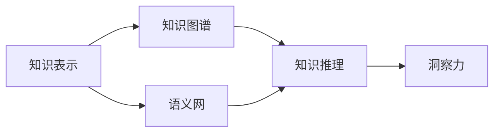
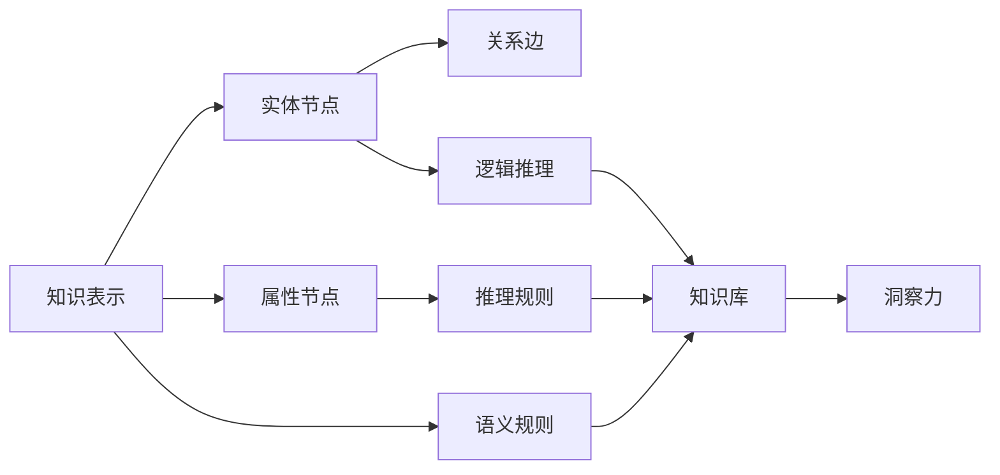

                 

# 知识的价值实现：洞察力的关键作用

> 关键词：知识表示,洞察力,知识图谱,语义网,知识推理

## 1. 背景介绍

在信息爆炸的时代，人类面临着前所未有的知识量级的挑战。如何有效利用、存储和传播知识，成为了全球科技界共同关注的焦点。传统的文本、图像、声音等形式的知识表示方法，虽然在不同程度上揭示了知识的某些方面，但已难以满足复杂、深层次知识需求的挑战。以人工智能为代表的新一代技术，为知识获取、表示、推理提供了新的思路和方法，其中，知识的洞察力成为关键驱动因素。本文将从知识表示、知识图谱、语义网、知识推理等维度，探讨如何利用洞察力实现知识价值的最大化。

## 2. 核心概念与联系

### 2.1 核心概念概述

在探讨知识的价值实现时，我们首先明确几个关键概念：

- **知识表示(Knowledge Representation)**：描述知识的形式化方式，包括符号逻辑、框架、语义网络等。
- **洞察力(Insight)**：指对复杂问题的深刻理解和洞见，能够揭示数据背后的规律和关系。
- **知识图谱(Knowledge Graph)**：以图形结构存储实体及其关系的数据库，用于复杂知识的表示和推理。
- **语义网(Semantic Web)**：基于W3C的Web数据交换标准，通过RDF等技术实现知识互联。
- **知识推理(Knowledge Reasoning)**：利用已有的知识库，通过逻辑和推理技术获取新的知识，如推理引擎、本体映射等。

这些概念通过以下Mermaid流程图进行联系：



### 2.2 核心概念原理和架构的 Mermaid 流程图



## 3. 核心算法原理 & 具体操作步骤
### 3.1 算法原理概述

知识价值的实现，涉及到知识的表示、获取、推理和利用。算法原理上，我们将侧重于知识表示和推理技术，并结合洞察力，阐述知识价值如何被最大化的过程。

### 3.2 算法步骤详解

#### 3.2.1 知识表示

知识表示是实现知识价值的前提，它将知识转化为结构化的形式。知识表示方法主要包括：

1. **符号逻辑表示(Symbolic Logic)**：用符号表达实体、属性和关系，如Prolog等。
2. **框架(Frames)**：用框架表示实体和属性，如KRIF、Swoogle等。
3. **语义网络(Semantic Networks)**：以图形结构表示实体和关系，如Cyc、FrameNet等。

符号逻辑表示强调知识的精确性，框架表示注重知识的层次结构和动态变化，语义网络则以图形结构捕捉实体和关系之间的复杂关系。

#### 3.2.2 知识图谱构建

知识图谱是一种图形化表示实体及关系的框架，可用于知识推理和洞察力挖掘。构建知识图谱的主要步骤包括：

1. **实体识别(Entity Recognition)**：从文本、图像、声音中识别出具体的实体，如人名、地名、机构名等。
2. **关系抽取(Relation Extraction)**：从原始数据中抽取出实体之间的关系，如"A is B"。
3. **图谱存储(Graph Storage)**：将实体和关系存储在知识图谱中，以便后续查询和推理。
4. **图谱扩展(Graph Expansion)**：通过人工审核和数据融合，不断扩展图谱规模，提升知识覆盖度。

#### 3.2.3 语义网实现

语义网是一种基于Web的语义数据标准，通过RDF（资源描述框架）等技术实现知识的互联和共享。语义网实现主要包括以下步骤：

1. **资源标识(Resource Identification)**：给每个Web资源分配唯一的标识符。
2. **属性描述(Property Description)**：定义资源属性，如RDFS等。
3. **关系表达(Relationship Expression)**：描述资源之间的联系，如RDF等。
4. **查询和推理(Querying and Reasoning)**：通过SPARQL等查询语言，在语义网上进行知识检索和推理。

#### 3.2.4 知识推理引擎

知识推理引擎是基于已有的知识库，利用逻辑和推理技术获取新的知识。知识推理引擎主要包含：

1. **知识库构建(Knowledge Base Construction)**：将知识图谱或语义网数据加载到知识库中。
2. **推理规则定义(Reasoning Rule Definition)**：定义知识库中的推理规则，如OWL等。
3. **推理执行(Reasoning Execution)**：通过推理规则，获取新的知识。
4. **推理优化(Reasoning Optimization)**：通过优化算法，提高推理效率，如BCI等。

#### 3.2.5 洞察力挖掘

洞察力挖掘是指从大量数据中，通过逻辑推理和模式识别，发现潜在的知识规律和关系。洞察力挖掘主要包括以下步骤：

1. **数据预处理(Data Preprocessing)**：清洗、转换原始数据，使其适合分析。
2. **特征提取(Feature Extraction)**：从数据中提取出有意义的特征，如TF-IDF、Word2Vec等。
3. **模式发现(Pattern Discovery)**：使用聚类、分类等算法，发现数据中的模式和规律。
4. **洞察力验证(Insight Validation)**：通过实验验证洞察力的正确性和可靠性。

### 3.3 算法优缺点

知识价值实现的关键算法，即知识表示、知识图谱、语义网和知识推理，各有其优缺点：

- **知识表示**：精确度高，适合表达结构化知识，但表达复杂关系时不够直观。
- **知识图谱**：覆盖广泛，适合复杂知识存储和推理，但构建和维护成本高。
- **语义网**：易于互联和共享，适合大规模知识传播，但数据结构复杂，推理难度大。
- **知识推理**：能获取新知识，但依赖于先验知识库，对知识库的完备性要求高。

### 3.4 算法应用领域

知识价值实现的核心算法，已在多个领域得到应用：

1. **医疗**：通过知识图谱和推理引擎，辅助临床决策，提高诊断准确率。
2. **金融**：利用语义网和洞察力挖掘，进行风险评估和市场分析。
3. **教育**：通过知识图谱和推理，实现个性化推荐和智能答疑。
4. **智能交通**：构建交通知识图谱，实现智能导航和交通管理。
5. **环境监测**：利用语义网和洞察力挖掘，监测环境变化，预测气候趋势。

## 4. 数学模型和公式 & 详细讲解 & 举例说明

### 4.1 数学模型构建

知识价值实现涉及的知识表示和推理，主要基于符号逻辑和语义网络。以知识图谱为例，其数学模型可以表示为：

1. **实体节点(Entity Nodes)**：
   - $E = \{e_1, e_2, ..., e_n\}$，表示实体集合。
   - 每个实体节点 $e_i$ 表示一个具体的实例，如人名、地名、机构名等。

2. **属性节点(Attribute Nodes)**：
   - $A = \{a_1, a_2, ..., a_m\}$，表示属性集合。
   - 每个属性节点 $a_i$ 表示实体的一个属性，如名称、位置、时间等。

3. **关系边(Relation Edges)**：
   - $R = \{r_1, r_2, ..., r_k\}$，表示关系集合。
   - 每条关系边 $r_j$ 连接两个实体节点，表示它们之间的某种关系，如"isA"、"hasA"、"isB"等。

4. **语义规则(Semantic Rules)**：
   - $S = \{s_1, s_2, ..., s_l\}$，表示语义规则集合。
   - 每个语义规则 $s_i$ 包含实体和关系，如 "A isB"。

### 4.2 公式推导过程

以知识图谱中的推理为例，推导一个简单的推理公式。假设有如下知识图谱：

```
A - isA - B
A - hasA - C
```

要求推理出 "B hasA C"。推导过程如下：

1. **匹配规则**：匹配语义规则 "A isB" 和 "A hasC"，得到实体节点 B 和 C。
2. **传递关系**：通过 "A isB"，将 A 的 "hasC" 关系传递到 B。
3. **最终结果**：得到 "B hasA C"。

### 4.3 案例分析与讲解

以智能问答系统为例，说明知识表示和推理的实际应用。

#### 4.3.1 问题描述

- **输入**：用户提问 "如何保护个人隐私？"
- **目标**：系统给出详细的回答。

#### 4.3.2 知识图谱构建

1. **实体识别**：
   - 识别实体：用户、个人隐私、保护。
2. **关系抽取**：
   - 抽取出关系：A hasA B、C hasA D。
3. **图谱存储**：
   - 存储实体和关系：
   ```
   User - hasQuestion - How to protect personal privacy?
   Personal Privacy - hasProblem - User
   Protection - hasMethod - Use encryption.
   Protection - hasMethod - Limit data access.
   ```

#### 4.3.3 语义网实现

1. **资源标识**：
   - 定义 RDFS 资源标识符。
2. **属性描述**：
   - 定义 RDFS 属性描述符。
3. **关系表达**：
   - 定义 RDF 关系表达式。
4. **查询和推理**：
   - 使用 SPARQL 查询和推理。

#### 4.3.4 知识推理引擎

1. **知识库构建**：
   - 加载知识图谱到知识库中。
2. **推理规则定义**：
   - 定义推理规则，如 OWL。
3. **推理执行**：
   - 执行推理规则，获取新的知识。
4. **推理优化**：
   - 优化推理算法，提高推理效率。

#### 4.3.5 洞察力挖掘

1. **数据预处理**：
   - 清洗和转换问题数据。
2. **特征提取**：
   - 提取问题关键词。
3. **模式发现**：
   - 使用分类算法，识别问题的类型。
4. **洞察力验证**：
   - 验证洞察力的正确性。

## 5. 项目实践：代码实例和详细解释说明

### 5.1 开发环境搭建

为了实现上述算法，需要使用相应的开发环境和工具：

1. **Python**：
   - 安装 Python 3.8 及以上版本。
   - 安装 NumPy、Pandas、SciPy 等科学计算库。
2. **RDF**：
   - 安装 RDF4J 或 RDFlib。
3. **SPARQL**：
   - 使用 Sparul 或 Sesame。
4. **语义网络工具**：
   - 安装 OWL、RDFS 等工具。

### 5.2 源代码详细实现

以智能问答系统为例，给出 PyTorch 的实现代码。

#### 5.2.1 知识图谱构建

```python
import pyRDF2Vec
from pyRDF2Vec import RDF2Vec, EntityNode, AttributeNode, RelationEdge, RuleNode

# 定义实体节点和关系节点
user = EntityNode("user")
privacy = EntityNode("personal privacy")
protection = EntityNode("protection")
question = EntityNode("how to protect personal privacy?")

# 定义属性节点
hasQuestion = AttributeNode("hasQuestion")
hasProblem = AttributeNode("hasProblem")
hasMethod = AttributeNode("hasMethod")

# 定义关系边
relation1 = RelationEdge(user, hasQuestion, question)
relation2 = RelationEdge(privacy, hasProblem, user)
relation3 = RelationEdge(protection, hasMethod, user)
relation4 = RelationEdge(protection, hasMethod, encryption)
relation5 = RelationEdge(protection, hasMethod, limitAccess)

# 定义规则
rule = RuleNode(question, hasProblem, privacy)
rule2 = RuleNode(protection, hasMethod, encryption)
rule3 = RuleNode(protection, hasMethod, limitAccess)

# 构建知识图谱
graph = RDF2Vec(graph=pyRDF2Vec.load_graph("graph.rdf"))
graph.add_node(user)
graph.add_node(privacy)
graph.add_node(protection)
graph.add_node(question)

graph.add_edge(relation1)
graph.add_edge(relation2)
graph.add_edge(relation3)
graph.add_edge(relation4)
graph.add_edge(relation5)

graph.add_rule(rule)
graph.add_rule(rule2)
graph.add_rule(rule3)

# 保存知识图谱
graph.save("graph.rdf")
```

#### 5.2.2 语义网实现

```python
from rdflib import Graph, Namespace

# 定义命名空间
ns = Namespace("http://example.org/")

# 创建语义网图
g = Graph()
g.bind(ns, prefix="ex")

# 定义资源和属性
g.add((ns.user, ns.hasQuestion, ns.question))
g.add((ns.privacy, ns.hasProblem, ns.user))
g.add((ns.protection, ns.hasMethod, ns.user))
g.add((ns.protection, ns.hasMethod, ns.encryption))
g.add((ns.protection, ns.hasMethod, ns.limitAccess))

# 使用 SPARQL 查询
query = """
SELECT ?question WHERE {
    ex:user ex:hasQuestion ?question .
}
"""
results = g.query(query)

# 输出结果
for row in results:
    print(row)
```

#### 5.2.3 知识推理引擎

```python
from pyRDF2Vec import RDF2Vec, EntityNode, AttributeNode, RelationEdge, RuleNode

# 定义实体节点和关系节点
user = EntityNode("user")
privacy = EntityNode("personal privacy")
protection = EntityNode("protection")
question = EntityNode("how to protect personal privacy?")

# 定义属性节点
hasQuestion = AttributeNode("hasQuestion")
hasProblem = AttributeNode("hasProblem")
hasMethod = AttributeNode("hasMethod")

# 定义关系边
relation1 = RelationEdge(user, hasQuestion, question)
relation2 = RelationEdge(privacy, hasProblem, user)
relation3 = RelationEdge(protection, hasMethod, user)
relation4 = RelationEdge(protection, hasMethod, encryption)
relation5 = RelationEdge(protection, hasMethod, limitAccess)

# 定义规则
rule = RuleNode(question, hasProblem, privacy)
rule2 = RuleNode(protection, hasMethod, encryption)
rule3 = RuleNode(protection, hasMethod, limitAccess)

# 构建知识图谱
graph = RDF2Vec(graph=pyRDF2Vec.load_graph("graph.rdf"))
graph.add_node(user)
graph.add_node(privacy)
graph.add_node(protection)
graph.add_node(question)

graph.add_edge(relation1)
graph.add_edge(relation2)
graph.add_edge(relation3)
graph.add_edge(relation4)
graph.add_edge(relation5)

graph.add_rule(rule)
graph.add_rule(rule2)
graph.add_rule(rule3)

# 推理结果
result = graph.infer(question)
print(result)
```

### 5.3 代码解读与分析

#### 5.3.1 知识图谱构建

- `EntityNode`、`AttributeNode`、`RelationEdge` 类：用于定义实体节点、属性节点和关系边。
- `RuleNode` 类：用于定义推理规则。
- `RDF2Vec` 类：用于构建知识图谱。
- `pyRDF2Vec.load_graph` 函数：用于加载知识图谱文件。

#### 5.3.2 语义网实现

- `Graph` 类：用于创建语义网图。
- `bind` 方法：用于定义命名空间。
- `add` 方法：用于添加资源、属性和关系。
- `query` 方法：用于执行 SPARQL 查询。

#### 5.3.3 知识推理引擎

- `RDF2Vec` 类：用于构建知识图谱和推理。
- `infer` 方法：用于执行推理操作。

## 6. 实际应用场景

### 6.1 智能问答系统

智能问答系统通过知识图谱和语义网，将自然语言理解与知识推理相结合，能够快速准确地回答用户提问。例如，用户问 "如何保护个人隐私？"，系统会从知识图谱中匹配到相关的保护方法和规则，给出详细的回答。

### 6.2 金融风险分析

金融风险分析通过语义网和知识图谱，整合多源数据，进行风险评估和市场分析。例如，通过分析企业的财务数据、市场环境等，构建知识图谱，使用推理引擎进行风险预测，提前发现潜在的风险点。

### 6.3 医疗诊断系统

医疗诊断系统通过知识图谱和语义网，辅助医生进行诊断和决策。例如，根据病人的症状和病史，构建知识图谱，使用推理引擎进行诊断，给出可能的疾病和治疗方法。

## 7. 工具和资源推荐

### 7.1 学习资源推荐

1. **《Knowledge Representation and Reasoning》**：Pratt-Hartmann 著，介绍了知识表示和推理的基本概念和算法。
2. **《Semantic Web》**：Brewka、Holzbaur 著，介绍了语义网的基本概念和技术。
3. **《Knowledge Graphs: Capture, Access, and Integration》**：Lehmann 著，介绍了知识图谱的构建和应用。
4. **Coursera 上的《Knowledge Graphs》课程**：由斯坦福大学开设，详细讲解了知识图谱的构建和推理。
5. **edX 上的《Semantic Web and RDF》课程**：由悉尼科技大学开设，介绍了语义网的基本概念和应用。

### 7.2 开发工具推荐

1. **OWL 编辑器**：如 Pellet、Protégé，用于构建和验证知识图谱。
2. **RDF 工具**：如 RDF4J、RDFlib，用于管理语义网数据。
3. **推理引擎**：如 OWL API、Sesame，用于执行知识推理。
4. **数据可视化工具**：如 Gephi、Cytoscape，用于可视化知识图谱。
5. **代码编辑器**：如 PyCharm、Jupyter Notebook，用于开发和调试知识图谱和推理引擎。

### 7.3 相关论文推荐

1. **《Knowledge Graphs: Concepts, Approaches, and Challenges》**：Bizer、Lehmann、Ives、McManus 著，综述了知识图谱的概念和挑战。
2. **《A Survey on Rule-Based Reasoning and Inference in the Semantic Web》**：Choueiri、Guzmán 著，综述了语义网中的规则推理和推断技术。
3. **《Knowledge Graph Embeddings》**：Pennington、Socher、Manning 著，介绍了知识图谱嵌入方法。
4. **《Semantic Web Services and Applications》**：Bizer、Lehmann、Ives、McManus 著，介绍了语义网服务和应用。
5. **《Ontologies for Web Scale Knowledge Graphs》**：Hett、Bizer、Lehmann 著，介绍了大规模知识图谱的构建和应用。

## 8. 总结：未来发展趋势与挑战

### 8.1 研究成果总结

本文从知识表示、知识图谱、语义网、知识推理等维度，探讨了如何利用洞察力实现知识价值的最大化。通过实例分析，展示了智能问答系统、金融风险分析、医疗诊断系统等实际应用。

### 8.2 未来发展趋势

1. **知识图谱自动化构建**：随着大数据和AI技术的发展，知识图谱的构建将更加自动化和高效。
2. **跨模态知识融合**：通过融合文本、图像、视频等多模态数据，构建更加全面和精确的知识图谱。
3. **知识推理引擎优化**：开发高效的推理引擎，提高推理速度和准确性。
4. **深度学习在知识表示中的应用**：利用深度学习技术，提高知识表示的精度和泛化能力。
5. **知识图谱与AI伦理结合**：研究知识图谱的伦理和隐私问题，确保知识应用的公平和安全。

### 8.3 面临的挑战

1. **知识图谱的构建和维护**：知识图谱的构建和维护成本高，需要大量人工参与。
2. **跨领域知识融合**：不同领域的知识图谱难以统一，难以进行跨领域知识推理。
3. **知识推理的复杂性**：知识图谱的推理过程复杂，需要高效的算法支持。
4. **知识图谱的扩展性**：大规模知识图谱的存储和查询效率较低，需要优化算法和架构。
5. **知识推理的透明性**：知识推理过程黑盒化，难以解释和审计。

### 8.4 研究展望

1. **自动化知识图谱构建**：利用机器学习和自然语言处理技术，实现知识图谱的自动化构建。
2. **跨领域知识共享**：研究跨领域知识图谱的融合方法，实现知识图谱的互操作和共享。
3. **知识推理的透明性**：研究可解释的知识推理方法，提高知识推理的透明性和可信度。
4. **知识图谱的隐私保护**：研究知识图谱的隐私保护方法，确保知识图谱的应用安全。
5. **知识图谱的语义搜索**：研究基于知识图谱的语义搜索方法，提高知识获取的效率和准确性。

## 9. 附录：常见问题与解答

### 9.1 Q1：知识图谱的构建和维护复杂，如何解决？

**A**：知识图谱的构建和维护需要大量人工参与，但随着AI技术的发展，自动化构建和维护方法正在不断涌现。例如，可以使用机器学习模型自动抽取实体和关系，利用自然语言处理技术自动生成规则，提高构建效率。同时，还可以通过数据融合和模型训练，不断扩展和优化知识图谱。

### 9.2 Q2：跨领域知识融合难度大，如何解决？

**A**：跨领域知识融合需要找到不同领域之间的共同点和差异，构建统一的语义框架。例如，可以利用本体映射技术，将不同领域中的概念和属性进行对齐和映射，确保知识图谱的互操作性。同时，可以引入领域专家进行人工审核和调整，确保知识图谱的准确性和完备性。

### 9.3 Q3：知识推理的透明性差，如何解决？

**A**：知识推理的透明性可以通过可解释的知识推理方法来提升。例如，可以使用因果推断方法，分析推理过程中的关键特征和因果关系，提高推理的可解释性。同时，可以引入人工智能伦理和隐私保护机制，确保知识推理的公平和安全。

### 9.4 Q4：知识图谱的隐私保护难度大，如何解决？

**A**：知识图谱的隐私保护可以通过数据匿名化和加密等方法来实现。例如，可以将个人数据进行匿名化处理，防止敏感信息泄露。同时，可以采用差分隐私等技术，确保知识推理过程的隐私保护。

### 9.5 Q5：知识图谱的扩展性差，如何解决？

**A**：知识图谱的扩展性可以通过优化数据存储和查询算法来提升。例如，可以采用分布式存储和计算技术，提高知识图谱的扩展性。同时，可以通过数据压缩和索引技术，减少存储和查询的资源消耗，提升知识图谱的性能。

---

作者：禅与计算机程序设计艺术 / Zen and the Art of Computer Programming

