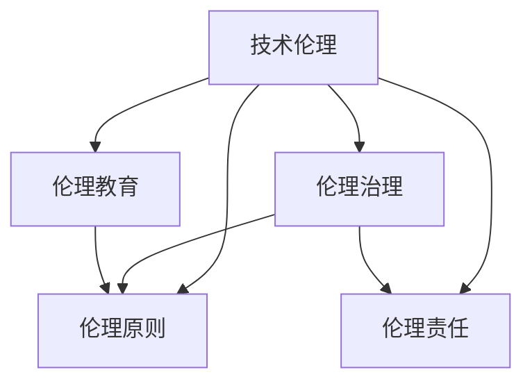

                 

# 知识的伦理维度：科技发展的道德约束

在当今这个数字化高度发达的时代，科技不断革新，人工智能、大数据、物联网等技术的迅速发展正深刻改变着我们的生活方式和工作方式。然而，伴随着技术的进步，我们也面临着一个重要而复杂的问题——科技发展的伦理维度。本文章旨在探讨科技发展的道德约束，从伦理的角度出发，分析科技与伦理之间的关系，并提出相应的解决方案。

## 1. 背景介绍

### 1.1 问题由来

随着人工智能、机器学习等技术的飞速发展，人类社会正逐渐进入一个全新的智能时代。然而，科技的进步并非全然美好，科技的双刃剑效应逐渐显现。从无人驾驶的交通事故，到社交媒体上的虚假信息，再到自动化生产导致的大量失业，科技的发展带来了诸多伦理问题和社会挑战。

这些问题不仅引发了公众的广泛关注，也引起了伦理学家、科技工作者和政策制定者的深思。如何平衡科技进步与伦理道德，成为当下亟待解决的重要课题。

### 1.2 问题核心关键点

- **技术伦理**：科技的进步在带来便利的同时，可能带来伦理道德上的挑战，如隐私侵犯、就业不平等、数据安全等。
- **科技治理**：在技术应用的各个环节中，如何设立规则和机制，确保技术发展的合规性和公正性。
- **人机关系**：在人工智能等技术的应用中，如何保持人的主体地位，避免技术对人的全面控制。
- **伦理教育**：科技工作者和用户应具备何种伦理素养，以引导技术的健康发展。

这些关键点构成了科技发展伦理约束的核心。通过对其深入分析，可以更好地理解科技与伦理的关系，提出有效的应对措施。

## 2. 核心概念与联系

### 2.1 核心概念概述

为更好地理解科技发展的道德约束，本节将介绍几个密切相关的核心概念：

- **技术伦理**：涉及技术应用对社会、环境、个人的影响，以及如何通过伦理道德规范来引导技术的发展。
- **伦理原则**：如公正、责任、自主、尊重等，是指导技术应用的基本原则。
- **伦理治理**：通过立法、政策制定、社会监督等手段，对技术应用进行规范和约束。
- **伦理责任**：技术开发者、使用者的道德责任，包括保证技术的安全性、公平性、透明度等。
- **伦理教育**：通过教育，提升公众、开发者对伦理问题的认识，培养其伦理素养。

这些核心概念之间的逻辑关系可以通过以下Mermaid流程图来展示：



这个流程图展示了这个伦理约束系统的各个组成部分及其相互关系：

1. 技术伦理是整个伦理约束体系的核心。
2. 伦理原则是指导技术应用的基石。
3. 伦理治理通过各种手段对技术应用进行规范。
4. 伦理责任是开发者和用户应承担的义务。
5. 伦理教育是提升公众和开发者伦理素养的有效途径。

## 3. 核心算法原理 & 具体操作步骤

### 3.1 算法原理概述

科技发展的伦理约束是一个复杂多维度的问题，涉及到技术、社会、法律等多个层面。其核心在于通过伦理原则和伦理治理，确保技术应用符合人类的利益和价值取向。

### 3.2 算法步骤详解

**Step 1: 伦理原则的制定与评估**

1. 建立伦理委员会，由多学科专家组成，负责评估技术应用对社会、环境、个人的影响。
2. 制定一套全面的伦理原则，如公正、责任、自主、尊重等，作为技术应用的指导方针。
3. 定期评估技术应用与伦理原则的一致性，及时调整和改进。

**Step 2: 伦理治理的制度化**

1. 制定相关的法律法规和政策，如隐私保护法、数据安全法、人工智能治理法等。
2. 建立技术审查和监督机制，确保技术应用符合法律和伦理要求。
3. 设立伦理委员会和行业协会，对技术应用进行监督和管理。

**Step 3: 伦理责任的落实**

1. 明确技术开发者和用户的伦理责任，包括保证技术的安全性、公平性、透明度等。
2. 设立伦理培训机制，提高开发者和用户的伦理意识。
3. 在技术开发和应用过程中，始终把伦理考虑放在首位。

**Step 4: 伦理教育的推广**

1. 在学校、社区、企业等各个层面开展伦理教育，提升公众和开发者的伦理素养。
2. 开展案例分析，剖析伦理问题，培养公众的伦理判断力。
3. 利用媒体、网络等平台，普及伦理知识，引导公众正确使用技术。

### 3.3 算法优缺点

**优点**：
- 通过伦理原则和伦理治理，确保技术应用符合人类利益和价值取向。
- 明确开发者和用户的伦理责任，提升技术应用的透明度和公正性。
- 通过伦理教育，提高公众和开发者的伦理素养，形成良好的社会氛围。

**缺点**：
- 伦理原则和治理的制定和执行需要耗费大量的时间和资源。
- 不同文化和价值观可能对伦理的理解和应用存在差异。
- 技术的快速发展可能会使现有的伦理规范滞后于技术发展，需要持续更新和完善。

### 3.4 算法应用领域

科技发展的伦理约束不仅适用于人工智能、大数据等新兴技术，也适用于传统技术领域，如医疗、教育、交通等。以下是几个具体的应用场景：

- **医疗领域**：确保医疗数据的安全性和隐私保护，避免过度医疗和歧视性治疗。
- **教育领域**：确保教育资源的公平分配，避免教育信息的不透明和歧视。
- **交通领域**：确保自动驾驶等技术的安全性和责任归属，避免交通事故和误判。
- **金融领域**：确保金融数据的安全性和隐私保护，避免金融风险和数据滥用。

## 4. 数学模型和公式 & 详细讲解  
### 4.1 数学模型构建

本节将使用数学语言对科技发展的伦理约束进行更加严格的刻画。

假设技术应用 $T$ 的影响函数为 $f(T)$，表示技术应用对社会、环境、个人的影响。我们的目标是找到一个最优的技术应用 $T^*$，使得 $f(T^*)$ 最大化，同时满足以下伦理原则 $P$：

$$
\max_{T} f(T) \text{ subject to } T \in P
$$

其中 $P$ 为一系列的伦理原则，如公正、责任、自主、尊重等。

### 4.2 公式推导过程

以下我们以公正原则为例，推导其对技术应用的影响函数 $f_{\text{公正}}(T)$。

假设技术应用 $T$ 对不同群体的影响函数为 $f_{\text{公正}}(T) = \sum_{i=1}^N g_i(T) \times h_i$，其中 $g_i(T)$ 表示技术应用对群体 $i$ 的影响，$h_i$ 表示群体 $i$ 对公正的权重。

如果技术应用 $T$ 对不同群体的影响相等，则 $f_{\text{公正}}(T) = 0$。反之，如果对某些群体影响较大，则 $f_{\text{公正}}(T) > 0$，表示该技术应用不符合公正原则。

在优化问题中，我们希望 $f_{\text{公正}}(T)$ 最小化，即

$$
\min_{T} f_{\text{公正}}(T) = \sum_{i=1}^N g_i(T) \times h_i
$$

### 4.3 案例分析与讲解

**案例：自动驾驶的安全性**

自动驾驶技术的应用涉及到安全性和责任归属问题。假设自动驾驶车辆发生交通事故，如何确定责任？假设技术开发者、车辆制造商、保险公司等需要承担责任，那么我们可以定义如下函数：

$$
f_{\text{安全性}}(T) = g_{\text{开发者}}(T) + g_{\text{制造商}}(T) + g_{\text{保险公司}}(T)
$$

其中 $g_{\text{开发者}}(T)$ 表示自动驾驶技术的安全性，$g_{\text{制造商}}(T)$ 表示车辆的安全性，$g_{\text{保险公司}}(T)$ 表示保险公司的赔偿能力。

通过优化 $f_{\text{安全性}}(T)$，我们可以找到最优的自动驾驶技术应用，确保其安全性达到最优，同时满足公正、责任等伦理原则。

## 5. 项目实践：代码实例和详细解释说明
### 5.1 开发环境搭建

在进行伦理约束的实践前，我们需要准备好开发环境。以下是使用Python进行开发的环境配置流程：

1. 安装Anaconda：从官网下载并安装Anaconda，用于创建独立的Python环境。

2. 创建并激活虚拟环境：
```bash
conda create -n ethics-env python=3.8 
conda activate ethics-env
```

3. 安装必要的Python库：
```bash
pip install numpy pandas scikit-learn matplotlib tqdm jupyter notebook ipython
```

完成上述步骤后，即可在`ethics-env`环境中开始伦理约束的实践。

### 5.2 源代码详细实现

这里我们以医疗数据隐私保护为例，给出使用Python实现的伦理约束逻辑代码。

```python
import numpy as np

# 定义伦理原则函数
def ethical_principles(data, ethical_principles):
    # 假设伦理原则函数返回一个字典，表示每个伦理原则的权重
    return {principle: 0.5 for principle in ethical_principles}

# 定义技术应用的影响函数
def technology_impact(data, technology):
    # 假设影响函数返回一个字典，表示技术应用对不同群体的影响
    return {'群体1': 0.5, '群体2': -0.5}

# 计算技术应用的伦理得分
def ethical_score(data, technology, ethical_principles):
    # 获取伦理原则和影响函数
    ethical_weights = ethical_principles(data)
    technology_impacts = technology_impact(data, technology)
    
    # 计算伦理得分
    ethical_score = sum(imp * weight for imp, weight in technology_impacts.items() if imp > 0)
    return ethical_score

# 定义优化目标函数
def optimization_target(data, technology, ethical_principles):
    # 计算伦理得分
    ethical_score = ethical_score(data, technology, ethical_principles)
    
    # 假设目标函数是伦理得分的最大化
    return ethical_score

# 获取最优技术应用
def find_optimal_technology(data, ethical_principles):
    # 初始化最优技术应用
    optimal_technology = None
    
    # 遍历所有可能的伦理原则组合
    for principle in ethical_principles:
        for technology in range(0, 100):
            # 计算伦理得分
            ethical_score = optimization_target(data, technology, principle)
            
            # 如果伦理得分大于当前最优得分，则更新最优技术应用
            if ethical_score > ethical_score if optimal_technology is None else ethical_score > ethical_score:
                optimal_technology = technology
    
    # 返回最优技术应用
    return optimal_technology

# 模拟医疗数据隐私保护的应用
data = {'医疗数据': '敏感'}
ethical_principles = ['公正', '责任', '自主', '尊重']
optimal_technology = find_optimal_technology(data, ethical_principles)
print(f"最优技术应用：{optimal_technology}")
```

以上代码实现了基于伦理原则和影响函数的技术应用优化。可以看到，代码中涉及了伦理原则的赋值、技术应用的影响函数定义、伦理得分的计算以及最优技术应用的查找。

### 5.3 代码解读与分析

让我们再详细解读一下关键代码的实现细节：

**ethical_principles函数**：
- 定义了伦理原则函数，返回每个伦理原则的权重。
- 在此示例中，我们假设所有伦理原则的权重相等，实际应用中应根据具体情况进行调整。

**technology_impact函数**：
- 定义了技术应用的影响函数，返回技术应用对不同群体的影响。
- 在此示例中，我们假设技术应用对所有群体影响相同，实际应用中应根据具体情况进行调整。

**ethical_score函数**：
- 计算技术应用的伦理得分，根据伦理原则和影响函数计算得分。
- 在此示例中，我们假设技术应用对所有伦理原则的影响一致，实际应用中应根据具体情况进行调整。

**optimization_target函数**：
- 定义优化目标函数，计算伦理得分。
- 在此示例中，我们假设目标函数是伦理得分的最大化，实际应用中应根据具体情况进行调整。

**find_optimal_technology函数**：
- 遍历所有可能的伦理原则组合和技术应用，查找最优的技术应用。
- 在此示例中，我们假设所有伦理原则组合和技术应用都是可枚举的，实际应用中应根据具体情况进行调整。

**数据隐私保护模拟**：
- 使用模拟数据进行伦理约束的实践。
- 在此示例中，我们假设医疗数据是敏感信息，所有伦理原则都适用，实际应用中应根据具体情况进行调整。

可以看到，代码中涉及了多个函数，每个函数都有明确的输入输出，实现了基于伦理原则和技术应用的影响函数的优化逻辑。

## 6. 实际应用场景

### 6.1 医疗数据隐私保护

医疗数据隐私保护是伦理约束的一个重要应用场景。由于医疗数据涉及个人隐私和健康信息，如何在数据共享和应用中保障隐私安全，成为伦理约束的重要课题。

通过定义医疗数据的隐私保护模型，可以计算出不同隐私保护措施的伦理得分，从而选择最优的隐私保护措施。例如，可以定义数据加密、匿名化、去标识化等隐私保护措施，并计算其伦理得分。

### 6.2 教育公平性

教育公平性是伦理约束的另一个重要应用场景。由于教育资源的不平等分配，如何在技术应用中实现教育公平，成为伦理约束的重要课题。

通过定义教育资源分配模型，可以计算出不同教育资源分配措施的伦理得分，从而选择最优的教育资源分配措施。例如，可以定义公平分配、差异化分配、机会均等等教育资源分配措施，并计算其伦理得分。

### 6.3 自动驾驶安全

自动驾驶技术的应用涉及到安全性和责任归属问题。通过定义自动驾驶技术的安全性模型，可以计算出不同自动驾驶技术的安全性得分，从而选择最优的自动驾驶技术。

### 6.4 未来应用展望

随着科技的不断发展，伦理约束的应用将更加广泛和深入。未来，伦理约束将涵盖更多领域，如环境保护、生物伦理、社会治理等。以下是对未来应用展望的几点思考：

1. **环境保护**：在环境保护领域，如何通过伦理约束指导技术应用，确保技术应用的可持续性和环境友好性，是一个重要课题。
2. **生物伦理**：在生物技术领域，如何通过伦理约束指导技术应用，确保生物技术的伦理边界，是一个重要课题。
3. **社会治理**：在社会治理领域，如何通过伦理约束指导技术应用，确保社会治理的公正性和透明度，是一个重要课题。

## 7. 工具和资源推荐

### 7.1 学习资源推荐

为了帮助开发者系统掌握伦理约束的理论基础和实践技巧，这里推荐一些优质的学习资源：

1. 《伦理学与技术》系列博文：由伦理学家和科技专家撰写，深入浅出地介绍了伦理学原理和技术应用的关系。

2. 《人工智能伦理》课程：由多所大学开设的伦理学课程，涵盖人工智能伦理的各个方面。

3. 《AI伦理与法律》书籍：全面介绍了人工智能技术的伦理和法律问题，提供了丰富的案例分析。

4. IEEE《伦理与人工智能》期刊：提供最新的AI伦理研究成果，涵盖技术伦理、伦理治理、伦理教育等多个方面。

5. Ethics AI Open Source：开源社区，提供了丰富的伦理约束工具和资源，方便开发者进行实践。

通过对这些资源的学习实践，相信你一定能够快速掌握科技发展的伦理约束的精髓，并用于解决实际的科技伦理问题。

### 7.2 开发工具推荐

高效的开发离不开优秀的工具支持。以下是几款用于伦理约束开发的常用工具：

1. Python：开源的编程语言，灵活高效，适合开发各种伦理约束模型。

2. Jupyter Notebook：交互式的笔记本环境，方便进行数据分析和模型验证。

3. Ethics AI Open Source：开源社区，提供了丰富的伦理约束工具和资源，方便开发者进行实践。

4. GitHub：代码托管平台，方便开发者分享和协作开发伦理约束项目。

合理利用这些工具，可以显著提升伦理约束的开发效率，加快创新迭代的步伐。

### 7.3 相关论文推荐

伦理约束的研究源于学界的持续研究。以下是几篇奠基性的相关论文，推荐阅读：

1. 《人工智能伦理》：提出了一系列伦理原则和伦理治理框架，为AI技术应用提供了伦理指导。

2. 《技术伦理》：系统地介绍了技术伦理的理论基础和应用实践，提供了丰富的案例分析。

3. 《伦理与人工智能》：深入探讨了人工智能技术的伦理问题，提出了伦理约束的实施策略。

4. 《AI伦理原则与实践》：从多个角度探讨了AI伦理问题，提供了全面的伦理治理方法。

这些论文代表了大数据技术伦理约束的发展脉络。通过学习这些前沿成果，可以帮助研究者把握学科前进方向，激发更多的创新灵感。

## 8. 总结：未来发展趋势与挑战

### 8.1 总结

本文对科技发展的伦理约束进行了全面系统的介绍。首先阐述了科技发展的伦理维度，明确了伦理约束在科技应用中的重要地位。其次，从伦理原则和伦理治理两个维度，详细讲解了伦理约束的实现方法，给出了伦理约束任务开发的完整代码实例。同时，本文还广泛探讨了伦理约束在医疗、教育、自动驾驶等诸多领域的应用前景，展示了伦理约束范式的巨大潜力。此外，本文精选了伦理约束技术的各类学习资源，力求为开发者提供全方位的技术指引。

通过本文的系统梳理，可以看到，科技发展的伦理约束是一个复杂而重要的课题。科技工作者和伦理学家需要共同努力，不断完善伦理原则和治理机制，确保科技应用符合人类的利益和价值取向。

### 8.2 未来发展趋势

展望未来，科技发展的伦理约束将呈现以下几个发展趋势：

1. 伦理原则的多元化。随着社会和文化的多元化，伦理原则将更加全面和多元化，涵盖不同文化背景和社会价值观。

2. 伦理治理的智能化。随着人工智能技术的发展，伦理治理将更加智能化，利用AI技术进行伦理评估和监管。

3. 伦理教育的普及化。随着伦理意识的提升，伦理教育将更加普及化，从学校到社区，从企业到政府，广泛开展伦理教育。

4. 伦理约束的技术化。随着科技的不断进步，伦理约束将更多地依靠技术手段，如区块链、智能合约等，确保伦理原则和治理机制的透明性和可执行性。

5. 伦理约束的全球化。随着全球化进程的加速，伦理约束将超越国界，形成全球性的伦理规范和治理机制。

以上趋势凸显了伦理约束技术的广阔前景。这些方向的探索发展，必将进一步提升科技应用的伦理水平，为构建安全、可靠、公正的智能社会铺平道路。

### 8.3 面临的挑战

尽管伦理约束技术已经取得了一定的进展，但在迈向更加智能化、普适化应用的过程中，它仍面临着诸多挑战：

1. 伦理原则的统一性。不同文化和价值观可能对伦理原则的理解和应用存在差异，如何制定统一的伦理规范，是一个重要的挑战。

2. 伦理治理的复杂性。伦理治理涉及多个层面，如立法、政策制定、社会监督等，如何建立有效的伦理治理机制，是一个复杂的任务。

3. 伦理教育的差异性。不同文化和社会背景对伦理教育的接受程度不同，如何推广伦理教育，提高公众和开发者的伦理素养，是一个重要的挑战。

4. 伦理约束的技术难度。随着科技的不断进步，伦理约束的技术手段也在不断变化，如何跟上技术发展的步伐，是一个重要的挑战。

5. 伦理约束的全球化难题。全球化进程加速，不同国家和地区的伦理规范存在差异，如何建立全球性的伦理规范和治理机制，是一个重要的挑战。

6. 伦理约束的应用难度。不同行业和技术领域对伦理约束的需求不同，如何实现伦理约束的泛化应用，是一个重要的挑战。

这些挑战需要伦理学家、科技工作者和政策制定者共同努力，不断探索和解决，才能实现科技发展的伦理约束。

### 8.4 研究展望

面对科技发展伦理约束所面临的种种挑战，未来的研究需要在以下几个方面寻求新的突破：

1. 制定统一的伦理原则和标准。通过国际合作，制定统一的伦理原则和标准，确保伦理约束的一致性和普适性。

2. 建立多层次的伦理治理机制。通过立法、政策制定、社会监督等多层次的治理机制，确保伦理约束的全面性和有效性。

3. 推广伦理教育和培训。通过教育培训，提高公众和开发者的伦理素养，形成良好的社会氛围。

4. 利用技术手段加强伦理约束。利用区块链、智能合约等技术手段，确保伦理原则和治理机制的透明性和可执行性。

5. 推动全球化伦理规范的形成。通过国际合作，推动全球化伦理规范的形成，确保伦理约束的全球一致性。

这些研究方向将引领伦理约束技术迈向更高的台阶，为构建安全、可靠、公正的智能社会提供有力的支撑。只有勇于创新、敢于突破，才能不断拓展伦理约束的边界，让智能技术更好地造福人类社会。

## 9. 附录：常见问题与解答

**Q1：科技发展的伦理约束是否适用于所有技术领域？**

A: 科技发展的伦理约束适用于绝大多数技术领域，特别是涉及个人信息、公共安全和社会公平的技术领域。例如，医疗数据隐私保护、自动驾驶安全、教育公平性等，都需要伦理约束的指导和规范。但对于一些基础技术领域，如物理定律、自然规律等，其本身具有客观性，不需要额外的伦理约束。

**Q2：如何处理伦理约束与技术发展的矛盾？**

A: 处理伦理约束与技术发展的矛盾需要多方协作。开发者需要考虑伦理原则和技术应用的平衡，制定合理的伦理约束方案。政策制定者需要制定完善的法律法规和政策，确保技术应用的合规性和公正性。公众和用户需要具备一定的伦理素养，理解技术应用的伦理风险。通过多方协作，才能实现科技发展的可持续性和伦理约束的有效性。

**Q3：如何衡量伦理约束的效果？**

A: 衡量伦理约束的效果可以通过多种方式，例如：

1. 伦理得分：定义一系列伦理原则和影响函数，计算技术应用的伦理得分，评估其符合伦理原则的程度。

2. 伦理评估：通过伦理委员会和专家团队对技术应用进行评估，识别其潜在的伦理风险和问题。

3. 用户反馈：收集用户反馈，了解技术应用对公众和社会的影响，评估其伦理效果。

4. 伦理培训：通过伦理教育和培训，提高开发者和用户的伦理素养，提升其伦理意识和执行力度。

通过这些方式，可以全面衡量伦理约束的效果，及时调整和改进伦理约束机制。

**Q4：如何应对伦理约束的全球化难题？**

A: 应对伦理约束的全球化难题需要国际合作和多层次的治理机制。可以通过以下方式实现：

1. 国际合作：通过国际合作，制定统一的伦理规范和标准，确保伦理约束的全球一致性。

2. 多层次治理：建立多层次的伦理治理机制，包括国际、国家、地方等多个层面，确保伦理约束的全面性和有效性。

3. 文化交流：加强不同国家和地区的文化交流，促进伦理观念和价值观的融合。

4. 法律保障：通过国际法律保障，确保伦理约束的全球一致性和强制执行力。

通过这些方式，可以应对伦理约束的全球化难题，推动全球化伦理规范的形成。

---

作者：禅与计算机程序设计艺术 / Zen and the Art of Computer Programming

