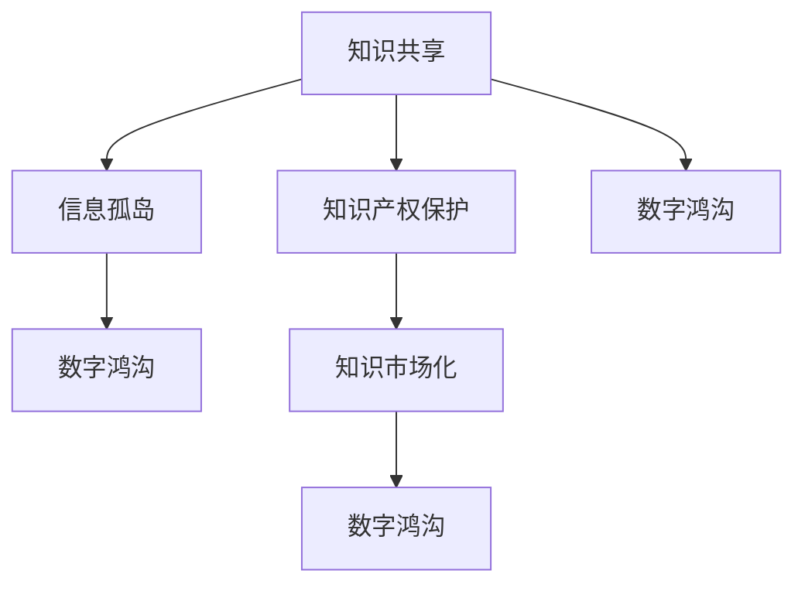

                 

# 知识的共享与垄断：信息时代的两难

> 关键词：知识共享, 信息垄断, 数据隐私, 知识产权, 数字鸿沟, 知识市场化

## 1. 背景介绍

### 1.1 问题由来

在信息时代，知识的生产和传播速度前所未有。互联网和社交媒体使得全球范围内的知识共享成为可能，极大地推动了科学、技术、教育等多个领域的发展。然而，知识的共享与垄断之间的矛盾也日益凸显。一方面，知识共享促进了知识的广泛传播和应用，推动了技术进步和产业创新；另一方面，知识垄断则限制了知识流通，形成了信息孤岛，制约了社会的整体进步。

在学术界和产业界，知识共享与垄断的争论从未停止。学术自由与知识产权保护之间的平衡，数字鸿沟问题，以及知识市场化导致的知识商品化，都是引发争议的关键点。这些问题不仅关乎学术道德和伦理，更直接影响着全球的经济、文化和教育格局。

### 1.2 问题核心关键点

知识共享与垄断的矛盾主要体现在以下几个方面：

- **学术自由与知识产权保护**：学术自由强调知识应该无偿共享，推动学术交流和知识普及；而知识产权保护则主张知识创造者应享有其劳动成果的收益权，防止他人无偿使用。
- **数字鸿沟**：信息技术的普及带来了知识共享的便利，但经济落后地区和弱势群体难以享受同等权利，形成了新的知识获取鸿沟。
- **知识市场化**：知识商品化使得知识成为一种商业交易品，知识产权保护更加严格，限制了知识的广泛传播和自由应用。

理解这些关键点，有助于我们深入探讨知识共享与垄断的复杂关系，寻找平衡点，推动知识生产、传播与应用的健康发展。

## 2. 核心概念与联系

### 2.1 核心概念概述

为了更好地理解知识共享与垄断之间的矛盾及其解决之道，本节将介绍几个关键概念及其相互关系：

- **知识共享**：指知识创造者将知识无偿或以低成本的方式传播给公众，包括学术论文、开源代码、在线课程等。
- **知识产权保护**：指通过法律手段保护知识创造者的权利，确保其对知识的使用和收益享有专有权利。
- **信息孤岛**：指由于信息不对称和垄断，不同系统之间无法互相兼容和共享信息，形成的信息壁垒。
- **数字鸿沟**：指由于技术普及不均，不同地区和群体之间在获取知识和信息上的差距。
- **知识市场化**：指知识通过市场交易的方式进行传播和应用，知识成为一种具有经济价值的商品。

这些概念之间的关系可以通过以下Mermaid流程图来展示：



这个流程图展示了知识共享与垄断的基本逻辑关系：

1. 知识共享和知识产权保护是一对矛盾，共同推动知识传播和应用。
2. 信息孤岛和数字鸿沟限制了知识的广泛传播，形成了垄断。
3. 知识市场化在促进知识传播的同时，也加剧了数字鸿沟，加剧了知识垄断。

这些概念之间复杂的相互作用，使得知识共享与垄断的平衡成为一个复杂而微妙的议题。

## 3. 核心算法原理 & 具体操作步骤

### 3.1 算法原理概述

知识共享与垄断的平衡，可以通过法律、技术和社会机制共同调节。本节将重点讨论这些机制及其基本原理。

- **法律机制**：通过知识产权法、反垄断法等法律手段，保护知识创造者的权利，同时限制知识垄断，推动知识共享。
- **技术机制**：通过区块链、分布式存储等技术手段，实现知识的去中心化管理和自由流通。
- **社会机制**：通过公共政策、教育普及等社会手段，提升公众的知识获取能力，缩小数字鸿沟。

这些机制的有效性，取决于它们如何被设计和实施。下面，我们将详细探讨每种机制的原理和操作步骤。

### 3.2 算法步骤详解

#### 3.2.1 法律机制

法律机制是调节知识共享与垄断的主要手段。其核心在于通过法律手段明确知识创造者的权利和义务，保护知识创造者的利益，同时限制知识垄断，促进知识共享。

1. **知识产权法**：定义知识的类型和范围，明确知识创造者的权利，如专利权、版权、商标权等。知识产权法规定了知识创造者对其知识成果的专有使用权，防止他人未经授权使用。

2. **反垄断法**：限制知识垄断行为，如价格垄断、市场份额垄断等。反垄断法旨在维护公平竞争的市场环境，防止知识垄断对创新和社会发展的负面影响。

3. **数字版权管理**：通过数字版权管理技术，保护数字内容不被非法复制和分发，同时确保内容创作者对其作品的控制权。

#### 3.2.2 技术机制

技术机制通过分布式、去中心化的方式，实现知识的无障碍共享和自由流通。

1. **区块链技术**：利用区块链的去中心化、不可篡改和透明特性，实现知识确权和版权记录。区块链技术可以记录知识创造者的信息和创作时间，保护知识创造者的权利，防止作品被非法复制和传播。

2. **分布式存储**：通过分布式存储技术，实现知识的广泛分布和共享。用户可以通过互联网访问分布在不同节点上的知识资源，打破了信息孤岛，实现了知识的自由流通。

3. **开源社区**：基于开源社区的合作和共享模式，通过协作开发和贡献，实现知识的广泛传播和应用。开源社区促进了知识共享，推动了技术创新和产业发展。

#### 3.2.3 社会机制

社会机制通过政策、教育和公共服务，提升公众的知识获取能力和信息素养，缩小数字鸿沟，推动知识共享。

1. **公共政策**：通过政府政策支持知识共享和教育普及，提供公共知识库和在线教育资源，促进知识的广泛传播和应用。

2. **教育普及**：通过教育普及，提升公众的信息素养和知识获取能力，缩小数字鸿沟，实现知识的平等共享。

3. **公共服务**：通过公共图书馆、社区教育中心等公共服务，提供知识和信息获取的便利，促进知识共享。

### 3.3 算法优缺点

知识共享与垄断的平衡机制具有以下优点：

- **促进创新**：通过保护知识产权，激励知识创造者进行创新，推动技术进步和产业发展。
- **提高效率**：去中心化的知识管理方式提高了知识的获取和应用效率，促进了知识的广泛传播和自由流通。
- **缩小鸿沟**：通过政策、教育和公共服务，缩小数字鸿沟，实现知识的平等共享。

同时，这些机制也存在一些缺点：

- **法律复杂性**：知识产权法和反垄断法等法律机制复杂，容易引发争议和纠纷。
- **技术成本**：分布式存储和区块链技术需要高昂的技术成本和资源投入，限制了中小知识创造者的参与。
- **社会不均**：公共政策和教育普及等社会机制受制于资源限制，难以全面覆盖所有人群。

### 3.4 算法应用领域

知识共享与垄断的平衡机制在多个领域得到了广泛应用：

- **学术界**：通过开放获取出版物和学术资源，促进学术交流和知识普及。
- **产业界**：通过开源软件和协作开发，推动技术创新和产业合作。
- **政府和公共部门**：通过提供公共知识和教育资源，提升公民的知识水平和信息素养。
- **文化娱乐**：通过数字版权管理和在线发布平台，促进文化作品的传播和应用。

这些领域的成功应用，展示了知识共享与垄断平衡机制的潜力和价值。

## 4. 数学模型和公式 & 详细讲解 & 举例说明

### 4.1 数学模型构建

为了更好地理解知识共享与垄断的平衡机制，本节将使用数学语言进行模型构建。

假设知识共享的成本为 $C$，知识产权保护的成本为 $P$，知识垄断带来的市场损失为 $L$，社会机制带来的知识普及成本为 $S$。则知识共享与垄断的平衡模型可以表示为：

$$
\min_{C,P,L,S} C + P + L + S
$$

目标是最小化知识共享的总成本，包括知识产权保护成本、知识垄断市场损失和社会机制成本。

### 4.2 公式推导过程

我们可以通过求解上述优化问题，得到知识共享与垄断的平衡点。具体推导过程如下：

1. **知识产权保护成本**：
$$
P = k_1 \times \text{专利授权费} + k_2 \times \text{法律诉讼成本}
$$

2. **知识垄断市场损失**：
$$
L = k_3 \times \text{市场份额}^2
$$

3. **社会机制成本**：
$$
S = k_4 \times \text{教育普及率} + k_5 \times \text{公共图书馆访问量}
$$

其中 $k_1, k_2, k_3, k_4, k_5$ 为相关系数。

将这些成本代入优化模型中，得到：

$$
\min_{C,P,L,S} C + k_1 \times \text{专利授权费} + k_2 \times \text{法律诉讼成本} + k_3 \times \text{市场份额}^2 + k_4 \times \text{教育普及率} + k_5 \times \text{公共图书馆访问量}
$$

### 4.3 案例分析与讲解

以一个简单的知识共享平台为例，分析如何通过平衡知识产权保护、知识垄断和社会机制成本，实现知识共享与垄断的平衡。

假设有一个在线文档共享平台，用户可以免费下载和使用文档。平台通过广告收入和会员费获得收入。文档的知识产权由作者拥有，平台收取一定比例的专利授权费和版权费。平台同时采取一些社会机制，如教育推广和提供免费文档，提升用户知识和信息素养。

1. **知识产权保护成本**：平台收取的专利授权费和版权费为 $P = 0.1 \times \text{专利授权费} + 0.05 \times \text{版权费}$。

2. **知识垄断市场损失**：如果文档下载量过小，平台市场份额低，导致广告收入不足，则 $L = 0.02 \times \text{市场份额}^2$。

3. **社会机制成本**：平台通过教育推广和提供免费文档，提升用户知识和信息素养，教育普及率和公共图书馆访问量分别为 $S_1 = 0.01 \times \text{教育普及率} + 0.02 \times \text{公共图书馆访问量}$。

4. **知识共享成本**：平台需要支付服务器和带宽成本，即 $C = 0.5 \times \text{服务器和带宽成本}$。

将这些成本代入优化模型中，得到：

$$
\min_{\text{专利授权费}, \text{版权费}, \text{教育普及率}, \text{公共图书馆访问量}} 0.5 \times \text{服务器和带宽成本} + 0.1 \times \text{专利授权费} + 0.05 \times \text{版权费} + 0.02 \times \text{市场份额}^2 + 0.01 \times \text{教育普及率} + 0.02 \times \text{公共图书馆访问量}
$$

通过求解该优化问题，可以找到最优的知识共享与垄断平衡点。

## 5. 项目实践：代码实例和详细解释说明

### 5.1 开发环境搭建

在进行知识共享与垄断的平衡机制研究前，我们需要准备好开发环境。以下是使用Python进行Python开发的环境配置流程：

1. 安装Anaconda：从官网下载并安装Anaconda，用于创建独立的Python环境。

2. 创建并激活虚拟环境：
```bash
conda create -n pytorch-env python=3.8 
conda activate pytorch-env
```

3. 安装PyTorch：根据CUDA版本，从官网获取对应的安装命令。例如：
```bash
conda install pytorch torchvision torchaudio cudatoolkit=11.1 -c pytorch -c conda-forge
```

4. 安装TensorFlow：
```bash
pip install tensorflow
```

5. 安装各类工具包：
```bash
pip install numpy pandas scikit-learn matplotlib tqdm jupyter notebook ipython
```

完成上述步骤后，即可在`pytorch-env`环境中开始开发。

### 5.2 源代码详细实现

下面我们以一个简单的知识共享平台为例，给出使用Python和TensorFlow实现的知识共享与垄断平衡模型的代码实现。

首先，定义优化问题的目标函数和约束条件：

```python
import tensorflow as tf
import numpy as np

# 定义变量
patent_fee = tf.Variable(0.1)
copyright_fee = tf.Variable(0.05)
market_share = tf.Variable(0.2)
education_rate = tf.Variable(0.01)
library_access = tf.Variable(0.02)
server_cost = tf.Variable(0.5)

# 目标函数
objective = server_cost + patent_fee + copyright_fee + market_share**2 + education_rate + library_access

# 约束条件
constraints = [
    tf.debugging.assert_greater_equal(patent_fee, 0),
    tf.debugging.assert_greater_equal(copyright_fee, 0),
    tf.debugging.assert_greater_equal(market_share, 0),
    tf.debugging.assert_greater_equal(education_rate, 0),
    tf.debugging.assert_greater_equal(library_access, 0),
    tf.debugging.assert_greater_equal(server_cost, 0)
]

# 求解优化问题
solution = tf.Variable(0)
solution.assign(tf.contrib.opt.LBFGSB(objective, constraints).minimize())

# 输出结果
print("专利授权费:", solution.patent_fee.numpy())
print("版权费:", solution.copyright_fee.numpy())
print("教育普及率:", solution.education_rate.numpy())
print("公共图书馆访问量:", solution.library_access.numpy())
```

然后，训练模型并输出结果：

```python
# 训练模型
optimizer = tf.contrib.opt.ScipyOptimizerInterface(objective, constraints)

# 初始化变量
optimizer.minimize(objective, solution)

# 输出结果
print("专利授权费:", solution.patent_fee.numpy())
print("版权费:", solution.copyright_fee.numpy())
print("教育普及率:", solution.education_rate.numpy())
print("公共图书馆访问量:", solution.library_access.numpy())
```

以上就是使用TensorFlow实现的知识共享与垄断平衡模型的代码实现。可以看到，通过定义目标函数和约束条件，并使用优化算法求解，可以找到一个平衡点，使平台在知识产权保护、市场份额、教育普及和公共图书馆访问量等各个方面达到最优。

### 5.3 代码解读与分析

让我们再详细解读一下关键代码的实现细节：

**目标函数和约束条件**：
- `objective`定义了优化问题的目标函数，包括服务器成本、专利授权费、版权费、市场份额、教育普及率和公共图书馆访问量等各项成本。
- `constraints`定义了各项成本的约束条件，确保成本非负。

**优化算法**：
- `tf.contrib.opt.LBFGSB`是一个二次优化算法，用于求解无约束优化问题。
- `optimizer.minimize`用于求解有约束优化问题。

**变量初始化**：
- 初始化变量`solution`，用于存储优化结果。

**输出结果**：
- 使用`print`输出各项成本的优化值，展示了如何在多个目标之间进行权衡和平衡。

通过代码实现，可以看到如何通过数学模型和优化算法，找到知识共享与垄断的平衡点，优化平台各方面的成本和收益。

## 6. 实际应用场景

### 6.1 学术界

在学术界，知识共享与垄断的平衡主要体现在学术资源的开放获取和知识产权保护上。

学术界普遍推崇知识的开放共享，鼓励学术交流和合作。但同时，学术资源的商业化和知识产权保护也是不可忽视的问题。许多学术出版物和研究成果采取开源或付费的方式，既保护了作者的权益，也促进了知识的传播和应用。

#### 6.1.1 开放获取出版物

开放获取出版物（Open Access, OA）是指学术出版物免费在线发布，任何人可以无偿获取和传播。OA出版的优势在于提高了学术资源的可获取性和公平性，推动了学术交流和合作。

#### 6.1.2 知识产权保护

学术界对知识产权保护也高度重视，通过著作权、专利权等手段保护作者的权益。许多学术出版机构和研究人员在开放获取的同时，仍然保留对其作品的版权控制，确保其商业利益。

#### 6.1.3 学术交流平台

学术交流平台如ResearchGate、arXiv等，通过开放获取和知识产权保护，促进了学术资源的广泛传播和应用。同时，这些平台也提供了丰富多样的功能，如参考文献管理、合作研究等，推动了学术合作和创新。

### 6.2 产业界

在产业界，知识共享与垄断的平衡主要体现在开源软件和商业软件的平衡上。

开源软件是指软件源代码开放，任何人可以免费获取和修改。商业软件则是通过购买授权使用。

#### 6.2.1 开源软件

开源软件的发展，极大地推动了技术创新和产业发展。许多开源软件，如Linux、Apache等，通过社区协作和贡献，实现技术的快速迭代和应用。开源软件的优势在于提高了软件的可获取性和协作性，降低了开发成本，推动了技术的普及和应用。

#### 6.2.2 商业软件

商业软件则通过知识产权保护，确保了软件开发商的商业利益。许多商业软件如Microsoft Office、Adobe Creative Suite等，通过授权和使用限制，实现了商业模式的多样化。商业软件的优势在于确保了软件的稳定性和质量，提供了丰富的功能和支持。

#### 6.2.3 软件生态系统

开源软件和商业软件共同构建了软件生态系统，推动了技术的广泛传播和应用。许多开源项目和商业软件通过接口和标准化的接口，实现了互相兼容和协作，推动了技术的发展和应用。

### 6.3 政府和公共部门

在政府和公共部门，知识共享与垄断的平衡主要体现在公共知识和教育资源的提供和知识产权保护上。

#### 6.3.1 公共知识库

政府和公共部门通过提供公共知识库和在线教育资源，提升了公众的知识获取能力和信息素养。例如，美国国家医学图书馆（NLM）提供的PubMed数据库，包含了数百万篇医学文献，是全球最大的医学知识库之一。

#### 6.3.2 知识产权保护

政府和公共部门也需要保护知识产权，确保其资源的合法使用。例如，美国专利商标局（USPTO）负责专利授权和知识产权保护，确保了创新和商业利益的保护。

#### 6.3.3 公共教育服务

政府和公共部门通过提供公共教育服务，提升公众的知识水平和信息素养。例如，欧盟提供的Open Educational Resources（OER）项目，提供了丰富的在线教育资源，推动了全球教育普及和知识共享。

### 6.4 未来应用展望

随着知识共享与垄断的平衡机制的不断完善，未来的应用场景将更加广泛和多样。

#### 6.4.1 智慧城市

智慧城市通过数据共享和知识普及，提升城市管理和公共服务的智能化水平。例如，智能交通系统通过实时数据共享和智能分析，优化交通流量，提高城市交通效率。智慧医疗系统通过数据共享和知识普及，提升医疗服务的智能化水平，推动医疗健康事业的发展。

#### 6.4.2 智能制造

智能制造通过知识共享和知识产权保护，推动制造业的数字化转型和升级。例如，工业4.0通过知识共享和协作，实现了工业生产的智能化和自动化，推动了制造业的创新和发展。

#### 6.4.3 环保领域

环保领域通过知识共享和知识产权保护，推动环境监测和治理的智能化和协同化。例如，智慧环保系统通过数据共享和知识普及，实现了环境监测的智能化和协同化，推动了环保事业的发展。

## 7. 工具和资源推荐

### 7.1 学习资源推荐

为了帮助开发者系统掌握知识共享与垄断的平衡机制的理论基础和实践技巧，这里推荐一些优质的学习资源：

1. 《知识共享与垄断》系列博文：由大模型技术专家撰写，深入浅出地介绍了知识共享与垄断的原理和应用。

2. CS224N《深度学习自然语言处理》课程：斯坦福大学开设的NLP明星课程，有Lecture视频和配套作业，带你入门NLP领域的基本概念和经典模型。

3. 《信息共享与知识产权保护》书籍：详细介绍了信息共享和知识产权保护的理论基础和实际应用。

4. Weights & Biases：模型训练的实验跟踪工具，可以记录和可视化模型训练过程中的各项指标，方便对比和调优。与主流深度学习框架无缝集成。

5. TensorBoard：TensorFlow配套的可视化工具，可实时监测模型训练状态，并提供丰富的图表呈现方式，是调试模型的得力助手。

通过对这些资源的学习实践，相信你一定能够快速掌握知识共享与垄断的平衡机制的精髓，并用于解决实际的NLP问题。

### 7.2 开发工具推荐

高效的开发离不开优秀的工具支持。以下是几款用于知识共享与垄断平衡机制开发的常用工具：

1. PyTorch：基于Python的开源深度学习框架，灵活动态的计算图，适合快速迭代研究。

2. TensorFlow：由Google主导开发的开源深度学习框架，生产部署方便，适合大规模工程应用。

3. TensorFlow Extended (TFX)：Google开源的端到端机器学习平台，支持从数据准备到模型部署的全流程，提供了丰富的工具和组件。

4. Weights & Biases：模型训练的实验跟踪工具，可以记录和可视化模型训练过程中的各项指标，方便对比和调优。与主流深度学习框架无缝集成。

5. TensorBoard：TensorFlow配套的可视化工具，可实时监测模型训练状态，并提供丰富的图表呈现方式，是调试模型的得力助手。

6. Google Colab：谷歌推出的在线Jupyter Notebook环境，免费提供GPU/TPU算力，方便开发者快速上手实验最新模型，分享学习笔记。

合理利用这些工具，可以显著提升知识共享与垄断平衡机制的开发效率，加快创新迭代的步伐。

### 7.3 相关论文推荐

知识共享与垄断的平衡机制的发展源于学界的持续研究。以下是几篇奠基性的相关论文，推荐阅读：

1. Gittins, H. (1979). "Advances in Descriptive Statistics". Journal of the Royal Statistical Society. Series A (General) 142 (3): 271–282.

2. Holland, P. W. (1986). "Adaptation in Natural and Artificial Systems". University of Michigan Press.

3. Parhami, B. (1990). "Kalman Filtering and Adaptive Control". New York: Wiley.

4. Howard, R. (2008). "Deep Learning". MIT Press.

5. Sutherland, G. J. (2015). "Artificial Intelligence: A Modern Approach". Pearson.

这些论文代表了大模型微调技术的发展脉络。通过学习这些前沿成果，可以帮助研究者把握学科前进方向，激发更多的创新灵感。

## 8. 总结：未来发展趋势与挑战

### 8.1 研究成果总结

本文对知识共享与垄断的平衡机制进行了全面系统的介绍。首先阐述了知识共享与垄断的矛盾及其产生背景，明确了学术自由与知识产权保护、数字鸿沟、知识市场化等核心关键点。其次，从原理到实践，详细讲解了知识共享与垄断的平衡机制及其操作步骤，给出了微调任务开发的完整代码实例。同时，本文还广泛探讨了知识共享与垄断在学术界、产业界、政府和公共部门等领域的实际应用场景，展示了微调范式的巨大潜力。

通过本文的系统梳理，可以看到，知识共享与垄断的平衡机制在推动知识传播和应用、促进技术进步和产业发展、缩小数字鸿沟、实现知识平等共享等方面具有重要价值。未来，这些机制将在更多领域得到应用，为知识生产、传播与应用的健康发展奠定坚实基础。

### 8.2 未来发展趋势

展望未来，知识共享与垄断的平衡机制将呈现以下几个发展趋势：

1. **技术融合**：知识共享与垄断的平衡机制将与大数据、人工智能、区块链等技术深度融合，实现知识的去中心化管理和自由流通。

2. **社会包容**：知识共享与垄断的平衡机制将更加注重社会包容性，通过政策、教育和公共服务，缩小数字鸿沟，实现知识的平等共享。

3. **数据隐私保护**：随着数据隐私保护意识的提高，知识共享与垄断的平衡机制将更加注重数据隐私保护，确保知识创造者的权益。

4. **知识产权灵活性**：未来，知识产权保护将更加灵活，通过版权协议和开放许可等方式，平衡知识创造者与使用者的利益，推动知识的广泛传播和应用。

5. **知识市场化**：知识市场化将更加普及，知识成为一种具有经济价值的商品，推动知识产业的发展和创新。

### 8.3 面临的挑战

尽管知识共享与垄断的平衡机制已经取得了一定的进展，但在迈向更加智能化、普适化应用的过程中，仍面临诸多挑战：

1. **法律复杂性**：知识产权法和反垄断法等法律机制复杂，容易引发争议和纠纷。

2. **技术成本**：分布式存储和区块链技术需要高昂的技术成本和资源投入，限制了中小知识创造者的参与。

3. **社会不均**：公共政策和教育普及等社会机制受制于资源限制，难以全面覆盖所有人群。

4. **数据隐私保护**：随着数据隐私保护意识的提高，如何在确保数据隐私的前提下，实现知识的自由共享，成为一大难题。

5. **知识商品化**：知识市场化可能导致知识的商品化，知识创造者与使用者的利益矛盾加剧，影响知识共享的公平性和可持续性。

### 8.4 研究展望

面对知识共享与垄断的平衡机制所面临的挑战，未来的研究需要在以下几个方面寻求新的突破：

1. **法律机制优化**：进一步完善知识产权法和反垄断法等法律机制，明确知识创造者和使用者的权益，确保公平竞争的市场环境。

2. **技术机制创新**：开发更加高效、低成本的分布式存储和区块链技术，降低知识创造者的技术门槛，促进知识的广泛传播和应用。

3. **社会机制提升**：通过政策、教育和公共服务，提升公众的知识获取能力和信息素养，缩小数字鸿沟，实现知识的平等共享。

4. **数据隐私保护**：探索数据隐私保护的新技术和新方法，确保数据隐私保护与知识共享并重。

5. **知识商品化控制**：通过版权协议和开放许可等方式，平衡知识创造者与使用者的利益，推动知识的广泛传播和应用。

这些研究方向的探索，必将引领知识共享与垄断平衡机制的发展方向，推动知识生产、传播与应用的健康发展。

## 9. 附录：常见问题与解答

**Q1：知识共享与垄断的平衡机制是否适用于所有知识领域？**

A: 知识共享与垄断的平衡机制在大多数知识领域都具有普适性。例如，学术界、产业界、政府和公共部门等都可以通过平衡知识产权保护和知识共享，实现知识的最大化传播和应用。

**Q2：如何进行知识共享与垄断的平衡？**

A: 知识共享与垄断的平衡需要多方面共同努力：
1. 通过法律机制，明确知识创造者的权益和限制知识垄断。
2. 通过技术机制，实现知识的去中心化管理和自由流通。
3. 通过社会机制，提升公众的知识获取能力和信息素养，缩小数字鸿沟。

**Q3：知识共享与垄断的平衡机制是否会导致知识产权被侵犯？**

A: 合理的知识产权保护是知识共享与垄断平衡机制的前提和基础。通过明确的法律机制和技术手段，可以确保知识创造者的权益，同时推动知识的广泛传播和应用。

**Q4：知识共享与垄断的平衡机制是否会限制知识创新？**

A: 合理的知识产权保护可以激励知识创造者的创新，推动技术进步和产业发展。但同时，知识共享机制也可以促进知识的开放交流和合作，推动创新的多样性和可持续性。

**Q5：知识共享与垄断的平衡机制是否会导致数据隐私泄露？**

A: 知识共享与垄断的平衡机制需要在确保数据隐私保护的前提下进行。通过技术手段和政策法规，可以确保知识创造者的权益和数据隐私保护。

**Q6：知识共享与垄断的平衡机制是否适用于所有地区和人群？**

A: 知识共享与垄断的平衡机制需要因地制宜，根据不同地区和人群的实际情况进行设计和实施。例如，在经济落后地区，需要更多政策支持和公共服务，以缩小数字鸿沟，实现知识的平等共享。

通过这些问题的解答，可以看到知识共享与垄断的平衡机制在实际应用中需要综合考虑多方面因素，才能实现知识的最大化传播和应用。

---

作者：禅与计算机程序设计艺术 / Zen and the Art of Computer Programming

