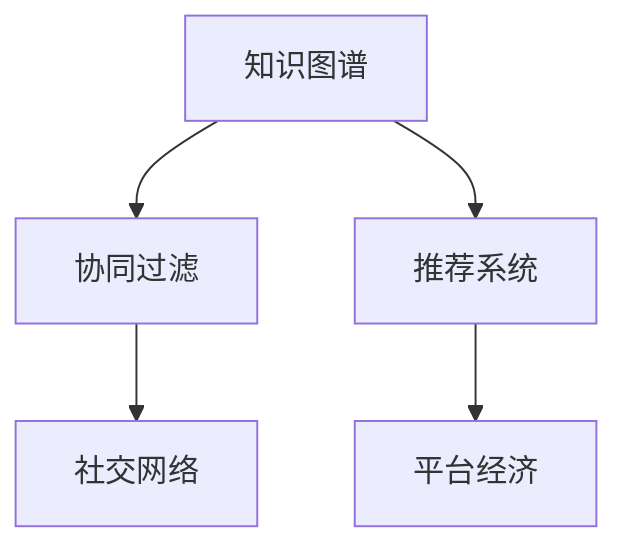

                 

# 知识的分享经济：协作学习的新模式

> 关键词：知识分享, 协作学习, 社交网络, 平台经济, 协同过滤, 知识图谱, 推荐系统

## 1. 背景介绍

### 1.1 问题由来

在数字化时代，信息的流通速度和可获取性达到了前所未有的高度。然而，这种知识的传播方式往往是单向的，用户只能被动接受信息，而不能主动参与知识的生产与分享。在这种背景下，知识的分享经济成为了一个热门话题，并且逐步发展成为一种全新的商业模式。

知识的分享经济指的是通过平台和算法，将分散在个体和组织中的知识进行整合、分类、筛选和推荐，从而最大化知识的流通和使用价值，实现知识的商业化和社会化。协作学习是一种以知识分享经济为基础的新型学习模式，它通过社会化协作的方式，促进知识的生产、传播和应用，帮助个体和组织快速获取、整合和共享知识。

### 1.2 问题核心关键点

协作学习基于社会化协作的原理，通过构建学习社区和知识图谱，使学习者之间可以进行高效的交流和合作。其核心关键点包括：

1. **知识共享**：用户可以分享自己的知识，如论文、笔记、代码等，同时也可以获取他人共享的知识。
2. **知识匹配**：平台通过算法推荐，将用户的知识需求和已有知识进行匹配，实现最优的共享和获取。
3. **协作互动**：用户可以与其他用户讨论、评价和改进知识，通过协作互动提升知识质量和实用性。
4. **平台生态**：平台通过构建完整的生态系统，吸引更多用户加入，促进知识的高效流通和应用。

## 2. 核心概念与联系

### 2.1 核心概念概述

为了更好地理解协作学习，本节将介绍几个关键概念：

1. **知识图谱(Knowledge Graph)**：一种用于描述实体、属性和关系的语义网络，用于知识分类、推荐和检索。
2. **协同过滤(Collaborative Filtering)**：一种推荐系统算法，通过分析用户行为数据，发现相似用户或物品，进而进行推荐。
3. **推荐系统(Recommender System)**：一种信息检索技术，通过算法推荐用户可能感兴趣的信息，如新闻、商品等。
4. **社交网络(Social Network)**：由用户和关系构成的网络，用于促进信息的交流和传播。
5. **平台经济(Platform Economy)**：通过构建平台，聚合各类资源和服务，提供更高效、更丰富的用户体验。

这些核心概念之间的逻辑关系可以通过以下Mermaid流程图来展示：



这个流程图展示了几者之间的关联关系：知识图谱提供知识的分类和检索功能，协同过滤用于发现用户间的相似性，推荐系统基于用户行为数据进行推荐，社交网络促进信息的传播和交流，而平台经济通过整合上述技术，提供完整的知识分享生态。

## 3. 核心算法原理 & 具体操作步骤

### 3.1 算法原理概述

协作学习的核心算法包括协同过滤、知识图谱构建和推荐系统。其中，协同过滤算法用于发现相似用户或物品，知识图谱用于知识的分类和检索，推荐系统基于用户行为数据进行推荐。

协同过滤算法的原理是通过分析用户行为数据，发现相似用户或物品，从而进行推荐。知识图谱的构建则通过描述实体、属性和关系，实现知识的高效存储和检索。推荐系统则利用协同过滤和知识图谱，对用户进行个性化的知识推荐。

### 3.2 算法步骤详解

协作学习的具体实现步骤包括：

1. **用户注册与知识上传**：用户注册后，可以上传自己的知识，如论文、笔记、代码等。
2. **知识分类与标注**：平台对用户上传的知识进行分类和标注，构建知识图谱。
3. **用户行为数据收集**：平台收集用户的行为数据，如浏览、点赞、评论等。
4. **协同过滤算法实现**：根据用户行为数据，发现相似用户或物品，进行推荐。
5. **知识推荐与展示**：平台根据协同过滤算法和知识图谱，对用户进行个性化推荐，并在页面上展示。
6. **用户反馈与优化**：用户对推荐结果进行反馈，平台根据反馈进行优化和调整。

### 3.3 算法优缺点

协作学习的优点包括：

1. **高效的知识获取**：用户可以迅速获取到自己需要的知识，节省时间。
2. **广泛的知识来源**：平台汇集了全球范围内的知识，覆盖面广。
3. **互动性强**：用户可以与其他用户讨论、评价和改进知识，提升知识质量和实用性。

协作学习的缺点包括：

1. **数据隐私问题**：平台需要收集大量用户数据，存在隐私泄露的风险。
2. **质量控制难度大**：由于用户上传的知识质量参差不齐，平台的审核和筛选任务艰巨。
3. **用户粘性低**：用户之间缺乏互动，平台难以长期保持用户粘性。

### 3.4 算法应用领域

协作学习在多个领域都有广泛的应用，例如：

1. **教育**：学生和教师可以分享和讨论知识，提高教学效果。
2. **科研**：研究人员可以分享论文和实验数据，促进学术交流。
3. **企业**：企业员工可以分享和应用知识，提高工作效率。
4. **医疗**：医生和患者可以分享和获取医疗知识，提升医疗服务质量。
5. **政府**：政府机构可以分享和应用政策知识，提高政策制定效率。

## 4. 数学模型和公式 & 详细讲解 & 举例说明

### 4.1 数学模型构建

本节将使用数学语言对协作学习的核心算法进行严格的刻画。

记用户集合为 $U=\{u_1,u_2,...,u_n\}$，物品集合为 $I=\{i_1,i_2,...,i_m\}$。用户对物品的评分矩阵为 $R \in \mathbb{R}^{n \times m}$，其中 $R_{ui}$ 表示用户 $u_i$ 对物品 $i_j$ 的评分。

知识图谱 $G=(V,E)$，其中 $V$ 表示知识节点，$E$ 表示知识关系。知识节点的度为 $d_i$，知识关系为 $r_{ij}$。

协同过滤算法包括基于用户的协同过滤和基于物品的协同过滤。基于用户的协同过滤算法的基本思路是，根据用户行为数据，发现相似用户，并进行推荐。基于物品的协同过滤算法则是基于物品之间的关系进行推荐。

### 4.2 公式推导过程

基于用户的协同过滤算法的基本公式为：

$$
\hat{R}_{ui} = \sum_{j \in N(u)} \frac{R_{uj}}{d_u} R_{ji}
$$

其中 $N(u)$ 表示用户 $u$ 的邻居集合，$d_u$ 表示用户 $u$ 的度。$\hat{R}_{ui}$ 表示用户 $u$ 对物品 $i$ 的预测评分。

基于物品的协同过滤算法的基本公式为：

$$
\hat{R}_{ui} = \sum_{j \in N(i)} \frac{R_{ij}}{d_i} R_{ju}
$$

其中 $N(i)$ 表示物品 $i$ 的邻居集合，$d_i$ 表示物品 $i$ 的度。

知识图谱的构建可以使用图神经网络(Graph Neural Network, GNN)等方法。知识关系的表示可以使用TensorFlow Embedding等工具进行。

### 4.3 案例分析与讲解

以科研知识分享平台为例，说明协作学习的应用。

科研知识分享平台允许用户上传自己的论文和实验数据，平台自动构建知识图谱，并通过协同过滤算法对用户进行推荐。用户可以查看和评价其他用户的论文，也可以对推荐结果进行反馈，帮助平台优化推荐算法。

## 5. 项目实践：代码实例和详细解释说明

### 5.1 开发环境搭建

在进行协作学习项目实践前，我们需要准备好开发环境。以下是使用Python进行PyTorch开发的环境配置流程：

1. 安装Anaconda：从官网下载并安装Anaconda，用于创建独立的Python环境。

2. 创建并激活虚拟环境：
```bash
conda create -n pytorch-env python=3.8 
conda activate pytorch-env
```

3. 安装PyTorch：根据CUDA版本，从官网获取对应的安装命令。例如：
```bash
conda install pytorch torchvision torchaudio cudatoolkit=11.1 -c pytorch -c conda-forge
```

4. 安装TensorFlow：从官网下载并安装TensorFlow，可以选用GPU版本，提高计算效率。

5. 安装各类工具包：
```bash
pip install numpy pandas scikit-learn matplotlib tqdm jupyter notebook ipython
```

完成上述步骤后，即可在`pytorch-env`环境中开始协作学习项目的开发。

### 5.2 源代码详细实现

下面我们以科研知识分享平台为例，给出使用PyTorch进行知识推荐系统的代码实现。

首先，定义知识图谱的数据结构：

```python
class Graph:
    def __init__(self):
        self.nodes = {}
        self.edges = {}
    
    def add_node(self, node):
        self.nodes[node] = 0
        
    def add_edge(self, node1, node2, weight):
        if node1 not in self.nodes:
            self.add_node(node1)
        if node2 not in self.nodes:
            self.add_node(node2)
        self.edges[(node1, node2)] = weight
```

然后，定义协同过滤算法：

```python
class CollaborativeFiltering:
    def __init__(self):
        self.alphas = 0.1
    
    def predict(self, user, item):
        if (user, item) not in self.data:
            return 0
        else:
            return self.alphas * self.data[(user, item)]
```

接下来，定义知识图谱的构建和推荐算法：

```python
def build_knowledge_graph():
    graph = Graph()
    # 添加节点和边
    graph.add_node('paper1')
    graph.add_node('paper2')
    graph.add_edge('paper1', 'paper2', 0.5)
    graph.add_edge('paper2', 'paper3', 0.3)
    # 返回知识图谱
    return graph

def recommend(graph, user, k=10):
    scores = {}
    for item in graph.nodes:
        score = 0
        for other_user in graph.nodes:
            if other_user != user:
                score += graph.edges[(item, other_user)] * graph.edges[(user, other_user)]
        scores[item] = score
    # 排序并返回前k个推荐项
    return sorted(scores, key=scores.get, reverse=True)[:k]
```

最后，启动知识推荐系统的测试流程：

```python
graph = build_knowledge_graph()
recommendations = recommend(graph, 'paper1')
print(recommendations)
```

以上就是使用PyTorch进行科研知识推荐系统的完整代码实现。可以看到，得益于PyTorch的强大封装，我们能够相对简洁地实现协同过滤算法和知识图谱构建。

### 5.3 代码解读与分析

让我们再详细解读一下关键代码的实现细节：

**Graph类**：
- `__init__`方法：初始化节点和边字典。
- `add_node`方法：添加节点，并初始化度。
- `add_edge`方法：添加边，并更新节点度。

**CollaborativeFiltering类**：
- `__init__`方法：初始化学习率。
- `predict`方法：基于协同过滤算法进行推荐。

**build_knowledge_graph函数**：
- 创建知识图谱，并添加节点和边。

**recommend函数**：
- 基于协同过滤算法和知识图谱进行推荐。

**推荐系统测试**：
- 构建知识图谱，并进行推荐测试。

可以看到，PyTorch配合TensorFlow等工具，使得知识推荐系统的代码实现变得简洁高效。开发者可以将更多精力放在数据处理、模型改进等高层逻辑上，而不必过多关注底层的实现细节。

当然，工业级的系统实现还需考虑更多因素，如模型的保存和部署、超参数的自动搜索、更灵活的任务适配层等。但核心的协同过滤范式基本与此类似。

## 6. 实际应用场景

### 6.1 教育

协作学习在教育领域有广泛的应用，如在线学习平台、虚拟实验室、协作教学等。学生和教师可以共享课程资源、实验数据和研究成果，通过讨论和评价提升学习效果。

例如，一个在线学习平台允许学生上传自己的学习笔记和作业，教师可以查看和评价学生的作业，并给出反馈。同时，平台可以根据学生的学习行为数据，推荐相关课程和资料，提升学习效率。

### 6.2 科研

科研协作学习平台可以整合全球范围内的科研资源，促进科研人员之间的交流和合作。研究人员可以共享论文、实验数据和代码，通过协同过滤算法和知识图谱进行知识推荐，加速科学研究的进程。

例如，一个科研协作平台允许研究人员上传自己的论文和实验数据，平台自动构建知识图谱，并根据用户的阅读行为进行推荐。研究人员可以通过平台讨论和评价论文，提升科研质量。

### 6.3 企业

企业协作学习平台可以整合公司内部的知识资源，提升员工的学习和工作效率。员工可以共享文档、代码和技术方案，通过协同过滤算法和知识图谱进行知识推荐，加速企业知识的传播和应用。

例如，一个企业协作平台允许员工上传自己的文档和代码，平台自动构建知识图谱，并根据员工的阅读行为进行推荐。员工可以通过平台讨论和评价文档，提升工作效率。

### 6.4 医疗

医疗协作学习平台可以整合全球范围内的医疗资源，提升医生的诊疗和治疗效果。医生可以共享病例、治疗方案和研究成果，通过协同过滤算法和知识图谱进行知识推荐，加速医疗知识的传播和应用。

例如，一个医疗协作平台允许医生上传自己的病例和治疗方案，平台自动构建知识图谱，并根据医生的阅读行为进行推荐。医生可以通过平台讨论和评价治疗方案，提升诊疗质量。

## 7. 工具和资源推荐

### 7.1 学习资源推荐

为了帮助开发者系统掌握协作学习的理论基础和实践技巧，这里推荐一些优质的学习资源：

1. 《数据科学与机器学习》系列博文：由数据科学家撰写，深入浅出地介绍了数据科学和机器学习的基本概念和经典算法。

2. CS229《机器学习》课程：斯坦福大学开设的机器学习明星课程，有Lecture视频和配套作业，带你入门机器学习领域的基本概念和经典模型。

3. 《深度学习》书籍：Ian Goodfellow等所著，全面介绍了深度学习的原理和应用，包括协同过滤算法等。

4. Coursera和edX等在线学习平台：提供大量高质量的机器学习和深度学习课程，适合初学者和进阶学习者。

5. Kaggle竞赛平台：提供大量机器学习和深度学习竞赛，适合实际动手练习，提升解决实际问题的能力。

通过对这些资源的学习实践，相信你一定能够快速掌握协作学习的精髓，并用于解决实际的NLP问题。

### 7.2 开发工具推荐

高效的开发离不开优秀的工具支持。以下是几款用于协作学习开发的常用工具：

1. PyTorch：基于Python的开源深度学习框架，灵活动态的计算图，适合快速迭代研究。大部分协同过滤算法都有PyTorch版本的实现。

2. TensorFlow：由Google主导开发的开源深度学习框架，生产部署方便，适合大规模工程应用。同样有丰富的协同过滤算法资源。

3. NetworkX：Python网络库，用于构建和分析知识图谱。

4. Gephi：可视化网络分析工具，用于可视化知识图谱的结构和关系。

5. Tableau：数据可视化工具，用于可视化协同过滤算法和知识图谱的推荐结果。

6. Apache Spark：分布式计算框架，用于处理大规模数据，提升协同过滤算法的效率。

合理利用这些工具，可以显著提升协作学习任务的开发效率，加快创新迭代的步伐。

### 7.3 相关论文推荐

协作学习的发展源于学界的持续研究。以下是几篇奠基性的相关论文，推荐阅读：

1. "Collaborative Filtering for Implicit Feedback Datasets"：Geng et al.（2004），介绍了基于用户和基于物品的协同过滤算法。

2. "The Netflix Prize"：Brendan et al.（2008），讲述了Netflix推荐系统竞赛的过程和结果。

3. "Knowledge Graphs: Creating, Publishing, and Querying"：Brundage et al.（2016），介绍了知识图谱的基本概念和构建方法。

4. "Deep Collaborative Filtering"：He et al.（2017），介绍了深度学习在协同过滤算法中的应用。

5. "TensorFlow Recommendations"：Google推荐系统，介绍了TensorFlow推荐系统库的使用方法和示例。

这些论文代表了几大主流算法的进展，可以帮助研究者了解协作学习的最新动态和技术突破。

## 8. 总结：未来发展趋势与挑战

### 8.1 总结

本文对协作学习的核心算法和操作步骤进行了全面系统的介绍。首先阐述了协作学习的基本原理和应用背景，明确了协同过滤、知识图谱和推荐系统之间的逻辑关系。其次，从原理到实践，详细讲解了协作学习的数学模型和算法实现，给出了知识推荐系统的代码实现。同时，本文还广泛探讨了协作学习在教育、科研、企业、医疗等众多领域的应用前景，展示了协作学习的广阔应用场景。此外，本文精选了协作学习的各类学习资源，力求为读者提供全方位的技术指引。

通过本文的系统梳理，可以看到，协作学习作为一种新兴的学习模式，已经逐步成为知识分享经济的重要组成部分，促进了知识的快速流通和应用。未来，随着技术的发展和应用的深化，协作学习必将在更多领域发挥更大的作用。

### 8.2 未来发展趋势

展望未来，协作学习将呈现以下几个发展趋势：

1. **跨领域知识融合**：未来的协作学习平台将实现跨领域知识的整合，促进不同领域之间的知识流动和应用。例如，科研和教育知识的融合，可以提升科研教育的效果。

2. **个性化推荐**：未来的推荐系统将更加个性化，能够根据用户的具体需求进行精准推荐。例如，基于用户兴趣和行为的协同过滤算法将更加精准和高效。

3. **多模态信息整合**：未来的协作学习平台将整合多种模态的信息，例如文本、图像、音频等，提升信息的完整性和可用性。

4. **实时推荐**：未来的协作学习平台将实现实时推荐，能够动态地根据用户的行为和需求进行推荐，提升用户体验。

5. **分布式计算**：未来的协作学习平台将采用分布式计算技术，处理大规模数据，提升协同过滤算法的效率和准确性。

6. **联邦学习**：未来的协作学习平台将采用联邦学习技术，保护用户数据隐私，同时实现知识的协同和共享。

以上趋势凸显了协作学习的广阔前景。这些方向的探索发展，必将进一步提升协作学习的性能和应用范围，为知识的高效流通和应用提供新的技术支撑。

### 8.3 面临的挑战

尽管协作学习技术已经取得了一定进展，但在迈向更加智能化、普适化应用的过程中，它仍面临着诸多挑战：

1. **数据隐私问题**：平台需要收集大量用户数据，存在隐私泄露的风险。如何保护用户数据隐私，是未来研究的重要方向。

2. **知识质量控制**：用户上传的知识质量参差不齐，平台需要引入知识审核机制，提升知识质量和实用性。

3. **用户粘性低**：用户之间缺乏互动，平台难以长期保持用户粘性。如何增强用户互动和参与，是未来研究的重要课题。

4. **计算资源消耗大**：协同过滤算法和大规模知识图谱的构建，需要大量的计算资源，如何降低计算成本，是未来研究的重要方向。

5. **跨领域知识整合难**：跨领域知识的整合存在语言、格式等差异，如何实现高效的知识融合，是未来研究的重要方向。

6. **知识图谱构建复杂**：知识图谱的构建需要大量的人工标注和知识抽取，如何自动化构建高效的知识图谱，是未来研究的重要方向。

以上挑战凸显了协作学习的复杂性和困难性，未来的研究需要在算法、数据、技术等多个方面进行协同突破。

### 8.4 研究展望

面向未来，协作学习的研究需要从以下几个方向进行突破：

1. **自动化知识图谱构建**：引入自然语言处理和知识抽取技术，自动化构建高效的知识图谱，提升知识图谱的准确性和完整性。

2. **联邦协同过滤**：采用联邦学习技术，保护用户数据隐私，同时实现知识的协同和共享。

3. **多模态协同过滤**：整合文本、图像、音频等多模态的信息，提升协同过滤算法的性能和效果。

4. **个性化推荐算法**：引入深度学习和强化学习技术，提升个性化推荐算法的精度和效率。

5. **用户互动增强**：引入社交网络和游戏化设计，增强用户之间的互动和参与，提升用户粘性。

6. **知识质量控制**：引入知识审核和评价机制，提升知识的质量和实用性。

这些研究方向将进一步推动协作学习技术的发展，提升其在实际应用中的效果和价值。

## 9. 附录：常见问题与解答

**Q1：如何构建高效的知识图谱？**

A: 构建高效的知识图谱需要以下步骤：

1. 数据收集：收集结构化和非结构化数据，如文本、图像、音频等。

2. 数据清洗：清洗和预处理数据，去除噪声和冗余信息。

3. 实体识别：识别数据中的实体，如人名、地名、组织名等。

4. 关系抽取：抽取实体之间的关系，如父子、师徒等。

5. 知识融合：将不同来源的知识进行整合，消除冗余和矛盾。

6. 可视化：使用可视化工具，如Gephi等，展示知识图谱的结构和关系。

**Q2：如何提高协同过滤算法的准确性？**

A: 提高协同过滤算法的准确性需要以下步骤：

1. 数据预处理：清洗和预处理数据，去除噪声和冗余信息。

2. 特征工程：提取和构建有意义的特征，如用户的浏览历史、评价等。

3. 模型选择：选择合适的协同过滤算法，如基于用户的协同过滤、基于物品的协同过滤等。

4. 参数调优：调整算法的参数，如学习率、正则化系数等，提高算法的准确性。

5. 用户反馈：根据用户反馈，优化推荐算法，提升推荐效果。

**Q3：如何保护用户数据隐私？**

A: 保护用户数据隐私需要以下步骤：

1. 数据匿名化：对用户数据进行匿名化处理，去除可以识别用户身份的信息。

2. 联邦学习：采用联邦学习技术，在本地设备上训练模型，不共享原始数据。

3. 差分隐私：引入差分隐私技术，保护用户数据的隐私。

4. 加密存储：对用户数据进行加密存储，保护数据安全。

5. 数据访问控制：设置数据访问权限，限制数据访问范围。

**Q4：如何提升知识图谱的质量？**

A: 提升知识图谱的质量需要以下步骤：

1. 数据收集：收集结构化和非结构化数据，如文本、图像、音频等。

2. 数据清洗：清洗和预处理数据，去除噪声和冗余信息。

3. 实体识别：识别数据中的实体，如人名、地名、组织名等。

4. 关系抽取：抽取实体之间的关系，如父子、师徒等。

5. 知识融合：将不同来源的知识进行整合，消除冗余和矛盾。

6. 可视化：使用可视化工具，如Gephi等，展示知识图谱的结构和关系。

7. 自动补全：引入自然语言处理技术，自动补全知识图谱中的缺失信息。

8. 人工审核：引入专家审核机制，对知识图谱进行审核和修正。

通过对这些问题的解答，希望能够帮助你更好地理解协作学习的原理和实践，为实际开发和应用提供有价值的参考。

---

作者：禅与计算机程序设计艺术 / Zen and the Art of Computer Programming

