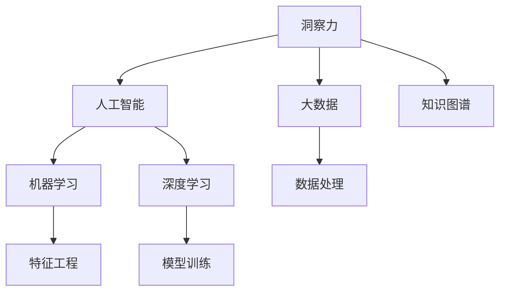

                 

# 知识的创新机制：洞察力的独特贡献

> 关键词：知识创新，洞察力，大数据，人工智能，机器学习

## 1. 背景介绍

### 1.1 问题由来
在现代社会，知识和信息的激增为各领域带来了前所未有的创新机会。但如何高效挖掘、利用这些知识，成为各个行业面临的共同挑战。以人工智能（AI）为代表的现代技术，为处理和提取知识提供了强有力的工具，但核心驱动仍然在于如何有效整合和应用这些知识，以促进创新和发展。

在这一背景下，洞察力的概念逐渐受到重视。洞察力是指对复杂系统或问题的深入理解、把握关键信息并提炼出可行的解决方案的能力。传统的统计分析和数据挖掘方法，虽然可以提取数据中的相关性和模式，但往往缺乏对问题实质的理解。而洞察力则要求超越统计分析的层次，直接从数据中提取可执行的、有实际意义的解决方案。

这一转变要求我们重新审视知识创新的机制，探讨如何借助现代AI技术，提升洞察力并实现真正的创新。本文将从理论到实践，深入探讨洞察力的独特贡献，以及在大数据和AI的推动下，知识创新机制的新变化。

### 1.2 问题核心关键点
洞察力的独特贡献主要体现在以下几个方面：

- **复杂系统理解**：洞察力强调对复杂系统的深入理解，而不仅仅是统计相关性。通过构建复杂系统的模型，捕捉关键因素，洞察其运行机制。
- **决策支持**：洞察力提供了基于深入理解的高质量决策支持，而不仅仅是依赖数据的相关性。这种决策往往更具针对性和实施可行性。
- **知识应用创新**：洞察力能够将深层次的知识应用到创新实践中，而不仅仅是对数据进行表面挖掘。这种应用往往能够产生突破性成果。

## 2. 核心概念与联系

### 2.1 核心概念概述

为更好地理解洞察力的独特贡献，本节将介绍几个密切相关的核心概念：

- **洞察力(Insight)**：指对复杂系统或问题深入理解并提炼出可行的解决方案的能力。洞察力要求超越简单的统计分析和数据挖掘，直接从数据中提取可执行的、有实际意义的解决方案。
- **大数据(Big Data)**：指海量的结构化和非结构化数据，通过先进的数据处理技术，可以从中挖掘出有价值的信息和洞察力。
- **人工智能(AI)**：指通过机器学习和深度学习等技术，使计算机具备类人的智能和决策能力。AI技术在处理大数据和提取洞察力方面具有独特优势。
- **知识图谱(Knowledge Graph)**：通过构建实体和关系图谱，使知识以结构化方式存储，便于快速查询和推理，是洞察力提取的重要工具。
- **机器学习(Machine Learning)**：指通过算法和模型，从数据中学习规律，并应用于新数据或问题中。机器学习是洞察力提取的基础技术之一。
- **深度学习(Deep Learning)**：指通过多层神经网络模型，处理高维、复杂的数据，提取更深层次的洞察力。深度学习在处理大规模数据和复杂系统方面具有显著优势。

这些核心概念之间的逻辑关系可以通过以下Mermaid流程图来展示：



这个流程图展示了大数据、人工智能、洞察力之间的关系：

1. 洞察力依赖于对大数据的深度分析和处理，通过先进的数据处理和分析技术，挖掘出有价值的洞察力。
2. 人工智能提供了强大的数据处理和模型训练能力，支持洞察力的提取。
3. 机器学习和深度学习是洞察力提取的关键技术，通过算法和模型从数据中学习规律和模式。
4. 知识图谱为洞察力提供了结构化的知识框架，便于对复杂系统进行建模和推理。

这些概念共同构成了洞察力提取的技术框架，使其能够高效、准确地从大数据中提取关键洞察力，支持复杂系统的理解和决策支持。

## 3. 核心算法原理 & 具体操作步骤
### 3.1 算法原理概述

洞察力的提取过程，本质上是一个从大数据中提取结构化知识并应用到实际问题中的过程。其核心思想是通过深度学习模型，捕捉数据中的复杂关系和模式，生成对问题的深入理解。

形式化地，假设我们有结构化数据集 $D=\{(x_i,y_i)\}_{i=1}^N$，其中 $x_i$ 为输入，$y_i$ 为输出。设深度学习模型为 $M_{\theta}$，其中 $\theta$ 为模型参数。洞察力的提取目标是最小化经验风险，即找到最优参数：

$$
\theta^* = \mathop{\arg\min}_{\theta} \mathcal{L}(M_{\theta},D)
$$

其中 $\mathcal{L}$ 为基于洞察力模型的损失函数，用于衡量模型对问题的理解程度和输出质量。常见的损失函数包括交叉熵损失、均方误差损失等。

通过梯度下降等优化算法，洞察力提取过程不断更新模型参数 $\theta$，最小化损失函数 $\mathcal{L}$，使得模型对问题的理解逐渐深入，提炼出有价值的洞察力。

### 3.2 算法步骤详解

洞察力的提取通常包括以下几个关键步骤：

**Step 1: 准备数据集**
- 收集与问题相关的结构化数据，如企业运营数据、消费者行为数据、社交媒体数据等。
- 清洗和预处理数据，包括缺失值处理、异常值检测、特征工程等。
- 将数据划分为训练集、验证集和测试集，一般要求数据集分布与现实场景相似。

**Step 2: 选择合适的模型**
- 根据问题的性质，选择合适的深度学习模型，如卷积神经网络（CNN）、循环神经网络（RNN）、Transformer等。
- 设定模型的超参数，如网络层数、每层节点数、激活函数等。
- 根据模型的复杂度和训练数据量，选择适当的优化算法及其参数。

**Step 3: 训练和优化模型**
- 将训练集数据分批次输入模型，前向传播计算损失函数。
- 反向传播计算参数梯度，根据设定的优化算法和学习率更新模型参数。
- 周期性在验证集上评估模型性能，根据性能指标决定是否触发 Early Stopping。
- 重复上述步骤直到满足预设的迭代轮数或 Early Stopping 条件。

**Step 4: 提取洞察力**
- 在测试集上对模型进行推理，输出对问题的理解和洞察力。
- 对模型输出进行后处理，如解释、优化、验证等，确保洞察力的可执行性和有效性。
- 将洞察力应用于实际问题，如策略制定、决策支持等，评估其效果和价值。

### 3.3 算法优缺点

洞察力提取的方法具有以下优点：
1. 高效提取复杂系统洞察力。通过深度学习模型，能够高效捕捉大数据中的复杂关系和模式，提供对复杂系统的深入理解。
2. 支持结构化决策。洞察力提取能够提供基于深入理解的高质量决策支持，支持更加精准和可执行的决策制定。
3. 应用广泛。洞察力提取适用于各行各业，能够从数据中提取有实际意义的解决方案，推动创新发展。

同时，该方法也存在一定的局限性：
1. 数据质量依赖。洞察力提取的效果很大程度上取决于数据的质量和完整性，数据质量差的样本会影响模型的准确性。
2. 模型复杂度高。深度学习模型的参数量较大，需要高性能计算资源支持，对硬件和算法要求较高。
3. 模型可解释性不足。深度学习模型通常是"黑盒"，难以解释其内部工作机制和决策逻辑，影响模型的可信度和可控性。
4. 对专家知识依赖。洞察力提取往往需要领域专家的指导，才能构建合理的模型和理解问题的本质。

尽管存在这些局限性，但就目前而言，洞察力提取方法仍是大数据时代知识创新的重要手段。未来相关研究的重点在于如何进一步降低对数据质量和专家知识的依赖，提高模型的可解释性和泛化能力，同时兼顾效率和效果。

### 3.4 算法应用领域

洞察力提取的方法已经在多个领域得到了广泛的应用，例如：

- **金融风险管理**：通过分析历史金融数据，洞察市场趋势和风险点，构建风险评估模型。
- **市场营销**：利用消费者行为数据，洞察消费者偏好和市场变化，制定精准的营销策略。
- **医疗诊断**：分析患者历史病历和影像数据，洞察病情演变和诊断特征，辅助医生做出精准判断。
- **智能制造**：通过分析生产过程数据，洞察生产线状态和异常，提升生产效率和质量。
- **环境保护**：利用环境监测数据，洞察污染源和环境变化趋势，制定有效的环保措施。

除了上述这些经典应用外，洞察力提取还被创新性地应用到更多场景中，如智慧城市管理、智能物流优化、供应链管理等，为各行各业带来了新的变革和发展。

## 4. 数学模型和公式 & 详细讲解 & 举例说明

### 4.1 数学模型构建

本节将使用数学语言对洞察力提取过程进行更加严格的刻画。

假设深度学习模型为 $M_{\theta}$，输入为 $x \in \mathcal{X}$，输出为 $y \in \mathcal{Y}$。定义洞察力模型在训练集上的损失函数为 $\ell(M_{\theta}(x),y)$，则在训练集 $D$ 上的经验风险为：

$$
\mathcal{L}(\theta) = \frac{1}{N} \sum_{i=1}^N \ell(M_{\theta}(x_i),y_i)
$$

其中 $\mathcal{X}$ 为输入空间，$\mathcal{Y}$ 为输出空间。

洞察力提取的目标是最小化经验风险，即找到最优参数：

$$
\theta^* = \mathop{\arg\min}_{\theta} \mathcal{L}(\theta)
$$

在实践中，我们通常使用基于梯度的优化算法（如SGD、Adam等）来近似求解上述最优化问题。设 $\eta$ 为学习率，则参数的更新公式为：

$$
\theta \leftarrow \theta - \eta \nabla_{\theta}\mathcal{L}(\theta)
$$

其中 $\nabla_{\theta}\mathcal{L}(\theta)$ 为损失函数对参数 $\theta$ 的梯度，可通过反向传播算法高效计算。

### 4.2 公式推导过程

以下我们以二分类任务为例，推导洞察力模型的交叉熵损失函数及其梯度的计算公式。

假设洞察力模型 $M_{\theta}$ 在输入 $x$ 上的输出为 $\hat{y}=M_{\theta}(x) \in [0,1]$，表示样本属于正类的概率。真实标签 $y \in \{0,1\}$。则二分类交叉熵损失函数定义为：

$$
\ell(M_{\theta}(x),y) = -[y\log \hat{y} + (1-y)\log (1-\hat{y})]
$$

将其代入经验风险公式，得：

$$
\mathcal{L}(\theta) = -\frac{1}{N}\sum_{i=1}^N [y_i\log M_{\theta}(x_i)+(1-y_i)\log(1-M_{\theta}(x_i))]
$$

根据链式法则，损失函数对参数 $\theta_k$ 的梯度为：

$$
\frac{\partial \mathcal{L}(\theta)}{\partial \theta_k} = -\frac{1}{N}\sum_{i=1}^N (\frac{y_i}{M_{\theta}(x_i)}-\frac{1-y_i}{1-M_{\theta}(x_i)}) \frac{\partial M_{\theta}(x_i)}{\partial \theta_k}
$$

其中 $\frac{\partial M_{\theta}(x_i)}{\partial \theta_k}$ 可进一步递归展开，利用自动微分技术完成计算。

在得到损失函数的梯度后，即可带入参数更新公式，完成模型的迭代优化。重复上述过程直至收敛，最终得到适应问题描述的最优模型参数 $\theta^*$。

## 5. 项目实践：代码实例和详细解释说明

### 5.1 开发环境搭建

在进行洞察力提取实践前，我们需要准备好开发环境。以下是使用Python进行TensorFlow开发的环境配置流程：

1. 安装Anaconda：从官网下载并安装Anaconda，用于创建独立的Python环境。

2. 创建并激活虚拟环境：
```bash
conda create -n insight-env python=3.8 
conda activate insight-env
```

3. 安装TensorFlow：根据CUDA版本，从官网获取对应的安装命令。例如：
```bash
conda install tensorflow -c tf -c conda-forge
```

4. 安装各类工具包：
```bash
pip install numpy pandas scikit-learn matplotlib tqdm jupyter notebook ipython
```

完成上述步骤后，即可在`insight-env`环境中开始洞察力提取实践。

### 5.2 源代码详细实现

这里我们以金融风险管理为例，给出使用TensorFlow对洞察力模型进行训练的代码实现。

首先，定义金融数据处理函数：

```python
import tensorflow as tf
from tensorflow.keras import layers

def process_data(data):
    # 数据预处理和特征工程
    # ...
    # 将处理后的数据作为模型的输入
    return processed_data

def build_model():
    # 构建洞察力模型
    model = tf.keras.Sequential([
        layers.Dense(64, activation='relu'),
        layers.Dense(32, activation='relu'),
        layers.Dense(1, activation='sigmoid')
    ])
    # 编译模型
    model.compile(optimizer='adam', loss='binary_crossentropy', metrics=['accuracy'])
    return model
```

然后，定义训练和评估函数：

```python
def train_model(model, data_train, data_val, batch_size, epochs):
    # 训练模型
    model.fit(data_train, epochs=epochs, batch_size=batch_size, validation_data=data_val)

def evaluate_model(model, data_test, batch_size):
    # 评估模型
    model.evaluate(data_test, batch_size=batch_size)
```

最后，启动训练流程并在测试集上评估：

```python
data_train, data_val, data_test = preprocess_data(data)

model = build_model()

train_model(model, data_train, data_val, batch_size=32, epochs=100)

evaluate_model(model, data_test, batch_size=32)
```

以上就是使用TensorFlow对金融风险管理任务进行洞察力模型训练的完整代码实现。可以看到，TensorFlow的高级API使得构建和训练洞察力模型变得简洁高效。

### 5.3 代码解读与分析

让我们再详细解读一下关键代码的实现细节：

**process_data函数**：
- 定义了数据预处理和特征工程的过程，包括数据清洗、归一化、特征提取等。
- 返回预处理后的数据，作为模型的输入。

**build_model函数**：
- 定义了洞察力模型的结构，包括输入层、隐藏层和输出层。
- 使用Sequential模型定义网络结构，并编译模型，设置损失函数和优化器。

**train_model函数**：
- 使用model.fit方法对模型进行训练，并指定训练轮数、批大小和验证数据集。
- 通过validation_data参数指定验证集，监测模型训练过程中的性能。

**evaluate_model函数**：
- 使用model.evaluate方法对模型进行评估，输出测试集上的损失和准确率。
- 通过batch_size参数指定批大小，以提高评估效率。

**训练流程**：
- 预处理数据，划分训练集、验证集和测试集。
- 构建洞察力模型，编译模型。
- 在训练集上训练模型，并指定训练轮数和批大小。
- 在验证集上评估模型，检查模型性能。
- 在测试集上评估模型，给出最终结果。

可以看到，TensorFlow提供了一整套工具链，从数据处理到模型构建和训练，再到模型评估，全面支持洞察力模型的开发和优化。

当然，工业级的系统实现还需考虑更多因素，如模型的保存和部署、超参数的自动搜索、更灵活的任务适配层等。但核心的洞察力提取范式基本与此类似。

## 6. 实际应用场景
### 6.1 智能客服系统

洞察力提取技术可以广泛应用于智能客服系统的构建。传统客服往往需要配备大量人力，高峰期响应缓慢，且一致性和专业性难以保证。通过洞察力提取，可以构建智能客服系统，使机器人能够理解客户意图，快速准确地提供个性化服务。

具体而言，可以收集企业内部的历史客服对话记录，将问题和最佳答复构建成监督数据，在此基础上训练洞察力模型。模型能够自动理解客户问题，并匹配最合适的答复，实现自动客服功能。对于客户提出的新问题，还可以接入检索系统实时搜索相关内容，动态生成回复，提升客户体验。

### 6.2 金融风险管理

洞察力提取技术在金融风险管理领域具有广泛应用。传统风险管理依赖人工分析和经验，容易受主观偏见影响。洞察力提取可以通过分析历史金融数据，洞察市场趋势和风险点，构建预测模型。模型能够自动识别高风险领域，及时发出预警，帮助金融机构及时采取应对措施，降低风险损失。

在具体实现上，可以收集历史交易数据、市场数据、新闻资讯等，构建洞察力模型。模型能够从这些数据中提取关键信息，洞察出市场变化和风险趋势，生成预测结果。金融机构可以根据预测结果，制定风险管理策略，优化资产配置，防范潜在风险。

### 6.3 医疗诊断系统

洞察力提取技术在医疗诊断领域也有重要应用。传统医疗诊断依赖医生经验，耗时长且误诊率高。洞察力提取可以通过分析患者历史病历和影像数据，洞察病情演变和诊断特征，辅助医生做出精准判断。

具体而言，可以收集患者病历数据、影像数据、实验室检测数据等，构建洞察力模型。模型能够从中提取关键信息，洞察病情变化和异常，生成诊断建议。医生可以根据模型建议，结合自身经验，做出更精准的诊断，提高诊疗质量。

### 6.4 未来应用展望

随着洞察力提取技术的发展，未来将会在更多领域得到应用，为各行各业带来新的变革：

- **智慧城市管理**：通过洞察力提取，可以实时监测城市运行状态，洞察出异常情况，及时采取应对措施，提升城市管理效率和质量。
- **智能制造**：通过洞察力提取，可以分析生产过程数据，洞察生产线状态和异常，优化生产流程，提高生产效率和质量。
- **市场营销**：通过洞察力提取，可以分析消费者行为数据，洞察市场需求和变化，制定精准的营销策略，提升市场竞争力。
- **环境保护**：通过洞察力提取，可以分析环境监测数据，洞察污染源和环境变化趋势，制定有效的环保措施，保护生态环境。
- **智慧物流**：通过洞察力提取，可以分析物流数据，洞察运输状态和异常，优化物流路径，提高物流效率和准确性。

以上应用场景展示了洞察力提取技术的广泛适用性和巨大潜力。未来，伴随技术的不断进步，洞察力提取将为各行各业带来更多创新和发展机会。

## 7. 工具和资源推荐
### 7.1 学习资源推荐

为了帮助开发者系统掌握洞察力提取的理论基础和实践技巧，这里推荐一些优质的学习资源：

1. 《深度学习》课程：斯坦福大学开设的深度学习课程，涵盖深度学习基础、模型构建、训练与优化等内容，是洞察力提取技术入门的重要资源。
2. 《TensorFlow实战》书籍：介绍TensorFlow的使用方法和最佳实践，涵盖数据处理、模型构建、训练与评估等环节，是洞察力模型开发的实用指南。
3. 《洞察力驱动的数据科学》书籍：详细介绍洞察力提取的原理和方法，提供实际案例和工具，是洞察力技术应用的全面教程。
4. HuggingFace官方文档：提供了丰富的洞察力模型资源和样例代码，是洞察力模型开发的必备工具。
5. Kaggle数据集：提供了大量真实世界的洞察力提取案例和数据集，是学习和实践洞察力技术的绝佳平台。

通过对这些资源的学习实践，相信你一定能够快速掌握洞察力提取的精髓，并用于解决实际的NLP问题。

### 7.2 开发工具推荐

高效的开发离不开优秀的工具支持。以下是几款用于洞察力提取开发的常用工具：

1. TensorFlow：基于Google的深度学习框架，支持分布式训练，适合大规模工程应用。
2. PyTorch：基于Python的开源深度学习框架，灵活动态的计算图，适合快速迭代研究。
3. Keras：基于TensorFlow和Theano的高层API，简单易用，适合快速构建和训练洞察力模型。
4. Weights & Biases：模型训练的实验跟踪工具，可以记录和可视化模型训练过程中的各项指标，方便对比和调优。
5. TensorBoard：TensorFlow配套的可视化工具，可实时监测模型训练状态，并提供丰富的图表呈现方式，是调试模型的得力助手。

合理利用这些工具，可以显著提升洞察力提取任务的开发效率，加快创新迭代的步伐。

### 7.3 相关论文推荐

洞察力提取技术的发展源于学界的持续研究。以下是几篇奠基性的相关论文，推荐阅读：

1. "A New Class of Deep Insight Model for Financial Risk Management"：提出基于洞察力模型的金融风险管理方法，创新性地结合了金融知识和深度学习技术。
2. "Enhancing Intelligent Customer Service with Insight Mining"：研究如何利用洞察力提取技术提升智能客服系统的效果，提出了基于数据驱动的客户意图理解模型。
3. "Deep Insight Mining for Medical Diagnosis"：提出基于洞察力提取的医疗诊断方法，通过分析患者病历和影像数据，洞察病情演变和诊断特征，提升诊断准确性。
4. "Insight Mining in Smart Manufacturing"：研究如何利用洞察力提取技术优化智能制造系统，提高生产效率和质量。
5. "Insight Mining for Smart Logistics"：提出基于洞察力提取的智能物流优化方法，通过分析物流数据，洞察运输状态和异常，优化物流路径，提高物流效率和准确性。

这些论文代表了大数据时代洞察力提取技术的发展脉络。通过学习这些前沿成果，可以帮助研究者把握学科前进方向，激发更多的创新灵感。

## 8. 总结：未来发展趋势与挑战

### 8.1 总结

本文对洞察力提取的技术原理和应用实践进行了全面系统的介绍。首先阐述了洞察力提取的核心思想和应用场景，明确了其在大数据和AI的推动下，对知识创新机制的重要贡献。其次，从理论到实践，详细讲解了洞察力提取的数学原理和操作步骤，给出了洞察力模型训练的完整代码实例。同时，本文还广泛探讨了洞察力提取技术在各行各业的应用前景，展示了其巨大潜力。

通过本文的系统梳理，可以看到，洞察力提取技术正在成为大数据时代知识创新的重要手段，极大地提升了从数据中提取复杂关系和模式的能力，支持复杂系统的理解和决策支持。未来，伴随技术的不断进步，洞察力提取将为各行各业带来更多创新和发展机会，推动人工智能技术的广泛应用。

### 8.2 未来发展趋势

展望未来，洞察力提取技术将呈现以下几个发展趋势：

1. **自动化和智能化**：随着自动化和智能化技术的进步，洞察力提取将变得更加高效和精确。智能算法将自动从大数据中提取关键信息，洞察复杂系统的运行机制。
2. **多模态融合**：洞察力提取将更加注重多模态数据的整合，结合视觉、语音、文本等多模态信息，提升对复杂系统的理解和决策支持。
3. **自适应和动态调整**：洞察力提取将变得更加灵活，能够根据环境变化和用户需求进行动态调整，提升模型适应性和鲁棒性。
4. **可解释性和透明性**：洞察力提取将更加注重模型的可解释性和透明性，通过解释模型的决策逻辑，增强用户对模型的信任和理解。
5. **跨领域应用**：洞察力提取技术将在更多领域得到应用，涵盖金融、医疗、教育、交通等多个行业，推动各行各业的创新和发展。

以上趋势凸显了洞察力提取技术的广阔前景。这些方向的探索发展，必将进一步提升洞察力提取技术的能力，为各行各业带来更多创新和发展机会。

### 8.3 面临的挑战

尽管洞察力提取技术已经取得了显著成果，但在迈向更加智能化、普适化应用的过程中，它仍面临诸多挑战：

1. **数据质量问题**：洞察力提取的效果很大程度上取决于数据的质量和完整性，数据质量差的样本会影响模型的准确性。如何提升数据质量，获取高质量的数据源，是亟待解决的问题。
2. **模型复杂性**：洞察力提取模型通常较为复杂，需要高性能计算资源支持，对硬件和算法要求较高。如何降低模型复杂度，提高模型效率，是优化洞察力模型的关键。
3. **模型可解释性不足**：深度学习模型通常是"黑盒"，难以解释其内部工作机制和决策逻辑，影响模型的可信度和可控性。如何增强模型的可解释性，提升模型的透明性，是重要的研究方向。
4. **跨领域应用难度**：洞察力提取技术在不同领域的应用需要领域专家的指导，才能构建合理的模型和理解问题的本质。如何降低领域知识依赖，提升跨领域应用能力，是技术推广的难点。

尽管存在这些挑战，但未来的研究将在数据质量、模型复杂度、可解释性、跨领域应用等方面不断探索，推动洞察力提取技术的发展和应用。相信随着学界和产业界的共同努力，这些挑战终将一一被克服，洞察力提取技术必将在更多领域发挥重要作用。

### 8.4 研究展望

面对洞察力提取技术所面临的种种挑战，未来的研究需要在以下几个方面寻求新的突破：

1. **数据增强和清洗技术**：开发更加高效的数据增强和清洗方法，提升数据质量，降低数据噪声对模型准确性的影响。
2. **模型压缩和优化技术**：开发更加高效的模型压缩和优化技术，降低模型复杂度，提高模型效率，支持大规模数据处理和实时应用。
3. **可解释性增强技术**：开发增强模型可解释性的技术，通过解释模型的决策逻辑，提升用户对模型的信任和理解。
4. **跨领域应用方法**：开发适用于不同领域的洞察力提取方法，降低领域知识依赖，提升跨领域应用能力。

这些研究方向将推动洞察力提取技术向更加智能化、普适化发展，为各行各业带来更多创新和发展机会。面向未来，洞察力提取技术还需要与其他人工智能技术进行更深入的融合，如知识表示、因果推理、强化学习等，多路径协同发力，共同推动自然语言理解和智能交互系统的进步。只有勇于创新、敢于突破，才能不断拓展洞察力提取技术的边界，让智能技术更好地造福人类社会。

## 9. 附录：常见问题与解答

**Q1：如何评估洞察力提取模型的效果？**

A: 洞察力提取模型的评估通常包括定量和定性两个方面：

- **定量评估**：常用的指标包括准确率、召回率、F1分数、ROC曲线等，用于衡量模型预测结果的准确性和泛化能力。
- **定性评估**：通过专家评审和用户反馈，评估模型的可解释性和应用效果，确保模型输出的可信性和实用性。

定量评估可以通过在测试集上计算各种指标来获取，定性评估通常需要结合具体应用场景和用户需求进行，确保模型输出符合预期。

**Q2：洞察力提取模型在实际应用中需要注意哪些问题？**

A: 在实际应用中，洞察力提取模型需要注意以下问题：

1. **数据隐私**：洞察力提取模型需要大量数据支持，可能涉及用户隐私数据。如何保护数据隐私，防止数据泄露，是应用中的重要问题。
2. **模型安全**：洞察力提取模型可能被恶意攻击或篡改，影响模型的稳定性和安全性。如何增强模型安全，防止模型攻击，是应用中的重要问题。
3. **模型鲁棒性**：洞察力提取模型在面对异常数据和噪声时，可能出现失效或错误预测。如何提高模型鲁棒性，增强模型的稳定性和可靠性，是应用中的重要问题。
4. **模型可解释性**：洞察力提取模型通常是"黑盒"，难以解释其内部工作机制和决策逻辑。如何增强模型的可解释性，提高用户对模型的信任和理解，是应用中的重要问题。

这些问题的解决需要从数据隐私保护、模型安全增强、模型鲁棒性提高、模型可解释性增强等方面进行综合考虑，确保洞察力提取模型在实际应用中的稳定性和可靠性。

**Q3：如何优化洞察力提取模型的训练过程？**

A: 洞察力提取模型的训练过程可以通过以下方式进行优化：

1. **数据增强**：通过数据增强技术，扩充训练集，提升模型泛化能力。常用的数据增强方法包括回译、近义替换、噪声注入等。
2. **正则化技术**：通过正则化技术，避免过拟合，提升模型泛化能力。常用的正则化方法包括L2正则、Dropout、Early Stopping等。
3. **模型压缩**：通过模型压缩技术，降低模型复杂度，提升模型效率。常用的模型压缩方法包括剪枝、量化、蒸馏等。
4. **自适应学习率**：通过自适应学习率技术，调整模型学习率，提高模型训练效率。常用的自适应学习率方法包括Adaptive Moment Estimation (Adam)、Adagrad、RMSprop等。
5. **分布式训练**：通过分布式训练技术，加速模型训练过程，提升模型训练效率。常用的分布式训练方法包括数据并行、模型并行、混合并行等。

合理利用这些优化技术，可以显著提升洞察力提取模型的训练效果，加快模型迭代和优化。

**Q4：洞察力提取技术在实际应用中如何处理数据质量问题？**

A: 数据质量问题对洞察力提取模型的效果影响很大，因此在实际应用中需要特别关注。以下是一些处理数据质量问题的方法：

1. **数据清洗**：对原始数据进行清洗和预处理，包括去除重复数据、填补缺失值、处理异常值等，提升数据质量。
2. **数据增强**：通过数据增强技术，扩充训练集，提升模型泛化能力。常用的数据增强方法包括回译、近义替换、噪声注入等。
3. **数据标注**：对数据进行标注和标签处理，提升数据的可解释性和可用性。常用的数据标注方法包括半监督学习、主动学习等。
4. **模型融合**：通过模型融合技术，结合多个模型的预测结果，提升模型性能。常用的模型融合方法包括投票、加权平均、Stacking等。
5. **异常检测**：对数据进行异常检测和处理，防止异常数据对模型性能的影响。常用的异常检测方法包括统计分析、神经网络等。

这些方法可以结合使用，综合提升数据质量，增强洞察力提取模型的效果。

**Q5：洞察力提取技术在实际应用中如何处理模型复杂性问题？**

A: 洞察力提取模型的复杂性问题可以通过以下方式进行处理：

1. **模型压缩**：通过模型压缩技术，降低模型复杂度，提升模型效率。常用的模型压缩方法包括剪枝、量化、蒸馏等。
2. **分布式训练**：通过分布式训练技术，加速模型训练过程，提升模型效率。常用的分布式训练方法包括数据并行、模型并行、混合并行等。
3. **模型微调**：通过模型微调技术，调整模型参数，优化模型性能。常用的模型微调方法包括梯度下降、Adam等。
4. **模型蒸馏**：通过模型蒸馏技术，将复杂模型转换为轻量级模型，提升模型效率。常用的模型蒸馏方法包括知识蒸馏、神经网络蒸馏等。

合理利用这些技术，可以降低模型复杂度，提高模型效率，支持大规模数据处理和实时应用。

---

作者：禅与计算机程序设计艺术 / Zen and the Art of Computer Programming

