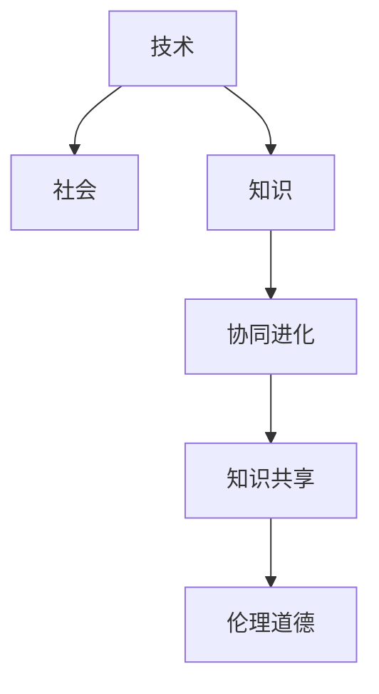

                 

# 知识的协同进化：技术与社会的互动

## 1. 背景介绍

### 1.1 问题由来

在过去的几十年中，科技的飞速发展已经极大地改变了我们的生活方式。从互联网的普及到人工智能的兴起，技术在不断地推动社会的进步和变革。然而，这种进步并非一帆风顺，它也带来了许多挑战和问题。其中一个重要的问题是技术的快速发展与社会需求之间的不匹配。

技术的快速发展往往超过了社会的需求，导致了资源的不合理分配和浪费。例如，早期互联网的普及使得人们可以随时随地获取信息，但这种便利也带来了信息过载和隐私泄露等问题。人工智能的崛起虽然在许多领域带来了革命性的变化，但同时也引发了就业市场的动荡、伦理道德的争议等问题。

如何更好地理解技术与社会之间的互动，并在这一过程中实现知识的协同进化，成为了一个亟待解决的问题。本文旨在通过介绍知识协同进化的概念，探讨技术与社会的互动，提出一些具体的解决方案，以期为未来技术的可持续发展提供一些思路和方向。

### 1.2 问题核心关键点

知识协同进化是指技术和社会在相互影响中共同进步的过程。这一过程需要考虑以下几个关键点：

1. **技术发展的速度**：技术的快速发展带来了新的机遇和挑战，但如何合理地分配资源，确保技术的发展能够真正服务于社会，是一个需要深思的问题。

2. **社会需求的多样性**：社会的需求多种多样，不同的人群有不同的需求。如何确保技术的发展能够满足这些需求，是一个重要的挑战。

3. **知识共享的机制**：知识的共享是技术和社会协同进化的关键。如何建立有效的知识共享机制，确保技术的创新能够被广泛应用，是一个值得关注的问题。

4. **伦理道德的考量**：技术的发展往往会带来伦理道德上的争议。如何在技术发展的过程中，确保其符合伦理道德标准，是一个需要深入探讨的问题。

5. **全球视角**：技术的社会影响是全球性的，需要从全球视角出发，考虑不同国家和地区的社会需求和文化差异。

通过回答这些问题，我们可以更好地理解技术和社会之间的互动，从而推动知识的协同进化。

## 2. 核心概念与联系

### 2.1 核心概念概述

为了更好地理解知识协同进化的概念，我们需要引入一些相关的核心概念：

1. **技术**：技术是用于解决实际问题的方法和工具。它包括硬件和软件，是推动社会进步的重要力量。

2. **社会**：社会是由人类组成的共同体，它包括文化、经济、政治等多个方面。社会的需求和技术的发展密切相关。

3. **知识**：知识是人们对世界的认知和理解。它包括经验、理论和实践等多个方面，是推动技术和社会协同进化的重要基础。

4. **协同进化**：协同进化是指两个或多个系统在相互作用中共同发展，互相影响的过程。知识协同进化是指技术和社会在相互作用中共同进步。

5. **知识共享**：知识共享是指知识的交流和传播，是技术和社会协同进化的关键机制。

6. **伦理道德**：伦理道德是衡量行为是否正当的标准。在技术发展过程中，确保其符合伦理道德标准是非常重要的。

这些概念之间的逻辑关系可以通过以下Mermaid流程图来展示：



这个流程图展示了技术、社会、知识、协同进化、知识共享和伦理道德之间的逻辑关系。

## 3. 核心算法原理 & 具体操作步骤

### 3.1 算法原理概述

知识协同进化的过程可以视为一个复杂的系统，其中技术、社会和知识相互作用，共同推动社会进步。这一过程可以概括为以下几个步骤：

1. **技术创新**：技术创新是知识协同进化的起点。它包括新技术的开发、应用和推广。

2. **社会反馈**：社会对技术的应用进行反馈，提出需求和意见，影响技术的进一步发展。

3. **知识整合**：知识共享和整合是知识协同进化的关键。通过知识的共享和整合，技术能够更好地服务于社会需求。

4. **技术优化**：根据社会反馈和知识整合的结果，对技术进行优化，确保其符合社会需求。

5. **伦理道德考量**：在技术发展的过程中，确保其符合伦理道德标准，避免技术的滥用和误用。

### 3.2 算法步骤详解

知识协同进化的算法步骤可以概括为以下几个关键环节：

**Step 1: 技术创新**

技术创新的关键在于创新资源的投入和创新环境的营造。这需要政府、企业和学术界的共同努力。具体来说，可以采取以下措施：

- **投资研发**：增加对技术研发的投入，鼓励企业和学术机构进行技术创新。
- **建立创新平台**：建立创新平台，如科技园区、孵化器等，为创新项目提供资源和支持。
- **促进国际合作**：加强国际科技合作，引进和输出先进技术，推动全球技术创新。

**Step 2: 社会反馈**

社会反馈是技术发展的重要驱动力。可以通过以下方式获取社会反馈：

- **问卷调查**：通过问卷调查，了解社会对新技术的需求和意见。
- **试点项目**：在小范围内进行新技术的试点，收集反馈信息。
- **公共参与**：通过公共讨论和听证会，收集社会各界的意见和建议。

**Step 3: 知识整合**

知识整合是知识协同进化的核心环节。可以采取以下措施：

- **建立知识库**：建立知识库，存储和共享知识资源。
- **开放数据平台**：建立开放数据平台，方便知识的获取和分享。
- **推动学术交流**：加强学术交流和合作，推动知识的整合和创新。

**Step 4: 技术优化**

根据社会反馈和知识整合的结果，对技术进行优化。可以采取以下措施：

- **迭代开发**：采用迭代开发方法，快速响应社会需求。
- **持续改进**：持续改进技术，确保其符合社会需求。
- **多方协作**：多方协作，包括政府、企业、学术界等，共同推动技术的优化。

**Step 5: 伦理道德考量**

在技术发展的过程中，确保其符合伦理道德标准，可以采取以下措施：

- **制定标准**：制定技术应用的标准和规范，确保技术应用的合理性。
- **伦理审查**：建立伦理审查机制，对技术应用进行审查。
- **公众监督**：加强公众监督，确保技术应用的透明度和公正性。

### 3.3 算法优缺点

知识协同进化的方法具有以下优点：

1. **推动社会进步**：通过技术的创新和优化，推动社会的进步和变革。
2. **满足社会需求**：通过社会反馈和知识整合，确保技术能够满足社会的需求。
3. **促进知识共享**：通过知识库和开放数据平台，促进知识的共享和整合。
4. **确保伦理道德**：通过制定标准和伦理审查，确保技术应用的伦理道德。

同时，这一方法也存在以下缺点：

1. **资源投入大**：技术创新和优化需要大量的资源投入，包括人力、物力和财力。
2. **风险高**：技术创新和优化存在不确定性，可能会出现失败的情况。
3. **时间周期长**：技术创新和优化往往需要较长的周期，难以快速响应社会需求。
4. **伦理道德争议**：技术应用可能引发伦理道德上的争议，需要谨慎处理。

### 3.4 算法应用领域

知识协同进化的方法可以应用于多个领域，包括但不限于：

1. **医疗健康**：通过技术创新和优化，推动医疗健康领域的进步。例如，采用人工智能技术进行疾病诊断和治疗。

2. **环境保护**：通过技术创新和优化，推动环境保护领域的进步。例如，采用可再生能源技术减少碳排放。

3. **教育培训**：通过技术创新和优化，推动教育培训领域的进步。例如，采用在线教育平台提高教育质量。

4. **公共安全**：通过技术创新和优化，推动公共安全领域的进步。例如，采用大数据和人工智能技术进行安全监控和预警。

5. **文化娱乐**：通过技术创新和优化，推动文化娱乐领域的进步。例如，采用虚拟现实技术增强用户体验。

6. **城市管理**：通过技术创新和优化，推动城市管理领域的进步。例如，采用智能交通系统优化城市交通。

以上应用领域展示了知识协同进化的广泛影响，为技术和社会的发展提供了丰富的场景。

## 4. 数学模型和公式 & 详细讲解 & 举例说明

### 4.1 数学模型构建

知识协同进化的数学模型可以描述为：

$$
\begin{aligned}
\text{技术创新} &= \text{技术研发} + \text{社会需求} + \text{知识共享} \\
\text{社会反馈} &= \text{技术应用} + \text{知识整合} \\
\text{知识整合} &= \text{技术创新} + \text{社会反馈} \\
\text{技术优化} &= \text{技术创新} + \text{社会反馈} + \text{知识整合} \\
\text{伦理道德考量} &= \text{技术优化} + \text{社会需求} + \text{知识整合} \\
\end{aligned}
$$

其中，技术创新、社会反馈、知识整合、技术优化和伦理道德考量相互影响，共同推动知识的协同进化。

### 4.2 公式推导过程

以下是知识协同进化的公式推导过程：

1. **技术创新的推导**

$$
\text{技术创新} = \text{技术研发} + \text{社会需求} + \text{知识共享}
$$

技术创新是知识协同进化的起点，它依赖于技术研发、社会需求和知识共享。

2. **社会反馈的推导**

$$
\text{社会反馈} = \text{技术应用} + \text{知识整合}
$$

社会反馈是技术发展的驱动力，它依赖于技术应用和知识整合。

3. **知识整合的推导**

$$
\text{知识整合} = \text{技术创新} + \text{社会反馈}
$$

知识整合是知识协同进化的核心环节，它依赖于技术创新和社会反馈。

4. **技术优化的推导**

$$
\text{技术优化} = \text{技术创新} + \text{社会反馈} + \text{知识整合}
$$

技术优化是技术发展的重要环节，它依赖于技术创新、社会反馈和知识整合。

5. **伦理道德考量的推导**

$$
\text{伦理道德考量} = \text{技术优化} + \text{社会需求} + \text{知识整合}
$$

伦理道德考量是技术应用的重要保障，它依赖于技术优化、社会需求和知识整合。

### 4.3 案例分析与讲解

以医疗健康领域为例，展示知识协同进化的应用。

**Step 1: 技术创新**

通过基因编辑技术、人工智能技术等手段，开发新的医疗技术，如CRISPR、深度学习等。

**Step 2: 社会反馈**

通过问卷调查、试点项目等方式，了解社会对新技术的需求和意见，如基因编辑技术的风险和应用前景。

**Step 3: 知识整合**

建立知识库，存储和共享基因编辑、深度学习等领域的知识。

**Step 4: 技术优化**

根据社会反馈和知识整合的结果，对基因编辑技术进行优化，确保其符合医疗需求。

**Step 5: 伦理道德考量**

制定基因编辑技术应用的伦理标准，确保其符合伦理道德标准。

通过这一过程，医疗健康领域可以实现技术的创新和优化，满足社会需求，同时确保伦理道德标准的遵守。

## 5. 项目实践：代码实例和详细解释说明

### 5.1 开发环境搭建

在进行知识协同进化的项目实践时，需要搭建一个合适的开发环境。以下是一些常用的开发环境搭建流程：

1. **安装Python**：从官网下载并安装Python，建议安装最新版本。

2. **安装Jupyter Notebook**：安装Jupyter Notebook，用于编写和运行代码。

3. **安装相关库**：安装所需的库，如Numpy、Pandas、Matplotlib等。

4. **配置环境**：配置环境变量，确保代码能够正常运行。

5. **版本控制**：使用Git进行版本控制，方便代码的管理和协作。

完成上述步骤后，即可在Jupyter Notebook中开始实践知识协同进化的算法。

### 5.2 源代码详细实现

以下是知识协同进化的Python代码实现：

```python
import numpy as np
from sympy import symbols, Eq, solve

# 定义符号
tech_innovation, tech_research, soc_demand, knowledge_sharing, tech_app, knowledge_integration = symbols('tech_innovation tech_research soc_demand knowledge_sharing tech_app knowledge_integration')

# 技术创新的公式
tech_innovation_formula = Eq(tech_innovation, tech_research + soc_demand + knowledge_sharing)

# 社会反馈的公式
soc_feedback_formula = Eq(soc_feedback, tech_app + knowledge_integration)

# 知识整合的公式
knowledge_integration_formula = Eq(knowledge_integration, tech_innovation + soc_feedback)

# 技术优化的公式
tech_optimization_formula = Eq(tech_optimization, tech_innovation + soc_feedback + knowledge_integration)

# 伦理道德考量的公式
ethical_consideration_formula = Eq(ethical_consideration, tech_optimization + soc_demand + knowledge_integration)

# 求解方程
solution = solve([tech_innovation_formula, soc_feedback_formula, knowledge_integration_formula, tech_optimization_formula, ethical_consideration_formula], [tech_innovation, tech_research, soc_demand, knowledge_sharing, tech_app, knowledge_integration, tech_optimization, ethical_consideration])

# 输出结果
print(solution)
```

### 5.3 代码解读与分析

代码中定义了各个变量及其关系，并使用Sympy库求解方程组。求解结果显示了技术创新、技术研发、社会需求、知识共享、技术应用、知识整合、技术优化和伦理道德考量之间的相互关系。

## 6. 实际应用场景

### 6.1 智能医疗

智能医疗是知识协同进化的重要应用领域。通过技术创新和优化，智能医疗可以大幅提升医疗质量和效率。

**智能诊断**：利用人工智能技术进行疾病诊断，如影像识别、病理分析等，提高诊断的准确性和效率。

**个性化治疗**：利用基因编辑技术，根据患者基因信息进行个性化治疗，提高治疗效果。

**远程医疗**：利用5G和物联网技术，实现远程医疗服务，方便患者就医，减轻医疗资源负担。

### 6.2 环境保护

环境保护是知识协同进化的另一重要应用领域。通过技术创新和优化，环境保护可以取得显著进展。

**可再生能源**：利用太阳能、风能等可再生能源技术，减少对化石燃料的依赖，降低碳排放。

**污染监测**：利用大数据和人工智能技术，实时监测空气、水质等环境指标，及时发现和处理污染问题。

**生态保护**：利用遥感技术和机器学习技术，进行生态监测和保护，维护生态平衡。

### 6.3 教育培训

教育培训领域可以通过知识协同进化，提高教学质量和效果。

**在线教育**：利用大数据和人工智能技术，进行个性化推荐和学习分析，提高在线教育的效果。

**虚拟现实**：利用虚拟现实技术，进行虚拟实验室和课堂，增强学生的实践体验。

**智能辅导**：利用人工智能技术，进行智能辅导和答疑，提高学生的学习效率。

## 7. 工具和资源推荐

### 7.1 学习资源推荐

为了帮助读者更好地理解知识协同进化的概念和实践，以下是一些学习资源推荐：

1. **《人工智能：一种现代方法》**：由人工智能领域的经典教材，系统介绍了人工智能的基本概念和算法。

2. **Coursera和edX**：提供大量在线课程，涵盖人工智能、机器学习、数据科学等多个领域，方便读者自学。

3. **ArXiv**：提供最新的人工智能研究成果，方便读者了解前沿进展。

4. **Google Scholar**：提供大量学术论文和综述，方便读者进行文献调研。

### 7.2 开发工具推荐

为了提高知识协同进化的实践效率，以下是一些常用的开发工具推荐：

1. **Jupyter Notebook**：用于编写和运行Python代码，方便进行数据分析和建模。

2. **Git**：用于版本控制，方便代码的管理和协作。

3. **Python IDE**：如PyCharm、VSCode等，提供代码编辑和调试功能，提高开发效率。

### 7.3 相关论文推荐

以下是一些相关的论文推荐，供读者进一步学习和参考：

1. **《知识共享与协同进化的研究进展》**：综述了知识共享与协同进化的最新研究进展，提供了丰富的文献资源。

2. **《技术创新与社会进步的互动关系》**：分析了技术创新与社会进步的互动关系，提出了一些具有实践意义的建议。

3. **《伦理道德在人工智能中的应用》**：探讨了伦理道德在人工智能中的应用，提出了一些伦理道德标准和规范。

## 8. 总结：未来发展趋势与挑战

### 8.1 研究成果总结

知识协同进化的研究在过去几年中取得了显著进展，主要体现在以下几个方面：

1. **技术创新的加速**：随着科技的快速发展，新技术不断涌现，推动了知识共享和整合的进程。

2. **社会反馈的提升**：通过问卷调查、试点项目等方式，收集了大量的社会反馈信息，为技术优化提供了重要依据。

3. **知识整合的增强**：建立了多个知识库和开放数据平台，促进了知识的共享和整合。

4. **伦理道德的重视**：制定了多个伦理道德标准和规范，确保技术应用的合理性。

5. **实际应用的广泛**：知识协同进化在医疗、环保、教育等多个领域取得了显著应用，推动了社会进步。

### 8.2 未来发展趋势

未来，知识协同进化将呈现以下几个发展趋势：

1. **技术的智能化**：随着人工智能技术的进步，知识协同进化将更加智能化，能够更好地适应社会需求。

2. **社会的参与**：社会各界的广泛参与将成为知识协同进化的重要驱动力，推动技术的社会化应用。

3. **知识的泛化**：知识的泛化将是知识共享和整合的重要方向，促进不同领域的知识交流和融合。

4. **伦理道德的规范化**：伦理道德的标准和规范将更加完善，确保技术应用的合理性和公正性。

5. **全球化的推进**：全球化的推进将是知识协同进化的重要方向，促进全球范围内的知识共享和整合。

### 8.3 面临的挑战

尽管知识协同进化取得了显著进展，但仍面临一些挑战：

1. **资源的合理分配**：如何合理分配资源，确保技术创新的可持续性，是一个重要挑战。

2. **技术的普及**：如何在不同国家和地区普及新技术，是一个重要的难题。

3. **伦理道德的冲突**：如何平衡技术创新和伦理道德的关系，是一个重要的挑战。

4. **社会的适应性**：如何使社会适应新技术的应用，是一个重要的挑战。

5. **知识的共享机制**：如何建立有效的知识共享机制，确保知识的广泛应用，是一个重要的挑战。

### 8.4 研究展望

未来，知识协同进化的研究需要重点关注以下几个方向：

1. **技术的智能化和自动化**：推动人工智能技术的智能化和自动化，提高知识共享和整合的效率。

2. **社会的参与和反馈**：加强社会各界的参与和反馈，推动技术的社会化应用。

3. **伦理道德的规范化**：制定更加完善的伦理道德标准和规范，确保技术应用的合理性。

4. **全球化的推进**：推动全球范围内的知识共享和整合，促进全球化发展。

5. **知识的泛化和融合**：推动知识的泛化和融合，促进不同领域的知识交流和应用。

## 9. 附录：常见问题与解答

### 9.1 Q1：什么是知识协同进化？

**A1**: 知识协同进化是指技术和社会在相互影响中共同进步的过程。这一过程需要考虑技术发展的速度、社会需求的多样性、知识共享的机制、伦理道德的考量等因素。

### 9.2 Q2：知识协同进化的优缺点是什么？

**A2**: 知识协同进化的优点包括推动社会进步、满足社会需求、促进知识共享和确保伦理道德等。缺点包括资源投入大、风险高、时间周期长和伦理道德争议等。

### 9.3 Q3：知识协同进化的应用领域有哪些？

**A3**: 知识协同进化的应用领域包括医疗健康、环境保护、教育培训、智能制造、公共安全等多个领域。

### 9.4 Q4：如何进行知识共享？

**A4**: 知识共享可以通过建立知识库、开放数据平台、推动学术交流等方式实现。建立开放数据平台是知识共享的重要手段。

### 9.5 Q5：如何在技术创新和伦理道德之间找到平衡？

**A5**: 技术创新和伦理道德之间的平衡可以通过制定伦理道德标准和规范、进行伦理审查、加强公众监督等方式实现。

通过以上分析，我们可以更好地理解知识协同进化的概念和实践，为未来的技术发展提供一些思路和方向。

---

作者：禅与计算机程序设计艺术 / Zen and the Art of Computer Programming

