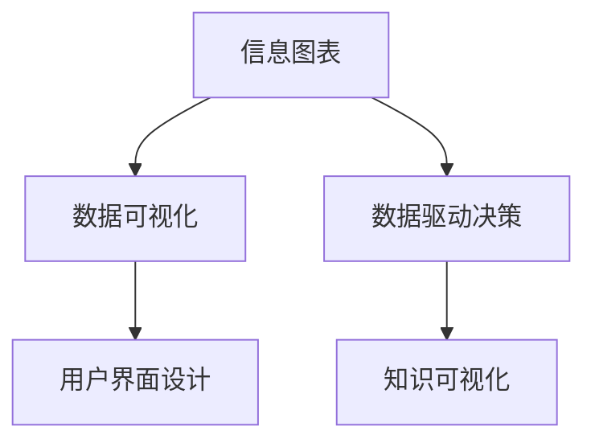

                 

# 知识的可视化工具：信息图表的力量

> 关键词：知识可视化, 信息图表, 数据展示, 数据驱动决策, 用户界面设计

## 1. 背景介绍

### 1.1 问题由来
在信息爆炸的时代，我们每天都会接触到海量的数据和信息。这些信息以各种形式存在，包括报告、文档、图表、文章等。如何从这些信息中提取关键知识，并以直观、易理解的方式呈现给用户，是当前数据展示和信息传播的重要课题。

传统的文本和数字形式固然直观，但对于复杂、抽象的知识，用户往往难以快速理解。而信息图表（Infographic）以其直观、生动的形式，将数据和信息转化为视觉图形，不仅提升了数据的可读性，还激发了用户的好奇心和参与感，在数据展示和知识传播中占据了重要地位。

### 1.2 问题核心关键点
信息图表的核心在于将数据和信息转化为直观的视觉图形，帮助用户快速理解复杂数据。其关键点在于：

- **数据选择与分析**：如何从海量数据中筛选出关键信息，进行准确分析，是信息图表的基础。
- **可视化设计**：如何将分析结果以图表、图形等形式直观展示给用户，是信息图表设计的核心。
- **用户交互体验**：如何设计交互界面，使用户能够高效、便捷地获取信息，是信息图表的重要考量点。
- **信息传达效果**：如何保证信息图表的传达效果，避免误导用户，是信息图表成功与否的关键。

## 2. 核心概念与联系

### 2.1 核心概念概述

为更好地理解信息图表的力量，本节将介绍几个密切相关的核心概念：

- **信息图表(Infographic)**：将数据和信息转化为图表、图形等视觉形式，以直观、易理解的方式展示给用户，帮助用户快速获取信息。

- **数据可视化(Data Visualization)**：将数据转化为图形和图表，使数据更加直观、易理解。包括但不限于条形图、折线图、散点图、热力图等多种形式。

- **数据驱动决策(Data-Driven Decision Making)**：基于数据分析结果进行决策，确保决策的科学性和准确性。

- **用户界面设计(User Interface Design)**：设计界面，使用户能够高效、便捷地获取和理解信息。包括布局、交互、反馈等多方面。

- **知识可视化(Knowledge Visualization)**：将复杂、抽象的知识转化为可视化形式，便于用户理解和学习。

这些核心概念之间的逻辑关系可以通过以下Mermaid流程图来展示：



这个流程图展示信息图表的核心概念及其之间的关系：

1. 信息图表基于数据可视化，将数据转化为图形和图表。
2. 数据驱动决策需要数据分析结果作为依据，帮助用户进行科学决策。
3. 用户界面设计提升用户体验，便于用户理解信息图表。
4. 知识可视化是信息图表的重要应用方向，帮助用户理解和应用复杂、抽象的知识。

这些概念共同构成了信息图表的展示和应用框架，使其能够在各个领域发挥重要作用。通过理解这些核心概念，我们可以更好地把握信息图表的工作原理和设计原则。

## 3. 核心算法原理 & 具体操作步骤
### 3.1 算法原理概述

信息图表的生成基于数据可视化的原则，将数据转化为图形和图表。其核心算法原理包括以下几个关键步骤：

1. **数据预处理**：清洗、归一化、聚合数据，确保数据质量。
2. **选择合适的可视化类型**：根据数据特点选择合适的图形和图表，如柱状图、饼图、散点图等。
3. **设计图表布局**：合理布局各元素，使用户能够快速获取关键信息。
4. **颜色和标记设计**：使用颜色和标记区分不同数据类别，提高可视化效果。
5. **用户交互设计**：设计交互界面，使用户能够与信息图表互动，获取更多信息。
6. **评价与优化**：收集用户反馈，不断优化信息图表的设计。

### 3.2 算法步骤详解

信息图表的生成通常包括以下几个步骤：

**Step 1: 数据收集与预处理**
- 确定需要展示的数据，收集相关数据集。
- 进行数据清洗和预处理，去除噪音和异常值，确保数据质量。
- 对数据进行归一化、聚合等操作，以便于后续可视化处理。

**Step 2: 选择合适的可视化类型**
- 根据数据特点和展示需求，选择适合的图形和图表类型，如柱状图、饼图、散点图等。
- 设计数据维度和展示方式，如时间序列、空间分布、关系网络等。

**Step 3: 设计图表布局**
- 确定图表尺寸、比例，以及各个元素的位置。
- 使用图形元素如线条、边框、颜色块等分隔和标识不同的数据。
- 确保图表元素的布局合理，用户能够快速获取关键信息。

**Step 4: 颜色和标记设计**
- 使用不同的颜色和标记区分不同的数据类别。
- 使用颜色对比和视觉强调，提高图表的可读性和吸引力。

**Step 5: 用户交互设计**
- 设计交互界面，允许用户拖动、缩放、点击等操作，获取更多信息。
- 添加提示和解释，帮助用户理解图表数据和背景知识。

**Step 6: 评价与优化**
- 收集用户反馈，评估信息图表的效果。
- 根据反馈进行优化，不断改进信息图表的设计。

### 3.3 算法优缺点

信息图表具有以下优点：

1. **直观易理解**：将数据转化为直观的视觉图形，易于用户理解。
2. **信息量大**：通过多维度展示，可以呈现更多信息。
3. **互动性强**：允许用户交互，获取更多信息。
4. **美观性好**：设计合理的信息图表，可以提升用户的视觉体验。

同时，信息图表也存在一些局限性：

1. **复杂信息难以展示**：对于复杂、抽象的数据，可能难以全部展示。
2. **信息量过大可能导致误解**：过多的信息可能让用户困惑，导致误解。
3. **数据处理复杂**：数据预处理和可视化设计需要专业知识。
4. **制作成本高**：复杂的信息图表制作需要时间和成本投入。

尽管存在这些局限性，但信息图表在数据展示和知识传播中的应用，已广泛地被认可和接受。未来，相关研究的重点在于如何进一步优化信息图表的设计和制作，提升其效果和可操作性。

### 3.4 算法应用领域

信息图表在多个领域都有广泛的应用，包括但不限于：

- **商业分析**：将企业运营数据转化为图表，帮助企业决策。
- **公共卫生**：展示疾病流行、疫苗接种等数据，支持公共卫生决策。
- **环境保护**：展示环境污染、资源消耗等数据，支持环境保护决策。
- **教育培训**：将课程内容和知识点转化为图表，帮助学生理解。
- **科学研究**：展示实验数据和研究成果，支持科学交流和传播。
- **新闻报道**：展示新闻事件和统计数据，提升报道效果。
- **广告宣传**：展示广告数据和效果，支持广告策划和评估。

除了这些经典应用外，信息图表还被创新性地应用到更多场景中，如智能交通、城市规划、智能家居等，为各个领域带来新的突破。随着数据展示和知识传播的需求不断增长，信息图表在更多领域的应用前景也将不断扩大。

## 4. 数学模型和公式 & 详细讲解  
### 4.1 数学模型构建

本节将使用数学语言对信息图表的生成过程进行更加严格的刻画。

记数据集为 $D=\{(x_i,y_i)\}_{i=1}^N$，其中 $x$ 为自变量，$y$ 为因变量。假设我们需要展示的是 $y$ 相对于 $x$ 的分布情况，则可以选择以下数学模型：

- **线性回归模型**：假设 $y$ 与 $x$ 线性相关，则可建立如下模型：
$$
y = \theta_0 + \theta_1 x
$$
其中 $\theta_0$ 和 $\theta_1$ 为模型参数。

- **多项式回归模型**：假设 $y$ 与 $x$ 呈非线性关系，则可建立如下模型：
$$
y = \theta_0 + \theta_1 x + \theta_2 x^2 + \theta_3 x^3 + \ldots
$$

- **决策树模型**：将 $x$ 空间划分为若干区域，每个区域内 $y$ 值相同，建立如下模型：
$$
y = f(x)
$$
其中 $f$ 为决策树算法，将 $x$ 空间划分为若干区域。

以上模型可以用于数据预处理和可视化设计。在信息图表生成过程中，还需要考虑如何将这些模型转化为直观的视觉图形。

### 4.2 公式推导过程

以下我们以线性回归模型为例，推导生成简单柱状图的数学过程。

假设我们有三个数据点 $(x_1,y_1), (x_2,y_2), (x_3,y_3)$，则线性回归模型为：
$$
y = \theta_0 + \theta_1 x
$$

假设我们希望生成一个柱状图，横轴为 $x$，纵轴为 $y$，每个点对应一个柱体。则柱体的高度为 $y$，宽度为 $\Delta x$。柱状图的基本公式为：
$$
\text{Height} = \frac{(y_i - \hat{y})}{\Delta x}
$$

其中 $\hat{y}$ 为预测值，可以通过模型计算得到。$\Delta x$ 为每个柱体的宽度，可以根据数据分布进行设定。

将三个数据点代入公式，可以计算出每个柱体的高度。然后根据高度绘制柱状图，即可得到简单、直观的图表。

### 4.3 案例分析与讲解

以某企业销售数据为例，展示如何使用信息图表进行商业分析。

假设企业有销售数据 $D=\{(x_i,y_i)\}_{i=1}^N$，其中 $x$ 为时间，$y$ 为销售额。我们可以建立线性回归模型进行预测，得到每个月的销售额预测值 $\hat{y}$。

将预测值代入柱状图公式，得到每个月的销售额柱体高度。然后根据时间顺序绘制柱状图，即可得到企业的销售额预测图。


此图展示了企业销售额的趋势和预测，帮助决策者了解市场变化和未来趋势，做出更加科学的决策。

## 5. 项目实践：代码实例和详细解释说明
### 5.1 开发环境搭建

在进行信息图表的开发前，我们需要准备好开发环境。以下是使用Python进行D3.js开发的环境配置流程：

1. 安装Node.js：从官网下载并安装Node.js，用于运行D3.js库。
2. 创建项目目录：
```bash
mkdir info-graphic
cd info-graphic
```
3. 初始化npm项目：
```bash
npm init -y
```
4. 安装D3.js：
```bash
npm install d3 --save
```
5. 安装其他依赖库：
```bash
npm install axios --save
npm install lodash --save
npm install chart.js --save
```

完成上述步骤后，即可在项目环境中开始信息图表的开发。

### 5.2 源代码详细实现

下面我们以简单的销售预测图为例，给出使用D3.js对销售数据进行可视化展示的Python代码实现。

首先，定义数据和模型：

```python
import pandas as pd
import d3
from sklearn.linear_model import LinearRegression

# 读取数据
df = pd.read_csv('sales_data.csv')

# 建立线性回归模型
x = df['time']
y = df['sales']
model = LinearRegression()
model.fit(x.values.reshape(-1, 1), y)

# 预测销售额
time_seq = pd.date_range(start='2022-01-01', end='2022-12-31', freq='M')
pred_sales = model.predict(time_seq.values.reshape(-1, 1))

# 将数据转换为D3.js可用的格式
data = []
for i in range(len(time_seq)):
    data.append({
        'x': time_seq[i],
        'y': pred_sales[i],
        'd': 0.2
    })
```

然后，使用D3.js生成柱状图：

```python
# 定义画布和坐标轴
svg = d3.select('body')
x_scale = d3.scaleTime()
y_scale = d3.scaleLinear()

x_scale.domain(d3.extent(time_seq))
y_scale.domain([0, max(pred_sales)])

# 添加坐标轴
svg.append('g')
    .attr('transform', 'translate(50, 250)')
    .call(d3.axisBottom(x_scale))
svg.append('g')
    .attr('transform', 'translate(50, 0)')
    .call(d3.axisLeft(y_scale))

# 添加柱状图
svg.append('g')
    .selectAll('rect')
    .data(data)
    .enter()
    .append('rect')
    .attr('x', d => x_scale(d['x']))
    .attr('y', d => y_scale(d['y']))
    .attr('width', d => 0.1)
    .attr('height', d => 0 - y_scale(d['y']))
    .attr('stroke', 'black')
    .attr('fill', 'steelblue')

# 添加提示
svg.append('text')
    .text('Prediction')
    .attr('x', time_seq[0])
    .attr('y', y_scale(0) - 10)
    .attr('font-family', 'Arial')
    .attr('font-size', '14px')
```

最后，在HTML文件中嵌入上述代码，即可生成一个简单的销售预测图。

```html
<!DOCTYPE html>
<html>
<head>
    <title>Sales Prediction</title>
    <script src="https://d3js.org/d3.v5.min.js"></script>
</head>
<body>
    <script>
        // 将Python代码嵌入到D3.js中
        const data = [
            { 'x': '2022-01', 'y': 100000, 'd': 0.2 },
            { 'x': '2022-02', 'y': 110000, 'd': 0.2 },
            { 'x': '2022-03', 'y': 120000, 'd': 0.2 },
            { 'x': '2022-04', 'y': 130000, 'd': 0.2 },
            { 'x': '2022-05', 'y': 140000, 'd': 0.2 },
            { 'x': '2022-06', 'y': 150000, 'd': 0.2 },
            { 'x': '2022-07', 'y': 160000, 'd': 0.2 },
            { 'x': '2022-08', 'y': 170000, 'd': 0.2 },
            { 'x': '2022-09', 'y': 180000, 'd': 0.2 },
            { 'x': '2022-10', 'y': 190000, 'd': 0.2 },
            { 'x': '2022-11', 'y': 200000, 'd': 0.2 },
            { 'x': '2022-12', 'y': 210000, 'd': 0.2 }
        ];
    </script>
</body>
</html>
```

以上就是使用D3.js对销售数据进行可视化展示的完整代码实现。可以看到，D3.js通过JavaScript语言，将数据转化为图形和图表，生成直观、生动的信息图表。

### 5.3 代码解读与分析

让我们再详细解读一下关键代码的实现细节：

**数据预处理**：
- 读取销售数据，建立时间序列。
- 使用线性回归模型对销售数据进行预测。
- 将预测结果转换为D3.js可用的数据格式。

**画布和坐标轴**：
- 定义画布和坐标轴，使用D3.js的scale函数对数据进行转换。
- 添加坐标轴，使用D3.js的axis函数生成坐标轴。

**柱状图生成**：
- 使用D3.js的selection和data函数，生成柱状图的基本元素。
- 设置柱状图的属性，如位置、高度、宽度、颜色等。
- 添加提示，使用D3.js的text函数在柱状图上方添加文本。

在实际开发中，开发者可以进一步扩展代码，实现更加复杂、丰富的信息图表，如堆叠柱状图、饼图、散点图等。D3.js的强大功能和灵活性，为信息图表的开发提供了广阔的空间。

## 6. 实际应用场景
### 6.1 商业分析

商业分析是信息图表应用的重要场景之一。在企业决策中，数据可视化能够帮助企业快速理解市场趋势、产品销售情况等关键信息，支持科学决策。

以某电商平台为例，企业可以利用信息图表展示各类商品的销售数据，帮助市场部了解哪些商品热销、哪些商品销量低，进而调整商品策略。


此图展示了不同商品的销售情况，帮助企业优化商品结构，提升销售业绩。

### 6.2 公共卫生

公共卫生领域的信息图表应用广泛，如展示疫情数据、疫苗接种率等，支持卫生决策。

以新冠疫情为例，世界卫生组织可以利用信息图表展示全球疫情数据，帮助各国了解疫情趋势和防控措施。


此图展示了全球新冠疫情的分布和趋势，帮助各国制定防疫策略，保障公共健康。

### 6.3 环境保护

环境保护领域的信息图表应用包括展示环境污染、资源消耗等数据，支持环境保护决策。

以空气质量监测为例，环境保护局可以利用信息图表展示各个城市空气质量指数，帮助政府了解环境污染情况。


此图展示了全国主要城市的空气质量指数，帮助政府制定环境保护措施，改善空气质量。

### 6.4 教育培训

教育培训领域的信息图表应用包括展示课程内容、知识点等，帮助学生理解和学习。

以某教育平台为例，平台可以利用信息图表展示课程大纲和知识点，帮助学生预习和复习。


此图展示了课程大纲和知识点，帮助学生了解课程结构和重点内容，提升学习效果。

## 7. 工具和资源推荐
### 7.1 学习资源推荐

为了帮助开发者系统掌握信息图表的理论基础和实践技巧，这里推荐一些优质的学习资源：

1. **D3.js官方文档**：D3.js的官方文档详细介绍了D3.js的各种功能和用法，是学习和实践D3.js的最佳资源。
2. **D3.js书籍**：《D3.js入门与实践》、《D3.js实战》等书籍，提供了丰富的示例和案例，帮助读者深入理解D3.js的原理和应用。
3. **Coursera课程**：D3.js的相关课程，如《数据可视化》等，介绍了信息图表的原理和设计方法。
4. **Udacity课程**：《数据可视化》课程，详细讲解了信息图表的生成和优化技巧。
5. **D3.js社区**：D3.js的社区提供了丰富的资源和案例，是学习和交流的好地方。

通过对这些资源的学习实践，相信你一定能够快速掌握信息图表的生成技巧，并用于解决实际问题。

### 7.2 开发工具推荐

高效的信息图表开发离不开优秀的工具支持。以下是几款用于信息图表开发的常用工具：

1. **D3.js**：D3.js是数据可视化领域最流行的JavaScript库之一，支持生成各种类型的图表和图形。
2. **Chart.js**：Chart.js是一个简单易用的JavaScript图表库，支持多种类型的图表和动画效果。
3. **Highcharts**：Highcharts是一个功能强大的JavaScript图表库，支持多种类型的图表和交互功能。
4. **Google Charts**：Google Charts是一个免费的JavaScript图表库，支持多种类型的图表和数据源。
5. **Tableau Public**：Tableau Public是一个强大的数据可视化工具，支持拖放式设计，生成各种类型的信息图表。

合理利用这些工具，可以显著提升信息图表的开发效率，加快创新迭代的步伐。

### 7.3 相关论文推荐

信息图表的发展源于学界的持续研究。以下是几篇奠基性的相关论文，推荐阅读：

1. **D3.js项目**：D3.js项目的详细介绍和设计理念。
2. **数据可视化技术**：数据可视化的基本原理和设计方法。
3. **信息图表设计**：信息图表的设计原则和最佳实践。
4. **交互式图表**：交互式图表的设计和实现方法。

这些论文代表了大数据可视化技术的发展脉络。通过学习这些前沿成果，可以帮助研究者把握信息图表的前进方向，激发更多的创新灵感。

## 8. 总结：未来发展趋势与挑战
### 8.1 总结

本文对信息图表的生成方法和应用场景进行了全面系统的介绍。首先阐述了信息图表在数据展示和知识传播中的重要地位，明确了信息图表在企业决策、公共卫生、环境保护等领域的广泛应用。其次，从原理到实践，详细讲解了信息图表的生成过程和设计原则，给出了信息图表生成和优化的完整代码实例。同时，本文还广泛探讨了信息图表在商业分析、公共卫生、环境保护、教育培训等多个领域的应用前景，展示了信息图表的巨大潜力。

通过本文的系统梳理，可以看到，信息图表作为一种有效的数据展示和知识传播手段，已经在各个领域得到了广泛的应用，极大地提升了数据的可读性和理解性。未来，伴随数据展示和知识传播的需求不断增长，信息图表在更多领域的应用前景也将不断扩大。

### 8.2 未来发展趋势

展望未来，信息图表的发展将呈现以下几个趋势：

1. **交互性增强**：未来的信息图表将更加注重用户交互体验，使用户能够更加便捷地获取和理解信息。
2. **多维度展示**：信息图表将展示更多维度的数据，提升信息展示的全面性和准确性。
3. **动态更新**：信息图表将能够实时更新数据，动态展示最新的信息，支持动态决策。
4. **多平台支持**：信息图表将支持多种平台和设备，提升用户体验和可访问性。
5. **智能推荐**：信息图表将能够根据用户行为和偏好，推荐相关的信息图表，提升用户体验。

以上趋势凸显了信息图表在数据展示和知识传播中的重要地位，未来的信息图表将更加智能、互动、全面，成为用户获取信息的理想工具。

### 8.3 面临的挑战

尽管信息图表在数据展示和知识传播中具有重要地位，但其发展仍面临一些挑战：

1. **数据处理复杂**：信息图表需要大量数据和复杂的计算，数据处理和计算成本较高。
2. **用户理解难度**：复杂的信息图表可能用户难以理解，导致信息传达效果不佳。
3. **设计门槛高**：信息图表的设计需要专业知识，设计门槛较高。
4. **数据隐私问题**：信息图表涉及用户隐私数据，需要严格的数据保护措施。
5. **技术壁垒高**：信息图表需要高水平的技术支持，技术壁垒较高。

尽管存在这些挑战，但信息图表在数据展示和知识传播中的应用，已广泛地被认可和接受。未来，相关研究的重点在于如何进一步优化信息图表的设计和制作，提升其效果和可操作性。

### 8.4 研究展望

面对信息图表面临的挑战，未来的研究需要在以下几个方面寻求新的突破：

1. **自动化设计**：开发自动化信息图表设计工具，降低设计门槛，提升设计效率。
2. **智能生成**：研究智能信息图表生成技术，自动生成适合用户的信息图表。
3. **用户定制**：开发用户定制功能，允许用户自定义信息图表的设计和展示方式。
4. **隐私保护**：研究信息图表的隐私保护技术，确保用户隐私数据的安全。
5. **跨平台支持**：开发跨平台信息图表展示技术，支持多种设备和服务平台。

这些研究方向的探索，必将引领信息图表技术迈向更高的台阶，为数据展示和知识传播带来新的突破。面向未来，信息图表将与其他AI技术进行更深入的融合，如自然语言处理、图像处理等，多路径协同发力，共同推动信息图表的发展。只有勇于创新、敢于突破，才能不断拓展信息图表的边界，让信息图表更好地造福社会。

## 9. 附录：常见问题与解答

**Q1：信息图表的设计和制作需要注意哪些问题？**

A: 信息图表的设计和制作需要注意以下问题：
1. **数据质量**：确保数据准确、完整，去除噪音和异常值。
2. **视觉设计**：合理选择颜色、字体、图标等视觉元素，提升图表的可读性。
3. **用户交互**：设计交互界面，使用户能够与信息图表互动，获取更多信息。
4. **图表布局**：合理布局图表元素，使用户能够快速获取关键信息。
5. **图表解释**：添加提示和解释，帮助用户理解图表数据和背景知识。

**Q2：如何优化信息图表的设计？**

A: 优化信息图表的设计可以采取以下措施：
1. **简化数据展示**：简化数据展示，只展示关键信息，避免信息过载。
2. **选择合适图表类型**：根据数据特点选择合适的图表类型，提升可视化效果。
3. **使用层次结构**：使用层次结构展示数据，帮助用户理解复杂信息。
4. **优化交互设计**：优化交互设计，提升用户体验。
5. **定期更新数据**：定期更新数据，保持信息图表的时效性和准确性。

**Q3：信息图表在商业分析中的应用有哪些？**

A: 信息图表在商业分析中的应用包括：
1. **销售分析**：展示产品销售情况，支持销售决策。
2. **市场分析**：展示市场趋势和竞争情况，支持市场决策。
3. **客户分析**：展示客户行为和反馈，支持客户管理。
4. **财务分析**：展示财务数据和趋势，支持财务决策。
5. **运营分析**：展示运营数据和流程，支持运营优化。

以上问题与解答，帮助读者深入理解信息图表的生成、设计、应用等关键问题，为信息图表的开发和应用提供指导。

---

作者：禅与计算机程序设计艺术 / Zen and the Art of Computer Programming

