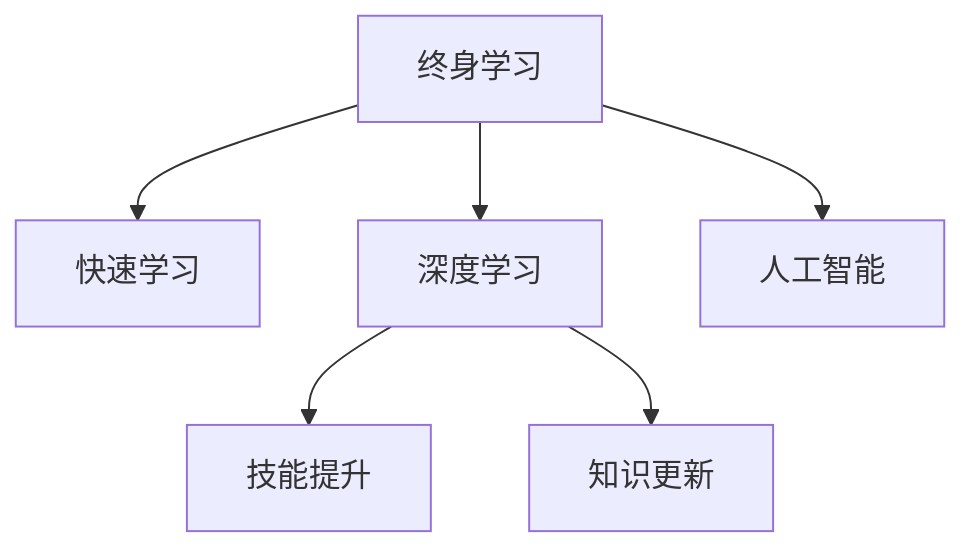

                 

# 知识的快速更新：终身学习的必要性

> 关键词：终身学习,知识更新,快速学习,技能提升,持续学习,机器学习,深度学习,人工智能,专业发展

## 1. 背景介绍

### 1.1 问题由来
在快速发展的技术浪潮中，知识的更新换代成为了行业工作者面临的一大挑战。传统的“一劳永逸”的学习方式已难以适应快速变化的技术环境，终身学习成为了适应行业发展的必要选择。特别是在人工智能（AI）和深度学习（DL）领域，知识的快速更新和持续学习显得尤为关键。

### 1.2 问题核心关键点
终身学习的核心在于不断吸收新知识、提升技能，并将其应用于解决实际问题。其核心包括以下几点：

- **快速学习**：在极短的时间内掌握新知识或技能，以应对技术变化和市场竞争。
- **持续提升**：不因现有成就而停滞不前，保持不断进步的心态和方法。
- **技能应用**：将新学习的知识应用于实际工作中，解决实际问题。
- **适应性**：对技术趋势保持敏感，快速调整学习方向，以适应新的技术发展和行业需求。

## 2. 核心概念与联系

### 2.1 核心概念概述

为了更好地理解终身学习在AI和DL领域的应用，本节将介绍几个密切相关的核心概念：

- **终身学习**：一种持续、不间断的学习方式，旨在不断更新知识，提升技能，适应技术发展。
- **快速学习**：指在短时间内掌握新技能或知识，以快速适应技术变化。
- **深度学习**：一种基于神经网络的机器学习范式，通过大量数据进行训练，构建复杂模型以进行高效特征提取和决策。
- **人工智能**：一种模拟人类智能行为的技术，涵盖感知、推理、学习等多个方面。
- **技能提升**：通过学习和实践，逐步掌握某一领域的高级技能，提升专业水平。
- **知识更新**：不断更新已有知识体系，吸纳新知识，保持知识的先进性。

这些核心概念之间的关系可以通过以下Mermaid流程图来展示：



这个流程图展示了终身学习的核心概念及其之间的关系：

1. 终身学习包含快速学习和深度学习，是AI和DL领域持续发展的关键。
2. 快速学习通过深度学习的方式，在短时间内掌握新技能，是应对技术变化的有效手段。
3. 深度学习在人工智能的框架下，通过技能提升和知识更新，不断提升模型的表现。
4. 技能提升和知识更新是深度学习和人工智能应用的重要基础，也是终身学习的最终目标。

## 3. 核心算法原理 & 具体操作步骤

### 3.1 算法原理概述

终身学习的核心算法原理包括以下几个关键点：

- **在线学习**：通过不断接收新的数据，实时更新模型参数，保持模型对新数据的适应能力。
- **迁移学习**：利用已有知识，在新任务上快速构建模型，提高学习效率。
- **自监督学习**：使用无标签数据进行训练，自动发现数据的潜在规律，提升模型泛化能力。
- **增量学习**：在已有模型基础上，不断添加新数据进行训练，提升模型性能。

这些算法原理共同构成了终身学习的核心框架，使其能够不断适应技术变化，提升模型表现。

### 3.2 算法步骤详解

终身学习的具体步骤包括以下几个关键环节：

1. **数据收集**：通过网络爬虫、公开数据集等方式，收集最新的数据，保持数据的时效性。
2. **模型选择**：根据任务需求，选择合适的预训练模型，作为终身学习的起点。
3. **模型微调**：在新的数据集上，进行微调，优化模型参数，提升模型性能。
4. **技能应用**：将微调后的模型应用于实际任务中，解决实际问题。
5. **效果评估**：通过效果评估指标，如准确率、召回率、F1分数等，评估模型性能，调整学习策略。

### 3.3 算法优缺点

终身学习的优点包括：

- **适应性强**：能够快速适应技术变化，保持模型的高效性。
- **提升速度快**：通过快速学习，能够在短时间内掌握新技能，提升模型性能。
- **应用广泛**：适用于各类AI和DL任务，如分类、回归、生成等。
- **灵活性高**：可以根据任务需求，灵活调整模型结构和参数。

同时，终身学习也存在一些局限性：

- **计算资源需求高**：持续的学习和微调需要大量的计算资源，可能带来较高的成本。
- **数据质量要求高**：数据质量直接影响模型性能，需要不断获取和清洗高质量数据。
- **时间成本高**：持续学习需要大量时间，对工作节奏和团队资源有较高要求。
- **算法复杂度高**：终身学习算法复杂，需要较高的技术门槛和理论基础。

### 3.4 算法应用领域

终身学习的应用领域非常广泛，涵盖了AI和DL的多个子领域：

- **自然语言处理（NLP）**：如机器翻译、文本分类、情感分析等。
- **计算机视觉（CV）**：如图像识别、目标检测、图像生成等。
- **语音识别**：如自动语音识别、语音合成等。
- **推荐系统**：如电商推荐、内容推荐等。
- **强化学习**：如自动驾驶、游戏AI等。

在医疗、金融、教育、安全等多个领域，终身学习也得到了广泛应用，提升了大数据和AI技术的普及和应用效果。

## 4. 数学模型和公式 & 详细讲解 & 举例说明

### 4.1 数学模型构建

终身学习的数学模型可以表示为：

$$
\theta_t = f(\theta_{t-1}, D_t, \lambda)
$$

其中 $\theta_t$ 表示在时间 $t$ 的模型参数，$D_t$ 表示时间 $t$ 的数据集，$\lambda$ 表示学习率，$f$ 表示模型更新函数。

### 4.2 公式推导过程

通过梯度下降算法，模型的更新公式可以表示为：

$$
\theta_t = \theta_{t-1} - \eta \nabla_{\theta} \mathcal{L}(\theta_{t-1}, D_t)
$$

其中 $\eta$ 为学习率，$\mathcal{L}$ 为损失函数。

### 4.3 案例分析与讲解

以机器翻译为例，假设模型 $M$ 在时间 $t$ 的输入为 $x_t$，输出为 $y_t$。通过在线学习，模型参数 $\theta_t$ 的更新过程可以表示为：

$$
\theta_t = \theta_{t-1} - \eta \nabla_{\theta} \mathcal{L}(M(x_t), y_t)
$$

在实际应用中，通过对不断更新的数据集 $D_t$ 进行训练，模型能够逐步提升翻译质量，适应新的语言模型和应用场景。

## 5. 项目实践：代码实例和详细解释说明

### 5.1 开发环境搭建

在进行终身学习项目开发前，我们需要准备好开发环境。以下是使用Python进行TensorFlow开发的环境配置流程：

1. 安装Anaconda：从官网下载并安装Anaconda，用于创建独立的Python环境。

2. 创建并激活虚拟环境：
```bash
conda create -n tf-env python=3.8 
conda activate tf-env
```

3. 安装TensorFlow：根据CUDA版本，从官网获取对应的安装命令。例如：
```bash
conda install tensorflow -c conda-forge
```

4. 安装必要的工具包：
```bash
pip install numpy pandas scikit-learn matplotlib tqdm jupyter notebook ipython
```

完成上述步骤后，即可在`tf-env`环境中开始终身学习实践。

### 5.2 源代码详细实现

这里我们以机器翻译任务为例，给出使用TensorFlow进行终身学习的PyTorch代码实现。

首先，定义机器翻译的数据处理函数：

```python
import tensorflow as tf
from tensorflow.keras.preprocessing.text import Tokenizer
from tensorflow.keras.preprocessing.sequence import pad_sequences
import numpy as np

def preprocess_text(texts):
    tokenizer = Tokenizer()
    tokenizer.fit_on_texts(texts)
    sequences = tokenizer.texts_to_sequences(texts)
    return pad_sequences(sequences, maxlen=10, padding='post', truncating='post')
```

然后，定义模型和优化器：

```python
from tensorflow.keras.models import Sequential
from tensorflow.keras.layers import Embedding, LSTM, Dense, Dropout

model = Sequential([
    Embedding(input_dim=vocab_size, output_dim=embedding_dim, input_length=max_length),
    LSTM(units=hidden_units, dropout=dropout_rate, recurrent_dropout=recurrent_dropout_rate),
    Dense(units=target_vocab_size, activation='softmax'),
    Dropout(dropout_rate)
])

optimizer = tf.keras.optimizers.Adam(learning_rate=learning_rate)
```

接着，定义训练和评估函数：

```python
def train_epoch(model, data, batch_size, optimizer):
    model.compile(optimizer=optimizer, loss='sparse_categorical_crossentropy', metrics=['accuracy'])
    model.fit(x=data['input'], y=data['target'], batch_size=batch_size, epochs=1, validation_data=(data['validation_input'], data['validation_target']))
    
def evaluate(model, data, batch_size):
    test_loss, test_acc = model.evaluate(x=data['input'], y=data['target'])
    print('Test accuracy:', test_acc)
```

最后，启动训练流程并在测试集上评估：

```python
epochs = 10
batch_size = 32

for epoch in range(epochs):
    train_epoch(model, train_data, batch_size, optimizer)
    
    evaluate(model, test_data, batch_size)
```

以上就是使用TensorFlow进行机器翻译任务终身学习的完整代码实现。可以看到，TensorFlow提供了丰富的Keras API，使得模型构建和训练变得简单高效。

### 5.3 代码解读与分析

让我们再详细解读一下关键代码的实现细节：

**preprocess_text函数**：
- `Tokenizer`类用于将文本转化为模型可处理的序列数据，`pad_sequences`函数对序列进行填充，保证所有输入的序列长度一致。

**模型定义**：
- `Embedding`层将输入序列转化为词嵌入向量，`LSTM`层进行序列建模，`Dense`层进行分类输出，`Dropout`层防止过拟合。
- 选择Adam优化器，并设置合适的学习率。

**训练和评估函数**：
- `train_epoch`函数使用`fit`方法进行单轮训练，并记录验证集上的性能。
- `evaluate`函数计算模型在测试集上的性能，输出测试准确率。

**训练流程**：
- 定义总的epoch数和batch size，开始循环迭代
- 每个epoch内，先进行训练，输出训练准确率
- 在测试集上评估，输出测试准确率
- 所有epoch结束后，不再训练，直接输出测试结果

可以看到，TensorFlow配合Keras API使得终身学习模型的代码实现变得简洁高效。开发者可以将更多精力放在数据处理、模型改进等高层逻辑上，而不必过多关注底层的实现细节。

## 6. 实际应用场景

### 6.1 医疗领域

在医疗领域，终身学习技术的应用至关重要。医疗领域涉及大量的医学数据和复杂的诊断任务，模型的性能直接影响患者的治疗效果。

具体而言，可以收集不同医院的电子病历、医学影像等数据，对预训练模型进行微调，构建针对特定医院或科室的模型。微调后的模型能够快速适应新的医疗数据，提高诊断的准确率和效率，从而提升医疗服务质量。

### 6.2 金融领域

金融领域需要实时监控市场动态，预测股票走势、评估风险等。传统的机器学习模型往往需要重新训练，难以应对实时变化的市场数据。

通过终身学习技术，金融模型可以实时接收新的数据，并不断更新模型参数，以适应市场变化。例如，可以通过实时接收新闻、交易数据等，对预训练模型进行微调，构建实时金融预测模型，预测股票走势、评估金融风险等。

### 6.3 教育领域

在教育领域，终身学习技术可以用于个性化推荐、智能辅导等多个环节。通过对学生学习数据的持续监控，构建个性化的学习模型，为学生提供针对性的学习建议和资源。

例如，可以收集学生的学习记录、考试成绩、行为数据等，对预训练模型进行微调，构建智能辅导系统，根据学生的学习进度和兴趣，推荐合适的学习内容和学习路径。

### 6.4 未来应用展望

随着终身学习技术的发展，其在各领域的应用前景将更加广阔：

1. **智能家居**：通过对家庭数据的学习，构建智能家居系统，实现智能控制和自动优化。
2. **自动驾驶**：通过实时接收交通数据、传感器数据等，持续优化驾驶模型，提升驾驶安全性和舒适性。
3. **智慧城市**：通过对城市数据的学习，构建智慧城市管理系统，提升城市治理和公共服务水平。
4. **机器人技术**：通过持续学习和环境互动，提升机器人任务执行的准确性和效率。

这些领域的应用将进一步推动AI技术的发展，为人类社会带来更广泛的影响。

## 7. 工具和资源推荐

### 7.1 学习资源推荐

为了帮助开发者系统掌握终身学习的理论基础和实践技巧，这里推荐一些优质的学习资源：

1. 《TensorFlow从入门到精通》系列博文：由TensorFlow团队撰写，全面介绍了TensorFlow框架的使用方法，以及深度学习模型的构建和训练。

2. 《深度学习入门》书籍：李宏毅教授的深度学习课程讲义，系统介绍了深度学习的基本概念和常用算法。

3. 《AI及机器学习入门》书籍：王晓东教授的机器学习课程讲义，适合初学者了解AI和机器学习的基本原理和方法。

4. 《自然语言处理入门》书籍：Rush Wang等人撰写的自然语言处理课程讲义，介绍了NLP的基本概念和常用技术。

5. TensorFlow官方文档：TensorFlow的官方文档，提供了丰富的示例和API参考，是学习TensorFlow的重要资源。

通过对这些资源的学习实践，相信你一定能够快速掌握终身学习的精髓，并用于解决实际的NLP问题。

### 7.2 开发工具推荐

高效的开发离不开优秀的工具支持。以下是几款用于终身学习开发的常用工具：

1. TensorFlow：由Google主导开发的开源深度学习框架，生产部署方便，适合大规模工程应用。
2. PyTorch：基于Python的开源深度学习框架，灵活动态的计算图，适合快速迭代研究。
3. Weights & Biases：模型训练的实验跟踪工具，可以记录和可视化模型训练过程中的各项指标，方便对比和调优。
4. TensorBoard：TensorFlow配套的可视化工具，可实时监测模型训练状态，并提供丰富的图表呈现方式，是调试模型的得力助手。

合理利用这些工具，可以显著提升终身学习任务的开发效率，加快创新迭代的步伐。

### 7.3 相关论文推荐

终身学习技术的发展源于学界的持续研究。以下是几篇奠基性的相关论文，推荐阅读：

1. Lifelong Learning in Artificial Intelligence: A Survey and Taxonomy（综述论文）：全面回顾了终身学习领域的研究现状和未来方向。
2. Continual Learning with Task-Agnostic Meta-Learning（任务无关的元学习）：提出了通过元学习来实现终身学习的框架。
3. Curriculum-based Continual Learning for Deep Neural Networks（课程式微调）：提出了一种基于课程规划的微调方法，实现了高效的终身学习。
4. A Survey of Continual Learning in Neural Networks（神经网络微调综述）：系统总结了神经网络微调的最新研究进展，为终身学习提供了理论支持。
5. A Comprehensive Survey of Lifelong Learning（终身学习综述）：介绍了终身学习领域的最新研究进展和应用实例，为终身学习的应用提供了丰富的参考。

这些论文代表了终身学习领域的发展脉络。通过学习这些前沿成果，可以帮助研究者把握学科前进方向，激发更多的创新灵感。

## 8. 总结：未来发展趋势与挑战

### 8.1 总结

本文对终身学习技术在AI和DL领域的应用进行了全面系统的介绍。首先阐述了终身学习的重要性和应用背景，明确了终身学习在AI和DL领域持续发展的关键作用。其次，从原理到实践，详细讲解了终身学习的数学原理和关键步骤，给出了终身学习任务开发的完整代码实例。同时，本文还广泛探讨了终身学习技术在医疗、金融、教育等多个领域的应用前景，展示了终身学习技术的广泛应用价值。

通过本文的系统梳理，可以看到，终身学习技术正在成为AI和DL领域的重要范式，极大地拓展了AI技术的落地应用场景，为行业发展带来了新动力。未来，伴随终身学习技术的不断演进，AI和DL技术必将在更多领域大放异彩，进一步提升各行各业的智能化水平。

### 8.2 未来发展趋势

展望未来，终身学习技术将呈现以下几个发展趋势：

1. **高效学习算法**：开发更高效的学习算法，提升学习速度和稳定性，减少资源消耗。
2. **可解释性增强**：提升模型的可解释性，帮助开发者更好地理解模型的决策过程，提高模型的可信度。
3. **多任务学习**：将多个任务的学习过程进行联合优化，提高模型的泛化能力和性能。
4. **元学习与自适应学习**：通过元学习和自适应学习技术，提升模型的自我优化能力，减少对外部数据的依赖。
5. **跨模态学习**：将视觉、听觉、文本等多模态数据进行融合，构建更加全面和高效的终身学习模型。
6. **人机协同学习**：通过人机协同学习，实现更加智能化的终身学习系统，提升系统的适应性和智能性。

这些趋势展示了终身学习技术的广阔前景，为未来的AI和DL应用提供了新的发展方向。

### 8.3 面临的挑战

尽管终身学习技术已经取得了显著进展，但在迈向更加智能化、普适化应用的过程中，仍面临诸多挑战：

1. **数据质量**：高质量的数据是终身学习的基石，数据质量直接影响模型的性能。如何获取和清洗高质量数据，是当前面临的重要问题。
2. **计算资源**：终身学习需要大量的计算资源，如何在有限的资源下实现高效学习，是未来的研究方向。
3. **模型复杂度**：终身学习模型往往较为复杂，如何降低模型复杂度，提升模型的可解释性和可操作性，是重要的研究方向。
4. **隐私保护**：终身学习模型涉及大量个人数据，如何保护用户隐私，确保数据安全，是重要的伦理问题。
5. **实时性**：终身学习模型需要实时接收新数据，并不断更新模型参数，如何提升系统的实时性，是未来的研究方向。

### 8.4 研究展望

面对终身学习技术面临的挑战，未来的研究需要在以下几个方面寻求新的突破：

1. **数据增强**：通过数据增强技术，提高数据的多样性和质量，减少数据依赖。
2. **分布式学习**：通过分布式学习技术，实现多节点协同学习，提升学习效率。
3. **压缩与优化**：通过模型压缩和优化技术，提高模型的可操作性和实时性，减少计算资源消耗。
4. **隐私保护**：开发隐私保护算法，保护用户数据安全，提高模型的可信度。
5. **跨领域学习**：通过跨领域学习技术，将不同领域的数据进行融合，提升模型的泛化能力和应用范围。

这些研究方向的探索，必将引领终身学习技术迈向更高的台阶，为构建智能化的AI和DL系统铺平道路。面向未来，终身学习技术还需要与其他AI技术进行更深入的融合，如知识表示、因果推理、强化学习等，多路径协同发力，共同推动AI和DL技术的发展和应用。

## 9. 附录：常见问题与解答

**Q1：终身学习是否适用于所有领域？**

A: 终身学习适用于大多数领域，尤其是需要持续更新数据和知识的领域。例如，医疗、金融、教育等领域的数据和知识更新较快，非常适合终身学习的应用。但对于一些数据变化较慢的领域，终身学习的优势可能并不明显。

**Q2：如何选择合适的终身学习算法？**

A: 选择合适的终身学习算法需要考虑数据特性、任务需求等因素。例如，对于时间序列数据，可以使用递归神经网络（RNN）进行微调；对于图像数据，可以使用卷积神经网络（CNN）进行微调。此外，还可以考虑基于元学习和自适应学习的算法，如LAMB、AdaGrad等。

**Q3：终身学习是否需要大量的计算资源？**

A: 终身学习需要持续的计算资源，尤其是对于大规模数据集的微调。但通过分布式学习、模型压缩等技术，可以在有限的资源下实现高效的终身学习。因此，选择合适的计算资源和算法是实现高效终身学习的重要前提。

**Q4：终身学习模型的可解释性如何？**

A: 终身学习模型的可解释性可以通过多种方式提升，例如使用模型可视化工具、增加可解释层、引入可解释算法等。这些方法可以帮助开发者更好地理解模型的决策过程，提高模型的可信度。

**Q5：终身学习与传统的机器学习有何不同？**

A: 终身学习与传统的机器学习最大的不同在于其持续学习和适应能力。传统的机器学习模型需要重新训练，而终身学习模型可以通过持续学习，不断适应新的数据和任务。此外，终身学习模型可以更好地应对数据变化和模型退化的问题，提升模型的稳定性和可靠性。

总之，终身学习技术在AI和DL领域的应用前景广阔，通过不断学习和优化，可以实现更加智能化的应用。面向未来，终身学习技术将为AI和DL技术的持续发展提供新的动力和方向，推动各领域智能化水平的提升。

---

作者：禅与计算机程序设计艺术 / Zen and the Art of Computer Programming

