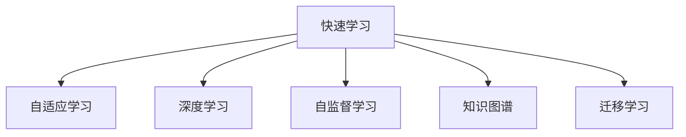

                 

# 知识的快速更新：终身学习的必要性

> 关键词：终身学习,知识更新,快速学习,人工智能,认知提升,适应性,快速适应,技术迭代,学习工具,学习策略

## 1. 背景介绍

在快速发展的信息技术时代，知识更新和技能提升的速度不断加快。新的技术、新的方法、新的理念层出不穷，使得任何一种专业技能都面临被淘汰的风险。尤其是在人工智能(AI)和机器学习领域，新的算法、新的模型、新的应用场景不断涌现，终身学习的理念就显得尤为重要。

### 1.1 问题由来

随着AI技术的不断进步，尤其是深度学习、自然语言处理(NLP)、计算机视觉等领域的突破，许多行业开始广泛应用AI技术。然而，尽管AI技术在许多领域展现了强大的潜力，但其发展速度也带来了新的挑战：

1. **技术迭代快**：深度学习、机器学习等领域的技术迭代非常快，新的算法和模型层出不穷，旧的算法和模型迅速过时。
2. **知识爆炸**：互联网上的知识更新速度非常快，信息量巨大且杂乱无章，难以通过传统学习方式掌握。
3. **技能更新需求**：AI技术的广泛应用，对从业者的技能提出了更高要求，不仅需要掌握核心技术，还需关注最新的研究进展和应用案例。

面对这些挑战，终身学习成为了一种必要选择。通过不断学习，从业者能够保持自己的竞争力，适应快速变化的技术环境和市场需求。

### 1.2 问题核心关键点

终身学习的核心在于不断更新和扩展自己的知识库，使其适应不断变化的环境和技术。其关键点包括：

- **快速学习**：掌握快速学习和有效学习的方法，能够在短时间内掌握新技术和新知识。
- **持续改进**：通过反馈机制不断改进自己的学习策略，提高学习效率和效果。
- **适应性**：具备较强的适应性，能够根据新的应用场景和需求，灵活调整自己的知识结构。
- **学习工具**：选择合适的学习工具，如在线课程、学习平台、书籍等，加速学习进程。
- **学习策略**：制定科学合理的学习策略，如主动学习、自适应学习、深度学习等。

这些关键点共同构成了终身学习的核心，旨在帮助学习者不断提升自身技能，应对快速变化的技术环境。

## 2. 核心概念与联系

### 2.1 核心概念概述

终身学习是一个复杂且多层次的概念，涉及多个核心概念，其相互联系构成了一个完整的学习框架。以下是一些关键概念及其联系：

- **快速学习**：指在有限时间内高效掌握新知识和技能的能力。这通常涉及到快速获取信息、理解概念和应用能力。
- **自适应学习**：指根据学习效果和反馈，动态调整学习策略和内容，以提高学习效率和效果。
- **深度学习**：一种特定的学习方法，强调通过多层次的特征提取和抽象，深入理解和掌握知识。
- **自监督学习**：利用无标签数据进行学习，不需要人工标注，适用于大规模数据集和复杂模型。
- **知识图谱**：一种用于表示和组织知识的网络结构，可以帮助学习者更好地理解知识的层次和关系。
- **迁移学习**：指将在一个领域学到的知识迁移到另一个领域，以加速新领域的学习。

这些概念之间的联系可以通过以下Mermaid流程图来展示：



这个流程图展示了快速学习通过深度学习、自监督学习、知识图谱和迁移学习，实现自适应学习的全过程。

## 3. 核心算法原理 & 具体操作步骤
### 3.1 算法原理概述

终身学习的核心算法原理基于认知心理学和教育学理论，旨在通过不断的知识更新和技能提升，实现个体能力的持续增强。

其基本原理可以归纳为以下几点：

1. **知识获取**：通过各种途径（如阅读、观看视频、参加培训等）获取新知识。
2. **知识存储**：将获取的知识存储到长期记忆中，以便于后续的检索和应用。
3. **知识应用**：将知识应用于实际问题解决和任务执行中，通过实践巩固和深化理解。
4. **知识评估**：通过自我评估或外部评估，了解学习效果，发现不足之处，进行改进。
5. **知识更新**：根据新知识和新技能，更新和扩展现有知识库，保持学习进程的动态调整。

### 3.2 算法步骤详解

终身学习的算法步骤包括以下几个关键步骤：

**Step 1: 确定学习目标**
- 明确自己的学习目标，如掌握某种新技术、提高某项技能等。
- 分解目标，设定阶段性的小目标，逐步推进。

**Step 2: 获取学习资源**
- 选择合适的学习资源，如在线课程、书籍、视频、课程、博客等。
- 评估资源质量，选择优质的学习材料。

**Step 3: 制定学习计划**
- 根据学习目标和资源情况，制定详细的学习计划。
- 规划每天的学习时间和内容，确保计划的可行性和有效性。

**Step 4: 实施学习计划**
- 按照学习计划进行学习，确保每阶段的小目标得到实现。
- 利用各种学习工具和技术，如笔记软件、在线论坛、编程工具等，提高学习效率。

**Step 5: 评估学习效果**
- 通过自我评估或外部评估，了解学习效果，发现不足。
- 根据评估结果，调整学习计划和策略，进一步提高学习效率和效果。

**Step 6: 应用所学知识**
- 将所学知识应用于实际问题解决和任务执行中，通过实践巩固和深化理解。
- 遇到实际问题时，及时回顾和复习所学知识，寻找解决方案。

**Step 7: 持续更新知识**
- 根据最新的技术进展和行业动态，持续更新和扩展自己的知识库。
- 关注行业会议、学术期刊、专业博客等，获取最新信息。

### 3.3 算法优缺点

终身学习的算法具有以下优点：

1. **持续进步**：通过不断的学习和更新，保持自己的技术能力和知识库的先进性。
2. **适应性强**：能够适应快速变化的技术环境和市场需求，灵活调整学习策略。
3. **创新能力**：通过不断学习新技术和新方法，提升自身的创新能力和竞争力。

同时，该算法也存在一些局限性：

1. **时间成本高**：需要投入大量时间和精力进行持续学习，对个人时间和精力有一定的要求。
2. **资源需求高**：需要持续获取高质量的学习资源，可能面临资源瓶颈。
3. **心理负担重**：面对快速变化的技术环境，学习者可能面临较大的心理压力和焦虑。

尽管存在这些局限性，但终身学习的理念仍然是当前和未来学习的重要方向，特别是在技术和知识更新速度日益加快的背景下。

### 3.4 算法应用领域

终身学习的算法应用广泛，涵盖了多个领域，包括但不限于：

- **人工智能与机器学习**：AI领域的快速发展，要求从业者持续学习和掌握新技术。
- **数据科学与大数据**：数据科学的快速发展，需要从业者不断学习和更新数据处理和分析技术。
- **软件开发与编程**：软件开发领域的快速迭代，要求程序员不断学习新的编程语言、框架和技术。
- **教育与培训**：教育领域的知识更新和教学方法的进步，要求教师和培训师不断学习和适应新的教学方法和技术。
- **商业与运营**：商业运营的数字化转型，要求管理者不断学习新的数字技术和商业模式。

以上领域只是冰山一角，随着技术和社会的发展，终身学习的应用范围将不断扩展。

## 4. 数学模型和公式 & 详细讲解 & 举例说明
### 4.1 数学模型构建

终身学习的数学模型可以基于多个角度进行构建，以下是一种基于学习效果的数学模型：

设学习者在某段时间内获取的知识为 $K$，其中 $K=\{k_1, k_2, ..., k_n\}$，每个知识单元 $k_i$ 的复杂度为 $c_i$，学习者在该知识单元上花费的时间为 $t_i$，学习效率为 $e_i$，则学习者在该时间段内获取的知识总量 $A$ 可以表示为：

$$
A = \sum_{i=1}^n e_i \cdot c_i \cdot t_i
$$

其中 $e_i$ 表示学习效率，$c_i$ 表示知识复杂度，$t_i$ 表示学习时间。

### 4.2 公式推导过程

以一个简单的数学模型为例，展示学习效果的推导过程。

假设学习者在学习过程中，每次学习一个新知识点 $k_i$，该知识点的复杂度为 $c_i$，学习效率为 $e_i$，学习时间为 $t_i$，则学习者在该知识点上的学习效果 $R_i$ 可以表示为：

$$
R_i = e_i \cdot c_i \cdot t_i
$$

将所有知识点学习效果相加，得到总学习效果 $R$：

$$
R = \sum_{i=1}^n R_i = \sum_{i=1}^n e_i \cdot c_i \cdot t_i = A
$$

这个公式表明，学习效果取决于学习效率、知识复杂度和学习时间，即学习者在有限时间内，通过高效、复杂度适中的知识学习，可以获得更好的学习效果。

### 4.3 案例分析与讲解

假设学习者希望在一个月内掌握Python编程语言，目标是熟练掌握基本语法、数据结构、算法等。他可以将学习任务分解为多个小任务，每个任务的学习效率、复杂度和所需时间如下：

- 学习基本语法，复杂度为 $c_1=0.2$，学习效率为 $e_1=0.9$，学习时间为 $t_1=4$ 小时/天。
- 学习数据结构，复杂度为 $c_2=0.5$，学习效率为 $e_2=0.8$，学习时间为 $t_2=5$ 小时/天。
- 学习算法，复杂度为 $c_3=0.6$，学习效率为 $e_3=0.7$，学习时间为 $t_3=6$ 小时/天。

将这些数据代入上述公式，得到总学习效果 $R$：

$$
R = 0.9 \cdot 0.2 \cdot 4 + 0.8 \cdot 0.5 \cdot 5 + 0.7 \cdot 0.6 \cdot 6 = 1.08 + 2 + 2.28 = 4.36
$$

这表明，通过高效、系统化的学习，学习者可以在一个月内取得良好的学习效果，掌握Python编程语言。

## 5. 项目实践：代码实例和详细解释说明
### 5.1 开发环境搭建

在进行终身学习实践前，我们需要准备好开发环境。以下是使用Python进行深度学习的开发环境配置流程：

1. 安装Anaconda：从官网下载并安装Anaconda，用于创建独立的Python环境。

2. 创建并激活虚拟环境：
```bash
conda create -n deep_learning_env python=3.8 
conda activate deep_learning_env
```

3. 安装深度学习框架：
```bash
conda install pytorch torchvision torchaudio -c pytorch
conda install tensorflow -c tensorflow
```

4. 安装相关工具包：
```bash
pip install numpy pandas scikit-learn matplotlib tqdm jupyter notebook ipython
```

完成上述步骤后，即可在`deep_learning_env`环境中开始终身学习的实践。

### 5.2 源代码详细实现

以下是一个使用Python和TensorFlow进行深度学习的代码实现，用于模拟终身学习的数学模型：

```python
import tensorflow as tf
import numpy as np

# 定义学习效率、知识复杂度和学习时间
learning_efficiency = [0.9, 0.8, 0.7]
knowledge_complexity = [0.2, 0.5, 0.6]
learning_time = [4, 5, 6]

# 计算总学习效果
total_learning_effect = np.sum([e * c * t for e, c, t in zip(learning_efficiency, knowledge_complexity, learning_time)])

print(f"总学习效果：{total_learning_effect}")
```

这段代码首先定义了学习效率、知识复杂度和学习时间，然后计算了总学习效果，并打印输出结果。

### 5.3 代码解读与分析

这段代码非常简单，主要展示了如何通过Python和NumPy进行数学计算。在实际应用中，学习者可以根据具体的学习任务，调整学习效率、知识复杂度和学习时间，计算出总学习效果，从而制定合理的学习计划。

## 6. 实际应用场景
### 6.1 人工智能与机器学习

终身学习在人工智能与机器学习领域具有重要应用。AI技术的快速发展，要求从业者不断学习新的算法和模型，保持自己的技术竞争力。例如，深度学习工程师需要学习新的深度学习框架、优化算法、数据处理技术等。

### 6.2 数据科学与大数据

数据科学领域的技术更新非常快，终身学习可以帮助从业者掌握最新的数据处理和分析技术。例如，数据科学家需要学习新的数据处理工具、机器学习算法、数据可视化技术等。

### 6.3 软件开发与编程

软件开发领域的技术迭代非常快，终身学习可以帮助程序员掌握新的编程语言、框架和技术。例如，Java开发者需要学习新的Spring框架、微服务架构、DevOps工具等。

### 6.4 教育与培训

教育领域的知识更新和教学方法的进步，要求教师和培训师不断学习新的教学方法和技术。例如，在线教育平台需要学习新的在线教学技术、互动工具、课程设计等。

### 6.5 商业与运营

商业运营的数字化转型，要求管理者不断学习新的数字技术和商业模式。例如，电子商务平台需要学习新的数据分析技术、用户行为分析、市场推广策略等。

## 7. 工具和资源推荐
### 7.1 学习资源推荐

为了帮助开发者系统掌握终身学习的理论基础和实践技巧，这里推荐一些优质的学习资源：

1. **Coursera**：提供各种在线课程，涵盖人工智能、机器学习、数据科学等领域，适合系统学习和技能提升。
2. **Udacity**：提供实战项目导向的课程，通过实践项目提升学习效果。
3. **edX**：提供高质量的在线课程，涵盖各种领域的知识更新和技能提升。
4. **Kaggle**：提供数据科学竞赛和实践项目，通过实际数据处理和分析提升技能。
5. **DataCamp**：提供数据科学和编程技能的在线课程，通过互动式练习提升学习效果。

通过对这些资源的学习实践，相信你一定能够快速掌握终身学习的精髓，不断提升自身技能。

### 7.2 开发工具推荐

高效的开发离不开优秀的工具支持。以下是几款用于深度学习和终身学习开发的常用工具：

1. **PyTorch**：基于Python的开源深度学习框架，灵活动态的计算图，适合快速迭代研究。
2. **TensorFlow**：由Google主导开发的开源深度学习框架，生产部署方便，适合大规模工程应用。
3. **Jupyter Notebook**：一个交互式开发环境，支持多种编程语言，适合数据科学和机器学习项目。
4. **Scikit-learn**：一个强大的Python机器学习库，提供了大量的算法和工具，适合快速原型开发。
5. **Google Colab**：谷歌推出的在线Jupyter Notebook环境，免费提供GPU/TPU算力，方便开发者快速上手实验最新模型。

合理利用这些工具，可以显著提升终身学习的开发效率，加快创新迭代的步伐。

### 7.3 相关论文推荐

终身学习的发展得益于学界的持续研究，以下是几篇奠基性的相关论文，推荐阅读：

1. **终身学习：自我增强学习的方法**：探讨了自我增强学习的基本原理和实现方法，提出了一种基于强化学习的终身学习框架。
2. **自适应学习：个性化学习系统的设计**：介绍了个性化学习系统的设计原理和实现方法，强调了自适应学习在终身学习中的重要性。
3. **知识图谱在终身学习中的应用**：探讨了知识图谱在终身学习中的应用，提出了一种基于知识图谱的终身学习模型。
4. **迁移学习在终身学习中的应用**：探讨了迁移学习在终身学习中的作用，提出了一种基于迁移学习的终身学习框架。
5. **深度学习在终身学习中的应用**：探讨了深度学习在终身学习中的作用，提出了一种基于深度学习的终身学习模型。

这些论文代表了大规模知识更新和技能提升的研究方向，通过学习这些前沿成果，可以帮助研究者把握学科前进方向，激发更多的创新灵感。

## 8. 总结：未来发展趋势与挑战
### 8.1 研究成果总结

终身学习的理念和实践已经成为推动技术发展和社会进步的重要驱动力。通过不断的知识更新和技能提升，从业者能够适应快速变化的技术环境，保持自身的竞争力。

### 8.2 未来发展趋势

终身学习的未来发展趋势包括：

1. **技术自动化**：随着技术的发展，许多学习任务将通过自动化的方式实现，如自动推荐课程、自动生成学习计划等。
2. **个性化学习**：通过数据分析和人工智能技术，实现个性化的学习路径和内容推荐，提高学习效果和效率。
3. **多模态学习**：将文本、图像、视频等多种信息形式结合起来，进行综合学习，提升学习效果和理解深度。
4. **社会化学习**：通过社交网络和学习社区，实现知识的共享和交流，加速知识的传播和应用。
5. **实时反馈机制**：通过实时反馈和评估机制，不断调整学习策略和内容，提高学习效果和适应性。

这些趋势将进一步推动终身学习的发展，提升学习者的技能和知识水平。

### 8.3 面临的挑战

尽管终身学习具有重要意义，但在实践中仍面临诸多挑战：

1. **时间成本高**：终身学习需要投入大量时间和精力，可能对学习者的个人生活和家庭带来一定的负担。
2. **资源需求高**：终身学习需要持续获取高质量的学习资源，可能面临资源瓶颈。
3. **心理负担重**：面对快速变化的技术环境，学习者可能面临较大的心理压力和焦虑。
4. **技术门槛高**：终身学习需要掌握多种技术工具和框架，对技术基础要求较高。
5. **知识碎片化**：互联网上的知识碎片化，难以形成系统的知识结构，可能影响学习效果。

尽管存在这些挑战，但终身学习的理念仍然是当前和未来学习的重要方向，特别是在技术和知识更新速度日益加快的背景下。

### 8.4 研究展望

面对终身学习所面临的挑战，未来的研究需要在以下几个方面寻求新的突破：

1. **技术自动化**：研究自动推荐和学习路径生成算法，降低学习者的技术门槛和时间成本。
2. **个性化学习**：研究个性化学习模型和推荐系统，提升学习效果和效率。
3. **多模态学习**：研究多模态学习方法和工具，提升学习的深度和广度。
4. **社会化学习**：研究社交网络和学习社区的构建和运营，促进知识的共享和交流。
5. **实时反馈机制**：研究实时反馈和评估技术，提升学习效果和适应性。

这些研究方向将引领终身学习技术迈向更高的台阶，为构建人机协同的智能系统铺平道路。面向未来，终身学习技术还需要与其他人工智能技术进行更深入的融合，如知识表示、因果推理、强化学习等，多路径协同发力，共同推动自然语言理解和智能交互系统的进步。

## 9. 附录：常见问题与解答

**Q1：终身学习是否适用于所有人？**

A: 终身学习适用于任何需要不断更新知识和技能的人，特别是对于技术和知识更新速度较快的领域，如AI、数据科学、软件开发等。然而，对于一些需要稳定性和重复性的工作，终身学习的必要性可能相对较低。

**Q2：如何制定有效的学习计划？**

A: 制定有效的学习计划需要考虑以下几个方面：
1. 明确学习目标和预期成果。
2. 分解目标，设定阶段性的小目标。
3. 选择高质量的学习资源和工具。
4. 安排合理的学习时间和节奏。
5. 定期评估学习效果，调整学习策略。

**Q3：如何在终身学习中保持动力？**

A: 保持学习动力的关键在于找到学习的内在驱动力和外部激励。具体方法包括：
1. 设置激励机制，如奖励自己完成任务。
2. 寻找学习伙伴，共同学习和进步。
3. 将学习目标与个人发展和生活目标结合。
4. 分享学习成果，获得他人的认可和鼓励。

**Q4：终身学习是否需要全面掌握所有技术？**

A: 终身学习不需要全面掌握所有技术，但需要掌握核心技术和关键工具，以便快速适应新的技术和应用场景。同时，通过不断学习新技术和新方法，可以逐步扩展自己的知识库，保持自身的技术竞争力。

**Q5：如何避免终身学习的资源浪费？**

A: 避免终身学习的资源浪费可以从以下几个方面入手：
1. 选择高质量的学习资源和工具。
2. 根据个人需求和目标选择学习内容。
3. 合理安排学习时间和节奏，避免过度疲劳。
4. 及时评估学习效果，调整学习策略和内容。

总之，终身学习需要系统性和规划性，只有科学合理地制定学习计划和策略，才能最大限度地发挥其优势，提升自身的技能和知识水平。

---

作者：禅与计算机程序设计艺术 / Zen and the Art of Computer Programming

