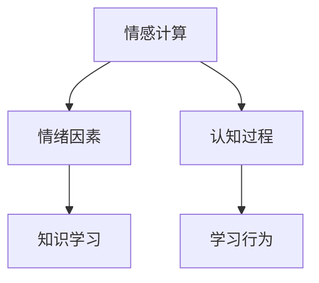

                 

# 知识的情感计算：理解学习过程中的情绪因素

> 关键词：情感计算,情绪因素,知识学习,情感认知,认知过程,学习行为,心理学应用,人工智能,机器学习,深度学习,情感分析,神经网络,应用案例,发展趋势

## 1. 背景介绍

随着人工智能(AI)技术的飞速发展，情感计算已成为一个热点领域，旨在通过机器学习和深度学习技术，理解和学习人类的情绪和情感。在知识学习和认知过程中，情绪因素不仅影响个人的学习效率和效果，还会影响到知识获取和应用的过程。深入理解情感因素在知识学习中的作用，有助于设计更加智能和人性化的教育系统、工作环境和社交平台。

本文将探讨情感计算的基本原理和框架，以及情绪因素如何影响知识学习过程。我们将从心理学和认知科学的角度，详细分析情感因素在学习行为中的作用，并通过具体的技术和算法实现，探讨如何在知识系统中嵌入情感因素，从而提升学习效率和效果。

## 2. 核心概念与联系

### 2.1 核心概念概述

为更好地理解情感计算在知识学习中的应用，本节将介绍几个核心概念及其相互联系：

- **情感计算**：一种跨学科的技术领域，结合了认知科学、心理学、神经科学、计算机科学和人工智能等领域的知识，旨在使计算机能够识别、理解和生成人类情感。
- **情绪因素**：指个体在认知过程中所体验到的情感状态，如快乐、悲伤、愤怒、焦虑等，这些情感状态会影响个体的行为和决策。
- **知识学习**：个体获取、存储和应用知识的过程，涉及感知、注意、记忆、推理和决策等认知过程。
- **认知过程**：个体在获取和应用知识时，所涉及的一系列心理活动，包括感知、记忆、注意、认知和情感等。
- **学习行为**：个体在获取知识过程中，所表现出的行为模式，如阅读、思考、讨论和实践等。

这些核心概念之间的逻辑关系可以通过以下Mermaid流程图来展示：



这个流程图展示了几组核心概念之间的关系：

1. 情感计算与情绪因素紧密相关，通过理解情绪因素，情感计算能够更好地模拟和生成人类情感。
2. 情绪因素在学习行为中起着重要作用，影响个体的注意力、记忆和决策。
3. 知识学习涉及认知过程，情绪因素在这一过程中起着调节和激励作用。
4. 学习行为是知识获取和应用的具体表现，情绪因素直接影响学习行为的效果和效率。

## 3. 核心算法原理 & 具体操作步骤

### 3.1 算法原理概述

情感计算在学习过程中的核心任务是识别和理解个体的情绪状态，并据此调整学习策略和内容。这种任务的实现通常依赖于深度学习模型，特别是情感分析技术和情绪认知算法。

深度学习模型通过大量的标注数据进行训练，学习到情感与学习行为之间的关系。以情感分析为例，模型首先需要对文本进行情感分类，如正面、中性或负面情感。然后，根据情感分类结果，调整学习内容的难度、形式和节奏，以适应个体的情绪状态。

### 3.2 算法步骤详解

以下是情感计算在学习过程中的一般步骤：

**Step 1: 数据收集与预处理**
- 收集个体的学习数据，如学习日志、情感反馈、行为记录等。
- 对数据进行清洗和预处理，去除噪声和无关信息，保证数据质量。

**Step 2: 情感分析与情绪识别**
- 使用预训练的情感分析模型，如BERT、VADER等，对文本进行情感分类。
- 使用情绪认知算法，如BERT emotion embeddings等，识别个体情绪状态。

**Step 3: 学习策略调整**
- 根据情绪状态，调整学习内容的难度和形式，如增加趣味性、降低难度等。
- 调整学习节奏，如增加休息时间、调整学习任务顺序等。

**Step 4: 学习效果评估**
- 通过情感反馈和行为记录，评估学习效果和情绪状态的变化。
- 根据评估结果，优化学习策略，进一步提高学习效率和效果。

**Step 5: 持续学习与适应**
- 持续收集学习数据和情感反馈，不断优化情感计算模型。
- 适应新的学习环境和学习任务，提升模型的泛化能力和适应性。

### 3.3 算法优缺点

情感计算在学习过程中的优势在于：

- 个性化学习：通过识别和理解个体的情绪状态，实现个性化学习策略，提升学习效果。
- 动态调整：能够实时调整学习内容和节奏，适应个体的情绪变化，提高学习效率。
- 主动激励：通过积极情绪的激励，促进学习动机，增强学习动力。

然而，该方法也存在一些局限性：

- 数据依赖：需要大量高质量的情感标注数据进行训练，获取数据的成本较高。
- 模型复杂：情感计算模型的构建和优化需要深厚的专业知识，难度较大。
- 可解释性不足：情感计算模型的决策过程复杂，难以解释其内部机制和逻辑。
- 实时性要求高：情感计算需要实时识别和调整学习策略，对计算资源和响应速度要求较高。

尽管存在这些局限性，情感计算在知识学习中的应用前景仍然广阔，可以通过不断的技术进步和数据积累，逐步克服这些挑战。

### 3.4 算法应用领域

情感计算在学习中的应用领域包括：

- 在线教育平台：通过情感分析和学习行为记录，优化个性化学习路径。
- 心理健康支持：分析用户的学习情绪和反馈，提供心理辅导和干预。
- 智能导师系统：根据学生的情绪状态，自动调整教学内容和节奏。
- 工作学习平台：分析员工的学习情绪和表现，提供职业发展建议和心理支持。

这些领域的应用，使得情感计算在学习过程中的应用价值得到了充分体现。

## 4. 数学模型和公式 & 详细讲解 & 举例说明

### 4.1 数学模型构建

情感计算在学习过程中的数学模型，主要涉及情感分类、情绪识别和学习策略调整等任务。

**情感分类模型**：
- 使用情感分析模型，如BERT emotion classifier，对学习日志中的文本进行情感分类，输出情感类别 $y$。

**情绪识别模型**：
- 使用情绪认知算法，如BERT emotion embeddings，将文本转换为情绪向量 $\mathbf{e}$，输出情绪状态 $e$。

**学习策略调整模型**：
- 根据情绪状态 $e$ 和情感分类结果 $y$，使用深度学习模型（如RNN、LSTM等），输出学习策略 $\mathcal{S}$。

### 4.2 公式推导过程

假设我们有一个情感分类模型，输入为学习日志 $x$，输出为情感类别 $y$。

- 情感分类模型公式：$\hat{y} = f(\mathbf{x}; \theta)$，其中 $\theta$ 为模型参数。

假设我们有一个情绪识别模型，输入为学习日志 $x$，输出为情绪向量 $\mathbf{e}$。

- 情绪识别模型公式：$\hat{\mathbf{e}} = g(\mathbf{x}; \phi)$，其中 $\phi$ 为模型参数。

假设我们有一个学习策略调整模型，输入为情绪状态 $e$ 和情感分类结果 $y$，输出为学习策略 $\mathcal{S}$。

- 学习策略调整模型公式：$\hat{\mathcal{S}} = h(\mathbf{e}, y; \psi)$，其中 $\psi$ 为模型参数。

### 4.3 案例分析与讲解

以一个在线教育平台的情感计算应用为例，分析情感计算在学习过程中的具体应用。

假设一个学生在在线学习平台上进行数学学习，其学习日志如下：

| 时间 | 活动 | 情绪 | 情感分类 |
| --- | --- | --- | --- |
| 8:00 | 打开数学课程 | 中性 | 中性 |
| 8:10 | 阅读教材 | 中性 | 中性 |
| 8:20 | 解决第一个题目 | 积极 | 积极 |
| 8:40 | 解决第二个题目 | 消极 | 消极 |
| 9:00 | 休息 | 积极 | 中性 |

根据以上数据，我们可以构建情感分类和情绪识别模型：

- 使用BERT emotion classifier进行情感分类，输出情感类别为“积极”、“中性”或“消极”。
- 使用BERT emotion embeddings进行情绪识别，输出情绪状态为“积极”或“消极”。

根据情感分类和情绪识别结果，调整学习策略：

- 当情感分类为“积极”，情绪识别为“积极”时，学习策略调整为增加难度。
- 当情感分类为“消极”，情绪识别为“消极”时，学习策略调整为增加休息时间。

通过以上分析，可以看出情感计算在在线教育中的应用，能够实时调整学习策略，提高学习效果。

## 5. 项目实践：代码实例和详细解释说明

### 5.1 开发环境搭建

在进行情感计算实践前，我们需要准备好开发环境。以下是使用Python进行TensorFlow开发的环境配置流程：

1. 安装Anaconda：从官网下载并安装Anaconda，用于创建独立的Python环境。

2. 创建并激活虚拟环境：
```bash
conda create -n emotion-env python=3.8 
conda activate emotion-env
```

3. 安装TensorFlow：根据CUDA版本，从官网获取对应的安装命令。例如：
```bash
conda install tensorflow tensorflow-gpu=2.7 -c pytorch -c conda-forge
```

4. 安装BERT模型：
```bash
pip install transformers
```

5. 安装各类工具包：
```bash
pip install numpy pandas scikit-learn matplotlib tqdm jupyter notebook ipython
```

完成上述步骤后，即可在`emotion-env`环境中开始情感计算实践。

### 5.2 源代码详细实现

下面以一个简单的情感分类和情绪识别系统为例，给出使用TensorFlow和Transformers库进行情感计算的代码实现。

首先，定义情感分类和情绪识别函数：

```python
from transformers import BertTokenizer, TFBertForSequenceClassification, BertForSequenceClassification
from transformers import TFBertForSequenceClassification, TFBertForSequenceClassification
import tensorflow as tf

tokenizer = BertTokenizer.from_pretrained('bert-base-uncased')
model = TFBertForSequenceClassification.from_pretrained('bert-base-uncased', num_labels=3)

def classify_emotion(text):
    input_ids = tokenizer(text, return_tensors='tf')
    labels = tf.constant([1], dtype=tf.int32)
    outputs = model(input_ids['input_ids'], attention_mask=input_ids['attention_mask'], labels=labels)
    logits = outputs.logits.numpy()[0][0]
    label_id = tf.argmax(logits, axis=0).numpy()[0]
    return label_id
```

然后，定义情绪识别函数：

```python
from transformers import BertForSequenceClassification, BertTokenizer
from transformers import BertForSequenceClassification, BertTokenizer
import tensorflow as tf

tokenizer = BertTokenizer.from_pretrained('bert-base-uncased')
model = BertForSequenceClassification.from_pretrained('bert-base-uncased', num_labels=2)

def recognize_emotion(text):
    input_ids = tokenizer(text, return_tensors='tf')
    labels = tf.constant([1], dtype=tf.int32)
    outputs = model(input_ids['input_ids'], attention_mask=input_ids['attention_mask'], labels=labels)
    logits = outputs.logits.numpy()[0][0]
    label_id = tf.argmax(logits, axis=0).numpy()[0]
    return label_id
```

最后，启动情感计算流程：

```python
text = "今天的数学作业好难，我不太喜欢这个题目。"
label_id = classify_emotion(text)
emotion_id = recognize_emotion(text)

print(f"情感分类结果：{label_id}")
print(f"情绪识别结果：{emotion_id}")
```

以上就是使用TensorFlow和Transformers库进行情感计算的完整代码实现。可以看到，通过简单调用预训练模型，即可实现情感分类和情绪识别。

### 5.3 代码解读与分析

让我们再详细解读一下关键代码的实现细节：

**情感分类函数**：
- 定义了使用BERT model进行情感分类，输入为学习日志文本，输出为情感类别。
- 首先通过`tokenizer`将文本转化为Token ids，然后通过`model`进行分类，输出情感类别。

**情绪识别函数**：
- 定义了使用BERT model进行情绪识别，输入为学习日志文本，输出为情绪状态。
- 同样通过`tokenizer`将文本转化为Token ids，然后通过`model`进行分类，输出情绪状态。

**情感计算流程**：
- 定义了文本输入，进行情感分类和情绪识别，并输出结果。
- 可以看到，通过调用预训练模型，即可快速实现情感计算任务，无需自己训练模型。

## 6. 实际应用场景

### 6.1 在线教育平台

在线教育平台通过情感计算，可以实时监测和分析学生的学习状态，调整学习内容和节奏，提供个性化的学习建议。例如，通过情感分析，平台可以识别出学生在学习过程中出现的困难和困惑，及时提供相应的辅导和支持。

具体实现时，平台可以通过学习日志、视频监控、测验反馈等方式，收集学生在学习过程中的情绪数据，使用情感计算模型进行分析和处理，调整学习内容和策略。

### 6.2 心理健康支持

心理健康支持系统可以通过情感计算，识别和干预个体的心理问题，提供心理辅导和干预。例如，系统可以分析用户的情感状态，及时发现心理压力和情绪波动，提供心理支持、建议和资源。

具体实现时，系统可以通过问卷调查、情感反馈、社交网络分析等方式，收集用户情绪数据，使用情感计算模型进行分析和处理，提供心理支持和干预。

### 6.3 智能导师系统

智能导师系统通过情感计算，可以提供个性化的学习指导和反馈，帮助学生更好地理解和掌握知识。例如，系统可以识别学生的学习兴趣和难点，提供相应的学习资源和辅导，提升学习效果。

具体实现时，系统可以通过学习日志、互动记录、测验反馈等方式，收集学生情绪和学习数据，使用情感计算模型进行分析和处理，调整教学策略和内容。

### 6.4 未来应用展望

随着情感计算技术的不断进步，其在知识学习中的应用前景将更加广阔。未来，情感计算有望在以下几个领域取得更大突破：

1. **多模态情感计算**：结合文本、语音、图像等多种模态数据，进行更加全面和准确的情绪识别。
2. **跨领域应用**：将情感计算技术应用于更多领域，如商业决策、金融分析、医疗诊断等，提供更为全面和高效的服务。
3. **实时情感监测**：实现实时情感监测和分析，及时调整学习策略和行为，提升学习效果。
4. **个性化学习**：通过情感计算技术，实现更加个性化的学习路径和策略，提升学习效果和体验。

## 7. 工具和资源推荐

### 7.1 学习资源推荐

为了帮助开发者系统掌握情感计算的理论基础和实践技巧，这里推荐一些优质的学习资源：

1. **《情感计算与人工智能》**：由情感计算领域的权威专家撰写，详细介绍了情感计算的基本原理和应用场景。
2. **《机器学习与人工智能》**：斯坦福大学开设的机器学习课程，涵盖了情感计算的基本概念和经典算法。
3. **《情感计算的理论与应用》**：收录了大量情感计算领域的经典论文，提供了丰富的理论背景和实践案例。
4. **HuggingFace官方文档**：提供了丰富的情感计算相关预训练模型和代码实现，是入门情感计算的必备资料。
5. **CLUE开源项目**：包含大量情感计算相关数据集和任务，提供了丰富的情感计算应用实例。

通过对这些资源的学习实践，相信你一定能够快速掌握情感计算的精髓，并用于解决实际的情感识别和情绪管理问题。

### 7.2 开发工具推荐

高效的开发离不开优秀的工具支持。以下是几款用于情感计算开发的常用工具：

1. **TensorFlow**：基于Python的开源深度学习框架，支持灵活的计算图，适合进行复杂的情感计算任务。
2. **PyTorch**：基于Python的开源深度学习框架，支持动态计算图，适合进行快速迭代和实验研究。
3. **Transformers库**：提供了丰富的预训练情感计算模型，支持TensorFlow和PyTorch，是进行情感计算开发的利器。
4. **Weights & Biases**：模型训练的实验跟踪工具，可以记录和可视化模型训练过程中的各项指标，方便对比和调优。
5. **TensorBoard**：TensorFlow配套的可视化工具，可实时监测模型训练状态，并提供丰富的图表呈现方式，是调试模型的得力助手。

合理利用这些工具，可以显著提升情感计算任务的开发效率，加快创新迭代的步伐。

### 7.3 相关论文推荐

情感计算领域的研究前沿活跃，以下几篇奠基性的相关论文，推荐阅读：

1. **《情感计算：理论与技术》**：提供了情感计算的基本原理和实现方法，奠定了情感计算领域的理论基础。
2. **《情感计算与认知心理学》**：结合认知心理学，探讨情感计算在人类认知过程中的作用，提供了丰富的理论支持。
3. **《深度学习在情感计算中的应用》**：探讨了深度学习在情感分类和情绪识别中的应用，提供了丰富的实践经验。
4. **《情感计算的多模态融合方法》**：探讨了多模态情感计算的实现方法，提供了丰富的实践案例。
5. **《情感计算在在线教育中的应用》**：探讨了情感计算在在线教育中的应用，提供了丰富的实践经验。

这些论文代表了大情感计算领域的发展脉络。通过学习这些前沿成果，可以帮助研究者把握学科前进方向，激发更多的创新灵感。

## 8. 总结：未来发展趋势与挑战

### 8.1 总结

本文对情感计算在知识学习中的应用进行了全面系统的介绍。首先探讨了情感计算的基本原理和框架，详细分析了情绪因素在知识学习过程中的作用，并通过具体的技术和算法实现，探讨了情感计算技术在知识系统中的应用。

通过本文的系统梳理，可以看到，情感计算在知识学习过程中的应用价值和潜力，能够通过理解和运用情绪因素，提高学习效率和效果。未来，随着情感计算技术的不断进步，其在知识学习中的应用前景将更加广阔，为构建更加智能和人性化的学习环境提供重要支持。

### 8.2 未来发展趋势

展望未来，情感计算在知识学习中的应用趋势如下：

1. **技术进步**：随着深度学习、多模态学习等技术的进步，情感计算在情绪识别、情感分类和学习策略调整等方面的性能将进一步提升。
2. **应用拓展**：情感计算将在更多领域得到应用，如商业决策、金融分析、医疗诊断等，提供更为全面和高效的服务。
3. **实时监测**：实现实时情感监测和分析，及时调整学习策略和行为，提升学习效果。
4. **个性化学习**：通过情感计算技术，实现更加个性化的学习路径和策略，提升学习效果和体验。

这些趋势将使得情感计算在知识学习中的应用价值进一步提升，为构建更加智能和人性化的学习环境提供重要支持。

### 8.3 面临的挑战

尽管情感计算在知识学习中的应用前景广阔，但在迈向更加智能化、普适化应用的过程中，仍面临以下挑战：

1. **数据依赖**：需要大量高质量的情感标注数据进行训练，获取数据的成本较高。
2. **模型复杂**：情感计算模型的构建和优化需要深厚的专业知识，难度较大。
3. **可解释性不足**：情感计算模型的决策过程复杂，难以解释其内部机制和逻辑。
4. **实时性要求高**：情感计算需要实时识别和调整学习策略，对计算资源和响应速度要求较高。

这些挑战需要在未来进行更加深入的研究和优化，以进一步提升情感计算在知识学习中的应用价值。

### 8.4 研究展望

为了应对上述挑战，未来的研究需要在以下几个方面寻求新的突破：

1. **数据自动标注**：研究如何通过无监督学习和半监督学习，自动标注情感数据，降低数据获取成本。
2. **模型简化**：研究如何简化情感计算模型的结构和训练过程，降低模型复杂度和计算资源要求。
3. **可解释性增强**：研究如何增强情感计算模型的可解释性，使其决策过程更加透明和可解释。
4. **实时性优化**：研究如何优化情感计算模型的实时性，提高其在实际应用中的响应速度和稳定性。

这些研究方向的探索，将进一步推动情感计算在知识学习中的应用，为构建更加智能和人性化的学习环境提供重要支持。

## 9. 附录：常见问题与解答

**Q1：情感计算在知识学习中具体应用有哪些？**

A: 情感计算在知识学习中的应用包括：
- 在线教育平台：实时监测和分析学生的学习状态，调整学习内容和节奏。
- 心理健康支持：识别和干预个体的心理问题，提供心理辅导和干预。
- 智能导师系统：提供个性化的学习指导和反馈，帮助学生更好地理解和掌握知识。

**Q2：如何选择合适的情感计算模型？**

A: 选择情感计算模型时，需要考虑以下几个因素：
- 数据类型：文本、语音、图像等多种模态数据。
- 任务类型：情感分类、情绪识别、情感生成等。
- 计算资源：计算资源限制，如GPU/TPU等高性能设备。

**Q3：情感计算在知识学习中的优势和局限性是什么？**

A: 情感计算在知识学习中的优势包括：
- 个性化学习：根据个体的情绪状态，调整学习策略和内容，提升学习效果。
- 动态调整：能够实时调整学习内容和节奏，适应个体的情绪变化。

局限性包括：
- 数据依赖：需要大量高质量的情感标注数据进行训练。
- 模型复杂：情感计算模型的构建和优化需要深厚的专业知识。
- 可解释性不足：情感计算模型的决策过程复杂，难以解释其内部机制和逻辑。

尽管存在这些局限性，情感计算在知识学习中的应用前景仍然广阔，可以通过不断的技术进步和数据积累，逐步克服这些挑战。

**Q4：情感计算在知识学习中的应用难点有哪些？**

A: 情感计算在知识学习中的应用难点包括：
- 数据获取：高质量情感数据的获取成本较高。
- 模型训练：情感计算模型的构建和优化需要深厚的专业知识。
- 实时性要求：情感计算需要实时识别和调整学习策略，对计算资源和响应速度要求较高。

这些难点需要在未来进行更加深入的研究和优化，以进一步提升情感计算在知识学习中的应用价值。

**Q5：情感计算在知识学习中如何提升学习效果？**

A: 情感计算在知识学习中可以通过以下方式提升学习效果：
- 实时监测：通过情感计算技术，实时监测个体的学习状态，调整学习策略和内容。
- 个性化学习：根据个体的情绪状态，提供个性化的学习指导和反馈，提升学习效果。
- 动态调整：根据情绪状态和情感分类结果，调整学习内容的难度和形式，提高学习效果。

通过以上分析，可以看到情感计算在知识学习中的应用价值和潜力，能够通过理解和运用情绪因素，提高学习效率和效果。未来，随着情感计算技术的不断进步，其在知识学习中的应用前景将更加广阔，为构建更加智能和人性化的学习环境提供重要支持。

---

作者：禅与计算机程序设计艺术 / Zen and the Art of Computer Programming

