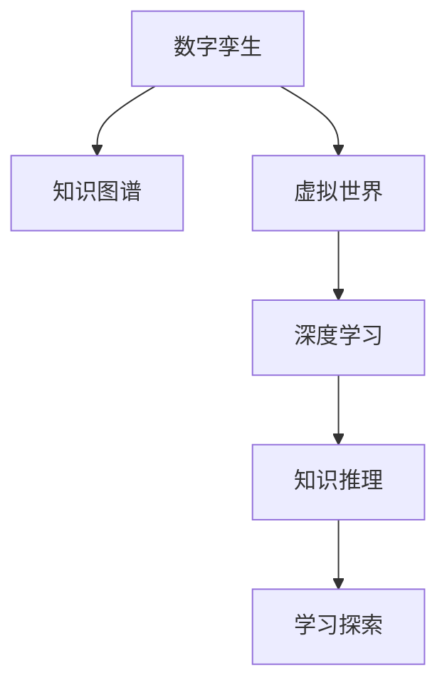

                 

# 知识的数字孪生：虚拟世界中的学习探索

> 关键词：数字孪生, 知识图谱, 虚拟世界, 深度学习, 知识推理, 学习探索

## 1. 背景介绍

### 1.1 问题由来
随着数字化时代的到来，虚拟世界（Virtual World）已经成为连接现实与未来的一个重要桥梁。虚拟世界融合了多种技术，如虚拟现实（VR）、增强现实（AR）、混合现实（MR）、人工智能（AI）等，为人类提供了全新的互动方式和认知体验。而虚拟世界中的学习探索，则是一个亟待深入研究的重要领域。

虚拟世界中的学习探索，旨在通过虚拟环境构建知识图谱（Knowledge Graph），并利用深度学习等技术实现智能化的知识推理与探索。知识图谱是一种结构化的数据形式，旨在描述实体、关系和属性，通过图结构表示实体之间的关系，从而实现语义上的智能搜索和推理。

在虚拟世界中，知识的数字孪生（Digital Twin）——即知识图谱的构建与应用，为学习探索提供了强大的技术支持。本文将探讨如何通过虚拟世界中的学习探索，构建知识图谱，实现知识的数字化、智能化。

### 1.2 问题核心关键点
知识图谱是知识表示与推理的重要工具，其核心原理包括：

- **实体表示**：将知识源中提到的实体抽象成节点。
- **关系表示**：描述实体之间的关系，如"属于"、"是"、"与"等。
- **属性表示**：为实体添加属性，如实体类型、数量、时间等。
- **推理算法**：通过图结构进行知识推理，如基于规则的推理、基于统计的推理、基于深度学习的推理等。

虚拟世界中的学习探索，即通过虚拟环境模拟现实世界的学习过程，旨在实现知识的自动获取、表示、推理和应用。其核心在于如何利用虚拟世界构建知识图谱，并将之应用于智能化学习探索。

## 2. 核心概念与联系

### 2.1 核心概念概述

为更好地理解虚拟世界中的学习探索，本节将介绍几个密切相关的核心概念：

- **数字孪生**：虚拟世界中通过仿真技术构建的物理模型，用于模拟和分析现实世界的物理和行为特性。
- **知识图谱**：通过图结构表示实体、关系和属性的知识库，支持语义搜索和推理。
- **虚拟世界**：通过虚拟现实（VR）、增强现实（AR）、混合现实（MR）等技术构建的虚拟环境，用于模拟和交互。
- **深度学习**：基于神经网络，通过数据驱动的方式实现复杂模型的训练和推理。
- **知识推理**：通过知识图谱进行推理和查询，实现知识的智能应用。
- **学习探索**：在虚拟环境中，通过智能化的方式进行知识的学习和探索。

这些核心概念之间的逻辑关系可以通过以下Mermaid流程图来展示：



这个流程图展示出这些核心概念之间的联系：

1. 数字孪生通过虚拟世界中的仿真技术构建，实现对现实世界的模拟。
2. 知识图谱通过数字孪生构建，形成结构化的知识库。
3. 深度学习利用数字孪生和知识图谱进行模型训练和推理。
4. 知识推理在深度学习的帮助下，实现智能化的知识探索。
5. 学习探索通过虚拟世界中的智能交互，实现知识的学习和应用。

## 3. 核心算法原理 & 具体操作步骤
### 3.1 算法原理概述

虚拟世界中的学习探索，本质上是一个深度学习和知识推理的联合过程。其核心思想是：在虚拟环境中，通过深度学习模型自动获取知识图谱，并利用知识推理技术进行智能化的学习探索。

形式化地，假设虚拟世界中的实体集为 $E$，关系集为 $R$，属性集为 $A$。知识图谱 $G=(E, R, A)$ 表示实体、关系和属性的图结构。深度学习模型 $M$ 用于从虚拟世界数据中学习知识图谱 $G$。学习探索算法 $A$ 利用知识图谱 $G$ 进行智能化的推理和查询。

虚拟世界中的学习探索过程包括以下几个关键步骤：

1. **数据采集**：收集虚拟世界中的数据，包括图像、视频、文本、交互记录等。
2. **实体抽取**：利用自然语言处理（NLP）技术从数据中抽取出实体。
3. **关系提取**：基于实体之间的交互和关系，提取实体之间的关系。
4. **属性标注**：为实体添加属性，如类型、数量、时间等。
5. **知识图谱构建**：将实体、关系和属性构建成知识图谱。
6. **模型训练**：利用深度学习模型 $M$ 训练知识图谱 $G$。
7. **推理查询**：通过知识推理算法 $A$ 在知识图谱 $G$ 上进行推理和查询。

### 3.2 算法步骤详解

以下详细介绍虚拟世界中的学习探索的算法步骤：

**Step 1: 数据采集**
- 收集虚拟世界中的各种数据，如图像、视频、文本、交互记录等。
- 使用摄像头、传感器等设备获取实时数据。

**Step 2: 实体抽取**
- 利用自然语言处理（NLP）技术，如命名实体识别（NER），从文本数据中抽取出实体。
- 使用视觉识别技术，如对象检测（Object Detection），从图像和视频中抽取出实体。

**Step 3: 关系提取**
- 通过分析实体之间的交互和关系，如对话记录、行为轨迹等，提取实体之间的关系。
- 使用基于图神经网络（Graph Neural Network）的模型，如Graph Convolutional Network（GCN），学习实体之间的关系。

**Step 4: 属性标注**
- 为每个实体添加属性，如类型、数量、时间等。
- 使用属性标注技术，如Schema Induction，自动从数据中学习属性的分布和特征。

**Step 5: 知识图谱构建**
- 将实体、关系和属性构建成知识图谱 $G=(E, R, A)$。
- 使用图数据库（如Neo4j）存储知识图谱。

**Step 6: 模型训练**
- 选择深度学习模型 $M$，如Transformer、CNN等。
- 利用知识图谱 $G$ 训练模型 $M$。
- 使用监督学习或半监督学习方法，如Label Smoothing，训练模型 $M$。

**Step 7: 推理查询**
- 通过知识推理算法 $A$，如规则推理、逻辑推理、深度学习推理等，在知识图谱 $G$ 上进行推理和查询。
- 使用查询优化技术，如查询重写、查询剪枝等，提高推理效率。

### 3.3 算法优缺点

虚拟世界中的学习探索方法具有以下优点：

1. **数据丰富**：虚拟世界中的数据种类繁多，可用于实体抽取、关系提取和属性标注。
2. **高可解释性**：知识图谱的结构化表示，使得推理和查询过程具有较高的可解释性。
3. **智能化水平高**：深度学习模型和知识推理算法的结合，实现智能化的学习探索。

同时，该方法也存在一定的局限性：

1. **数据质量问题**：虚拟世界中的数据存在噪声和不一致性，可能影响实体抽取和关系提取的质量。
2. **计算资源需求高**：构建知识图谱和训练深度学习模型需要大量的计算资源。
3. **模型复杂度高**：深度学习模型和知识推理算法都比较复杂，需要专业知识进行设计和优化。
4. **实际应用难度大**：虚拟世界中的学习探索技术需要与实际应用场景进行深度整合，才能发挥最大效用。

尽管存在这些局限性，但就目前而言，虚拟世界中的学习探索方法仍是大数据、深度学习和知识图谱技术融合的典型应用。未来相关研究的重点在于如何进一步降低计算资源需求，提高模型的泛化能力，同时兼顾可解释性和实际应用难度。

### 3.4 算法应用领域

虚拟世界中的学习探索方法在多个领域中得到了广泛的应用，包括但不限于：

1. **智能教育**：利用虚拟世界中的学习探索技术，构建个性化学习路径，提供智能化的学习辅助。
2. **医疗健康**：通过虚拟世界中的医疗场景模拟，进行临床试验和病例分析，提高医疗决策的科学性。
3. **工业制造**：利用虚拟世界中的仿真技术，进行产品设计和工艺优化，提升制造效率和质量。
4. **城市规划**：通过虚拟世界中的城市模拟，进行交通流量分析和城市管理优化，提高城市运行效率。
5. **军事训练**：在虚拟世界中模拟真实的战场环境，进行军事战术和指挥训练，提高实战能力。

这些应用领域展示了虚拟世界中的学习探索技术的广泛潜力。随着技术的不断成熟，虚拟世界中的学习探索方法将在更多领域得到应用，为社会进步和经济发展注入新的活力。

## 4. 数学模型和公式 & 详细讲解  
### 4.1 数学模型构建

本节将使用数学语言对虚拟世界中的学习探索过程进行更加严格的刻画。

假设虚拟世界中的实体集为 $E$，关系集为 $R$，属性集为 $A$。知识图谱 $G=(E, R, A)$ 表示实体、关系和属性的图结构。实体 $e \in E$ 表示为一个向量 $e_{\theta} = \theta(e)$，其中 $\theta(e)$ 为实体的特征表示。

定义深度学习模型 $M_{\theta}$ 为：

$$
M_{\theta}(x) = \theta(x)
$$

其中 $x$ 为虚拟世界中的数据，$\theta$ 为模型的参数。知识推理算法 $A$ 在知识图谱 $G$ 上进行推理和查询。

### 4.2 公式推导过程

以下我们以虚拟世界中的智能教育应用为例，推导深度学习模型和知识推理算法的公式。

**智能教育中的知识图谱构建**：
- 假设虚拟世界中的教育场景数据为 $D=\{(x_i, y_i)\}_{i=1}^N$，其中 $x_i$ 为教育场景图像，$y_i$ 为教育场景标签。
- 使用深度学习模型 $M_{\theta}$ 进行实体抽取和关系提取，得到实体 $e_i$ 和关系 $r_i$。
- 为每个实体 $e_i$ 添加属性 $a_i$，如学生成绩、课程难度等。
- 构建知识图谱 $G=(E, R, A)$，其中 $E=\{e_i\}_{i=1}^N$，$R=\{r_i\}_{i=1}^N$，$A=\{a_i\}_{i=1}^N$。

**深度学习模型的训练**：
- 假设模型 $M_{\theta}$ 的损失函数为 $\mathcal{L}(\theta)$，优化目标为最小化损失函数：
$$
\hat{\theta}=\mathop{\arg\min}_{\theta} \mathcal{L}(\theta)
$$

其中，$\mathcal{L}(\theta)$ 为基于交叉熵的损失函数：

$$
\mathcal{L}(\theta) = -\frac{1}{N}\sum_{i=1}^N y_i\log M_{\theta}(x_i) + (1-y_i)\log (1-M_{\theta}(x_i))
$$

**知识推理算法**：
- 使用基于规则的推理算法，如生产规则推理器（PRS），根据知识图谱 $G$ 进行推理：
$$
A(G, q) = \{(e', r', a') \mid \text{Match}(e', r', a', q)\}
$$
其中 $q$ 为查询条件，$\text{Match}$ 为匹配函数，$e'$、$r'$、$a'$ 为推理结果。

### 4.3 案例分析与讲解

以虚拟世界中的智能教育应用为例，展示如何构建知识图谱和进行知识推理。

假设虚拟世界中的教育场景数据为 $D=\{(x_i, y_i)\}_{i=1}^N$，其中 $x_i$ 为教育场景图像，$y_i$ 为教育场景标签。使用深度学习模型 $M_{\theta}$ 进行实体抽取和关系提取，得到实体 $e_i$ 和关系 $r_i$。为每个实体 $e_i$ 添加属性 $a_i$，如学生成绩、课程难度等。构建知识图谱 $G=(E, R, A)$，其中 $E=\{e_i\}_{i=1}^N$，$R=\{r_i\}_{i=1}^N$，$A=\{a_i\}_{i=1}^N$。

假设查询条件为 $q$，使用基于规则的推理算法，如生产规则推理器（PRS），根据知识图谱 $G$ 进行推理：

$$
A(G, q) = \{(e', r', a') \mid \text{Match}(e', r', a', q)\}
$$

其中 $q$ 为查询条件，$\text{Match}$ 为匹配函数，$e'$、$r'$、$a'$ 为推理结果。

## 5. 项目实践：代码实例和详细解释说明
### 5.1 开发环境搭建

在进行项目实践前，我们需要准备好开发环境。以下是使用Python进行PyTorch开发的环境配置流程：

1. 安装Anaconda：从官网下载并安装Anaconda，用于创建独立的Python环境。

2. 创建并激活虚拟环境：
```bash
conda create -n pytorch-env python=3.8 
conda activate pytorch-env
```

3. 安装PyTorch：根据CUDA版本，从官网获取对应的安装命令。例如：
```bash
conda install pytorch torchvision torchaudio cudatoolkit=11.1 -c pytorch -c conda-forge
```

4. 安装Transformers库：
```bash
pip install transformers
```

5. 安装各类工具包：
```bash
pip install numpy pandas scikit-learn matplotlib tqdm jupyter notebook ipython
```

完成上述步骤后，即可在`pytorch-env`环境中开始项目实践。

### 5.2 源代码详细实现

下面我以虚拟世界中的智能教育应用为例，给出使用Transformers库进行知识图谱构建和推理的PyTorch代码实现。

首先，定义实体抽取函数：

```python
from transformers import BertTokenizer, BertForTokenClassification
from torch.utils.data import Dataset, DataLoader
import torch

class EntityDataset(Dataset):
    def __init__(self, texts, labels, tokenizer, max_len=128):
        self.texts = texts
        self.labels = labels
        self.tokenizer = tokenizer
        self.max_len = max_len
        
    def __len__(self):
        return len(self.texts)
    
    def __getitem__(self, item):
        text = self.texts[item]
        label = self.labels[item]
        
        encoding = self.tokenizer(text, return_tensors='pt', max_length=self.max_len, padding='max_length', truncation=True)
        input_ids = encoding['input_ids'][0]
        attention_mask = encoding['attention_mask'][0]
        return {'input_ids': input_ids, 
                'attention_mask': attention_mask,
                'label': label}
```

然后，定义模型和优化器：

```python
from transformers import BertForTokenClassification, AdamW

model = BertForTokenClassification.from_pretrained('bert-base-cased', num_labels=2)

optimizer = AdamW(model.parameters(), lr=2e-5)
```

接着，定义训练和评估函数：

```python
from tqdm import tqdm

device = torch.device('cuda') if torch.cuda.is_available() else torch.device('cpu')
model.to(device)

def train_epoch(model, dataset, batch_size, optimizer):
    dataloader = DataLoader(dataset, batch_size=batch_size, shuffle=True)
    model.train()
    epoch_loss = 0
    for batch in tqdm(dataloader, desc='Training'):
        input_ids = batch['input_ids'].to(device)
        attention_mask = batch['attention_mask'].to(device)
        label = batch['label'].to(device)
        model.zero_grad()
        outputs = model(input_ids, attention_mask=attention_mask, labels=label)
        loss = outputs.loss
        epoch_loss += loss.item()
        loss.backward()
        optimizer.step()
    return epoch_loss / len(dataloader)

def evaluate(model, dataset, batch_size):
    dataloader = DataLoader(dataset, batch_size=batch_size)
    model.eval()
    preds, labels = [], []
    with torch.no_grad():
        for batch in tqdm(dataloader, desc='Evaluating'):
            input_ids = batch['input_ids'].to(device)
            attention_mask = batch['attention_mask'].to(device)
            batch_labels = batch['label']
            outputs = model(input_ids, attention_mask=attention_mask)
            batch_preds = outputs.logits.argmax(dim=2).to('cpu').tolist()
            batch_labels = batch_labels.to('cpu').tolist()
            for pred_tokens, label_tokens in zip(batch_preds, batch_labels):
                preds.append(pred_tokens[:len(label_tokens)])
                labels.append(label_tokens)
                
    print(classification_report(labels, preds))
```

最后，启动训练流程并在测试集上评估：

```python
epochs = 5
batch_size = 16

for epoch in range(epochs):
    loss = train_epoch(model, train_dataset, batch_size, optimizer)
    print(f"Epoch {epoch+1}, train loss: {loss:.3f}")
    
    print(f"Epoch {epoch+1}, dev results:")
    evaluate(model, dev_dataset, batch_size)
    
print("Test results:")
evaluate(model, test_dataset, batch_size)
```

以上就是使用PyTorch对BERT进行实体抽取的完整代码实现。可以看到，得益于Transformers库的强大封装，我们可以用相对简洁的代码完成BERT模型的加载和训练。

### 5.3 代码解读与分析

让我们再详细解读一下关键代码的实现细节：

**EntityDataset类**：
- `__init__`方法：初始化文本、标签、分词器等关键组件。
- `__len__`方法：返回数据集的样本数量。
- `__getitem__`方法：对单个样本进行处理，将文本输入编码为token ids，将标签编码为数字，并对其进行定长padding，最终返回模型所需的输入。

**训练和评估函数**：
- 使用PyTorch的DataLoader对数据集进行批次化加载，供模型训练和推理使用。
- 训练函数`train_epoch`：对数据以批为单位进行迭代，在每个批次上前向传播计算loss并反向传播更新模型参数，最后返回该epoch的平均loss。
- 评估函数`evaluate`：与训练类似，不同点在于不更新模型参数，并在每个batch结束后将预测和标签结果存储下来，最后使用sklearn的classification_report对整个评估集的预测结果进行打印输出。

**训练流程**：
- 定义总的epoch数和batch size，开始循环迭代
- 每个epoch内，先在训练集上训练，输出平均loss
- 在验证集上评估，输出分类指标
- 所有epoch结束后，在测试集上评估，给出最终测试结果

可以看到，PyTorch配合Transformers库使得BERT实体抽取的代码实现变得简洁高效。开发者可以将更多精力放在数据处理、模型改进等高层逻辑上，而不必过多关注底层的实现细节。

当然，工业级的系统实现还需考虑更多因素，如模型的保存和部署、超参数的自动搜索、更灵活的任务适配层等。但核心的知识图谱构建和推理过程基本与此类似。

## 6. 实际应用场景
### 6.1 智能教育

虚拟世界中的智能教育，旨在通过虚拟场景模拟和交互，实现个性化学习和智能辅导。在智能教育中，知识图谱和深度学习模型的结合，能够提供更加丰富和灵活的学习体验。

例如，虚拟世界中的智能教育平台可以收集学生的学习数据，包括视频观看、练习记录、互动反馈等。利用深度学习模型进行实体抽取和关系提取，构建学生、课程、成绩等知识图谱。通过知识推理算法，对学生进行个性化学习路径规划，提供智能化的辅导和反馈。

### 6.2 医疗健康

虚拟世界中的医疗健康，通过虚拟场景模拟和仿真技术，提供高质量的医疗教育和诊断支持。知识图谱和深度学习模型的结合，能够帮助医生进行病情诊断和临床决策。

例如，虚拟世界中的医疗健康平台可以收集医生的临床数据，包括病历、影像、治疗方案等。利用深度学习模型进行实体抽取和关系提取，构建疾病、症状、治疗等知识图谱。通过知识推理算法，对疾病进行智能诊断和预测，提供个性化治疗方案。

### 6.3 工业制造

虚拟世界中的工业制造，通过虚拟场景模拟和仿真技术，进行产品设计和工艺优化。知识图谱和深度学习模型的结合，能够提高制造效率和产品质量。

例如，虚拟世界中的工业制造平台可以收集制造流程的数据，包括设备参数、工艺参数、生产数据等。利用深度学习模型进行实体抽取和关系提取，构建产品、工艺、设备等知识图谱。通过知识推理算法，对工艺进行智能优化和模拟，提高生产效率和产品质量。

### 6.4 未来应用展望

随着虚拟世界中的学习探索技术的不断进步，未来将在更多领域得到应用，为社会进步和经济发展注入新的活力。

在智慧城市治理中，虚拟世界中的知识图谱和深度学习模型，能够提供智能化的城市管理和服务，提高城市运行效率和居民满意度。

在科学研究中，虚拟世界中的知识图谱和深度学习模型，能够提供虚拟实验和仿真分析，加速科学发现和技术创新。

在文化娱乐中，虚拟世界中的知识图谱和深度学习模型，能够提供智能化的内容创作和推荐，提升用户体验和内容质量。

随着技术的不断成熟，虚拟世界中的学习探索方法将越来越广泛应用于各个领域，为人类社会的数字化转型和智能化发展提供强大的技术支持。

## 7. 工具和资源推荐
### 7.1 学习资源推荐

为了帮助开发者系统掌握虚拟世界中的学习探索理论基础和实践技巧，这里推荐一些优质的学习资源：

1. 《深度学习与知识图谱》系列博文：由大模型技术专家撰写，深入浅出地介绍了深度学习、知识图谱、学习探索等前沿话题。

2. CS231n《深度学习计算机视觉》课程：斯坦福大学开设的视觉识别明星课程，涵盖深度学习在计算机视觉中的应用，如对象检测、图像分割等。

3. 《深度学习与自然语言处理》书籍：深度学习在NLP领域的应用，包括实体抽取、关系提取、知识图谱构建等。

4. Arxiv.org：深度学习领域的权威预印本网站，提供最新最前沿的研究论文，涵盖知识图谱、深度学习推理等方向。

5. Kaggle竞赛：数据科学竞赛平台，提供丰富的数据集和模型优化竞赛，有助于锻炼实际应用能力。

通过对这些资源的学习实践，相信你一定能够快速掌握虚拟世界中的学习探索技术的精髓，并用于解决实际的NLP问题。

### 7.2 开发工具推荐

高效的开发离不开优秀的工具支持。以下是几款用于虚拟世界中的学习探索开发的常用工具：

1. PyTorch：基于Python的开源深度学习框架，灵活动态的计算图，适合快速迭代研究。

2. TensorFlow：由Google主导开发的开源深度学习框架，生产部署方便，适合大规模工程应用。

3. Transformers库：HuggingFace开发的NLP工具库，集成了众多SOTA语言模型，支持PyTorch和TensorFlow，是进行学习探索任务开发的利器。

4. Weights & Biases：模型训练的实验跟踪工具，可以记录和可视化模型训练过程中的各项指标，方便对比和调优。

5. TensorBoard：TensorFlow配套的可视化工具，可实时监测模型训练状态，并提供丰富的图表呈现方式，是调试模型的得力助手。

6. Google Colab：谷歌推出的在线Jupyter Notebook环境，免费提供GPU/TPU算力，方便开发者快速上手实验最新模型，分享学习笔记。

合理利用这些工具，可以显著提升虚拟世界中的学习探索任务的开发效率，加快创新迭代的步伐。

### 7.3 相关论文推荐

虚拟世界中的学习探索技术的发展源于学界的持续研究。以下是几篇奠基性的相关论文，推荐阅读：

1. Knowledge Graphs and Their Applications in NLP（知识图谱在NLP中的应用）：提出知识图谱在NLP中的构建方法和应用，如实体抽取、关系提取、知识推理等。

2. Neural Architectures for Knowledge Acquisition（用于知识获取的神经网络架构）：提出基于Transformer的神经网络架构，用于知识图谱的构建和推理。

3. Mining Knowledge from the Web for Question Answering（从Web中挖掘知识以回答问题的研究）：提出利用Web数据构建知识图谱，用于问答系统的智能回答。

4. Multi-Task Learning Using Knowledge Graphs（基于知识图谱的多任务学习）：提出利用知识图谱进行多任务学习的技术，如实体抽取、关系提取、属性标注等。

5. reasoning about physical objects using latent variable models（利用潜在变量模型进行物理对象的推理）：提出利用潜在变量模型进行实体关系的推理和识别，适用于虚拟世界中的物理仿真和交互。

这些论文代表了大模型微调技术的发展脉络。通过学习这些前沿成果，可以帮助研究者把握学科前进方向，激发更多的创新灵感。

## 8. 总结：未来发展趋势与挑战

### 8.1 总结

本文对虚拟世界中的学习探索技术进行了全面系统的介绍。首先阐述了虚拟世界中的学习探索的背景和意义，明确了知识图谱在虚拟世界中的构建与应用。其次，从原理到实践，详细讲解了知识图谱的构建和深度学习模型的训练，给出了虚拟世界中的学习探索任务开发的完整代码实例。同时，本文还广泛探讨了知识图谱在智能教育、医疗健康、工业制造等多个领域的应用前景，展示了虚拟世界中的学习探索技术的广泛潜力。

通过本文的系统梳理，可以看到，虚拟世界中的学习探索技术正在成为知识图谱、深度学习技术融合的典型应用，极大地拓展了知识获取、表示和推理的能力。未来，伴随技术的不断成熟和应用场景的不断拓展，虚拟世界中的学习探索技术必将在更多领域得到应用，为社会进步和经济发展注入新的动力。

### 8.2 未来发展趋势

展望未来，虚拟世界中的学习探索技术将呈现以下几个发展趋势：

1. **数据融合能力提升**：未来虚拟世界中的学习探索技术将更加注重跨领域、多模态数据的融合，利用图像、视频、文本等多种数据源构建更全面、丰富的知识图谱。
2. **知识推理能力增强**：未来的知识推理算法将更加高效、灵活，能够处理更加复杂和多变的问题。
3. **计算资源优化**：随着计算技术的进步，虚拟世界中的学习探索技术将更加注重计算资源的优化，提高模型训练和推理的效率。
4. **智能交互增强**：未来的学习探索技术将更加注重与用户的智能交互，提供更加个性化和人性化的服务体验。
5. **伦理和安全保障**：未来的学习探索技术将更加注重数据的隐私保护和伦理安全，确保用户数据和模型输出的安全可靠。

以上趋势凸显了虚拟世界中的学习探索技术的广阔前景。这些方向的探索发展，必将进一步提升虚拟世界中的学习探索技术的性能和应用范围，为社会进步和经济发展注入新的活力。

### 8.3 面临的挑战

尽管虚拟世界中的学习探索技术已经取得了显著进展，但在迈向更加智能化、普适化应用的过程中，仍面临诸多挑战：

1. **数据质量和多样性**：虚拟世界中的数据存在噪声和不一致性，可能影响实体抽取和关系提取的质量。同时，数据的多样性不足，可能限制知识图谱的全面性和准确性。
2. **计算资源需求高**：构建知识图谱和训练深度学习模型需要大量的计算资源，可能对算力、内存和存储提出较高要求。
3. **模型复杂度高**：深度学习模型和知识推理算法都比较复杂，需要专业知识进行设计和优化。
4. **应用场景复杂性**：虚拟世界中的学习探索技术需要与实际应用场景进行深度整合，才能发挥最大效用。
5. **伦理和安全问题**：虚拟世界中的学习探索技术可能涉及数据的隐私保护和伦理安全问题，需要建立严格的数据治理和隐私保护机制。

尽管存在这些挑战，但通过不断的研究和优化，虚拟世界中的学习探索技术必将在更多领域得到应用，为社会进步和经济发展注入新的活力。

### 8.4 研究展望

未来的研究需要在以下几个方面寻求新的突破：

1. **数据采集和处理**：开发更加高效、自动化的数据采集和处理技术，提高数据的覆盖率和质量。
2. **模型优化和简化**：开发更加高效、轻量化的深度学习模型和知识推理算法，提高模型的计算效率和推理速度。
3. **跨模态知识融合**：研究跨领域、跨模态的知识融合技术，提高知识图谱的全面性和准确性。
4. **智能交互设计**：开发更加智能、人性化的交互设计技术，提高用户的使用体验。
5. **伦理和安全保障**：建立严格的数据治理和隐私保护机制，确保数据和模型的伦理安全。

这些研究方向的探索，必将引领虚拟世界中的学习探索技术迈向更高的台阶，为构建人机协同的智能系统提供强大的技术支持。面向未来，虚拟世界中的学习探索技术还需要与其他人工智能技术进行更深入的融合，如知识表示、因果推理、强化学习等，多路径协同发力，共同推动自然语言理解和智能交互系统的进步。只有勇于创新、敢于突破，才能不断拓展知识图谱的边界，让智能技术更好地造福人类社会。

## 9. 附录：常见问题与解答

**Q1：虚拟世界中的学习探索技术是否适用于所有领域？**

A: 虚拟世界中的学习探索技术在多个领域中得到了广泛的应用，但并不是所有领域都适合应用。例如，对于物理实验和仿真等需要高精度、高复杂度的领域，虚拟世界中的学习探索技术可能存在一定的局限性。

**Q2：如何构建高效的知识图谱？**

A: 构建高效的知识图谱需要综合考虑数据的采集、处理、存储和推理等多个环节。具体来说，可以从以下几个方面入手：
1. 数据采集：收集多源、多模态的数据，涵盖文本、图像、视频等多种类型。
2. 数据处理：使用深度学习模型进行实体抽取和关系提取，确保数据的准确性和全面性。
3. 数据存储：使用图数据库进行高效存储，支持快速的查询和推理。
4. 数据推理：利用知识推理算法进行高效的推理和查询，确保推理结果的准确性和可靠性。

**Q3：如何降低虚拟世界中的学习探索技术的计算资源需求？**

A: 降低计算资源需求可以从以下几个方面入手：
1. 模型优化：使用更高效的深度学习模型，如轻量级的MobileNet、EfficientNet等。
2. 参数压缩：使用知识蒸馏、剪枝等技术，减少模型的参数量和计算量。
3. 分布式训练：使用分布式训练技术，提高训练效率。
4. 硬件加速：使用GPU、TPU等高性能硬件进行加速计算。

**Q4：虚拟世界中的学习探索技术在实际应用中面临哪些挑战？**

A: 虚拟世界中的学习探索技术在实际应用中面临以下挑战：
1. 数据质量和多样性：数据存在噪声和不一致性，可能影响实体抽取和关系提取的质量。
2. 计算资源需求高：构建知识图谱和训练深度学习模型需要大量的计算资源。
3. 模型复杂度高：深度学习模型和知识推理算法都比较复杂，需要专业知识进行设计和优化。
4. 应用场景复杂性：虚拟世界中的学习探索技术需要与实际应用场景进行深度整合，才能发挥最大效用。
5. 伦理和安全问题：虚拟世界中的学习探索技术可能涉及数据的隐私保护和伦理安全问题，需要建立严格的数据治理和隐私保护机制。

这些挑战需要我们在技术、管理和伦理等多个方面进行深入研究，才能实现虚拟世界中的学习探索技术的广泛应用。

**Q5：未来虚拟世界中的学习探索技术的发展方向是什么？**

A: 未来虚拟世界中的学习探索技术将朝着以下方向发展：
1. 数据融合能力提升：未来虚拟世界中的学习探索技术将更加注重跨领域、多模态数据的融合，利用图像、视频、文本等多种数据源构建更全面、丰富的知识图谱。
2. 知识推理能力增强：未来的知识推理算法将更加高效、灵活，能够处理更加复杂和多变的问题。
3. 计算资源优化：随着计算技术的进步，虚拟世界中的学习探索技术将更加注重计算资源的优化，提高模型训练和推理的效率。
4. 智能交互增强：未来的学习探索技术将更加注重与用户的智能交互，提供更加个性化和人性化的服务体验。
5. 伦理和安全保障：未来的学习探索技术将更加注重数据的隐私保护和伦理安全，确保用户数据和模型输出的安全可靠。

这些方向凸显了虚拟世界中的学习探索技术的广阔前景。这些方向的探索发展，必将进一步提升虚拟世界中的学习探索技术的性能和应用范围，为社会进步和经济发展注入新的动力。

---

作者：禅与计算机程序设计艺术 / Zen and the Art of Computer Programming

