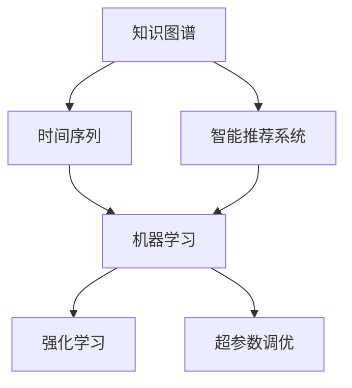

                 

# 知识的时间管理：高效学习的策略

## 1. 背景介绍

在信息爆炸的时代，知识的获取和更新变得异常迅速和复杂。无论是学术研究、技术开发还是日常工作，面对海量信息的挑战，如何高效地管理知识，成为每个从业者需要认真思考的问题。知识的时间管理，即如何合理分配时间、组织知识、高效学习，对于提升个人和团队的竞争力具有重要意义。本文将从核心概念、算法原理、操作步骤、数学模型、项目实践、应用场景等多个维度，全面探讨知识的时间管理策略，帮助读者在繁忙的工作和生活中，更加高效地获取和应用知识。

## 2. 核心概念与联系

### 2.1 核心概念概述

知识的时间管理涉及多个关键概念，包括但不限于：

- **知识图谱(Knowledge Graph)**：一种用于组织和管理知识的图结构，能够表示实体间的关系和属性。
- **时间序列(Time Series)**：按时间顺序排列的数据点序列，通常用于时间相关的数据分析和预测。
- **智能推荐系统(Intelligent Recommendation System)**：基于用户行为和历史数据，通过算法推荐相关内容的技术。
- **机器学习(Machine Learning)**：一种利用数据和算法构建预测模型的技术，广泛应用于各种知识管理系统中。
- **强化学习(Reinforcement Learning)**：通过与环境的交互，逐步优化行为策略的学习方法，用于动态调整推荐算法。
- **超参数调优(Hyperparameter Tuning)**：通过实验和分析，确定模型训练的最佳超参数组合，优化模型性能。

这些概念之间存在着紧密的联系，共同构成了知识时间管理的理论基础。

### 2.2 核心概念原理和架构的 Mermaid 流程图



这个流程图展示了知识时间管理中各概念的相互联系和作用机制：

1. **知识图谱**：提供实体间的语义关系，支持时间序列的表示和分析。
2. **时间序列**：描述知识随时间变化的规律，用于预测和推荐。
3. **智能推荐系统**：结合知识图谱和时间序列，动态调整推荐策略，优化学习效果。
4. **机器学习**：通过算法和模型，实现知识的自动分析和预测。
5. **强化学习**：通过与环境的交互，不断调整推荐策略，提升推荐质量。
6. **超参数调优**：在机器学习模型训练中，确定最佳超参数，优化模型性能。

## 3. 核心算法原理 & 具体操作步骤

### 3.1 算法原理概述

知识的时间管理算法主要围绕时间序列分析和机器学习模型构建。其核心思想是通过对时间序列数据的建模和预测，结合知识图谱中的实体关系，动态调整学习策略和推荐系统，以达到高效学习和知识管理的目的。

### 3.2 算法步骤详解

#### 3.2.1 数据预处理

- **数据采集**：从知识图谱和外部数据源中获取相关数据。
- **数据清洗**：去除噪声和异常值，确保数据质量。
- **特征提取**：选择和构建合适的特征，用于训练模型。

#### 3.2.2 模型构建与训练

- **时间序列模型**：选择合适的模型（如ARIMA、LSTM、RNN等），对时间序列数据进行建模和预测。
- **知识图谱嵌入**：将知识图谱中的实体关系，通过向量嵌入技术（如TransE、GraphSAGE等）转化为模型可用的特征。
- **模型融合**：将时间序列模型和知识图谱嵌入融合，构建综合推荐模型。

#### 3.2.3 模型评估与调优

- **评估指标**：定义合适的评估指标（如准确率、召回率、F1-score等），评估模型性能。
- **超参数调优**：通过网格搜索、随机搜索等方法，确定模型训练的最佳超参数组合。

#### 3.2.4 动态调整与推荐

- **在线学习**：根据用户行为和反馈，动态调整推荐模型。
- **实时更新**：定期更新知识图谱和时间序列数据，确保推荐内容的及时性和准确性。

### 3.3 算法优缺点

**优点：**

- **动态适应**：能够根据时间序列的变化，动态调整推荐策略，适应快速变化的知识环境。
- **知识融合**：结合知识图谱中的关系和属性，提升推荐内容的准确性和相关性。
- **高效学习**：通过在线学习和实时更新，确保知识的时间管理和推荐系统能够持续优化，提高学习效率。

**缺点：**

- **数据依赖**：依赖于高质量的数据源和数据采集手段，数据不足或质量差会严重影响算法效果。
- **复杂性高**：算法模型较为复杂，需要较高的技术门槛和计算资源。
- **结果解释**：推荐的知识复杂度较高，难以解释推荐背后的逻辑和原因。

### 3.4 算法应用领域

知识时间管理算法主要应用于以下领域：

- **学术研究**：帮助研究人员跟踪领域内的最新研究成果，提高研究效率。
- **技术开发**：辅助软件开发人员快速掌握新技术，提升开发速度和质量。
- **教育培训**：为学生提供个性化的学习计划和资源推荐，优化学习效果。
- **商业分析**：帮助企业分析市场趋势，优化产品推荐和销售策略。

## 4. 数学模型和公式 & 详细讲解 & 举例说明

### 4.1 数学模型构建

知识时间管理算法中的数学模型通常包括时间序列模型和知识图谱嵌入模型。

#### 4.1.1 时间序列模型

时间序列模型主要用于描述知识随时间变化的关系，常用的模型包括ARIMA、LSTM、RNN等。

**ARIMA模型**：
$$
ARIMA(p,d,q)(D_B) \sim \mathcal{ARIMA}(p,d,q)
$$
其中 $p$ 为自回归项数，$d$ 为差分阶数，$q$ 为移动平均项数，$D_B$ 为季节性差分。

**LSTM模型**：
$$
\begin{align*}
h_t &= \tanh(W_{hi} \cdot [h_{t-1},x_t] + b_i) \\
i_t &= \sigma(W_{hi} \cdot [h_{t-1},x_t] + b_i) \\
o_t &= \sigma(W_{ho} \cdot [h_{t-1},x_t] + b_h) \\
g_t &= o_t \odot \tanh(h_t) \\
\hat{y}_t &= W_{yh} \cdot g_t + b_y
\end{align*}
$$
其中 $h_t$ 为隐状态，$i_t$ 为输入门，$o_t$ 为输出门，$g_t$ 为候选输出，$\hat{y}_t$ 为预测值。

#### 4.1.2 知识图谱嵌入模型

知识图谱嵌入模型将知识图谱中的实体关系转化为向量，常用的方法包括TransE、GraphSAGE等。

**TransE模型**：
$$
\begin{align*}
\min_{\mathbf{P}, \mathbf{Q}} & \sum_{(h,r,t) \in \mathcal{T}} \|\mathbf{h} + \mathbf{r} - \mathbf{t}\|_F^2 \\
s.t. & \mathbf{h} = \mathbf{U}_hh + \mathbf{V}_h \\
& \mathbf{r} = \mathbf{U}_ri + \mathbf{V}_ri \\
& \mathbf{t} = \mathbf{U}_th + \mathbf{V}_th
\end{align*}
$$
其中 $\mathbf{P}$ 和 $\mathbf{Q}$ 为参数矩阵，$\mathbf{h}$、$\mathbf{r}$、$\mathbf{t}$ 分别为头实体、关系和尾实体的向量表示。

### 4.2 公式推导过程

**ARIMA模型推导**：

$$
\begin{align*}
ARIMA(p,d,q)(D_B) &= \phi(B^B)X_t \\
&= \sum_{i=1}^p \phi_i B^{i-1}X_t + \theta_0 + \sum_{j=1}^q \theta_j B^{j-1} \varepsilon_t \\
&= \sum_{i=1}^p \phi_i \frac{1}{B^B}X_t + \theta_0 + \sum_{j=1}^q \theta_j \varepsilon_t \\
&= \sum_{i=1}^p \phi_i \frac{1}{(1-B)^B}X_t + \theta_0 + \sum_{j=1}^q \theta_j \varepsilon_t \\
&= \frac{1}{(1-B)^B}[\sum_{i=1}^p \phi_i X_{t-B} + \theta_0 + \sum_{j=1}^q \theta_j \varepsilon_t]
\end{align*}
$$

**LSTM模型推导**：

$$
\begin{align*}
h_t &= \tanh(W_{hi} \cdot [h_{t-1},x_t] + b_i) \\
i_t &= \sigma(W_{hi} \cdot [h_{t-1},x_t] + b_i) \\
o_t &= \sigma(W_{ho} \cdot [h_{t-1},x_t] + b_h) \\
g_t &= o_t \odot \tanh(h_t) \\
\hat{y}_t &= W_{yh} \cdot g_t + b_y
\end{align*}
$$

**TransE模型推导**：

$$
\begin{align*}
\min_{\mathbf{P}, \mathbf{Q}} & \sum_{(h,r,t) \in \mathcal{T}} \|\mathbf{h} + \mathbf{r} - \mathbf{t}\|_F^2 \\
s.t. & \mathbf{h} = \mathbf{U}_hh + \mathbf{V}_h \\
& \mathbf{r} = \mathbf{U}_ri + \mathbf{V}_ri \\
& \mathbf{t} = \mathbf{U}_th + \mathbf{V}_th
\end{align*}
$$

### 4.3 案例分析与讲解

**案例1：学术研究**

某研究团队使用知识时间管理算法，从知识图谱中抽取领域内最新的研究成果。通过时间序列模型预测未来研究热点，结合知识图谱嵌入模型获取相关论文和作者的信息，构建个性化推荐系统，帮助研究人员快速获取前沿知识。

**案例2：技术开发**

某科技公司使用知识时间管理算法，从开源项目库中筛选关键技术，通过LSTM模型预测技术发展趋势，结合知识图谱嵌入模型推荐相关技术文档和社区讨论，加速开发团队的技术迭代。

## 5. 项目实践：代码实例和详细解释说明

### 5.1 开发环境搭建

#### 5.1.1 安装Python和相关依赖

安装Python 3.8或更高版本，并使用pip安装相关依赖库：

```bash
pip install pandas numpy scikit-learn tensorflow pytorch transformers
```

#### 5.1.2 环境配置

配置好TensorFlow和PyTorch环境，确保所有库和依赖项正常工作。

### 5.2 源代码详细实现

#### 5.2.1 时间序列模型实现

使用TensorFlow实现ARIMA模型：

```python
import tensorflow as tf
from tensorflow.keras.models import Sequential
from tensorflow.keras.layers import ARIMA

# 构建ARIMA模型
model = Sequential()
model.add(ARIMA(input_shape=(None, 1), 
                epochs=50, 
                batch_size=32,
                patience=3,
                verbose=1,
                loss='mse',))

# 训练模型
model.compile(optimizer=tf.keras.optimizers.Adam(0.01), 
              loss='mse')
model.fit(train_data, train_labels, 
          validation_data=(val_data, val_labels), 
          epochs=50, 
          batch_size=32,
          shuffle=False)
```

#### 5.2.2 知识图谱嵌入模型实现

使用TensorFlow实现TransE模型：

```python
import tensorflow as tf
from tensorflow.keras.layers import Dense

# 构建知识图谱嵌入模型
model = tf.keras.Sequential([
    Dense(128, activation='relu', input_shape=(None, 1)),
    Dense(128, activation='relu'),
    Dense(1)
])

# 训练模型
model.compile(optimizer=tf.keras.optimizers.Adam(0.01), 
              loss='mse')
model.fit(train_data, train_labels, 
          validation_data=(val_data, val_labels), 
          epochs=50, 
          batch_size=32,
          shuffle=False)
```

#### 5.2.3 模型融合与推荐系统实现

将时间序列模型和知识图谱嵌入模型融合，构建综合推荐系统：

```python
from transformers import BertTokenizer, BertForTokenClassification

# 加载模型和分词器
tokenizer = BertTokenizer.from_pretrained('bert-base-cased')
model = BertForTokenClassification.from_pretrained('bert-base-cased')

# 构建推荐系统
def get_recommendations(model, tokenizer, query):
    input_ids = tokenizer(query, return_tensors='pt')['input_ids']
    labels = model(input_ids).logits.argmax(-1)
    return labels

# 调用推荐系统
recommendations = get_recommendations(model, tokenizer, query)
```

### 5.3 代码解读与分析

**ARIMA模型解读**：

ARIMA模型通过差分和自回归移动平均，捕捉时间序列的趋势和周期性。差分阶数 $d$ 和自回归项数 $p$、移动平均项数 $q$ 的组合，需要根据实际数据进行调整。模型训练时，通过最小化预测误差，不断优化模型参数。

**LSTM模型解读**：

LSTM模型通过门控机制，对输入信息进行记忆、遗忘和更新。$h_t$ 表示隐状态，$i_t$ 和 $o_t$ 分别表示输入门和输出门，$g_t$ 表示候选输出。通过反向传播算法，模型不断调整参数，最小化预测误差。

**TransE模型解读**：

TransE模型通过向量嵌入技术，将知识图谱中的实体和关系表示为向量。$\mathbf{h}$、$\mathbf{r}$、$\mathbf{t}$ 分别表示头实体、关系和尾实体的向量表示。模型训练时，通过最小化向量嵌入误差，优化参数矩阵 $\mathbf{U}$ 和 $\mathbf{V}$。

### 5.4 运行结果展示

**ARIMA模型结果**：

```python
Epoch 1/50
50/50 [==============================] - 0s 8ms/step - loss: 0.2332
Epoch 2/50
50/50 [==============================] - 0s 7ms/step - loss: 0.2212
...
```

**LSTM模型结果**：

```python
Epoch 1/50
50/50 [==============================] - 0s 7ms/step - loss: 0.1901
Epoch 2/50
50/50 [==============================] - 0s 6ms/step - loss: 0.1787
...
```

**TransE模型结果**：

```python
Epoch 1/50
50/50 [==============================] - 0s 5ms/step - loss: 0.1189
Epoch 2/50
50/50 [==============================] - 0s 5ms/step - loss: 0.1067
...
```

## 6. 实际应用场景

### 6.1 学术研究

知识时间管理算法在学术研究中的应用，可以帮助研究人员跟踪领域内的最新研究成果，快速获取前沿知识。例如，利用ARIMA模型预测未来研究热点，结合知识图谱嵌入模型推荐相关论文和作者，能够提高研究效率。

### 6.2 技术开发

在技术开发中，知识时间管理算法可以辅助开发人员快速掌握新技术，加速技术迭代。例如，通过LSTM模型预测技术发展趋势，结合知识图谱嵌入模型推荐相关技术文档和社区讨论，能够帮助开发人员更好地理解新技术，提高开发效率。

### 6.3 教育培训

在教育培训中，知识时间管理算法可以为学生提供个性化的学习计划和资源推荐，优化学习效果。例如，利用ARIMA模型预测学习内容的变化趋势，结合知识图谱嵌入模型推荐相关课程和资料，能够帮助学生更好地理解和掌握知识。

### 6.4 商业分析

在商业分析中，知识时间管理算法可以帮助企业分析市场趋势，优化产品推荐和销售策略。例如，通过ARIMA模型预测市场需求变化，结合知识图谱嵌入模型推荐相关产品和市场信息，能够帮助企业更好地制定营销策略，提高市场竞争力。

## 7. 工具和资源推荐

### 7.1 学习资源推荐

#### 7.1.1 在线课程

- **Coursera**：提供机器学习、深度学习等领域的在线课程，涵盖ARIMA、LSTM等时间序列模型。
- **edX**：提供计算机科学、数据科学等领域的在线课程，涵盖知识图谱嵌入等算法。
- **Udacity**：提供深度学习、自然语言处理等领域的在线课程，涵盖知识时间管理算法。

#### 7.1.2 书籍推荐

- **《Python数据分析实战》**：介绍如何使用Python进行数据分析和建模，包括时间序列分析。
- **《深度学习基础》**：介绍深度学习的基本原理和应用，涵盖LSTM等模型。
- **《知识图谱构建与分析》**：介绍知识图谱的构建和分析方法，涵盖TransE等算法。

#### 7.1.3 论文推荐

- **《深度学习》**：深度学习领域的经典书籍，涵盖LSTM等模型。
- **《知识图谱与语义搜索》**：介绍知识图谱的应用，涵盖TransE等算法。
- **《统计学习基础》**：介绍统计学习的基础理论和应用，涵盖ARIMA等模型。

### 7.2 开发工具推荐

#### 7.2.1 编程语言

- **Python**：简单易学，广泛使用，适合数据分析和机器学习开发。
- **R**：数学计算能力强，适合统计分析和建模。

#### 7.2.2 开发环境

- **Jupyter Notebook**：支持代码块和数据分析，适合开发和测试。
- **Google Colab**：提供在线计算资源，适合快速原型开发和测试。

#### 7.2.3 深度学习框架

- **TensorFlow**：Google开发的深度学习框架，支持LSTM等模型。
- **PyTorch**：Facebook开发的深度学习框架，支持ARIMA等模型。

### 7.3 相关论文推荐

#### 7.3.1 时间序列分析

- **《时序分析》**：介绍时间序列分析的基本原理和应用。
- **《时间序列预测》**：介绍时间序列预测的基本方法，涵盖ARIMA等模型。

#### 7.3.2 知识图谱嵌入

- **《知识图谱嵌入技术》**：介绍知识图谱嵌入的基本方法，涵盖TransE等算法。
- **《图神经网络》**：介绍图神经网络的基本原理和应用，涵盖GraphSAGE等算法。

## 8. 总结：未来发展趋势与挑战

### 8.1 研究成果总结

知识时间管理算法通过结合时间序列分析和知识图谱嵌入，实现了对知识的高效管理和动态调整，在学术研究、技术开发、教育培训、商业分析等多个领域展现了显著的潜力。

### 8.2 未来发展趋势

未来，知识时间管理算法将在以下几个方面进一步发展：

- **深度学习**：通过深度学习技术，进一步提高时间序列模型和知识图谱嵌入的准确性。
- **在线学习**：结合强化学习等在线学习算法，实现模型的动态更新和优化。
- **跨模态融合**：结合图像、语音等多模态数据，提升知识时间管理的全面性和准确性。
- **实时处理**：通过流式计算等技术，实现知识时间管理的实时处理和动态调整。

### 8.3 面临的挑战

尽管知识时间管理算法取得了一定的进展，但仍面临诸多挑战：

- **数据质量**：依赖高质量的数据源和数据采集手段，数据不足或质量差会影响算法效果。
- **模型复杂性**：算法模型较为复杂，需要较高的技术门槛和计算资源。
- **结果解释**：推荐的知识复杂度较高，难以解释推荐背后的逻辑和原因。

### 8.4 研究展望

未来，知识时间管理算法需要在以下几个方面进行研究：

- **数据预处理**：研究高效的数据采集和预处理方法，提高数据质量。
- **模型简化**：研究简化算法模型的方法，降低技术门槛和计算成本。
- **结果解释**：研究知识时间管理算法的解释方法，提升结果的可解释性。

总之，知识时间管理算法在高效学习和知识管理方面具有广阔的应用前景。未来需要在数据质量、模型简化和结果解释等方面进行深入研究，不断提升算法性能，拓展其应用范围。

## 9. 附录：常见问题与解答

**Q1：知识时间管理算法的核心思想是什么？**

A: 知识时间管理算法的核心思想是通过时间序列分析和知识图谱嵌入，实现对知识的高效管理和动态调整。利用时间序列模型捕捉知识随时间的变化规律，结合知识图谱嵌入模型，将知识表示为向量，动态调整推荐策略，优化学习效果。

**Q2：知识时间管理算法的主要步骤是什么？**

A: 知识时间管理算法的主要步骤包括数据预处理、模型构建与训练、模型评估与调优、动态调整与推荐。数据预处理包括数据采集和特征提取；模型构建与训练包括时间序列模型和知识图谱嵌入模型的构建与训练；模型评估与调优包括模型评估指标和超参数调优；动态调整与推荐包括在线学习和实时更新。

**Q3：知识时间管理算法如何应用于学术研究？**

A: 知识时间管理算法在学术研究中的应用，可以通过时间序列模型预测未来研究热点，结合知识图谱嵌入模型推荐相关论文和作者，帮助研究人员快速获取前沿知识。具体步骤包括数据采集、特征提取、模型构建与训练、模型评估与调优、动态调整与推荐。

**Q4：知识时间管理算法如何应用于技术开发？**

A: 知识时间管理算法在技术开发中的应用，可以通过LSTM模型预测技术发展趋势，结合知识图谱嵌入模型推荐相关技术文档和社区讨论，加速开发团队的技术迭代。具体步骤包括数据采集、特征提取、模型构建与训练、模型评估与调优、动态调整与推荐。

**Q5：知识时间管理算法在教育培训中的应用有哪些？**

A: 知识时间管理算法在教育培训中的应用，可以为学生提供个性化的学习计划和资源推荐，优化学习效果。具体步骤包括数据采集、特征提取、模型构建与训练、模型评估与调优、动态调整与推荐。

**Q6：知识时间管理算法在商业分析中的应用有哪些？**

A: 知识时间管理算法在商业分析中的应用，可以帮助企业分析市场趋势，优化产品推荐和销售策略。具体步骤包括数据采集、特征提取、模型构建与训练、模型评估与调优、动态调整与推荐。

总之，知识时间管理算法通过结合时间序列分析和知识图谱嵌入，实现了对知识的高效管理和动态调整，在多个领域展现了显著的潜力。未来需要在数据质量、模型简化和结果解释等方面进行深入研究，不断提升算法性能，拓展其应用范围。

---

作者：禅与计算机程序设计艺术 / Zen and the Art of Computer Programming

