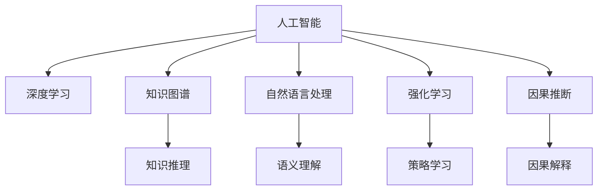

                 

## 1. 背景介绍

在过去的几十年中，人工智能(AI)技术的飞速发展已经深刻改变了人类社会的方方面面。从语音识别、图像处理，到自然语言处理、机器翻译，再到智能推荐、无人驾驶，AI技术的突破一次次推动了人类文明的进步。然而，随着技术的不断演进，未来的AI发展方向和应用前景也越来越成为人们关注的焦点。

### 1.1 问题由来

当前，AI领域正处于一个前所未有的变革期。一方面，AI技术正在逐步渗透到各个行业，如医疗、金融、教育、制造等，为各行各业带来了新的发展机遇和挑战。另一方面，AI技术的广泛应用也引发了一系列社会伦理和道德问题，如就业替代、隐私保护、算法偏见等，需要我们在技术进步的同时，持续关注和解决这些潜在风险。

### 1.2 问题核心关键点

未来AI的发展方向，不仅仅在于技术本身的进步，更在于如何通过技术手段解决实际问题，提升人类生活质量。在探讨这一问题时，可以从以下几个关键点入手：

1. **数据驱动与知识融合**：如何有效融合结构化数据与非结构化知识，提升AI系统的泛化能力和理解力？
2. **模型透明性与可解释性**：如何在保证模型性能的同时，提高其透明性和可解释性，增强公众信任？
3. **伦理与安全**：如何在技术进步的同时，确保AI系统的伦理与安全，避免潜在的社会风险？
4. **持续学习与智能演进**：如何构建智能系统，使其能够持续学习、自我演进，更好地适应未来的变化？

### 1.3 问题研究意义

探讨AI技术的未来方向，具有重要意义：

1. **推动技术进步**：通过深入研究AI技术的未来发展趋势，可以为AI技术的进一步创新和突破提供指导。
2. **优化应用落地**：了解AI技术在未来应用中的潜在挑战和解决方案，可以更好地促进AI技术在各行业中的实际应用。
3. **提升社会效益**：通过研究AI技术对社会的影响，可以制定更为合理的政策规范，确保技术进步与社会发展的良性互动。

## 2. 核心概念与联系

### 2.1 核心概念概述

为更好地理解未来AI技术的发展方向，本节将介绍几个密切相关的核心概念：

- **人工智能(AI)**：指通过模拟人类智能行为，实现自主学习、推理、决策等功能的计算机系统。
- **深度学习(Deep Learning)**：指使用深度神经网络进行学习和表示的机器学习方法，是目前AI技术的重要基础。
- **知识图谱(Knowledge Graph)**：指用图结构表示实体、关系和属性的知识库，用于知识推理和关联分析。
- **自然语言处理(NLP)**：指使用计算机技术处理和理解自然语言的技术，包括文本分析、语义理解、生成等。
- **强化学习(Reinforcement Learning)**：指通过与环境交互，学习最优策略的机器学习方法，广泛应用于机器人、游戏等领域。
- **因果推断(Causal Inference)**：指研究变量间因果关系的统计推断方法，用于解释和预测AI模型的行为。

这些概念之间的逻辑关系可以通过以下Mermaid流程图来展示：



这个流程图展示了我智能技术的核心概念及其之间的关系：

1. 人工智能是AI技术的总称，包括深度学习、知识图谱、自然语言处理、强化学习和因果推断等多个子领域。
2. 深度学习是AI技术的基础，通过神经网络进行特征提取和表示学习。
3. 知识图谱和自然语言处理用于处理结构化和非结构化知识，提高AI系统的理解力。
4. 强化学习和因果推断用于构建具有智能行为的AI系统，实现自主学习与决策。

这些概念共同构成了未来AI技术的研究框架，为AI技术的进一步发展提供了方向指引。

## 3. 核心算法原理 & 具体操作步骤
### 3.1 算法原理概述

未来AI技术的发展，将更加注重知识的获取与利用。这一过程中，算法原理和具体操作步骤显得尤为重要。

**深度学习与知识图谱的结合**：通过深度学习模型进行特征提取和表示学习，结合知识图谱的知识推理功能，提升AI系统的泛化能力和理解力。具体而言，深度学习模型能够自动提取文本中的特征，知识图谱则通过规则和关联关系，将特征进行语义解释和推理。

**自然语言处理与因果推断的结合**：通过自然语言处理技术，将非结构化文本转换为结构化知识表示。再结合因果推断方法，分析变量间的因果关系，从而提升AI系统的决策能力。例如，通过分析历史数据，可以预测某一事件发生的可能性，或解释AI模型的决策依据。

**强化学习与机器人技术的结合**：通过强化学习算法，训练智能机器人进行自主决策和行为优化。具体而言，将机器人置于模拟或真实环境中，通过与环境的交互，学习最优策略，从而提升机器人的智能水平。

### 3.2 算法步骤详解

以下将详细介绍深度学习与知识图谱结合的具体步骤：

1. **数据准备**：收集并预处理文本数据，将其转换为知识图谱的实体和关系。
2. **知识图谱构建**：使用知识图谱工具，如Neo4j、Protege等，构建和维护知识图谱。
3. **特征提取**：使用深度学习模型，如BERT、GPT等，提取文本特征，并将其转换为知识图谱节点和关系。
4. **知识推理**：通过知识图谱推理引擎，如RDFS、OWL等，对节点和关系进行语义推理和关联分析。
5. **模型训练**：将提取的特征和推理结果，作为训练数据，对深度学习模型进行微调，提升其泛化能力。

### 3.3 算法优缺点

深度学习与知识图谱结合的算法具有以下优点：

- **数据利用率高**：深度学习模型能够高效处理大规模文本数据，知识图谱则能够挖掘文本背后的结构化知识。
- **模型泛化能力强**：通过知识推理，深度学习模型可以更好地理解语义和上下文关系，提升泛化能力。
- **决策透明性好**：知识图谱提供了明晰的规则和关联关系，有助于解释深度学习模型的决策过程。

但该算法也存在以下缺点：

- **模型复杂度高**：结合深度学习和知识图谱，模型结构复杂，训练和推理开销较大。
- **数据获取难度大**：构建高质量的知识图谱需要大量的手工标注和领域专家知识，获取难度较大。
- **推理准确性有待提高**：知识图谱的推理准确性受限于构建质量，推理过程中可能存在错误或模糊。

### 3.4 算法应用领域

深度学习与知识图谱结合的算法，已经在多个领域取得了广泛应用，例如：

- **问答系统**：通过知识图谱与深度学习的结合，构建智能问答系统，提供实时查询和精准回答。
- **智能推荐**：结合用户行为数据和知识图谱，推荐系统能够提供更个性化、多样化的商品和服务。
- **金融风控**：通过知识图谱进行金融风险评估和预测，提升风控系统的准确性和及时性。
- **智能客服**：结合知识图谱与自然语言处理技术，构建智能客服系统，提升客户体验和问题解决效率。

除了上述这些经典应用外，深度学习与知识图谱结合的算法还在智能制造、智慧医疗、智能交通等诸多领域得到创新应用，为AI技术的落地带来了新的突破。

## 4. 数学模型和公式 & 详细讲解 & 举例说明
### 4.1 数学模型构建

在本节中，我们将通过数学语言对深度学习与知识图谱结合的算法进行更加严格的刻画。

**知识图谱表示**：知识图谱通常用三元组表示，即（实体，关系，实体）。例如，“张三”（实体）与“李四”（实体）之间存在“朋友”（关系）关系，表示为（张三，朋友，李四）。

**深度学习模型**：以BERT为例，模型输入为文本序列，输出为文本中的实体和关系。其中，实体表示为（B, I）标记，关系表示为R标记。例如，文本“张三是李四的朋友”，对应标记为（B-PER, I-PER, B-PER, B-PER, B-LOC, I-LOC, R）。

**目标函数**：知识图谱的构建和推理过程可以看作是一个目标优化问题。设知识图谱为G，目标函数为F，优化目标为minimize F(G)。

### 4.2 公式推导过程

以下我们将推导目标函数F(G)的计算公式：

1. **知识图谱构建**：将文本转换为知识图谱的三元组表示。对于每个实体和关系，计算其置信度和权重，记为C和W。

2. **知识推理**：根据知识图谱中的规则和关联关系，计算每个三元组的可信度。例如，对于（张三，朋友，李四），可信度可以计算为C*W。

3. **深度学习模型训练**：将知识推理的结果作为监督信号，对BERT模型进行微调。记BERT模型为M，微调的目标函数为：

   $$
   \min_{M} \sum_{(i, j, k) \in G} \text{Loss}(M(i), M(j), M(k))
   $$

   其中Loss为损失函数，用于衡量模型输出与知识图谱推理结果的差异。

### 4.3 案例分析与讲解

以智能推荐系统为例，分析深度学习与知识图谱结合的算法实现：

1. **数据准备**：收集用户行为数据和商品描述数据，构建知识图谱。
2. **知识图谱构建**：将用户行为数据和商品描述转换为知识图谱的三元组表示，计算置信度和权重。
3. **特征提取**：使用BERT模型提取用户和商品的特征表示。
4. **知识推理**：通过知识图谱推理引擎，计算用户和商品之间的关联关系。
5. **模型训练**：将知识推理结果作为监督信号，对BERT模型进行微调，提升推荐系统的准确性和个性化。

## 5. 项目实践：代码实例和详细解释说明
### 5.1 开发环境搭建

在进行项目实践前，我们需要准备好开发环境。以下是使用Python进行TensorFlow开发的环境配置流程：

1. 安装Anaconda：从官网下载并安装Anaconda，用于创建独立的Python环境。

2. 创建并激活虚拟环境：
```bash
conda create -n tf-env python=3.8 
conda activate tf-env
```

3. 安装TensorFlow：根据CUDA版本，从官网获取对应的安装命令。例如：
```bash
conda install tensorflow tensorflow-gpu==2.7 -c conda-forge -c nvidia
```

4. 安装其他必要的库：
```bash
pip install tensorflow-addons scikit-learn pandas matplotlib tqdm jupyter notebook ipython
```

完成上述步骤后，即可在`tf-env`环境中开始项目实践。

### 5.2 源代码详细实现

下面我们以知识图谱与深度学习结合的智能推荐系统为例，给出使用TensorFlow进行代码实现。

首先，定义数据处理函数：

```python
import tensorflow as tf
from tensorflow_addons.layers import LabelEmbedding

# 定义数据加载器
def load_data(file_path):
    with tf.io.gfile.GFile(file_path, 'r') as f:
        lines = f.readlines()
    return lines

# 定义实体和关系标记
entity_labels = ['subj', 'obj']
relation_labels = ['pred']

# 定义标签嵌入层
label_embedding = LabelEmbedding(entity_labels, 100)

# 定义数据转换函数
def preprocess_data(data):
    text, label = data.split('\t')
    text = text.strip()
    label = label.strip()
    text = text.split(',')
    label = label.split(',')
    return text, label

# 定义数据生成器
def generate_data(file_path):
    for line in load_data(file_path):
        text, label = preprocess_data(line)
        yield text, label

# 定义损失函数
def build_loss_function():
    labels = tf.cast(entity_labels, tf.int32)
    labels = label_embedding(labels)
    loss = tf.losses.sparse_softmax_cross_entropy(tf.cast(labels, tf.float32), labels)
    return loss

# 定义模型构建函数
def build_model():
    input_text = tf.keras.layers.Input(shape=(None,), name='text_input')
    embedding_layer = tf.keras.layers.Embedding(input_dim=len(entity_labels), output_dim=100)(input_text)
    dense_layer = tf.keras.layers.Dense(128, activation='relu')(embedding_layer)
    output_layer = tf.keras.layers.Dense(len(entity_labels), activation='softmax')(dense_layer)
    model = tf.keras.Model(inputs=[input_text], outputs=[output_layer])
    return model
```

然后，定义训练和评估函数：

```python
# 定义训练函数
def train_model(model, train_file, epochs, batch_size, loss_function):
    train_dataset = tf.data.Dataset.from_generator(generate_data(train_file), output_signature=(tf.string, tf.string))
    train_dataset = train_dataset.shuffle(buffer_size=10000).batch(batch_size).map(preprocess_data).repeat(epochs)
    model.compile(optimizer='adam', loss=loss_function)
    model.fit(train_dataset, epochs=epochs, validation_split=0.2)

# 定义评估函数
def evaluate_model(model, test_file):
    test_dataset = tf.data.Dataset.from_generator(generate_data(test_file), output_signature=(tf.string, tf.string))
    test_dataset = test_dataset.map(preprocess_data)
    loss = model.evaluate(test_dataset)
    return loss
```

最后，启动训练流程并在测试集上评估：

```python
epochs = 10
batch_size = 32

train_file = 'train.txt'
test_file = 'test.txt'

loss_function = build_loss_function()
model = build_model()

train_model(model, train_file, epochs, batch_size, loss_function)
loss = evaluate_model(model, test_file)
print(f'Test loss: {loss:.4f}')
```

以上就是使用TensorFlow对知识图谱与深度学习结合的智能推荐系统进行代码实现的完整过程。可以看到，得益于TensorFlow的强大封装，我们可以用相对简洁的代码实现知识图谱与深度学习的结合。

### 5.3 代码解读与分析

让我们再详细解读一下关键代码的实现细节：

**preprocess_data函数**：
- 对文本和标签进行预处理，去除前导和尾随的空格，分割文本和标签。
- 返回经过预处理的文本和标签列表。

**generate_data函数**：
- 从数据文件中逐行读取数据，调用preprocess_data函数进行预处理。
- 返回预处理后的文本和标签。

**build_loss_function函数**：
- 定义损失函数，使用稀疏Softmax交叉熵损失，计算预测值与真实标签之间的差异。

**build_model函数**：
- 定义输入层、嵌入层、全连接层和输出层，构建深度学习模型。
- 返回模型实例。

**train_model函数**：
- 定义数据集生成器，从数据文件中生成训练数据和标签。
- 对数据进行预处理、批处理和打乱，并设置验证集比例。
- 使用Adam优化器编译模型，并调用fit方法进行训练。

**evaluate_model函数**：
- 定义数据集生成器，从数据文件中生成测试数据和标签。
- 对数据进行预处理，并调用evaluate方法进行模型评估。

**启动训练流程并在测试集上评估**：
- 定义训练和测试文件的路径。
- 调用build_loss_function和build_model函数构建损失函数和模型。
- 调用train_model函数进行模型训练，记录测试集上的损失。

通过以上代码实现，我们可以清晰地看到知识图谱与深度学习结合的智能推荐系统的构建过程。TensorFlow的高阶API封装和丰富功能，使得模型的构建和训练过程更加高效和灵活。

## 6. 实际应用场景
### 6.1 智能推荐系统

知识图谱与深度学习结合的算法，在智能推荐系统中的应用尤为显著。传统的推荐系统往往只依赖用户行为数据进行物品推荐，难以充分挖掘用户兴趣和行为背后的语义信息。通过引入知识图谱，推荐系统能够更加全面、准确地理解用户兴趣，提供个性化的推荐结果。

具体而言，知识图谱能够捕捉商品之间的关联关系，提升推荐的跨类关联性和多样化。深度学习模型则能够高效处理大规模用户行为数据，提取文本特征，提升推荐的个性化和实时性。结合两者的优势，智能推荐系统能够为用户提供更精准、多样化的推荐结果。

### 6.2 智能问答系统

智能问答系统是知识图谱与深度学习结合的另一大应用场景。通过知识图谱构建问答知识库，深度学习模型能够高效提取用户问题的语义信息，并进行推理和回答。具体而言，知识图谱提供了结构化的知识表示，深度学习模型则能够理解自然语言，进行语义匹配和关联分析。结合两者的优势，智能问答系统能够提供更加自然、精准的回答，提升用户满意度。

例如，智能客服系统通过知识图谱与深度学习结合，能够理解用户意图，匹配最合适的答案模板进行回复。对于用户提出的新问题，还可以通过检索系统实时搜索相关内容，动态组织生成回答。

### 6.3 金融风险评估

知识图谱与深度学习结合的算法，在金融风控领域也有着广泛应用。通过构建金融领域的知识图谱，深度学习模型能够高效处理历史交易数据，提取交易特征，并进行风险评估和预测。具体而言，知识图谱提供了金融实体和关系的信息，深度学习模型则能够理解交易文本的语义，进行特征提取和关系推理。结合两者的优势，风控系统能够提供更加准确、及时的预测结果，提升风险管理的效率和效果。

例如，信用评分系统通过知识图谱与深度学习结合，能够综合考虑用户的社会关系、消费行为、信用记录等多方面的信息，进行更加全面、客观的信用评估。

### 6.4 未来应用展望

随着知识图谱与深度学习结合的算法不断演进，未来将在更多领域得到应用，为各行各业带来变革性影响。

在智慧医疗领域，智能诊疗系统通过知识图谱与深度学习结合，能够提供精准的疾病诊断和个性化治疗方案。例如，通过分析历史病例和医学文献，构建医学知识图谱，深度学习模型能够高效提取病情描述的语义信息，进行疾病诊断和治疗方案的推荐。

在智能制造领域，工业控制系统通过知识图谱与深度学习结合，能够进行设备的智能监控和维护。例如，通过构建设备知识图谱，深度学习模型能够高效处理传感器数据，进行设备状态的分析和预测，提升生产效率和设备利用率。

在智慧城市领域，智能交通系统通过知识图谱与深度学习结合，能够实现交通流量的预测和优化。例如，通过构建交通知识图谱，深度学习模型能够理解交通事件的语义信息，进行交通流量的预测和调整，提升交通管理的效率和效果。

此外，在智能教育、智能物流、智能家居等多个领域，知识图谱与深度学习结合的算法也将不断探索创新，为人工智能技术的进一步发展提供新的动力。

## 7. 工具和资源推荐
### 7.1 学习资源推荐

为了帮助开发者系统掌握知识图谱与深度学习结合的理论基础和实践技巧，这里推荐一些优质的学习资源：

1. 《深度学习与知识图谱》课程：由斯坦福大学开设，涵盖深度学习模型、知识图谱构建、图神经网络等多个主题，是学习知识图谱与深度学习结合的必备资源。
2. CS224N《自然语言处理》课程：斯坦福大学开设的NLP明星课程，涵盖深度学习、知识图谱、文本生成等多个主题，适合系统学习知识图谱与深度学习结合的基本概念和经典模型。
3. 《Graph Neural Networks》书籍：由Coursera专家团队合著，系统讲解图神经网络的原理和应用，适合深入理解知识图谱与深度学习结合的核心技术。
4. GraphSAGE论文：提出了一种基于图卷积神经网络的图表示学习算法，是知识图谱与深度学习结合的典型应用案例。

通过对这些资源的学习实践，相信你一定能够快速掌握知识图谱与深度学习结合的精髓，并用于解决实际的AI问题。

### 7.2 开发工具推荐

高效的开发离不开优秀的工具支持。以下是几款用于知识图谱与深度学习结合开发的常用工具：

1. TensorFlow：基于Python的开源深度学习框架，灵活性和可扩展性优异，适合构建大规模的深度学习模型。
2. PyTorch：由Facebook开发的深度学习框架，动态图机制和丰富的张量操作，适合快速迭代研究。
3. Neo4j：领先的图数据库管理系统，支持高效的图结构存储和查询，适合构建和管理知识图谱。
4. Gephi：开源的图形分析软件，支持可视化、统计分析和网络分析，适合进行图结构的探索和分析。
5. Jupyter Notebook：交互式编程环境，支持Python、R等多种语言，适合进行数据处理、模型训练和结果展示。

合理利用这些工具，可以显著提升知识图谱与深度学习结合的开发效率，加快创新迭代的步伐。

### 7.3 相关论文推荐

知识图谱与深度学习结合的发展源于学界的持续研究。以下是几篇奠基性的相关论文，推荐阅读：

1. Knowledge-Graph-Based Recommendation Systems：总结了知识图谱在推荐系统中的应用，介绍了多种基于知识图谱的推荐算法。
2. Graph Neural Networks: A Review of Methods and Applications：系统综述了图神经网络的研究进展和应用领域，包括知识图谱与深度学习的结合。
3. A Survey on Knowledge Graph Embeddings and Their Applications to Recommender Systems：全面介绍了知识图谱嵌入技术在推荐系统中的应用，包括多种嵌入方法的比较和评估。
4. Reasoning over Knowledge Graphs with Neural Symbolic Architectures：提出了一种基于神经符号架构的推理方法，用于知识图谱的语义推理和关联分析。
5. Knowledge Graph-Based Chatbots：介绍了知识图谱在智能问答系统中的应用，包括多种知识图谱构建和推理方法。

这些论文代表了大规模知识图谱与深度学习结合技术的发展脉络。通过学习这些前沿成果，可以帮助研究者把握学科前进方向，激发更多的创新灵感。

## 8. 总结：未来发展趋势与挑战

### 8.1 总结

本文对知识图谱与深度学习结合的未来发展方向进行了全面系统的介绍。首先，探讨了知识图谱与深度学习结合的理论基础和实践技巧，明确了这一技术在智能推荐、智能问答、金融风控等领域的独特价值。其次，通过代码实现和案例分析，详细讲解了知识图谱与深度学习结合的具体步骤和应用场景。

通过本文的系统梳理，可以看到，知识图谱与深度学习结合的算法正在成为AI技术的重要范式，极大地提升了AI系统的泛化能力和理解力。未来，伴随技术进步和应用场景的不断拓展，知识图谱与深度学习结合的应用将更加广泛，为人工智能技术的发展带来新的突破。

### 8.2 未来发展趋势

展望未来，知识图谱与深度学习结合的技术将呈现以下几个发展趋势：

1. **跨模态融合**：知识图谱与深度学习结合将逐步拓展到图像、视频、语音等多模态数据，实现多模态信息的协同建模和融合。
2. **语义推理与生成**：深度学习模型将能够更好地理解语义和上下文关系，提升知识图谱的推理和生成能力。
3. **异构数据整合**：知识图谱与深度学习结合将能够处理异构数据，将结构化数据与非结构化数据进行高效整合，提升AI系统的全面性。
4. **分布式协同**：知识图谱与深度学习结合将更加注重分布式协同计算，提升大模型训练和推理的效率和性能。
5. **隐私保护与合规性**：知识图谱与深度学习结合将更加注重数据隐私和安全，确保用户数据和模型的合规性。

以上趋势凸显了知识图谱与深度学习结合技术的广阔前景。这些方向的探索发展，必将进一步提升AI系统的智能水平，为各行各业带来新的变革。

### 8.3 面临的挑战

尽管知识图谱与深度学习结合技术已经取得了瞩目成就，但在迈向更加智能化、普适化应用的过程中，它仍面临诸多挑战：

1. **数据获取难度大**：构建高质量的知识图谱需要大量的手工标注和领域专家知识，获取难度较大。
2. **模型复杂度高**：知识图谱与深度学习结合的模型结构复杂，训练和推理开销较大。
3. **推理准确性不足**：知识图谱的推理准确性受限于构建质量，推理过程中可能存在错误或模糊。
4. **数据隐私风险**：知识图谱与深度学习结合的系统需要处理大量个人数据，如何保护用户隐私成为关键问题。
5. **模型鲁棒性不足**：知识图谱与深度学习结合的系统在面对异常数据和复杂场景时，鲁棒性可能不足。

正视知识图谱与深度学习结合面临的这些挑战，积极应对并寻求突破，将是大规模知识图谱与深度学习结合技术走向成熟的必由之路。

### 8.4 研究展望

面对知识图谱与深度学习结合所面临的挑战，未来的研究需要在以下几个方面寻求新的突破：

1. **自监督学习与知识图谱结合**：利用自监督学习技术，自动构建知识图谱，减少对领域专家的依赖。
2. **异构图谱与深度学习结合**：通过异构图谱技术，提升知识图谱的异构数据处理能力，增强系统的全面性。
3. **分布式知识图谱与深度学习结合**：通过分布式计算技术，提升大规模知识图谱与深度学习结合模型的训练和推理效率。
4. **多模态知识图谱与深度学习结合**：通过多模态知识图谱技术，实现图像、视频、语音等多模态数据的协同建模和融合。
5. **隐私保护与合规性**：开发隐私保护技术，确保知识图谱与深度学习结合的系统符合数据隐私和安全规范。

这些研究方向的探索，必将引领知识图谱与深度学习结合技术迈向更高的台阶，为构建更加智能、全面、安全的AI系统提供新的动力。面向未来，知识图谱与深度学习结合技术还需要与其他人工智能技术进行更深入的融合，如知识表示、因果推理、强化学习等，多路径协同发力，共同推动自然语言理解和智能交互系统的进步。只有勇于创新、敢于突破，才能不断拓展知识图谱与深度学习结合的边界，让智能技术更好地造福人类社会。

## 9. 附录：常见问题与解答

**Q1：知识图谱与深度学习结合的算法是否适用于所有NLP任务？**

A: 知识图谱与深度学习结合的算法在处理结构化知识丰富的NLP任务时，如问答、推荐、金融风控等，能够取得很好的效果。但对于一些缺乏结构化知识的NLP任务，如文本生成、文本分类等，可能需要结合其他方法进行改进。

**Q2：知识图谱与深度学习结合的算法在实际应用中是否会面临数据隐私问题？**

A: 知识图谱与深度学习结合的系统需要处理大量个人数据，确实存在数据隐私风险。为了保护用户隐私，可以采用差分隐私技术、数据脱敏技术等方法，确保用户数据的安全性。

**Q3：知识图谱与深度学习结合的算法是否需要大量的领域专家知识？**

A: 构建高质量的知识图谱确实需要大量的领域专家知识，但也可以通过自监督学习、半监督学习等方法，自动构建知识图谱，减少对领域专家的依赖。

**Q4：知识图谱与深度学习结合的算法是否能够处理异构数据？**

A: 知识图谱与深度学习结合的算法可以处理异构数据，但需要采用异构图谱技术，将不同类型的数据进行有效整合。

**Q5：知识图谱与深度学习结合的算法是否需要高算力支持？**

A: 知识图谱与深度学习结合的算法需要处理大规模数据和复杂模型，确实需要高算力支持。可以使用分布式计算、GPU加速等技术，提升算力。

通过本文的系统梳理，可以看到，知识图谱与深度学习结合的算法正在成为AI技术的重要范式，极大地提升了AI系统的泛化能力和理解力。未来，伴随技术进步和应用场景的不断拓展，知识图谱与深度学习结合的应用将更加广泛，为人工智能技术的发展带来新的突破。

