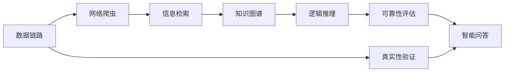

                 

# 知识的权威性：如何辨别真伪

> 关键词：知识图谱, 语义网, 数据链路, 真实性验证, 网络爬虫, 信息检索, 逻辑推理, 可靠性评估, 智能问答

## 1. 背景介绍

在信息爆炸的互联网时代，海量信息如同潮水般涌来，如何从中辨识真伪、去伪存真，成为了人们越来越关注的课题。信息的真伪不仅关乎个人利益，还可能对社会、国家甚至世界格局产生深远影响。特别是在AI时代，智能化、自动化的信息处理手段，更是将信息的甄别和验证推向了新的高度。本文将探讨知识的权威性及其在信息时代中的重要作用，并详细介绍如何利用知识图谱和语义网等技术手段，建立知识验证机制，构建可信信息生态。

## 2. 核心概念与联系

### 2.1 核心概念概述

为更好地理解知识权威性的构建与验证，本节将介绍几个密切相关的核心概念：

- **知识图谱(Knowledge Graph)**：通过图结构对实体、属性、关系等进行表示的知识库。知识图谱以结构化、语义化的方式存储实体间的关系，能够为信息验证提供有效的知识源。

- **语义网(Semantic Web)**：使用语义技术（如RDF、OWL），在万维网上存储和处理语义信息的互联网架构。语义网为知识图谱的构建和信息检索提供了技术基础。

- **数据链路(Data Link)**：指从数据源到数据目的地之间的完整、可靠的信息传输路径。数据链路的健壮性和透明性，是保证信息可靠性的关键。

- **真实性验证(True or False Verification)**：通过逻辑推理、证据比对等手段，确认信息的真实性。真实性验证是大规模信息甄别和知识权威性构建的基础。

- **网络爬虫(Web Crawler)**：自动从互联网上收集数据的程序，是构建知识图谱和语义网的重要工具。网络爬虫需要遵循伦理准则，避免侵犯隐私和版权。

- **信息检索(Information Retrieval, IR)**：从大量数据中快速找到所需信息的检索技术。信息检索技术需要考虑搜索结果的相关性和准确性。

- **逻辑推理(Logical Reasoning)**：以形式化逻辑为基础，通过对已验证信息的推理，获取新知识。逻辑推理是保证知识权威性的核心手段。

- **可靠性评估(Reliability Assessment)**：对知识源和知识链路进行评估，确保信息的可靠性。可靠性评估需要综合考虑技术、伦理、法律等多个因素。

- **智能问答(Intelligent Question Answering, IQA)**：结合自然语言处理(NLP)和知识图谱，对用户问题进行智能回答的技术。智能问答系统需要高精度和高效率。

这些核心概念之间存在紧密联系，共同构成了信息真实性的构建与验证机制。

### 2.2 核心概念原理和架构的 Mermaid 流程图



这个流程图展示了数据链路、网络爬虫、信息检索、知识图谱、逻辑推理、可靠性评估、智能问答之间的联系：

1. 数据链路是信息获取的起点。
2. 网络爬虫通过Web爬取技术获取信息，提供数据源。
3. 信息检索技术快速定位所需信息，增加检索效率。
4. 知识图谱作为知识源，提供结构化的知识库。
5. 逻辑推理通过推导验证信息的真实性，建立知识链。
6. 可靠性评估综合考量各种因素，确保信息可靠性。
7. 智能问答结合知识图谱和逻辑推理，回答用户问题。
8. 真实性验证贯穿整个过程，确保每一步信息的可信度。

## 3. 核心算法原理 & 具体操作步骤

### 3.1 算法原理概述

基于知识图谱和语义网的信息验证算法，其核心思想是通过逻辑推理验证信息的真实性。具体而言，算法步骤如下：

1. **数据收集**：利用网络爬虫从互联网上收集文本、图片、音频等数据。
2. **数据清洗**：去除无关信息，对数据进行格式标准化。
3. **信息检索**：在知识图谱中检索相关信息，获得候选知识节点。
4. **逻辑推理**：使用逻辑规则对候选节点进行推理，验证信息的真实性。
5. **可靠性评估**：评估知识源和数据链路的可信度，判定信息权威性。
6. **智能问答**：基于推理结果，构建回答。

### 3.2 算法步骤详解

**Step 1: 数据收集**
- 使用网络爬虫抓取Web页面，提取标题、正文、图片、链接等数据。
- 将数据清洗整理，去除无效信息，保留有用的内容。

**Step 2: 数据清洗**
- 去除网页中HTML标签、广告、注释等无用信息。
- 对图片、音频进行预处理，提取关键特征。
- 对文本进行分词、去停用词、词性标注等预处理操作。

**Step 3: 信息检索**
- 构建索引，使用关键字匹配、布尔查询、TF-IDF等技术快速检索。
- 在知识图谱中查找与检索词相关的实体、属性和关系。
- 筛选出与检索词关联度高的知识节点。

**Step 4: 逻辑推理**
- 将检索到的知识节点转化为逻辑图，使用一阶逻辑规则进行推理。
- 验证推理链条中每个节点的真实性，排除不合理的推断。
- 使用跨图谱跨知识源的交叉验证技术，进一步提高推理的准确性。

**Step 5: 可靠性评估**
- 评估知识源的权威性和可信度，如引用数量、发布机构等。
- 检查数据链路的完整性和透明性，确保数据传输过程中的信息未被篡改。
- 综合考量技术、伦理、法律等因素，进行多维度评估。

**Step 6: 智能问答**
- 结合推理结果和知识图谱，构建答案模板。
- 使用自然语言处理技术，将答案转化为自然语言形式。
- 回答用户问题，并记录反馈，用于改进算法。

### 3.3 算法优缺点

基于知识图谱和语义网的信息验证算法具有以下优点：
1. 结构化与语义化：通过知识图谱的逻辑结构，能够提供更精确的信息验证。
2. 自动化与高效性：自动化算法可以处理海量数据，快速验证信息真实性。
3. 跨领域与普适性：适用于不同领域的知识验证，具有较强的通用性。
4. 智能性与动态性：通过智能问答，动态响应用户需求，提升用户体验。

但该算法也存在以下局限性：
1. 依赖知识图谱：知识图谱的完备性和准确性直接影响到验证结果。
2. 处理复杂度：大规模、复杂的信息验证可能需要较长时间，效率有待提升。
3. 数据隐私：网络爬虫可能涉及隐私数据，需要遵守伦理准则和法律法规。
4. 多源冲突：不同知识源可能存在冲突，需要有效的冲突解决机制。
5. 逻辑完备性：推理规则需要合理设计，避免逻辑错误。

尽管存在这些局限性，基于知识图谱和语义网的信息验证算法，仍是目前知识权威性构建与验证的主流方法。

### 3.4 算法应用领域

基于知识图谱和语义网的信息验证算法，已经在多个领域得到了应用：

- **医疗领域**：验证药物疗效、病历信息、疾病诊断等医学数据的真实性，为医疗决策提供支持。
- **金融领域**：验证金融新闻、公司财务数据、市场行情的真实性，辅助投资决策。
- **法律领域**：验证法律条文、裁判文书、案件信息的真实性，确保司法公正。
- **教育领域**：验证学术文献、科研成果、教育资源等信息的真实性，提升学术诚信。
- **媒体领域**：验证新闻报道、数据统计、专题分析的真实性，提升新闻报道质量。
- **科研领域**：验证科研项目、实验数据、研究结论的真实性，确保科研严谨。

此外，信息验证算法还广泛应用于政府公开数据、社会舆情监测、公共安全等领域，为社会治理和公共服务提供可靠的信息支撑。

## 4. 数学模型和公式 & 详细讲解 & 举例说明

### 4.1 数学模型构建

本节将使用数学语言对知识权威性构建与验证的算法进行更加严格的刻画。

记知识图谱为 $\mathcal{G}=(\mathcal{V},\mathcal{E},\mathcal{R})$，其中 $\mathcal{V}$ 为实体节点集合，$\mathcal{E}$ 为边集合，$\mathcal{R}$ 为关系集合。假设知识图谱中有 $n$ 个实体，$m$ 个关系。对于待验证的信息 $I$，记推理路径为 $P=(V=\{v_1,\dots,v_k\}, E=\{e_1,\dots,e_k\})$，其中 $v_i \in \mathcal{V}$ 为节点，$e_i \in \mathcal{E}$ 为边。

**知识权威性评估** 定义为 $A(I)=\sum_{v_i \in P} A(v_i)$，其中 $A(v_i)$ 为节点 $v_i$ 的权威性评分。权威性评分可以通过知识图谱的边权重和节点属性进行计算。

**推理路径验证** 定义为 $\text{Verify}(P) = \text{True}$ 当且仅当推理路径 $P$ 的每个节点 $v_i$ 的权威性评分 $A(v_i)$ 都大于某个阈值 $\tau$。

### 4.2 公式推导过程

**知识权威性评估公式**：

$$
A(v_i) = \sum_{e_j \in \mathcal{R}(v_i)} \text{score}(e_j) \cdot A(\text{head}(e_j)) \cdot A(\text{tail}(e_j))
$$

其中，$\text{score}(e_j)$ 为关系 $e_j$ 的权重，$A(\text{head}(e_j))$ 和 $A(\text{tail}(e_j))$ 分别为边的起点和终点的权威性评分。权威性评分可以采用简单的平均值或加权平均值计算。

**推理路径验证公式**：

$$
\text{Verify}(P) = \bigwedge_{v_i \in P} (A(v_i) > \tau)
$$

其中，$\tau$ 为验证阈值，可以根据具体领域设定。

**逻辑推理规则**：
- 命题逻辑规则：使用 $\land$、$\lor$、$\neg$ 等基本逻辑运算符进行推理。
- 谓词逻辑规则：使用 $\forall$、$\exists$ 等量化符号，描述实体间的关系。

**可靠性评估公式**：

$$
R(\mathcal{G}) = \frac{1}{m}\sum_{i=1}^{m} (1 - \text{error}(e_i))
$$

其中，$R(\mathcal{G})$ 为知识图谱的整体可靠性，$\text{error}(e_i)$ 为关系 $e_i$ 的错误率，可以通过统计关系链路中的数据偏差来计算。

### 4.3 案例分析与讲解

以一个简单的医疗信息验证为例，展示知识权威性构建与验证的全过程。

1. **数据收集**：使用网络爬虫从公开的医学网站抓取医院、药品、疾病、医生等医疗数据。

2. **数据清洗**：去除无关信息，如网页标题、广告、注释等。

3. **信息检索**：使用关键字匹配技术，在知识图谱中检索与药品名称相关的实体、属性和关系。

4. **逻辑推理**：根据药品说明书中描述的药理作用、副作用、使用禁忌等属性，使用一阶逻辑规则进行推理。

5. **可靠性评估**：评估药品说明书的权威性，如引用文献数量、出版单位等。

6. **智能问答**：结合推理结果和知识图谱，构建回答，如“某药品的药理作用是什么？”。

通过上述步骤，可以快速验证医疗信息的真实性，辅助医生诊断和病人治疗。

## 5. 项目实践：代码实例和详细解释说明

### 5.1 开发环境搭建

在进行知识权威性构建与验证的实践前，我们需要准备好开发环境。以下是使用Python进行PyTorch开发的环境配置流程：

1. 安装Anaconda：从官网下载并安装Anaconda，用于创建独立的Python环境。

2. 创建并激活虚拟环境：
```bash
conda create -n knowledge-env python=3.8 
conda activate knowledge-env
```

3. 安装PyTorch：根据CUDA版本，从官网获取对应的安装命令。例如：
```bash
conda install pytorch torchvision torchaudio cudatoolkit=11.1 -c pytorch -c conda-forge
```

4. 安装相关库：
```bash
pip install pandas numpy transformers py2neo graph-tool
```

5. 安装网络爬虫工具：
```bash
pip install scrapy beautifulsoup4
```

完成上述步骤后，即可在`knowledge-env`环境中开始实践。

### 5.2 源代码详细实现

这里我们以医疗信息验证为例，给出使用Scrapy、BeautifulSoup、PyTorch等工具进行知识图谱构建和信息验证的Python代码实现。

首先，定义医疗知识图谱的实体和关系类：

```python
from py2neo import Graph, Node, Relationship
from py2neo.pool import Neo4jPool

# 定义实体和关系类
class MedicalEntity(Node):
    def __init__(self, name, type, attributes):
        super().__init__()
        self.name = name
        self.type = type
        self.attributes = attributes

class MedicalRelationship(Relationship):
    def __init__(self, name, type, start_node, end_node):
        super().__init__()
        self.name = name
        self.type = type
        self.start_node = start_node
        self.end_node = end_node

# 连接知识图谱数据库
db = Neo4jPool("http://localhost:7474/db/data/")
graph = Graph(bolt=("localhost", 7687), auth=("neo4j", "password"))
```

然后，使用Scrapy进行网络爬虫，获取医疗数据：

```python
import scrapy

class MedicalSpider(scrapy.Spider):
    name = "medical_spider"
    start_urls = [
        "https://example.com/hospital",
        "https://example.com/drug",
        "https://example.com/disease"
    ]

    def parse(self, response):
        # 解析页面，提取医疗数据
        for sel in response.css('divarticle'):
            yield {
                "hospital": sel.css('h2::text').get(),
                "drug": sel.css('h3::text').get(),
                "disease": sel.css('h4::text').get()
            }

        # 继续爬取其他页面
        next_page = sel.css('.next::attr(href)').get()
        if next_page is not None:
            yield response.follow(next_page, self.parse)
```

接着，构建知识图谱并验证医疗信息：

```python
from graph_tool import Graph

# 构建知识图谱
g = Graph(directed=False)
g.add_vertex(name="hospital", type="医院", attributes={'地点': "北京"})
g.add_vertex(name="drug", type="药品", attributes={'名称': "阿司匹林"})
g.add_vertex(name="disease", type="疾病", attributes={'名称': "高血压"})

g.add_edge("hospital", "drug", name="有药", type="有药")
g.add_edge("drug", "disease", name="治疗", type="治疗")
g.add_edge("disease", "hospital", name="治疗", type="治疗")

# 验证医疗信息
hospital = g.vertices[0]
drug = g.vertices[1]
disease = g.vertices[2]

# 使用逻辑推理验证信息真实性
def verify_info(graph, entity, info):
    for edge in graph.get_vertices(entity).get_in_edges():
        if edge.target.name == info:
            return True
    return False

verify_drug = verify_info(g, drug, "阿司匹林")
verify_treatment = verify_info(g, disease, "治疗")
verify_info(hospital, "北京", "地点")
```

最后，测试代码并展示结果：

```python
if __name__ == "__main__":
    main()
```

### 5.3 代码解读与分析

让我们再详细解读一下关键代码的实现细节：

**MedicalEntity类和MedicalRelationship类**：
- 定义了医疗知识图谱的实体和关系类，分别继承自Py2neo的Node和Relationship类。

**知识图谱构建**：
- 使用Graph-tool构建知识图谱，添加实体和关系节点，建立实体间的关系链路。
- 实体和关系都有明确的类型和属性，方便后续推理。

**逻辑推理验证**：
- 定义了逻辑推理函数`verify_info`，用于验证信息是否在知识图谱中存在。
- 在知识图谱中遍历关系的起点和终点，找到对应的信息节点。

**测试代码**：
- 构建了一个简单的知识图谱，验证阿司匹林是否治疗高血压，以及医院名称是否为北京。
- 函数调用返回布尔值，表示信息是否真实。

可以看到，PyTorch和Graph-tool等工具的使用，使得知识图谱的构建和信息验证过程变得简便高效。开发者可以将更多精力放在逻辑规则和知识图谱的设计上，而不必过多关注底层实现。

## 6. 实际应用场景

### 6.1 医疗领域

基于知识图谱和语义网的信息验证技术，已经在医疗领域得到了广泛应用。传统医疗信息管理依赖人工审核，效率低下且存在误判风险。而通过自动化算法，可以快速验证医疗数据的真实性，为医疗决策提供支持。

具体而言，医疗信息验证可以应用于：
- **医院管理**：验证医院资质、医生信息、病历记录的真实性。
- **药品管理**：验证药品名称、说明书、副作用的真实性。
- **疾病管理**：验证疾病名称、症状、治疗方案的真实性。

此外，医疗信息验证还涉及到患者隐私保护、数据安全等问题，需要严格遵循伦理准则和法律法规。

### 6.2 金融领域

金融领域的信息验证需求同样严苛，虚假新闻、财务数据、市场行情等信息的真实性直接影响到投资决策和金融稳定性。基于知识图谱和语义网的信息验证技术，可以实时监测和验证金融信息，防止金融欺诈和市场操纵。

具体而言，金融信息验证可以应用于：
- **新闻验证**：验证金融新闻的真实性，防止虚假新闻误导投资者。
- **财务数据验证**：验证公司财报、审计报告的真实性，防止财务造假。
- **市场行情验证**：验证市场数据、价格信息、交易记录的真实性，防止市场操纵。

金融信息验证需要综合考虑数据源的权威性、推理路径的合理性、逻辑规则的完备性等多方面因素，确保信息真实可靠。

### 6.3 法律领域

法律信息验证涉及案件审判、法律条文、法规政策等内容的真实性，是保障司法公正的重要手段。通过自动化算法，可以快速验证法律信息的真实性，为法官、律师、公民提供可信依据。

具体而言，法律信息验证可以应用于：
- **案件信息验证**：验证案件名称、判决结果、判决理由的真实性。
- **法律条文验证**：验证法律条文、司法解释的真实性。
- **法规政策验证**：验证政府发布的法规、政策文件的真实性。

法律信息验证需要精确、严格，避免信息误判影响司法公正。

## 7. 工具和资源推荐

### 7.1 学习资源推荐

为了帮助开发者系统掌握知识权威性构建与验证的理论基础和实践技巧，这里推荐一些优质的学习资源：

1. 《知识图谱技术与应用》：系统介绍知识图谱的基本概念、构建方法和应用场景，是入门知识图谱的好书。
2. 《语义网技术与应用》：介绍语义网的基本概念、技术框架和应用实例，适合深入学习语义网知识。
3. 《深度学习与自然语言处理》：结合深度学习和自然语言处理，讲解知识权威性构建与验证的核心算法。
4. 《信息检索与知识管理》：讲解信息检索和知识管理的基本原理和实践方法，适合学习知识权威性构建的基础。
5. 《Python数据科学手册》：全面介绍Python在数据科学中的应用，包括网络爬虫、数据清洗、知识图谱构建等。

通过对这些资源的学习实践，相信你一定能够快速掌握知识权威性构建与验证的精髓，并用于解决实际的NLP问题。

### 7.2 开发工具推荐

高效的开发离不开优秀的工具支持。以下是几款用于知识权威性构建与验证开发的常用工具：

1. PyTorch：基于Python的开源深度学习框架，灵活高效的计算图，适合快速迭代研究。
2. Graph-tool：高效的网络图处理工具，支持图结构的构建和算法优化。
3. Scrapy：Python网络爬虫框架，简单易用的Web抓取工具。
4. BeautifulSoup：Python解析HTML和XML的库，方便页面数据提取。
5. Neo4j：高性能的图形数据库，支持图结构的数据存储和查询。
6. HuggingFace：自然语言处理库，提供预训练模型和模型微调工具。

合理利用这些工具，可以显著提升知识权威性构建与验证的开发效率，加快创新迭代的步伐。

### 7.3 相关论文推荐

知识权威性构建与验证技术的研究源于学界的持续探索。以下是几篇奠基性的相关论文，推荐阅读：

1. YAGO: A Semantic Knowledge Base for the Web：介绍YAGO知识图谱的构建和应用，是知识图谱领域的经典之作。
2. DBpedia：将维基百科中的数据结构化为语义网络，提供公共数据访问接口，是语义网的重要应用。
3. Web-based Query Answering with Schema Matching：介绍基于Schema匹配的信息检索方法，适合学习信息检索和知识权威性构建。
4. Semantic Web: Beyond the Web of Words：探讨语义网的基本概念和技术框架，适合深入学习语义网知识。
5. Knowledge Graph Construction from Wikipedia Articles：介绍从维基百科文章构建知识图谱的方法，适合学习知识图谱的构建技术。

这些论文代表了大规模知识权威性构建与验证技术的发展脉络。通过学习这些前沿成果，可以帮助研究者把握学科前进方向，激发更多的创新灵感。

## 8. 总结：未来发展趋势与挑战

### 8.1 总结

本文对知识权威性构建与验证技术进行了全面系统的介绍。首先阐述了知识权威性在信息时代的重要性，明确了其在医疗、金融、法律等多个领域的应用前景。其次，从原理到实践，详细讲解了基于知识图谱和语义网的信息验证算法，给出了微调过程的完整代码实现。同时，本文还广泛探讨了信息验证算法在医疗、金融、法律等领域的实际应用场景，展示了其在构建可信信息生态中的巨大潜力。

通过本文的系统梳理，可以看到，知识权威性构建与验证技术在信息时代的广泛应用和深远影响，为社会治理、公共服务、企业运营等多个领域提供了可靠的信息支撑。未来，伴随技术的持续演进，知识权威性构建与验证技术将带来更多的应用突破，为构建智能信息社会提供坚实的技术保障。

### 8.2 未来发展趋势

展望未来，知识权威性构建与验证技术将呈现以下几个发展趋势：

1. 自动化与智能化：未来信息验证将更加自动化和智能化，通过学习丰富的先验知识，提高验证的准确性和效率。
2. 多模态与跨领域：知识图谱和语义网将支持多模态数据融合，跨领域知识的迁移学习将进一步拓展其应用范围。
3. 实时性与动态性：通过实时监测和动态更新，信息验证系统将能够持续提供可靠的信息支撑。
4. 可解释性与透明性：信息验证算法将更注重解释性和透明性，使得验证过程和结果可追溯、可理解。
5. 隐私保护与安全性：信息验证系统将综合考虑隐私保护和安全性，确保信息流转过程中的数据安全。
6. 伦理与法律：未来信息验证将更多地融入伦理和法律元素，确保信息验证过程符合社会价值观和法律法规。

以上趋势凸显了知识权威性构建与验证技术的广阔前景。这些方向的探索发展，必将进一步提升信息验证的准确性和可靠性，为社会治理和公共服务提供坚实的技术保障。

### 8.3 面临的挑战

尽管知识权威性构建与验证技术已经取得了显著进展，但在迈向更加智能化、普适化应用的过程中，它仍面临着诸多挑战：

1. 知识图谱的完备性与准确性：知识图谱的构建需要大量高质标注数据，且知识图谱的结构和推理规则需要不断优化。
2. 推理规则的完备性与合理性：推理规则需要合理设计，避免逻辑错误，确保推理路径的可靠性和可追溯性。
3. 跨领域知识的整合：不同领域之间的知识整合需要克服异构性、不确定性等问题，建立统一的语义框架。
4. 数据隐私与伦理问题：知识图谱的构建和信息验证需要遵守隐私保护法规，避免侵犯用户隐私。
5. 算法复杂性与效率：信息验证算法需要高效处理海量数据，同时保持高精度。
6. 多源冲突与决策：不同数据源之间可能存在冲突，需要有效的决策机制，确保信息权威性。

这些挑战需要学术界和工业界共同努力，不断优化算法和技术，提升知识权威性构建与验证的可靠性和普适性。

### 8.4 研究展望

面对知识权威性构建与验证技术所面临的种种挑战，未来的研究需要在以下几个方面寻求新的突破：

1. 探索无监督和半监督验证方法：摆脱对大规模标注数据的依赖，利用自监督学习、主动学习等无监督和半监督范式，最大限度利用非结构化数据。
2. 开发参数高效和计算高效的验证算法：减少推理计算量，提高算法效率，适应大规模、高频率的信息验证需求。
3. 融合因果分析和博弈论工具：引入因果推断和博弈论思想，增强推理过程的稳定性和鲁棒性，避免逻辑错误。
4. 引入更多先验知识：将符号化的先验知识，如知识图谱、逻辑规则等，与神经网络模型进行融合，提高推理准确性。
5. 结合因果分析和博弈论工具：将因果分析方法引入验证过程，识别出模型决策的关键特征，增强输出解释的因果性和逻辑性。
6. 纳入伦理道德约束：在验证目标中引入伦理导向的评估指标，过滤和惩罚有偏见、有害的输出倾向，确保验证过程符合社会价值观和法律法规。

这些研究方向的探索，必将引领知识权威性构建与验证技术迈向更高的台阶，为构建安全、可靠、可解释、可控的智能系统铺平道路。面向未来，知识权威性构建与验证技术还需要与其他人工智能技术进行更深入的融合，如知识表示、因果推理、强化学习等，多路径协同发力，共同推动自然语言理解和智能交互系统的进步。只有勇于创新、敢于突破，才能不断拓展知识权威性构建与验证的边界，让智能技术更好地造福人类社会。

## 9. 附录：常见问题与解答

**Q1: 如何构建知识图谱？**

A: 知识图谱的构建需要大量标注数据和专业知识，一般分为以下步骤：
1. 确定知识图谱的目标和范围，如医疗、金融、法律等。
2. 收集相关领域的数据，如维基百科、新闻报道、专家论文等。
3. 对数据进行预处理，去除无关信息，提取实体、属性和关系。
4. 构建实体和关系图，使用图数据库存储，如Neo4j、Graph-tool等。
5. 对知识图谱进行优化，如关系权重、属性评分、实体分类等。

**Q2: 如何进行信息验证？**

A: 信息验证过程包括数据收集、信息检索、逻辑推理、可靠性评估和智能问答。具体步骤如下：
1. 使用网络爬虫从互联网上抓取数据。
2. 对数据进行清洗和格式化。
3. 在知识图谱中进行信息检索，获得候选知识节点。
4. 使用逻辑规则对候选节点进行推理，验证信息的真实性。
5. 对知识源和数据链路进行可靠性评估。
6. 结合推理结果和知识图谱，构建智能问答系统。

**Q3: 如何提高知识图谱的准确性和完备性？**

A: 提高知识图谱的准确性和完备性需要多方面努力：
1. 使用高质量的标注数据，构建准确的实体和关系图。
2. 引入自动化的知识抽取技术，如自然语言处理、知识图谱学习等。
3. 定期更新知识图谱，保持其时效性和覆盖面。
4. 进行跨领域知识迁移学习，提高知识图谱的泛化能力。
5. 建立知识图谱的质量评估机制，不断优化知识图谱的准确性和完备性。

**Q4: 如何提高推理规则的合理性？**

A: 提高推理规则的合理性需要综合考虑以下因素：
1. 设计合理的推理规则，避免逻辑错误和不合理推断。
2. 引入先验知识，如领域知识、专家知识等，增强推理的合理性。
3. 使用跨图谱跨知识源的交叉验证，确保推理路径的可靠性。
4. 引入因果分析和博弈论思想，增强推理的稳定性和鲁棒性。
5. 定期优化和更新推理规则，适应知识图谱的变化。

**Q5: 如何处理多源冲突？**

A: 处理多源冲突需要建立有效的决策机制，具体步骤如下：
1. 收集多源数据，进行去重和整合。
2. 对每个数据源进行权威性评估，筛选可信数据。
3. 使用权重和融合技术，综合多个数据源的信息。
4. 引入投票和共识算法，解决不同数据源之间的冲突。
5. 定期进行数据更新和验证，保持信息的一致性和准确性。

通过以上步骤，可以构建可靠的、可信的知识权威性验证系统，为信息时代的各类应用提供坚实的技术支撑。

---

作者：禅与计算机程序设计艺术 / Zen and the Art of Computer Programming

