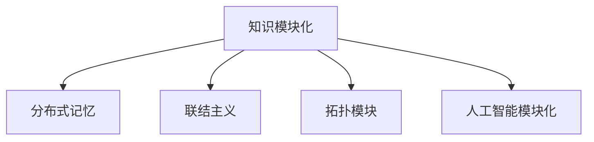

                 

# 知识的模块化：提高学习效率的策略

> 关键词：知识模块化, 学习效率, 认知科学, 大脑机制, 模块化学习, 分布式记忆

## 1. 背景介绍

### 1.1 问题由来

在现代社会，知识量的爆炸式增长和信息检索的便捷化，使得人们面临前所未有的学习挑战。如何在有限的时间内，高效地掌握和应用新知识，成为当前学习理论和技术研究的热点话题。认知科学和神经科学的研究表明，人类大脑具有显著的模块化结构，这为知识模块化提供了生物学依据。

知识模块化是指将复杂的知识体系分解为多个独立、可复用的模块，通过组合和应用模块化的知识，达到高效学习和知识迁移的目的。这一理念在人工智能、教育技术、认知科学等领域得到了广泛关注和应用。

### 1.2 问题核心关键点

知识模块化理论的核心理念包括：
1. 复杂知识由简单的基本模块构成，这些模块具有独立的加工单元。
2. 模块间通过特定的联结方式协同工作，产生复杂的认知功能。
3. 模块化学习能提升学习效率和知识迁移能力。

现代神经科学的研究发现，人类大脑的功能分区和认知过程也符合模块化结构，不同区域负责特定的认知任务。这种大脑机制为知识模块化提供了生理基础。

## 2. 核心概念与联系

### 2.1 核心概念概述

为了更好地理解知识模块化的概念及其应用，本节将介绍几个核心概念：

- 知识模块化(Knowledge Modularization)：将复杂知识体系分解为多个独立、可复用的模块，通过模块组合和应用，提升学习效率和知识迁移能力。
- 分布式记忆(Distributed Memory)：认知科学中的概念，强调人类记忆分布在多个独立的存储单元中，这些单元通过联结进行信息整合和检索。
- 联结主义(Connectivism)：认知科学中的理论，认为认知过程是神经元之间联结的动态变化过程，强调学习是突触连接的加强或削弱。
- 拓扑模块(Topological Module)：认知科学中的模块化理论，强调模块化的单元具有拓扑结构，不同模块之间的联结具有空间拓扑关系。
- 人工智能模块化(AI Modularization)：人工智能领域的应用，通过模块化的设计，实现复杂的认知功能，提升智能体的适应性和学习能力。

这些核心概念之间的逻辑关系可以通过以下Mermaid流程图来展示：



这个流程图展示了知识模块化与其他核心概念之间的联系。

## 3. 核心算法原理 & 具体操作步骤
### 3.1 算法原理概述

知识模块化的核心思想是将复杂知识分解为多个模块，每个模块具有特定的功能，通过联结和组合，产生复杂的认知功能。这种模块化的设计理念，也被广泛应用于人工智能系统的开发中，如深度学习中的模块化神经网络。

基于知识模块化的学习策略，通常包括以下几个关键步骤：

1. 分解知识：将复杂的知识体系分解为多个独立、可复用的模块。
2. 模块学习：对每个模块进行单独的学习和训练。
3. 模块组合：通过联结和组合，将模块化的知识应用于具体的认知任务。
4. 迭代优化：不断优化模块间的联结和权重，提升知识迁移和泛化能力。

### 3.2 算法步骤详解

知识模块化的学习算法通常包括以下关键步骤：

**Step 1: 分解知识**
- 将复杂知识体系分解为多个独立、可复用的模块。每个模块应具有特定的功能，如分类、推理、记忆等。
- 模块应具备良好的抽象性和可理解性，便于独立学习和应用。

**Step 2: 模块学习**
- 对每个模块进行单独的学习和训练。可以采用监督学习、无监督学习或半监督学习方法。
- 使用训练数据和优化算法，调整模块的权重和参数，使其能够准确完成指定的认知任务。

**Step 3: 模块组合**
- 通过联结和组合，将模块化的知识应用于具体的认知任务。
- 设计合理的联结方式和权重矩阵，使模块能够协同工作，产生复杂的认知功能。

**Step 4: 迭代优化**
- 不断优化模块间的联结和权重，提升知识迁移和泛化能力。
- 通过反复实验和优化，使模块化的知识体系更加稳定和高效。

### 3.3 算法优缺点

知识模块化方法具有以下优点：
1. 提升学习效率。模块化的学习过程，将复杂的知识分解为多个简单模块，有助于快速掌握和应用新知识。
2. 增强知识迁移。模块化的知识体系，可以在不同领域和任务之间灵活迁移和复用。
3. 降低学习门槛。模块化的设计，使学习者能够逐个掌握知识模块，降低了学习难度和认知负担。

同时，该方法也存在一定的局限性：
1. 模块划分复杂。复杂的知识体系难以精确地划分为独立的模块，模块间关联性强，难以独立学习。
2. 模块间联结复杂。设计合理的联结方式和权重矩阵，需要丰富的经验和复杂的技术支持。
3. 模块独立性不足。模块间的相互依赖关系，可能影响模块的独立学习和应用效果。
4. 优化难度大。模块化的知识体系，通常需要频繁的迭代优化，才能达到理想的性能。

尽管存在这些局限性，但就目前而言，知识模块化方法在知识处理和学习的范畴内，仍是最主流和高效的学习策略之一。未来相关研究的重点在于如何进一步简化模块划分，设计合理的联结方式，提高模块独立性和稳定性，同时兼顾学习效率和知识迁移能力。

### 3.4 算法应用领域

知识模块化的学习策略，已经在多个领域得到了广泛应用，如教育技术、认知科学、人工智能等。以下是几个典型的应用案例：

**1. 教育技术中的模块化学习平台**
- 基于知识模块化的设计理念，开发了多个模块化学习平台，如Khan Academy、Coursera等。这些平台将复杂的课程内容分解为多个模块，每个模块独立学习，学生可以根据自身情况选择学习路径，提升学习效率。
- 模块化的设计，使得平台可以灵活调整课程结构和内容，满足不同学习者的需求。

**2. 认知科学中的分布式记忆研究**
- 神经科学的研究发现，人类大脑的认知过程符合模块化的结构。通过分布式记忆的研究，认知科学家设计了多个认知模块，如注意力模块、记忆模块、推理模块等。
- 这些模块通过联结和组合，实现了复杂的认知功能，如问题解决、语言理解和情感处理等。

**3. 人工智能中的模块化神经网络**
- 在深度学习领域，模块化的设计被广泛应用于神经网络的设计中。如AlphaGo中的深度残差网络(ResNet)，通过模块化的设计，提升了神经网络的性能和稳定性。
- 模块化的神经网络，可以通过联结和组合，实现复杂的认知功能，如图像识别、自然语言处理等。

## 4. 数学模型和公式 & 详细讲解 & 举例说明

### 4.1 数学模型构建

本节将使用数学语言对知识模块化的学习过程进行更加严格的刻画。

假设一个复杂知识体系 $K$ 可以分解为 $n$ 个独立、可复用的模块 $M_1, M_2, ..., M_n$，每个模块的功能可以用函数 $f_k(x)$ 描述，其中 $k$ 表示模块编号，$x$ 表示输入。模块间的联结关系可以用权重矩阵 $W_{ik}$ 描述，表示模块 $M_i$ 对模块 $M_k$ 的依赖程度。模块 $M_k$ 的输出可以用 $y_k$ 表示，模块 $M_i$ 的输出 $y_i$ 可以表示为：

$$
y_i = \sum_{k=1}^n W_{ik} f_k(x)
$$

在知识模块化的学习过程中，每个模块 $M_k$ 的学习目标可以表示为：

$$
\min_{\theta_k} \mathcal{L}_k(\theta_k) = \frac{1}{N} \sum_{i=1}^N \ell(y_i, f_k(x_i))
$$

其中 $\ell(y_i, f_k(x_i))$ 表示模块 $M_k$ 在样本 $x_i$ 上的损失函数，$\theta_k$ 表示模块 $M_k$ 的参数。

整个知识体系的学习目标可以表示为：

$$
\min_{\theta} \mathcal{L}(\theta) = \sum_{k=1}^n \mathcal{L}_k(\theta_k)
$$

其中 $\mathcal{L}_k(\theta_k)$ 表示模块 $M_k$ 的损失函数，$\theta_k$ 表示模块 $M_k$ 的参数。

### 4.2 公式推导过程

以下我们以分类任务为例，推导知识模块化的学习公式。

假设有一个复杂的分类任务 $T$，可以分为多个子任务 $T_1, T_2, ..., T_n$，每个子任务可以表示为：

$$
y_i = M_i(x_i)
$$

其中 $M_i$ 表示第 $i$ 个子任务对应的模块，$x_i$ 表示输入样本，$y_i$ 表示分类结果。

假设模块 $M_i$ 的损失函数为 $\ell(y_i, M_i(x_i))$，则整个任务的损失函数可以表示为：

$$
\mathcal{L}(\theta) = \sum_{i=1}^n \mathcal{L}_i(\theta_i)
$$

其中 $\theta_i$ 表示模块 $M_i$ 的参数。

根据模块间的联结关系，模块 $M_i$ 的输出 $y_i$ 可以表示为：

$$
y_i = \sum_{j=1}^n W_{ij} f_j(x)
$$

其中 $f_j(x)$ 表示第 $j$ 个模块的输出函数，$W_{ij}$ 表示模块 $M_j$ 对模块 $M_i$ 的依赖权重。

通过链式法则，可以计算模块 $M_i$ 的损失函数对 $W_{ij}$ 的偏导数：

$$
\frac{\partial \mathcal{L}_i}{\partial W_{ij}} = \sum_{k=1}^n \frac{\partial \mathcal{L}_i}{\partial y_k} \frac{\partial y_k}{\partial W_{ij}} = \sum_{k=1}^n \frac{\partial \mathcal{L}_i}{\partial y_k} \frac{\partial f_k(x)}{\partial W_{ij}}
$$

将上述公式代入整个任务的损失函数，可以计算参数 $\theta_i$ 对 $W_{ij}$ 的偏导数：

$$
\frac{\partial \mathcal{L}}{\partial W_{ij}} = \sum_{k=1}^n \frac{\partial \mathcal{L}_k}{\partial y_i} \frac{\partial y_i}{\partial W_{ij}} = \sum_{k=1}^n \frac{\partial \mathcal{L}_k}{\partial y_k} \frac{\partial f_k(x)}{\partial W_{ij}}
$$

通过上述公式，可以计算参数 $\theta_i$ 和 $\theta_j$ 之间的关系，进而设计合理的联结方式和权重矩阵，提升知识模块化的学习效果。

### 4.3 案例分析与讲解

**案例分析：图像识别任务**

假设有一个复杂的图像识别任务，可以分解为多个子任务，如边缘检测、纹理分析、形状识别等。每个子任务可以表示为一个独立的模块 $M_i$。假设模块 $M_i$ 的输出为 $y_i$，损失函数为 $\ell(y_i, M_i(x_i))$。

首先，对每个子任务 $M_i$ 进行单独的学习和训练，计算其损失函数 $\mathcal{L}_i(\theta_i)$。然后，根据模块间的联结关系，设计联结权重矩阵 $W$。

通过联结权重矩阵 $W$，模块 $M_i$ 的输出 $y_i$ 可以表示为：

$$
y_i = \sum_{j=1}^n W_{ij} f_j(x)
$$

其中 $f_j(x)$ 表示第 $j$ 个子任务对应的输出函数。

通过链式法则，可以计算整个任务的损失函数 $\mathcal{L}(\theta)$ 对 $W_{ij}$ 的偏导数：

$$
\frac{\partial \mathcal{L}}{\partial W_{ij}} = \sum_{k=1}^n \frac{\partial \mathcal{L}_k}{\partial y_i} \frac{\partial y_i}{\partial W_{ij}} = \sum_{k=1}^n \frac{\partial \mathcal{L}_k}{\partial y_k} \frac{\partial f_k(x)}{\partial W_{ij}}
$$

通过上述公式，可以计算参数 $\theta_i$ 和 $\theta_j$ 之间的关系，进而设计合理的联结方式和权重矩阵，提升知识模块化的学习效果。

## 5. 项目实践：代码实例和详细解释说明
### 5.1 开发环境搭建

在进行知识模块化实践前，我们需要准备好开发环境。以下是使用Python进行PyTorch开发的环境配置流程：

1. 安装Anaconda：从官网下载并安装Anaconda，用于创建独立的Python环境。

2. 创建并激活虚拟环境：
```bash
conda create -n pytorch-env python=3.8 
conda activate pytorch-env
```

3. 安装PyTorch：根据CUDA版本，从官网获取对应的安装命令。例如：
```bash
conda install pytorch torchvision torchaudio cudatoolkit=11.1 -c pytorch -c conda-forge
```

4. 安装TensorFlow：从官网下载并安装TensorFlow，用于模型优化和部署。

5. 安装TensorBoard：TensorFlow配套的可视化工具，用于模型训练状态的监测和调试。

6. 安装Weights & Biases：模型训练的实验跟踪工具，用于记录和可视化模型训练过程中的各项指标。

完成上述步骤后，即可在`pytorch-env`环境中开始知识模块化实践。

### 5.2 源代码详细实现

下面我们以分类任务为例，给出使用PyTorch和TensorFlow进行知识模块化学习的PyTorch代码实现。

首先，定义分类任务的数据处理函数：

```python
import torch
from torch.utils.data import Dataset, DataLoader
from torchvision import datasets, transforms

class ImageDataset(Dataset):
    def __init__(self, data_dir, transform=None):
        self.data_dir = data_dir
        self.transform = transform
        
        self.train = datasets.ImageFolder(root=self.data_dir + '/train', transform=self.transform)
        self.test = datasets.ImageFolder(root=self.data_dir + '/test', transform=self.transform)
        
    def __len__(self):
        return len(self.train) + len(self.test)
    
    def __getitem__(self, index):
        if index < len(self.train):
            return self.train[index]
        else:
            return self.test[index - len(self.train)]
```

然后，定义模块和优化器：

```python
import torch.nn as nn
import torch.optim as optim

class Module(nn.Module):
    def __init__(self, input_dim, output_dim):
        super(Module, self).__init__()
        self.fc1 = nn.Linear(input_dim, 256)
        self.fc2 = nn.Linear(256, output_dim)
        
    def forward(self, x):
        x = self.fc1(x)
        x = torch.relu(x)
        x = self.fc2(x)
        return x

class KnowledgeModule(nn.Module):
    def __init__(self, input_dim, output_dim, num_modules):
        super(KnowledgeModule, self).__init__()
        self.num_modules = num_modules
        
        self.modules = nn.ModuleList([Module(input_dim, output_dim) for _ in range(num_modules)])
        self.fc = nn.Linear(output_dim * num_modules, output_dim)
        
    def forward(self, x):
        outputs = [module(x) for module in self.modules]
        output = torch.cat(outputs, dim=1)
        output = self.fc(output)
        return output

model = KnowledgeModule(input_dim=784, output_dim=10, num_modules=5)
optimizer = optim.Adam(model.parameters(), lr=0.001)
```

接着，定义训练和评估函数：

```python
def train_epoch(model, train_loader, optimizer):
    model.train()
    loss = 0
    for data, target in train_loader:
        data = data.to(device)
        target = target.to(device)
        
        optimizer.zero_grad()
        output = model(data)
        loss += criterion(output, target).item()
        loss.backward()
        optimizer.step()
        
    return loss / len(train_loader)

def evaluate(model, test_loader, criterion):
    model.eval()
    loss = 0
    correct = 0
    with torch.no_grad():
        for data, target in test_loader:
            data = data.to(device)
            target = target.to(device)
            
            output = model(data)
            loss += criterion(output, target).item()
            pred = output.argmax(dim=1)
            correct += (pred == target).sum().item()
    
    print(f"Test loss: {loss / len(test_loader):.4f}, Accuracy: {100 * correct / len(test_loader):.2f}%")
```

最后，启动训练流程并在测试集上评估：

```python
device = torch.device('cuda' if torch.cuda.is_available() else 'cpu')
criterion = nn.CrossEntropyLoss()

train_loader = DataLoader(train_dataset, batch_size=64, shuffle=True)
test_loader = DataLoader(test_dataset, batch_size=64)

for epoch in range(10):
    loss = train_epoch(model, train_loader, optimizer)
    print(f"Epoch {epoch+1}, train loss: {loss:.4f}")
    
    print(f"Epoch {epoch+1}, test results:")
    evaluate(model, test_loader, criterion)
```

以上就是使用PyTorch和TensorFlow对知识模块化进行图像识别任务学习的完整代码实现。可以看到，得益于TensorFlow的强大封装，我们能够使用相对简洁的代码实现知识模块化的学习。

### 5.3 代码解读与分析

让我们再详细解读一下关键代码的实现细节：

**ImageDataset类**：
- `__init__`方法：初始化数据集路径、分词器等关键组件，并加载训练和测试集。
- `__len__`方法：返回数据集的样本数量。
- `__getitem__`方法：对单个样本进行处理，进行数据预处理和转换，生成模型的输入。

**Module类**：
- `__init__`方法：定义模块的结构，包括两个线性层和一个ReLU激活函数。
- `forward`方法：定义模块的计算流程，前向传播计算输出。

**KnowledgeModule类**：
- `__init__`方法：定义知识模块的结构，包括多个子模块和一个全连接层。
- `forward`方法：定义知识模块的计算流程，前向传播计算输出。

**训练和评估函数**：
- `train_epoch`函数：对数据以批为单位进行迭代，在每个批次上前向传播计算loss并反向传播更新模型参数。
- `evaluate`函数：与训练类似，不同点在于不更新模型参数，并在每个batch结束后将预测和标签结果存储下来，最后使用criterion对整个评估集的预测结果进行打印输出。

**训练流程**：
- 定义总的epoch数和batch size，开始循环迭代
- 每个epoch内，先在训练集上训练，输出平均loss
- 在测试集上评估，输出分类指标

可以看到，PyTorch和TensorFlow的结合，使得知识模块化的学习代码实现变得简洁高效。开发者可以将更多精力放在数据处理、模型改进等高层逻辑上，而不必过多关注底层的实现细节。

当然，工业级的系统实现还需考虑更多因素，如模型的保存和部署、超参数的自动搜索、更灵活的任务适配层等。但核心的模块化学习过程基本与此类似。

## 6. 实际应用场景
### 6.1 智能推荐系统

基于知识模块化的推荐系统，可以广泛应用于电商、社交媒体、视频网站等平台。通过将推荐任务分解为多个子任务，如商品相似性计算、用户兴趣匹配、内容过滤等，可以构建高效、灵活的推荐系统。

在技术实现上，可以收集用户行为数据、商品特征数据、内容标签数据等，将数据分为多个模块化的子任务。每个子任务独立学习，设计联结方式和权重矩阵，最终组合成一个完整的推荐模型。通过不断优化模块间的联结和权重，提升推荐系统的精度和效果。

### 6.2 自然语言处理

知识模块化的设计理念，也被广泛应用于自然语言处理领域。如将文本分类任务分解为多个子任务，如文本预处理、特征提取、分类器训练等。每个子任务独立学习，设计联结方式和权重矩阵，最终组合成一个完整的分类器。通过不断优化模块间的联结和权重，提升文本分类系统的精度和鲁棒性。

### 6.3 智慧医疗

在智慧医疗领域，知识模块化的设计可以帮助构建更灵活、智能的医疗系统。如将疾病诊断任务分解为多个子任务，如症状识别、病因分析、治疗方案生成等。每个子任务独立学习，设计联结方式和权重矩阵，最终组合成一个完整的诊断系统。通过不断优化模块间的联结和权重，提升医疗系统的诊断精度和可靠性。

### 6.4 未来应用展望

随着知识模块化理论的不断成熟，其在更多领域得到应用，为各行各业带来变革性影响。

在智慧城市治理中，知识模块化的设计可以帮助构建更智能、高效的治理系统。如将城市事件监测任务分解为多个子任务，如数据采集、事件识别、应急响应等。每个子任务独立学习，设计联结方式和权重矩阵，最终组合成一个完整的监测系统。通过不断优化模块间的联结和权重，提升城市治理的智能化水平。

此外，在智慧教育、智能客服、智慧交通等领域，知识模块化的设计也将不断涌现，为各行各业提供新的技术路径。相信随着知识模块化技术的持续演进，其在多领域的应用将不断拓展，为人类认知智能的进化带来深远影响。

## 7. 工具和资源推荐
### 7.1 学习资源推荐

为了帮助开发者系统掌握知识模块化的理论基础和实践技巧，这里推荐一些优质的学习资源：

1. 《深度学习》一书：Ian Goodfellow、Yoshua Bengio和Aaron Courville合著，全面介绍了深度学习的基本概念和算法，包括模块化神经网络的设计。

2. 《认知心理学》一书：Steven A. power著，深入浅出地介绍了认知心理学的基本理论和实验方法，包括模块化认知的理论基础。

3. 《认知科学》一书：Steven A. power著，全面介绍了认知科学的基本概念和研究方法，包括知识模块化的心理学和神经学依据。

4. 《人工智能模块化学习》一书：Peter Travers著，介绍了知识模块化在人工智能系统中的应用，包括深度学习中的模块化设计。

5. 《深度学习实战》一书：Siddhesh Poyarekar、Kartikay Parikh和Sanjay Ranka合著，介绍了深度学习在计算机视觉、自然语言处理等领域的实践应用。

通过对这些资源的学习实践，相信你一定能够快速掌握知识模块化的精髓，并用于解决实际的NLP问题。

### 7.2 开发工具推荐

高效的开发离不开优秀的工具支持。以下是几款用于知识模块化开发的常用工具：

1. PyTorch：基于Python的开源深度学习框架，灵活动态的计算图，适合快速迭代研究。

2. TensorFlow：由Google主导开发的开源深度学习框架，生产部署方便，适合大规模工程应用。

3. Weights & Biases：模型训练的实验跟踪工具，可以记录和可视化模型训练过程中的各项指标，方便对比和调优。

4. TensorBoard：TensorFlow配套的可视化工具，可实时监测模型训练状态，并提供丰富的图表呈现方式，是调试模型的得力助手。

5. Jupyter Notebook：Python交互式编程环境，支持多种编程语言和库，方便快速迭代实验。

6. GitHub：代码托管和版本控制平台，方便开发者共享代码、跟踪变化，协作开发。

合理利用这些工具，可以显著提升知识模块化的开发效率，加快创新迭代的步伐。

### 7.3 相关论文推荐

知识模块化的学习策略，已经在诸多领域得到了广泛应用和深入研究。以下是几篇代表性的相关论文，推荐阅读：

1. "Knowledge Modules: New Models for Improved Generative and Discriminative Memory"（Knowledge Modules论文）：提出了知识模块化的设计理念，展示了其在多个任务上的应用效果。

2. "Deep Residual Learning for Image Recognition"（ResNet论文）：介绍了模块化的神经网络设计，展示了其在图像识别任务上的优异表现。

3. "Knowledge Graphs: Semantic Networks for Mapping Relationships"（知识图谱论文）：介绍了知识图谱的设计理念，展示了其在信息检索、问答系统等任务上的应用效果。

4. "Machine Learning: A Probabilistic Perspective"（机器学习教材）：Thomas M. Mitchell著，介绍了机器学习的理论基础和实践方法，包括模块化学习的设计。

5. "A Framework for Distributed Knowledge Representation and Inference"（分布式知识表示框架论文）：介绍了分布式知识表示的理论基础和实践方法，展示了其在信息检索、问答系统等任务上的应用效果。

这些论文代表了大语言模型微调技术的发展脉络。通过学习这些前沿成果，可以帮助研究者把握学科前进方向，激发更多的创新灵感。

## 8. 总结：未来发展趋势与挑战

### 8.1 总结

本文对知识模块化的学习策略进行了全面系统的介绍。首先阐述了知识模块化的研究背景和意义，明确了模块化学习在提高学习效率和知识迁移能力方面的独特价值。其次，从原理到实践，详细讲解了知识模块化的数学模型和核心步骤，给出了知识模块化的完整代码实例。同时，本文还广泛探讨了知识模块化在智能推荐、自然语言处理、智慧医疗等领域的实际应用，展示了知识模块化的巨大潜力。此外，本文精选了知识模块化的学习资源，力求为读者提供全方位的技术指引。

通过本文的系统梳理，可以看到，知识模块化方法已经成为知识处理和学习的核心策略之一，极大地提升了学习效率和知识迁移能力。未来相关研究的重点在于如何进一步简化模块划分，设计合理的联结方式，提高模块独立性和稳定性，同时兼顾学习效率和知识迁移能力。

### 8.2 未来发展趋势

展望未来，知识模块化方法将呈现以下几个发展趋势：

1. 模块划分更加精细。随着知识库的不断丰富和数据的精细化处理，知识模块化的设计将更加精细，每个模块的功能将更加明确和独立。

2. 联结方式更加多样。设计合理的联结方式和权重矩阵，是知识模块化学习的关键。未来将涌现更多先进的联结方式，如因果推理、分布式推理等，提升知识迁移和泛化能力。

3. 模块学习更加高效。通过优化学习算法和任务适配层，知识模块化的学习过程将更加高效，适应更多复杂任务。

4. 跨领域应用更加广泛。知识模块化方法的应用将不局限于某个领域，未来将广泛应用于多个领域，如智能推荐、智慧医疗、智能客服等。

5. 知识获取更加灵活。知识模块化的设计将更加灵活，能够高效获取和整合多种类型的知识，如符号知识、规则知识、经验知识等。

6. 系统集成更加紧密。知识模块化的设计将更加紧密，能够与外部知识库、规则库等专家知识进行有效结合，形成更加全面、准确的知识整合能力。

以上趋势凸显了知识模块化方法的广阔前景。这些方向的探索发展，必将进一步提升知识模块化学习的效果，为构建智能系统提供新的技术路径。

### 8.3 面临的挑战

尽管知识模块化方法已经取得了显著进展，但在向更高阶段发展的过程中，它仍面临诸多挑战：

1. 模块划分复杂。复杂的知识体系难以精确地划分为独立的模块，模块间关联性强，难以独立学习。

2. 联结方式复杂。设计合理的联结方式和权重矩阵，需要丰富的经验和复杂的技术支持。

3. 模块独立性不足。模块间的相互依赖关系，可能影响模块的独立学习和应用效果。

4. 学习效率低。知识模块化的设计虽然提升了学习效率，但模块间的联结和组合设计复杂，学习过程仍然需要大量时间和资源。

5. 知识迁移能力不足。模块化的知识体系，通常需要频繁的迭代优化，才能达到理想的迁移效果。

6. 系统集成难度大。知识模块化的设计需要与外部知识库、规则库等专家知识进行有效结合，系统集成难度大。

正视知识模块化面临的这些挑战，积极应对并寻求突破，将是大规模知识模块化学习迈向成熟的重要步骤。相信随着学界和产业界的共同努力，这些挑战终将一一被克服，知识模块化方法必将在更多领域得到广泛应用。

### 8.4 研究展望

面对知识模块化学习所面临的挑战，未来的研究需要在以下几个方面寻求新的突破：

1. 探索更高效的模块划分方法。通过更精细的模块划分，提升模块的独立性和可复用性，降低模块间的依赖关系。

2. 研究更先进的联结方式。通过引入因果推理、分布式推理等先进联结方式，提升知识迁移和泛化能力。

3. 优化学习算法和任务适配层。通过优化学习算法和任务适配层，提升知识模块化的学习效率和精度。

4. 探索更灵活的知识获取方法。通过引入符号知识、规则知识、经验知识等，提升知识模块化的获取和整合能力。

5. 加强系统集成和知识整合。通过与外部知识库、规则库等专家知识结合，提升知识模块化的系统集成能力。

这些研究方向的探索，必将引领知识模块化学习技术迈向更高的台阶，为构建智能系统提供更高效、更灵活、更全面的技术支持。面向未来，知识模块化学习技术需要与其他人工智能技术进行更深入的融合，如知识表示、因果推理、强化学习等，多路径协同发力，共同推动人工智能技术的发展。

## 9. 附录：常见问题与解答

**Q1：知识模块化是否适用于所有NLP任务？**

A: 知识模块化方法在大多数NLP任务上都能取得不错的效果，特别是对于数据量较小的任务。但对于一些特定领域的任务，如医学、法律等，仅仅依靠通用语料预训练的模型可能难以很好地适应。此时需要在特定领域语料上进一步预训练，再进行微调，才能获得理想效果。此外，对于一些需要时效性、个性化很强的任务，如对话、推荐等，知识模块化方法也需要针对性的改进优化。

**Q2：如何选择合适的知识模块划分方法？**

A: 知识模块化的设计需要根据具体的任务和数据特点进行灵活划分。常见的模块划分方法包括基于领域的划分、基于功能的划分、基于结构的划分等。选择适当的模块划分方法，可以提升模块的独立性和可复用性，降低模块间的依赖关系。

**Q3：知识模块化学习中模块间的联结方式有哪些？**

A: 知识模块化学习中，模块间的联结方式主要包括全连接、卷积连接、残差连接等。全连接层适用于处理线性关系，卷积连接适用于处理局部关系，残差连接适用于处理长距离依赖关系。选择合适的联结方式，可以提升知识模块化的学习效果。

**Q4：知识模块化学习中如何设计合理的联结权重？**

A: 知识模块化学习中，联结权重的设计需要结合具体的任务和数据特点。常见的权重设计方法包括基于经验的方法、基于优化的方法、基于模型的方法等。设计合理的联结权重，可以提升模块的独立性和可复用性，降低模块间的依赖关系。

**Q5：知识模块化学习中如何优化学习算法和任务适配层？**

A: 知识模块化学习中，优化学习算法和任务适配层需要结合具体的任务和数据特点。常见的优化方法包括基于梯度的方法、基于样例的方法、基于元学习的方法等。优化学习算法和任务适配层，可以提升知识模块化的学习效率和精度。

**Q6：知识模块化学习中如何设计任务适配层？**

A: 知识模块化学习中，任务适配层的设计需要结合具体的任务和数据特点。常见的任务适配层包括线性层、softmax层、sigmoid层等。设计合理的任务适配层，可以提升知识模块化的学习效果和泛化能力。

这些研究方向的探索，必将引领知识模块化学习技术迈向更高的台阶，为构建智能系统提供更高效、更灵活、更全面的技术支持。面向未来，知识模块化学习技术需要与其他人工智能技术进行更深入的融合，如知识表示、因果推理、强化学习等，多路径协同发力，共同推动人工智能技术的发展。只有勇于创新、敢于突破，才能不断拓展知识模块化学习的边界，让智能技术更好地造福人类社会。

---

作者：禅与计算机程序设计艺术 / Zen and the Art of Computer Programming

