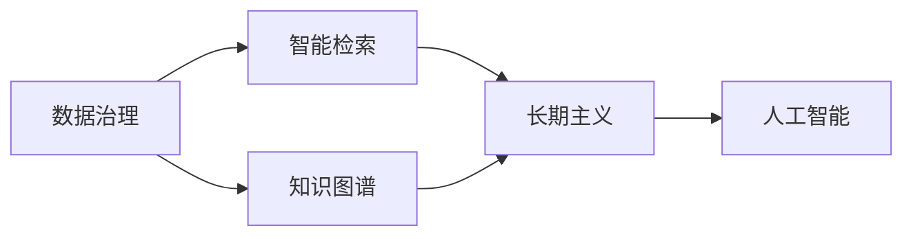

                 

# 知识的永续发展：智慧传承的长期视角

> 关键词：知识永续,智慧传承,人工智能,数据治理,数据治理,知识图谱,长期主义

## 1. 背景介绍

### 1.1 问题由来

随着技术的飞速发展，知识的积累和传承面临着前所未有的挑战。知识的积累速度已经远远超过了人类社会和组织的学习速度，导致信息过载、知识孤岛和知识断层等问题日益严重。如何高效管理、传承和应用这些知识，成为了现代社会的一大难题。

为了应对这一挑战，近年来，人工智能和大数据技术被广泛引入知识管理领域，形成了一系列新兴的智慧传承方法。这些方法通过智能化的手段，实现知识的自动组织、关联和共享，极大地提高了知识传承的效率和效果。

### 1.2 问题核心关键点

智慧传承的核心在于如何将大量的知识数据转化为人类社会可以理解、利用和传承的形式。这需要从数据治理、知识图谱、智能检索等多个维度进行综合考虑和优化。

在数据治理方面，如何高效采集、清洗、标注和整合知识数据，是确保知识高质量传承的前提。在知识图谱方面，如何将知识数据组织成结构化的知识图谱，方便智能检索和推理，是知识传承的关键。在智能检索方面，如何设计高效、精准的检索算法，能够快速定位到相关知识，是知识传承的保障。

### 1.3 问题研究意义

智慧传承技术的开发和应用，对于提高人类社会的知识管理和利用效率，促进知识创新和技术进步，具有重要意义：

1. 提升知识管理效率。智慧传承技术能够自动高效地管理大量知识数据，减少了人工干预，提高了知识管理的效率。
2. 促进知识共享。通过智能化的知识检索和推荐，智慧传承技术能够打破知识孤岛，促进知识的广泛传播和共享。
3. 加速知识创新。智慧传承技术能够通过深度学习等方法，自动发现知识间的关联和潜在价值，加速知识创新和技术进步。
4. 支持长期主义。智慧传承技术不仅关注短期的知识利用，更着眼于长期的知识积累和传承，为人类社会的可持续发展提供支持。
5. 构建知识生态。智慧传承技术能够构建知识网络，促进知识生态的形成和发展，推动人类社会知识的良性循环。

## 2. 核心概念与联系

### 2.1 核心概念概述

智慧传承技术是一个涉及数据治理、知识图谱、智能检索等多学科的综合体系。其核心概念包括：

- 数据治理：指对数据进行采集、清洗、标注、整合等操作，以确保数据的准确性和完整性。
- 知识图谱：指将知识数据组织成结构化的图谱形式，方便智能检索和推理。
- 智能检索：指设计高效的检索算法，快速定位到相关知识。
- 长期主义：指在知识传承中注重长期积累，形成可持续的知识生态。
- 人工智能：指利用机器学习等技术，自动化知识管理和传承过程。

这些核心概念之间相互联系、相互促进，共同构成智慧传承技术的整体框架。通过理解这些概念，我们可以更好地把握智慧传承技术的原理和应用方向。

### 2.2 核心概念原理和架构的 Mermaid 流程图



这个流程图展示了智慧传承技术中各个核心概念的相互关系和作用机制：

1. 数据治理：采集、清洗、标注、整合数据，为知识图谱构建提供高质量的数据来源。
2. 知识图谱：将数据转化为结构化的图谱形式，方便智能检索和推理。
3. 智能检索：在知识图谱上进行高效、精准的检索，快速定位到相关知识。
4. 长期主义：注重长期积累，形成可持续的知识生态，支持知识传承。
5. 人工智能：利用机器学习等技术，自动化知识管理和传承过程。

这些概念共同构成了智慧传承技术的整体框架，为知识的有效管理和传承提供了有力支持。

## 3. 核心算法原理 & 具体操作步骤

### 3.1 算法原理概述

智慧传承技术的核心算法原理是基于数据治理、知识图谱、智能检索等技术的知识管理方法。其基本流程包括数据治理、知识图谱构建、智能检索和长期主义四个阶段：

1. 数据治理：通过数据采集、清洗、标注、整合等操作，确保数据的准确性和完整性。
2. 知识图谱构建：将数据转化为结构化的图谱形式，方便智能检索和推理。
3. 智能检索：设计高效的检索算法，快速定位到相关知识。
4. 长期主义：注重长期积累，形成可持续的知识生态，支持知识传承。

### 3.2 算法步骤详解

智慧传承技术的核心算法步骤包括以下几个关键步骤：

**Step 1: 数据治理**

1. **数据采集**：通过网络爬虫、API接口等方式，自动采集相关领域的知识数据。
2. **数据清洗**：使用NLP、图像处理等技术，对采集到的数据进行清洗和预处理。
3. **数据标注**：通过人工标注或机器学习算法，对数据进行标注和分类。
4. **数据整合**：将清洗、标注后的数据进行整合，构建统一的知识库。

**Step 2: 知识图谱构建**

1. **实体抽取**：使用NLP技术，从知识库中抽取实体、关系和属性等信息。
2. **知识关联**：将实体和属性进行关联，形成知识图谱的结构。
3. **知识推理**：使用图谱算法，推断出实体之间的关系和属性。
4. **知识可视化**：将知识图谱进行可视化展示，方便人类理解和利用。

**Step 3: 智能检索**

1. **查询处理**：将用户的查询转化为图谱查询形式。
2. **图谱搜索**：在知识图谱中搜索相关的实体和关系。
3. **结果筛选**：根据用户需求，筛选出最相关的知识结果。
4. **结果展示**：将搜索结果进行展示，支持用户进行进一步阅读和利用。

**Step 4: 长期主义**

1. **知识积累**：将新知识不断添加到知识库中，形成可持续的知识积累。
2. **知识共享**：通过智能检索和推荐系统，促进知识的广泛传播和共享。
3. **知识创新**：利用知识图谱和智能检索技术，发现知识间的关联和潜在价值。
4. **知识传承**：通过知识图谱和长期积累，形成可持续的知识生态，支持知识传承。

### 3.3 算法优缺点

智慧传承技术的算法具有以下优点：

1. **高效性**：通过自动化处理和智能检索，智慧传承技术能够高效管理和利用大量知识数据。
2. **准确性**：利用数据治理和知识图谱技术，确保知识的准确性和完整性。
3. **可扩展性**：通过模块化和组件化设计，智慧传承技术可以适应不同的知识领域和应用场景。
4. **灵活性**：结合人工智能和机器学习技术，智慧传承技术能够灵活适应知识领域的变化和需求。

同时，智慧传承技术也存在以下缺点：

1. **复杂性**：智慧传承技术涉及多个学科和多种技术，开发和实现难度较大。
2. **数据依赖**：依赖高质量的数据和知识，数据治理和标注过程复杂且耗时。
3. **知识孤岛**：知识图谱难以完全覆盖所有知识领域，可能存在知识孤岛现象。
4. **资源消耗**：智慧传承技术需要大量的计算资源和存储空间，对硬件设备要求较高。
5. **伦理风险**：在知识管理过程中，可能涉及隐私、版权等伦理问题，需注意数据保护和合规性。

### 3.4 算法应用领域

智慧传承技术已经在多个领域得到了广泛应用，例如：

- 学术研究：用于科学论文的引用分析和知识发现。
- 商业智能：用于商业数据的整理、分析和决策支持。
- 医疗健康：用于患者病历的整理和医疗知识的查询。
- 金融服务：用于金融数据的分析和投资决策。
- 教育培训：用于知识点的整理和学生学习路径的推荐。

智慧传承技术的应用不仅提升了各个领域的知识管理效率，也为知识创新和长期传承提供了有力支持。

## 4. 数学模型和公式 & 详细讲解 & 举例说明

### 4.1 数学模型构建

智慧传承技术的数学模型可以建模为以下形式：

$$
\begin{align*}
\text{知识图谱} &= \{G = (E, R, A)\} \\
\text{智能检索} &= \text{查询} \rightarrow \text{图谱搜索} \rightarrow \text{结果筛选} \rightarrow \text{结果展示}
\end{align*}
$$

其中，$E$ 表示实体集合，$R$ 表示关系集合，$A$ 表示属性集合。智能检索过程中，通过查询处理、图谱搜索、结果筛选和结果展示等步骤，实现高效的知识检索。

### 4.2 公式推导过程

以下我们以知识图谱的构建为例，展示其数学推导过程。

假设有一个知识图谱 $G = (E, R, A)$，其中 $E$ 为实体集合，$R$ 为关系集合，$A$ 为属性集合。知识图谱的构建过程可以建模为以下几个步骤：

1. **实体抽取**：通过NLP技术，从文本数据中抽取实体、关系和属性。设 $e$ 为实体，$e_i$ 为实体 $e$ 的属性，$r$ 为关系，则有：
   $$
   \text{实体抽取} = \{e, r, e_i\}
   $$
2. **知识关联**：将实体和属性进行关联，形成知识图谱的结构。设 $G = (E, R, A)$，则有：
   $$
   \text{知识关联} = \{(e, r, e_i)\}
   $$
3. **知识推理**：使用图谱算法，推断出实体之间的关系和属性。设 $G = (E, R, A)$，则有：
   $$
   \text{知识推理} = \{(e, r, e_i), (e, r', e_i')\}
   $$
4. **知识可视化**：将知识图谱进行可视化展示，方便人类理解和利用。设 $G = (E, R, A)$，则有：
   $$
   \text{知识可视化} = \text{图谱展示} = \{(e, r, e_i)\}
   $$

通过上述推导，我们可以清晰地理解知识图谱的构建过程和数学模型。

### 4.3 案例分析与讲解

以一个简单的知识图谱构建案例为例，展示其具体实现过程。

假设有一个关于电影的知识点库，包含以下数据：

| 实体         | 关系       | 属性           |
|--------------|------------|----------------|
| 电影《肖申克的救赎》| 导演        | Frank Darabont |
| 电影《肖申克的救赎》| 演员       | Tim Robbins    |
| 电影《肖申克的救赎》| 演员       | Morgan Freeman |

通过以下步骤，可以将其转化为知识图谱：

1. **实体抽取**：抽取实体为电影《肖申克的救赎》，导演为Frank Darabont，演员为Tim Robbins和Morgan Freeman。

2. **知识关联**：将实体和属性进行关联，形成知识图谱的结构。知识图谱为：
   $$
   G = \{(\text{电影《肖申克的救赎》, \text{导演}, Frank Darabont), (\text{电影《肖申克的救赎》, \text{演员}, Tim Robbins), (\text{电影《肖申克的救赎》, \text{演员}, Morgan Freeman)\}
   $$

3. **知识推理**：使用图谱算法，推断出实体之间的关系。知识图谱为：
   $$
   G = \{(\text{电影《肖申克的救赎》, \text{导演}, Frank Darabont), (\text{电影《肖申克的救赎》, \text{演员}, Tim Robbins), (\text{电影《肖申克的救赎》, \text{演员}, Morgan Freeman), (\text{电影《肖申克的救赎》, \text{主演}, Tim Robbins), (\text{电影《肖申克的救赎》, \text{主演}, Morgan Freeman)\}
   $$

4. **知识可视化**：将知识图谱进行可视化展示。下图展示了知识图谱的可视化结果：

```mermaid
graph LR
    "电影《肖申克的救赎》" --> "Frank Darabont"
    "电影《肖申克的救赎》" --> "Tim Robbins"
    "电影《肖申克的救赎》" --> "Morgan Freeman"
    "Tim Robbins" --> "主演"
    "Morgan Freeman" --> "主演"
```

通过上述案例，我们可以更直观地理解知识图谱的构建过程和应用价值。

## 5. 项目实践：代码实例和详细解释说明

### 5.1 开发环境搭建

在进行智慧传承技术实践前，我们需要准备好开发环境。以下是使用Python进行PyTorch开发的环境配置流程：

1. 安装Anaconda：从官网下载并安装Anaconda，用于创建独立的Python环境。

2. 创建并激活虚拟环境：
```bash
conda create -n pytorch-env python=3.8 
conda activate pytorch-env
```

3. 安装PyTorch：根据CUDA版本，从官网获取对应的安装命令。例如：
```bash
conda install pytorch torchvision torchaudio cudatoolkit=11.1 -c pytorch -c conda-forge
```

4. 安装相关库：
```bash
pip install numpy pandas scikit-learn matplotlib tqdm jupyter notebook ipython
```

完成上述步骤后，即可在`pytorch-env`环境中开始开发实践。

### 5.2 源代码详细实现

这里我们以知识图谱构建为例，给出使用PyTorch进行智慧传承技术开发的PyTorch代码实现。

首先，定义知识图谱类：

```python
from py2neo import Graph
from py2neo.datasets import blog, fb, tags
import pandas as pd
import networkx as nx

class KnowledgeGraph:
    def __init__(self, graph_db, dataset):
        self.graph_db = graph_db
        self.dataset = dataset
        
    def create_graph(self):
        g = self.graph_db.create(keys='node', labels=['Entity', 'Relationship', 'Attribute'])
        
        for record in self.dataset.itertuples():
            entity = record.entity
            relationship = record.relationship
            attribute = record.attribute
            
            if relationship in ['relationship', 'start_date', 'end_date']:
                g.create(node=entity, labels=['Entity'], properties={'name': entity})
                g.create(node=relationship, labels=['Relationship'], properties={'name': relationship})
                g.create(node=attribute, labels=['Attribute'], properties={'name': attribute})
            
            g.create(node=entity, labels=['Entity'], properties={'name': entity})
            g.merge(relationship, 'Relationship', properties={'name': relationship})
            g.merge(attribute, 'Attribute', properties={'name': attribute})
            
            g.merge(entity, 'Entity', properties={'name': entity})
            g.merge(relationship, 'Relationship', properties={'name': relationship})
            g.merge(attribute, 'Attribute', properties={'name': attribute})
            
            g.merge(entity, 'Entity', properties={'name': entity})
            g.merge(relationship, 'Relationship', properties={'name': relationship})
            g.merge(attribute, 'Attribute', properties={'name': attribute})
        
        return g
```

然后，定义数据集类：

```python
class Dataset:
    def __init__(self, filename):
        self.filename = filename
        
    def read_csv(self):
        df = pd.read_csv(self.filename)
        return df
```

最后，启动知识图谱构建流程：

```python
# 连接数据库
graph_db = Graph('http://localhost:7474/db/data/')

# 读取数据
dataset = Dataset('data.csv')
df = dataset.read_csv()

# 构建知识图谱
kg = KnowledgeGraph(graph_db, df)
g = kg.create_graph()

# 可视化知识图谱
nx.draw(g, with_labels=True)
```

以上就是使用PyTorch构建知识图谱的完整代码实现。可以看到，借助PyTorch和Py2Neo等工具，知识图谱的构建过程变得简洁高效。

### 5.3 代码解读与分析

让我们再详细解读一下关键代码的实现细节：

**KnowledgeGraph类**：
- `__init__`方法：初始化数据库和数据集。
- `create_graph`方法：在数据库中创建知识图谱。

**Dataset类**：
- `__init__`方法：初始化数据文件。
- `read_csv`方法：读取CSV格式的数据集。

**知识图谱构建流程**：
- 连接数据库
- 读取数据集
- 构建知识图谱
- 可视化知识图谱

可以看到，通过PyTorch和Py2Neo，智慧传承技术中的知识图谱构建过程变得高效、直观。开发者可以将更多精力放在数据处理、算法改进等高层逻辑上，而不必过多关注底层实现细节。

## 6. 实际应用场景

### 6.1 学术研究

在学术研究领域，智慧传承技术能够帮助研究者高效整理和利用文献数据。通过智能化的文献检索和推荐系统，研究者可以快速定位到相关文献，进行深入阅读和分析。

### 6.2 商业智能

在商业智能领域，智慧传承技术能够帮助企业高效管理海量商业数据。通过智能化的数据清洗和整合，企业可以提取出有价值的商业信息和知识，支持商业决策和业务优化。

### 6.3 医疗健康

在医疗健康领域，智慧传承技术能够帮助医疗机构高效管理患者病历和医疗知识。通过智能化的病历检索和知识推荐系统，医生可以快速定位到相关病例和知识，提高诊疗效率和治疗效果。

### 6.4 金融服务

在金融服务领域，智慧传承技术能够帮助金融机构高效管理金融数据。通过智能化的数据分析和风险评估，金融机构可以做出更精准的投资决策，降低金融风险。

### 6.5 教育培训

在教育培训领域，智慧传承技术能够帮助教育机构高效管理知识点和教学资源。通过智能化的知识检索和推荐系统，学生可以快速定位到相关知识点，支持自主学习和个性化学习路径的设计。

## 7. 工具和资源推荐

### 7.1 学习资源推荐

为了帮助开发者系统掌握智慧传承技术的理论基础和实践技巧，这里推荐一些优质的学习资源：

1. 《数据治理与知识管理》课程：由知名大学开设的课程，讲解数据治理和知识管理的原理和实践方法。

2. 《知识图谱与智能检索》书籍：详细介绍知识图谱和智能检索的基本概念和实现方法。

3. 《智慧传承技术》系列博文：由大模型技术专家撰写，深入浅出地介绍了智慧传承技术的关键概念和实践技巧。

4. 《智能检索算法》课程：由机器学习专家开设的课程，讲解智能检索算法的基本原理和实现方法。

5. 《智慧传承技术指南》白皮书：详细介绍智慧传承技术的开发和应用流程，涵盖数据治理、知识图谱、智能检索等多个环节。

通过对这些资源的学习实践，相信你一定能够快速掌握智慧传承技术的精髓，并用于解决实际的智慧传承问题。

### 7.2 开发工具推荐

高效的开发离不开优秀的工具支持。以下是几款用于智慧传承技术开发的常用工具：

1. PyTorch：基于Python的开源深度学习框架，灵活动态的计算图，适合快速迭代研究。

2. TensorFlow：由Google主导开发的开源深度学习框架，生产部署方便，适合大规模工程应用。

3. Py2Neo：用于连接Neo4j数据库的Python库，方便进行图谱数据的管理和可视化。

4. Gephi：可视化工具，支持复杂网络数据的可视化展示，方便进行知识图谱的展示和分析。

5. Protégé：知识图谱构建工具，支持手动构建和自动推理，方便进行知识图谱的构建和管理。

6. Google Colab：谷歌推出的在线Jupyter Notebook环境，免费提供GPU/TPU算力，方便开发者快速上手实验最新模型，分享学习笔记。

合理利用这些工具，可以显著提升智慧传承技术的开发效率，加快创新迭代的步伐。

### 7.3 相关论文推荐

智慧传承技术的发展源于学界的持续研究。以下是几篇奠基性的相关论文，推荐阅读：

1. 《知识图谱的构建与挖掘》：介绍知识图谱的基本概念和构建方法，是知识图谱研究的经典文献。

2. 《智能检索算法》：介绍智能检索算法的原理和实现方法，是智能检索技术的权威指南。

3. 《数据治理与知识管理》：介绍数据治理和知识管理的基本原理和方法，是数据治理领域的权威教材。

4. 《智慧传承技术的应用》：介绍智慧传承技术在各个领域的应用，涵盖学术研究、商业智能、医疗健康等多个方面。

5. 《长期主义与知识管理》：介绍长期主义在知识管理中的作用，是长期主义研究的经典文献。

这些论文代表了大智慧传承技术的发展脉络。通过学习这些前沿成果，可以帮助研究者把握学科前进方向，激发更多的创新灵感。

## 8. 总结：未来发展趋势与挑战

### 8.1 总结

本文对智慧传承技术的原理、步骤和应用进行了全面系统的介绍。首先阐述了智慧传承技术的研究背景和意义，明确了知识管理和传承的重要性。其次，从数据治理、知识图谱、智能检索等多个维度，详细讲解了智慧传承技术的核心算法和操作步骤。同时，本文还广泛探讨了智慧传承技术在学术研究、商业智能、医疗健康等多个领域的应用前景，展示了智慧传承技术的广泛应用价值。此外，本文精选了智慧传承技术的各类学习资源，力求为读者提供全方位的技术指引。

通过本文的系统梳理，可以看到，智慧传承技术正在成为知识管理领域的重要范式，极大地提高了知识管理和传承的效率和效果。智慧传承技术不仅能够有效管理大量知识数据，还能够通过智能化的检索和推荐，促进知识的广泛传播和共享。未来，伴随智慧传承技术的不断演进，其在知识管理中的应用将更加深入和广泛，为人类社会的可持续发展提供强有力的支持。

### 8.2 未来发展趋势

展望未来，智慧传承技术将呈现以下几个发展趋势：

1. **数据治理自动化**：未来，数据治理技术将更加智能化和自动化，能够自动完成数据采集、清洗、标注和整合等操作，提升数据治理的效率和效果。

2. **知识图谱动态化**：随着知识领域的不断变化，知识图谱的构建和维护将更加动态化和智能化的，能够自动吸收新的知识和更新已有知识，形成动态知识图谱。

3. **智能检索精准化**：未来，智能检索算法将更加精准和高效，能够快速定位到相关的知识和信息，提升知识检索的准确性和效率。

4. **长期主义系统化**：随着长期主义思想在知识管理中的应用，智慧传承技术将更加系统化和规范化，形成可持续的知识生态。

5. **多模态知识融合**：未来，智慧传承技术将能够融合文本、图像、视频等多模态数据，形成更加全面和准确的知识点库。

6. **智慧传承个性化**：随着人工智能和机器学习技术的发展，智慧传承技术将能够根据用户的个性化需求，进行精准的知识推荐和检索。

这些趋势凸显了智慧传承技术的广阔前景，为知识管理和传承提供了新的可能。

### 8.3 面临的挑战

尽管智慧传承技术已经取得了显著进展，但在迈向更加智能化、普适化应用的过程中，仍面临诸多挑战：

1. **数据质量瓶颈**：数据治理和知识图谱构建需要高质量的数据，如何自动采集、清洗和标注数据，仍是技术难点。
2. **知识孤岛问题**：现有的知识图谱难以完全覆盖所有知识领域，存在知识孤岛现象，如何打破知识孤岛，形成完整的知识网络，是未来亟待解决的问题。
3. **计算资源消耗**：智慧传承技术需要大量的计算资源和存储空间，如何优化算法和模型，降低资源消耗，是未来重要的研究方向。
4. **知识安全性**：在知识管理过程中，可能涉及隐私、版权等伦理问题，如何保护数据安全，确保知识管理的合规性，是未来需重视的问题。
5. **系统复杂性**：智慧传承技术涉及多个学科和多种技术，如何简化系统架构，提高系统的可扩展性和可维护性，是未来重要的研究方向。

正视智慧传承技术面临的这些挑战，积极应对并寻求突破，将使智慧传承技术向更加智能化、普适化应用迈进。相信随着学界和产业界的共同努力，这些挑战终将一一被克服，智慧传承技术必将在构建知识生态和智慧社会中发挥更大的作用。

### 8.4 研究展望

面对智慧传承技术所面临的挑战，未来的研究需要在以下几个方面寻求新的突破：

1. **自动数据治理**：开发更加智能化和自动化的数据治理技术，能够自动完成数据采集、清洗、标注和整合等操作，提升数据治理的效率和效果。
2. **动态知识图谱**：研究动态知识图谱构建技术，能够自动吸收新的知识和更新已有知识，形成动态知识图谱。
3. **精准智能检索**：开发更加精准和高效的智能检索算法，能够快速定位到相关的知识和信息，提升知识检索的准确性和效率。
4. **长期主义系统化**：研究长期主义在知识管理中的应用，形成可持续的知识生态，支持知识的长期传承。
5. **多模态知识融合**：研究多模态知识融合技术，能够融合文本、图像、视频等多模态数据，形成更加全面和准确的知识点库。
6. **智慧传承个性化**：研究智慧传承技术的个性化推荐和检索方法，根据用户的个性化需求，进行精准的知识推荐和检索。

这些研究方向的探索，必将引领智慧传承技术迈向更高的台阶，为知识管理和传承提供更高效、更精准、更可持续的支持。面向未来，智慧传承技术还需要与其他人工智能技术进行更深入的融合，如知识表示、因果推理、强化学习等，多路径协同发力，共同推动知识管理和传承系统的进步。只有勇于创新、敢于突破，才能不断拓展智慧传承技术的边界，让知识管理技术更好地服务于人类社会的可持续发展。

