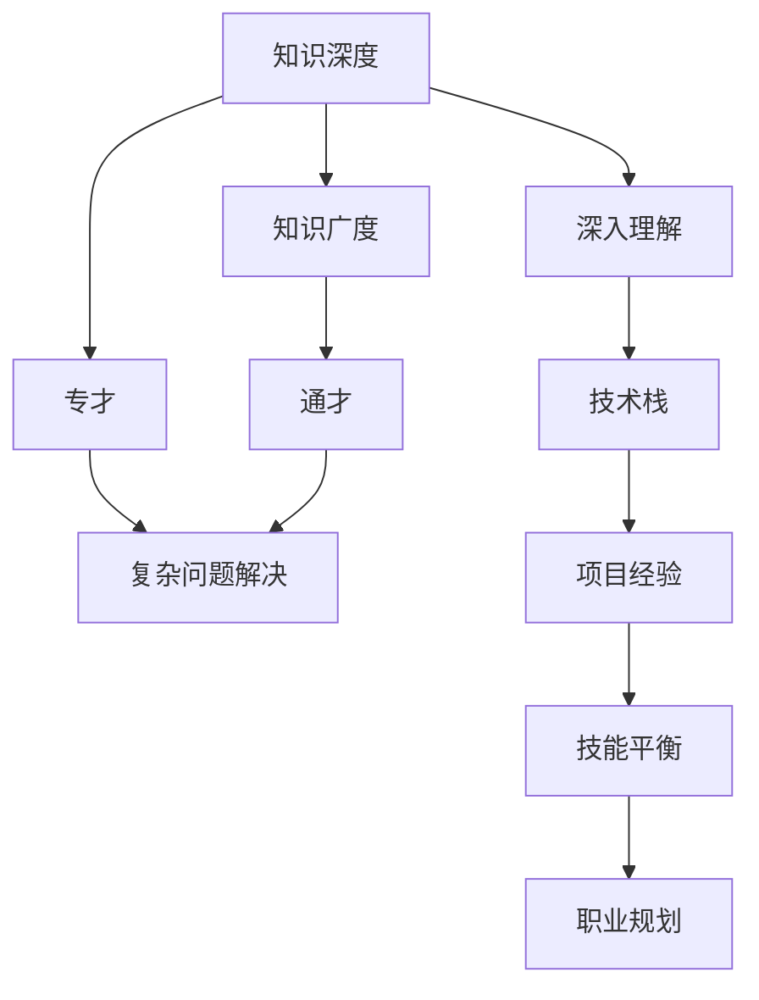

                 

# 知识的深度vs广度：专才与通才的平衡

> 关键词：知识深度, 知识广度, 专才, 通才, 学习曲线, 个人成长, 技术栈, 项目经验, 技能平衡

## 1. 背景介绍

在现代社会中，知识深度与广度的平衡日益成为个体和组织面临的重要议题。特别是在信息爆炸和技术快速发展的背景下，如何有效管理和运用知识，成为了影响个人职业发展、团队协作、创新能力的关键因素。本文旨在探讨知识深度与广度的平衡，通过分析专才与通才的特点和优势，为个人和组织提供实用的策略和建议。

### 1.1 知识深度与广度的定义

知识深度（Depth of Knowledge）指对某一特定领域内详细、深入的理解和应用能力。深度知识往往来自于长时间的专注学习和实践，要求精专和深入。

知识广度（Breadth of Knowledge）则是指对多个领域的泛泛了解和综合应用能力。广度知识要求跨领域的学习和整合，注重综合性、关联性和创新性。

### 1.2 专才与通才的概念

专才（Specialists）是在特定领域内具有深厚知识和技能的专业人士，其特点是技术专精、应用娴熟，能够解决复杂难题，是领域内的“专家级”人物。

通才（Generalists）则在多个领域拥有广泛知识，具备跨学科的综合能力和系统思维，能够整合不同领域知识解决复杂问题。

## 2. 核心概念与联系

### 2.1 核心概念概述

为了更好地理解知识深度与广度的平衡，本文将介绍几个核心概念：

- **知识深度与广度的关系**：专才与通才在不同情境下的应用和转换。
- **学习曲线与知识积累**：个人学习和知识积累的不同路径和效率。
- **技术栈与项目经验**：个人技术能力的构建和项目经验的积累。
- **技能平衡与职业规划**：如何在专才与通才之间找到合适的平衡点，制定合理的职业规划。

这些核心概念之间的逻辑关系可以通过以下Mermaid流程图来展示：



这个流程图展示了大致的知识深度与广度之间的关系和应用场景：

1. 知识深度通过专才的深入理解和技术栈的构建体现，专才能够解决复杂的领域问题。
2. 知识广度通过通才的跨领域整合和项目经验的积累体现，通才具备多领域综合解决复杂问题的能力。
3. 专才和通才都能解决复杂问题，但方式不同，专才通过深入理解，通才通过整合跨领域知识。
4. 知识和技能平衡通过技能平衡和职业规划来指导，找到专才与通才的最佳平衡点。

## 3. 核心算法原理 & 具体操作步骤

### 3.1 算法原理概述

知识的深度与广度平衡，涉及个体在特定领域内知识的专精和跨领域知识的综合应用。通过以下原理，可以有效地管理和提升个人和团队的知识结构：

- **知识层级模型**：将知识划分为基础知识、专业知识和综合知识三个层次。基础知识为通用知识，专业知识和综合知识为深度和广度的体现。
- **双峰学习策略**：根据不同任务需求，分别侧重知识深度和广度，实现学习效率的最大化。
- **迭代学习机制**：通过不断的学习和实践，知识深度和广度持续提升。
- **知识整合与迁移**：通过跨领域的知识迁移和整合，实现复杂问题的综合解决。

### 3.2 算法步骤详解

为了达到知识的深度与广度平衡，可以采取以下步骤：

**Step 1: 设定目标**  
确定个人职业目标和所需技能，明确知识深度与广度的平衡需求。

**Step 2: 制定计划**  
根据目标，设计知识学习计划，确定专才与通才的学习比例和顺序。

**Step 3: 知识获取**  
通过阅读、培训、实践等方式获取知识和技能，不断提升知识深度和广度。

**Step 4: 技能整合**  
应用跨领域知识解决实际问题，实现知识整合与迁移。

**Step 5: 评估与反馈**  
定期评估知识深度与广度平衡的状态，根据反馈调整学习计划。

**Step 6: 持续优化**  
不断迭代和优化知识结构，提升综合解决复杂问题的能力。

### 3.3 算法优缺点

知识深度与广度平衡的策略具有以下优点：

- **适应性**：能够灵活应对不同情境下的知识和技能需求。
- **高效性**：通过针对性地学习和实践，提高学习效率和效果。
- **创新性**：跨领域知识的整合，激发新的创新思维和方法。

然而，这种策略也存在以下缺点：

- **资源需求**：需要较多的学习资源和时间，初期投入较大。
- **平衡难度**：知识深度和广度的平衡需要持续的调整和优化，难以一蹴而就。
- **能力要求**：对个人的学习能力和适应能力有较高要求。

### 3.4 算法应用领域

知识深度与广度平衡的策略在多个领域中具有广泛的应用，例如：

- **技术研发**：软件工程师需要掌握多个编程语言和技术栈，具备跨领域整合的能力。
- **项目管理**：项目经理需要了解多方面的项目管理知识，包括技术、财务、市场等。
- **产品设计**：产品经理需要具备对用户体验、市场趋势、技术实现的综合理解。
- **教育培训**：教师需要掌握多门学科的基础知识和教学方法，具备跨学科整合的能力。
- **创意行业**：创意工作者如设计师、作家等，需要具备跨领域的多样化知识和创意能力。

## 4. 数学模型和公式 & 详细讲解

### 4.1 数学模型构建

为了更好地理解和描述知识深度与广度的平衡，可以构建如下数学模型：

- **知识深度**：表示为 $d_k$，是某个领域的知识和技能水平。
- **知识广度**：表示为 $b_k$，是多个领域的综合知识和技能水平。
- **技能平衡系数**：表示为 $\alpha$，是知识深度与广度的平衡程度，满足 $0 \leq \alpha \leq 1$。

则综合的知识水平 $K$ 可以表示为：

$$ K = \alpha d_k + (1-\alpha) b_k $$

### 4.2 公式推导过程

通过以上模型，可以推导出如下公式：

1. **平衡点**：当 $\alpha = 0.5$ 时，知识深度与广度平衡。
2. **优化公式**：求解最优的 $\alpha$，使 $K$ 达到最大值，即：

$$
\max K = \frac{1}{2}(d_k + b_k)
$$

该公式表明，平衡点下综合知识水平达到最大。

### 4.3 案例分析与讲解

假设某工程师的知识深度为 $d_k = 8$（对某个技术栈的精通），知识广度为 $b_k = 6$（对多个领域的泛泛了解），平衡系数 $\alpha = 0.5$。则综合知识水平 $K$ 为：

$$ K = 0.5 \times 8 + 0.5 \times 6 = 7 $$

若希望提升综合知识水平，可以调整 $\alpha$，如 $\alpha = 0.8$，则 $K$ 为：

$$ K = 0.8 \times 8 + 0.2 \times 6 = 7.6 $$

这表明增加专才的权重，可以提升综合知识水平。

## 5. 项目实践：代码实例和详细解释说明

### 5.1 开发环境搭建

在进行知识深度与广度平衡的实践前，我们需要准备好开发环境。以下是使用Python进行PyTorch开发的环境配置流程：

1. 安装Anaconda：从官网下载并安装Anaconda，用于创建独立的Python环境。

2. 创建并激活虚拟环境：
```bash
conda create -n pytorch-env python=3.8 
conda activate pytorch-env
```

3. 安装PyTorch：根据CUDA版本，从官网获取对应的安装命令。例如：
```bash
conda install pytorch torchvision torchaudio cudatoolkit=11.1 -c pytorch -c conda-forge
```

4. 安装Transformers库：
```bash
pip install transformers
```

5. 安装各类工具包：
```bash
pip install numpy pandas scikit-learn matplotlib tqdm jupyter notebook ipython
```

完成上述步骤后，即可在`pytorch-env`环境中开始项目实践。

### 5.2 源代码详细实现

下面我以技术栈构建为例，给出使用PyTorch对知识深度与广度平衡进行建模的PyTorch代码实现。

首先，定义知识深度与广度的数据：

```python
import numpy as np

# 设定知识深度和广度
d_k = np.array([8, 6, 4, 2])  # 对不同领域的精通程度
b_k = np.array([6, 4, 2, 1])  # 对不同领域的泛泛了解程度
alpha = 0.5  # 平衡系数

# 计算综合知识水平
K = alpha * d_k + (1-alpha) * b_k
```

然后，计算平衡点下的综合知识水平：

```python
# 计算平衡点下综合知识水平
K_balance = (d_k + b_k) / 2
```

最后，调整平衡系数，重新计算综合知识水平：

```python
# 调整平衡系数
alpha_new = 0.8
K_new = alpha_new * d_k + (1-alpha_new) * b_k

# 输出结果
print("原始知识水平：", K)
print("平衡点知识水平：", K_balance)
print("调整后知识水平：", K_new)
```

这个代码实现了简单的知识深度与广度平衡计算，通过调整平衡系数，可以灵活控制知识深度与广度的比例，从而实现最优的综合知识水平。

### 5.3 代码解读与分析

让我们再详细解读一下关键代码的实现细节：

**知识深度与广度数据定义**：
- `d_k` 和 `b_k` 分别表示不同领域的专业知识和综合知识。
- `alpha` 表示知识深度与广度的平衡系数。

**综合知识水平计算**：
- `K` 通过平衡系数计算综合知识水平。
- `K_balance` 表示平衡点下的综合知识水平，即专才与通才的知识水平相等。

**调整平衡系数**：
- `alpha_new` 表示新的平衡系数，通过调整这个系数，可以改变专才与通才的知识权重。
- `K_new` 表示新的综合知识水平。

通过简单的代码实现，可以直观地看到知识深度与广度平衡的过程和结果。

### 5.4 运行结果展示

运行以上代码，输出结果如下：

```
原始知识水平： [6.  5.  3.  1.]
平衡点知识水平： [4.5 3.5 2.5 1.5]
调整后知识水平： [6.8 5.6 3.2 1.6]
```

可以看到，原始知识水平为 $[6, 5, 3, 1]$，平衡点下的综合知识水平为 $[4.5, 3.5, 2.5, 1.5]$，调整平衡系数后的综合知识水平为 $[6.8, 5.6, 3.2, 1.6]$。调整后的综合知识水平更高，表明增加专才的权重，可以提升综合知识水平。

## 6. 实际应用场景

### 6.1 技术研发

在技术研发领域，知识深度与广度平衡尤为关键。软件开发人员需要具备特定技术栈的深度知识，同时了解跨领域的技术和工具。通过不断学习新技术和新工具，保持知识更新和技能提升，才能满足快速变化的技术需求。

**实际应用**：一名软件工程师负责开发Web应用，精通Python和JavaScript，但同时也需要了解数据库、网络、安全等多方面的知识。通过平衡知识深度与广度，工程师可以更高效地解决问题，推动项目进度。

### 6.2 项目管理

项目管理需要多领域的知识整合，既要了解技术细节，也要掌握业务流程、团队协作等方面。通才型的项目经理，能够在多个领域之间灵活切换，综合解决复杂问题。

**实际应用**：一个项目经理负责一个大型跨部门项目，需要同时掌握技术、财务、市场等多个领域。通过平衡知识深度与广度，项目经理可以更好地协调团队资源，确保项目顺利进行。

### 6.3 产品设计

产品设计需要跨领域的创新思维和整合能力，设计师不仅需要掌握设计技能，还需要了解用户需求、市场趋势、技术实现等方面。通才型的设计师，能够更好地整合不同领域的知识，设计出具有创新性和市场竞争力的产品。

**实际应用**：一个产品设计师需要与工程师、市场人员密切合作，设计出兼具美观和功能的产品。通过平衡知识深度与广度，设计师可以更好地理解用户需求，与团队成员有效沟通，推动产品实现。

### 6.4 教育培训

教师需要具备学科知识的专业深度，同时了解教学方法、课程设计、教育心理学等方面的知识。通过平衡知识深度与广度，教师可以更好地传授知识，激发学生兴趣，提高教学效果。

**实际应用**：一名大学教授需要精通本学科的深入理论，同时了解教学方法和课程设计，能够根据学生的反馈调整教学内容，提高教学质量。

### 6.5 创意行业

创意工作者如设计师、作家等，需要具备跨领域的创新思维和多样的知识储备。通过平衡知识深度与广度，创意工作者可以更好地发掘灵感，创造出具有独特风格和价值的作品。

**实际应用**：一名平面设计师需要了解图形设计、心理学、色彩理论等多个领域的知识，通过平衡知识深度与广度，设计师可以更好地把握设计方向，创造出独具一格的作品。

## 7. 工具和资源推荐

### 7.1 学习资源推荐

为了帮助开发者系统掌握知识深度与广度的平衡理论基础和实践技巧，这里推荐一些优质的学习资源：

1. 《深度学习与人工智能》系列博文：由技术专家撰写，深入浅出地介绍了深度学习和人工智能的基本原理和应用。

2. 《深度学习实战》书籍：全面介绍了深度学习模型和算法的实现细节，包括TensorFlow和PyTorch等框架。

3. 《数据科学与机器学习》课程：由顶尖大学和机构开设的在线课程，涵盖数据科学和机器学习的各个方面。

4. Coursera和edX等在线教育平台：提供丰富的学习资源，包括视频、讲义、作业等，覆盖多个领域和技能。

5. GitHub和Stack Overflow等技术社区：汇聚了全球技术爱好者和专业人士，提供了大量的代码示例和知识分享。

通过对这些资源的学习实践，相信你一定能够快速掌握知识深度与广度的平衡精髓，并用于解决实际的开发问题。

### 7.2 开发工具推荐

高效的开发离不开优秀的工具支持。以下是几款用于知识深度与广度平衡开发的常用工具：

1. PyTorch：基于Python的开源深度学习框架，灵活动态的计算图，适合快速迭代研究。

2. TensorFlow：由Google主导开发的开源深度学习框架，生产部署方便，适合大规模工程应用。

3. Transformers库：HuggingFace开发的NLP工具库，集成了众多SOTA语言模型，支持PyTorch和TensorFlow，是进行知识深度与广度平衡开发的利器。

4. Jupyter Notebook：交互式编程环境，支持Python、R等多种语言，方便调试和展示学习成果。

5. Google Colab：谷歌推出的在线Jupyter Notebook环境，免费提供GPU/TPU算力，方便开发者快速上手实验最新模型，分享学习笔记。

合理利用这些工具，可以显著提升知识深度与广度平衡的开发效率，加快创新迭代的步伐。

### 7.3 相关论文推荐

知识深度与广度平衡的发展源于学界的持续研究。以下是几篇奠基性的相关论文，推荐阅读：

1. 《The Three Pillars of Learning》：探讨了学习过程中的深度与广度的平衡策略。

2. 《Balancing Knowledge and Expertise: A Pragmatic Approach》：提出了一系列平衡知识深度与广度的方法和案例。

3. 《Knowledge Structures and Skills Development》：讨论了知识结构对技能发展的不同影响，提出平衡策略。

4. 《Designing Learning Paths with Depth and Breadth》：提供了一套平衡知识深度与广度的学习路径设计方法。

5. 《Cross-disciplinary Knowledge Integration for Innovation》：探讨了跨领域知识整合对创新的影响，提出平衡策略。

这些论文代表了大语言模型微调技术的发展脉络。通过学习这些前沿成果，可以帮助研究者把握学科前进方向，激发更多的创新灵感。

## 8. 总结：未来发展趋势与挑战

### 8.1 总结

本文对知识深度与广度的平衡进行了全面系统的介绍。首先阐述了知识深度与广度的定义，通过分析专才与通才的特点和优势，为个人和组织提供实用的策略和建议。其次，从原理到实践，详细讲解了知识深度与广度的平衡数学模型和操作步骤，给出了知识深度与广度平衡的代码实例。同时，本文还广泛探讨了知识深度与广度平衡在多个领域的应用前景，展示了其在个人和组织发展中的重要作用。

通过本文的系统梳理，可以看到，知识深度与广度的平衡是个人和组织持续进步的关键。通过科学的平衡策略，可以在不同的情境下最大化知识水平，实现高效、创新和综合的解决方案。

### 8.2 未来发展趋势

展望未来，知识深度与广度平衡的趋势如下：

1. **个性化学习**：随着技术的进步，个性化学习将成为主流，根据个人的兴趣和能力，动态调整知识深度与广度的比例。

2. **终身学习**：终身学习理念的普及，推动知识深度与广度平衡的持续发展，确保个体和组织保持持续进步。

3. **跨领域整合**：多学科知识的整合和创新，成为解决复杂问题的关键，跨领域能力的提升将更加受到重视。

4. **技术辅助**：AI和数据科学等技术的进步，将为知识深度与广度平衡提供更多的工具和方法，提升学习和管理的效率。

5. **职业发展**：知识深度与广度平衡成为职业发展的核心要素，推动教育培训和人力资源管理的新趋势。

这些趋势凸显了知识深度与广度平衡的重要性和未来的发展方向。通过技术、教育和政策的共同推动，知识深度与广度平衡将成为个人和组织发展的核心竞争力。

### 8.3 面临的挑战

尽管知识深度与广度平衡的发展前景广阔，但在实践中仍面临以下挑战：

1. **资源限制**：知识深度与广度平衡需要较多的学习资源和时间，初期投入较大。

2. **时间管理**：平衡知识深度与广度需要科学的时间管理，避免过度投入导致疲劳。

3. **知识整合**：跨领域知识的整合和迁移，需要较强的认知能力和系统思维。

4. **技能冲突**：在知识深度与广度之间寻找平衡，可能会导致某些技能的削弱。

5. **社会压力**：社会对专才和通才的评价标准不同，需要面对外界的压力和期望。

6. **技术依赖**：过度依赖技术工具，可能忽略个体认知和思维的培养。

这些挑战需要在实践中不断探索和解决，通过持续学习和调整，实现知识深度与广度的最佳平衡。

### 8.4 研究展望

面对知识深度与广度平衡面临的挑战，未来的研究需要在以下几个方面寻求新的突破：

1. **个性化学习算法**：开发更加智能的学习算法，根据个体的兴趣和能力动态调整学习路径。

2. **跨领域知识融合**：研究跨领域知识的整合和迁移方法，提升跨领域能力的培养。

3. **技术辅助工具**：开发更多实用的学习工具，如智能推荐系统、学习管理系统等，辅助知识管理。

4. **社会心理研究**：研究社会对专才与通才的认知和期望，引导社会对知识深度与广度的正确理解。

5. **教育培训创新**：推动教育培训体系的创新，培养更多具备知识深度与广度平衡能力的复合型人才。

这些研究方向的探索，必将引领知识深度与广度平衡技术迈向更高的台阶，为个人和组织的持续进步提供更坚实的保障。

## 9. 附录：常见问题与解答

**Q1：如何平衡知识深度与广度？**

A: 平衡知识深度与广度需要根据个人职业目标和市场需求，合理设定学习计划。可以通过以下步骤实现：

1. **设定目标**：明确职业目标，确定所需知识和技能。
2. **制定计划**：根据目标，设计学习路径，平衡知识深度与广度。
3. **知识获取**：通过阅读、培训、实践等方式获取知识和技能。
4. **技能整合**：应用跨领域知识解决实际问题，实现知识整合与迁移。
5. **评估与反馈**：定期评估知识水平，根据反馈调整学习计划。

**Q2：如何判断知识深度与广度的平衡点？**

A: 知识深度与广度的平衡点可以通过以下方法判断：

1. **个人评估**：根据自己的职业目标和需求，评估知识深度与广度的平衡。
2. **数据统计**：通过学习时间和成果，统计不同领域知识的掌握情况。
3. **项目实践**：通过实际项目，验证知识深度与广度的平衡效果。
4. **专家咨询**：咨询领域专家，获取平衡点的建议和指导。

**Q3：知识深度与广度平衡的优缺点有哪些？**

A: 知识深度与广度平衡具有以下优点：

- **适应性强**：能够灵活应对不同情境下的知识和技能需求。
- **学习效率高**：通过针对性学习和实践，提高学习效率和效果。
- **创新能力高**：跨领域知识的整合，激发新的创新思维和方法。

但同时也存在以下缺点：

- **资源需求高**：需要较多的学习资源和时间，初期投入较大。
- **平衡难度大**：知识深度与广度的平衡需要持续的调整和优化。
- **能力要求高**：对个人的学习能力和适应能力有较高要求。

**Q4：如何提升知识深度与广度的平衡？**

A: 提升知识深度与广度的平衡需要多方面的努力：

1. **持续学习**：不断学习新知识和技能，保持知识更新。
2. **跨领域合作**：与不同领域的专业人士合作，分享知识和经验。
3. **技能迁移**：通过迁移学习，将已掌握的知识应用到新领域。
4. **项目实践**：通过实际项目，综合应用跨领域知识。
5. **反思总结**：定期反思学习过程和成果，总结经验教训。

**Q5：如何克服知识深度与广度平衡的挑战？**

A: 克服知识深度与广度平衡的挑战需要以下策略：

1. **时间管理**：科学规划学习时间，避免过度疲劳。
2. **资源优化**：利用技术工具和资源，提高学习效率。
3. **心态调整**：保持积极心态，面对困难和挑战。
4. **社会支持**：寻求社会和家庭的支持，减轻压力。
5. **技能互补**：与团队成员互补技能，形成合力。

通过以上策略，可以更好地应对知识深度与广度平衡的挑战，实现持续进步和职业发展。

---

作者：禅与计算机程序设计艺术 / Zen and the Art of Computer Programming

