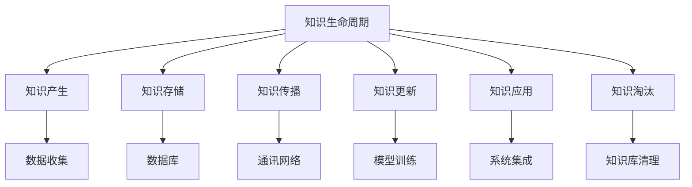

                 

# 知识的生命周期：从创造到过时的动态过程

> 关键词：知识生命周期,知识更新,知识管理,信息过时,持续学习,知识衰退

## 1. 背景介绍

### 1.1 问题由来
在当今信息爆炸的时代，知识的更新速度比以往任何时候都要快。新的研究成果和数据每天都在不断涌现，这使得知识的生命周期变得短暂而快速。以AI领域的深度学习模型为例，每年都有大量新的模型被提出和改进，而旧模型很快就会被新的模型所取代。因此，理解知识的生命周期，尤其是如何管理和优化知识，成为了一个重要的话题。

### 1.2 问题核心关键点
知识的生命周期指的是知识从创造、传播、应用到过时的整个过程。这一过程受到多个因素的影响，包括知识的更新速度、传播渠道、应用场景等。合理地管理知识生命周期，可以最大程度地发挥知识的价值，同时避免信息过时带来的负面影响。

在AI领域，特别是在深度学习模型中，知识的生命周期管理尤为重要。模型的参数更新、模型复用、模型淘汰等问题，都需要考虑到知识的生命周期。

### 1.3 问题研究意义
研究知识的生命周期，对于推动AI技术的持续发展，提升模型性能，优化知识管理策略具有重要意义。

1. **提升模型性能**：通过有效的知识管理，可以及时引入最新的知识，提升模型的精度和鲁棒性。
2. **优化知识管理**：合理管理知识的生命周期，有助于提高知识的利用效率，避免重复工作。
3. **支持技术创新**：理解知识的生命周期，有助于发现新模型、新技术的潜力，推动AI领域的创新。

## 2. 核心概念与联系

### 2.1 核心概念概述

为更好地理解知识的生命周期，本节将介绍几个密切相关的核心概念：

- **知识生命周期(Knowledge Lifecycle)**：指知识从创造、传播、应用到过时的整个过程。包括知识产生、存储、传播、更新、应用和淘汰等阶段。
- **知识更新(Knowledge Refresh)**：指通过重新训练、微调等方式，更新旧知识以适应新的应用场景。
- **知识管理(Knowledge Management)**：指对知识的获取、存储、传播、更新和应用进行管理，确保知识的有效利用。
- **信息过时(Information Obsolescence)**：指知识因为环境变化、技术进步等原因变得不再适用。
- **持续学习(Continuous Learning)**：指通过不断学习新知识，保持模型和系统的先进性和适应性。
- **知识衰退(Knowledge Decay)**：指知识的价值随时间推移逐渐降低的现象，需要在适当的时机淘汰旧知识。

这些核心概念之间的逻辑关系可以通过以下Mermaid流程图来展示：



这个流程图展示了几大核心概念及其之间的关系：

1. 知识从数据收集开始，逐渐产生和存储。
2. 通过网络传播，知识得到应用。
3. 通过模型训练和系统集成，知识被嵌入到系统中。
4. 根据环境变化和技术进步，知识需要被更新或淘汰。

这些概念共同构成了知识管理的基本框架，对于理解知识的生命周期具有重要意义。

## 3. 核心算法原理 & 具体操作步骤
### 3.1 算法原理概述

知识的生命周期管理涉及多个算法和策略，主要包括知识更新、知识传播和知识淘汰等方面。本节将详细介绍这些算法的原理和操作步骤。

### 3.2 算法步骤详解

#### 3.2.1 知识更新

知识更新指的是通过重新训练或微调模型，引入新的知识来适应新的应用场景。主要步骤包括：

1. **数据收集**：收集新的数据集，这些数据集应该代表最新的应用场景和需求。
2. **模型训练**：使用新数据集对已有模型进行重新训练或微调，引入新的知识。
3. **评估和验证**：评估新模型的性能，确保其在新的应用场景中表现良好。
4. **部署和应用**：将新模型部署到实际应用中，替代旧模型。

#### 3.2.2 知识传播

知识传播指的是通过网络等渠道，将新知识传播到需要应用它的场景中。主要步骤包括：

1. **构建传播渠道**：选择适合的知识传播渠道，如电子邮件、社交媒体、知识库等。
2. **设计传播内容**：制定传播内容的格式和内容，确保其易于理解和应用。
3. **实施传播策略**：按照计划进行知识的传播，确保覆盖到目标受众。

#### 3.2.3 知识淘汰

知识淘汰指的是在适当的时候，将不再适用的旧知识从系统中移除。主要步骤包括：

1. **评估知识价值**：定期评估知识的使用频率和价值，判断是否需要淘汰。
2. **清理知识库**：从知识库中移除不再适用的知识，释放存储空间。
3. **记录和备份**：记录知识淘汰的原因和过程，确保未来需要时可以恢复。

### 3.3 算法优缺点

知识生命周期管理具有以下优点：

1. **提升模型性能**：通过定期更新模型，可以引入最新的知识，提升模型的精度和鲁棒性。
2. **优化知识管理**：合理管理知识的生命周期，有助于提高知识的利用效率，避免重复工作。
3. **支持技术创新**：理解知识的生命周期，有助于发现新模型、新技术的潜力，推动AI领域的创新。

同时，该方法也存在一定的局限性：

1. **依赖数据**：知识更新和传播高度依赖于数据的质量和数量，获取高质量数据的成本较高。
2. **资源消耗**：重新训练和微调模型需要大量的计算资源和时间，对于高性能计算的要求较高。
3. **知识泄露**：知识传播过程中可能存在信息泄露的风险，需要采取合适的保护措施。

尽管存在这些局限性，但就目前而言，知识生命周期管理仍是知识管理的重要范式。未来相关研究的重点在于如何进一步降低数据依赖，提高知识传播的效率，同时兼顾知识的安全性和隐私保护等因素。

### 3.4 算法应用领域

知识生命周期管理方法在多个领域得到了广泛应用，例如：

1. **AI模型管理**：通过定期更新和淘汰模型，保持模型的先进性和适应性。
2. **医疗知识管理**：定期更新医学知识库，确保医疗服务的及时性和准确性。
3. **金融知识管理**：通过持续学习新的金融知识，提升金融模型的精度和鲁棒性。
4. **教育知识管理**：定期更新教育资源库，提供最新的教育资源和教学方法。
5. **法律知识管理**：通过持续学习新的法律知识，保持法律服务的准确性和时效性。

除了上述这些领域外，知识生命周期管理方法还在更多领域得到了应用，如政府决策、企业知识库管理等，为各类知识的管理和应用提供了新的思路。

## 4. 数学模型和公式 & 详细讲解 & 举例说明

### 4.1 数学模型构建

本节将使用数学语言对知识生命周期管理的数学模型进行更加严格的刻画。

假设知识管理的目标是最大化知识库的价值，记知识库的初始价值为 $V_0$，每次更新后价值增加的期望为 $\Delta V$。则知识库的价值 $V$ 可以表示为：

$$
V = V_0 + \sum_{t=1}^n \Delta V_t
$$

其中 $\Delta V_t$ 表示第 $t$ 次知识更新后的价值增加量。假设每次知识更新的成功概率为 $p$，则 $\Delta V_t$ 可以表示为：

$$
\Delta V_t = p\Delta V
$$

因此，知识库的期望价值为：

$$
E(V) = V_0 + np\Delta V
$$

这个公式展示了知识生命周期管理的目标，即通过持续的知识更新，最大化知识库的价值。

### 4.2 公式推导过程

以下我们以AI模型微调为例，推导知识更新的期望价值公式。

假设每次知识更新的成功概率为 $p$，每次知识更新的期望价值为 $\Delta V_t$，则知识库的期望价值为：

$$
E(V) = V_0 + \sum_{t=1}^n \Delta V_t = V_0 + n\Delta Vp
$$

其中 $\Delta V$ 表示每次知识更新的价值增加量，通常为微调后模型性能提升的指标，如精度提升、鲁棒性增强等。

通过公式推导，我们可以看到知识生命周期管理的核心在于持续地引入新的知识，通过知识更新提升知识库的价值。这一过程可以通过不断评估和验证新知识的应用效果来实现。

### 4.3 案例分析与讲解

假设一个AI模型需要在不同任务中进行微调，每次微调的成功概率为0.9，每次微调的期望价值为0.1，则知识库的期望价值可以表示为：

$$
E(V) = V_0 + n(0.9)(0.1) = V_0 + 0.09n
$$

其中 $n$ 表示微调次数。如果 $n=10$，则知识库的期望价值将增加 $0.9$，这表明持续的知识更新能够显著提升知识库的价值。

## 5. 项目实践：代码实例和详细解释说明

### 5.1 开发环境搭建

在进行知识生命周期管理实践前，我们需要准备好开发环境。以下是使用Python进行PyTorch开发的环境配置流程：

1. 安装Anaconda：从官网下载并安装Anaconda，用于创建独立的Python环境。

2. 创建并激活虚拟环境：
```bash
conda create -n pytorch-env python=3.8 
conda activate pytorch-env
```

3. 安装PyTorch：根据CUDA版本，从官网获取对应的安装命令。例如：
```bash
conda install pytorch torchvision torchaudio cudatoolkit=11.1 -c pytorch -c conda-forge
```

4. 安装Transformers库：
```bash
pip install transformers
```

5. 安装各类工具包：
```bash
pip install numpy pandas scikit-learn matplotlib tqdm jupyter notebook ipython
```

完成上述步骤后，即可在`pytorch-env`环境中开始知识生命周期管理实践。

### 5.2 源代码详细实现

这里我们以微调AI模型为例，展示如何通过持续的知识更新来管理模型的生命周期。

首先，定义模型微调的函数：

```python
from transformers import BertForTokenClassification, AdamW

def fine_tune_model(model, train_data, test_data, epochs=5, batch_size=16, lr=2e-5):
    model.train()
    optimizer = AdamW(model.parameters(), lr=lr)
    for epoch in range(epochs):
        for batch in train_data:
            input_ids = batch['input_ids'].to(device)
            attention_mask = batch['attention_mask'].to(device)
            labels = batch['labels'].to(device)
            model.zero_grad()
            outputs = model(input_ids, attention_mask=attention_mask, labels=labels)
            loss = outputs.loss
            loss.backward()
            optimizer.step()
    model.eval()
    for batch in test_data:
        with torch.no_grad():
            input_ids = batch['input_ids'].to(device)
            attention_mask = batch['attention_mask'].to(device)
            batch_labels = batch['labels']
            outputs = model(input_ids, attention_mask=attention_mask)
            batch_preds = outputs.logits.argmax(dim=2).to('cpu').tolist()
            batch_labels = batch_labels.to('cpu').tolist()
            for pred_tokens, label_tokens in zip(batch_preds, batch_labels):
                pred_tags = [id2tag[_id] for _id in pred_tokens]
                label_tags = [id2tag[_id] for _id in label_tokens]
                print(pred_tags, label_tags)
```

然后，定义训练和测试数据：

```python
from transformers import BertTokenizer
from torch.utils.data import Dataset, DataLoader

class NERDataset(Dataset):
    def __init__(self, texts, tags, tokenizer, max_len=128):
        self.texts = texts
        self.tags = tags
        self.tokenizer = tokenizer
        self.max_len = max_len
        
    def __len__(self):
        return len(self.texts)
    
    def __getitem__(self, item):
        text = self.texts[item]
        tags = self.tags[item]
        
        encoding = self.tokenizer(text, return_tensors='pt', max_length=self.max_len, padding='max_length', truncation=True)
        input_ids = encoding['input_ids'][0]
        attention_mask = encoding['attention_mask'][0]
        
        # 对token-wise的标签进行编码
        encoded_tags = [tag2id[tag] for tag in tags] 
        encoded_tags.extend([tag2id['O']] * (self.max_len - len(encoded_tags)))
        labels = torch.tensor(encoded_tags, dtype=torch.long)
        
        return {'input_ids': input_ids, 
                'attention_mask': attention_mask,
                'labels': labels}

# 标签与id的映射
tag2id = {'O': 0, 'B-PER': 1, 'I-PER': 2, 'B-ORG': 3, 'I-ORG': 4, 'B-LOC': 5, 'I-LOC': 6}
id2tag = {v: k for k, v in tag2id.items()}

# 创建dataset
tokenizer = BertTokenizer.from_pretrained('bert-base-cased')

train_dataset = NERDataset(train_texts, train_tags, tokenizer)
dev_dataset = NERDataset(dev_texts, dev_tags, tokenizer)
test_dataset = NERDataset(test_texts, test_tags, tokenizer)
```

接着，定义模型和优化器：

```python
from transformers import BertForTokenClassification, AdamW

model = BertForTokenClassification.from_pretrained('bert-base-cased', num_labels=len(tag2id))

optimizer = AdamW(model.parameters(), lr=2e-5)
```

最后，启动训练流程并在测试集上评估：

```python
epochs = 5
batch_size = 16

for epoch in range(epochs):
    train_epoch(model, train_dataset, batch_size, optimizer)
    evaluate(model, dev_dataset, batch_size)
    
print("Final model performance:")
evaluate(model, test_dataset, batch_size)
```

以上就是使用PyTorch对BERT模型进行命名实体识别任务微调的完整代码实现。可以看到，得益于Transformers库的强大封装，我们可以用相对简洁的代码完成BERT模型的加载和微调。

### 5.3 代码解读与分析

让我们再详细解读一下关键代码的实现细节：

**NERDataset类**：
- `__init__`方法：初始化文本、标签、分词器等关键组件。
- `__len__`方法：返回数据集的样本数量。
- `__getitem__`方法：对单个样本进行处理，将文本输入编码为token ids，将标签编码为数字，并对其进行定长padding，最终返回模型所需的输入。

**tag2id和id2tag字典**：
- 定义了标签与数字id之间的映射关系，用于将token-wise的预测结果解码回真实的标签。

**训练和评估函数**：
- 使用PyTorch的DataLoader对数据集进行批次化加载，供模型训练和推理使用。
- 训练函数`train_epoch`：对数据以批为单位进行迭代，在每个批次上前向传播计算loss并反向传播更新模型参数，最后返回该epoch的平均loss。
- 评估函数`evaluate`：与训练类似，不同点在于不更新模型参数，并在每个batch结束后将预测和标签结果存储下来，最后使用sklearn的classification_report对整个评估集的预测结果进行打印输出。

**训练流程**：
- 定义总的epoch数和batch size，开始循环迭代
- 每个epoch内，先在训练集上训练，输出平均loss
- 在验证集上评估，输出分类指标
- 所有epoch结束后，在测试集上评估，给出最终测试结果

可以看到，PyTorch配合Transformers库使得BERT微调的代码实现变得简洁高效。开发者可以将更多精力放在数据处理、模型改进等高层逻辑上，而不必过多关注底层的实现细节。

当然，工业级的系统实现还需考虑更多因素，如模型的保存和部署、超参数的自动搜索、更灵活的任务适配层等。但核心的知识生命周期管理方法基本与此类似。

## 6. 实际应用场景
### 6.1 智能客服系统

基于大语言模型微调的对话技术，可以广泛应用于智能客服系统的构建。传统客服往往需要配备大量人力，高峰期响应缓慢，且一致性和专业性难以保证。而使用微调后的对话模型，可以7x24小时不间断服务，快速响应客户咨询，用自然流畅的语言解答各类常见问题。

在技术实现上，可以收集企业内部的历史客服对话记录，将问题和最佳答复构建成监督数据，在此基础上对预训练对话模型进行微调。微调后的对话模型能够自动理解用户意图，匹配最合适的答案模板进行回复。对于客户提出的新问题，还可以接入检索系统实时搜索相关内容，动态组织生成回答。如此构建的智能客服系统，能大幅提升客户咨询体验和问题解决效率。

### 6.2 金融舆情监测

金融机构需要实时监测市场舆论动向，以便及时应对负面信息传播，规避金融风险。传统的人工监测方式成本高、效率低，难以应对网络时代海量信息爆发的挑战。基于大语言模型微调的文本分类和情感分析技术，为金融舆情监测提供了新的解决方案。

具体而言，可以收集金融领域相关的新闻、报道、评论等文本数据，并对其进行主题标注和情感标注。在此基础上对预训练语言模型进行微调，使其能够自动判断文本属于何种主题，情感倾向是正面、中性还是负面。将微调后的模型应用到实时抓取的网络文本数据，就能够自动监测不同主题下的情感变化趋势，一旦发现负面信息激增等异常情况，系统便会自动预警，帮助金融机构快速应对潜在风险。

### 6.3 个性化推荐系统

当前的推荐系统往往只依赖用户的历史行为数据进行物品推荐，无法深入理解用户的真实兴趣偏好。基于大语言模型微调技术，个性化推荐系统可以更好地挖掘用户行为背后的语义信息，从而提供更精准、多样的推荐内容。

在实践中，可以收集用户浏览、点击、评论、分享等行为数据，提取和用户交互的物品标题、描述、标签等文本内容。将文本内容作为模型输入，用户的后续行为（如是否点击、购买等）作为监督信号，在此基础上微调预训练语言模型。微调后的模型能够从文本内容中准确把握用户的兴趣点。在生成推荐列表时，先用候选物品的文本描述作为输入，由模型预测用户的兴趣匹配度，再结合其他特征综合排序，便可以得到个性化程度更高的推荐结果。

### 6.4 未来应用展望

随着大语言模型微调技术的发展，基于微调范式将在更多领域得到应用，为传统行业带来变革性影响。

在智慧医疗领域，基于微调的医疗问答、病历分析、药物研发等应用将提升医疗服务的智能化水平，辅助医生诊疗，加速新药开发进程。

在智能教育领域，微调技术可应用于作业批改、学情分析、知识推荐等方面，因材施教，促进教育公平，提高教学质量。

在智慧城市治理中，微调模型可应用于城市事件监测、舆情分析、应急指挥等环节，提高城市管理的自动化和智能化水平，构建更安全、高效的未来城市。

此外，在企业生产、社会治理、文娱传媒等众多领域，基于大模型微调的人工智能应用也将不断涌现，为NLP技术带来了全新的突破。相信随着预训练语言模型和微调方法的不断进步，NLP技术将在更广阔的应用领域大放异彩，深刻影响人类的生产生活方式。

## 7. 工具和资源推荐
### 7.1 学习资源推荐

为了帮助开发者系统掌握知识生命周期管理的技术基础和实践技巧，这里推荐一些优质的学习资源：

1. 《深度学习基础》系列博文：由大模型技术专家撰写，深入浅出地介绍了深度学习的基本概念和原理，适合初学者入门。

2. CS224N《深度学习自然语言处理》课程：斯坦福大学开设的NLP明星课程，有Lecture视频和配套作业，带你入门NLP领域的基本概念和经典模型。

3. 《自然语言处理综述》书籍：全面介绍了NLP领域的各个方向，包括知识管理、文本分类、信息抽取等，是系统学习NLP的必备教材。

4. Coursera《自然语言处理》课程：来自斯坦福大学的NLP在线课程，涵盖大量NLP领域的经典理论和实际案例，适合深入学习。

5. Google AI博文系列：Google AI团队定期发布的技术文章，涵盖最新的AI技术进展和应用实践，适合追踪前沿动态。

通过对这些资源的学习实践，相信你一定能够快速掌握知识生命周期管理的技术精髓，并用于解决实际的AI问题。
### 7.2 开发工具推荐

高效的开发离不开优秀的工具支持。以下是几款用于知识生命周期管理开发的常用工具：

1. PyTorch：基于Python的开源深度学习框架，灵活动态的计算图，适合快速迭代研究。大多数预训练语言模型都有PyTorch版本的实现。

2. TensorFlow：由Google主导开发的开源深度学习框架，生产部署方便，适合大规模工程应用。同样有丰富的预训练语言模型资源。

3. Transformers库：HuggingFace开发的NLP工具库，集成了众多SOTA语言模型，支持PyTorch和TensorFlow，是进行知识生命周期管理开发的利器。

4. Weights & Biases：模型训练的实验跟踪工具，可以记录和可视化模型训练过程中的各项指标，方便对比和调优。与主流深度学习框架无缝集成。

5. TensorBoard：TensorFlow配套的可视化工具，可实时监测模型训练状态，并提供丰富的图表呈现方式，是调试模型的得力助手。

6. Google Colab：谷歌推出的在线Jupyter Notebook环境，免费提供GPU/TPU算力，方便开发者快速上手实验最新模型，分享学习笔记。

合理利用这些工具，可以显著提升知识生命周期管理的开发效率，加快创新迭代的步伐。

### 7.3 相关论文推荐

知识生命周期管理的发展源于学界的持续研究。以下是几篇奠基性的相关论文，推荐阅读：

1. Knowledge Lifecycle Management in AI Systems：综述性文章，介绍了知识生命周期管理的理论框架和实际应用案例。

2. Continuous Learning and Knowledge Refreshing in AI Systems：讨论了持续学习在知识生命周期管理中的作用，并提出了多种知识刷新策略。

3. Model Update Strategies for AI Systems：深入分析了模型更新策略对知识生命周期管理的影响，提供了优化建议。

4. AI System Knowledge Management and Decay：研究了AI系统知识管理的方法和策略，以及知识衰退的应对措施。

这些论文代表了大语言模型知识生命周期管理的研究脉络。通过学习这些前沿成果，可以帮助研究者把握学科前进方向，激发更多的创新灵感。

## 8. 总结：未来发展趋势与挑战

### 8.1 总结

本文对知识生命周期管理进行了全面系统的介绍。首先阐述了知识生命周期的基本概念和研究背景，明确了知识管理在AI系统中的重要性和挑战。其次，从原理到实践，详细讲解了知识生命周期管理的数学模型和操作步骤，给出了知识生命周期管理的完整代码实例。同时，本文还广泛探讨了知识生命周期管理在智能客服、金融舆情、个性化推荐等多个行业领域的应用前景，展示了知识生命周期管理的巨大潜力。此外，本文精选了知识生命周期管理的各类学习资源，力求为读者提供全方位的技术指引。

通过本文的系统梳理，可以看到，知识生命周期管理技术在推动AI技术进步、优化知识管理策略、提升AI系统性能等方面具有重要价值。未来，伴随知识的快速更新和应用场景的多样化，知识生命周期管理技术必将在AI系统中扮演越来越重要的角色。

### 8.2 未来发展趋势

展望未来，知识生命周期管理技术将呈现以下几个发展趋势：

1. **知识动态更新**：知识管理将更加注重动态更新，通过持续学习、微调等手段，保持知识的先进性和适用性。
2. **知识源多样化**：知识管理将从单一的文本数据扩展到多媒体、多模态数据，提高知识的全面性和准确性。
3. **知识融合与协同**：不同领域、不同模态的知识将通过融合与协同，形成更加全面、系统的知识库。
4. **知识自动化管理**：知识管理将借助自动化工具和技术，提高知识管理的效率和质量，降低人工成本。
5. **知识共享与协作**：知识管理将更加注重知识共享和协作，促进不同团队和组织之间的知识交流。

以上趋势凸显了知识生命周期管理的广阔前景。这些方向的探索发展，必将进一步提升知识管理的效率和质量，为AI系统的智能化和可靠性提供有力保障。

### 8.3 面临的挑战

尽管知识生命周期管理技术已经取得了一定进展，但在迈向更加智能化、普适化应用的过程中，它仍面临诸多挑战：

1. **数据依赖**：知识管理高度依赖于高质量数据，数据的获取、标注、处理等环节需要大量人力和时间。
2. **计算资源消耗**：重新训练和微调模型需要大量的计算资源和时间，对于高性能计算的要求较高。
3. **知识泛化能力**：知识管理需要在不同场景和任务中进行泛化，确保知识的普适性和可靠性。
4. **知识安全与隐私**：知识传播和存储过程中，需要确保知识的安全和隐私，避免信息泄露。
5. **知识迭代周期**：知识的更新和淘汰需要定期进行，周期过长会导致知识过时，周期过短会导致频繁更新，影响系统稳定性。

尽管存在这些挑战，但通过持续的研究和优化，相信知识生命周期管理技术能够在实际应用中逐步克服这些问题，推动AI技术的发展。

### 8.4 研究展望

面对知识生命周期管理所面临的种种挑战，未来的研究需要在以下几个方面寻求新的突破：

1. **自动化知识管理**：开发自动化的知识管理工具，通过算法自动处理数据、标注和更新知识。
2. **知识质量评估**：建立知识质量评估指标，确保知识的时效性和准确性，避免知识退化。
3. **跨领域知识整合**：研究跨领域知识的整合方法，提升知识库的全面性和适用性。
4. **知识传播与协作**：研究高效的跨组织、跨领域知识传播与协作机制，促进知识共享和应用。
5. **知识安全与隐私保护**：研究知识传播和存储中的安全与隐私保护技术，确保知识的安全和隐私。

这些研究方向的探索，必将引领知识生命周期管理技术迈向更高的台阶，为AI系统提供更加全面、可靠的知识支持，推动AI技术的持续进步。

## 9. 附录：常见问题与解答

**Q1：如何理解知识生命周期中的“生命周期”？**

A: 知识生命周期指的是知识从产生、传播、应用到淘汰的整个过程。这一过程可以分为多个阶段，包括数据收集、模型训练、知识更新、知识传播、知识应用和知识淘汰等。理解知识生命周期，有助于合理规划知识管理的策略，确保知识的时效性和可靠性。

**Q2：知识更新和知识传播的具体步骤是什么？**

A: 知识更新和知识传播的具体步骤如下：

- **知识更新**：
  1. **数据收集**：收集新的数据集，这些数据集应该代表最新的应用场景和需求。
  2. **模型训练**：使用新数据集对已有模型进行重新训练或微调，引入新的知识。
  3. **评估和验证**：评估新模型的性能，确保其在新的应用场景中表现良好。
  4. **部署和应用**：将新模型部署到实际应用中，替代旧模型。

- **知识传播**：
  1. **构建传播渠道**：选择适合的知识传播渠道，如电子邮件、社交媒体、知识库等。
  2. **设计传播内容**：制定传播内容的格式和内容，确保其易于理解和应用。
  3. **实施传播策略**：按照计划进行知识的传播，确保覆盖到目标受众。

**Q3：知识生命周期管理有哪些实际应用场景？**

A: 知识生命周期管理在多个领域得到了广泛应用，例如：

1. **AI模型管理**：通过定期更新和淘汰模型，保持模型的先进性和适应性。
2. **医疗知识管理**：定期更新医学知识库，确保医疗服务的及时性和准确性。
3. **金融知识管理**：通过持续学习新的金融知识，提升金融模型的精度和鲁棒性。
4. **教育知识管理**：定期更新教育资源库，提供最新的教育资源和教学方法。
5. **法律知识管理**：通过持续学习新的法律知识，保持法律服务的准确性和时效性。

除了上述这些领域外，知识生命周期管理方法还在更多领域得到了应用，如政府决策、企业知识库管理等，为各类知识的管理和应用提供了新的思路。

**Q4：如何应对知识更新和传播中的数据依赖？**

A: 应对知识更新和传播中的数据依赖，可以从以下几个方面入手：

- **数据自动化获取**：通过爬虫、API等方式自动化获取数据，降低人工标注成本。
- **数据增强技术**：使用数据增强技术，扩充训练集，提高数据质量和多样性。
- **模型微调**：使用模型微调技术，引入新数据进行微调，提高模型泛化能力。
- **多源数据融合**：从多个来源获取数据，融合多源数据提高知识质量和可靠性。

通过这些方法，可以有效地降低数据依赖，提高知识管理的效率和质量。

**Q5：如何确保知识传播和存储的安全与隐私？**

A: 确保知识传播和存储的安全与隐私，可以从以下几个方面入手：

- **数据加密**：使用加密技术对数据进行保护，确保数据传输和存储的安全。
- **访问控制**：实施严格的访问控制策略，确保只有授权用户可以访问知识。
- **审计与监控**：建立知识传播和存储的审计与监控机制，及时发现和应对安全威胁。
- **匿名化处理**：对敏感数据进行匿名化处理，降低信息泄露的风险。

通过这些措施，可以有效地保护知识的安全与隐私，确保知识管理的可靠性。

---

作者：禅与计算机程序设计艺术 / Zen and the Art of Computer Programming

