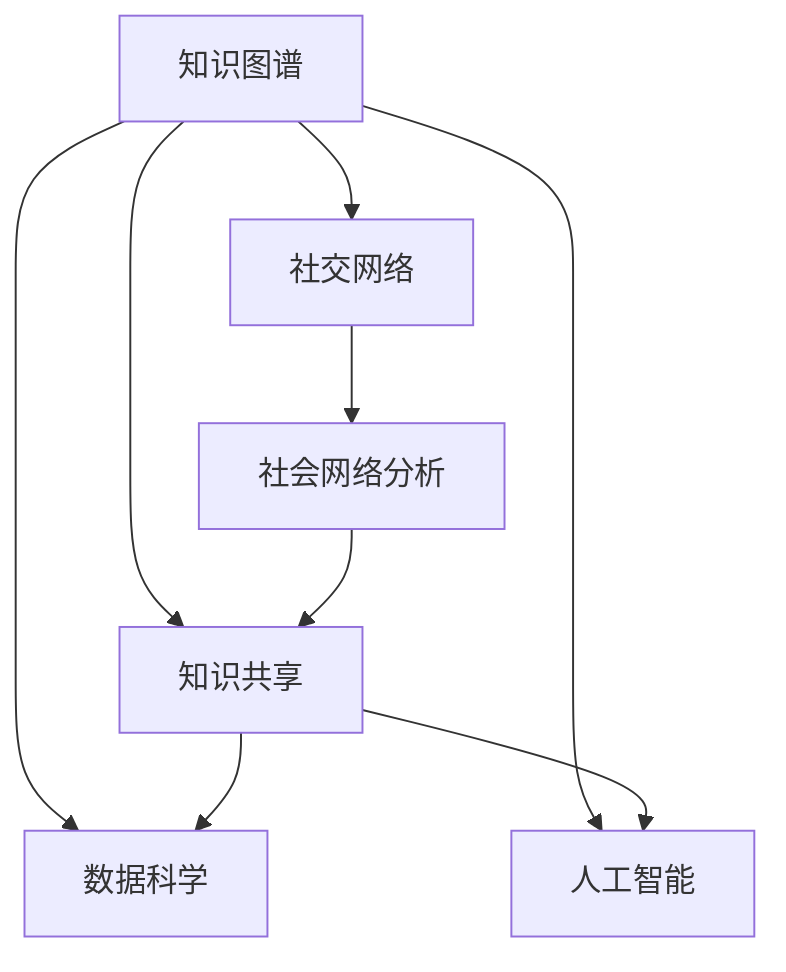

                 

# 知识的生态系统：个人、组织与社会的互动

> 关键词：知识图谱, 数据科学, 人工智能, 社交网络, 知识共享, 社会网络分析

## 1. 背景介绍

在当今信息爆炸的时代，知识已经成为推动社会进步和发展的重要驱动力。然而，知识的生产、获取、分享和利用并不是孤立的过程，而是一个复杂的生态系统，涉及个人、组织和社会多个层面。本文将深入探讨这个生态系统，并分析其在知识管理和应用中的重要性。

### 1.1 问题由来
随着科技的迅猛发展，知识的产生速度和数量急剧增加。无论是科学研究、商业实践，还是日常生活，都需要不断学习新知识以保持竞争力。然而，传统的知识管理和利用方式，如书籍、文献和讲座，已经无法满足现代信息社会的需求。我们需要更高效、更智能的知识管理和共享机制，以便快速、准确地获取和应用知识。

### 1.2 问题核心关键点
知识的生态系统包括多个关键组成部分：
- **知识生产者**：包括学者、专家、工程师等，负责知识的创造和研发。
- **知识存储**：如数据库、文献库、知识图谱等，用于存储和检索知识。
- **知识消费者**：如学生、研究人员、企业员工等，负责知识的吸收和应用。
- **知识传播者**：如教师、讲师、技术博主等，负责知识的传播和推广。
- **知识管理工具**：如搜索引擎、知识图谱、社交网络等，用于支持知识的管理、检索和共享。
- **社会文化**：包括教育体系、企业文化、社会价值观等，影响知识生产和利用的方式和效率。

### 1.3 问题研究意义
研究知识生态系统，对于提升知识生产、获取、共享和利用的效率，具有重要意义：
- **提升效率**：通过优化知识生态系统，可以加速知识的获取和应用，提高个人和组织的工作效率。
- **促进创新**：知识的有效传播和共享，可以促进跨学科、跨领域的合作，激发创新灵感。
- **实现普惠**：通过知识共享，使更多人能够平等地获取和利用知识，缩小知识鸿沟。
- **增强竞争力**：知识管理能力强的企业和国家，能够在竞争中占据有利位置。

## 2. 核心概念与联系

### 2.1 核心概念概述

为更好地理解知识生态系统，本节将介绍几个密切相关的核心概念：

- **知识图谱(Knowledge Graph)**：一种用于表示实体及其关系的语义网络，用于知识存储、检索和推理。
- **数据科学(Data Science)**：一门涉及数据处理、分析、可视化和建模的学科，用于从数据中提取知识。
- **人工智能(Artificial Intelligence, AI)**：通过算法和模型，模拟人类智能行为的学科，可以用于知识推荐、智能问答等。
- **社交网络(Social Network)**：一种基于关系和互动的社会结构，用于知识传播和社群建设。
- **知识共享(Knowledge Sharing)**：通过知识传播者、社会网络和知识管理工具，实现知识在个体和组织之间的共享和传播。
- **社会网络分析(Social Network Analysis, SNA)**：一门研究社会网络结构和动态的学科，用于分析知识传播和社会互动的规律。

这些核心概念之间的逻辑关系可以通过以下Mermaid流程图来展示：



这个流程图展示了几大核心概念之间的相互关系：

1. 知识图谱是数据科学的基础，用于知识存储和检索。
2. 人工智能可以处理和分析数据科学的结果，用于知识推荐和智能问答。
3. 社交网络提供知识传播的渠道，促进知识共享。
4. 知识共享是知识传播和利用的关键，通过社会网络和知识管理工具实现。
5. 社会网络分析研究知识传播的规律，指导知识共享策略。

## 3. 核心算法原理 & 具体操作步骤
### 3.1 算法原理概述

知识生态系统中的核心算法涉及数据科学和人工智能的多个方向，旨在高效地处理、分析和应用知识。以下是一些典型的算法原理：

- **知识图谱构建**：通过实体识别、关系抽取和融合，构建知识图谱。常用的方法包括基于规则的抽取、基于机器学习的抽取等。
- **数据预处理**：对数据进行清洗、归一化和特征工程，提高数据质量。常用的方法包括缺失值处理、异常值检测、特征选择等。
- **数据分析**：使用统计学、机器学习和深度学习等技术，从数据中提取有用的知识。常用的方法包括回归分析、分类、聚类、深度学习等。
- **知识推理**：使用逻辑推理、规则推理等方法，从知识图谱中得出新的知识。常用的方法包括基于符号的推理、基于模型的推理等。
- **智能问答**：使用自然语言处理技术，理解用户的问题，并从知识图谱中检索答案。常用的方法包括信息检索、语义分析等。
- **知识推荐**：根据用户的历史行为和兴趣，推荐相关的知识。常用的方法包括协同过滤、基于内容的推荐、深度学习等。

### 3.2 算法步骤详解

以下是知识生态系统中典型算法的详细步骤：

#### 3.2.1 知识图谱构建
1. **数据收集**：收集相关的文本、图像、音频等数据。
2. **实体识别**：使用命名实体识别(NER)技术，从文本中识别出实体。
3. **关系抽取**：使用关系抽取技术，从文本中抽取实体之间的关系。
4. **知识融合**：将从不同数据源抽取的知识进行融合，形成完整且一致的知识图谱。

#### 3.2.2 数据预处理
1. **数据清洗**：去除噪声、缺失值和异常值，提高数据质量。
2. **归一化**：将数据进行标准化处理，便于后续分析。
3. **特征工程**：选择合适的特征，并构建特征向量，提高模型的表现。

#### 3.2.3 数据分析
1. **数据探索**：使用统计学方法，探索数据的基本特征。
2. **特征选择**：使用特征选择算法，选择对目标变量有影响的特征。
3. **模型训练**：使用机器学习或深度学习模型，训练数据并得出结果。
4. **模型评估**：使用交叉验证等方法，评估模型的性能。

#### 3.2.4 知识推理
1. **知识表示**：将知识图谱中的实体和关系进行编码，形成知识表示。
2. **规则设计**：设计推理规则，进行基于规则的推理。
3. **模型训练**：使用基于图神经网络的模型，训练知识推理模型。
4. **推理验证**：使用推理验证方法，验证推理结果的正确性。

#### 3.2.5 智能问答
1. **问题解析**：使用自然语言处理技术，解析用户的问题。
2. **知识检索**：从知识图谱中检索相关信息。
3. **答案生成**：使用生成模型，生成答案。
4. **回答验证**：验证答案的正确性和完整性。

#### 3.2.6 知识推荐
1. **用户画像**：根据用户的历史行为和兴趣，构建用户画像。
2. **内容表示**：将推荐内容进行编码，形成内容表示。
3. **相似度计算**：计算用户画像与内容的相似度。
4. **推荐排序**：根据相似度排序，生成推荐结果。

### 3.3 算法优缺点

知识生态系统中的核心算法具有以下优点：
1. **高效性**：使用算法可以快速处理和分析大量数据，提取有用的知识。
2. **灵活性**：算法可以灵活应用于不同领域和场景，满足多样化的需求。
3. **准确性**：先进的算法可以提供高精度的结果，提高决策的准确性。

同时，这些算法也存在一些局限性：
1. **数据依赖**：算法的性能高度依赖于数据的质量和规模。
2. **复杂性**：一些算法涉及复杂的数学模型和计算过程，不易理解和使用。
3. **泛化能力**：算法可能对特定的数据和场景有较好的表现，但对新数据和场景的适应能力有限。
4. **资源消耗**：一些高级算法需要大量的计算资源和存储空间，可能导致性能瓶颈。

### 3.4 算法应用领域

知识生态系统中的核心算法已经广泛应用于多个领域，如科学研究、医疗健康、金融服务、电子商务等：

- **科学研究**：使用数据分析和机器学习技术，进行科学研究和发现。
- **医疗健康**：使用知识图谱和智能问答技术，辅助医生诊断和治疗。
- **金融服务**：使用数据分析和知识推理技术，进行风险评估和投资决策。
- **电子商务**：使用推荐算法，提高客户体验和销售转化率。

除了上述这些领域外，知识生态系统还将进一步拓展到更多场景中，如智能家居、智慧城市、智慧教育等，为各行各业带来变革性的影响。

## 4. 数学模型和公式 & 详细讲解
### 4.1 数学模型构建

本节将使用数学语言对知识生态系统中的核心算法进行更加严格的刻画。

记知识图谱中的实体为 $E=\{e_1, e_2, ..., e_n\}$，关系为 $R=\{r_1, r_2, ..., r_m\}$，知识图谱表示为 $G=(E, R)$。数据集为 $D=\{(x_i, y_i)\}_{i=1}^N$，其中 $x_i$ 为输入特征，$y_i$ 为标签。

定义知识推理模型的参数为 $\theta$，目标函数为 $L(\theta)$，则优化问题为：

$$
\theta^* = \mathop{\arg\min}_{\theta} L(\theta)
$$

其中，损失函数 $L(\theta)$ 可以是一个分类损失函数（如交叉熵损失），也可以是一个回归损失函数（如均方误差损失）。

### 4.2 公式推导过程

以下以知识推理模型为例，推导基于图神经网络的推理公式。

假设知识图谱中的实体 $e$ 具有 $k$ 个属性 $a_1, a_2, ..., a_k$，关系 $r$ 的推理规则为 $r: (a_1, a_2, ..., a_k) \rightarrow (a_1', a_2', ..., a_k')$，其中 $a_i'$ 为 $a_i$ 的推理结果。

设 $x_i$ 为 $e$ 的属性向量，$w_r$ 为关系 $r$ 的权重矩阵，$b_r$ 为关系 $r$ 的偏置向量，则推理过程的数学表达式为：

$$
x'_i = \text{softmax}(a_iw_r^T + b_r)
$$

其中，$a_i$ 为属性向量 $x_i$ 与权重矩阵 $w_r$ 的矩阵乘积，$b_r$ 为偏置向量。

通过上述公式，知识推理模型可以动态地更新推理结果，适用于动态变化的知识图谱。

### 4.3 案例分析与讲解

以医疗领域的知识推理为例，分析基于图神经网络的推理模型如何应用于医生的诊断和治疗。

假设知识图谱中包含医生、疾病、治疗方案等实体和关系，医生 $d$ 对患者 $p$ 进行诊断，需要从知识图谱中推理出最适合的治疗方案。推理过程如下：

1. **数据收集**：收集医生的诊断数据、患者的基本信息和病史等。
2. **实体识别**：使用命名实体识别技术，从文本中识别出医生和患者实体。
3. **关系抽取**：使用关系抽取技术，抽取医生和患者之间的关系。
4. **知识融合**：将从不同数据源抽取的知识进行融合，构建知识图谱。
5. **推理计算**：使用基于图神经网络的模型，计算医生对患者治疗方案的推理结果。
6. **结果输出**：将推理结果输出给医生，辅助医生进行诊断和治疗。

在实际应用中，还需要对推理结果进行验证和修正，确保其准确性和可靠性。

## 5. 项目实践：代码实例和详细解释说明
### 5.1 开发环境搭建

在进行项目实践前，我们需要准备好开发环境。以下是使用Python进行PyTorch和Graph Neural Network开发的环境配置流程：

1. 安装Anaconda：从官网下载并安装Anaconda，用于创建独立的Python环境。

2. 创建并激活虚拟环境：
```bash
conda create -n gnn-env python=3.8 
conda activate gnn-env
```

3. 安装PyTorch：根据CUDA版本，从官网获取对应的安装命令。例如：
```bash
conda install pytorch torchvision torchaudio cudatoolkit=11.1 -c pytorch -c conda-forge
```

4. 安装NetworkX和PyTorch Geometric库：
```bash
pip install networkx pytorch-geometric
```

5. 安装各类工具包：
```bash
pip install numpy pandas scikit-learn matplotlib tqdm jupyter notebook ipython
```

完成上述步骤后，即可在`gnn-env`环境中开始项目实践。

### 5.2 源代码详细实现

这里我们以医疗领域的知识推理为例，给出使用Graph Neural Network进行知识推理的PyTorch代码实现。

首先，定义知识推理的数据处理函数：

```python
import networkx as nx
import torch
import torch.nn as nn

class KnowledgeGraphDataset:
    def __init__(self, kg_path):
        self.kg = nx.read_gpickle(kg_path)
        self.nodes = list(self.kg.nodes)
        self.edges = list(self.kg.edges)
        
        self.node_features = self._get_node_features()
        self.edge_features = self._get_edge_features()
        
    def _get_node_features(self):
        node_features = {}
        for node in self.nodes:
            if 'attributes' in self.kg.nodes[node]:
                attributes = self.kg.nodes[node]['attributes']
                node_features[node] = torch.tensor(attributes, dtype=torch.float32)
            else:
                node_features[node] = torch.randn(1, 10) # 随机初始化属性向量
        return node_features
        
    def _get_edge_features(self):
        edge_features = {}
        for edge in self.edges:
            if 'attributes' in self.kg.edges[edge]:
                attributes = self.kg.edges[edge]['attributes']
                edge_features[edge] = torch.tensor(attributes, dtype=torch.float32)
            else:
                edge_features[edge] = torch.randn(1, 5) # 随机初始化属性向量
        return edge_features
        
    def __len__(self):
        return len(self.nodes)
    
    def __getitem__(self, item):
        node = self.nodes[item]
        node_feats = self.node_features[node]
        edge_feats = self.edge_features[(node, self.kg[edge][self.nodes[self.edges[item][1]]])
        return {'node_feats': node_feats, 'edge_feats': edge_feats}
```

然后，定义知识推理模型和优化器：

```python
import torch.nn.functional as F

class KnowledgeGraphReasoner(nn.Module):
    def __init__(self, in_dim, hidden_dim, out_dim):
        super(KnowledgeGraphReasoner, self).__init__()
        self.linear1 = nn.Linear(in_dim, hidden_dim)
        self.linear2 = nn.Linear(hidden_dim, out_dim)
        
    def forward(self, node_feats, edge_feats):
        h1 = F.relu(self.linear1(node_feats))
        h2 = F.relu(self.linear2(torch.cat((h1, edge_feats), dim=1)))
        return h2

optimizer = AdamW(model.parameters(), lr=0.01)
```

接着，定义训练和评估函数：

```python
from torch.utils.data import DataLoader
from tqdm import tqdm
from sklearn.metrics import accuracy_score

device = torch.device('cuda') if torch.cuda.is_available() else torch.device('cpu')
model.to(device)

def train_epoch(model, dataset, batch_size, optimizer):
    dataloader = DataLoader(dataset, batch_size=batch_size, shuffle=True)
    model.train()
    epoch_loss = 0
    for batch in tqdm(dataloader, desc='Training'):
        node_feats = batch['node_feats'].to(device)
        edge_feats = batch['edge_feats'].to(device)
        model.zero_grad()
        outputs = model(node_feats, edge_feats)
        loss = outputs.sum()
        epoch_loss += loss.item()
        loss.backward()
        optimizer.step()
    return epoch_loss / len(dataloader)

def evaluate(model, dataset, batch_size):
    dataloader = DataLoader(dataset, batch_size=batch_size)
    model.eval()
    preds, labels = [], []
    with torch.no_grad():
        for batch in tqdm(dataloader, desc='Evaluating'):
            node_feats = batch['node_feats'].to(device)
            edge_feats = batch['edge_feats'].to(device)
            batch_preds = model(node_feats, edge_feats).argmax(dim=1).to('cpu').tolist()
            batch_labels = batch_labels.to('cpu').tolist()
            for pred, label in zip(batch_preds, batch_labels):
                preds.append(pred)
                labels.append(label)
                
    print('Accuracy:', accuracy_score(labels, preds))
```

最后，启动训练流程并在测试集上评估：

```python
epochs = 10
batch_size = 32

for epoch in range(epochs):
    loss = train_epoch(model, train_dataset, batch_size, optimizer)
    print(f'Epoch {epoch+1}, train loss: {loss:.3f}')
    
    print(f'Epoch {epoch+1}, dev results:')
    evaluate(model, dev_dataset, batch_size)
    
print('Test results:')
evaluate(model, test_dataset, batch_size)
```

以上就是使用PyTorch和Graph Neural Network进行知识推理的完整代码实现。可以看到，借助PyTorch和Graph Neural Network库，知识推理模型的开发变得简洁高效。

### 5.3 代码解读与分析

让我们再详细解读一下关键代码的实现细节：

**KnowledgeGraphDataset类**：
- `__init__`方法：初始化知识图谱、节点和边。
- `_get_node_features`和`_get_edge_features`方法：从知识图谱中提取节点的属性向量和边的属性向量。

**KnowledgeGraphReasoner类**：
- `__init__`方法：定义知识推理模型的结构。
- `forward`方法：定义前向传播计算。

**训练和评估函数**：
- 使用PyTorch的DataLoader对数据集进行批次化加载，供模型训练和推理使用。
- 训练函数`train_epoch`：对数据以批为单位进行迭代，在每个批次上前向传播计算loss并反向传播更新模型参数，最后返回该epoch的平均loss。
- 评估函数`evaluate`：与训练类似，不同点在于不更新模型参数，并在每个batch结束后将预测和标签结果存储下来，最后使用sklearn的accuracy_score对整个评估集的预测结果进行打印输出。

**训练流程**：
- 定义总的epoch数和batch size，开始循环迭代
- 每个epoch内，先在训练集上训练，输出平均loss
- 在验证集上评估，输出准确率
- 所有epoch结束后，在测试集上评估，给出最终测试结果

可以看到，PyTorch配合Graph Neural Network库使得知识推理模型的开发变得简洁高效。开发者可以将更多精力放在数据处理、模型改进等高层逻辑上，而不必过多关注底层的实现细节。

当然，工业级的系统实现还需考虑更多因素，如模型的保存和部署、超参数的自动搜索、更灵活的任务适配层等。但核心的知识推理范式基本与此类似。

## 6. 实际应用场景
### 6.1 智能问答系统

基于知识图谱和智能推理技术的问答系统，可以广泛应用于智能客服、智能助手等场景。传统问答系统需要大量专家知识库的支撑，维护和更新成本高昂。而使用知识推理系统，可以自动构建和更新知识图谱，提供高质量的智能问答服务。

在技术实现上，可以收集领域相关的问答对，构建知识图谱，利用推理模型进行智能问答。对于新提出的问题，系统可以实时搜索相关知识，动态生成回答。如此构建的智能问答系统，能够快速、准确地回答用户咨询，提高用户体验。

### 6.2 推荐系统

推荐系统在电商、社交媒体等场景中应用广泛，但传统的推荐算法往往依赖用户历史行为，缺乏对用户兴趣的全面理解。基于知识推理的推荐系统，可以结合知识图谱和推理模型，实现更全面、精准的推荐。

在实际应用中，可以构建用户画像，从知识图谱中检索相关实体和关系，进行推理计算，生成推荐结果。对于用户提出的新需求，系统可以动态调整推荐策略，提升推荐效果。

### 6.3 医疗知识库

医疗领域涉及大量专业知识和医疗实践，知识库的构建和管理至关重要。基于知识图谱和推理模型的医疗知识库，可以自动抽取和整合医学文献、诊疗指南等知识，支持医生诊断和治疗。

在技术实现上，可以构建医学知识图谱，利用推理模型进行疾病诊断和治疗方案推荐。对于新的医学案例，系统可以实时检索相关知识，辅助医生进行决策。

### 6.4 金融风险评估

金融领域需要实时评估风险，以便及时规避潜在的金融风险。传统风险评估方法依赖于大量的历史数据和专家知识，周期长、成本高。基于知识推理的金融风险评估系统，可以自动构建和更新知识图谱，快速评估风险。

在实际应用中，可以收集金融市场数据，构建金融知识图谱，利用推理模型进行风险评估。对于新的金融数据，系统可以实时更新知识图谱，动态调整风险评估策略。

### 6.5 智慧城市治理

智慧城市治理涉及多方面的知识和数据，如交通、环境、公共安全等。基于知识图谱和推理模型的智慧城市治理系统，可以整合各类数据和知识，支持城市管理的各个环节。

在技术实现上，可以构建城市知识图谱，利用推理模型进行城市事件监测、舆情分析、应急指挥等。对于新的城市事件，系统可以实时检索相关知识，提供决策支持。

### 6.6 未来应用展望

随着知识推理技术的不断发展，其在多个领域的应用前景广阔。

在智慧医疗领域，基于知识推理的医疗问答、病历分析、药物研发等应用将提升医疗服务的智能化水平，辅助医生诊疗，加速新药开发进程。

在智能教育领域，知识推理技术可应用于作业批改、学情分析、知识推荐等方面，因材施教，促进教育公平，提高教学质量。

在智慧城市治理中，知识推理技术可应用于城市事件监测、舆情分析、应急指挥等环节，提高城市管理的自动化和智能化水平，构建更安全、高效的未来城市。

此外，在企业生产、社会治理、文娱传媒等众多领域，基于知识推理的AI应用也将不断涌现，为经济社会发展注入新的动力。相信随着技术的日益成熟，知识推理方法将成为人工智能落地应用的重要范式，推动人工智能技术在垂直行业的规模化落地。

## 7. 工具和资源推荐
### 7.1 学习资源推荐

为了帮助开发者系统掌握知识生态系统的理论基础和实践技巧，这里推荐一些优质的学习资源：

1. **《知识图谱：构建与应用》**：这本书详细介绍了知识图谱的理论和实践，是知识图谱领域的重要参考资料。

2. **Coursera《深度学习与知识图谱》课程**：斯坦福大学开设的课程，涵盖知识图谱的构建、查询和应用，适合初学者学习。

3. **《数据科学与人工智能》**：这是一门面向数据科学和人工智能领域的数据处理、分析和建模课程，涵盖知识图谱、深度学习、自然语言处理等方向。

4. **ArXiv论文**：ArXiv是计算机科学的预印本库，涵盖各种前沿研究，可以用于了解最新的知识图谱和智能推理技术。

5. **Knowledge Graphs and Machine Learning**：这是一本关于知识图谱和机器学习结合的书籍，介绍了如何在知识图谱中应用机器学习技术。

6. **OpenNMT**：这是一个开源的神经机器翻译框架，可用于知识推理和智能问答系统的开发。

通过对这些资源的学习实践，相信你一定能够快速掌握知识生态系统的精髓，并用于解决实际的NLP问题。
### 7.2 开发工具推荐

高效的开发离不开优秀的工具支持。以下是几款用于知识生态系统开发的常用工具：

1. **PyTorch**：基于Python的开源深度学习框架，灵活动态的计算图，适合快速迭代研究。大多数预训练语言模型都有PyTorch版本的实现。

2. **TensorFlow**：由Google主导开发的开源深度学习框架，生产部署方便，适合大规模工程应用。同样有丰富的预训练语言模型资源。

3. **Graph Neural Network库**：如PyTorch Geometric、NetworkX等，用于构建和处理图结构数据。

4. **Weights & Biases**：模型训练的实验跟踪工具，可以记录和可视化模型训练过程中的各项指标，方便对比和调优。

5. **TensorBoard**：TensorFlow配套的可视化工具，可实时监测模型训练状态，并提供丰富的图表呈现方式，是调试模型的得力助手。

6. **Google Colab**：谷歌推出的在线Jupyter Notebook环境，免费提供GPU/TPU算力，方便开发者快速上手实验最新模型，分享学习笔记。

合理利用这些工具，可以显著提升知识生态系统的开发效率，加快创新迭代的步伐。

### 7.3 相关论文推荐

知识生态系统的发展源于学界的持续研究。以下是几篇奠基性的相关论文，推荐阅读：

1. **《知识图谱：数据驱动的知识发现和表示》**：由知识图谱领域的先驱者撰写，详细介绍了知识图谱的理论和应用。

2. **《Graph Neural Networks: A Review of Methods and Applications》**：这篇综述文章介绍了基于图神经网络的推理技术，是知识图谱领域的重要参考资料。

3. **《Knowledge-Driven Deep Learning》**：这篇综述文章介绍了将知识图谱与深度学习结合的最新进展，适合深入学习。

4. **《A Survey on Knowledge Graph Neural Networks》**：这篇综述文章介绍了知识图谱和神经网络的结合技术，涵盖了多种最新的模型和方法。

5. **《Knowledge Graph Reasoning with Neural Networks》**：这篇论文介绍了基于神经网络的推理技术，适用于知识图谱的应用。

这些论文代表了大语言模型微调技术的发展脉络。通过学习这些前沿成果，可以帮助研究者把握学科前进方向，激发更多的创新灵感。

## 8. 总结：未来发展趋势与挑战

### 8.1 总结

本文对知识生态系统进行了全面系统的介绍。首先阐述了知识生态系统的研究背景和意义，明确了其在知识管理和应用中的重要性。其次，从原理到实践，详细讲解了知识推理算法的数学模型和核心步骤，给出了知识推理任务开发的完整代码实例。同时，本文还广泛探讨了知识推理技术在智能问答、推荐系统、医疗知识库、金融风险评估、智慧城市治理等领域的实际应用，展示了知识推理范式的巨大潜力。此外，本文精选了知识推理技术的各类学习资源，力求为读者提供全方位的技术指引。

通过本文的系统梳理，可以看到，知识推理技术在多个领域的应用前景广阔，其高效性、灵活性和准确性为智能应用带来了新的突破。未来，伴随知识推理技术的持续演进，知识生态系统的潜力将进一步释放，为各行各业带来更多的创新和变革。

### 8.2 未来发展趋势

展望未来，知识推理技术将呈现以下几个发展趋势：

1. **知识图谱规模增大**：随着知识图谱构建技术的进步，知识图谱的规模将不断增大，覆盖更多的领域和实体。
2. **推理模型优化**：将更多的知识图谱与推理模型结合，提升推理模型的精度和效率。
3. **多模态融合**：将知识推理技术与其他模态的推理技术结合，实现多模态信息的融合，提升推理模型的鲁棒性和泛化能力。
4. **实时推理**：利用实时计算和流处理技术，实现实时推理，提升系统响应速度。
5. **跨领域应用**：将知识推理技术应用于更多的领域，如医疗、金融、教育等，提升各行各业的智能化水平。

这些趋势凸显了知识推理技术的广阔前景。这些方向的探索发展，必将进一步提升知识推理模型的性能和应用范围，为知识生态系统的构建和应用提供更强大的技术支持。

### 8.3 面临的挑战

尽管知识推理技术已经取得了一定的成果，但在迈向更加智能化、普适化应用的过程中，它仍面临着诸多挑战：

1. **数据质量**：知识图谱的构建依赖于高质量的数据，数据质量差将直接影响推理结果的准确性。
2. **推理效率**：知识图谱的推理过程涉及大量计算，推理效率有待提升。
3. **知识更新**：知识图谱需要定期更新以保持最新状态，更新过程复杂且耗时。
4. **模型复杂性**：推理模型复杂，难以解释和调试。
5. **跨领域适配**：不同领域的知识图谱和推理模型需要适应，适配难度较大。
6. **安全性和隐私保护**：知识推理系统涉及大量敏感数据，安全性隐私保护问题亟需解决。

这些挑战将是大语言模型微调走向成熟的必由之路。研究者需要在数据质量、推理效率、知识更新、模型复杂性、跨领域适配、安全性隐私保护等方面进行深入研究，才能更好地发挥知识推理技术的潜力。

### 8.4 研究展望

面向未来，知识推理技术的研究将在以下几个方向取得新的突破：

1. **知识图谱构建自动化**：自动化构建高质量的知识图谱，减少人工干预。
2. **推理模型轻量化**：开发轻量级的推理模型，提高推理效率。
3. **知识图谱联邦学习**：通过联邦学习技术，分布式构建和管理知识图谱。
4. **知识图谱隐私保护**：研究知识图谱的隐私保护技术，确保数据安全。
5. **跨领域推理**：将知识推理技术应用于更多领域，提升各行业的智能化水平。

这些研究方向将进一步推动知识推理技术的发展，拓展知识推理系统的应用场景，为知识生态系统的构建提供更强大的技术支持。相信随着研究者和开发者的共同努力，知识推理技术将在构建知识生态系统中发挥更大的作用，推动人工智能技术的落地应用。

## 9. 附录：常见问题与解答

**Q1：知识推理系统如何处理不确定性和噪声？**

A: 知识推理系统通过引入概率推理和模糊推理等方法，处理不确定性和噪声。具体来说，可以引入贝叶斯网络和模糊推理网络，对推理结果进行概率计算和模糊处理，提高推理的鲁棒性和可靠性。

**Q2：知识推理系统如何处理稀疏知识图谱？**

A: 稀疏知识图谱是知识推理系统面临的常见问题。可以通过图嵌入技术，将稀疏知识图谱转换为稠密向量表示，提高推理效率。常用的图嵌入方法包括DeepWalk、GNN等。

**Q3：知识推理系统如何处理大规模知识图谱？**

A: 处理大规模知识图谱的方法主要包括分布式计算和流处理。可以通过分布式图计算框架，如Presto、Flink等，实现大规模知识图谱的处理。此外，可以使用流处理技术，如Spark Streaming、Apache Flink等，实现实时推理。

**Q4：知识推理系统如何处理知识图谱的动态变化？**

A: 知识图谱的动态变化是常见问题，可以通过增量式推理和在线学习等方法，实时更新知识图谱并更新推理模型。增量式推理方法可以实时处理新增加的知识，在线学习可以实时调整推理模型的参数。

**Q5：知识推理系统如何处理跨领域知识图谱？**

A: 跨领域知识图谱的适配是知识推理系统面临的挑战。可以通过领域适配层、跨领域对齐等方法，将不同领域的知识图谱进行整合。领域适配层可以将不同领域的知识图谱转换为统一的表示形式，跨领域对齐可以找出不同领域知识的共同点和差异点，提高跨领域推理的准确性。

这些问题的解决，需要知识推理系统在技术层面和应用层面进行深入研究，不断提升推理模型的精度和鲁棒性，推动知识推理技术的广泛应用。

