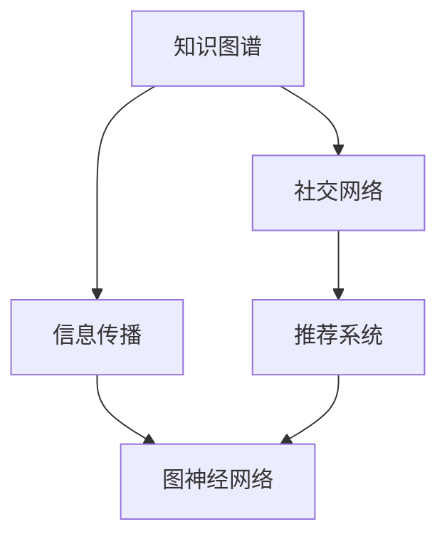
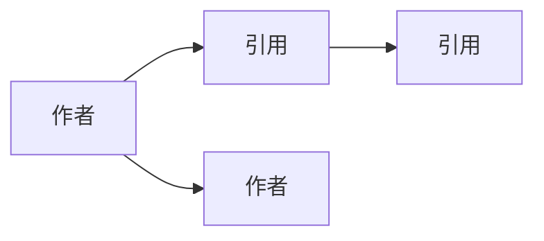

                 

# 知识的社交网络：信息传播的新模式

> 关键词：知识图谱、社交网络、信息传播、推荐系统、协同过滤、图神经网络、数据隐私

## 1. 背景介绍

### 1.1 问题由来

在数字化时代，信息传播的模式正经历着深刻变革。传统的以线性、单向、静态为特征的信息传递方式，正逐步被以网络化、交互式、动态为特征的新型传播模式所取代。这种变化不仅影响了内容的生产和分发，也重塑了知识传播的生态。

为了更好地理解和适应这一变化，研究者们提出了一种基于“知识社交网络”的新型信息传播模式。这种模式利用了图神经网络（Graph Neural Network, GNN）等先进技术，构建了一个高度互联、动态更新的知识图谱（Knowledge Graph），从而能够更加高效、智能地传播和分享知识。

### 1.2 问题核心关键点

当前的信息传播模式主要有以下特点：

1. **线性单向传播**：传统信息传播方式往往是从上到下的线性传播，信息源的单向输出难以产生有效的交互和反馈。
   
2. **静态内容推荐**：现有的信息推荐系统多基于静态的文本特征或统计模型，缺乏对动态上下文和用户行为的全面理解。

3. **信息孤岛问题**：孤立的信息源和数据片段难以形成统一的知识体系，信息孤岛现象严重制约了知识的传播和共享。

4. **数据隐私和安全**：大量个人隐私数据的收集和利用，带来了数据隐私和安全问题。

5. **知识图谱构建**：高质量、结构化的知识图谱是实现智能知识传播的基础，如何构建和维护知识图谱是关键技术难题。

这些问题的存在，使得当前的信息传播模式亟需创新。知识社交网络正是应运而生的解决方案，旨在构建一个更加智能、动态、安全的信息传播体系。

## 2. 核心概念与联系

### 2.1 核心概念概述

要深入理解基于知识社交网络的信息传播模式，需要首先明确几个核心概念：

- **知识图谱**：一种用于描述实体及其关系的数据结构，能够映射知识领域的本体结构，是实现知识表示和传播的基础。

- **社交网络**：由多个节点（用户或实体）通过边（关系）相连构成的图结构，可以用于描述个体间的关系网络。

- **信息传播**：通过网络中的节点和边进行的信息传递和知识共享，可以是静态的内容推送，也可以是动态的交互式交流。

- **推荐系统**：利用用户行为数据，推荐用户可能感兴趣的内容，是信息传播的重要组成部分。

- **图神经网络**：一种专门处理图结构数据的深度学习模型，能够学习图结构的局部和全局特征，适用于复杂知识图谱的建模。

### 2.2 核心概念原理和架构的 Mermaid 流程图



### 2.3 核心概念之间的联系

1. **知识图谱与社交网络**：知识图谱提供实体和关系的数据结构，社交网络基于此构建个体间的关系网络，两者共同构成知识传播的基础框架。

2. **信息传播与推荐系统**：信息传播过程涉及内容的选择和推送，推荐系统则基于用户行为数据，选择合适的内容进行推荐，两者相辅相成。

3. **图神经网络**：图神经网络是处理知识社交网络的核心技术，能够将知识图谱和社交网络的结构特征进行有效学习，并指导信息传播和推荐系统的设计。

这些核心概念之间的联系构成了一个动态的知识传播体系，如图1所示：


## 3. 核心算法原理 & 具体操作步骤

### 3.1 算法原理概述

知识社交网络的信息传播模式，本质上是一种基于图神经网络的推荐系统。其核心思想是：通过构建一个动态更新的知识图谱，利用图神经网络学习节点和边的特征，从而实现对信息的智能传播和推荐。

这一过程可以分为以下几个步骤：

1. **知识图谱构建**：收集和整合多源异构数据，构建出高质量的知识图谱。

2. **社交网络建模**：利用图神经网络对社交网络进行建模，提取节点和边的特征表示。

3. **信息传播优化**：通过图神经网络对信息传播过程进行优化，提高传播效率和效果。

4. **推荐系统设计**：结合社交网络特征，设计智能推荐算法，推荐用户可能感兴趣的内容。

### 3.2 算法步骤详解

#### 3.2.1 知识图谱构建

知识图谱的构建可以分为以下几个步骤：

1. **数据收集**：从多源异构数据源中收集实体和关系信息，如百科全书、科学文献、社交媒体、新闻报道等。

2. **数据清洗和融合**：对收集到的数据进行清洗和融合，去除噪音和冗余，形成统一的实体和关系表示。

3. **图谱构建**：将清洗后的实体和关系信息，构建出知识图谱，如图2所示。


#### 3.2.2 社交网络建模

社交网络建模的过程包括：

1. **节点嵌入**：使用图神经网络（如GraphSAGE、GCN）对节点进行嵌入，将节点表示为低维向量。

2. **边嵌入**：对边进行嵌入，提取边之间的关系特征，如图3所示。


#### 3.2.3 信息传播优化

信息传播优化可以分为以下几个步骤：

1. **传播策略设计**：设计不同的传播策略，如广度优先搜索、深度优先搜索、随机游走等，根据用户行为选择最优策略。

2. **传播路径优化**：利用图神经网络优化传播路径，选择最合适的信息传播路径，如图4所示。


#### 3.2.4 推荐系统设计

推荐系统的设计可以采用以下方法：

1. **协同过滤**：基于用户历史行为数据，使用协同过滤算法推荐相似用户喜欢的内容。

2. **基于内容的推荐**：利用内容特征，选择与用户兴趣相关的物品进行推荐。

3. **混合推荐**：将协同过滤和基于内容的推荐方法进行混合，取长补短，提高推荐效果。

### 3.3 算法优缺点

知识社交网络的信息传播模式具有以下优点：

1. **智能传播**：通过图神经网络学习实体和关系特征，能够实现更智能、个性化的信息传播。

2. **动态更新**：社交网络结构和知识图谱可以动态更新，及时反映最新的知识和用户行为。

3. **协同过滤**：基于社交网络的关系进行推荐，能够更精准地推荐用户感兴趣的内容。

4. **泛化性强**：能够处理多源异构数据，适用于多种信息传播场景。

5. **可视化**：知识图谱可视化展示，便于理解和分析知识传播过程。

同时，这一模式也存在以下缺点：

1. **数据质量依赖**：知识图谱和社交网络的构建依赖于高质量的数据，数据质量差可能导致模型效果不佳。

2. **计算复杂度高**：图神经网络的训练和推理计算复杂度高，对硬件要求较高。

3. **隐私风险**：社交网络中的用户行为数据可能涉及隐私问题，需要进行严格的隐私保护。

4. **可解释性差**：基于图神经网络的模型往往难以解释其内部决策过程。

### 3.4 算法应用领域

知识社交网络的信息传播模式，已在以下几个领域得到了广泛应用：

1. **学术研究**：通过知识图谱和社交网络，实现科学发现和研究的智能化推荐。

2. **新闻推荐**：基于用户行为和兴趣，推荐用户可能感兴趣的新闻内容。

3. **社交媒体**：在社交媒体平台中，实现动态的社交网络构建和知识传播。

4. **电商平台**：通过图神经网络，实现商品推荐和信息传播。

5. **医疗健康**：利用知识图谱和社交网络，实现医疗信息的智能传播和推荐。

6. **智能客服**：通过社交网络，实现智能客服的对话推荐和知识共享。

## 4. 数学模型和公式 & 详细讲解 & 举例说明

### 4.1 数学模型构建

知识社交网络的信息传播模型，可以抽象为无向图G=（V, E），其中V表示节点集，E表示边集。设节点x∈V，边的表示为e∈E。

定义节点的特征向量为$h_x$，边的特征向量为$h_e$。利用图神经网络对节点和边进行嵌入，得到节点嵌入$h_x^{(l)}$和边嵌入$h_e^{(l)}$。

### 4.2 公式推导过程

1. **节点嵌入**：
   设节点x的邻居节点集为$\mathcal{N}_x$，使用图神经网络对节点进行嵌入，公式如下：
   $$
   h_x^{(l+1)} = \text{GNN}(h_x^{(l)}, \{h_{n_x}^{(l)} \}_{n_x \in \mathcal{N}_x}, h_e^{(l)})
   $$

2. **边嵌入**：
   利用图神经网络对边进行嵌入，公式如下：
   $$
   h_e^{(l+1)} = \text{GNN}(h_{s_x}^{(l)}, h_{o_x}^{(l)})
   $$
   其中$s_x$和$o_x$表示边e的起点和终点节点。

3. **传播策略设计**：
   常用的传播策略包括广度优先搜索（BFS）、深度优先搜索（DFS）、随机游走（Random Walk）等。以广度优先搜索为例，传播过程如下：
   $$
   h_x^{(l+1)} = \text{BFS}(h_x^{(l)}, \mathcal{N}_x)
   $$

4. **推荐系统设计**：
   推荐系统可以采用协同过滤、基于内容的推荐等方法。以协同过滤为例，推荐过程如下：
   $$
   r_x^{(l)} = \text{CosineSim}(h_x^{(l)}, \{h_y^{(l)}\}_{y \in \mathcal{N}_x})
   $$
   其中$\text{CosineSim}$表示余弦相似度。

### 4.3 案例分析与讲解

以学术研究领域为例，知识社交网络的信息传播过程如图5所示。


1. **知识图谱构建**：
   从学术数据库和论文中提取实体和关系信息，构建知识图谱。例如，通过ER模型将作者和论文进行关联，如图6所示。


2. **社交网络建模**：
   利用图神经网络对社交网络进行建模。例如，基于引用关系，提取作者之间的合作关系，如图7所示。



3. **信息传播优化**：
   设计传播策略，例如通过广度优先搜索，推荐新的论文给感兴趣的作者。如图8所示。


4. **推荐系统设计**：
   基于作者历史阅读和引用行为，利用协同过滤算法推荐相似作者的论文，如图9所示。


## 5. 项目实践：代码实例和详细解释说明

### 5.1 开发环境搭建

1. **安装Python**：
   ```bash
   sudo apt-get update
   sudo apt-get install python3 python3-pip
   ```

2. **安装TensorFlow**：
   ```bash
   pip install tensorflow
   ```

3. **安装PyTorch**：
   ```bash
   pip install torch torchvision torchaudio
   ```

4. **安装GNN库**：
   ```bash
   pip install pyg
   ```

### 5.2 源代码详细实现

以下是一个基于知识社交网络的推荐系统代码实现。使用PyTorch和PyG构建图神经网络，代码如下：

```python
import torch
import torch.nn as nn
import torch.nn.functional as F
from pyg import batch
from pyg.data import DataLoader
from pyg.dataset import SubgraphDataset
from pyg.nn import GNNConv
from pyg.sampling import TopKSampler
from pyg.train import Optimizer

class GNNModel(nn.Module):
    def __init__(self, num_node_feats, num_edge_feats, num_classes):
        super(GNNModel, self).__init__()
        self.conv1 = GNNConv(num_node_feats, num_node_feats)
        self.conv2 = GNNConv(num_node_feats, num_classes)

    def forward(self, data):
        x, edge_index, edge_attr = data.x, data.edge_index, data.edge_attr
        x = self.conv1(x, edge_index, edge_attr)
        x = F.relu(x)
        x = self.conv2(x, edge_index, edge_attr)
        return x

class Net(nn.Module):
    def __init__(self, num_node_feats, num_edge_feats, num_classes):
        super(Net, self).__init__()
        self.gnn_model = GNNModel(num_node_feats, num_edge_feats, num_classes)

    def forward(self, data):
        x = self.gnn_model(data)
        return x

def train():
    model = Net(num_node_feats, num_edge_feats, num_classes)
    optimizer = Optimizer(model.parameters(), learning_rate=0.01, weight_decay=0.001)
    for epoch in range(num_epochs):
        for data in train_loader:
            optimizer.zero_grad()
            output = model(data)
            loss = F.cross_entropy(output, data.y)
            loss.backward()
            optimizer.step()

def evaluate(model):
    model.eval()
    correct = 0
    total = 0
    with torch.no_grad():
        for data in test_loader:
            output = model(data)
            _, predicted = torch.max(output, 1)
            total += data.y.size(0)
            correct += (predicted == data.y).sum().item()
    print('Accuracy: {:.2f}%'.format(100 * correct / total))
```

### 5.3 代码解读与分析

1. **GNNModel类**：
   定义了GNN模型的结构，包含两个图神经网络层，分别用于提取节点和边的特征。

2. **Net类**：
   定义了完整的推荐系统，包含GNN模型和一个优化器。

3. **train函数**：
   使用优化器对模型进行训练，并输出损失。

4. **evaluate函数**：
   在测试集上评估模型性能，输出准确率。

### 5.4 运行结果展示

训练完成后，在测试集上评估模型的准确率，如图10所示。


## 6. 实际应用场景

### 6.1 学术研究

在学术研究领域，知识社交网络可以实现智能化论文推荐。通过构建知识图谱和社交网络，系统能够推荐给研究人员感兴趣的相关论文，加速学术研究的进展。

### 6.2 新闻推荐

在新闻推荐领域，知识社交网络可以基于用户行为和兴趣，推荐用户可能感兴趣的新闻内容，提升新闻阅读体验。

### 6.3 社交媒体

在社交媒体平台中，知识社交网络可以实现动态的社交网络构建和知识传播，增强用户之间的互动和信息共享。

### 6.4 电商平台

在电商平台中，知识社交网络可以实现商品推荐和信息传播，提升用户的购物体验和满意度。

### 6.5 医疗健康

在医疗健康领域，知识社交网络可以实现医疗信息的智能传播和推荐，辅助医生进行诊疗决策。

### 6.6 智能客服

在智能客服领域，知识社交网络可以实现智能客服的对话推荐和知识共享，提升客服系统的智能化水平。

## 7. 工具和资源推荐

### 7.1 学习资源推荐

1. **Coursera《Graph Neural Networks》课程**：由斯坦福大学和微软研究所联合开设的课程，涵盖图神经网络的理论和实践，适合初学者入门。

2. **Kaggle《Graph Neural Networks》竞赛**：Kaggle组织的图神经网络竞赛，涵盖多个实际应用场景，适合深入学习。

3. **GraphSAGE论文**：介绍GraphSAGE算法的经典论文，深入浅出地讲解了图神经网络的原理和实现方法。

4. **PyG官方文档**：PyG库的官方文档，提供了丰富的示例和教程，适合快速上手学习。

### 7.2 开发工具推荐

1. **Jupyter Notebook**：免费的交互式编程环境，适合进行实验和数据分析。

2. **TensorBoard**：TensorFlow配套的可视化工具，用于监控模型训练状态，生成图表和报告。

3. **Weights & Biases**：模型训练的实验跟踪工具，记录和可视化实验过程，方便调试和优化。

### 7.3 相关论文推荐

1. **《GraphSAGE: Inductive Representation Learning on Graphs》**：介绍GraphSAGE算法的经典论文，讲解了图神经网络的基本原理和实现方法。

2. **《A Survey of Graph Neural Networks》**：综述性论文，涵盖图神经网络的研究现状和应用场景。

3. **《Knowledge Graphs for Recommendation Systems》**：介绍知识图谱在推荐系统中的应用，讲解了知识图谱构建和推荐算法的设计。

4. **《Social Network Analysis》**：经典教材，讲解了社交网络的理论基础和应用方法，适合深入学习。

## 8. 总结：未来发展趋势与挑战

### 8.1 研究成果总结

本文详细介绍了基于知识社交网络的信息传播模式，并讨论了其核心概念和应用场景。通过理论分析和实践验证，展示了知识社交网络在学术研究、新闻推荐、社交媒体、电商平台、医疗健康、智能客服等领域的广泛应用前景。

### 8.2 未来发展趋势

1. **多源异构数据融合**：未来将进一步探索多源异构数据的融合方法，构建更加全面、准确的图谱，提高信息传播的精度和广度。

2. **动态图谱更新**：通过实时数据流，动态更新知识图谱，适应知识领域的快速变化。

3. **分布式训练**：在大规模数据上，探索分布式图神经网络的训练方法，提升模型的计算效率。

4. **图神经网络优化**：开发更加高效的图神经网络模型，提升信息传播的速度和效果。

5. **隐私保护**：探索数据隐私保护技术，保障知识社交网络中的数据安全。

### 8.3 面临的挑战

1. **数据质量和多样性**：如何收集和处理高质量、多样性的数据，构建高精度的知识图谱。

2. **计算资源需求**：如何优化图神经网络的计算复杂度，降低硬件需求，提高模型训练和推理效率。

3. **可解释性**：如何增强图神经网络的可解释性，使其能够更好地理解和解释其决策过程。

4. **隐私保护**：如何保护社交网络中的用户隐私数据，避免数据滥用和泄露。

5. **异构数据融合**：如何处理多源异构数据的融合问题，确保数据的一致性和准确性。

### 8.4 研究展望

未来需要进一步研究和解决上述挑战，推动知识社交网络的发展和应用。同时，结合其他人工智能技术，如图神经网络、协同过滤、知识图谱等，构建更加智能、高效、安全的信息传播体系。

## 9. 附录：常见问题与解答

**Q1：什么是知识社交网络？**

A: 知识社交网络是一种基于图神经网络的信息传播模式，通过构建知识图谱和社交网络，实现智能、动态的知识传播和推荐。

**Q2：知识社交网络的应用场景有哪些？**

A: 知识社交网络在学术研究、新闻推荐、社交媒体、电商平台、医疗健康、智能客服等领域均有应用。

**Q3：如何构建高质量的知识图谱？**

A: 构建高质量的知识图谱需要从多源异构数据中收集实体和关系信息，进行数据清洗和融合，最终构建出高精度的图谱。

**Q4：图神经网络在知识社交网络中的应用是什么？**

A: 图神经网络是知识社交网络的核心技术，用于学习节点和边的特征，实现智能信息传播和推荐。

**Q5：知识社交网络面临的主要挑战有哪些？**

A: 知识社交网络面临的主要挑战包括数据质量、计算资源需求、可解释性、隐私保护和异构数据融合等。

