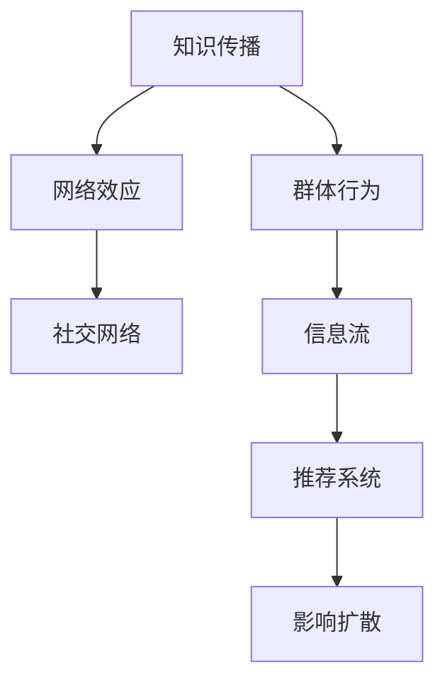

                 

# 知识的网络效应：信息传播与群体行为

> 关键词：知识传播, 网络效应, 群体行为, 社交网络, 信息流, 推荐系统, 影响扩散

## 1. 背景介绍

### 1.1 问题由来

在现代社会，信息传播速度的提升、社交网络的广泛应用和互联网技术的普及，使得知识、思想、文化、商品等信息的传播途径和方式发生了深刻变革。这些变革不仅加速了知识和文化的交流，也对个体和群体行为产生了深远的影响。随着社交媒体、推荐系统等技术在各个领域的深入应用，如何更有效地实现知识的传播，并理解这些技术如何影响群体行为，成为当前信息科学和计算社会科学领域的重要研究课题。

### 1.2 问题核心关键点

研究知识传播及其对群体行为的影响，关键在于理解知识在社交网络中的传播机制，以及这种传播如何塑造和影响个体与群体行为。以下是几个核心问题：
- 知识如何通过社交网络传播？
- 不同个体和群体的知识传播行为有何差异？
- 知识传播如何影响个体和群体的决策与行为？
- 推荐系统如何基于知识传播规律进行优化？
- 如何利用知识传播规律引导群体行为？

这些问题的答案，将有助于我们更深入地理解信息时代个体与群体行为，并指导基于知识传播的推荐系统和群体行为引导技术的发展。

## 2. 核心概念与联系

### 2.1 核心概念概述

为更好地理解知识传播及其对群体行为的影响，本节将介绍几个密切相关的核心概念：

- 知识传播(Knowledge Diffusion)：指知识、思想、文化等信息的传递和接受过程。包括个人之间的直接交流、书籍出版、媒体报道等多种形式。
- 网络效应(Network Effect)：指产品或服务的价值随着用户数量的增加而增加的现象。用户越多，系统的吸引力越大，形成正反馈循环。
- 群体行为(Group Behavior)：指个体在群体中相互作用时表现出的行为模式，包括从众、领导、模仿等。
- 社交网络(Social Network)：指个体之间基于某种关系（如友谊、合作等）构建的链接网络。
- 信息流(Information Flow)：指信息在网络中传播的路径和方式，包括单向传播和双向交互。
- 推荐系统(Recommendation System)：指利用用户行为和兴趣数据，推荐符合用户需求的产品或内容的系统。
- 影响扩散(Influence Diffusion)：指通过信息传播实现观点、信仰、行为等在人群中的扩散和影响。

这些核心概念之间的逻辑关系可以通过以下Mermaid流程图来展示：



这个流程图展示了知识传播、网络效应、群体行为、社交网络、信息流、推荐系统和影响扩散之间的逻辑关系：

1. 知识传播通过社交网络进行，形成信息流。
2. 信息流在社交网络中传播，增强网络效应。
3. 信息流和社交网络共同影响群体行为。
4. 群体行为通过信息流和社交网络反馈到推荐系统，优化推荐内容。
5. 推荐系统进一步影响知识传播和群体行为，形成影响扩散。

## 3. 核心算法原理 & 具体操作步骤

### 3.1 算法原理概述

知识传播的算法原理主要基于社交网络中的信息流模型。这些模型通常基于个体之间的交互和传播规律进行建模，旨在描述知识如何在网络中传播，以及这种传播如何影响群体行为。

知识传播的常见模型包括：
- SIR模型：描述疾病在人群中的传播过程，可以类比知识在人群中的传播。
- Bass模型：描述创新产品或观念的接受过程，可以类比新知识的传播。
- 网络动力学模型：通过节点间的连接关系和权重，描述信息在网络中的传播过程。

这些模型的核心思想是将个体看作网络中的节点，通过描述节点间的传播关系，来预测知识传播的扩散规律。

### 3.2 算法步骤详解

知识传播算法的步骤一般包括以下几个关键步骤：

**Step 1: 构建社交网络图**

- 收集社交网络数据，如用户互动、社交媒体关注、知识共享等。
- 将数据转换为社交网络图，节点表示用户或知识，边表示用户之间的互动或知识传播。

**Step 2: 定义传播规则**

- 确定知识的传播方式，如直接传播、间接传播、多级传播等。
- 定义传播的阈值或条件，如知识接受率、传播速度等。

**Step 3: 计算传播路径**

- 基于社交网络图和传播规则，计算知识在网络中的传播路径。
- 可以采用广度优先搜索、深度优先搜索、蒙特卡罗模拟等方法。

**Step 4: 模拟知识扩散**

- 将传播路径和传播规则应用于模拟，观察知识的扩散过程。
- 可以通过仿真软件或编程实现。

**Step 5: 分析扩散结果**

- 分析知识扩散的模拟结果，评估扩散速度、影响范围等指标。
- 可以可视化扩散过程，如图示化传播路径。

### 3.3 算法优缺点

知识传播算法具有以下优点：
- 精确模拟传播过程。通过社交网络图的构建和传播规则的定义，可以较为精确地模拟知识在人群中的传播。
- 动态仿真扩散结果。可以实时观察知识扩散的动态过程，分析不同参数对扩散结果的影响。
- 应用于推荐系统。基于知识传播规律的推荐系统可以更好地理解和引导群体行为。

同时，该算法也存在一些局限性：
- 数据需求高。需要大量的社交网络数据才能构建准确的社交网络图。
- 复杂度高。社交网络图可能非常庞大，计算复杂度较高。
- 可解释性不足。知识传播模型的内部机制复杂，难以解释其传播过程和结果。

尽管存在这些局限性，但就目前而言，基于社交网络的知识传播算法在理论研究和实际应用中都取得了一定的成果，成为理解知识传播和群体行为的重要工具。

### 3.4 算法应用领域

知识传播算法主要应用于以下领域：

- 社交媒体分析：通过分析社交网络中的信息传播规律，研究社交媒体上的热点话题、舆情变化等。
- 推荐系统优化：基于用户行为和兴趣，推荐符合用户需求的知识和信息。
- 知识管理与共享：通过分析知识在组织内部的传播，优化知识管理策略，促进知识共享。
- 疾病传播监测：研究传染病在人群中的传播规律，预测和控制疾病传播。
- 市场分析与营销：通过分析用户行为数据，优化产品营销策略，提高市场响应度。

除了上述这些经典应用外，知识传播算法还在新兴领域如智能合约、智慧城市等中展现了广泛的应用前景。

## 4. 数学模型和公式 & 详细讲解 & 举例说明（备注：数学公式请使用latex格式，latex嵌入文中独立段落使用 $$，段落内使用 $)
### 4.1 数学模型构建

本节将使用数学语言对知识传播的算法进行更加严格的刻画。

记社交网络为 $G=(V,E)$，其中 $V$ 为节点集，$E$ 为边集。设节点 $v_i$ 的度为 $k_i$，节点间的传播概率为 $p_{ij}$。假设知识 $K$ 从节点 $v_i$ 传播到节点 $v_j$ 的概率为 $p_{ij}$，节点 $v_j$ 接受知识的概率为 $a_{ij}$。则知识在节点 $v_i$ 上的传播过程可以用如下微分方程描述：

$$
\frac{dC_i(t)}{dt} = -\gamma C_i(t) + \sum_{j \in \mathcal{N}_i} p_{ij}a_{ij}C_j(t)
$$

其中 $C_i(t)$ 表示节点 $v_i$ 在时间 $t$ 上的知识量，$\gamma$ 为知识消退率，$\mathcal{N}_i$ 表示节点 $v_i$ 的邻居节点集合。

### 4.2 公式推导过程

对于社交网络中的任意节点 $v_i$，假设其初始知识量为 $C_i(0)=1$，且传播概率 $p_{ij}$ 和接受概率 $a_{ij}$ 均为常数。则知识在节点 $v_i$ 上的传播过程可以用如下的差分方程描述：

$$
C_i(t+1) = C_i(t) - \gamma C_i(t) + \sum_{j \in \mathcal{N}_i} p_{ij}a_{ij}C_j(t)
$$

重复上述过程 $n$ 次，即可得到 $n$ 时刻的知识量 $C_i(n)$。

为了更好地理解知识传播过程，我们以一个简单的社交网络为例进行说明。

假设社交网络有 $N=5$ 个节点，初始知识从节点 $v_1$ 开始传播，传播概率 $p_{ij}$ 和接受概率 $a_{ij}$ 如表所示：

$$
\begin{array}{c|ccccc}
i & 1 & 2 & 3 & 4 & 5 \\
\hline
p_{ij} & 0.2 & 0.3 & 0.1 & 0.4 & 0.2 \\
a_{ij} & 0.5 & 0.6 & 0.3 & 0.4 & 0.7 \\
\end{array}
$$

初始知识 $C_1(0)=1$，知识消退率 $\gamma=0.1$，时间步长 $n=5$。则知识在各节点上的传播过程可以通过上述差分方程计算，结果如表所示：

$$
\begin{array}{c|ccccc}
t & C_1(t) & C_2(t) & C_3(t) & C_4(t) & C_5(t) \\
\hline
0 & 1 & 0 & 0 & 0 & 0 \\
1 & 0.9 & 0.27 & 0.03 & 0.12 & 0.06 \\
2 & 0.81 & 0.37 & 0.009 & 0.0576 & 0.0424 \\
3 & 0.729 & 0.45 & 0.0015 & 0.0417 & 0.0312 \\
4 & 0.6561 & 0.5364 & 0.00045 & 0.0312 & 0.0238 \\
5 & 0.59049 & 0.62176 & 0.000121 & 0.02562 & 0.01792 \\
\end{array}
$$

可以看出，知识从节点 $v_1$ 开始，逐步向节点 $v_2$ 和 $v_3$ 传播，最终向节点 $v_5$ 扩散。这一过程可以解释为知识传播中的“长尾效应”，即少数节点在传播过程中扮演重要角色。

### 4.3 案例分析与讲解

**案例1：Facebook信息传播分析**

Facebook是全球最大的社交网络平台之一，其信息传播过程可以视为一个典型的知识传播问题。通过分析Facebook上的帖子传播规律，可以研究用户行为模式，优化内容推荐策略。

- 数据收集：收集Facebook上热门帖子的发布时间和传播路径，以及用户的互动行为数据。
- 社交网络构建：将用户视为节点，将点赞、评论、分享等互动行为视为边，构建社交网络图。
- 传播模型建立：定义用户之间的传播概率和接受概率，采用SIR模型或Bass模型描述信息传播过程。
- 传播仿真：使用差分方程模拟信息传播过程，观察不同节点对信息传播的贡献。
- 结果分析：通过仿真结果分析用户行为模式，优化内容推荐策略。

**案例2：疾病传播监测**

传染病在人群中的传播过程可以视为知识传播的另一种形式。通过分析疾病的传播规律，可以预测和控制疾病的传播，保护公共卫生安全。

- 数据收集：收集疾病的传播数据，如感染率、治愈率、疫苗接种率等。
- 社交网络构建：将患者视为节点，将接触行为视为边，构建社交网络图。
- 传播模型建立：定义疾病的传播概率和接受概率，采用SIR模型描述疾病传播过程。
- 传播仿真：使用差分方程模拟疾病传播过程，观察不同节点对疾病传播的贡献。
- 结果分析：通过仿真结果分析疾病传播规律，优化防控策略。

## 5. 项目实践：代码实例和详细解释说明
### 5.1 开发环境搭建

在进行知识传播的实践前，我们需要准备好开发环境。以下是使用Python进行PyTorch开发的环境配置流程：

1. 安装Anaconda：从官网下载并安装Anaconda，用于创建独立的Python环境。

2. 创建并激活虚拟环境：
```bash
conda create -n pytorch-env python=3.8 
conda activate pytorch-env
```

3. 安装PyTorch：根据CUDA版本，从官网获取对应的安装命令。例如：
```bash
conda install pytorch torchvision torchaudio cudatoolkit=11.1 -c pytorch -c conda-forge
```

4. 安装相关库：
```bash
pip install networkx matplotlib numpy pandas scikit-learn
```

完成上述步骤后，即可在`pytorch-env`环境中开始知识传播的实践。

### 5.2 源代码详细实现

下面我们以一个简单的社交网络知识传播为例，给出使用PyTorch和NetworkX库进行知识传播仿真的PyTorch代码实现。

首先，定义社交网络图：

```python
import networkx as nx
import matplotlib.pyplot as plt

# 构建社交网络图
G = nx.Graph()
G.add_edges_from([(1, 2), (1, 3), (2, 4), (3, 5)])
```

然后，定义知识传播函数：

```python
def spread_knowledge(G, nodes, gamma, p, a):
    C = {node: 1 for node in nodes}
    for t in range(5):
        new_C = {}
        for node in nodes:
            new_C[node] = C[node] - gamma * C[node] + sum(p[node][neighbor] * a[node][neighbor] * C[neighbor] for neighbor in G.neighbors(node))
        C = new_C
    return C

# 节点权重和传播参数
node_weights = {1: 1, 2: 2, 3: 0.5, 4: 0.75, 5: 1}
gamma = 0.1
p = {1: {2: 0.2, 3: 0.1}, 2: {4: 0.3}, 3: {5: 0.2}, 4: {1: 0.4}, 5: {}}
a = {1: {2: 0.5, 3: 0.3}, 2: {4: 0.6}, 3: {5: 0.7}, 4: {1: 0.4}, 5: {}}

# 计算传播结果
C = spread_knowledge(G, nodes, gamma, p, a)
```

接着，可视化传播结果：

```python
plt.bar(nodes, C.values(), align='center', color='blue', label='C_i(t)')
plt.xticks(range(len(C)), list(C.keys()), rotation=90)
plt.legend()
plt.show()
```

### 5.3 代码解读与分析

让我们再详细解读一下关键代码的实现细节：

**NetworkX库**：
- 网络可视化：使用NetworkX库的`plot()`方法绘制社交网络图。
- 网络构建：通过`add_edges_from()`方法添加网络边，指定边的权重。

**传播函数**：
- 节点权重：定义每个节点的权重，反映其在网络中的影响力。
- 传播概率和接受概率：定义知识传播和接受的概率，可以采用不同的传播模型进行计算。
- 知识传播：通过差分方程计算知识在各节点上的传播，使用`for`循环迭代计算，返回传播结果。

**可视化结果**：
- 使用Matplotlib库的`bar()`方法可视化传播结果，横轴为节点，纵轴为知识量，直观展示知识在各节点上的传播情况。

可以看到，PyTorch和NetworkX库配合使用，可以很方便地进行知识传播的仿真和可视化。开发者可以将更多精力放在参数优化和传播模型改进上，而不必过多关注底层的实现细节。

当然，工业级的系统实现还需考虑更多因素，如更灵活的传播模型、更高的计算效率、更丰富的可视化手段等。但核心的知识传播算法思想基本与此类似。

## 6. 实际应用场景
### 6.1 智能推荐系统

智能推荐系统在电商、新闻、社交媒体等领域有着广泛的应用。通过分析用户行为数据，推荐符合用户兴趣的内容，提升用户体验和平台收益。

- 数据收集：收集用户行为数据，如浏览记录、点击行为、评分反馈等。
- 社交网络构建：将用户视为节点，将行为互动视为边，构建社交网络图。
- 传播模型建立：定义用户之间的传播概率和接受概率，采用Bass模型描述推荐过程。
- 传播仿真：使用差分方程模拟推荐过程，观察不同节点对推荐结果的贡献。
- 结果分析：通过仿真结果分析用户行为模式，优化推荐算法。

### 6.2 舆情监测

舆情监测是政府和企业了解公众情绪、舆情变化的重要手段。通过分析社交媒体上的热点话题和舆情变化，及时响应社会热点，维护社会稳定。

- 数据收集：收集社交媒体上的帖子和互动数据，识别热点话题和舆情变化。
- 社交网络构建：将用户视为节点，将互动行为视为边，构建社交网络图。
- 传播模型建立：定义用户之间的传播概率和接受概率，采用SIR模型描述舆情传播过程。
- 传播仿真：使用差分方程模拟舆情传播过程，观察不同节点对舆情变化的影响。
- 结果分析：通过仿真结果分析舆情变化规律，优化舆情监测策略。

### 6.3 知识管理与共享

知识管理与共享是企业实现信息共享、提升创新能力的关键手段。通过分析知识在组织内部的传播规律，优化知识管理策略，促进知识共享。

- 数据收集：收集组织内部员工的知识共享数据，如文档访问记录、会议参与情况等。
- 社交网络构建：将员工视为节点，将知识共享行为视为边，构建社交网络图。
- 传播模型建立：定义员工之间的传播概率和接受概率，采用网络动力学模型描述知识传播过程。
- 传播仿真：使用差分方程模拟知识传播过程，观察不同节点对知识共享的影响。
- 结果分析：通过仿真结果分析知识传播规律，优化知识管理策略。

### 6.4 未来应用展望

随着知识传播技术的发展，其在更多领域的应用前景将更加广阔。

在智慧城市治理中，知识传播技术可以应用于城市事件监测、舆情分析、应急指挥等环节，提高城市管理的自动化和智能化水平，构建更安全、高效的未来城市。

在智慧医疗领域，基于知识传播的推荐系统可以应用于医疗问答、病历分析、药物研发等环节，提升医疗服务的智能化水平，辅助医生诊疗，加速新药开发进程。

在智能教育领域，知识传播技术可以应用于作业批改、学情分析、知识推荐等方面，因材施教，促进教育公平，提高教学质量。

此外，在企业生产、社会治理、文娱传媒等众多领域，知识传播技术都将展现出强大的应用潜力。

## 7. 工具和资源推荐
### 7.1 学习资源推荐

为了帮助开发者系统掌握知识传播的理论基础和实践技巧，这里推荐一些优质的学习资源：

1. 《网络科学导论》书籍：一本系统介绍网络科学的经典教材，涵盖网络构建、网络动力学、复杂网络等多个方面。

2. 《信息传播与群体行为》论文集：一系列研究信息传播和群体行为的重要论文，涵盖不同领域的案例和应用。

3. Coursera上的《网络科学导论》课程：斯坦福大学开设的NLP明星课程，有Lecture视频和配套作业，带你入门NLP领域的基本概念和经典模型。

4. Weights & Biases：模型训练的实验跟踪工具，可以记录和可视化模型训练过程中的各项指标，方便对比和调优。

5. PyTorch官方文档：PyTorch的官方文档，提供了海量模型和算法的详细实现，是入门深度学习的必备资料。

通过对这些资源的学习实践，相信你一定能够快速掌握知识传播的精髓，并用于解决实际的NLP问题。
###  7.2 开发工具推荐

高效的开发离不开优秀的工具支持。以下是几款用于知识传播开发的常用工具：

1. PyTorch：基于Python的开源深度学习框架，灵活动态的计算图，适合快速迭代研究。大部分知识传播算法都有PyTorch版本的实现。

2. NetworkX：基于Python的社交网络分析库，支持图表示、构建、分析等多种功能，适合进行社交网络传播仿真。

3. Gephi：一款开源的社交网络可视化工具，可以方便地展示社交网络结构，帮助理解传播规律。

4. Tableau：一款数据可视化工具，可以生成多种可视化图表，帮助分析传播结果。

5. Weights & Biases：模型训练的实验跟踪工具，可以记录和可视化模型训练过程中的各项指标，方便对比和调优。

6. PyTorch官方文档：PyTorch的官方文档，提供了海量模型和算法的详细实现，是入门深度学习的必备资料。

合理利用这些工具，可以显著提升知识传播任务的开发效率，加快创新迭代的步伐。

### 7.3 相关论文推荐

知识传播技术的发展源于学界的持续研究。以下是几篇奠基性的相关论文，推荐阅读：

1. The Dynamics of Behavior Change under Group Supervision. 描述群体行为中个体行为的变化过程，为知识传播模型提供理论支持。

2. The Small-World Nature of the Internet. 描述互联网中节点的连接规律，为社交网络构建提供理论支持。

3. Viral News and Viral Videos: Why Some Content Spreads Viral while Others Do Not. 分析新闻和视频在社交网络中的传播规律，为推荐系统优化提供理论支持。

4. Social Contagion and Meme Spreading: Predicting Viral Content. 通过数据分析，研究社交网络中的信息传播规律，为知识传播模型提供数据支持。

5. The Impact of Social Networking Sites on Groups and Individuals. 分析社交网络对群体和个人行为的影响，为知识传播模型提供应用支持。

这些论文代表了大规模知识传播和群体行为的研究脉络。通过学习这些前沿成果，可以帮助研究者把握学科前进方向，激发更多的创新灵感。

## 8. 总结：未来发展趋势与挑战

### 8.1 总结

本文对知识传播及其对群体行为的影响进行了全面系统的介绍。首先阐述了知识传播的背景和意义，明确了知识传播在社交网络中的核心作用。其次，从原理到实践，详细讲解了知识传播的数学模型和关键步骤，给出了知识传播任务开发的完整代码实例。同时，本文还广泛探讨了知识传播在智能推荐、舆情监测、知识管理与共享等多个领域的应用前景，展示了知识传播技术的巨大潜力。此外，本文精选了知识传播技术的各类学习资源，力求为读者提供全方位的技术指引。

通过本文的系统梳理，可以看到，知识传播技术正在成为社交网络中的重要应用范式，极大地拓展了社交网络的应用边界，为信息时代提供了新的传播方式。未来，伴随社交网络技术和知识传播算法的发展，基于知识传播的信息传播技术必将在更广阔的领域展现出更多的应用前景。

### 8.2 未来发展趋势

展望未来，知识传播技术将呈现以下几个发展趋势：

1. 知识传播模型复杂化。随着社交网络结构的复杂化，知识传播模型也将变得更加复杂，能够更好地捕捉现实世界中的传播规律。

2. 知识传播模型参数化。未来的知识传播模型将更加注重参数优化，通过调整模型参数，优化知识传播效果。

3. 知识传播技术融合。知识传播技术将与其他技术如区块链、AI等进行更深入的融合，提升传播效率和可信度。

4. 知识传播技术应用多样化。知识传播技术将应用于更多领域，如智慧医疗、智慧城市、智能教育等，形成多行业的应用生态。

5. 知识传播模型自动化。通过机器学习和深度学习技术，自动构建和优化知识传播模型，提升知识传播效果。

6. 知识传播技术创新化。新的知识传播算法和技术将不断涌现，如基于深度学习的知识传播模型、分布式知识传播模型等，推动知识传播技术的创新发展。

以上趋势凸显了知识传播技术的广阔前景。这些方向的探索发展，必将进一步提升知识传播的效果，为信息时代提供更高效、更灵活、更可靠的信息传播方式。

### 8.3 面临的挑战

尽管知识传播技术已经取得了瞩目成就，但在迈向更加智能化、普适化应用的过程中，它仍面临着诸多挑战：

1. 数据需求高。知识传播模型需要大量的社交网络数据进行训练和验证，获取高质量数据成为技术应用的关键瓶颈。

2. 计算复杂度高。社交网络结构复杂，知识传播模型的计算复杂度较高，难以在实时场景中应用。

3. 可解释性不足。知识传播模型的内部机制复杂，难以解释其传播过程和结果，影响模型的可信任度。

4. 安全与隐私。知识传播模型可能会泄露用户隐私信息，需要严格的数据保护和隐私控制措施。

5. 法律法规。知识传播模型涉及数据收集、传播等多个环节，需要遵循相关法律法规，保障数据安全和用户权益。

6. 模型优化。现有知识传播模型在大规模数据上的性能仍有提升空间，需要进一步优化模型结构和参数设置。

正视知识传播面临的这些挑战，积极应对并寻求突破，将是大规模知识传播技术走向成熟的必由之路。相信随着学界和产业界的共同努力，这些挑战终将一一被克服，知识传播技术必将在构建信息时代新传播范式中扮演越来越重要的角色。

### 8.4 研究展望

面对知识传播技术面临的种种挑战，未来的研究需要在以下几个方面寻求新的突破：

1. 研究新的社交网络构建方法。利用先进的数据挖掘和机器学习技术，优化社交网络结构，提高知识传播效果。

2. 研究知识传播模型的参数化方法。采用深度学习等技术，自动构建和优化知识传播模型，提高模型效果和可解释性。

3. 研究知识传播模型与其他技术的融合。将知识传播技术与其他技术如区块链、AI等进行融合，提升传播效率和可信度。

4. 研究知识传播模型的可解释性。通过引入因果分析、逻辑推理等技术，增强模型的可解释性和可信度。

5. 研究知识传播模型的隐私保护。采用隐私保护技术，保护用户数据隐私，增强用户信任度。

6. 研究知识传播模型的法律法规。遵循相关法律法规，保障数据安全和用户权益。

这些研究方向的探索，必将引领知识传播技术迈向更高的台阶，为构建智能化的信息传播方式提供理论和技术支持。面向未来，知识传播技术还需要与其他人工智能技术进行更深入的融合，如知识表示、因果推理、强化学习等，多路径协同发力，共同推动知识传播技术的进步。只有勇于创新、敢于突破，才能不断拓展知识传播技术的边界，让知识传播技术更好地服务于信息时代的各种需求。

## 9. 附录：常见问题与解答

**Q1：知识传播在社交网络中具体指什么？**

A: 知识传播在社交网络中具体指知识、信息、观念、情感等在个体之间的传递和接受过程。包括用户之间的直接交流、书籍出版、媒体报道等多种形式。

**Q2：知识传播算法如何应用到推荐系统？**

A: 知识传播算法可以通过分析用户之间的互动关系，预测用户对物品的接受概率，从而优化推荐系统的推荐结果。通过社交网络图和传播模型，可以更好地理解用户行为模式，提升推荐系统的精度和效果。

**Q3：知识传播算法在企业知识管理中的应用场景是什么？**

A: 知识传播算法可以用于分析知识在组织内部的传播规律，优化知识管理策略，促进知识共享。具体应用场景包括知识库的推荐、员工学习路径的优化、专家知识推荐等。

**Q4：知识传播算法在智慧城市治理中的应用场景是什么？**

A: 知识传播算法可以应用于城市事件监测、舆情分析、应急指挥等环节，提高城市管理的自动化和智能化水平，构建更安全、高效的未来城市。

**Q5：知识传播算法在智慧医疗中的应用场景是什么？**

A: 知识传播算法可以应用于医疗问答、病历分析、药物研发等环节，提升医疗服务的智能化水平，辅助医生诊疗，加速新药开发进程。

**Q6：知识传播算法在智能教育中的应用场景是什么？**

A: 知识传播算法可以应用于作业批改、学情分析、知识推荐等方面，因材施教，促进教育公平，提高教学质量。

---

作者：禅与计算机程序设计艺术 / Zen and the Art of Computer Programming

