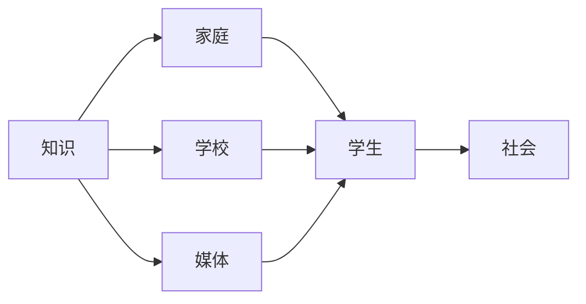

                 

# 知识的跨代传递：教育体系的演进

在人类文明的长河中，教育始终是知识传承的桥梁。从古至今，教育体系经历了多次变革，逐步演进到如今信息时代的多元化、个性化、终身化学习形态。本文将探讨教育体系的演进过程，分析其背后的驱动因素，并展望未来教育体系的发展趋势。

## 1. 背景介绍

### 1.1 教育体系的简史
教育是人类文明发展的重要推动力。从原始社会的口耳相传，到农耕文明的书面记录，再到工业革命后的公立学校系统，教育体系不断发展，逐渐形成了系统化的教育机构和制度。

### 1.2 传统教育体系的弊端
传统的教育体系以“一刀切”的教学方式为主，注重理论知识的传授，忽略了学生的个性差异和实际应用能力的培养。这种单一化的教育模式，难以激发学生的学习兴趣和创新能力，也无法适应快速变化的社会需求。

## 2. 核心概念与联系

### 2.1 核心概念概述
- **知识传递**：指将已有知识从一代人传递给另一代人的过程。
- **教育体系**：由教育机构、教学内容、教学方法等组成，负责培养下一代的知识体系。
- **跨代传递**：指知识跨越多个年代，通过不同方式传递，包括家庭、学校、媒体等。
- **知识创新**：指知识在传递过程中不断创新和发展，形成新的知识体系。

### 2.2 核心概念原理和架构的 Mermaid 流程图



该图展示了知识通过多种渠道传递给学生的全过程。知识从家庭、学校、媒体等多个来源传递给学生，最终学生将其应用于社会，形成新的知识体系。

## 3. 核心算法原理 & 具体操作步骤

### 3.1 算法原理概述
知识传递的算法原理可以概括为：通过多样化的教育渠道，将已有知识传递给学生，并在传递过程中不断创新，形成新的知识体系。

### 3.2 算法步骤详解
1. **知识收集与整理**：从历史文献、研究成果、实际应用中收集知识，对其进行整理和分类。
2. **教育渠道选择**：选择适合的渠道将知识传递给学生，包括家庭、学校、媒体等。
3. **知识传递与创新**：在传递过程中，通过多种教学方法，激发学生的学习兴趣和创新能力，形成新的知识体系。
4. **知识应用与社会反馈**：学生将学到的知识应用于社会，通过反馈机制不断改进教育体系。

### 3.3 算法优缺点
**优点**：
- **多样化传递**：多种渠道传递知识，可以覆盖更广泛的受众。
- **个性化教学**：多样化的教学方法，可以适应学生的不同需求。
- **持续创新**：在传递过程中不断创新，推动知识体系的发展。

**缺点**：
- **知识失真**：不同渠道传递的知识可能存在差异，可能导致知识失真。
- **教育资源不均**：不同地区和家庭的教育资源差异，可能导致教育不公平。
- **学习效果难以量化**：知识传递的效果难以精确衡量，可能影响教育质量。

### 3.4 算法应用领域
知识传递的算法原理和操作步骤广泛应用于各个领域，包括但不限于：
- **教育系统**：传统学校教育和在线教育平台。
- **企业培训**：员工技能培训和知识共享。
- **科研机构**：学术交流和研究成果的传递。
- **公共媒体**：科普知识传播和公众教育。

## 4. 数学模型和公式 & 详细讲解 & 举例说明

### 4.1 数学模型构建
知识传递的数学模型可以表示为：

$$
K_{next} = f(K_{prev}, C, S)
$$

其中，$K_{prev}$ 表示前一代知识，$K_{next}$ 表示后一代知识，$C$ 表示教育渠道，$S$ 表示教学方法。

### 4.2 公式推导过程
知识传递的公式推导主要涉及教育渠道和教学方法的组合，以及前后代知识的转换。不同教育体系中，$f$ 的具体形式不同，但一般包括知识筛选、知识组织、知识传递、知识应用等多个步骤。

### 4.3 案例分析与讲解
以现代在线教育平台为例，知识传递的过程如下：
1. **知识收集**：从互联网、学术论文、公开课程中收集知识，形成课程资源库。
2. **教育渠道选择**：通过平台将课程资源传递给学生，学生可以选择自己感兴趣的内容。
3. **知识传递与创新**：平台通过互动式教学、个性化推荐、虚拟实验室等多种方法，激发学生的学习兴趣和创新能力。
4. **知识应用与社会反馈**：学生将学到的知识应用于实际问题解决，平台通过学生反馈不断改进课程内容和教学方法。

## 5. 项目实践：代码实例和详细解释说明

### 5.1 开发环境搭建
开发在线教育平台，需要搭建一个包含课程资源、用户管理、互动教学、数据分析等多个模块的完整系统。

### 5.2 源代码详细实现
以下是一个简化的在线教育平台代码实现示例：

```python
class Course:
    def __init__(self, title, content):
        self.title = title
        self.content = content

class User:
    def __init__(self, name, age, interests):
        self.name = name
        self.age = age
        self.interests = interests

class Platform:
    def __init__(self, courses):
        self.courses = courses

    def enroll_course(self, user, course):
        # 用户选修课程
        pass

    def provide_feedback(self, user, course, feedback):
        # 用户反馈课程
        pass

# 课程资源
courses = [
    Course('Python编程', 'Python基础语法、数据结构、算法等'),
    Course('机器学习', '监督学习、无监督学习、深度学习等')
]

# 用户
users = [
    User('张三', 18, ['Python', '机器学习']),
    User('李四', 20, ['自然语言处理', '深度学习'])
]

# 平台
platform = Platform(courses)
platform.enroll_course(users[0], courses[0])
platform.provide_feedback(users[0], courses[0], '课程内容非常实用')
```

### 5.3 代码解读与分析
- **Course类**：表示课程，包含课程标题和内容。
- **User类**：表示用户，包含用户基本信息和兴趣。
- **Platform类**：表示在线教育平台，包含课程资源、用户管理和互动教学等功能。
- **enroll_course方法**：用户选修课程，记录用户选修记录。
- **provide_feedback方法**：用户反馈课程，记录用户反馈信息。

### 5.4 运行结果展示
运行上述代码，可以完成用户选修课程和提供课程反馈的简单功能。

## 6. 实际应用场景

### 6.1 企业培训
在线教育平台在企业培训中的应用，可以大大提高员工技能培训的效率和效果。通过课程资源的在线化，员工可以随时随地进行学习，同时通过互动教学和即时反馈，激发学习兴趣和创新能力。

### 6.2 科研机构
科研机构可以利用在线教育平台进行学术交流和研究成果的传递，推动跨学科合作和知识创新。平台可以提供虚拟实验室、论文共享、在线讨论等多种功能，促进科研知识的传播和应用。

### 6.3 公共媒体
公共媒体可以通过在线教育平台开展科普知识传播和公众教育，提高公众科学素养和知识水平。平台可以提供互动式科普课程、在线实验、知识竞赛等多种形式，吸引更多公众参与。

### 6.4 未来应用展望
未来，教育体系将进一步演进，呈现出更加多样化和个性化的趋势。以下是对未来教育体系的发展趋势展望：
- **智能化教育**：通过人工智能技术，实现个性化推荐、智能辅导、自动评估等功能，提高教学效率和效果。
- **跨领域学习**：打破学科壁垒，推动跨学科、跨领域的学习，培养更多复合型人才。
- **终身学习**：推动终身学习理念，通过在线教育平台提供持续的知识更新和技能提升机会。
- **虚拟现实**：利用虚拟现实技术，提供沉浸式学习体验，增强教学互动性和趣味性。
- **游戏化学习**：通过游戏化设计，激发学生的学习兴趣，提高学习主动性和参与度。

## 7. 工具和资源推荐

### 7.1 学习资源推荐
1. **《教育心理学》**：经典的教育心理学书籍，详细阐述了学习动机、学习过程、学习效果等基本概念。
2. **Coursera、edX**：提供大量在线课程，涵盖各个学科领域，适合自学和提升技能。
3. **Khan Academy**：提供免费的在线教育资源，涵盖数学、科学、历史等多个领域，适合各个年龄段的学习者。
4. **TED Talks**：提供各种主题的TED演讲视频，激发学习兴趣和创新思维。

### 7.2 开发工具推荐
1. **Python**：强大的编程语言，广泛应用于数据科学、人工智能、教育技术等领域。
2. **TensorFlow**：开源的深度学习框架，提供丰富的模型和工具，适合科研和生产部署。
3. **Jupyter Notebook**：交互式编程环境，适合数据科学、机器学习等领域的实验和研究。
4. **GitHub**：代码托管平台，适合团队协作和版本控制。

### 7.3 相关论文推荐
1. **《未来教育技术趋势》**：深入探讨未来教育技术的发展方向和应用前景。
2. **《跨领域学习模型》**：提出跨学科学习模型，解决学科壁垒问题。
3. **《智能化教育的挑战与机遇》**：分析智能化教育面临的挑战和未来发展方向。
4. **《游戏化学习设计与实施》**：探讨游戏化学习的设计原则和实施方法。

## 8. 总结：未来发展趋势与挑战

### 8.1 研究成果总结
本文从知识传递的角度，分析了教育体系的演进过程，探讨了其背后的驱动因素和未来发展趋势。教育体系的发展经历了多次变革，逐步演进到如今信息时代的多元化、个性化、终身化学习形态。

### 8.2 未来发展趋势
1. **智能化教育**：利用人工智能技术，实现个性化推荐、智能辅导、自动评估等功能，提高教学效率和效果。
2. **跨领域学习**：打破学科壁垒，推动跨学科、跨领域的学习，培养更多复合型人才。
3. **终身学习**：推动终身学习理念，通过在线教育平台提供持续的知识更新和技能提升机会。
4. **虚拟现实**：利用虚拟现实技术，提供沉浸式学习体验，增强教学互动性和趣味性。
5. **游戏化学习**：通过游戏化设计，激发学生的学习兴趣，提高学习主动性和参与度。

### 8.3 面临的挑战
1. **教育资源不均**：不同地区和家庭的教育资源差异，可能导致教育不公平。
2. **知识失真**：不同渠道传递的知识可能存在差异，可能导致知识失真。
3. **学习效果难以量化**：知识传递的效果难以精确衡量，可能影响教育质量。

### 8.4 研究展望
未来教育体系的研究方向应聚焦于：
1. **教育公平性**：通过政策和技术手段，缩小教育资源差异，实现教育公平。
2. **知识可信度**：建立知识传播的可信度评估机制，确保知识的准确性和可靠性。
3. **学习效果评估**：开发科学的学习效果评估方法，客观衡量教育质量。
4. **跨学科学习**：推动跨学科、跨领域的学习，培养更多复合型人才。
5. **持续学习**：建立终身学习机制，推动持续的知识更新和技能提升。

## 9. 附录：常见问题与解答

**Q1：如何平衡教育资源的不均问题？**
A: 可以通过政策、技术和教育改革等手段，缩小教育资源差异，实现教育公平。例如，利用互联网技术，提供免费在线教育资源，同时建立教育补贴机制，支持贫困地区和弱势群体的教育。

**Q2：如何确保知识传递的准确性？**
A: 可以通过多渠道的知识收集和验证，建立知识可信度评估机制，确保知识的准确性和可靠性。例如，在在线教育平台，可以引入专家评审和学生反馈机制，对课程内容进行持续改进。

**Q3：如何衡量学习效果？**
A: 可以通过科学的学习效果评估方法，客观衡量教育质量。例如，利用标准化测试、学习记录分析、技能评估等多种手段，综合评估学生的学习效果。

**Q4：如何推动跨学科学习？**
A: 可以通过跨学科课程设计和跨领域合作项目，打破学科壁垒，推动跨学科、跨领域的学习。例如，开设综合课程，鼓励学生进行跨学科研究，建立跨领域合作平台，促进不同学科的交流和合作。

**Q5：如何实现终身学习？**
A: 可以通过建立终身学习机制，提供持续的知识更新和技能提升机会。例如，建立在线学习平台，提供持续的课程和资源，支持员工、学生、教师等各类学习者进行持续学习。

---

作者：禅与计算机程序设计艺术 / Zen and the Art of Computer Programming

