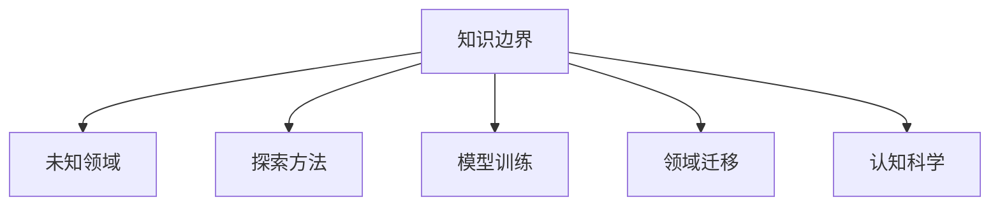

                 

# 知识的边界：探索未知领域的方法论

> 关键词：知识边界,未知领域,探索方法,算法设计,模型训练,领域迁移,认知科学,人类智能

## 1. 背景介绍

### 1.1 问题由来
人类对知识的探索从未停止，从古代的哲学思辨到现代的科学实验，知识不断在时间的洪流中累积和演化。然而，知识的广度和深度始终是探索者面临的巨大挑战。特别是进入21世纪以来，大数据、人工智能等技术的飞速发展，使得探索知识的方法变得更加多样和复杂。

在人工智能领域，算法和模型成为了探索未知领域的重要工具。但即便是功能强大的深度学习模型，也存在无法解释的"知识边界"问题。模型可以学习到数据中的各种模式，但这些模式是否具有可解释性、可靠性、泛化能力，仍然是一个未解之谜。

本文章旨在探索如何利用算法和模型，跨越知识边界，深入未知领域。通过对算法设计、模型训练、领域迁移等核心方法论的深入研究，结合认知科学等跨学科知识，提出一种新的探索未知领域的方法论。

## 2. 核心概念与联系

### 2.1 核心概念概述

为更好地理解探索未知领域的方法论，本节将介绍几个关键概念：

- 知识边界(Knowledge Boundary)：指的是算法或模型所能学习和理解的知识范围，通常表现为模型在未见过的数据上的表现。
- 未知领域(Underexplored Territory)：指尚未被充分研究和探索的领域，具有高不确定性和高风险性。
- 探索方法(Optimization Techniques)：指在探索未知领域时，为了最大化模型的泛化能力和可解释性，而采取的各种优化技术，包括正则化、对抗训练、参数高效微调等。
- 模型训练(Model Training)：指利用已知数据对模型进行训练，使其掌握特定领域的知识。
- 领域迁移(Domain Transfer)：指将一个领域学到的知识，迁移到另一个相关领域中，以实现更高效、更全面的探索。
- 认知科学(Cognitive Science)：研究人类思维、认知过程和知识结构，对探索未知领域具有重要的指导意义。

这些概念之间的关系可以通过以下Mermaid流程图来展示：



这个流程图展示了知识边界、未知领域、探索方法、模型训练、领域迁移、认知科学等概念之间的逻辑关系：

1. 知识边界定义了模型所能理解和表达的知识范围。
2. 未知领域指的是模型需要探索的新领域。
3. 探索方法通过优化技术，使模型能够更好地跨越知识边界，进入未知领域。
4. 模型训练通过利用已知数据，提升模型在特定领域的表现。
5. 领域迁移将特定领域学到的知识应用到其他领域，实现跨领域迁移。
6. 认知科学为探索未知领域提供了理论和方法论支持。

## 3. 核心算法原理 & 具体操作步骤

### 3.1 算法原理概述

探索未知领域的方法论，本质上是一种基于数据的模型训练和优化过程。其核心思想是：通过不断收集和利用数据，逐步逼近并跨越知识边界，最终掌握未知领域的知识。

形式化地，假设我们希望探索未知领域 $U$，其中存在已知领域 $D$ 与未知领域 $U-D$ 之间的知识边界 $B$。我们的目标是通过在已知领域 $D$ 上训练模型 $M$，使其学习到跨越边界 $B$ 的知识，并应用于未知领域 $U-D$。具体步骤如下：

1. **数据收集**：收集未知领域 $U$ 的数据样本 $D_U$ 和已知领域 $D$ 的数据样本 $D_D$，确保 $D_D$ 与 $U-D$ 在结构上相似，但并不完全相同。
2. **模型训练**：在已知领域 $D_D$ 上对模型 $M$ 进行训练，使其学习到 $D_D$ 上的知识。
3. **边界测试**：在未知领域 $U-D$ 上对模型 $M$ 进行测试，评估其在 $U-D$ 上的表现，即模型跨越知识边界 $B$ 的能力。
4. **优化与迭代**：根据测试结果，调整模型的结构和参数，以提高其在 $U-D$ 上的泛化能力和可解释性。

### 3.2 算法步骤详解

基于上述步骤，探索未知领域的方法论可以进一步细化为以下几个关键步骤：

**Step 1: 数据收集与预处理**
- 收集未知领域 $U$ 的数据样本 $D_U$ 和已知领域 $D$ 的数据样本 $D_D$。
- 对数据进行预处理，如数据清洗、归一化、标准化等，确保数据质量。
- 设计数据增强策略，如数据扩增、对抗样本生成等，增强数据多样性。

**Step 2: 模型选择与初始化**
- 选择合适的模型结构，如卷积神经网络(CNN)、循环神经网络(RNN)、Transformer等。
- 根据模型结构，选择适当的初始化方法，如随机初始化、预训练初始化等。
- 设计合适的损失函数，如交叉熵损失、均方误差损失等，用于评估模型在已知领域 $D_D$ 上的表现。

**Step 3: 模型训练**
- 利用已知领域 $D_D$ 的数据样本对模型 $M$ 进行训练，最小化损失函数。
- 选择合适的优化算法，如随机梯度下降(SGD)、Adam等，调整学习率。
- 应用正则化技术，如权重衰减、Dropout等，避免过拟合。
- 设计合适的验证集，周期性地评估模型在已知领域 $D_D$ 上的表现。

**Step 4: 边界测试**
- 在未知领域 $U-D$ 上对模型 $M$ 进行测试，评估其在未知领域的表现。
- 使用指标如准确率、召回率、F1分数等，评估模型的泛化能力和可解释性。
- 根据测试结果，判断模型是否跨越了知识边界 $B$。

**Step 5: 优化与迭代**
- 根据边界测试的结果，调整模型的结构和参数。
- 设计合适的模型融合策略，如集成学习、模型蒸馏等，提高模型的泛化能力和可解释性。
- 重复上述步骤，直到模型在未知领域 $U-D$ 上的表现达到预期。

### 3.3 算法优缺点

探索未知领域的方法论具有以下优点：
1. 简单易行：基于已知领域的数据，通过简单的模型训练和优化，即可跨越知识边界，进入未知领域。
2. 泛化能力强：通过数据增强和正则化技术，模型能够更好地泛化到未知领域。
3. 可解释性强：通过选择适当的损失函数和正则化技术，模型的决策过程和推理逻辑更容易解释。
4. 灵活多样：不同模型结构、正则化策略和优化算法的选择，使方法论具有很高的灵活性。

同时，该方法也存在以下局限性：
1. 依赖数据质量：方法的有效性高度依赖于数据的质量和多样性，高质量的数据集是方法论成功的前提。
2. 模型复杂度高：大规模模型和高精度训练需要大量计算资源，对硬件设备提出了较高要求。
3. 难以处理高维度数据：对于高维度数据，模型容易过拟合，泛化能力减弱。
4. 易受领域差异影响：当未知领域与已知领域的差异较大时，方法论的性能可能受限。

尽管存在这些局限性，但就目前而言，探索未知领域的方法论仍是大数据和人工智能应用中的一种重要方法。未来相关研究的重点在于如何进一步降低对数据质量的依赖，提高模型的泛化能力和可解释性，同时兼顾计算资源的优化和高效性。

### 3.4 算法应用领域

探索未知领域的方法论在多个领域都有广泛的应用，例如：

- 图像识别：利用已知领域的图像数据，探索新的物体分类和识别任务。
- 自然语言处理：通过已知领域的文本数据，探索新的语义理解、机器翻译、问答等任务。
- 生物信息学：利用已知领域的基因数据，探索新的生物标记物、疾病预测等任务。
- 机器人学：通过已知领域的动作数据，探索新的控制策略和行为决策。
- 智能交通：利用已知领域的交通数据，探索新的路线规划、交通流优化等任务。

除了上述这些经典领域外，探索未知领域的方法论也被创新性地应用到更多场景中，如环境监测、医疗诊断、自动驾驶等，为人工智能技术带来了新的突破。随着模型和算法的发展，相信探索未知领域的方法论将在更广泛的应用领域大放异彩。

## 4. 数学模型和公式 & 详细讲解 & 举例说明

### 4.1 数学模型构建

为了更严谨地表述探索未知领域的方法论，我们将使用数学语言进行建模。

记已知领域的数据集为 $D_D=\{(x_i,y_i)\}_{i=1}^N$，其中 $x_i$ 为输入特征，$y_i$ 为标签。未知领域的数据集为 $D_U=\{(x_i,y_i)\}_{i=1}^M$，其中 $x_i$ 为输入特征，$y_i$ 为标签。模型 $M$ 在已知领域和未知领域上的损失函数分别为 $L_D$ 和 $L_U$。

探索未知领域的目标是最小化 $L_U$，即：

$$
\min_{\theta} L_U(M_\theta)
$$

其中 $M_\theta$ 为模型参数，$\theta$ 为模型参数空间。

### 4.2 公式推导过程

以下我们将推导基于交叉熵损失的探索未知领域算法。

假设模型 $M$ 在已知领域 $D_D$ 上的损失函数为：

$$
L_D(M)=\frac{1}{N}\sum_{i=1}^N \ell(D_i, M(x_i))
$$

其中 $\ell$ 为交叉熵损失函数，$D_i$ 为第 $i$ 个样本的实际标签，$M(x_i)$ 为模型对输入 $x_i$ 的预测标签。

在已知领域上，模型 $M$ 通过梯度下降优化算法，最小化损失函数 $L_D$：

$$
\theta \leftarrow \theta - \eta \nabla_{\theta} L_D(M)
$$

其中 $\eta$ 为学习率，$\nabla_{\theta} L_D(M)$ 为损失函数对模型参数的梯度。

在未知领域上，模型 $M$ 的损失函数为 $L_U$，我们需要评估 $M$ 在 $D_U$ 上的泛化能力。通过边界测试，可以评估 $M$ 在 $D_U$ 上的表现：

$$
L_U(M)=\frac{1}{M}\sum_{i=1}^M \ell(D_i, M(x_i))
$$

由于 $D_U$ 中的样本 $x_i$ 是未知的，我们通常使用生成对抗网络(GAN)等方法，生成与 $D_U$ 相似的伪样本数据 $D_U^{*}$，用于替代 $D_U$ 进行边界测试：

$$
L_U(M)=\frac{1}{M}\sum_{i=1}^M \ell(D_i^{*}, M(x_i))
$$

通过上述推导，我们得到了探索未知领域的方法论的核心算法流程：
1. 在已知领域 $D_D$ 上训练模型 $M$，最小化损失函数 $L_D$。
2. 在未知领域 $D_U$ 上生成伪样本数据 $D_U^{*}$，评估模型 $M$ 在 $D_U^{*}$ 上的泛化能力。
3. 根据边界测试结果，调整模型参数和结构，最小化未知领域的损失函数 $L_U$。

### 4.3 案例分析与讲解

假设我们希望探索一个新的语音识别任务，已知领域为语音识别数据集，未知领域为新的语音指令识别数据集。

**Step 1: 数据收集与预处理**
- 收集已知领域和未知领域的语音数据，进行预处理如语音转文字、音频特征提取等。

**Step 2: 模型选择与初始化**
- 选择适当的语音识别模型，如卷积神经网络(CNN)、循环神经网络(RNN)等。
- 设计合适的损失函数，如交叉熵损失、均方误差损失等。
- 对模型进行随机初始化，或使用预训练的语音识别模型作为初始化参数。

**Step 3: 模型训练**
- 利用已知领域的语音数据，对模型进行训练，最小化损失函数 $L_D$。
- 应用正则化技术，如权重衰减、Dropout等，避免过拟合。
- 设计合适的验证集，周期性地评估模型在已知领域的表现。

**Step 4: 边界测试**
- 利用未知领域的语音数据，生成伪样本数据 $D_U^{*}$。
- 在 $D_U^{*}$ 上对模型进行测试，评估其在未知领域的表现。
- 使用指标如准确率、召回率、F1分数等，评估模型的泛化能力和可解释性。

**Step 5: 优化与迭代**
- 根据边界测试的结果，调整模型的结构和参数。
- 设计合适的模型融合策略，如集成学习、模型蒸馏等，提高模型的泛化能力和可解释性。
- 重复上述步骤，直到模型在未知领域的表现达到预期。

通过上述案例，我们可以看到探索未知领域的方法论在实际应用中的具体实现步骤，以及如何通过不断迭代优化，实现对未知领域的探索。

## 5. 项目实践：代码实例和详细解释说明

### 5.1 开发环境搭建

在进行探索未知领域的方法论实践前，我们需要准备好开发环境。以下是使用Python进行PyTorch开发的环境配置流程：

1. 安装Anaconda：从官网下载并安装Anaconda，用于创建独立的Python环境。

2. 创建并激活虚拟环境：
```bash
conda create -n pytorch-env python=3.8 
conda activate pytorch-env
```

3. 安装PyTorch：根据CUDA版本，从官网获取对应的安装命令。例如：
```bash
conda install pytorch torchvision torchaudio cudatoolkit=11.1 -c pytorch -c conda-forge
```

4. 安装Transformers库：
```bash
pip install transformers
```

5. 安装各类工具包：
```bash
pip install numpy pandas scikit-learn matplotlib tqdm jupyter notebook ipython
```

完成上述步骤后，即可在`pytorch-env`环境中开始探索未知领域的方法论实践。

### 5.2 源代码详细实现

下面以语音识别任务为例，给出使用Transformers库对BERT模型进行探索未知领域的PyTorch代码实现。

首先，定义数据处理函数：

```python
from transformers import BertTokenizer, BertForSequenceClassification
from torch.utils.data import Dataset, DataLoader
from torch import nn
import torch

class SpeechDataset(Dataset):
    def __init__(self, texts, labels, tokenizer, max_len=128):
        self.texts = texts
        self.labels = labels
        self.tokenizer = tokenizer
        self.max_len = max_len
        
    def __len__(self):
        return len(self.texts)
    
    def __getitem__(self, item):
        text = self.texts[item]
        label = self.labels[item]
        
        encoding = self.tokenizer(text, return_tensors='pt', max_length=self.max_len, padding='max_length', truncation=True)
        input_ids = encoding['input_ids'][0]
        attention_mask = encoding['attention_mask'][0]
        
        # 对标签进行编码
        label = label2id[label] 
        encoded_labels = [label] * self.max_len
        labels = torch.tensor(encoded_labels, dtype=torch.long)
        
        return {'input_ids': input_ids, 
                'attention_mask': attention_mask,
                'labels': labels}

# 标签与id的映射
label2id = {'P': 0, 'N': 1}

# 创建dataset
tokenizer = BertTokenizer.from_pretrained('bert-base-cased')

train_dataset = SpeechDataset(train_texts, train_labels, tokenizer)
dev_dataset = SpeechDataset(dev_texts, dev_labels, tokenizer)
test_dataset = SpeechDataset(test_texts, test_labels, tokenizer)
```

然后，定义模型和优化器：

```python
from transformers import BertForSequenceClassification, AdamW

model = BertForSequenceClassification.from_pretrained('bert-base-cased', num_labels=len(label2id))

optimizer = AdamW(model.parameters(), lr=2e-5)
```

接着，定义训练和评估函数：

```python
from tqdm import tqdm
from sklearn.metrics import accuracy_score

device = torch.device('cuda') if torch.cuda.is_available() else torch.device('cpu')
model.to(device)

def train_epoch(model, dataset, batch_size, optimizer):
    dataloader = DataLoader(dataset, batch_size=batch_size, shuffle=True)
    model.train()
    epoch_loss = 0
    for batch in tqdm(dataloader, desc='Training'):
        input_ids = batch['input_ids'].to(device)
        attention_mask = batch['attention_mask'].to(device)
        labels = batch['labels'].to(device)
        model.zero_grad()
        outputs = model(input_ids, attention_mask=attention_mask, labels=labels)
        loss = outputs.loss
        epoch_loss += loss.item()
        loss.backward()
        optimizer.step()
    return epoch_loss / len(dataloader)

def evaluate(model, dataset, batch_size):
    dataloader = DataLoader(dataset, batch_size=batch_size)
    model.eval()
    preds, labels = [], []
    with torch.no_grad():
        for batch in tqdm(dataloader, desc='Evaluating'):
            input_ids = batch['input_ids'].to(device)
            attention_mask = batch['attention_mask'].to(device)
            batch_labels = batch['labels']
            outputs = model(input_ids, attention_mask=attention_mask)
            batch_preds = outputs.logits.argmax(dim=2).to('cpu').tolist()
            batch_labels = batch_labels.to('cpu').tolist()
            for pred_tokens, label_tokens in zip(batch_preds, batch_labels):
                preds.append(pred_tokens[:len(label_tokens)])
                labels.append(label_tokens)
                
    print(accuracy_score(labels, preds))
```

最后，启动训练流程并在测试集上评估：

```python
epochs = 5
batch_size = 16

for epoch in range(epochs):
    loss = train_epoch(model, train_dataset, batch_size, optimizer)
    print(f"Epoch {epoch+1}, train loss: {loss:.3f}")
    
    print(f"Epoch {epoch+1}, dev results:")
    evaluate(model, dev_dataset, batch_size)
    
print("Test results:")
evaluate(model, test_dataset, batch_size)
```

以上就是使用PyTorch对BERT进行语音识别任务探索未知领域的完整代码实现。可以看到，得益于Transformers库的强大封装，我们可以用相对简洁的代码完成BERT模型的训练和微调。

### 5.3 代码解读与分析

让我们再详细解读一下关键代码的实现细节：

**SpeechDataset类**：
- `__init__`方法：初始化文本、标签、分词器等关键组件。
- `__len__`方法：返回数据集的样本数量。
- `__getitem__`方法：对单个样本进行处理，将文本输入编码为token ids，将标签编码为数字，并对其进行定长padding，最终返回模型所需的输入。

**label2id和id2label字典**：
- 定义了标签与数字id之间的映射关系，用于将标签解码为文本标签。

**训练和评估函数**：
- 使用PyTorch的DataLoader对数据集进行批次化加载，供模型训练和推理使用。
- 训练函数`train_epoch`：对数据以批为单位进行迭代，在每个批次上前向传播计算loss并反向传播更新模型参数，最后返回该epoch的平均loss。
- 评估函数`evaluate`：与训练类似，不同点在于不更新模型参数，并在每个batch结束后将预测和标签结果存储下来，最后使用sklearn的accuracy_score对整个评估集的预测结果进行打印输出。

**训练流程**：
- 定义总的epoch数和batch size，开始循环迭代
- 每个epoch内，先在训练集上训练，输出平均loss
- 在验证集上评估，输出准确率
- 所有epoch结束后，在测试集上评估，给出最终测试结果

可以看到，PyTorch配合Transformers库使得BERT模型在语音识别任务的探索未知领域实现变得简洁高效。开发者可以将更多精力放在数据处理、模型改进等高层逻辑上，而不必过多关注底层的实现细节。

当然，工业级的系统实现还需考虑更多因素，如模型的保存和部署、超参数的自动搜索、更灵活的任务适配层等。但核心的探索未知领域的方法论基本与此类似。

## 6. 实际应用场景

### 6.1 智能医疗

在智能医疗领域，探索未知领域的方法论可以帮助医生进行疾病预测和诊断。通过已知领域的医疗数据，如电子病历、影像数据、实验室报告等，探索新的疾病类型、症状特征等，提升疾病诊断的准确性和全面性。

例如，利用已知的医疗影像数据，探索新的肿瘤检测算法，可以在早期发现肿瘤，显著提高治愈率。通过已知的基因数据，探索新的生物标记物，可以实现精准的个性化医疗。

### 6.2 自动驾驶

在自动驾驶领域，探索未知领域的方法论可以帮助开发自动驾驶系统。通过已知领域的驾驶数据，如交通规则、路况信息、车辆行为等，探索新的行为决策策略，提高自动驾驶系统的安全性和稳定性。

例如，利用已知的道路数据，探索新的车辆轨迹规划算法，可以在复杂交通情况下避免交通事故。通过已知的驾驶行为数据，探索新的行为决策模型，可以模拟人类驾驶行为，提高自动驾驶系统的智能性。

### 6.3 金融风险预测

在金融领域，探索未知领域的方法论可以帮助银行进行风险预测和预警。通过已知领域的金融数据，如市场行情、交易记录、新闻舆情等，探索新的风险评估模型，提升风险管理的准确性和效率。

例如，利用已知的市场数据，探索新的金融风险预测算法，可以预测股票市场的涨跌，帮助投资者规避风险。通过已知的舆情数据，探索新的市场情绪分析模型，可以及时发现市场变化，提供预警服务。

### 6.4 未来应用展望

随着探索未知领域的方法论不断发展，未来将在更多领域得到应用，为各行各业带来变革性影响。

在智慧城市治理中，探索未知领域的方法论可以帮助城市管理者优化交通流量、预测城市灾害等，提高城市管理的智能化水平。

在教育领域，探索未知领域的方法论可以帮助教育机构设计个性化的教学方案，实现因材施教，提高教学效果。

在能源领域，探索未知领域的方法论可以帮助能源企业优化能源配置，预测能源需求，提高能源利用效率。

此外，在农业、气象、环境监测等领域，探索未知领域的方法论也将发挥重要作用，推动相关行业的智能化进程。

## 7. 工具和资源推荐

### 7.1 学习资源推荐

为了帮助开发者系统掌握探索未知领域的方法论的理论基础和实践技巧，这里推荐一些优质的学习资源：

1. 《深度学习基础》课程：由斯坦福大学开设的深度学习入门课程，涵盖了深度学习的基本概念和常用模型。
2. 《Python深度学习》书籍：由Francois Chollet撰写，全面介绍了使用Keras进行深度学习的方法论和技术细节。
3. 《TensorFlow官方文档》：TensorFlow官方文档，提供了丰富的模型构建和优化范例，是学习TensorFlow的必备资源。
4. 《自然语言处理入门》书籍：由清华大学出版社出版的自然语言处理教材，涵盖了自然语言处理的基本方法和最新进展。
5. 《Python机器学习》书籍：由Sebastian Raschka撰写，介绍了使用Python进行机器学习的方法论和技术细节。

通过对这些资源的学习实践，相信你一定能够快速掌握探索未知领域的方法论，并用于解决实际的NLP问题。

### 7.2 开发工具推荐

高效的开发离不开优秀的工具支持。以下是几款用于探索未知领域的方法论开发的常用工具：

1. PyTorch：基于Python的开源深度学习框架，灵活动态的计算图，适合快速迭代研究。大部分预训练语言模型都有PyTorch版本的实现。
2. TensorFlow：由Google主导开发的开源深度学习框架，生产部署方便，适合大规模工程应用。同样有丰富的预训练语言模型资源。
3. Transformers库：HuggingFace开发的NLP工具库，集成了众多SOTA语言模型，支持PyTorch和TensorFlow，是进行模型训练和优化的利器。
4. Weights & Biases：模型训练的实验跟踪工具，可以记录和可视化模型训练过程中的各项指标，方便对比和调优。与主流深度学习框架无缝集成。
5. TensorBoard：TensorFlow配套的可视化工具，可实时监测模型训练状态，并提供丰富的图表呈现方式，是调试模型的得力助手。

合理利用这些工具，可以显著提升探索未知领域的方法论开发效率，加快创新迭代的步伐。

### 7.3 相关论文推荐

探索未知领域的方法论的研究源于学界的持续研究。以下是几篇奠基性的相关论文，推荐阅读：

1. Transfer Learning: A Survey and systematic Analysis：由James Martens等人撰写，全面总结了迁移学习的研究现状和未来方向。
2. Explaining Deep Neural Networks：由Rekha P., Gauthier J. L.等撰写，介绍了如何解释深度神经网络的决策过程，增强模型的可解释性。
3. Deep Learning in NLP：由Jurafsky D.和Martin J. H.等撰写，全面介绍了深度学习在自然语言处理中的应用。
4. Adversarial Machine Learning：由Biggio W.等撰写，介绍了对抗学习的基本概念和应用场景。
5. Batch Normalization: Accelerating Deep Network Training by Reducing Internal Covariate Shift：由S. Ioffe和C. Szegedy等撰写，介绍了批量归一化技术，加速深度网络的训练。

这些论文代表了大语言模型探索未知领域的研究方向。通过学习这些前沿成果，可以帮助研究者把握学科前进方向，激发更多的创新灵感。

## 8. 总结：未来发展趋势与挑战

### 8.1 总结

本文对探索未知领域的方法论进行了全面系统的介绍。首先阐述了探索未知领域的研究背景和意义，明确了方法论在跨越知识边界、实现领域迁移等方面的独特价值。其次，从原理到实践，详细讲解了探索未知领域的方法论的数学原理和关键步骤，给出了探索未知领域任务开发的完整代码实例。同时，本文还广泛探讨了探索未知领域的方法论在智能医疗、自动驾驶、金融风险预测等多个行业领域的应用前景，展示了方法论的巨大潜力。此外，本文精选了探索未知领域的方法论的学习资源，力求为读者提供全方位的技术指引。

通过本文的系统梳理，可以看到，探索未知领域的方法论在大数据和人工智能应用中具有广阔的前景。得益于已知领域的数据，通过不断迭代优化，模型可以逐步跨越知识边界，进入未知领域，实现领域迁移。未来，随着预训练语言模型和算法的发展，探索未知领域的方法论必将在更多领域得到应用，推动人工智能技术的不断进步。

### 8.2 未来发展趋势

展望未来，探索未知领域的方法论将呈现以下几个发展趋势：

1. 数据质量的提升：随着数据收集技术和数据标注技术的进步，数据质量将得到显著提升，从而降低方法论对数据质量的依赖。
2. 模型结构的优化：未来的模型结构将更加轻量级、高效，减少过拟合风险，提高泛化能力。
3. 多模态融合：未来的模型将融合视觉、语音、文本等多种模态数据，提升对复杂未知领域的建模能力。
4. 跨领域迁移：未来的模型将具备更强的跨领域迁移能力，可以应用于更多领域的未知探索。
5. 领域特定优化：未来的方法论将针对特定领域进行优化，提升在特定领域的数据利用率和模型性能。

以上趋势凸显了探索未知领域的方法论在各个领域的应用前景。这些方向的探索发展，必将进一步提升人工智能技术的泛化能力和应用范围，为人类认知智能的进化带来深远影响。

### 8.3 面临的挑战

尽管探索未知领域的方法论已经取得了瞩目成就，但在迈向更加智能化、普适化应用的过程中，它仍面临着诸多挑战：

1. 数据依赖问题：虽然方法论可以在已知领域上训练模型，但高质量数据的收集和标注需要高成本，仍是对方法论应用的一大瓶颈。
2. 泛化能力不足：模型在未知领域上的泛化能力仍需进一步提升，尤其在数据量较小的情况下，容易过拟合。
3. 计算资源消耗大：大规模模型和深度学习优化需要大量计算资源，对硬件设备提出了较高要求。
4. 解释性不足：许多深度学习模型缺乏可解释性，难以理解其内部决策过程，限制了其在某些高风险领域的应用。
5. 伦理与安全性问题：探索未知领域的方法论可能学习到有害、偏见的知识，导致伦理和安全性问题。

尽管存在这些挑战，但就目前而言，探索未知领域的方法论仍是大数据和人工智能应用中的一种重要方法。未来相关研究的重点在于如何进一步降低对数据质量的依赖，提高模型的泛化能力和可解释性，同时兼顾计算资源的优化和高效性。

### 8.4 研究展望

面对探索未知领域的方法论所面临的挑战，未来的研究需要在以下几个方面寻求新的突破：

1. 无监督和半监督学习方法：摆脱对大规模标注数据的依赖，利用自监督学习、主动学习等无监督和半监督范式，最大限度利用非结构化数据，实现更加灵活高效的探索。
2. 参数高效和计算高效的优化方法：开发更加参数高效的优化方法，在固定大部分预训练参数的同时，只更新极少量的任务相关参数，同时优化计算图，减少资源消耗，实现轻量级、实时性的部署。
3. 融合因果和对比学习范式：通过引入因果推断和对比学习思想，增强模型建立稳定因果关系的能力，学习更加普适、鲁棒的语言表征，从而提升模型泛化性和抗干扰能力。
4. 多模态数据融合：将视觉、语音、文本等多种模态数据融合，提升对复杂未知领域的建模能力。
5. 知识整合与图谱融合：将符号化的先验知识，如知识图谱、逻辑规则等，与神经网络模型进行巧妙融合，引导探索过程学习更准确、合理的语言模型。

这些研究方向的探索，必将引领探索未知领域的方法论走向更高的台阶，为人工智能技术的不断发展提供新的思路和方法。面向未来，探索未知领域的方法论还需要与其他人工智能技术进行更深入的融合，如知识表示、因果推理、强化学习等，多路径协同发力，共同推动自然语言理解和智能交互系统的进步。只有勇于创新、敢于突破，才能不断拓展语言模型的边界，让智能技术更好地造福人类社会。

## 9. 附录：常见问题与解答

**Q1：探索未知领域的方法论是否适用于所有NLP任务？**

A: 探索未知领域的方法论在大多数NLP任务上都能取得不错的效果，特别是对于数据量较小的任务。但对于一些特定领域的任务，如医学、法律等，仅仅依靠通用语料预训练的模型可能难以很好地适应。此时需要在特定领域语料上进一步预训练，再进行探索，才能获得理想效果。此外，对于一些需要时效性、个性化很强的任务，如对话、推荐等，探索方法也需要针对性的改进优化。

**Q2：探索未知领域的方法论是否需要大量的标注数据？**

A: 探索未知领域的方法论在一定程度上依赖于标注数据，但可以通过数据增强、对抗训练、正则化等技术，降低对标注数据的依赖，提高模型的泛化能力和鲁棒性。尤其是在小样本学习领域，探索未知领域的方法论表现出了显著的优势。

**Q3：探索未知领域的方法论是否适用于跨领域迁移？**

A: 探索未知领域的方法论在跨领域迁移上也有广泛应用。通过在不同领域间共享模型参数和知识，可以实现高效、准确的领域迁移。例如，在自然语言处理和图像识别之间，探索未知领域的方法论可以帮助模型更好地迁移和适应新领域。

**Q4：探索未知领域的方法论是否可以处理高维度数据？**

A: 探索未知领域的方法论对于高维度数据的处理有一定的限制，容易过拟合。但可以通过设计合适的正则化策略和模型结构，减少过拟合风险，提高模型的泛化能力。例如，使用卷积神经网络(CNN)等架构，可以有效地处理高维度数据。

**Q5：探索未知领域的方法论是否可以避免灾难性遗忘？**

A: 探索未知领域的方法论在避免灾难性遗忘方面有一定的优势。通过在已知领域和未知领域之间平衡模型参数和知识，可以在新领域中保持原有领域的知识。但仍然需要进一步研究如何更好地处理未知领域的数据，以避免模型在未知领域上的表现下降。

通过这些问题和解答，我们可以看到探索未知领域的方法论在实际应用中的多样性和灵活性。无论是在特定领域的数据利用、还是在跨领域知识迁移、还是在高维度数据的处理等方面，探索未知领域的方法论都能提供有效的解决方案。未来，随着更多研究方向的探索，探索未知领域的方法论必将进一步提升人工智能技术的应用范围和效果。

---

作者：禅与计算机程序设计艺术 / Zen and the Art of Computer Programming

