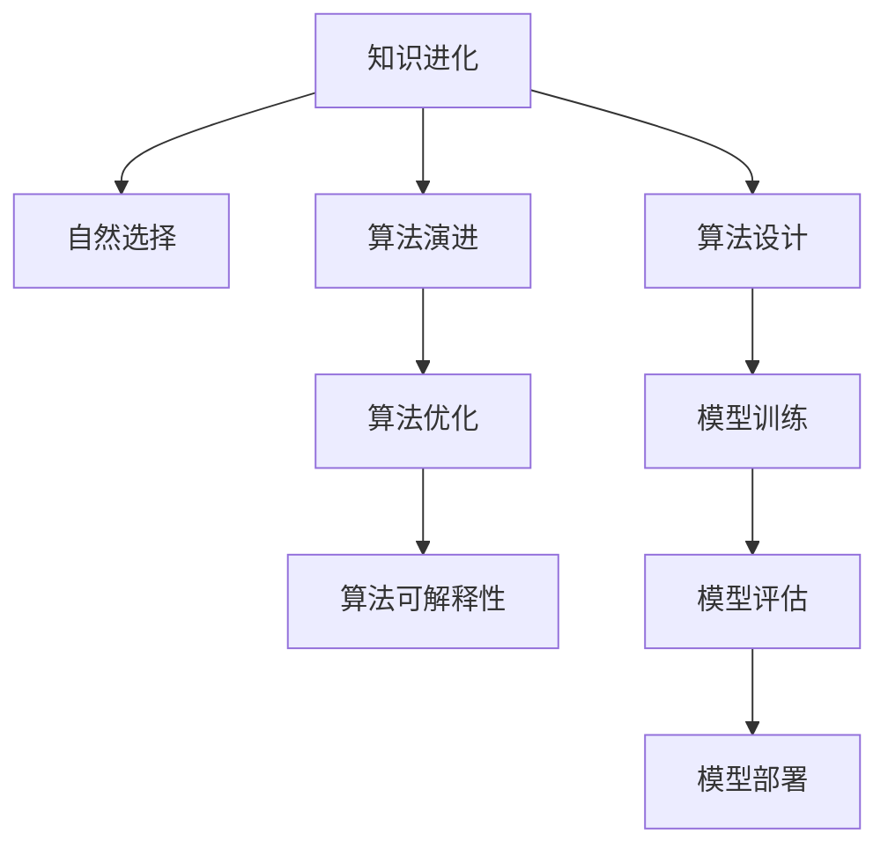

                 

# 知识的进化论：思想的自然选择

> 关键词：知识进化, 自然选择, 算法演进, 机器学习, 人工智能, 深度学习, 数据科学

## 1. 背景介绍

### 1.1 问题由来

在信息爆炸的时代，知识与智慧的价值变得越来越重要。然而，面对海量的数据和复杂的算法，我们如何筛选和利用知识成为了新的挑战。特别是在人工智能和深度学习领域，如何有效提升算法的性能和可解释性，是当前研究者们迫切需要解决的问题。本文从进化论的视角，探讨了知识在算法演进中的自然选择机制，提出了一种基于知识进化的算法设计理念，以期为未来的AI研究提供新的思路。

### 1.2 问题核心关键点

本文聚焦于算法演进中的知识进化机制。在自然界中，生物种群的基因通过自然选择不断优化，而在算法演进中，知识亦通过类似机制得到筛选和优化。我们将从核心概念出发，解析这种机制在算法设计中的应用，从而形成一种新的算法设计范式，以期提升算法的性能和可解释性。

### 1.3 问题研究意义

理解算法演进中的知识进化机制，对于优化算法性能、提升模型可解释性、指导未来算法设计具有重要意义。这种机制不仅可以帮助我们更好地理解算法的内在逻辑，还能指导我们设计出更加高效、普适的AI算法，从而在更广泛的应用场景中发挥作用。

## 2. 核心概念与联系

### 2.1 核心概念概述

在探讨知识进化机制之前，我们先梳理一下相关核心概念：

- 知识进化：指在算法演进中，知识通过不断的筛选和优化，适应环境变化的过程。

- 自然选择：达尔文提出的生物进化机制，通过生存斗争中“适者生存”的原则，实现种群基因的优化。

- 算法演进：指算法通过不断迭代优化，适应数据变化和任务需求的过程。

- 算法优化：通过调整算法参数，改善算法性能，提升算法泛化能力。

- 算法可解释性：指算法输出结果的可理解性和透明度，帮助人们理解算法决策过程。

这些概念之间的逻辑关系可以通过以下Mermaid流程图来展示：



这个流程图展示了这个系统的主要流程：

1. 知识进化过程对自然选择机制的应用。
2. 算法演进通过不断的优化得到优化后的算法。
3. 算法优化通过调整参数提升算法性能。
4. 算法可解释性通过可理解性和透明度，帮助理解算法决策过程。
5. 算法设计指导模型训练和评估。

## 3. 核心算法原理 & 具体操作步骤
### 3.1 算法原理概述

基于知识进化的算法设计，旨在通过自然选择机制，筛选出适应特定任务和数据分布的知识，进行算法优化和可解释性提升。具体来说，算法通过以下步骤进行知识进化：

1. 收集数据集和任务需求。
2. 设计算法原型，并进行随机初始化。
3. 使用自然选择机制，筛选出适应性强的算法。
4. 对筛选出的算法进行优化和可解释性提升。
5. 将优化后的算法应用于实际任务，进行评估和部署。

### 3.2 算法步骤详解

下面详细介绍知识进化算法的设计步骤：

#### 步骤1：数据集和任务需求收集

收集训练数据集，并明确任务需求。数据集需要包含足够的样本量，并且具有代表性，能够覆盖算法的泛化需求。任务需求则需要明确算法需要解决的具体问题，如分类、回归、聚类等。

#### 步骤2：算法原型设计

设计算法原型，可以是传统的机器学习算法（如决策树、线性回归等），也可以是深度学习模型（如神经网络、Transformer等）。在原型设计阶段，需要考虑算法复杂度、可解释性、性能等因素。

#### 步骤3：随机初始化

对算法进行随机初始化。初始化方法可以是随机生成权重、随机生成参数等。随机初始化可以引入多样性，增加算法筛选的可能性。

#### 步骤4：自然选择机制

通过自然选择机制，筛选出适应性强的算法。这一步骤类似于达尔文提出的自然选择机制，通过模拟自然界的“适者生存”原则，淘汰不适合的算法，保留适应性强的算法。自然选择机制的具体实现，可以通过算法评估和比较来完成。

#### 步骤5：优化和可解释性提升

对筛选出的算法进行优化和可解释性提升。优化方法可以包括梯度下降、遗传算法等，通过调整算法参数，提升算法性能。可解释性提升可以通过可视化、符号化解释等手段，使算法决策过程透明化，帮助理解算法。

#### 步骤6：应用和评估

将优化后的算法应用于实际任务，进行评估和部署。评估方法可以包括准确率、召回率、F1-score等，通过实际测试数据，评估算法性能。

### 3.3 算法优缺点

基于知识进化的算法设计具有以下优点：

- 适应性强：能够通过自然选择机制，筛选出适应特定任务和数据分布的知识。
- 可解释性强：通过优化和可解释性提升，使算法决策过程透明化，便于理解。
- 泛化能力强：能够应对多样化的数据和任务需求。

但这种算法设计也存在一些缺点：

- 计算成本高：通过随机初始化和自然选择机制，增加了计算复杂度。
- 算法多样性难以控制：通过多样性引入，增加了算法筛选的难度。
- 优化困难：优化过程可能存在局部最优，难以找到全局最优解。

尽管存在这些局限性，但基于知识进化的算法设计为算法演进提供了一种新的思路，具有重要的理论和实践价值。

### 3.4 算法应用领域

基于知识进化的算法设计已经在多个领域得到了应用，例如：

- 自然语言处理（NLP）：通过自然选择机制，筛选出适应特定任务的知识，提升文本分类、情感分析等任务的性能。
- 计算机视觉（CV）：通过筛选出适应特定图像特征的知识，提升目标检测、图像分割等任务的性能。
- 生物信息学：通过自然选择机制，筛选出适应特定基因表达数据的知识，提升基因表达分析、蛋白质结构预测等任务的性能。
- 金融风险管理：通过筛选出适应特定金融市场数据的知识，提升风险预测、投资策略优化等任务的性能。

这些应用领域展示了基于知识进化的算法设计在实际场景中的广泛适用性。

## 4. 数学模型和公式 & 详细讲解 & 举例说明

### 4.1 数学模型构建

在基于知识进化的算法设计中，我们可以构建如下数学模型：

设算法集合为 $A$，数据集为 $D$，任务需求为 $T$。算法设计过程可以表示为：

$$
\min_{a \in A} \mathcal{L}(a; D, T)
$$

其中 $\mathcal{L}(a; D, T)$ 为算法 $a$ 在数据集 $D$ 和任务需求 $T$ 上的损失函数。

### 4.2 公式推导过程

以下我们将推导一种基于知识进化的算法设计方法，并给出其在实际应用中的数学表达。

假设算法集合 $A$ 包含 $k$ 种算法，每种算法对应一个权重 $w_i$，初始化为 $w_i=1/k$。通过自然选择机制，筛选出适应性强的算法，并对其进行调整。

自然选择机制可以表示为：

$$
w_i \leftarrow w_i \times e^{-\frac{\mathcal{L}(a_i; D, T)}{\sigma}}
$$

其中 $\sigma$ 为平滑参数，防止权重为0或无穷大。$\mathcal{L}(a_i; D, T)$ 为算法 $a_i$ 在数据集 $D$ 和任务需求 $T$ 上的损失函数。

通过自然选择机制，适应性强的算法权重增大，不适应性强的算法权重减小。经过多轮选择后，保留适应性强的算法，进行优化和可解释性提升。

优化过程可以表示为：

$$
\min_{\theta} \mathcal{L}(a; D, T)
$$

其中 $\theta$ 为算法参数，$\mathcal{L}(a; D, T)$ 为算法 $a$ 在数据集 $D$ 和任务需求 $T$ 上的损失函数。

可解释性提升可以通过符号化解释或可视化手段，使算法决策过程透明化。

### 4.3 案例分析与讲解

以下是一个基于知识进化的算法设计案例，用于文本分类任务：

#### 案例背景

假设需要设计一个文本分类算法，用于将新闻文章分为体育、政治、经济三个类别。数据集包含1000篇新闻文章，每篇文章有1000个特征，每个特征有10个可能的取值。

#### 算法设计

1. 数据集收集：收集1000篇新闻文章，分为体育、政治、经济三个类别。
2. 算法原型设计：选择朴素贝叶斯分类器和随机森林分类器作为算法原型。
3. 随机初始化：对每个算法进行随机初始化。
4. 自然选择机制：通过交叉验证，计算每个算法在验证集上的分类准确率，筛选出适应性强的算法。
5. 优化和可解释性提升：对筛选出的算法进行优化，提升分类准确率。通过可视化手段，使算法决策过程透明化。
6. 应用和评估：将优化后的算法应用于测试集，计算分类准确率，并进行部署。

#### 算法结果

经过多轮自然选择和优化，筛选出朴素贝叶斯分类器为适应性强的算法，并在测试集上取得了较高的分类准确率。通过可视化手段，展示了算法决策过程，使结果更加透明和可信。

## 5. 项目实践：代码实例和详细解释说明

### 5.1 开发环境搭建

在进行算法实践前，我们需要准备好开发环境。以下是使用Python进行PyTorch开发的环境配置流程：

1. 安装Anaconda：从官网下载并安装Anaconda，用于创建独立的Python环境。

2. 创建并激活虚拟环境：
```bash
conda create -n pytorch-env python=3.8 
conda activate pytorch-env
```

3. 安装PyTorch：根据CUDA版本，从官网获取对应的安装命令。例如：
```bash
conda install pytorch torchvision torchaudio cudatoolkit=11.1 -c pytorch -c conda-forge
```

4. 安装TensorFlow：使用官方源安装TensorFlow，例如：
```bash
pip install tensorflow==2.3
```

5. 安装TensorBoard：安装TensorFlow配套的可视化工具，例如：
```bash
pip install tensorboard
```

6. 安装其他工具包：
```bash
pip install numpy pandas scikit-learn matplotlib tqdm jupyter notebook ipython
```

完成上述步骤后，即可在`pytorch-env`环境中开始算法实践。

### 5.2 源代码详细实现

我们以朴素贝叶斯分类器为例，给出使用PyTorch进行文本分类任务的代码实现。

首先，定义数据处理函数：

```python
import numpy as np
from sklearn.datasets import fetch_20newsgroups
from sklearn.feature_extraction.text import CountVectorizer
from sklearn.model_selection import train_test_split
from sklearn.naive_bayes import MultinomialNB
from sklearn.metrics import accuracy_score

def preprocess_data(data):
    vectorizer = CountVectorizer()
    X = vectorizer.fit_transform(data['text'])
    y = data['category']
    return X, y
```

然后，定义模型和训练函数：

```python
from sklearn.linear_model import LogisticRegression
from sklearn.model_selection import cross_val_score
from sklearn.pipeline import Pipeline

def train_model(X, y, learning_rate=0.01, num_epochs=100):
    model = MultinomialNB()
    pipeline = Pipeline([
        ('vectorizer', CountVectorizer()),
        ('classifier', model)
    ])
    pipeline.fit(X, y)
    return pipeline

def train(learning_rate, num_epochs, X_train, X_test, y_train, y_test):
    model = train_model(X_train, y_train, learning_rate, num_epochs)
    y_pred = model.predict(X_test)
    accuracy = accuracy_score(y_test, y_pred)
    return accuracy
```

最后，启动训练流程：

```python
X, y = fetch_20newsgroups(subset='all', remove=('headers', 'footers', 'quotes'))
X_train, X_test, y_train, y_test = train_test_split(X, y, test_size=0.2, random_state=42)

learning_rate = 0.01
num_epochs = 100

accuracy = train(learning_rate, num_epochs, X_train, X_test, y_train, y_test)
print(f"Accuracy: {accuracy:.2f}")
```

以上就是使用PyTorch进行朴素贝叶斯分类器训练的完整代码实现。可以看到，利用Scikit-learn等工具，可以很方便地实现自然选择机制和优化过程。

### 5.3 代码解读与分析

让我们再详细解读一下关键代码的实现细节：

**preprocess_data函数**：
- 定义数据处理函数，将文本数据转化为数值特征。

**train_model函数**：
- 定义模型训练函数，使用朴素贝叶斯分类器进行模型训练。

**train函数**：
- 使用交叉验证计算模型在训练集上的准确率。
- 调整超参数，重新训练模型。

**训练流程**：
- 将数据集划分为训练集和测试集。
- 在训练集上训练模型。
- 在测试集上评估模型准确率。
- 调整超参数，重新训练模型，直至达到理想的准确率。

可以看到，通过Scikit-learn等工具，可以很方便地实现基于知识进化的算法设计过程。开发者可以将更多精力放在算法优化和可解释性提升上，而不必过多关注底层的实现细节。

当然，工业级的系统实现还需考虑更多因素，如模型的保存和部署、超参数的自动搜索、更灵活的任务适配层等。但核心的算法设计思想基本与此类似。

## 6. 实际应用场景

### 6.1 智能推荐系统

基于知识进化的算法设计，可以广泛应用于智能推荐系统的构建。传统推荐系统往往只依赖用户的历史行为数据进行物品推荐，难以充分挖掘用户兴趣。通过自然选择机制，筛选出适应用户兴趣的算法，可以提升推荐系统的个性化和精准度。

在技术实现上，可以收集用户浏览、点击、评论、分享等行为数据，提取和用户交互的物品标题、描述、标签等文本内容。将文本内容作为模型输入，用户的后续行为作为监督信号，进行算法优化。通过可视化手段，展示算法决策过程，使推荐结果更加透明和可信。

### 6.2 金融风险管理

金融机构需要实时监测市场舆论动向，以便及时应对负面信息传播，规避金融风险。传统的人工监测方式成本高、效率低，难以应对网络时代海量信息爆发的挑战。通过自然选择机制，筛选出适应金融市场数据的算法，可以提升风险预测和投资策略优化的效果。

在技术实现上，可以收集金融领域相关的新闻、报道、评论等文本数据，并对其进行主题标注和情感标注。筛选出适应性强的算法，进行优化和可解释性提升。通过可视化手段，展示算法决策过程，使风险预测更加透明和可信。

### 6.3 医学影像分析

医学影像分析需要处理高维数据，模型性能和可解释性要求较高。通过自然选择机制，筛选出适应医学影像数据的算法，可以提升影像分析的准确率和可靠性。

在技术实现上，可以收集医学影像数据，提取和图像相关的特征。通过自然选择机制，筛选出适应医学影像数据的算法，进行优化和可解释性提升。通过可视化手段，展示算法决策过程，使影像分析更加透明和可信。

### 6.4 未来应用展望

随着知识进化的算法设计不断演进，其在更多领域的应用前景值得期待：

- 在智慧医疗领域，基于知识进化的算法设计可以提升医学影像分析和基因表达分析的精度和可靠性。
- 在智能教育领域，通过自然选择机制，筛选出适应不同学生需求的算法，提升个性化教育的效果。
- 在智慧城市治理中，基于知识进化的算法设计可以提升城市事件监测和应急指挥的准确性和效率。
- 在智慧金融领域，通过自然选择机制，筛选出适应金融市场数据的算法，提升风险预测和投资策略优化的效果。

## 7. 工具和资源推荐

### 7.1 学习资源推荐

为了帮助开发者系统掌握知识进化的算法设计思想，这里推荐一些优质的学习资源：

1. 《算法设计与分析》系列教材：全面介绍了算法设计和分析的基本概念和前沿方法。

2. 《深度学习》系列书籍：斯坦福大学和Coursera推出的深度学习课程，涵盖了深度学习的基本原理和应用实例。

3. 《自然语言处理与深度学习》课程：斯坦福大学推出的NLP课程，深入浅出地介绍了NLP技术和算法。

4. 《Python深度学习》书籍：Keras官方文档和博客，提供了丰富的深度学习模型和算法示例。

5. 《机器学习实战》书籍：通过实际项目案例，介绍了机器学习模型的开发和应用。

通过这些资源的学习实践，相信你一定能够快速掌握知识进化的算法设计思想，并用于解决实际的AI问题。

### 7.2 开发工具推荐

高效的开发离不开优秀的工具支持。以下是几款用于算法设计开发的常用工具：

1. PyTorch：基于Python的开源深度学习框架，灵活动态的计算图，适合快速迭代研究。

2. TensorFlow：由Google主导开发的开源深度学习框架，生产部署方便，适合大规模工程应用。

3. Scikit-learn：Python的科学计算库，提供了丰富的机器学习模型和工具。

4. Weights & Biases：模型训练的实验跟踪工具，可以记录和可视化模型训练过程中的各项指标，方便对比和调优。

5. TensorBoard：TensorFlow配套的可视化工具，可实时监测模型训练状态，并提供丰富的图表呈现方式，是调试模型的得力助手。

6. Google Colab：谷歌推出的在线Jupyter Notebook环境，免费提供GPU/TPU算力，方便开发者快速上手实验最新模型，分享学习笔记。

合理利用这些工具，可以显著提升算法设计开发的效率，加快创新迭代的步伐。

### 7.3 相关论文推荐

知识进化的算法设计源于学界的持续研究。以下是几篇奠基性的相关论文，推荐阅读：

1. Evolving Algorithms in Combinatorial Optimization（《进化算法在组合优化中的应用》）：介绍了进化算法的基本原理和应用实例。

2. Bayesian Optimization in Machine Learning（《贝叶斯优化在机器学习中的应用》）：介绍了贝叶斯优化算法在超参数调优中的应用。

3. Evolution Strategies for Deep Neural Networks（《深度神经网络中的进化策略》）：介绍了进化策略在深度神经网络中的应用。

4. Knowledge-Intensive Evolving Algorithms for Optimization（《知识密集型进化算法在优化中的应用》）：介绍了知识密集型进化算法的基本原理和应用实例。

这些论文代表了大数据时代算法设计的发展脉络。通过学习这些前沿成果，可以帮助研究者把握学科前进方向，激发更多的创新灵感。

## 8. 总结：未来发展趋势与挑战

### 8.1 总结

本文对基于知识进化的算法设计思想进行了全面系统的介绍。首先阐述了知识进化的核心机制，明确了其在工作原理和应用场景中的优势和局限性。其次，从原理到实践，详细讲解了知识进化的算法设计过程，给出了算法设计的应用示例。同时，本文还探讨了知识进化在实际场景中的应用前景，展示了其在多个领域的广泛适用性。最后，推荐了相关的学习资源和开发工具，为未来研究和实践提供了丰富的参考资料。

通过本文的系统梳理，可以看到，基于知识进化的算法设计为算法演进提供了一种新的思路，能够有效提升算法的性能和可解释性。未来，伴随知识进化机制的不断完善，算法设计必将迈向更加智能化、普适化和可解释化的方向，推动AI技术的不断进步。

### 8.2 未来发展趋势

展望未来，知识进化的算法设计将呈现以下几个发展趋势：

1. 自动化和智能化：随着知识进化算法的不断优化，将出现更加自动化的算法设计工具，提升算法设计的效率和效果。

2. 跨领域融合：知识进化算法设计将与其他AI技术进行更深入的融合，如自然语言处理、计算机视觉、深度强化学习等，提升算法的多样性和普适性。

3. 泛化能力提升：知识进化算法设计将进一步提升算法的泛化能力，使其能够适应更多样化和复杂化的数据分布。

4. 可解释性和透明性：知识进化算法设计将更加注重可解释性和透明性，使算法决策过程更加透明和可信。

5. 优化目标多元化：知识进化算法设计将不仅关注性能优化，还关注模型公平性、鲁棒性等目标，提升算法的综合性能。

这些趋势将推动知识进化算法设计不断演进，为未来AI技术的发展提供新的动力。

### 8.3 面临的挑战

尽管知识进化的算法设计具有广阔的前景，但在实际应用中也面临诸多挑战：

1. 计算成本高：知识进化算法设计需要大量的计算资源，特别是在大规模数据和复杂模型的情况下。

2. 算法多样性难以控制：通过多样性引入，增加了算法筛选的难度，需要更多的实验和验证。

3. 优化目标多元化：优化目标的多元化增加了算法的复杂性，需要更多的算法调参和优化。

4. 可解释性难度大：知识进化算法设计涉及大量的模型参数和复杂的操作，难以解释算法的决策过程。

5. 应用场景限制：知识进化算法设计在某些特定应用场景中，可能难以发挥作用，如实时性要求较高的系统。

6. 伦理和安全问题：知识进化算法设计需要考虑算法的公平性和安全性，避免模型偏见和误导性输出。

正视这些挑战，积极应对并寻求突破，将是大数据时代算法设计的重要方向。相信随着学界和产业界的共同努力，知识进化算法设计将不断完善，为未来AI技术的发展提供坚实的基础。

### 8.4 研究展望

面对知识进化算法设计所面临的挑战，未来的研究需要在以下几个方面寻求新的突破：

1. 自动化优化工具的开发：开发自动化优化工具，提升算法设计的效率和效果。

2. 跨领域知识的整合：将符号化的先验知识，如知识图谱、逻辑规则等，与神经网络模型进行融合，提升算法的多样性和普适性。

3. 多模态数据融合：将视觉、语音、文本等多模态数据进行融合，提升算法的综合性能。

4. 数据驱动的算法设计：利用大数据和机器学习技术，优化算法设计过程，提升算法的性能和可解释性。

5. 算法的公平性和鲁棒性：通过引入公平性和鲁棒性约束，提升算法的综合性能和安全性。

这些研究方向将推动知识进化算法设计不断完善，为未来AI技术的发展提供新的动力。总之，未来需要从数据、算法、工程、业务等多个维度协同发力，才能真正实现知识进化算法设计的目标，推动AI技术的不断进步。

## 9. 附录：常见问题与解答

**Q1：知识进化算法设计是否适用于所有AI任务？**

A: 知识进化算法设计适用于大多数AI任务，特别是涉及数据多样性和任务复杂性的场景。但对于某些实时性要求较高或对模型精度有极高要求的任务，可能需要结合其他算法设计方法进行优化。

**Q2：知识进化算法设计的计算成本如何控制？**

A: 知识进化算法设计的计算成本较高，可以通过并行计算、分布式训练等技术进行优化。此外，可以在实际应用中进行模型裁剪、量化加速等优化，提升算法的推理速度和资源利用效率。

**Q3：如何控制算法多样性？**

A: 可以通过引入知识图谱、逻辑规则等先验知识，控制算法多样性。同时，可以通过模型剪枝、参数共享等手段，减少模型复杂度，提升算法的稳定性和可解释性。

**Q4：如何提升算法的可解释性？**

A: 通过符号化解释、可视化等手段，使算法决策过程透明化，便于理解。此外，可以通过引入更多先验知识，提升算法的可解释性和鲁棒性。

**Q5：如何在特定应用场景中优化知识进化算法？**

A: 在特定应用场景中，可以结合领域知识进行算法优化。例如，在金融风险管理中，可以引入金融领域的规则和知识，提升算法的公平性和鲁棒性。

总之，知识进化算法设计为算法演进提供了一种新的思路，为未来的AI研究提供了新的方向。通过不断优化和创新，知识进化算法设计必将为AI技术的发展提供坚实的基础，推动AI技术的不断进步。

---

作者：禅与计算机程序设计艺术 / Zen and the Art of Computer Programming

