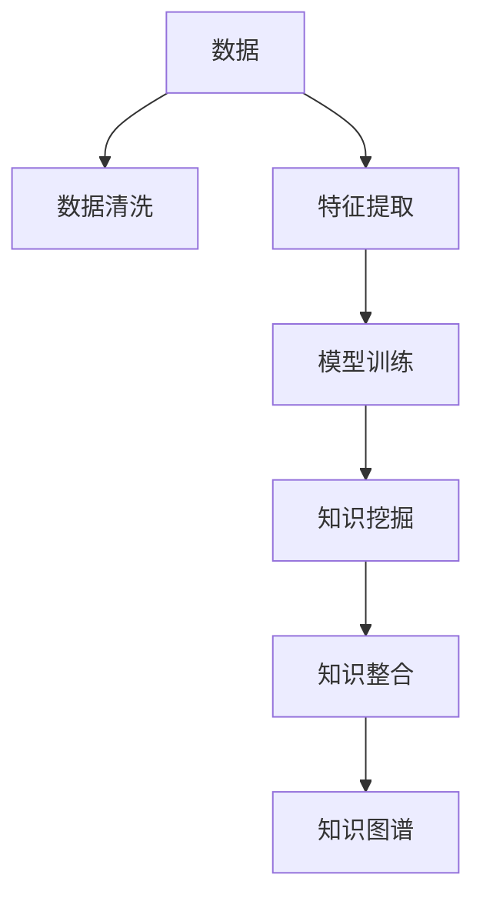

                 

## 1. 背景介绍

### 1.1 问题由来

随着数字化的加速和信息爆炸，各行各业都积累了海量的数据和知识。然而，这些数据和知识并没有被充分利用，很多企业仍然面临着知识孤岛的问题：

- 大量数据和信息分散在各个业务系统中，无法形成统一的知识体系；
- 组织内部的知识沉淀和创新能力不足，难以形成高效的协作和创新机制；
- 外部信息获取和整合效率低下，难以快速响应市场变化和客户需求。

为了解决这些问题，知识管理（Knowledge Management, KM）成为了一个热门话题。传统知识管理往往依靠人工文档整理、专家推荐等手段，但这些方法不仅效率低下，还容易产生信息遗漏和误导。因此，为了更高效地发现、整合和利用知识，新一代的知识管理方式——知识发现（Knowledge Discovery, KD）引擎应运而生。

### 1.2 问题核心关键点

知识发现引擎通过自动化的方式，从大量数据和信息中提取有用的知识，并形成易于检索和利用的知识库。具体而言，它的核心任务包括：

- **数据清洗**：从原始数据中识别和处理噪声和缺失值，提升数据质量。
- **特征提取**：对数据进行特征工程，提取出对知识发现有帮助的特征。
- **模型训练**：使用机器学习模型对数据进行建模，识别出潜在的知识模式和关联关系。
- **知识挖掘**：利用挖掘算法对模型输出进行分析和解释，发现有用的知识片段。
- **知识整合**：将挖掘到的知识片段整合成系统化的知识图谱或知识库。

知识发现引擎的关键在于算法的选择和优化，不同的算法适用于不同的应用场景和数据类型。本文将详细阐述知识发现引擎的核心概念和算法原理，并结合具体案例进行分析。

## 2. 核心概念与联系

### 2.1 核心概念概述

知识发现引擎（Knowledge Discovery Engine, KDE）的核心概念包括以下几点：

- **知识发现**：指从原始数据中识别和提取出有用知识的过程。
- **数据挖掘**：指从数据中发现有用模式和规律，是知识发现的重要手段之一。
- **机器学习**：指通过数据训练模型，使模型具备预测和推理能力。
- **自然语言处理**：指通过算法将文本数据转换为计算机可理解的形式，是知识发现的重要工具之一。
- **知识图谱**：指将挖掘到的知识组织成图谱形式，便于检索和利用。
- **元数据**：指描述数据及其属性的信息，用于辅助数据处理和知识发现。

这些概念之间的逻辑关系可以通过以下Mermaid流程图来展示：



这个流程图展示的知识发现引擎的核心概念及其之间的关系：

1. 原始数据经过数据清洗和特征提取，进入模型训练环节。
2. 训练后的模型通过知识挖掘，发现潜在的知识模式。
3. 挖掘出的知识通过知识整合，形成系统化的知识图谱或知识库。

这些概念共同构成了知识发现引擎的框架，使其能够高效地从数据中提取有用知识。

## 3. 核心算法原理 & 具体操作步骤

### 3.1 算法原理概述

知识发现引擎的核心算法主要包括以下几类：

- **统计分析算法**：如聚类、分类、关联规则等，用于发现数据中的统计规律和模式。
- **机器学习算法**：如回归、决策树、神经网络等，用于建模并预测新数据。
- **自然语言处理算法**：如词向量、句法分析、实体识别等，用于处理文本数据。
- **深度学习算法**：如卷积神经网络、循环神经网络、自编码器等，用于复杂的数据特征提取和模式识别。
- **知识图谱构建算法**：如图神经网络、节点嵌入等，用于将知识片段整合成知识图谱。

这些算法通过相互配合，实现了从数据到知识的自动发现和转化。

### 3.2 算法步骤详解

知识发现引擎的一般流程包括以下几个关键步骤：

**Step 1: 数据预处理**

- **数据收集**：收集业务系统中的数据，包括原始数据、元数据等。
- **数据清洗**：对数据进行去重、去噪、填充缺失值等处理，提升数据质量。
- **数据整合**：将来自不同系统、格式的数据进行统一和整合，构建统一的数据集。

**Step 2: 特征提取**

- **特征选择**：根据业务需求和算法要求，选择合适的特征进行提取。
- **特征工程**：对数据进行分箱、标准化、归一化等处理，提升特征的统计稳定性。
- **特征转换**：将原始数据转换为算法可用的特征形式，如词向量、句法树等。

**Step 3: 模型训练**

- **选择模型**：根据数据类型和业务需求，选择合适的机器学习或深度学习模型。
- **训练模型**：使用训练数据对模型进行训练，调整模型参数，提高模型精度。
- **验证模型**：使用验证数据对模型进行验证，评估模型性能，避免过拟合。

**Step 4: 知识挖掘**

- **模式发现**：通过模型输出，发现数据中的潜在模式和关联关系。
- **规则提取**：从模式中提取有用的规则和规律，形成业务规则库。
- **异常检测**：利用模型输出，检测数据中的异常值和噪声，提升数据质量。

**Step 5: 知识整合**

- **知识图谱构建**：将挖掘到的知识片段整合成图谱形式，便于检索和利用。
- **知识库构建**：将图谱中的知识片段整合成知识库，存储和管理。
- **知识可视化**：通过图表、报表等形式，展示知识发现的结果，便于理解和使用。

以上是知识发现引擎的一般流程。在实际应用中，还需要根据具体任务和数据特点进行优化设计，如改进数据清洗算法，引入更多特征工程技术，搜索最优的模型参数组合等，以进一步提升知识发现的效果。

### 3.3 算法优缺点

知识发现引擎具有以下优点：

1. **高效性**：通过自动化手段，能够快速处理大量数据，发现有用知识。
2. **准确性**：通过选择合适的算法和模型，能够提升知识发现的精度和可靠性。
3. **通用性**：适用于各种数据类型和业务场景，能够灵活应对不同需求。
4. **可扩展性**：能够随着数据规模的增长，不断优化算法和模型，提升知识发现的能力。

同时，该方法也存在一定的局限性：

1. **数据依赖**：知识发现依赖于数据的质量和完整性，数据偏差可能影响发现结果。
2. **算法复杂性**：复杂的算法需要较高的计算资源和时间成本，难以实时处理大规模数据。
3. **业务理解**：算法的设计和优化需要深入理解业务背景，否则容易产生误导性结果。
4. **结果解释**：挖掘出的知识可能需要人工解释和验证，过程复杂且耗时。

尽管存在这些局限性，但就目前而言，知识发现引擎仍是知识管理的重要工具，在金融、医疗、制造等领域得到了广泛应用。未来相关研究的重点在于如何进一步降低算法复杂度，提高实时处理能力，同时兼顾结果的可解释性和业务适应性。

### 3.4 算法应用领域

知识发现引擎在多个领域中得到了广泛应用，例如：

- **金融风控**：通过分析交易数据，识别潜在的欺诈行为和风险。
- **医疗诊断**：通过分析患者数据，发现疾病模式和相关因素。
- **制造业质量控制**：通过分析生产数据，检测设备异常和工艺缺陷。
- **市场营销**：通过分析用户数据，发现用户偏好和行为模式。
- **物流管理**：通过分析运输数据，优化物流路径和运输调度。
- **能源管理**：通过分析能源数据，发现能源消耗模式和优化方案。

除了上述这些经典应用外，知识发现引擎还被创新性地应用到更多场景中，如智能推荐、智能客服、智能安防等，为各行各业提供了新的决策支持手段。

## 4. 数学模型和公式 & 详细讲解 & 举例说明

### 4.1 数学模型构建

知识发现引擎的数学模型主要包括以下几类：

- **聚类算法**：如K-Means、层次聚类、DBSCAN等，用于发现数据中的聚类结构。
- **分类算法**：如决策树、随机森林、支持向量机等，用于分类预测。
- **关联规则算法**：如Apriori、FP-Growth等，用于发现数据中的关联关系。
- **回归算法**：如线性回归、逻辑回归、岭回归等，用于预测连续数值。
- **深度学习模型**：如卷积神经网络（CNN）、循环神经网络（RNN）、自编码器（AE）等，用于复杂数据特征提取和模式识别。

这里以回归算法为例，详细讲解其数学模型构建和公式推导过程。

### 4.2 公式推导过程

假设我们有训练集 $D=\{(x_i, y_i)\}_{i=1}^N$，其中 $x_i$ 为输入特征，$y_i$ 为标签。回归算法的目标是通过训练数据，拟合一个回归函数 $f(x; \theta)$，使得预测值 $f(x_i; \theta)$ 尽可能接近真实标签 $y_i$。

常用的回归算法包括线性回归和多项式回归。这里以线性回归为例，其模型形式为：

$$
f(x; \theta) = \theta_0 + \theta_1 x_1 + \theta_2 x_2 + \ldots + \theta_n x_n
$$

其中 $\theta_0, \theta_1, \ldots, \theta_n$ 为回归函数的参数，$n$ 为输入特征的维度。

线性回归的目标是使得预测值与真实标签之间的平方误差最小，即：

$$
\min_{\theta} \frac{1}{N} \sum_{i=1}^N (y_i - f(x_i; \theta))^2
$$

根据梯度下降算法，求解上述优化问题的公式为：

$$
\theta \leftarrow \theta - \eta \frac{1}{N} \sum_{i=1}^N (y_i - f(x_i; \theta))x_i
$$

其中 $\eta$ 为学习率。

通过上述公式，线性回归模型不断迭代更新参数 $\theta$，直到收敛。最终得到的回归函数 $f(x; \theta)$ 能够较好地拟合训练数据，用于预测新数据的标签。

### 4.3 案例分析与讲解

以金融风控为例，知识发现引擎可以从交易数据中发现潜在的欺诈行为。具体而言：

1. **数据收集**：收集银行的交易数据，包括交易金额、时间、地点、用户信息等。
2. **数据清洗**：对数据进行去重、去噪、填充缺失值等处理，提升数据质量。
3. **特征提取**：选择交易金额、时间、地点、用户信息等特征，并进行标准化处理。
4. **模型训练**：使用随机森林等分类算法，训练一个欺诈检测模型。
5. **知识挖掘**：通过模型输出，发现交易中的异常行为，如大额交易、异地交易等。
6. **知识整合**：将挖掘到的异常行为整合成知识库，用于实时监控和预警。

通过知识发现引擎，银行能够高效地识别和防范欺诈行为，减少损失，提升服务质量。

## 5. 项目实践：代码实例和详细解释说明

### 5.1 开发环境搭建

在进行知识发现引擎开发前，我们需要准备好开发环境。以下是使用Python进行Scikit-Learn开发的环境配置流程：

1. 安装Anaconda：从官网下载并安装Anaconda，用于创建独立的Python环境。

2. 创建并激活虚拟环境：
```bash
conda create -n sklearn-env python=3.8 
conda activate sklearn-env
```

3. 安装Scikit-Learn：
```bash
pip install scikit-learn
```

4. 安装各类工具包：
```bash
pip install numpy pandas scikit-learn matplotlib tqdm jupyter notebook ipython
```

完成上述步骤后，即可在`sklearn-env`环境中开始知识发现引擎的实践。

### 5.2 源代码详细实现

这里以线性回归模型为例，给出使用Scikit-Learn库进行知识发现的PyTorch代码实现。

首先，定义回归任务的数据处理函数：

```python
import pandas as pd
import numpy as np

def load_data(filename):
    data = pd.read_csv(filename)
    features = data.drop('label', axis=1).values
    labels = data['label'].values
    return features, labels

# 加载数据集
features, labels = load_data('data.csv')
```

然后，定义模型和优化器：

```python
from sklearn.linear_model import LinearRegression
from sklearn.metrics import mean_squared_error
from sklearn.model_selection import train_test_split

# 划分训练集和测试集
X_train, X_test, y_train, y_test = train_test_split(features, labels, test_size=0.2, random_state=42)

# 定义线性回归模型
model = LinearRegression()

# 训练模型
model.fit(X_train, y_train)

# 评估模型
mse = mean_squared_error(y_test, model.predict(X_test))
print(f'Mean Squared Error: {mse:.2f}')
```

最后，启动知识发现流程：

```python
from sklearn.model_selection import cross_val_score

# 使用交叉验证评估模型
scores = cross_val_score(model, features, labels, cv=5)
print(f'Cross-Validation Scores: {scores}')
```

以上就是使用Scikit-Learn对线性回归模型进行知识发现的完整代码实现。可以看到，通过Scikit-Learn的封装，我们能够快速构建并训练线性回归模型，进行回归任务的预测。

### 5.3 代码解读与分析

让我们再详细解读一下关键代码的实现细节：

**load_data函数**：
- 从文件中加载数据集，提取特征和标签，并返回。

**X_train, X_test, y_train, y_test = train_test_split函数**：
- 将数据集划分为训练集和测试集，比例为80:20。
- 设置随机种子为42，确保结果可复现。

**LinearRegression模型**：
- 使用Scikit-Learn内置的线性回归模型，自动拟合回归函数。

**mean_squared_error函数**：
- 计算测试集上的均方误差，评估模型预测的准确性。

**cross_val_score函数**：
- 使用交叉验证评估模型性能，输出5个折叠的评估结果。

通过这些代码，可以看出Scikit-Learn的强大封装能力，使得知识发现过程变得简洁高效。开发者可以将更多精力放在数据处理、模型优化等高层逻辑上，而不必过多关注底层的实现细节。

当然，工业级的系统实现还需考虑更多因素，如模型的保存和部署、超参数的自动搜索、更灵活的特征工程等。但核心的知识发现范式基本与此类似。

## 6. 实际应用场景

### 6.1 金融风控

知识发现引擎在金融风控领域有广泛应用。通过分析交易数据，知识发现引擎可以发现潜在的欺诈行为和风险，为金融机构提供决策支持。具体而言：

1. **数据清洗**：从原始交易数据中提取必要特征，如交易金额、时间、地点、用户信息等。
2. **特征提取**：选择相关特征，并进行标准化处理。
3. **模型训练**：使用随机森林等分类算法，训练欺诈检测模型。
4. **知识挖掘**：通过模型输出，发现交易中的异常行为，如大额交易、异地交易等。
5. **知识整合**：将挖掘到的异常行为整合成知识库，用于实时监控和预警。

通过知识发现引擎，金融机构能够高效地识别和防范欺诈行为，减少损失，提升服务质量。

### 6.2 医疗诊断

在医疗诊断领域，知识发现引擎可以从患者数据中发现疾病模式和相关因素，辅助医生进行诊断和治疗。具体而言：

1. **数据收集**：收集医院的患者数据，包括病历、检查结果、用药记录等。
2. **数据清洗**：对数据进行去重、去噪、填充缺失值等处理，提升数据质量。
3. **特征提取**：选择相关特征，并进行标准化处理。
4. **模型训练**：使用深度学习模型，训练疾病诊断模型。
5. **知识挖掘**：通过模型输出，发现患者中的异常情况，如病情恶化、药物副作用等。
6. **知识整合**：将挖掘到的异常情况整合成知识库，用于实时监控和预警。

通过知识发现引擎，医疗机构能够更高效地诊断和治疗患者，提升医疗服务水平。

### 6.3 制造业质量控制

在制造业质量控制领域，知识发现引擎可以从生产数据中发现设备异常和工艺缺陷，提高生产效率和产品质量。具体而言：

1. **数据收集**：收集生产数据，包括设备状态、工艺参数、产品质量等。
2. **数据清洗**：对数据进行去重、去噪、填充缺失值等处理，提升数据质量。
3. **特征提取**：选择相关特征，并进行标准化处理。
4. **模型训练**：使用机器学习模型，训练设备异常检测模型。
5. **知识挖掘**：通过模型输出，发现设备中的异常情况，如设备故障、工艺异常等。
6. **知识整合**：将挖掘到的异常情况整合成知识库，用于实时监控和预警。

通过知识发现引擎，制造企业能够更高效地检测和处理设备异常，提高生产效率和产品质量。

### 6.4 未来应用展望

随着知识发现引擎的发展，其在更多领域中的应用前景广阔：

- **市场营销**：通过分析用户数据，发现用户偏好和行为模式，优化营销策略。
- **物流管理**：通过分析运输数据，优化物流路径和运输调度，提高物流效率。
- **能源管理**：通过分析能源数据，发现能源消耗模式和优化方案，降低能源成本。
- **智慧城市**：通过分析城市数据，发现城市运行规律和优化方案，提升城市管理水平。

知识发现引擎将为各行各业提供新的决策支持手段，推动智能化转型升级。未来，随着算法的不断优化和算力的不断提升，知识发现引擎将在更广泛的场景中发挥作用，成为智能化时代的重要引擎。

## 7. 工具和资源推荐

### 7.1 学习资源推荐

为了帮助开发者系统掌握知识发现引擎的理论基础和实践技巧，这里推荐一些优质的学习资源：

1. 《数据挖掘与统计学习》书籍：介绍了数据挖掘和统计学习的基本概念和算法，适合初学者入门。
2. 《机器学习实战》书籍：通过实际案例展示了机器学习算法的应用，适合动手实践。
3. 《Python数据科学手册》书籍：全面介绍了Python在数据科学领域的应用，包括数据处理、机器学习等。
4. Kaggle网站：全球最大的数据科学竞赛平台，提供了丰富的数据集和竞赛项目，适合实战训练。
5. Coursera平台：提供了大量机器学习和数据科学课程，由名校教授授课，内容全面且深入。

通过对这些资源的学习实践，相信你一定能够快速掌握知识发现引擎的精髓，并用于解决实际的NLP问题。

### 7.2 开发工具推荐

高效的开发离不开优秀的工具支持。以下是几款用于知识发现引擎开发的常用工具：

1. Python：简单易用的编程语言，支持丰富的第三方库和工具，适合快速迭代研究。
2. Scikit-Learn：基于Python的机器学习库，提供了大量常用的算法和工具，适合数据科学实践。
3. TensorFlow：由Google主导开发的深度学习框架，生产部署方便，适合大规模工程应用。
4. PyTorch：基于Python的深度学习框架，灵活高效，适合研究实验。
5. Weights & Biases：模型训练的实验跟踪工具，可以记录和可视化模型训练过程中的各项指标，方便对比和调优。
6. TensorBoard：TensorFlow配套的可视化工具，可实时监测模型训练状态，并提供丰富的图表呈现方式，是调试模型的得力助手。

合理利用这些工具，可以显著提升知识发现引擎的开发效率，加快创新迭代的步伐。

### 7.3 相关论文推荐

知识发现引擎的发展源于学界的持续研究。以下是几篇奠基性的相关论文，推荐阅读：

1. 《数据挖掘：概念与技术》书籍：系统介绍了数据挖掘的基本概念和技术，适合全面了解知识发现领域。
2. 《统计学习》书籍：介绍了统计学习的基本理论和算法，适合深入理解知识发现的核心算法。
3. 《机器学习》书籍：由Tom Mitchell撰写，全面介绍了机器学习的基本概念和算法，适合机器学习初学者。
4. 《深度学习》书籍：由Ian Goodfellow撰写，深入介绍了深度学习的基本理论和算法，适合深入理解深度学习在知识发现中的应用。
5. 《An Introduction to Statistical Learning》书籍：系统介绍了统计学习的理论和技术，适合初学者入门。

这些论文代表了大规模知识发现技术的发展脉络。通过学习这些前沿成果，可以帮助研究者把握学科前进方向，激发更多的创新灵感。

## 8. 总结：未来发展趋势与挑战

### 8.1 总结

本文对知识发现引擎进行了全面系统的介绍。首先阐述了知识发现引擎的研究背景和意义，明确了知识发现引擎在知识管理中的重要价值。其次，从原理到实践，详细讲解了知识发现引擎的数学原理和关键步骤，给出了知识发现引擎的完整代码实例。同时，本文还广泛探讨了知识发现引擎在金融、医疗、制造业等多个领域的应用前景，展示了知识发现引擎的巨大潜力。此外，本文精选了知识发现引擎的学习资源，力求为读者提供全方位的技术指引。

通过本文的系统梳理，可以看到，知识发现引擎正在成为知识管理的重要工具，极大地拓展了数据和信息的应用边界，为各行各业带来了新的价值。未来，伴随数据规模的不断增长和算法的不断优化，知识发现引擎必将在更广泛的场景中发挥作用，推动各行各业的智能化转型升级。

### 8.2 未来发展趋势

展望未来，知识发现引擎将呈现以下几个发展趋势：

1. **算法复杂性下降**：随着深度学习等技术的成熟，知识发现算法的复杂度有望逐步降低，实时处理大规模数据成为可能。
2. **应用场景扩展**：知识发现引擎将在更多领域中得到应用，如智能推荐、智能客服、智能安防等，为各行各业提供新的决策支持手段。
3. **跨领域融合**：知识发现引擎将与其他人工智能技术进行更深入的融合，如自然语言处理、计算机视觉等，实现多模态信息的协同建模。
4. **知识图谱发展**：知识图谱将成为知识发现的重要形式，通过图谱化展现知识，提升知识的检索和利用效率。
5. **智能算法演进**：知识发现引擎将引入更多智能算法，如强化学习、因果推断等，提升知识发现的效果和鲁棒性。
6. **联邦学习应用**：知识发现引擎将在联邦学习框架下，实现知识发现任务的分布式计算，提升数据安全性和隐私保护。

以上趋势凸显了知识发现引擎的广阔前景。这些方向的探索发展，必将进一步提升知识发现引擎的能力，使其成为人工智能时代的核心工具。

### 8.3 面临的挑战

尽管知识发现引擎已经取得了瞩目成就，但在迈向更加智能化、普适化应用的过程中，它仍面临着诸多挑战：

1. **数据质量问题**：知识发现引擎依赖于高质量的数据，数据偏差和噪声可能导致误导性结果。
2. **模型复杂性**：复杂的模型需要较高的计算资源和时间成本，难以实时处理大规模数据。
3. **业务理解难度**：算法的设计和优化需要深入理解业务背景，否则容易产生误导性结果。
4. **结果解释困难**：挖掘出的知识可能需要人工解释和验证，过程复杂且耗时。
5. **算法鲁棒性不足**：算法在处理异常数据和噪声时，容易产生误报和漏报。
6. **隐私保护问题**：知识发现引擎涉及大量的敏感数据，如何保护数据隐私和安全，需要更多的技术和法规支持。

正视知识发现引擎面临的这些挑战，积极应对并寻求突破，将使知识发现引擎走向成熟，为各行各业提供更可靠、高效的决策支持手段。

### 8.4 研究展望

未来，在知识发现引擎的研究中，以下几个方向值得探索：

1. **强化学习在知识发现中的应用**：将强化学习思想引入知识发现，提升知识发现过程的自动化和智能性。
2. **因果推理在知识发现中的应用**：引入因果推断方法，提升知识发现的鲁棒性和可信度。
3. **联邦学习在知识发现中的应用**：在联邦学习框架下，实现知识发现的分布式计算，提升数据安全性和隐私保护。
4. **多模态数据融合**：将知识发现技术与自然语言处理、计算机视觉等技术结合，实现多模态数据的协同建模。
5. **知识发现与知识图谱的融合**：将知识发现技术与知识图谱技术结合，提升知识检索和利用效率。
6. **智能算法的发展**：探索更多智能算法，如深度强化学习、因果推理等，提升知识发现的精度和鲁棒性。

这些研究方向的探索，必将引领知识发现引擎技术迈向更高的台阶，为各行各业提供更可靠、高效的决策支持手段。面向未来，知识发现引擎需要与其他人工智能技术进行更深入的融合，共同推动知识发现技术的进步。

## 9. 附录：常见问题与解答

**Q1：知识发现引擎是否适用于所有业务场景？**

A: 知识发现引擎适用于各种业务场景，但其效果依赖于数据的质量和特征工程的质量。对于数据质量和特征工程要求较高的场景，需要更多的人工干预和优化。

**Q2：如何选择合适的算法？**

A: 选择合适的算法需要考虑多个因素，包括数据类型、业务需求、计算资源等。通常可以通过以下步骤选择：
1. 确定问题类型，是分类、回归、聚类等。
2. 选择常见的算法进行试验。
3. 通过交叉验证等方法评估模型效果。
4. 选择效果最佳的算法。

**Q3：如何提高知识发现的精度？**

A: 提高知识发现的精度需要从多个方面进行优化，包括：
1. 数据清洗和特征工程：提升数据质量和特征工程的质量。
2. 算法选择和优化：选择合适的算法，并进行调参优化。
3. 模型集成：将多个模型进行集成，取平均或投票，提升精度。
4. 数据增强：通过数据增强技术，提升模型的泛化能力。

**Q4：知识发现引擎在实际部署中需要注意哪些问题？**

A: 知识发现引擎在实际部署中需要注意以下问题：
1. 模型裁剪和压缩：优化模型大小，提高推理效率。
2. 模型服务化：将模型封装为标准化的API，便于集成调用。
3. 数据隐私和安全：保护数据隐私，防止泄露和滥用。
4. 实时监控和预警：实时监控模型性能，及时预警异常。
5. 系统集成和接口设计：与业务系统集成，提供统一的接口设计。

通过合理设计和优化，知识发现引擎可以在实际应用中发挥最大效用，推动业务智能化转型升级。

---

作者：禅与计算机程序设计艺术 / Zen and the Art of Computer Programming

