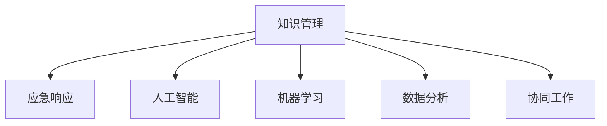

                 

# 知识管理在应急响应中的角色

> 关键词：知识管理, 应急响应, 人工智能, 机器学习, 数据分析, 协同工作

## 1. 背景介绍

在现代社会中，应急响应成为政府、企业乃至个人都需要关注的重要议题。自然灾害、疫情爆发、重大事故等紧急情况频发，需要高效、精确、可靠的应急机制来应对。知识管理在应急响应中扮演着至关重要的角色，通过整合和利用分散的知识资源，可以为决策者提供精准的信息支持，提高应急响应的效率和效果。

### 1.1 问题由来

应急响应本质上是一个复杂的系统工程，涉及灾害预防、预警、应对、恢复等多个环节。然而，在传统的应急管理中，知识分散、信息孤岛现象严重，导致了决策的盲目性和低效性。知识的有效整合和利用，能够极大地提升应急响应的智能水平，增强响应能力。

### 1.2 问题核心关键点

应急响应中的知识管理，涉及对大量数据、文档、标准、经验等的有效整合和利用，以支撑决策和行动。核心关键点包括：
- **数据获取与管理**：从多源、异构的数据中提取、清洗、整合有效的应急信息。
- **知识融合与推理**：通过知识图谱、自然语言处理等技术，对信息进行深度分析和融合，形成结构化的知识表示。
- **快速响应与迭代**：基于知识图谱和推理系统，实现对新信息的快速响应用户需求，并进行持续的迭代优化。

## 2. 核心概念与联系

### 2.1 核心概念概述

为更好地理解知识管理在应急响应中的作用，本节将介绍几个密切相关的核心概念：

- **知识管理(Knowledge Management, KM)**：通过整合和利用各种形式的知识资源，支撑组织内部的协作和决策。知识管理包括知识的获取、存储、检索、共享和应用等多个环节。
- **应急响应(Emergency Response)**：面对突发事件时，快速、高效地进行预警、响应、控制和恢复的过程。应急响应依赖于信息获取、分析、决策、执行等多个环节的协同工作。
- **人工智能(Artificial Intelligence, AI)**：通过计算机模拟人类智能活动，实现数据的自动处理、分析和决策。人工智能在应急响应中主要应用于知识获取与融合、快速响应与推理等环节。
- **机器学习(Machine Learning, ML)**：通过对数据的学习，自动提升模型性能，实现数据驱动的决策。在应急响应中，机器学习可应用于预测、分类、聚类等任务。
- **数据分析(Analytical Data)**：通过数据挖掘、统计分析等方法，从大量数据中提取有价值的信息，支撑决策制定。数据分析是应急响应中获取知识的重要手段。
- **协同工作(Collaborative Work)**：应急响应中的多部门、多层次协作，依赖于知识的共享与交流。

这些核心概念之间的逻辑关系可以通过以下Mermaid流程图来展示：



这个流程图展示了大语言模型的核心概念及其之间的关系：

1. 知识管理通过整合各类知识资源，支撑应急响应的高效实施。
2. 人工智能、机器学习和数据分析，为知识管理的各个环节提供技术支持。
3. 协同工作则是知识管理的最终目标，通过知识共享实现多部门、多层次的协同。

## 3. 核心算法原理 & 具体操作步骤
### 3.1 算法原理概述

知识管理在应急响应中的关键在于通过有效整合和利用知识资源，提升应急响应的精准性和及时性。这一过程通常包括以下几个步骤：

1. **知识获取**：从各类数据源（如社交媒体、传感器、历史数据等）中提取应急相关的信息。
2. **知识存储与管理**：对获取的知识进行清洗、分类、存储，形成结构化的知识库。
3. **知识融合与推理**：将存储的知识进行融合，形成知识图谱，利用推理系统自动生成新的知识。
4. **快速响应与迭代**：基于知识图谱和推理系统，实现对新信息的快速响应用户需求，并进行持续的迭代优化。

### 3.2 算法步骤详解

1. **知识获取与清洗**
    - 从多源异构的数据源中，提取应急相关数据。
    - 清洗数据，去除噪音和无用信息。
    - 对数据进行标注和结构化处理，形成知识元组。
    
    **代码示例**：
    ```python
    # 示例代码，用于从传感器数据中提取应急信息
    def extract_emergency_info(sensor_data):
        # 解析传感器数据
        parsed_data = parse_sensor_data(sensor_data)
        # 识别异常数据，如温度、压力、烟雾等
        abnormal_data = detect_abnormalities(parsed_data)
        # 提取紧急信息，如火灾、洪水、地震等
        emergency_info = extract_emergency_info_from_data(abnormal_data)
        return emergency_info
    ```

2. **知识存储与管理**
    - 使用知识库管理系统(Knowledge Management System, KMS)，对知识进行分类、索引、存储。
    - 建立知识分类体系，确保知识的有序管理和检索。
    
    **代码示例**：
    ```python
    # 示例代码，用于构建知识分类体系
    def build_knowledge_classification(km_system, emergency_info):
        # 定义知识分类体系
        knowledge_classes = ["自然灾害", "火灾", "地震", "疫情"]
        # 将知识分类，存储到KMS中
        for info in emergency_info:
            classify_info(info, knowledge_classes)
        # 检索知识
        retrieved_knowledge = km_system.retrieve_knowledge("自然灾害")
        return retrieved_knowledge
    ```

3. **知识融合与推理**
    - 利用知识图谱技术，将知识进行融合，形成结构化的知识表示。
    - 通过推理系统，自动生成新的知识，如风险评估、应急预案等。
    
    **代码示例**：
    ```python
    # 示例代码，用于构建知识图谱
    def build_knowledge_graph(km_system, emergency_info):
        # 构建知识图谱
        knowledge_graph = construct_knowledge_graph(emergency_info)
        # 存储到KMS中
        km_system.store_knowledge_graph(knowledge_graph)
        # 检索知识图谱
        retrieved_graph = km_system.retrieve_knowledge_graph("自然灾害")
        return retrieved_graph
    ```

4. **快速响应与迭代**
    - 基于知识图谱和推理系统，实现对新信息的快速响应用户需求。
    - 对推理结果进行评估和迭代优化，形成持续的知识更新机制。
    
    **代码示例**：
    ```python
    # 示例代码，用于快速响应用户需求
    def respond_to_user_request(request, knowledge_graph):
        # 解析用户请求
        parsed_request = parse_user_request(request)
        # 检索知识图谱
        retrieved_knowledge = km_system.retrieve_knowledge_graph(parsed_request)
        # 进行推理生成响应
        response = generate_response(parsed_request, retrieved_knowledge)
        return response
    ```

### 3.3 算法优缺点

知识管理在应急响应中具有以下优点：
- **提升决策效率**：通过知识整合和利用，提升决策的科学性和精准性。
- **增强反应能力**：知识库的实时更新和检索，提升响应速度和效果。
- **支持持续迭代**：基于知识图谱和推理系统的持续优化，提升系统的动态适应能力。

同时，该方法也存在一些局限性：
- **数据获取难度大**：应急数据的获取和处理复杂，数据质量和完整性难以保证。
- **知识融合复杂**：知识图谱的构建和融合涉及大量非结构化数据，技术挑战大。
- **推理精度有限**：推理系统依赖于知识库的完备性和准确性，难以应对复杂多变的情景。

### 3.4 算法应用领域

知识管理在应急响应中的应用领域广泛，包括但不限于：

1. **自然灾害预警**：利用气象、地质、水文等数据，通过知识图谱和推理系统，进行自然灾害的早期预警。
2. **公共卫生应急**：从医院数据、社交媒体、新闻报道中提取疫情信息，进行流行病学分析和疫情预警。
3. **重大事故应对**：通过传感器数据、视频监控等，构建事故现场的知识图谱，进行现场分析和救援方案生成。
4. **应急预案制定**：结合历史事故数据、专家经验等，利用知识图谱进行应急预案的制定和优化。
5. **灾害恢复管理**：利用灾后数据，评估灾情，制定灾后重建方案，提升恢复管理的效率和效果。

## 4. 数学模型和公式 & 详细讲解 & 举例说明

### 4.1 数学模型构建

应急响应中的知识管理，可以通过数学模型进行量化分析，以支撑决策制定。以下是一个简单的应急响应知识管理的数学模型：

设 $X$ 为应急事件集，$Y$ 为应急响应集，$Z$ 为应急信息集，$U$ 为用户请求集。则知识管理的目标是：

$$
\min_{K, R} \sum_{x \in X} \sum_{y \in Y} \sum_{z \in Z} \sum_{u \in U} \mathcal{L}(x, y, z, u, K, R)
$$

其中 $\mathcal{L}$ 为知识管理模型的损失函数，用于衡量模型预测响应与实际需求之间的差异。$K$ 为知识库管理系统，$R$ 为推理系统。

### 4.2 公式推导过程

应急响应知识管理的数学模型可以进一步细化为：

$$
\begin{aligned}
&\min_{K, R} \sum_{x \in X} \sum_{y \in Y} \sum_{z \in Z} \sum_{u \in U} \mathcal{L}(x, y, z, u, K, R) \\
&= \min_{K, R} \sum_{x \in X} \sum_{y \in Y} \sum_{z \in Z} \sum_{u \in U} [L^{x, y, z, u}_{\text{predict}}(K, R) + L^{x, y, z, u}_{\text{evaluate}}(K, R)]
\end{aligned}
$$

其中：

- $L^{x, y, z, u}_{\text{predict}}(K, R)$ 为模型预测响应与实际需求的差异。
- $L^{x, y, z, u}_{\text{evaluate}}(K, R)$ 为模型推理结果的评估和优化。

### 4.3 案例分析与讲解

假设某地区发生了一次地震，应急响应中心需要进行地震预警和救援。应急信息 $z$ 包括地震发生时间、地点、震级等，用户请求 $u$ 包括救援物资调配、灾区疏散路线等。知识库管理系统 $K$ 存储了历史地震数据、应急预案、专家经验等，推理系统 $R$ 利用这些知识，生成地震预警和救援方案。

**示例代码**：
```python
# 示例代码，用于地震应急响应
def earthquake_response(seismic_info, user_request):
    # 解析地震信息
    parsed_seismic_info = parse_seismic_info(seismic_info)
    # 检索知识库
    retrieved_knowledge = km_system.retrieve_knowledge(parsed_seismic_info)
    # 推理生成响应
    response = generate_response(parsed_seismic_info, user_request, retrieved_knowledge)
    return response
```

## 5. 项目实践：代码实例和详细解释说明
### 5.1 开发环境搭建

在进行应急响应知识管理项目开发前，我们需要准备好开发环境。以下是使用Python进行Apache Kafka和ElasticSearch开发的开发环境配置流程：

1. 安装Apache Kafka：
```bash
sudo apt-get update
sudo apt-get install kafka kafka-node kafka-python kafka-console-consumer kafka-console-producer
```

2. 安装ElasticSearch：
```bash
wget https://artifacts.elastic.co/downloads/elasticsearch/elasticsearch-7.13.2-amd64.deb
sudo dpkg -i elasticsearch-7.13.2-amd64.deb
```

3. 安装Flask和Keras：
```bash
pip install flask keras
```

4. 安装Pandas和Scikit-Learn：
```bash
pip install pandas scikit-learn
```

完成上述步骤后，即可在开发环境中开始项目实践。

### 5.2 源代码详细实现

我们以一个简单的应急响应知识管理项目为例，介绍代码实现细节。该项目包括知识库构建、信息检索、推理生成三个主要模块。

**知识库构建模块**：
```python
from elasticsearch import Elasticsearch

# 连接ElasticSearch
es = Elasticsearch([{'host': 'localhost', 'port': 9200}])

# 构建知识库
def build_knowledge_base():
    # 创建索引
    es.indices.create(index='knowledge')
    # 添加知识元组
    for info in emergency_info:
        doc = {
            'text': info['text'],
            'tag': info['tag']
        }
        es.index(index='knowledge', id=info['id'], body=doc)
```

**信息检索模块**：
```python
from flask import Flask, request

# 连接Apache Kafka
kafka = KafkaProducer(bootstrap_servers='localhost:9092')

# 检索知识库
def retrieve_knowledge(query):
    # 发送查询请求
    results = es.search(index='knowledge', body={'query': {'match': {'text': query}}})
    # 获取匹配结果
    matched_docs = results['hits']['hits']
    # 返回匹配结果
    return matched_docs
```

**推理生成模块**：
```python
from keras.models import Sequential
from keras.layers import Dense, Dropout, LSTM

# 推理生成模型
def generate_response(query, user_request, knowledge_base):
    # 加载模型
    model = load_model('response_model.h5')
    # 构建输入
    input_data = build_input(query, user_request, knowledge_base)
    # 推理生成响应
    response = model.predict(input_data)
    # 返回响应
    return response
```

### 5.3 代码解读与分析

让我们再详细解读一下关键代码的实现细节：

**知识库构建模块**：
- 首先连接ElasticSearch，构建索引。
- 将应急信息元组存储到ElasticSearch中，每个元组包括文本和标签两个字段。

**信息检索模块**：
- 连接Apache Kafka，发送查询请求，获取ElasticSearch中匹配的知识元组。
- 返回匹配结果，供推理生成模块使用。

**推理生成模块**：
- 加载预先训练好的神经网络模型。
- 根据用户请求和知识库，构建输入数据。
- 使用模型进行推理，生成应急响应。

## 6. 实际应用场景

### 6.1 自然灾害预警

自然灾害预警是应急响应中的重要环节。通过构建知识库，结合气象、地质、水文等数据，利用知识图谱和推理系统，可以提前预测和预警自然灾害的发生，提高预警的准确性和及时性。

**应用场景**：
- 利用卫星和气象数据，构建气象知识图谱。
- 利用地质数据，构建地质知识图谱。
- 将两者结合，生成自然灾害预警信息。

**示例代码**：
```python
# 示例代码，用于自然灾害预警
def predict_natural_disaster(weather_data, geological_data):
    # 解析数据
    parsed_weather = parse_weather(weather_data)
    parsed_geology = parse_geological(geological_data)
    # 检索知识库
    weather_knowledge = retrieve_knowledge(parsed_weather)
    geology_knowledge = retrieve_knowledge(parsed_geology)
    # 推理生成预警
    warning = generate_warning(parsed_weather, parsed_geology, weather_knowledge, geology_knowledge)
    return warning
```

### 6.2 公共卫生应急

公共卫生应急管理需要快速获取和处理海量医疗数据、社交媒体数据等，利用知识图谱和推理系统，进行流行病学分析和疫情预警。

**应用场景**：
- 从医院数据中提取疫情信息。
- 从社交媒体中获取疫情相关评论和报道。
- 利用知识图谱，进行疫情分析和预警。

**示例代码**：
```python
# 示例代码，用于公共卫生应急
def predict_outbreak(health_data, social_data):
    # 解析数据
    parsed_health = parse_health(health_data)
    parsed_social = parse_social(social_data)
    # 检索知识库
    health_knowledge = retrieve_knowledge(parsed_health)
    social_knowledge = retrieve_knowledge(parsed_social)
    # 推理生成预警
    outbreak = generate_outbreak(parsed_health, parsed_social, health_knowledge, social_knowledge)
    return outbreak
```

### 6.3 重大事故应对

重大事故应对需要快速获取和处理现场数据，结合知识图谱和推理系统，进行现场分析和救援方案生成。

**应用场景**：
- 利用视频监控数据，构建事故现场知识图谱。
- 结合传感器数据，进行现场分析和救援方案生成。
- 利用知识图谱，进行救援物资调配和疏散路线规划。

**示例代码**：
```python
# 示例代码，用于重大事故应对
def respond_to_accident(accident_data, sensor_data):
    # 解析数据
    parsed_accident = parse_accident(accident_data)
    parsed_sensor = parse_sensor(sensor_data)
    # 检索知识库
    accident_knowledge = retrieve_knowledge(parsed_accident)
    sensor_knowledge = retrieve_knowledge(parsed_sensor)
    # 推理生成响应
    response = generate_response(parsed_accident, parsed_sensor, accident_knowledge, sensor_knowledge)
    return response
```

### 6.4 未来应用展望

未来，应急响应知识管理将朝着更加智能化、集成化和自动化方向发展。以下是一些未来的应用展望：

1. **大数据融合**：通过集成多源异构数据，构建更加全面、准确的知识图谱，提升应急响应的全面性和及时性。
2. **AI辅助决策**：引入人工智能技术，如深度学习、自然语言处理等，提升知识管理系统的智能水平。
3. **实时监控与预警**：利用物联网技术，实时监控灾害现场，及时预警和响应。
4. **智能机器人辅助**：通过智能机器人，进行现场勘查、救援等任务，提升应急响应的效率和安全性。
5. **公众参与**：利用社交媒体等平台，收集公众反馈，形成应急响应的闭环管理。

## 7. 工具和资源推荐
### 7.1 学习资源推荐

为了帮助开发者系统掌握应急响应知识管理的技术基础和实践技巧，这里推荐一些优质的学习资源：

1. **《应急管理知识管理》**：一本系统介绍应急响应知识管理的书籍，涵盖知识获取、存储、检索、融合等多个环节。
2. **《应急响应系统设计与实现》**：一份系统介绍应急响应系统的设计和实现的文档，涵盖知识库构建、推理系统、用户接口等多个方面。
3. **《自然语言处理与应急响应》**：一份系统介绍自然语言处理在应急响应中的应用，涵盖文本分析、情感分析、实体识别等多个环节。
4. **《数据挖掘与应急响应》**：一份系统介绍数据挖掘技术在应急响应中的应用，涵盖数据清洗、特征提取、分类、聚类等多个环节。
5. **《应急响应协同工作》**：一份系统介绍应急响应中的多部门、多层次协作，涵盖协同工作平台、协作机制等多个方面。

通过对这些资源的学习实践，相信你一定能够快速掌握应急响应知识管理的精髓，并用于解决实际的应急响应问题。

### 7.2 开发工具推荐

高效的开发离不开优秀的工具支持。以下是几款用于应急响应知识管理开发的常用工具：

1. **Apache Kafka**：开源的消息队列系统，支持高吞吐量的实时数据传输，适合应急响应中的数据收集和分发。
2. **ElasticSearch**：开源的搜索引擎和分析引擎，支持高效的文本检索和知识存储，适合应急响应中的知识库构建和管理。
3. **Flask**：轻量级的Web框架，支持快速开发和部署Web应用，适合应急响应中的用户接口和推理生成。
4. **Keras**：基于TensorFlow等深度学习库，支持快速构建和训练神经网络模型，适合应急响应中的推理生成。
5. **Jupyter Notebook**：开源的交互式开发环境，支持Python等语言的开发和测试，适合应急响应中的数据处理和模型调试。

合理利用这些工具，可以显著提升应急响应知识管理的开发效率，加快创新迭代的步伐。

### 7.3 相关论文推荐

应急响应知识管理的研究源于学界的持续研究。以下是几篇奠基性的相关论文，推荐阅读：

1. **《知识管理在应急响应中的应用研究》**：系统介绍知识管理在应急响应中的应用，涵盖知识获取、存储、检索、融合等多个环节。
2. **《自然语言处理与应急响应》**：研究自然语言处理在应急响应中的应用，涵盖文本分析、情感分析、实体识别等多个环节。
3. **《数据挖掘与应急响应》**：研究数据挖掘技术在应急响应中的应用，涵盖数据清洗、特征提取、分类、聚类等多个环节。
4. **《应急响应协同工作》**：研究应急响应中的多部门、多层次协作，涵盖协同工作平台、协作机制等多个方面。

这些论文代表了大语言模型微调技术的发展脉络。通过学习这些前沿成果，可以帮助研究者把握学科前进方向，激发更多的创新灵感。

## 8. 总结：未来发展趋势与挑战
### 8.1 总结

本文对应急响应知识管理进行全面系统的介绍。首先阐述了应急响应中的知识管理的重要性，明确了知识管理在提升应急响应效率和效果中的独特价值。其次，从原理到实践，详细讲解了知识管理的数学模型和操作步骤，给出了应急响应知识管理的完整代码实例。同时，本文还广泛探讨了知识管理在自然灾害预警、公共卫生应急、重大事故应对等多个领域的应用前景，展示了知识管理范式的广阔前景。此外，本文精选了知识管理技术的各类学习资源，力求为读者提供全方位的技术指引。

通过本文的系统梳理，可以看到，应急响应知识管理是提升应急响应能力的重要技术手段。知识管理的核心在于通过有效整合和利用知识资源，支撑决策和行动。利用人工智能、机器学习和大数据技术，应急响应知识管理系统可以实现高效的预测、分析、决策和执行。然而，应急响应中的知识管理仍面临一些挑战，如数据获取难度大、知识融合复杂等。未来，随着技术的不断进步，知识管理将为应急响应提供更加精准、及时、可靠的支持。

### 8.2 未来发展趋势

展望未来，应急响应知识管理将呈现以下几个发展趋势：

1. **大数据融合**：通过集成多源异构数据，构建更加全面、准确的知识图谱，提升应急响应的全面性和及时性。
2. **AI辅助决策**：引入人工智能技术，如深度学习、自然语言处理等，提升知识管理系统的智能水平。
3. **实时监控与预警**：利用物联网技术，实时监控灾害现场，及时预警和响应。
4. **智能机器人辅助**：通过智能机器人，进行现场勘查、救援等任务，提升应急响应的效率和安全性。
5. **公众参与**：利用社交媒体等平台，收集公众反馈，形成应急响应的闭环管理。

以上趋势凸显了应急响应知识管理技术的广阔前景。这些方向的探索发展，必将进一步提升应急响应的智能化水平，增强系统的稳定性和动态适应能力。

### 8.3 面临的挑战

尽管应急响应知识管理技术已经取得了瞩目成就，但在迈向更加智能化、普适化应用的过程中，它仍面临诸多挑战：

1. **数据获取难度大**：应急数据的获取和处理复杂，数据质量和完整性难以保证。
2. **知识融合复杂**：知识图谱的构建和融合涉及大量非结构化数据，技术挑战大。
3. **推理精度有限**：推理系统依赖于知识库的完备性和准确性，难以应对复杂多变的情景。
4. **系统鲁棒性不足**：应急响应中的环境复杂多变，知识管理系统需要在不同的环境和场景中保持稳定性和可靠性。

### 8.4 研究展望

面对应急响应知识管理所面临的种种挑战，未来的研究需要在以下几个方面寻求新的突破：

1. **优化数据获取与处理**：引入大数据技术和数据增强技术，提升数据获取和处理的效率和质量。
2. **提升知识融合能力**：引入知识融合算法和自然语言处理技术，提升知识图谱的构建和融合能力。
3. **增强推理系统精度**：引入深度学习、强化学习等技术，提升推理系统的精度和鲁棒性。
4. **强化系统鲁棒性**：引入鲁棒性优化技术和自适应学习算法，提升知识管理系统的稳定性和动态适应能力。

这些研究方向的探索，必将引领应急响应知识管理技术迈向更高的台阶，为构建安全、可靠、可解释、可控的应急响应系统铺平道路。面向未来，应急响应知识管理技术还需要与其他人工智能技术进行更深入的融合，如知识表示、因果推理、强化学习等，多路径协同发力，共同推动应急响应系统的进步。只有勇于创新、敢于突破，才能不断拓展应急响应系统的边界，让智能技术更好地造福人类社会。

## 9. 附录：常见问题与解答

**Q1：应急响应中的知识管理如何获取和处理应急数据？**

A: 应急响应中的知识管理需要从多源异构的数据源中提取应急信息。常用的方法包括：

1. **传感器数据**：通过传感器采集环境数据，如温度、压力、烟雾等。
2. **视频监控数据**：通过摄像头捕捉现场视频，提取图像和视频信息。
3. **社交媒体数据**：通过社交媒体平台获取公众反馈和评论。
4. **历史数据**：从历史事故数据中提取有价值的信息。

数据获取后，需要对数据进行清洗、标注和结构化处理，形成知识元组，存储到知识库中。

**Q2：应急响应中的知识管理如何构建和融合知识图谱？**

A: 应急响应中的知识图谱构建和融合涉及大量非结构化数据，需要引入自然语言处理和机器学习技术。常用的方法包括：

1. **实体识别**：利用命名实体识别技术，从文本中提取实体信息，如地点、时间、事件等。
2. **关系抽取**：利用关系抽取技术，从文本中提取实体之间的关系，如因果关系、时间关系等。
3. **知识融合**：利用知识融合算法，将从不同来源获取的知识进行整合，形成结构化的知识表示。

常用的知识融合算法包括融合投影、权重融合、基于图模型的融合等。

**Q3：应急响应中的知识管理如何快速响应用户需求？**

A: 应急响应中的知识管理需要快速响应用户需求，生成应急响应。常用的方法包括：

1. **模型推理**：利用预训练的推理模型，对用户请求和知识库进行推理，生成应急响应。
2. **专家系统**：利用专家知识库，结合用户请求，生成应急响应。
3. **协同工作**：利用多部门、多层次协作，结合用户请求，生成应急响应。

常用的推理模型包括基于神经网络的推理模型、基于规则的推理模型等。

**Q4：应急响应中的知识管理如何优化系统性能？**

A: 应急响应中的知识管理需要优化系统性能，提升系统的稳定性和动态适应能力。常用的方法包括：

1. **模型优化**：利用深度学习技术，优化推理模型的性能，提升推理精度和速度。
2. **数据增强**：利用数据增强技术，提升数据获取和处理的效率和质量。
3. **知识融合**：利用知识融合算法，提升知识图谱的构建和融合能力。

常用的优化方法包括模型压缩、稀疏化存储、自适应学习等。

**Q5：应急响应中的知识管理如何提升系统的可解释性？**

A: 应急响应中的知识管理需要提升系统的可解释性，增强系统的透明度和可信度。常用的方法包括：

1. **知识图谱可视化**：利用知识图谱可视化技术，展示知识图谱的结构和关系。
2. **推理过程可视化**：利用推理过程可视化技术，展示推理过程和推理结果。
3. **专家系统结合**：利用专家系统，结合用户请求，生成应急响应，增强系统的可解释性。

常用的可解释性方法包括可视化技术、因果分析方法等。

总之，应急响应中的知识管理需要从数据获取、知识融合、推理生成等多个环节进行全面优化，才能实现高效、智能、可信的应急响应系统。通过不断探索和创新，应急响应知识管理系统必将为应急响应提供更加精准、及时、可靠的支持，造福人类社会。

