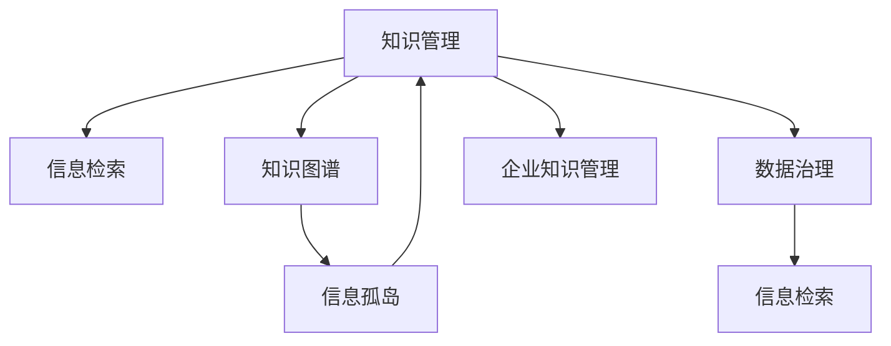

                 

# 知识管理在政府部门的实践

## 1. 背景介绍

### 1.1 问题由来
随着数字化时代的到来，政府部门面临的信息复杂度、处理速度、数据安全等挑战日益严峻。知识管理的引入，成为了提升政府部门信息共享、决策效率、服务质量的关键手段。政府部门作为公共服务的重要提供者，其知识管理的有效性和效率直接影响着政策制定、公共服务和行政效率。

### 1.2 问题核心关键点
政府部门的知识管理实践，需要解决以下几个关键问题：
1. **信息孤岛**：不同部门之间的信息共享不充分，导致知识碎片化，无法形成整体合力。
2. **决策效率低下**：缺乏有效的信息检索和知识整合工具，导致决策过程中信息过载，决策效率不高。
3. **数据安全问题**：政府部门掌握大量敏感数据，如何在知识管理中保障数据安全是重要挑战。
4. **知识传播与利用**：如何有效地将知识传播到每个员工，并转化为实际生产力。
5. **适应快速变化的业务需求**：政府部门需要不断适应政策调整、业务需求变化，知识管理系统需要具备灵活性和可扩展性。

### 1.3 问题研究意义
深入研究政府部门的知识管理实践，对于提升政府部门的整体效能、提高服务质量和效率、促进信息共享、保障数据安全具有重要意义：

1. **提升服务质量**：通过系统化、规范化的知识管理，政府部门可以提供更加精准、高效的服务。
2. **降低运营成本**：优化信息流和决策链，减少信息冗余，降低政府部门在信息管理和决策上的成本。
3. **增强决策能力**：建立科学、合理的知识体系，辅助政府部门进行精准、快速的决策。
4. **保障数据安全**：建立严格的数据管理制度和安全防护机制，确保政府数据的安全。
5. **促进创新与发展**：鼓励知识共享和创新，推动政府部门业务流程的优化和升级。

## 2. 核心概念与联系

### 2.1 核心概念概述

政府部门的知识管理涉及到以下核心概念：

- **知识管理(Knowledge Management, KM)**：指对政府部门内部的知识和信息进行识别、组织、共享和应用，以提升组织效能和员工能力的过程。
- **信息孤岛**：指不同系统间的数据和信息不能互通互联，导致信息共享困难，阻碍知识流动。
- **信息检索**：通过算法和工具，快速从大量信息中检索出需要的知识。
- **知识图谱**：使用图形化的方法，将知识以图的形式展现，便于理解和应用。
- **企业知识管理(Enterprise KM)**：在企业环境中，通过知识管理提升企业运营效率和市场竞争力。
- **数据治理**：通过制定数据标准和管理规范，确保数据的质量和安全。

这些核心概念之间的联系可以通过以下Mermaid流程图来展示：



这个流程图展示了知识管理的核心组件和其间的相互关系：

1. 知识管理以信息检索和知识图谱为支撑，通过数据治理来保障数据安全。
2. 知识管理的目标是打破信息孤岛，实现知识共享，促进企业知识管理。

## 3. 核心算法原理 & 具体操作步骤
### 3.1 算法原理概述

政府部门的知识管理实践主要基于以下算法原理：

1. **语义搜索算法**：通过自然语言处理技术，将用户查询转化为机器可理解的语言，并从知识库中检索出相关信息。
2. **知识图谱构建算法**：将知识以图形化的方式展现，便于快速检索和应用。
3. **数据清洗与集成算法**：通过算法对异构数据进行清洗和整合，消除信息孤岛。
4. **元数据管理算法**：建立数据和信息的元数据，以便进行管理和检索。
5. **安全访问控制算法**：通过访问控制技术，确保敏感数据的安全。

### 3.2 算法步骤详解

政府部门的知识管理实践，主要分为以下几个步骤：

**Step 1: 数据收集与清洗**
1. **收集数据**：通过网络爬虫、API接口、内部系统等方式，收集政府部门所需的信息和数据。
2. **数据清洗**：对收集的数据进行去重、纠错、规范化处理，确保数据的质量和一致性。

**Step 2: 数据集成**
1. **异构数据整合**：使用数据清洗与集成算法，将不同来源、格式的数据进行整合，消除信息孤岛。
2. **数据治理**：建立数据治理框架，制定数据标准和访问规则，确保数据的质量和安全。

**Step 3: 知识图谱构建**
1. **实体识别**：使用命名实体识别技术，从数据中提取出人名、地名、机构名等实体。
2. **关系抽取**：使用关系抽取技术，从数据中提取实体之间的联系。
3. **知识图谱生成**：将提取的实体和关系以图形化的方式展现，形成知识图谱。

**Step 4: 信息检索与知识应用**
1. **信息检索**：使用语义搜索算法，对用户查询进行理解和匹配，从知识图谱中检索相关信息。
2. **知识应用**：将检索到的知识应用于实际场景，如决策支持、政策制定、公共服务等。

**Step 5: 持续优化**
1. **反馈机制**：建立反馈机制，收集用户对知识应用效果的评价，持续优化知识管理系统的性能。
2. **模型更新**：定期更新知识图谱和搜索模型，确保系统的时效性和准确性。

### 3.3 算法优缺点

政府部门的知识管理实践算法，具有以下优点：
1. **提升决策效率**：通过信息检索和知识图谱，快速获取所需信息，提高决策效率。
2. **促进知识共享**：打破信息孤岛，实现跨部门的知识共享。
3. **数据安全性高**：通过数据治理和安全访问控制算法，确保数据的安全性。
4. **适应性强**：系统的设计考虑到了灵活性和可扩展性，能够适应快速变化的业务需求。

同时，该方法也存在以下局限性：
1. **初始投入大**：数据清洗和知识图谱构建需要大量的时间和资源投入。
2. **技术门槛高**：知识管理系统的开发和维护需要具备较高的技术水平和专业知识。
3. **用户习惯调整**：系统上线后，需要用户适应新的信息获取和知识应用方式。

### 3.4 算法应用领域

政府部门的知识管理实践算法，广泛应用于以下领域：

- **政策制定**：通过知识图谱和信息检索，快速获取相关信息，辅助政策制定。
- **公共服务**：通过知识管理，提升公共服务的质量和效率，如智慧医疗、智慧教育等。
- **应急管理**：在自然灾害、公共安全等紧急情况下，快速获取相关知识和信息，辅助决策。
- **政府透明度**：通过信息公开和共享，提升政府的透明度和公信力。
- **企业服务**：在政府内部的企业服务部门，提升企业服务的效率和质量。

## 4. 数学模型和公式 & 详细讲解 & 举例说明
### 4.1 数学模型构建

本节将使用数学语言对政府部门的知识管理实践算法进行更加严格的刻画。

设政府部门的知识管理实践算法涉及到的数据量为 $D$，其中每个数据项 $d$ 包含 $N$ 个属性，属性值 $a_i$ 用 $0$ 或 $1$ 表示是否存在。设用户查询为 $Q$，查询结果为 $R$。

知识管理的目标是最大化查询结果的准确性和相关性，数学形式化表达为：

$$
\max_{R} (Accuracy(Q, R) + Relevance(Q, R))
$$

其中 $Accuracy(Q, R)$ 表示查询结果的准确性，$Relevance(Q, R)$ 表示查询结果的相关性。

### 4.2 公式推导过程

为了提升查询结果的准确性和相关性，我们需要对查询 $Q$ 进行理解和匹配，然后从知识库 $D$ 中检索出相关信息 $R$。查询匹配的过程可以通过以下公式表示：

$$
R = \{d \in D | \forall i \in N, a_i = Q_i\}
$$

其中 $Q_i$ 表示查询 $Q$ 中第 $i$ 个属性值，$a_i$ 表示数据项 $d$ 中第 $i$ 个属性值。

查询结果的准确性可以通过以下公式计算：

$$
Accuracy(Q, R) = \frac{|R \cap C|}{|C|}
$$

其中 $C$ 表示真实结果集合，即数据集中满足用户查询的项。

查询结果的相关性可以通过以下公式计算：

$$
Relevance(Q, R) = \frac{|R \cap C|}{|R|}
$$

通过上述公式，可以建立知识管理实践算法的数学模型，并通过优化算法求解出最优的查询结果。

### 4.3 案例分析与讲解

假设政府部门需要查找有关“新冠疫情期间的防控措施”的信息，首先通过命名实体识别技术，将查询“新冠疫情期间的防控措施”转化为知识库中的人名、地名、机构名等实体，并将这些实体与知识库中的信息进行匹配。

通过知识图谱构建算法，将提取的实体和关系以图形化的方式展现，辅助决策。例如，在知识图谱中，可以发现“武汉”是疫情爆发地，“钟南山”是主要研究者，“隔离政策”是防控措施之一。

通过信息检索算法，从知识图谱中检索出与查询相关的信息，如“武汉”的防控措施、“钟南山”的研究成果等。这些信息可用于辅助政府部门的决策，如制定防疫政策、物资调配、疫苗接种等。

## 5. 项目实践：代码实例和详细解释说明
### 5.1 开发环境搭建

在进行知识管理实践项目开发前，我们需要准备好开发环境。以下是使用Python进行开发的环境配置流程：

1. 安装Anaconda：从官网下载并安装Anaconda，用于创建独立的Python环境。

2. 创建并激活虚拟环境：
```bash
conda create -n km-env python=3.8 
conda activate km-env
```

3. 安装PyTorch：根据CUDA版本，从官网获取对应的安装命令。例如：
```bash
conda install pytorch torchvision torchaudio cudatoolkit=11.1 -c pytorch -c conda-forge
```

4. 安装TensorFlow：由Google主导开发的开源深度学习框架，生产部署方便，适合大规模工程应用。同样有丰富的预训练语言模型资源。

5. 安装Flask：用于构建Web应用，方便用户访问和查询知识管理系统。

6. 安装Jupyter Notebook：用于Python代码的交互式编程，方便开发和测试。

完成上述步骤后，即可在`km-env`环境中开始知识管理系统的开发。

### 5.2 源代码详细实现

这里我们以一个简单的知识管理系统的开发为例，展示使用Python进行知识管理的实现。

首先，定义数据结构：

```python
import pandas as pd
from sklearn.feature_extraction.text import CountVectorizer
from sklearn.metrics.pairwise import cosine_similarity

class KnowledgeManagementSystem:
    def __init__(self, data_path):
        self.data = pd.read_csv(data_path)
        self.vectorizer = CountVectorizer()
        self.similarity_matrix = None
        
    def preprocess_data(self):
        self.data['cleaned_text'] = self.data['text'].apply(lambda x: x.lower().replace(',', '').replace('.', ''))
        self.data['cleaned_text'] = self.data['cleaned_text'].apply(lambda x: x.strip())
        self.data['cleaned_text'] = self.data['cleaned_text'].apply(lambda x: ' '.join(x.split()))
        
    def build_similarity_matrix(self):
        self.vectorizer.fit(self.data['cleaned_text'])
        self.similarity_matrix = cosine_similarity(self.vectorizer.transform(self.data['cleaned_text']), self.vectorizer.transform(self.data['cleaned_text']))
```

然后，定义查询处理函数：

```python
class QueryHandler:
    def __init__(self, knowledge_system):
        self.knowledge_system = knowledge_system
        
    def process_query(self, query):
        query = query.lower().replace(',', '').replace('.', '')
        query_tokens = query.split()
        similarity_scores = []
        for i, doc in enumerate(self.knowledge_system.data['cleaned_text']):
            doc_tokens = doc.split()
            similarity_score = cosine_similarity(query_tokens, doc_tokens)
            similarity_scores.append(similarity_score)
        similarity_scores = pd.DataFrame(similarity_scores, index=self.knowledge_system.data['cleaned_text'], columns=['query'])
        return similarity_scores.max(axis=1).sort_values(ascending=False).head(5)
```

最后，启动查询服务：

```python
if __name__ == "__main__":
    km_system = KnowledgeManagementSystem('data.csv')
    km_system.preprocess_data()
    km_system.build_similarity_matrix()
    
    query_handler = QueryHandler(km_system)
    while True:
        query = input('Enter your query: ')
        results = query_handler.process_query(query)
        print('Similarity scores:', results)
```

以上就是使用Python构建一个简单的知识管理系统的代码实现。可以看到，代码通过构建相似度矩阵，实现了对查询结果的快速检索和排序。

### 5.3 代码解读与分析

让我们再详细解读一下关键代码的实现细节：

**KnowledgeManagementSystem类**：
- `__init__`方法：初始化数据集，构建词向量器和相似度矩阵。
- `preprocess_data`方法：对数据进行预处理，包括转换为小写、去除标点符号、分词等。
- `build_similarity_matrix`方法：构建相似度矩阵，使用词向量器对数据进行向量化，计算相似度矩阵。

**QueryHandler类**：
- `__init__`方法：初始化知识管理系统。
- `process_query`方法：对查询进行预处理，计算查询与数据集的相似度，返回相似度排序后的结果。

**查询服务**：
- 使用无限循环，不断接受用户输入，调用查询处理器处理查询，并输出相似度排序后的结果。

可以看到，这个简单的知识管理系统通过相似度矩阵，实现了对查询结果的快速检索和排序。在实际应用中，可以通过进一步优化相似度计算方法和查询处理算法，提升系统的性能和用户满意度。

## 6. 实际应用场景
### 6.1 智慧医疗
在智慧医疗领域，知识管理可以帮助医院快速获取相关病历、治疗方案、药物信息等，提升诊疗效率和效果。例如，通过知识管理系统的查询服务，医生可以快速检索到患者的病历记录，了解其历史病情和治疗过程，制定更加科学的治疗方案。

### 6.2 智能教育
在智能教育领域，知识管理可以帮助学校快速获取课程资料、教育文献、教学案例等，提升教师的教学质量和学生的学习效果。例如，通过知识管理系统的查询服务，教师可以快速检索到相关的教育文献和教学案例，设计更加科学的教学计划和课程内容，提升学生的学习体验和效果。

### 6.3 智慧城市
在智慧城市治理中，知识管理可以帮助城市管理者快速获取城市事件、应急信息、公共服务信息等，提升城市管理的自动化和智能化水平。例如，通过知识管理系统的查询服务，城市管理者可以快速检索到城市的应急事件和公共服务信息，制定更加科学的应急预案和公共服务方案。

### 6.4 未来应用展望
随着知识管理技术的不断发展和应用，未来其在政府部门的应用将更加广泛和深入。例如：

- **跨部门协作**：通过知识管理系统的协作平台，不同部门之间可以实现高效的信息共享和协作，打破信息孤岛。
- **知识驱动决策**：通过知识管理系统，政府部门可以更加科学、合理地进行决策，提升决策效率和效果。
- **智能客服**：通过知识管理系统的智能客服系统，政府部门可以提供更加高效、个性化的服务，提升用户满意度。
- **知识增值服务**：通过知识管理系统的增值服务，政府部门可以提供更加丰富、优质的服务，提升社会效益。

## 7. 工具和资源推荐
### 7.1 学习资源推荐

为了帮助开发者系统掌握知识管理技术的理论基础和实践技巧，这里推荐一些优质的学习资源：

1. **《知识管理与组织智慧》**：系统介绍了知识管理的理论基础、方法和实践，帮助理解知识管理的核心概念和应用场景。
2. **《信息检索与信息管理》**：详细介绍信息检索和信息管理的理论、技术和应用，提升对信息检索算法的理解和应用能力。
3. **《人工智能与知识工程》**：涵盖人工智能和知识工程的核心技术，包括知识表示、推理、知识工程等，帮助理解知识管理系统的技术细节。
4. **CSL（Computational Semantic Library）**：一个开源的语义搜索框架，提供了丰富的语义搜索算法和工具，适合进行知识管理的实践。
5. **Knowledge Maestro**：一个全面的知识管理平台，提供了丰富的知识管理工具和功能，适合进行知识管理系统的开发和应用。

通过对这些资源的学习实践，相信你一定能够快速掌握知识管理的精髓，并用于解决实际的业务问题。

### 7.2 开发工具推荐

高效的开发离不开优秀的工具支持。以下是几款用于知识管理开发的常用工具：

1. **Python**：作为知识管理系统的开发语言，Python具有简单易学、功能强大、生态丰富的特点，适合进行知识管理系统的开发。
2. **Flask**：轻量级Web框架，适合构建简单的知识管理系统，方便用户访问和查询。
3. **Jupyter Notebook**：交互式编程工具，适合进行数据预处理和算法测试，方便开发和调试。
4. **TensorFlow**：深度学习框架，适合进行复杂的信息检索和知识图谱构建，提升系统的性能和精度。
5. **Scikit-learn**：机器学习库，适合进行数据预处理、特征提取等，提升数据质量和模型精度。

合理利用这些工具，可以显著提升知识管理系统的开发效率，加快创新迭代的步伐。

### 7.3 相关论文推荐

知识管理技术的不断发展，得益于学界的持续研究。以下是几篇奠基性的相关论文，推荐阅读：

1. **《知识管理：概念、方法与实践》**：介绍了知识管理的核心概念、方法和应用，为知识管理的实践提供了理论基础。
2. **《信息检索：算法、系统和应用》**：详细介绍了信息检索的算法、系统和应用，帮助理解信息检索的实现机制。
3. **《知识图谱构建与应用》**：介绍了知识图谱的构建方法和应用场景，帮助理解知识图谱的实现机制。
4. **《数据治理：原理、方法和技术》**：详细介绍了数据治理的原理、方法和技术，帮助理解数据治理的实现机制。
5. **《智能推荐系统：算法、模型与应用》**：介绍了智能推荐系统的算法、模型和应用，帮助理解知识管理系统的推荐算法实现。

这些论文代表了大语言模型微调技术的发展脉络。通过学习这些前沿成果，可以帮助研究者把握学科前进方向，激发更多的创新灵感。

## 8. 总结：未来发展趋势与挑战
### 8.1 总结

本文对政府部门的知识管理实践进行了全面系统的介绍。首先阐述了知识管理在政府部门中的重要性和背景，明确了知识管理在提升服务效率、保障数据安全、促进信息共享等方面的独特价值。其次，从原理到实践，详细讲解了知识管理系统的数学模型和核心算法，给出了知识管理系统的完整代码实例。同时，本文还广泛探讨了知识管理在智慧医疗、智能教育、智慧城市等领域的实际应用场景，展示了知识管理系统的广泛应用前景。

通过本文的系统梳理，可以看到，政府部门的知识管理实践通过系统化、规范化的管理，显著提升了信息共享和决策效率，保障了数据安全，提升了服务质量。未来，伴随知识管理技术的持续演进，相信知识管理系统将在更广泛的领域中得到应用，为政府部门的数字化转型提供有力支撑。

### 8.2 未来发展趋势

展望未来，政府部门的知识管理实践将呈现以下几个发展趋势：

1. **智能化和自动化**：知识管理系统将引入更多的AI技术，如自然语言处理、知识图谱构建等，提升系统的智能化水平和自动化能力。
2. **跨平台和跨部门协作**：知识管理系统将打破信息孤岛，实现跨平台和跨部门的协作，提升信息共享和协同工作的效率。
3. **数据驱动决策**：通过知识管理系统，政府部门可以更加科学、合理地进行决策，提升决策的精度和效率。
4. **个性化服务**：知识管理系统将引入个性化推荐技术，提供更加精准、个性化的服务，提升用户满意度。
5. **可扩展性和灵活性**：知识管理系统将具备更强的可扩展性和灵活性，能够适应快速变化的业务需求。

这些趋势凸显了知识管理系统的广阔前景。这些方向的探索发展，必将进一步提升政府部门的整体效能和用户满意度，促进社会治理和公共服务的现代化。

### 8.3 面临的挑战

尽管政府部门的知识管理实践已经取得了瞩目成就，但在迈向更加智能化、普适化应用的过程中，它仍面临着诸多挑战：

1. **数据质量问题**：政府部门的数据来源广泛、格式各异，数据质量参差不齐，需要投入大量资源进行清洗和整合。
2. **数据安全问题**：政府部门掌握大量敏感数据，如何在知识管理系统中保障数据安全是重要挑战。
3. **系统集成问题**：知识管理系统需要与现有的业务系统进行集成，可能需要大量的系统改造和兼容工作。
4. **用户接受度**：知识管理系统需要改变用户的使用习惯，推动用户接受新系统和新工具，这需要持续的宣传和培训。
5. **技术门槛高**：知识管理系统的开发和维护需要具备较高的技术水平和专业知识。

### 8.4 研究展望

面对政府部门知识管理实践所面临的种种挑战，未来的研究需要在以下几个方面寻求新的突破：

1. **数据清洗与集成技术**：开发更高效的数据清洗和集成算法，提升数据的质量和一致性。
2. **数据安全技术**：研究更加安全可靠的数据访问和管理技术，确保政府数据的安全。
3. **系统集成技术**：研究高效的系统集成和兼容技术，提升知识管理系统的可扩展性和灵活性。
4. **用户接受度提升**：通过用户培训和宣传，提升用户对知识管理系统的接受度和使用率。
5. **AI技术应用**：引入更多的AI技术，如自然语言处理、知识图谱构建等，提升系统的智能化水平和自动化能力。

这些研究方向的探索，必将引领政府部门的知识管理实践走向新的高度，为社会治理和公共服务的现代化提供有力支撑。

---

作者：禅与计算机程序设计艺术 / Zen and the Art of Computer Programming

