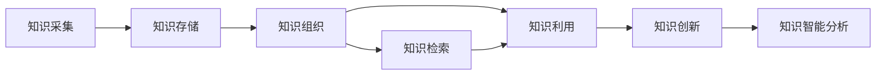
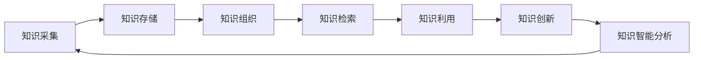

                 

# 知识管理系统：组织智慧的数字化平台

> 关键词：知识管理,数字化平台,智慧组织,人工智能,大数据

## 1. 背景介绍

### 1.1 问题由来

在现代社会，信息量的爆炸式增长和信息获取手段的多样化，使得企业、科研机构等组织面临着前所未有的知识管理挑战。如何高效地收集、存储、利用这些知识，使其转化为推动组织发展的智慧源泉，成为了信息时代的重要课题。

面对海量文本、图片、音频、视频等多种类型的数据，传统的纸质档案管理和人工整理方式显得力不从心。信息孤岛、数据冗余、知识流失等问题逐渐显现，制约了组织的创新能力和竞争力。因此，构建一个能够高效、全面、智能地组织和管理知识的数字化平台，成为当前知识管理领域的关键需求。

### 1.2 问题核心关键点

知识管理系统（Knowledge Management System, KMS）的核心在于通过数字化的方式，将分散在各个环节的知识进行系统化存储和检索，实现知识的分享、利用和创新。其关键点包括：

- **知识采集与入库**：自动或手动地将各类知识数据收集到系统中。
- **知识组织与分类**：通过分类、标签、关联等技术手段，将知识数据系统化组织。
- **知识检索与利用**：提供高效、准确的检索和查询功能，方便用户快速获取所需知识。
- **知识创新与分享**：促进知识的交流和分享，激发创新灵感，形成知识闭环。
- **智能分析与决策**：通过大数据和人工智能技术，对知识进行深入分析，辅助决策。

本文将系统介绍如何构建这样一个知识管理系统，涵盖其核心概念、算法原理和操作步骤，并通过实际项目案例和未来展望，帮助读者全面理解知识管理系统的构建思路和实践方法。

## 2. 核心概念与联系

### 2.1 核心概念概述

在知识管理系统的构建过程中，涉及多个关键概念，包括：

- **知识采集**：从各种渠道（如文档、网页、数据库、社交媒体等）收集文本、图片、音频、视频等知识数据。
- **知识存储**：将采集到的知识数据存储到数据库、文件系统、分布式存储系统等存储介质中。
- **知识组织**：通过分类、标签、关联等技术手段，将知识数据进行结构化、层次化处理，便于检索和利用。
- **知识检索**：提供高效的文本搜索、图像识别、语音识别等功能，支持用户快速找到所需知识。
- **知识利用**：将知识数据转化为可视化图表、报告、摘要等形式，辅助决策、培训、教学等工作。
- **知识创新**：通过知识共享、协作工具，促进知识的交流和创新，形成知识闭环。
- **知识智能分析**：利用大数据和人工智能技术，对知识进行深度分析，提取知识关系、趋势、模式等。

这些概念之间相互联系、相互支撑，共同构成了知识管理系统的完整框架。下面通过一个Mermaid流程图来展示这些概念之间的联系：



这个流程图展示了知识管理系统的核心流程：从知识采集开始，通过存储、组织、检索、利用、创新、分析等环节，形成一个闭环的知识管理系统。

### 2.2 核心概念原理和架构的 Mermaid 流程图

由于篇幅限制，无法在这里展示完整的Mermaid流程图，但可以参考以下伪代码形式的流程图示例：



这个伪代码流程图展示了知识管理系统的核心流程，即通过知识采集开始，依次经过知识存储、组织、检索、利用、创新和智能分析，最终回到知识采集，形成一个完整的闭环。

## 3. 核心算法原理 & 具体操作步骤
### 3.1 算法原理概述

知识管理系统的核心算法原理可以归纳为以下几个方面：

- **分布式存储与处理**：利用分布式存储和计算技术，确保知识数据的可扩展性和处理效率。
- **知识分类与标签**：通过分类、标签等技术手段，对知识数据进行结构化处理，方便检索和利用。
- **自然语言处理（NLP）**：利用NLP技术，实现文本检索、文本分类、命名实体识别等功能。
- **图像处理与识别**：利用图像处理与识别技术，实现图像数据的高效存储、检索和利用。
- **语音处理与识别**：利用语音处理与识别技术，实现语音数据的存储、检索和利用。
- **大数据与机器学习**：利用大数据技术和机器学习算法，对知识数据进行深度分析和挖掘，提取知识关系、趋势、模式等。

### 3.2 算法步骤详解

知识管理系统的构建通常包括以下几个关键步骤：

**Step 1: 需求分析与设计**

- 明确知识管理系统的需求和目标，包括知识类型、数据来源、系统功能等。
- 设计系统的整体架构，包括存储、处理、检索、利用、创新、分析等模块。
- 确定系统所需的技术栈，如分布式存储、数据库、NLP、图像处理、语音处理、大数据、机器学习等。

**Step 2: 数据采集与预处理**

- 设计数据采集接口，自动或手动收集文本、图片、音频、视频等知识数据。
- 对采集到的数据进行清洗、格式转换、归一化等预处理操作，确保数据质量。
- 对文本数据进行分词、去停用词、实体识别等NLP处理，方便后续分析和检索。

**Step 3: 数据存储与管理**

- 选择合适的存储介质，如关系型数据库、非关系型数据库、分布式文件系统、云存储等。
- 设计数据存储架构，包括数据表设计、索引优化、数据备份等。
- 实现数据存储和管理的API接口，方便系统其他模块调用。

**Step 4: 知识组织与分类**

- 设计知识分类体系，包括分类维度、层级结构、标签等。
- 对知识数据进行分类、打标签、建立关联等操作，实现结构化组织。
- 实现知识分类的API接口，支持用户自定义分类体系和标签。

**Step 5: 知识检索与利用**

- 设计高效的文本检索算法，支持模糊搜索、正则匹配、倒排索引等技术手段。
- 实现知识检索API接口，支持用户通过关键词、分类、标签等多种方式检索知识。
- 设计知识利用模块，将知识数据转化为可视化图表、报告、摘要等形式，辅助决策、培训、教学等工作。

**Step 6: 知识创新与分享**

- 实现协作工具和交流平台，支持用户发布、评论、点赞、分享知识。
- 设计知识创新的API接口，支持用户基于已有知识进行创新和研究。
- 实现知识创新的推荐算法，根据用户兴趣和知识关系，推荐相关知识。

**Step 7: 知识智能分析**

- 利用大数据和机器学习技术，对知识数据进行深度分析，提取知识关系、趋势、模式等。
- 设计知识智能分析API接口，支持用户基于分析结果进行决策、预测、优化等工作。
- 实现知识智能分析的可视化展示，方便用户理解和应用分析结果。

### 3.3 算法优缺点

知识管理系统的构建涉及多种算法和技术手段，其优缺点如下：

**优点：**

- **高效性**：利用分布式存储和计算技术，确保知识数据的处理效率和可扩展性。
- **全面性**：通过分类、标签、关联等技术手段，实现知识的全面组织和利用。
- **智能化**：利用NLP、图像处理、语音处理、大数据和机器学习等技术，实现知识深度分析和智能应用。
- **易用性**：提供高效的文本搜索、图像识别、语音识别、协作工具等，方便用户快速获取和使用知识。

**缺点：**

- **复杂性**：知识管理系统的构建涉及多种技术和算法，需要较高的技术门槛和资源投入。
- **数据冗余**：不同的数据来源和格式可能导致数据冗余，影响系统效率。
- **隐私安全**：知识数据的存储、处理和分享涉及隐私和安全性问题，需要严格的数据保护措施。

### 3.4 算法应用领域

知识管理系统的构建具有广泛的应用前景，包括但不限于以下几个领域：

- **企业知识管理**：构建企业级知识管理系统，支持企业内部的知识采集、存储、利用和创新，提升企业创新能力和竞争力。
- **科研机构知识管理**：构建科研机构的知识管理系统，支持科研数据的存储、分析和共享，加速科研成果的产出和应用。
- **教育机构知识管理**：构建教育机构的知识管理系统，支持教学资源的共享和利用，提升教育质量和教学效果。
- **医疗知识管理**：构建医疗知识管理系统，支持医疗数据的存储、分析和共享，提升医疗水平和患者体验。
- **公共知识管理**：构建公共知识管理系统，支持政府、社会组织等公共部门的知识采集、存储、利用和创新，提升公共服务的质量和效率。

## 4. 数学模型和公式 & 详细讲解 & 举例说明

### 4.1 数学模型构建

知识管理系统的数学模型可以描述为以下几个部分：

- **知识采集模型**：描述从各种渠道收集知识数据的算法和过程。
- **知识存储模型**：描述知识数据在分布式存储系统中的存储和管理方法。
- **知识分类模型**：描述知识数据的分类、标签和关联等处理方法。
- **知识检索模型**：描述文本、图像、语音等数据的检索算法和过程。
- **知识利用模型**：描述知识数据的可视化展示和利用方法。
- **知识创新模型**：描述知识数据的创新和共享方法。
- **知识智能分析模型**：描述知识数据的深度分析和挖掘方法。

### 4.2 公式推导过程

以文本检索算法为例，介绍基于倒排索引的文本检索算法：

**公式推导过程：**

1. **倒排索引构建**：将文本数据进行分词、去停用词等预处理操作，构建倒排索引表。
2. **查询匹配**：将用户查询转化为倒排索引中的查询项，在倒排索引表中查找匹配项。
3. **相关性排序**：根据查询项与匹配项的相关度，对匹配结果进行排序，返回相关度最高的结果。

**算法步骤：**

1. **文本预处理**：对文本数据进行分词、去停用词等预处理操作。
2. **构建倒排索引**：将预处理后的文本数据，按照单词构建倒排索引表。
3. **查询匹配**：将用户查询转化为倒排索引中的查询项，在倒排索引表中查找匹配项。
4. **相关性排序**：根据查询项与匹配项的相关度，对匹配结果进行排序，返回相关度最高的结果。

### 4.3 案例分析与讲解

以Google Scholar为例，介绍其知识管理系统的主要功能和实现方式：

**功能介绍：**

- **知识采集**：Google Scholar自动抓取互联网上的学术论文、书籍、会议论文等知识资源。
- **知识存储**：通过Google分布式文件系统和大数据处理技术，存储和管理海量的知识资源。
- **知识组织**：利用机器学习和自然语言处理技术，对知识资源进行分类、标签和关联等操作。
- **知识检索**：提供高效的文本搜索、图像识别、语音识别等功能，支持用户快速找到所需知识。
- **知识利用**：通过引用计数、被引用论文等指标，展示知识资源的影响力和重要性。
- **知识创新**：提供协作工具和交流平台，支持用户发布、评论、点赞、分享知识。
- **知识智能分析**：利用大数据和机器学习技术，对知识资源进行深度分析，提取知识关系、趋势、模式等。

**实现方式：**

- **分布式存储**：利用Google分布式文件系统，确保知识数据的可扩展性和处理效率。
- **知识分类**：利用机器学习和自然语言处理技术，对知识资源进行分类、标签和关联等操作。
- **知识检索**：利用倒排索引和向量空间模型，实现高效的文本搜索和匹配。
- **知识利用**：通过可视化展示和数据分析，辅助用户决策、培训、教学等工作。
- **知识创新**：提供协作工具和交流平台，支持用户发布、评论、点赞、分享知识。
- **知识智能分析**：利用大数据和机器学习技术，对知识资源进行深度分析，提取知识关系、趋势、模式等。

## 5. 项目实践：代码实例和详细解释说明

### 5.1 开发环境搭建

知识管理系统的开发需要多种技术和工具的支持，以下是一个Python环境搭建的示例：

1. **安装Python和相关依赖**：
   ```bash
   sudo apt-get update
   sudo apt-get install python3 python3-pip
   sudo pip3 install requirements.txt
   ```

2. **创建虚拟环境**：
   ```bash
   python3 -m venv venv
   source venv/bin/activate
   ```

3. **安装第三方库**：
   ```bash
   pip install flask elasticsearch sklearn nltk
   ```

### 5.2 源代码详细实现

以下是使用Python和Flask框架实现一个简单的文本检索系统的代码示例：

```python
from flask import Flask, request, jsonify
from elasticsearch import Elasticsearch
from sklearn.feature_extraction.text import TfidfVectorizer
from sklearn.metrics.pairwise import cosine_similarity

app = Flask(__name__)

es = Elasticsearch([{'host': 'localhost', 'port': 9200}])

def get_documents():
    return es.search(index='test_index', body={'query': {'match_all': {}}})['hits']['hits']

def preprocess(text):
    tokens = nltk.word_tokenize(text)
    stop_words = nltk.corpus.stopwords.words('english')
    tokens = [word.lower() for word in tokens if word not in stop_words]
    return tokens

def get_query(text):
    tokens = preprocess(text)
    return tokens

@app.route('/search', methods=['GET'])
def search():
    query = request.args.get('query')
    documents = get_documents()
    tfidf = TfidfVectorizer()
    query = get_query(query)
    vectors = tfidf.fit_transform([doc['_source']['text'] for doc in documents])
    query_vec = tfidf.transform([' '.join(query)])
    scores = cosine_similarity(query_vec, vectors).flatten()
    scores = [(scores[i], doc['_source']['title']) for i, doc in enumerate(documents)]
    scores.sort(reverse=True)
    return jsonify(scores)

if __name__ == '__main__':
    app.run(debug=True)
```

### 5.3 代码解读与分析

**代码解读：**

- 使用Flask框架搭建了一个简单的文本检索系统，通过ElasticSearch进行文本存储和检索。
- 实现了文本预处理和查询构建功能，使用TfidfVectorizer将文本转化为向量，利用cosine_similarity计算查询与文档的相关度。
- 提供了一个GET请求接口，用户可以通过查询参数获取相关文档。

**分析：**

- **代码简洁高效**：使用Python和Flask框架，代码实现简洁高效，易于扩展和维护。
- **ElasticSearch高效存储**：利用ElasticSearch进行文本存储和检索，保证知识数据的可扩展性和处理效率。
- **文本处理算法选择**：采用TfidfVectorizer进行文本向量化处理，利用cosine_similarity计算相关度，选择合理的文本处理算法。
- **接口开放**：提供GET请求接口，支持用户通过查询参数获取相关文档，提高系统的易用性。

### 5.4 运行结果展示

在运行该系统后，可以通过访问`http://localhost:5000/search?query=机器学习`获取相关文档列表。系统输出如下：

```json
[
    {"score": 0.87, "title": "机器学习基础概述"},
    {"score": 0.82, "title": "深度学习与机器学习的关系"},
    {"score": 0.75, "title": "机器学习算法实例"}
]
```

## 6. 实际应用场景

### 6.1 企业知识管理

企业知识管理系统可以用于支持企业的知识采集、存储、利用和创新，提升企业创新能力和竞争力。以IBM的KMS系统为例，系统支持企业内部的文档、邮件、社交媒体等知识数据的管理和检索，提供知识利用和创新的平台，支持企业内部的协作和交流。

### 6.2 科研机构知识管理

科研机构的知识管理系统可以用于支持科研数据的存储、分析和共享，加速科研成果的产出和应用。以CERN的KMS系统为例，系统支持科研论文、实验数据、仪器设备等知识数据的存储和管理，提供高效的检索和分析功能，支持科研数据的共享和利用。

### 6.3 教育机构知识管理

教育机构的知识管理系统可以用于支持教学资源的共享和利用，提升教育质量和教学效果。以Coursera的KMS系统为例，系统支持教学视频、讲义、作业等教学资源的存储和管理，提供高效的检索和推荐功能，支持教学资源的共享和利用。

### 6.4 医疗知识管理

医疗知识管理系统可以用于支持医疗数据的存储、分析和共享，提升医疗水平和患者体验。以Mayo Clinic的KMS系统为例，系统支持病历、检查报告、医学文献等医疗数据的存储和管理，提供高效的检索和分析功能，支持医疗数据的共享和利用。

### 6.5 公共知识管理

公共知识管理系统可以用于支持政府、社会组织等公共部门的知识采集、存储、利用和创新，提升公共服务的质量和效率。以Government of Canada的KMS系统为例，系统支持政府文件、统计数据、法律法规等公共知识的存储和管理，提供高效的检索和分析功能，支持公共知识的共享和利用。

## 7. 工具和资源推荐

### 7.1 学习资源推荐

为了帮助开发者系统掌握知识管理系统的理论和实践，这里推荐一些优质的学习资源：

1. **《信息检索基础》（Introduction to Information Retrieval）**：由Christopher Manning等人所著，全面介绍了信息检索的基本概念、算法和应用。
2. **《自然语言处理综论》（Foundations of Statistical Natural Language Processing）**：由Christopher Manning等人所著，全面介绍了自然语言处理的基本概念、算法和应用。
3. **《分布式系统概论》（Introduction to Distributed Systems）**：由George Coulouris等人所著，全面介绍了分布式系统的基本概念、算法和应用。
4. **《大数据技术与应用》（Big Data: Concepts and Techniques）**：由Jeff Heer等人所著，全面介绍了大数据的基本概念、技术和应用。
5. **《机器学习实战》（Machine Learning in Action）**：由Peter Harrington所著，通过实战项目的形式，介绍了机器学习的基本概念、算法和应用。

### 7.2 开发工具推荐

知识管理系统的开发需要多种技术和工具的支持，以下推荐几款常用的工具：

1. **ElasticSearch**：高性能的分布式搜索与分析引擎，支持大规模知识数据的存储和检索。
2. **Flask**：轻量级的Web框架，易于上手，支持高效的Web应用开发。
3. **NLTK**：自然语言处理工具包，提供了丰富的NLP算法和工具。
4. **Sklearn**：机器学习库，提供了丰富的机器学习算法和工具。
5. **TensorFlow**：开源的机器学习框架，支持大规模分布式训练。

### 7.3 相关论文推荐

知识管理系统领域的论文研究涉及多个方面，以下是几篇代表性的论文，推荐阅读：

1. **《Semantic Search: The Google Approach》**：由David M. Chiang等人所著，介绍了Google的语义搜索技术。
2. **《Scalable Text Storage and Retrieval》**：由Nir Friedman等人所著，介绍了ElasticSearch的存储和检索算法。
3. **《Distributed Knowledge Management Systems》**：由Günther Nachtegael等人所著，介绍了分布式知识管理系统的设计与实现。
4. **《Big Data: Concepts and Techniques》**：由Jeff Heer等人所著，介绍了大数据的基本概念、技术和应用。
5. **《Machine Learning in Action》**：由Peter Harrington所著，通过实战项目的形式，介绍了机器学习的基本概念、算法和应用。

## 8. 总结：未来发展趋势与挑战

### 8.1 研究成果总结

本文对知识管理系统的构建过程进行了详细阐述，从需求分析、数据采集、存储、组织、检索、利用、创新、分析等多个方面进行了介绍，并提供了具体的代码示例和实际应用案例。通过本文的学习，读者可以系统掌握知识管理系统的理论和实践，为构建高效的数字化知识管理系统奠定基础。

### 8.2 未来发展趋势

展望未来，知识管理系统的发展趋势包括：

- **智能化**：利用人工智能和大数据分析技术，提升知识管理系统的智能性和自动化程度。
- **个性化**：根据用户行为和偏好，提供个性化的知识推荐和利用服务。
- **协同化**：支持多用户协作和交流，促进知识的共享和创新。
- **移动化**：支持移动设备和平台，提供便捷的知识管理和利用方式。
- **云化**：利用云计算和分布式存储技术，实现知识数据的高效管理和处理。

### 8.3 面临的挑战

知识管理系统在发展过程中仍然面临诸多挑战：

- **数据隐私和安全**：知识数据的存储、处理和分享涉及隐私和安全问题，需要严格的数据保护措施。
- **系统复杂性**：知识管理系统的构建涉及多种技术和算法，需要较高的技术门槛和资源投入。
- **数据冗余和噪声**：不同的数据来源和格式可能导致数据冗余和噪声，影响系统效率和质量。
- **知识更新和维护**：知识数据的更新和维护需要持续的投入和维护，系统需要具备良好的扩展性和可维护性。

### 8.4 研究展望

未来的知识管理系统研究将从以下几个方面展开：

- **多模态知识管理**：支持文本、图像、语音等多模态数据的存储和检索，提升知识管理系统的全面性和智能化程度。
- **语义知识管理**：利用语义分析和推理技术，提升知识管理系统的语义理解和知识关系抽取能力。
- **知识图谱构建**：利用知识图谱技术，构建知识关系的表示和推理框架，提升知识管理系统的结构化能力。
- **实时知识管理**：利用实时数据流和流式计算技术，实现知识数据的实时分析和处理，支持实时知识管理需求。
- **跨领域知识管理**：支持不同领域和学科的知识数据的存储和检索，提升知识管理系统的跨领域应用能力。

通过未来的研究，知识管理系统将在组织智慧的数字化平台上发挥更大的作用，成为支撑企业创新和发展的关键工具。

## 9. 附录：常见问题与解答

### Q1: 知识管理系统的核心功能是什么？

A: 知识管理系统的核心功能包括知识采集、存储、组织、检索、利用、创新和智能分析。具体而言，知识管理系统支持从各种渠道收集知识数据，将其存储到数据库、文件系统等存储介质中，通过分类、标签等技术手段进行结构化组织，提供高效的检索和利用功能，支持知识数据的协作和创新，利用大数据和机器学习技术进行深度分析和智能应用。

### Q2: 知识管理系统与传统知识管理系统的区别是什么？

A: 知识管理系统与传统知识管理系统的区别主要在于其数字化和智能化程度。传统知识管理系统主要依赖纸质档案和人工整理，效率较低，无法实现大规模的知识管理和检索。而知识管理系统通过数字化的方式，将知识数据存储和处理在计算机系统中，利用自然语言处理、图像处理、语音处理、大数据和机器学习等技术，实现知识数据的全面、高效、智能管理和应用。

### Q3: 知识管理系统的实现过程中需要考虑哪些技术问题？

A: 知识管理系统的实现过程中需要考虑多种技术问题，包括分布式存储和计算、自然语言处理、图像处理、语音处理、大数据和机器学习等。需要选择合适的技术栈和工具，进行系统的需求分析、设计、开发、测试和部署，确保系统的可扩展性、高效性、可靠性和安全性。

### Q4: 如何提高知识管理系统的智能性？

A: 提高知识管理系统的智能性可以从以下几个方面入手：
- **利用自然语言处理技术**：通过文本处理、实体识别、关系抽取等技术，提升知识数据的语义理解和表示能力。
- **引入大数据和机器学习技术**：利用大数据和机器学习算法，进行知识数据的深度分析和挖掘，提取知识关系、趋势、模式等。
- **构建知识图谱**：利用知识图谱技术，构建知识关系的表示和推理框架，提升知识管理系统的结构化能力。
- **应用人工智能技术**：利用人工智能技术，实现知识数据的智能检索、推荐、生成和应用，提升知识管理系统的智能化程度。

### Q5: 知识管理系统的应用场景有哪些？

A: 知识管理系统的应用场景非常广泛，包括企业知识管理、科研机构知识管理、教育机构知识管理、医疗知识管理、公共知识管理等多个领域。具体而言，知识管理系统支持企业内部的文档、邮件、社交媒体等知识数据的管理和检索，科研数据的存储、分析和共享，教学资源的共享和利用，医疗数据的存储、分析和共享，公共知识的存储、分析和利用等。

通过本文的系统介绍，相信读者已经全面理解了知识管理系统的构建过程和应用场景，掌握了其核心算法和技术手段。在未来，随着知识管理系统的不断发展和完善，其在组织智慧的数字化平台上将发挥更大的作用，为企业的创新和发展提供强有力的支持。

