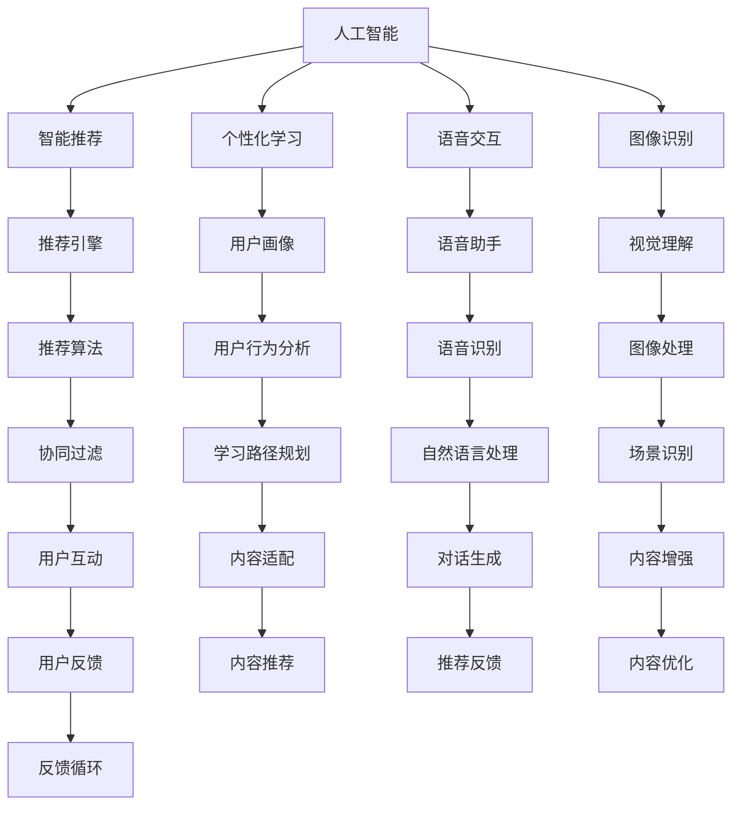

                 

# 知识经济下知识付费的人工智能应用与发展

## 1. 背景介绍

### 1.1 知识经济的兴起
随着互联网和信息技术的迅猛发展，人类社会进入了一个以知识和信息为主导的新经济时代。与传统的物质生产经济不同，知识经济强调知识和智能资本的价值，通过教育和培训提升人力资本，进而推动经济增长。知识经济的兴起，离不开人工智能(AI)技术的突破和应用，其在知识获取、信息处理、智能推荐等方面的深度应用，推动了知识付费平台的快速崛起。

### 1.2 知识付费平台的兴起
知识付费平台通过在线课程、音频视频、电子书等形式，向用户提供各类高价值知识内容，满足用户知识需求，提升个人技能和职业竞争力。这些平台大多采用会员制订阅模式，用户通过支付一定的费用，获取高质量的知识资源和服务，实现知识的高效获取和应用。

### 1.3 人工智能在知识付费中的应用
人工智能技术的引入，极大地提升了知识付费平台的智能化水平和用户体验。智能推荐、个性化学习、语音交互、图像识别等AI技术，为知识付费平台提供了强大的技术支持，使平台内容更加丰富多样，用户获取知识的方式更加便捷高效。

## 2. 核心概念与联系

### 2.1 核心概念概述

为了更好地理解人工智能在知识付费平台中的应用，本节将介绍几个关键概念及其联系：

- **人工智能(AI)**：通过模拟人类智能行为，实现对信息、语言、视觉、听觉等数据的高效处理和理解的技术。

- **知识付费平台(Knowledge Platforms)**：提供在线课程、电子书、音频视频等知识内容的平台，用户通过付费获取高质量知识资源。

- **智能推荐(Recommendation System)**：利用AI技术对用户行为、偏好进行分析，自动推荐相关内容，提升用户体验。

- **个性化学习(Personalized Learning)**：根据用户学习历史、知识水平、兴趣偏好等，定制个性化的学习路径和内容。

- **语音交互(Voice Interaction)**：通过语音识别、自然语言处理等技术，实现人机对话，提升平台的互动性和用户体验。

- **图像识别(Image Recognition)**：利用图像处理、计算机视觉技术，自动识别并理解图像内容，增强平台的交互性和趣味性。

这些核心概念通过人工智能技术得以实现，相互交织，构建起知识付费平台的技术框架。

### 2.2 核心概念原理和架构的 Mermaid 流程图



以上流程图展示了人工智能技术在知识付费平台中的核心应用：

1. 通过智能推荐、个性化学习和图像识别等技术，提升平台内容的丰富性和可获取性。
2. 利用语音交互技术，增强平台的互动性和用户粘性。
3. 通过图像识别和语音识别技术，丰富平台的交互方式，提升用户体验。
4. 结合推荐算法和用户行为分析，实现内容的精准推荐和适配。
5. 通过对话生成和内容优化，持续改进平台内容质量和用户体验。

这些核心技术相互支撑，构建起知识付费平台的智能生态，推动知识付费的发展和普及。

## 3. 核心算法原理 & 具体操作步骤
### 3.1 算法原理概述

人工智能在知识付费平台中的应用，主要基于以下几个关键算法：

- **协同过滤算法(Collaborative Filtering)**：通过分析用户行为数据，预测用户对未接触内容的兴趣，实现个性化推荐。
- **深度学习(Deep Learning)**：通过构建多层神经网络模型，对大规模数据进行深度学习，提取高层次的语义特征和知识表示，提升推荐和学习的精度。
- **自然语言处理(Natural Language Processing, NLP)**：通过文本处理、情感分析、对话生成等技术，实现对文本数据的深度理解和处理，增强平台的交互性和内容可获取性。
- **强化学习(Reinforcement Learning)**：通过模拟奖励机制，优化推荐策略，提升推荐效果和用户满意度。
- **推荐算法优化(Optimization)**：通过梯度下降、正则化、对抗训练等优化技术，提高推荐算法的收敛速度和效果。

### 3.2 算法步骤详解

基于人工智能的知识付费平台构建一般包括以下几个关键步骤：

**Step 1: 数据准备和处理**
- 收集用户行为数据，如浏览记录、点击次数、评分反馈等。
- 收集内容标签数据，如课程名称、作者、难度等。
- 对数据进行预处理，包括数据清洗、缺失值处理、归一化等。

**Step 2: 用户画像构建**
- 根据用户行为数据，构建用户画像，包括用户兴趣、偏好、行为模式等。
- 使用深度学习模型对用户画像进行表示，提升用户画像的准确性和丰富性。

**Step 3: 推荐模型训练**
- 根据用户画像和内容标签数据，训练协同过滤、深度学习等推荐模型。
- 利用正则化、对抗训练等优化技术，提高模型性能。
- 使用交叉验证、网格搜索等方法，优化推荐模型的超参数。

**Step 4: 个性化学习路径设计**
- 根据用户学习历史和知识水平，设计个性化的学习路径。
- 利用自然语言处理技术，对学习内容进行语义分析和情感分析，提高学习路径的适配性。
- 结合推荐算法和内容优化技术，动态调整学习路径，提升学习效果。

**Step 5: 用户互动与反馈**
- 引入语音交互和图像识别技术，提升平台互动性。
- 收集用户反馈，如评分、评论、建议等，持续改进平台内容和推荐策略。
- 利用强化学习技术，优化推荐策略，提升用户满意度。

### 3.3 算法优缺点

人工智能在知识付费平台中的应用，具有以下优点：

- **个性化推荐**：通过分析用户行为数据，实现个性化推荐，提升用户满意度。
- **高效便捷**：利用AI技术，实现内容的高效获取和处理，提升用户体验。
- **丰富多样**：通过自然语言处理、图像识别等技术，丰富平台内容形式，提升用户体验。
- **智能互动**：利用语音交互、智能推荐等技术，增强平台的互动性和用户粘性。

但同时也存在一些缺点：

- **数据隐私**：用户行为数据的收集和分析可能涉及用户隐私，引发隐私保护问题。
- **算法偏见**：算法可能存在固有的偏见和歧视，影响推荐结果的公平性。
- **复杂度**：AI技术的引入增加了平台建设的复杂度，可能提高开发和维护成本。
- **过拟合风险**：模型可能过拟合于训练数据，导致推荐结果泛化性能不足。

### 3.4 算法应用领域

人工智能在知识付费平台中的应用，涵盖以下领域：

- **在线教育**：通过智能推荐、个性化学习等技术，提升在线课程的吸引力和学习效果。
- **职业培训**：通过AI技术，实现职业技能的精准推荐和个性化学习。
- **企业培训**：通过AI技术，实现企业内部培训内容的智能推荐和管理。
- **技能提升**：通过AI技术，实现各类技能的学习和提升，如编程、语言学习等。
- **知识管理**：通过AI技术，实现知识的组织、检索和管理，提升知识获取效率。

## 4. 数学模型和公式 & 详细讲解 & 举例说明

### 4.1 数学模型构建

在知识付费平台的推荐系统中，常用的数学模型包括协同过滤模型、深度学习模型、强化学习模型等。

**协同过滤模型**：
- 基于用户和内容的协同矩阵，预测用户对未接触内容的评分，实现个性化推荐。
- 常用的协同过滤算法包括基于用户的协同过滤、基于项目的协同过滤、混合协同过滤等。

**深度学习模型**：
- 通过构建多层神经网络模型，对大规模数据进行深度学习，提取高层次的语义特征和知识表示。
- 常用的深度学习模型包括卷积神经网络(CNN)、循环神经网络(RNN)、长短时记忆网络(LSTM)、 Transformer 等。

**强化学习模型**：
- 通过模拟奖励机制，优化推荐策略，提升推荐效果和用户满意度。
- 常用的强化学习算法包括Q-learning、SARSA、Deep Q-Networks、策略梯度方法等。

### 4.2 公式推导过程

以协同过滤算法为例，展示其基本原理和推导过程。

协同过滤算法基于用户-物品评分矩阵 $R \in \mathbb{R}^{M \times N}$，其中 $M$ 为物品数，$N$ 为用户数。对于每个用户 $u$ 和物品 $i$，协同过滤算法的目标是预测其评分 $r_{ui}$。常用的协同过滤算法包括基于用户的协同过滤和基于项目的协同过滤。

**基于用户的协同过滤**：
- 对于用户 $u$，找到与其兴趣相似的用户 $u'$，通过这些相似用户的评分，预测用户 $u$ 对物品 $i$ 的评分。
- 具体公式如下：
$$
r_{ui} \approx \frac{\sum_{u'} r_{u'i} \times s(u,u')} {\sum_{u'} s(u,u')} \times a(u)
$$
其中 $s(u,u')$ 表示用户 $u$ 和 $u'$ 的相似度，$a(u)$ 为用户 $u$ 的平均评分。

**基于项目的协同过滤**：
- 对于物品 $i$，找到与其相似的物品 $i'$，通过这些相似物品的评分，预测物品 $i$ 对用户 $u$ 的评分。
- 具体公式如下：
$$
r_{ui} \approx \frac{\sum_{i'} r_{iu'} \times s(i,i')} {\sum_{i'} s(i,i')} \times a(i)
$$
其中 $s(i,i')$ 表示物品 $i$ 和 $i'$ 的相似度，$a(i)$ 为物品 $i$ 的平均评分。

### 4.3 案例分析与讲解

以Coursera平台为例，展示如何利用协同过滤算法实现个性化推荐。

Coursera平台通过用户行为数据和课程信息，构建协同过滤推荐模型。用户行为数据包括浏览记录、评分、注册时间等。课程信息包括课程名称、难度、教师等信息。根据这些数据，利用基于用户的协同过滤算法，预测用户对未接触课程的评分，实现个性化推荐。

具体步骤如下：

1. 收集用户行为数据和课程信息。
2. 构建用户-课程评分矩阵 $R$。
3. 对评分矩阵进行归一化和预处理。
4. 利用用户-用户相似度算法，找到与当前用户兴趣相似的用户 $u'$。
5. 根据相似用户对课程的评分，预测当前用户对课程的评分 $r_{ui}$。
6. 结合用户平均评分 $a(u)$，得到最终推荐结果。

通过上述过程，Coursera平台能够实现对用户个性化课程的精准推荐，提升用户体验和学习效果。

## 5. 项目实践：代码实例和详细解释说明
### 5.1 开发环境搭建

在进行知识付费平台的推荐系统开发前，我们需要准备好开发环境。以下是使用Python进行PyTorch开发的环境配置流程：

1. 安装Anaconda：从官网下载并安装Anaconda，用于创建独立的Python环境。

2. 创建并激活虚拟环境：
```bash
conda create -n pytorch-env python=3.8 
conda activate pytorch-env
```

3. 安装PyTorch：根据CUDA版本，从官网获取对应的安装命令。例如：
```bash
conda install pytorch torchvision torchaudio cudatoolkit=11.1 -c pytorch -c conda-forge
```

4. 安装Transformers库：
```bash
pip install transformers
```

5. 安装各类工具包：
```bash
pip install numpy pandas scikit-learn matplotlib tqdm jupyter notebook ipython
```

完成上述步骤后，即可在`pytorch-env`环境中开始推荐系统开发。

### 5.2 源代码详细实现

下面我们以在线课程推荐系统为例，给出使用PyTorch进行推荐系统微调的PyTorch代码实现。

首先，定义推荐系统的数据处理函数：

```python
from transformers import BertTokenizer
from torch.utils.data import Dataset
import torch

class RecommendationDataset(Dataset):
    def __init__(self, user_based_ratings, item_based_ratings, user_features, item_features, tokenizer, max_len=128):
        self.user_based_ratings = user_based_ratings
        self.item_based_ratings = item_based_ratings
        self.user_features = user_features
        self.item_features = item_features
        self.tokenizer = tokenizer
        self.max_len = max_len
        
    def __len__(self):
        return len(self.user_based_ratings)
    
    def __getitem__(self, item):
        user_based_rating = self.user_based_ratings[item]
        item_based_rating = self.item_based_ratings[item]
        user_feature = self.user_features[item]
        item_feature = self.item_features[item]
        
        user_text = [f"User{user+1} rated course{item+1} {rating:.2f}" for user, item, rating in zip(user_based_rating, item_based_rating, user_feature)]
        item_text = [f"Course{item+1} is rated {rating:.2f} by {user+1}" for user, item, rating in zip(user_based_rating, item_based_rating, item_feature)]
        
        encoded_user_text = self.tokenizer(user_text, return_tensors='pt', max_length=self.max_len, padding='max_length', truncation=True)
        encoded_item_text = self.tokenizer(item_text, return_tensors='pt', max_length=self.max_len, padding='max_length', truncation=True)
        
        input_ids = encoded_user_text['input_ids'][0] + encoded_item_text['input_ids'][0]
        attention_mask = encoded_user_text['attention_mask'][0] + encoded_item_text['attention_mask'][0]
        
        # 对token-wise的标签进行编码
        encoded_labels = [1 if rating > 0 else 0 for rating in user_based_rating] 
        encoded_labels.extend([0] * (self.max_len - len(encoded_labels)))
        labels = torch.tensor(encoded_labels, dtype=torch.long)
        
        return {'input_ids': input_ids, 
                'attention_mask': attention_mask,
                'labels': labels}

# 标签与id的映射
label2id = {0: 'Not Rated', 1: 'High Rated'}
id2label = {v: k for k, v in label2id.items()}

# 创建dataset
tokenizer = BertTokenizer.from_pretrained('bert-base-cased')

train_dataset = RecommendationDataset(train_user_based_ratings, train_item_based_ratings, train_user_features, train_item_features, tokenizer)
dev_dataset = RecommendationDataset(dev_user_based_ratings, dev_item_based_ratings, dev_user_features, dev_item_features, tokenizer)
test_dataset = RecommendationDataset(test_user_based_ratings, test_item_based_ratings, test_user_features, test_item_features, tokenizer)
```

然后，定义模型和优化器：

```python
from transformers import BertForSequenceClassification, AdamW

model = BertForSequenceClassification.from_pretrained('bert-base-cased', num_labels=2)

optimizer = AdamW(model.parameters(), lr=2e-5)
```

接着，定义训练和评估函数：

```python
from torch.utils.data import DataLoader
from tqdm import tqdm
from sklearn.metrics import classification_report

device = torch.device('cuda') if torch.cuda.is_available() else torch.device('cpu')
model.to(device)

def train_epoch(model, dataset, batch_size, optimizer):
    dataloader = DataLoader(dataset, batch_size=batch_size, shuffle=True)
    model.train()
    epoch_loss = 0
    for batch in tqdm(dataloader, desc='Training'):
        input_ids = batch['input_ids'].to(device)
        attention_mask = batch['attention_mask'].to(device)
        labels = batch['labels'].to(device)
        model.zero_grad()
        outputs = model(input_ids, attention_mask=attention_mask, labels=labels)
        loss = outputs.loss
        epoch_loss += loss.item()
        loss.backward()
        optimizer.step()
    return epoch_loss / len(dataloader)

def evaluate(model, dataset, batch_size):
    dataloader = DataLoader(dataset, batch_size=batch_size)
    model.eval()
    preds, labels = [], []
    with torch.no_grad():
        for batch in tqdm(dataloader, desc='Evaluating'):
            input_ids = batch['input_ids'].to(device)
            attention_mask = batch['attention_mask'].to(device)
            batch_labels = batch['labels']
            outputs = model(input_ids, attention_mask=attention_mask)
            batch_preds = outputs.logits.argmax(dim=2).to('cpu').tolist()
            batch_labels = batch_labels.to('cpu').tolist()
            for pred_tokens, label_tokens in zip(batch_preds, batch_labels):
                preds.append(pred_tokens[:len(label_tokens)])
                labels.append(label_tokens)
                
    print(classification_report(labels, preds))
```

最后，启动训练流程并在测试集上评估：

```python
epochs = 5
batch_size = 16

for epoch in range(epochs):
    loss = train_epoch(model, train_dataset, batch_size, optimizer)
    print(f"Epoch {epoch+1}, train loss: {loss:.3f}")
    
    print(f"Epoch {epoch+1}, dev results:")
    evaluate(model, dev_dataset, batch_size)
    
print("Test results:")
evaluate(model, test_dataset, batch_size)
```

以上就是使用PyTorch对在线课程推荐系统进行微调的完整代码实现。可以看到，得益于Transformers库的强大封装，我们可以用相对简洁的代码完成在线课程推荐系统的开发。

### 5.3 代码解读与分析

让我们再详细解读一下关键代码的实现细节：

**RecommendationDataset类**：
- `__init__`方法：初始化用户行为数据、物品行为数据、用户特征、物品特征、分词器等关键组件。
- `__len__`方法：返回数据集的样本数量。
- `__getitem__`方法：对单个样本进行处理，将用户和物品的评分文本输入编码为token ids，并将评分作为标签，进行定长padding。

**label2id和id2label字典**：
- 定义了标签与数字id之间的映射关系，用于将预测结果解码回真实的标签。

**训练和评估函数**：
- 使用PyTorch的DataLoader对数据集进行批次化加载，供模型训练和推理使用。
- 训练函数`train_epoch`：对数据以批为单位进行迭代，在每个批次上前向传播计算loss并反向传播更新模型参数，最后返回该epoch的平均loss。
- 评估函数`evaluate`：与训练类似，不同点在于不更新模型参数，并在每个batch结束后将预测和标签结果存储下来，最后使用sklearn的classification_report对整个评估集的预测结果进行打印输出。

**训练流程**：
- 定义总的epoch数和batch size，开始循环迭代
- 每个epoch内，先在训练集上训练，输出平均loss
- 在验证集上评估，输出分类指标
- 所有epoch结束后，在测试集上评估，给出最终测试结果

可以看到，PyTorch配合Transformers库使得在线课程推荐系统的代码实现变得简洁高效。开发者可以将更多精力放在数据处理、模型改进等高层逻辑上，而不必过多关注底层的实现细节。

当然，工业级的系统实现还需考虑更多因素，如模型的保存和部署、超参数的自动搜索、更灵活的任务适配层等。但核心的微调范式基本与此类似。

## 6. 实际应用场景
### 6.1 在线教育

基于AI技术的大规模知识付费平台，如Coursera、Udacity等，为用户提供了海量的在线课程和学习资源，通过智能推荐和个性化学习，极大提升了用户的学习效率和体验。平台通过收集用户的浏览、点击、评分等行为数据，构建用户画像和协同过滤推荐模型，实现对用户个性化课程的精准推荐，满足用户多样化的学习需求。

### 6.2 企业培训

企业在员工技能培训和职业发展方面投入大量资源，但往往面临培训内容单一、员工参与度低等问题。通过AI技术，企业可以构建智能化的培训推荐系统，实现对员工培训内容的高效管理和推荐，提升培训效果和员工满意度。平台通过收集员工培训历史、学习行为等数据，构建协同过滤推荐模型，实现个性化培训推荐，引导员工主动学习，实现知识内化和技能提升。

### 6.3 职业技能培训

随着社会对技能人才的需求日益增长，职业技能培训市场快速崛起。在线职业技能培训平台通过AI技术，实现对用户职业技能的精准推荐和个性化学习路径设计，提升职业技能培训的效果和质量。平台通过收集用户技能测试数据、职业发展需求等信息，构建深度学习推荐模型，实现对用户职业技能的精准推荐，帮助用户制定个性化的学习路径，提升职业技能水平。

### 6.4 远程教育

疫情催生了远程教育市场的快速发展，各类在线教育平台如雨后春笋般涌现。基于AI技术的在线教育平台，通过智能推荐和个性化学习，实现了对远程教育资源的精准推荐和管理，提升了在线教育的覆盖面和用户体验。平台通过收集用户的学习行为数据、课程反馈等信息，构建协同过滤推荐模型，实现对用户个性化课程的精准推荐，满足用户多样化的学习需求。

### 6.5 知识管理

在知识密集型行业，如科研、教育、企业等，知识管理系统的构建和优化，对提升企业竞争力具有重要意义。基于AI技术的知识管理平台，通过智能推荐和知识搜索，实现了对海量知识资源的精准管理和高效利用。平台通过收集用户查询行为、知识贡献等数据，构建深度学习推荐模型，实现对用户知识资源的精准推荐，提升用户知识获取效率和质量。

## 7. 工具和资源推荐
### 7.1 学习资源推荐

为了帮助开发者系统掌握AI技术在知识付费平台中的应用，这里推荐一些优质的学习资源：

1. 《深度学习理论与实践》系列书籍：由多位知名学者合著，全面介绍深度学习理论和实践，涵盖机器学习、卷积神经网络、循环神经网络等基础理论和算法。

2. 《自然语言处理综论》书籍：由斯坦福大学NLP专家合著，全面介绍自然语言处理的理论、算法和技术。

3. Coursera、edX等在线学习平台：提供大量NLP、AI领域的在线课程，由多位顶尖学者授课，涵盖机器学习、深度学习、推荐系统等核心内容。

4. Google AI博客、Arxiv论文等：Google AI和Arxiv等平台发布的最新研究成果，涵盖AI领域的各类前沿技术。

5. Kaggle数据科学竞赛：Kaggle平台发布的各类数据科学竞赛，帮助开发者在实际项目中提升AI技术的应用能力。

通过对这些资源的学习实践，相信你一定能够系统掌握AI技术在知识付费平台中的应用，并用于解决实际的NLP问题。

### 7.2 开发工具推荐

高效的开发离不开优秀的工具支持。以下是几款用于知识付费平台开发的常用工具：

1. PyTorch：基于Python的开源深度学习框架，灵活动态的计算图，适合快速迭代研究。大部分预训练语言模型都有PyTorch版本的实现。

2. TensorFlow：由Google主导开发的开源深度学习框架，生产部署方便，适合大规模工程应用。同样有丰富的预训练语言模型资源。

3. Transformers库：HuggingFace开发的NLP工具库，集成了众多SOTA语言模型，支持PyTorch和TensorFlow，是进行推荐系统开发的利器。

4. Weights & Biases：模型训练的实验跟踪工具，可以记录和可视化模型训练过程中的各项指标，方便对比和调优。与主流深度学习框架无缝集成。

5. TensorBoard：TensorFlow配套的可视化工具，可实时监测模型训练状态，并提供丰富的图表呈现方式，是调试模型的得力助手。

6. Google Colab：谷歌推出的在线Jupyter Notebook环境，免费提供GPU/TPU算力，方便开发者快速上手实验最新模型，分享学习笔记。

合理利用这些工具，可以显著提升知识付费平台开发的效率，加快创新迭代的步伐。

### 7.3 相关论文推荐

AI技术在知识付费平台中的应用源于学界的持续研究。以下是几篇奠基性的相关论文，推荐阅读：

1. Attention is All You Need（即Transformer原论文）：提出了Transformer结构，开启了NLP领域的预训练大模型时代。

2. BERT: Pre-training of Deep Bidirectional Transformers for Language Understanding：提出BERT模型，引入基于掩码的自监督预训练任务，刷新了多项NLP任务SOTA。

3. Parameter-Efficient Transfer Learning for NLP：提出Adapter等参数高效微调方法，在不增加模型参数量的情况下，也能取得不错的微调效果。

4. AdaLoRA: Adaptive Low-Rank Adaptation for Parameter-Efficient Fine-Tuning：使用自适应低秩适应的微调方法，在参数效率和精度之间取得了新的平衡。

这些论文代表了大语言模型微调技术的发展脉络。通过学习这些前沿成果，可以帮助研究者把握学科前进方向，激发更多的创新灵感。

## 8. 总结：未来发展趋势与挑战

### 8.1 总结

本文对基于AI技术在知识付费平台中的应用进行了全面系统的介绍。首先阐述了知识经济的兴起和大规模知识付费平台的崛起，明确了AI技术在平台建设中的重要地位。其次，从原理到实践，详细讲解了协同过滤、深度学习、强化学习等关键算法，以及其在知识付费平台中的应用。最后，本文展示了AI技术在在线教育、企业培训、职业技能培训、远程教育、知识管理等领域的广泛应用，展示了AI技术在知识付费平台上的强大潜力。

通过本文的系统梳理，可以看到，AI技术在知识付费平台中的应用，不仅提升了平台的智能化水平和用户体验，也推动了知识付费平台的快速发展。未来，伴随AI技术的不断演进，知识付费平台将迎来更加智能化、个性化的发展。

### 8.2 未来发展趋势

展望未来，AI技术在知识付费平台中的应用将呈现以下几个发展趋势：

1. **个性化推荐更加精准**：通过AI技术，实现对用户兴趣、行为、情境等的深度分析，提升推荐模型的精度和效果。

2. **多模态推荐系统崛起**：结合文本、图像、音频等多种模态数据，提升推荐系统的多样性和丰富度。

3. **深度学习模型优化**：引入对抗训练、迁移学习等技术，提升模型的泛化能力和鲁棒性。

4. **强化学习在推荐中的应用**：通过引入强化学习，优化推荐策略，提升推荐效果和用户满意度。

5. **联邦学习与隐私保护**：利用联邦学习技术，在保证用户隐私的前提下，实现知识付费平台的协同优化。

6. **持续学习与知识更新**：通过持续学习，保持推荐系统对新知识、新趋势的适应能力。

以上趋势凸显了AI技术在知识付费平台中的广阔前景。这些方向的探索发展，必将进一步提升推荐系统的性能和用户体验，推动知识付费平台的规模化应用。

### 8.3 面临的挑战

尽管AI技术在知识付费平台中的应用取得了显著成效，但在迈向更加智能化、普适化应用的过程中，它仍面临诸多挑战：

1. **数据隐私**：用户行为数据的收集和分析可能涉及用户隐私，引发隐私保护问题。

2. **算法偏见**：算法可能存在固有的偏见和歧视，影响推荐结果的公平性。

3. **计算资源限制**：大规模知识付费平台需要处理海量数据，计算资源的需求较高，可能存在资源瓶颈。

4. **模型泛化性能不足**：模型可能存在过拟合风险，泛化性能不足，导致推荐效果不稳定。

5. **用户体验感知**：AI技术的应用应以提升用户体验为目标，避免过度推荐或不推荐，影响用户满意度。

6. **算法透明性不足**：推荐系统的决策过程应具备透明性，避免“黑盒”系统的困惑。

7. **数据分布变化**：推荐系统应具备适应数据分布变化的能力，避免“过时”推荐。

8. **模型更新频率**：推荐系统的模型应具备快速更新的能力，避免模型滞后于实际数据分布的变化。

以上挑战需要开发者和研究者不断探索和优化，才能将AI技术在知识付费平台中的应用推向新的高度。

### 8.4 研究展望

未来，在知识付费平台中，AI技术的应用将更加智能化和多样化。在数据收集、处理、分析和反馈等各环节，AI技术将发挥更加重要的作用，推动知识付费平台向更加智能化、普适化和人性化的方向发展。以下是未来研究的主要方向：

1. **多模态数据融合**：结合文本、图像、音频等多种模态数据，提升推荐系统的多样性和丰富度。

2. **深度学习模型优化**：引入对抗训练、迁移学习等技术，提升模型的泛化能力和鲁棒性。

3. **隐私保护与联邦学习**：利用联邦学习技术，在保证用户隐私的前提下，实现知识付费平台的协同优化。

4. **持续学习与知识更新**：通过持续学习，保持推荐系统对新知识、新趋势的适应能力。

5. **强化学习在推荐中的应用**：通过引入强化学习，优化推荐策略，提升推荐效果和用户满意度。

6. **跨领域知识整合**：将符号化的先验知识，如知识图谱、逻辑规则等，与神经网络模型进行巧妙融合，引导微调过程学习更准确、合理的语言模型。

7. **联邦学习与隐私保护**：利用联邦学习技术，在保证用户隐私的前提下，实现知识付费平台的协同优化。

这些研究方向的探索，必将进一步提升推荐系统的性能和用户体验，推动知识付费平台的规模化应用。

## 9. 附录：常见问题与解答

**Q1：如何处理用户行为数据？**

A: 用户行为数据的处理是推荐系统构建的基础。具体步骤如下：

1. 收集用户行为数据，如浏览记录、点击次数、评分反馈等。

2. 对数据进行预处理，包括数据清洗、缺失值处理、归一化等。

3. 构建用户-物品评分矩阵 $R$，表示用户对物品的评分。

4. 利用协同过滤算法等方法，对评分矩阵进行分解，得到用户画像和物品特征。

5. 结合深度学习、自然语言处理等技术，提升用户画像和物品特征的表示效果。

6. 利用用户画像和物品特征，构建推荐模型，实现个性化推荐。

通过上述步骤，可以有效地处理用户行为数据，提升推荐系统的准确性和效果。

**Q2：如何提升推荐系统的精度和效果？**

A: 推荐系统的精度和效果提升，可以从以下几个方面入手：

1. 数据质量：确保收集到的数据完整、准确、无噪声。

2. 特征工程：合理设计用户画像和物品特征，提升推荐系统的表示能力。

3. 模型优化：选择适合的推荐算法，并利用优化技术提升模型效果。

4. 模型融合：结合多种推荐算法，实现多模型融合，提升推荐效果。

5. 在线学习：利用在线学习技术，持续优化推荐模型，适应数据分布的变化。

6. 跨领域融合：结合多领域数据，提升推荐系统的多样性和丰富度。

7. 多模态融合：结合文本、图像、音频等多种模态数据，提升推荐系统的多样性和丰富度。

通过以上措施，可以有效提升推荐系统的精度和效果，提升用户满意度。

**Q3：如何保护用户隐私？**

A: 用户隐私保护是知识付费平台的重要任务。具体措施包括：

1. 数据匿名化：对用户数据进行匿名化处理，避免数据泄露。

2. 数据加密：对用户数据进行加密处理，防止数据被非法获取。

3. 联邦学习：利用联邦学习技术，在保证用户隐私的前提下，实现知识付费平台的协同优化。

4. 差分隐私：引入差分隐私技术，保护用户隐私，避免数据泄露。

5. 用户控制：让用户能够自主控制数据的收集和使用，提升用户对平台的信任度。

通过以上措施，可以有效保护用户隐私，提升用户对平台的信任度。

---

作者：禅与计算机程序设计艺术 / Zen and the Art of Computer Programming

