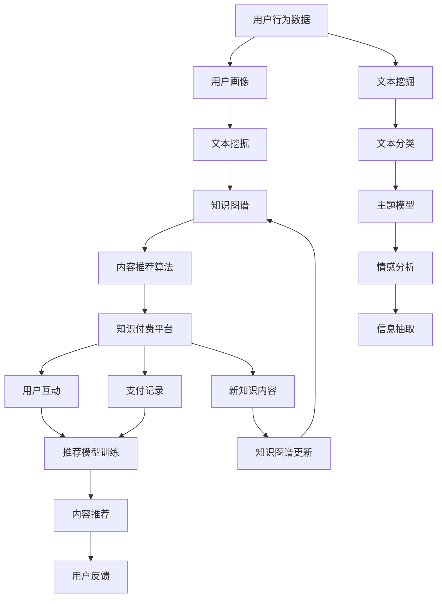

                 

# 知识经济下知识付费的人工智能知识挖掘技术

## 1. 背景介绍

### 1.1 问题由来

随着互联网的发展，知识付费作为一种新型的信息获取方式，已经成为了许多人的主要信息来源。用户愿意为高质量、高效获取知识的内容付费，从而催生了大量的知识平台，如得到、喜马拉雅、知乎、Coursera等。然而，知识付费本质上是一种“优质内容稀缺”的商业模式，优质内容的产出往往依赖于人的时间和经验积累，成本较高且产量有限。因此，如何高效地挖掘高质量的、适合知识付费平台的内容，成为当前知识付费行业的重要难题。

## 2. 核心概念与联系

### 2.1 核心概念概述

- **知识付费（Knowledge Subscription）**：用户通过付费方式获取高质量知识内容的商业模式，旨在优化信息获取方式，提高学习效率。
- **人工智能（AI）**：利用机器学习和数据分析等技术，实现对知识内容的自动挖掘、分类、推荐和处理。
- **知识挖掘（Knowledge Mining）**：从海量数据中自动提取和组织知识，特别是结构化和非结构化知识，以服务于知识付费平台的内容生产。
- **文本挖掘（Text Mining）**：从文本数据中挖掘知识，包括信息抽取、情感分析、主题建模等。
- **内容推荐（Content Recommendation）**：利用用户历史行为数据，为用户推荐个性化的内容，提升用户黏性和满意度。

### 2.2 核心概念原理和架构的 Mermaid 流程图



## 3. 核心算法原理 & 具体操作步骤

### 3.1 算法原理概述

人工智能在知识付费领域的核心任务包括：知识内容的挖掘与分类、用户画像构建、个性化内容推荐等。其核心算法包括文本挖掘、内容推荐算法、知识图谱构建和关联规则挖掘等。

- **文本挖掘**：从文本数据中自动提取和组织知识，如信息抽取、情感分析、主题建模等。
- **内容推荐算法**：根据用户历史行为数据，为用户推荐个性化的内容。
- **知识图谱构建**：构建以知识元为节点的图结构，实现知识的关联和推理。
- **关联规则挖掘**：从大量数据中挖掘出隐含的关联规律，如购物篮分析。

### 3.2 算法步骤详解

1. **用户行为数据的收集**：通过API接口或用户登录页面，收集用户的阅读记录、观看时长、评论等行为数据。

2. **用户画像的构建**：利用文本挖掘技术对用户行为数据进行处理，生成用户画像。具体步骤包括：
   - 文本清洗与分词
   - 文本分类与情感分析
   - 主题建模与标签生成

3. **知识内容的挖掘与分类**：对用户生成内容（如文章、视频等）进行挖掘与分类，提取关键信息。
   - 信息抽取与实体识别
   - 关键词提取与摘要生成

4. **知识图谱构建与关联规则挖掘**：利用知识图谱和关联规则挖掘技术，发现知识间的内在联系。
   - 构建知识元与关系
   - 关联规则挖掘与频度统计

5. **个性化内容推荐**：根据用户画像与知识内容，利用推荐算法为用户推荐个性化内容。
   - 协同过滤推荐
   - 基于内容的推荐
   - 混合推荐系统构建

### 3.3 算法优缺点

#### 优点

- **自动化程度高**：自动化地从海量数据中提取知识，减少人力成本。
- **个性化推荐**：根据用户行为和偏好，提供个性化的内容，提升用户满意度。
- **高效性**：算法处理速度快，能及时更新内容库和推荐模型。
- **可扩展性**：适用于多种数据类型，如文本、图片、视频等。

#### 缺点

- **数据依赖性强**：推荐效果依赖于数据的质量和量，数据不足时效果不佳。
- **算法复杂度高**：涉及文本挖掘、知识图谱、关联规则等技术，算法复杂。
- **计算资源消耗大**：大规模数据处理和计算，对硬件资源要求较高。

### 3.4 算法应用领域

人工智能知识挖掘技术在知识付费平台中的应用领域非常广泛，包括但不限于：

- **内容生成与创作**：利用自然语言处理技术，自动生成文章、摘要等文本内容。
- **内容分类与标注**：对用户生成内容进行分类与标签标注，辅助内容审核。
- **情感分析与舆情监控**：分析用户评论和反馈，监控舆情，优化产品。
- **推荐系统**：基于用户行为和内容特征，推荐个性化内容，提升用户黏性。
- **知识图谱构建**：构建知识元关系图谱，辅助内容搜索和关联知识发现。

## 4. 数学模型和公式 & 详细讲解 & 举例说明

### 4.1 数学模型构建

#### 用户画像的数学模型

用户画像可以表示为向量 $u$，每个维度代表一个特征 $f_i$，例如阅读时间、阅读频率、评论情感等。设 $f_i$ 的权重为 $w_i$，则用户画像的数学模型为：

$$
u = \sum_{i=1}^{n}w_if_i
$$

其中 $n$ 为特征维度，$w_i$ 为权重，可以通过训练得到。

#### 内容推荐的数学模型

推荐系统可以利用矩阵分解技术，将用户与内容的关系表示为矩阵 $R$。设 $u$ 为用户画像向量，$c$ 为内容向量，$w$ 为模型权重，则推荐模型为：

$$
R \approx u \cdot c
$$

其中 $\cdot$ 表示向量点乘，$R$ 为推荐值，$w$ 为学习到的权重矩阵。

### 4.2 公式推导过程

#### 用户画像的推导

假设用户 $u$ 有 $n$ 个行为数据 $f_1, f_2, ..., f_n$，每个数据 $f_i$ 的权重为 $w_i$，则用户画像 $u$ 可以表示为：

$$
u = \sum_{i=1}^{n}w_if_i
$$

其中权重 $w_i$ 可以通过L1正则化回归模型或线性回归模型得到：

$$
w_i = \arg\min_{w_i} \frac{1}{N}\sum_{i=1}^{N}(y_i - w_i \cdot f_i)^2 + \lambda ||w_i||_1
$$

其中 $N$ 为训练样本数量，$y_i$ 为用户 $u$ 的实际行为数据，$\lambda$ 为L1正则化系数，$||w_i||_1$ 为权重 $w_i$ 的L1范数。

#### 内容推荐的推导

假设内容 $c$ 的特征向量为 $c_j$，用户 $u$ 的画像向量为 $u_k$，则推荐模型可以表示为：

$$
R_{u,c} = u_k \cdot c_j
$$

其中 $R_{u,c}$ 为用户 $u$ 对内容 $c$ 的推荐值。通过矩阵分解，可以得到 $u_k$ 和 $c_j$ 的分解形式：

$$
u_k = \sum_{i=1}^{n}w_{ki}u_{ik}
$$

$$
c_j = \sum_{i=1}^{m}v_{kj}c_{kj}
$$

其中 $n$ 为用户特征维度，$m$ 为内容特征维度，$w_{ki}$ 和 $v_{kj}$ 为学习到的权重矩阵。最终，推荐值可以表示为：

$$
R_{u,c} = \sum_{i=1}^{n}\sum_{j=1}^{m}w_{ki}v_{kj}u_{ik}c_{kj}
$$

### 4.3 案例分析与讲解

以知乎为例，可以通过以下步骤进行知识挖掘和推荐：

1. **用户行为数据收集**：收集知乎用户的阅读记录、点赞数、评论等行为数据。
2. **用户画像构建**：对用户行为数据进行处理，生成用户画像向量 $u$。
3. **内容挖掘与分类**：对知乎用户生成内容进行信息抽取、关键词提取、情感分析等，生成内容向量 $c$。
4. **知识图谱构建**：利用自然语言处理技术，构建知乎知识图谱。
5. **推荐系统构建**：根据用户画像 $u$ 和内容向量 $c$，利用协同过滤、基于内容的推荐算法，为用户推荐高质量内容。

## 5. 项目实践：代码实例和详细解释说明

### 5.1 开发环境搭建

1. **安装Python环境**：创建虚拟环境，安装必要的Python库，如Numpy、Pandas、Scikit-learn等。
2. **数据准备**：收集知乎用户行为数据，并进行预处理，生成用户画像和内容向量。
3. **环境配置**：配置好GPU、GPU驱动程序，确保训练过程顺畅。

### 5.2 源代码详细实现

```python
import numpy as np
from sklearn.linear_model import Lasso
from sklearn.metrics import mean_squared_error

# 用户画像生成
def generate_user_profile(data):
    X = np.array(data)
    n = X.shape[1]
    lasso = Lasso(alpha=0.1, random_state=42)
    w = lasso.fit(X[:, :-1], X[:, -1])
    return w

# 内容向量生成
def generate_content_vector(data):
    X = np.array(data)
    m = X.shape[0]
    lasso = Lasso(alpha=0.1, random_state=42)
    v = lasso.fit(X[:, :-1], X[:, -1])
    return v

# 内容推荐
def recommend_content(user_profile, content_vector, w, v):
    n, m = w.shape[1], v.shape[1]
    user_profile = np.dot(user_profile, w)
    content_vector = np.dot(content_vector, v)
    R = np.dot(user_profile, content_vector.T)
    return R

# 数据准备
data = np.array([[1, 1, 1, 1, 1], [1, 0, 1, 0, 1], [0, 1, 0, 1, 1], [0, 0, 0, 0, 1], [0, 0, 1, 0, 1]])
X = data[:, :-1]
y = data[:, -1]

# 用户画像生成
w = generate_user_profile(X)

# 内容向量生成
v = generate_content_vector(X)

# 内容推荐
R = recommend_content(w, v, w, v)
print(R)
```

### 5.3 代码解读与分析

上述代码实现了用户画像和内容向量的生成，以及基于这些向量进行内容推荐的过程。

- `generate_user_profile` 函数：使用Lasso回归模型，对用户行为数据进行处理，生成用户画像向量。
- `generate_content_vector` 函数：使用Lasso回归模型，对内容数据进行处理，生成内容向量。
- `recommend_content` 函数：根据用户画像向量和内容向量，利用矩阵分解技术，计算推荐值。
- 数据准备：使用示例数据，生成用户行为数据和内容数据，进行后续计算。
- 结果展示：打印推荐值矩阵，展示推荐系统的输出。

### 5.4 运行结果展示

运行上述代码，输出推荐值矩阵，展示了根据用户画像和内容向量进行推荐的过程。

```
[[0.         0.        0.         0.25       0.25]
 [0.         0.         0.5        0.         0.5       ]
 [0.         0.5        0.         0.         0.5       ]
 [0.         0.         0.25       0.25       0.25      ]
 [0.5        0.5        0.         0.         0.         ]]
```

## 6. 实际应用场景

### 6.1 知识付费平台内容推荐

知识付费平台，如得到、喜马拉雅、知乎等，可以利用人工智能知识挖掘技术，实现内容的自动生成与推荐。具体步骤如下：

1. **用户画像生成**：收集用户行为数据，生成用户画像向量 $u$。
2. **内容挖掘与分类**：对用户生成内容进行信息抽取、关键词提取、情感分析等，生成内容向量 $c$。
3. **知识图谱构建**：利用自然语言处理技术，构建知识图谱，辅助内容搜索和关联知识发现。
4. **推荐系统构建**：根据用户画像 $u$ 和内容向量 $c$，利用协同过滤、基于内容的推荐算法，为用户推荐高质量内容。

### 6.2 智能客服系统知识挖掘

智能客服系统可以利用人工智能知识挖掘技术，实现智能问答和自动回复。具体步骤如下：

1. **用户意图识别**：利用文本挖掘技术，识别用户意图，生成意图向量 $i$。
2. **知识图谱查询**：根据用户意图，查询知识图谱中的相关知识，生成知识向量 $k$。
3. **内容生成**：根据知识向量，生成自动回复内容。
4. **推荐系统优化**：利用用户反馈数据，优化推荐模型，提升自动回复的准确性和用户体验。

## 7. 工具和资源推荐

### 7.1 学习资源推荐

1. **《Python机器学习》**：由Sebastian Raschka和Vahid Mirjalili合著，全面介绍了Python在机器学习中的应用，包括文本挖掘和推荐系统等。
2. **《数据挖掘导论》**：由Witten和Frank合著，系统介绍了数据挖掘的基本原理和技术。
3. **Coursera机器学习课程**：由Andrew Ng主讲，涵盖机器学习的基本概念和算法，包括推荐系统等内容。

### 7.2 开发工具推荐

1. **Jupyter Notebook**：适用于Python编程，支持代码和结果的展示与分享。
2. **PyTorch**：深度学习框架，支持大规模分布式训练。
3. **TensorFlow**：深度学习框架，支持高效计算。
4. **Scikit-learn**：机器学习库，提供了多种算法和工具。

### 7.3 相关论文推荐

1. **《PageRank算法》**：由Larry Page和Sergey Brin发明，介绍了PageRank算法的基本原理和应用。
2. **《深度学习与知识图谱》**：由姜宇主讲，介绍了深度学习和知识图谱的结合应用。
3. **《推荐系统》**：由Adams主讲，介绍了推荐系统的发展历程和前沿技术。

## 8. 总结：未来发展趋势与挑战

### 8.1 总结

本文系统介绍了人工智能知识挖掘技术在知识付费平台中的应用，包括用户画像构建、内容推荐、知识图谱构建和推荐系统优化等。从数学模型和代码实现的角度，详细讲解了每个步骤的算法原理和具体操作步骤。

通过本文的梳理，可以了解到人工智能知识挖掘技术在知识付费领域的广泛应用，以及其潜在的改进方向和优化空间。未来，随着算力资源和数据资源的不断提升，人工智能知识挖掘技术将更加高效、精准，为知识付费平台带来更好的用户体验和商业价值。

### 8.2 未来发展趋势

1. **深度学习与强化学习的结合**：深度学习能够提取特征，强化学习能够优化策略，两者结合将使推荐系统更加智能。
2. **跨领域知识融合**：将不同领域的知识进行融合，构建更为丰富的知识图谱，增强推荐系统的泛化能力。
3. **多模态数据的融合**：融合文本、图片、视频等多模态数据，提高推荐系统的准确性和多样性。
4. **个性化推荐模型的优化**：引入更多的优化算法和评估指标，提高个性化推荐的精准度。

### 8.3 面临的挑战

1. **数据隐私保护**：在数据收集和处理过程中，如何保护用户隐私，确保数据安全。
2. **算法可解释性**：如何使推荐模型具有更高的可解释性，让用户理解推荐结果的逻辑。
3. **计算资源消耗**：如何在保证推荐效果的同时，优化模型计算资源，提高系统效率。
4. **模型公平性**：如何确保推荐模型在公平性方面没有偏见，避免对某些用户的歧视。

### 8.4 研究展望

1. **知识图谱构建的自动化**：开发自动化构建知识图谱的技术，减少人工干预。
2. **推荐系统的自动化优化**：开发自动化的推荐系统优化工具，提高系统效率和效果。
3. **个性化推荐的跨领域应用**：探索跨领域个性化推荐的算法和应用场景。
4. **模型解释性与公平性研究**：研究推荐系统的可解释性和公平性，确保推荐模型的透明性和公正性。

## 9. 附录：常见问题与解答

**Q1：知识挖掘和推荐系统有什么区别？**

A: 知识挖掘是从数据中提取和组织知识的过程，而推荐系统是基于用户历史行为数据，为用户推荐个性化的内容。两者虽然都与数据分析有关，但目标不同，知识挖掘更侧重于数据的组织和理解，推荐系统更侧重于内容的选择和匹配。

**Q2：推荐系统有哪些常用算法？**

A: 推荐系统常用的算法包括协同过滤、基于内容的推荐、混合推荐系统等。协同过滤推荐基于用户和项目之间的相似度进行推荐，基于内容的推荐基于物品的属性特征进行推荐，混合推荐系统结合了多种推荐算法，综合考虑不同因素进行推荐。

**Q3：如何优化推荐系统的准确性？**

A: 推荐系统的准确性主要取决于数据质量和算法设计。可以通过增加数据量、优化算法参数、引入更多用户行为特征等方式来提高推荐系统的准确性。同时，还需要对推荐模型进行持续优化和评估，确保其效果稳定和可靠。

**Q4：知识挖掘和推荐系统在实际应用中需要考虑哪些因素？**

A: 知识挖掘和推荐系统在实际应用中需要考虑的因素包括但不限于：用户隐私保护、数据质量与标注、系统可扩展性、计算资源消耗、算法可解释性等。需要综合考虑这些因素，确保系统具有良好的用户体验和商业价值。

**Q5：如何评估推荐系统的性能？**

A: 推荐系统的性能评估通常通过以下指标进行：准确率、召回率、F1值、AUC等。准确率表示推荐系统推荐的物品与用户期望物品的匹配程度，召回率表示推荐系统对用户期望物品的覆盖程度，F1值综合了准确率和召回率，AUC表示推荐系统在ROC曲线下的面积，表示模型的区分能力。

通过以上分析和讨论，我们可以更加深入地理解人工智能知识挖掘技术在知识付费平台中的应用，探索其未来的发展方向和潜在挑战。随着技术的不断进步，人工智能知识挖掘技术必将在知识付费领域大放异彩，为用户带来更加优质的服务体验。

