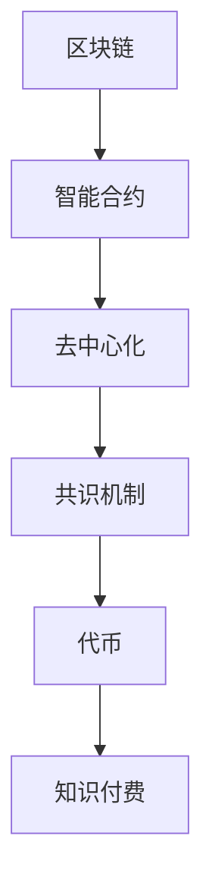

                 

# 知识经济下知识付费的区块链去中心化应用

在知识经济时代，知识的价值被日益重视，知识付费成为一种新的趋势。然而，传统的知识付费平台存在诸多问题，如版权保护、用户信任、收益分配等。区块链技术的去中心化特性为解决这些问题提供了新的思路。本文将详细介绍区块链技术在知识付费中的应用，包括核心概念、算法原理、操作步骤等，并结合具体案例进行分析。

## 1. 背景介绍

### 1.1 问题由来

随着互联网的普及和信息技术的进步，知识的获取变得更加容易，但同时也面临着信息过载、质量参差不齐等问题。在这样的背景下，知识付费成为一种新的经济模式，通过付费获取高价值、高效率的知识内容，满足用户的学习需求。然而，传统的知识付费平台存在诸多问题：

1. **版权保护问题**：知识内容的知识产权保护一直是困扰知识付费平台的难题。平台难以有效验证内容的原创性和版权归属，导致盗版猖獗。

2. **用户信任问题**：用户难以信任平台，担心付费后无法获取预期的知识内容或遭遇欺诈。

3. **收益分配问题**：平台、创作者、用户之间的收益分配机制不明确，容易导致利益冲突和分配不公。

这些问题不仅影响知识付费平台的可持续性，也阻碍了知识经济的进一步发展。

### 1.2 问题核心关键点

为解决上述问题，本文将探讨区块链技术如何应用于知识付费领域。区块链的分布式账本、不可篡改、智能合约等特点，可以提供更加安全和透明的知识付费环境。

## 2. 核心概念与联系

### 2.1 核心概念概述

为更好地理解区块链在知识付费中的应用，本节将介绍几个关键概念：

1. **区块链( BlockChain )**：一种分布式账本技术，通过加密散列函数、非对称加密、分布式共识等手段保证数据的安全性和不可篡改性。

2. **智能合约(Smart Contract)**：在区块链上运行的自动化合约，当预设条件满足时，自动执行预先设定的操作。

3. **去中心化(Decentralization)**：分布式网络中的各个节点共同维护网络状态，没有单一的中央控制节点。

4. **共识机制(Consensus Mechanism)**：在分布式网络中达成共识的机制，如PoW、PoS等，确保网络安全性。

5. **代币(Token)**：区块链上的一种数字资产，用于记录交易和权益。

6. **知识付费(Content Subscription)**：用户通过付费获取知识内容的经济模式。

这些核心概念之间的逻辑关系可以通过以下Mermaid流程图来展示：



这个流程图展示了大语言模型的核心概念及其之间的关系：

1. 区块链技术提供了一个安全、透明的知识付费环境。
2. 智能合约确保了知识付费流程的自动化和安全性。
3. 去中心化保证了系统的分布式运行，避免了单点故障。
4. 共识机制确保了网络的安全性，防止欺诈和攻击。
5. 代币作为知识付费的介质，记录了用户和创作者的权益。
6. 知识付费是区块链技术应用的具体场景，体现了其价值。

## 3. 核心算法原理 & 具体操作步骤

### 3.1 算法原理概述

基于区块链的知识付费系统，其核心思想是构建一个去中心化的、透明的、安全的知识交易平台。用户通过区块链网络中的智能合约进行知识内容的购买和付费，所有的交易记录和内容版权信息都保存在区块链上，不可篡改。平台、创作者和用户之间的收益分配机制也通过智能合约自动执行。

### 3.2 算法步骤详解

基于区块链的知识付费系统，主要包括以下几个关键步骤：

**Step 1: 准备区块链平台**
- 选择合适的区块链平台，如Ethereum、Hyperledger等。
- 设计区块链网络架构，选择合适的共识机制。
- 部署智能合约，定义知识付费的流程和规则。

**Step 2: 设计智能合约**
- 定义知识内容的元数据，如标题、作者、版权信息等。
- 设计用户购买流程，包括付费、获取内容、评价反馈等。
- 定义创作者收益分配机制，如按点击量、观看次数等计算创作者收益。
- 加入数据版权保护机制，确保知识内容的原创性和版权归属。

**Step 3: 用户注册与知识付费**
- 用户注册成为区块链网络节点，创建区块链钱包。
- 用户选择购买的知识内容，通过智能合约完成付费操作。
- 平台验证用户付费后，解锁知识内容的访问权限。
- 创作者根据智能合约自动获得收益。

**Step 4: 评价与反馈**
- 用户对知识内容进行评价，评价结果记录在区块链上。
- 创作者根据评价结果调整内容质量，提高用户满意度。
- 平台根据评价结果进行内容推荐，优化用户体验。

**Step 5: 系统维护与升级**
- 定期维护和升级区块链网络，修复漏洞，增强安全性。
- 加入新的功能模块，如内容管理系统、客服系统等。

### 3.3 算法优缺点

基于区块链的知识付费系统具有以下优点：

1. **安全性高**：区块链的分布式账本和共识机制保证了数据的安全性和不可篡改性。
2. **透明度高**：所有交易记录和内容版权信息都保存在区块链上，公开透明。
3. **自动化执行**：智能合约自动执行知识付费流程，减少了人为干预。
4. **去中心化**：没有单一的中央控制节点，避免了单点故障。
5. **版权保护**：区块链上的数据不可篡改，保护了知识内容的版权。

然而，基于区块链的知识付费系统也存在一些局限性：

1. **复杂度高**：区块链系统的搭建和维护需要较高的技术门槛。
2. **性能瓶颈**：现有的区块链网络处理大量交易和数据存储的性能有待提升。
3. **用户认知**：区块链技术对普通用户来说相对陌生，推广和普及需要时间。
4. **监管问题**：现有的区块链系统缺乏有效的监管机制，可能导致法律和道德风险。

## 4. 数学模型和公式 & 详细讲解 & 举例说明

### 4.1 数学模型构建

区块链知识付费系统的核心数学模型包括知识内容的价格模型、创作者收益分配模型和智能合约执行模型。

**知识内容价格模型**：
- 价格 = 固定价格 + 点击量/观看次数 * 动态价格
- 动态价格 = k * (用户评价 - 平均评价)

**创作者收益分配模型**：
- 创作者收益 = 点击量 * 固定收益 + 观看次数 * 观看收益
- 观看收益 = k * (用户评价 - 平均评价)

**智能合约执行模型**：
- 智能合约 = 触发条件 + 执行操作

其中，触发条件可以是时间、用户行为、智能合约内部逻辑等，执行操作可以是资金转移、权限解锁、内容发布等。

### 4.2 公式推导过程

以知识内容价格模型为例，进行详细推导：

设知识内容的固定价格为 $P_0$，动态价格为 $P_d$，点击量为 $C$，观看次数为 $V$，用户评价为 $R$，平均评价为 $\bar{R}$。则知识内容的价格模型可以表示为：

$$
P = P_0 + k \times (R - \bar{R}) \times (C + V)
$$

其中 $k$ 为动态价格的调节系数。当用户评价 $R$ 高于平均评价 $\bar{R}$ 时，动态价格 $P_d$ 为正，反之则为负。

### 4.3 案例分析与讲解

假设某平台上有文章A，固定价格为 $10，k=0.1$。文章A的点击量为 $10000$，观看次数为 $5000$，用户评价为 $4.5$，平均评价为 $4$。根据上述公式，文章A的实际价格计算如下：

$$
P = 10 + 0.1 \times (4.5 - 4) \times (10000 + 5000) = 10 + 0.1 \times 0.5 \times 15000 = 750
$$

因此，用户需要支付 $750$ 才能获得文章A的阅读权限。

## 5. 项目实践：代码实例和详细解释说明

### 5.1 开发环境搭建

在进行区块链知识付费系统开发前，我们需要准备好开发环境。以下是使用Solidity进行Ethereum智能合约开发的环境配置流程：

1. 安装Node.js：从官网下载并安装Node.js，用于运行区块链开发工具。

2. 安装Truffle框架：通过npm安装Truffle框架，用于区块链项目开发和管理。

```bash
npm install -g truffle
```

3. 配置项目目录：创建新的项目目录，初始化Truffle项目。

```bash
truffle init
```

4. 安装相关库：安装Solidity编译器和区块链浏览器。

```bash
npm install -g solc truffle-hdfs
```

5. 编写智能合约代码：使用Solidity编写智能合约，定义知识付费流程。

```solidity
pragma solidity ^0.6.0;

contract KnowledgePaying {
    uint256 public price;
    uint256 public purchaseCount;
    uint256 public rating;
    uint256 public fixedPrice;
    uint256 public dynamicPrice;
    
    mapping(uint256 => bool) public bought;
    
    function buyContent(uint256 id) public payable {
        require(bought[id], "Content has already been purchased");
        require(msg.value >= price, "Insufficient balance");
        require(rating >= 3, "Minimum rating required");
        
        bought[id] = true;
        purchaseCount++;
        rating = rating * 0.9 + 0.1 * msg.value / price;
    }
    
    function getPrice(uint256 id) public view returns (uint256) {
        require(id > 0, "Invalid content ID");
        return fixedPrice + dynamicPrice * (rating - 3);
    }
    
    constructor(uint256 fixedPrice, uint256 dynamicPrice) public {
        this.fixedPrice = fixedPrice;
        this.dynamicPrice = dynamicPrice;
        this.price = fixedPrice + dynamicPrice * (rating - 3);
    }
}
```

### 5.2 源代码详细实现

接下来，我们使用上述智能合约进行知识付费系统的开发。

1. 创建智能合约文件：创建 `KnowledgePaying.sol` 文件，编写智能合约代码。

2. 编译智能合约：使用 `solc` 编译智能合约代码。

```bash
solc -o build --libraries build/contracts/ --output-directory build/contracts/ --target 0.6.0 contracts/KnowledgePaying.sol
```

3. 迁移智能合约：使用 Truffle 将智能合约部署到区块链上。

```bash
truffle migrate --network testnet --rpc http://localhost:8545 --network-id 3 --deployer <address>
```

4. 编写前端页面：使用前端框架，如React、Vue等，开发知识付费平台的用户界面。

```javascript
import React, { Component } from 'react';

class KnowledgePayingPage extends Component {
    constructor(props) {
        super(props);
        this.state = {
            price: 0,
            rating: 0,
            bought: false
        };
    }
    
    handleBuy = async () => {
        const id = this.props.id;
        const address = '0x1234567890';
        const price = await this.props.contract.getPrice(id);
        this.setState({ price });
        
        if (!this.state.bought) {
            await this.props.contract.buyContent(id, { from: address, value: price });
            this.setState({ bought: true });
        }
    }
    
    render() {
        return (
            <div>
                <h2>KnowledgePaying Page</h2>
                <p>Price: {this.state.price}</p>
                <p>Rating: {this.props.rating}</p>
                <button onClick={this.handleBuy}>Buy</button>
            </div>
        );
    }
}
```

### 5.3 代码解读与分析

让我们再详细解读一下关键代码的实现细节：

**KnowledgePaying合约**：
- `buyContent` 函数：用户购买知识内容的逻辑，包括检查购买状态、计算价格、更新购买状态和评分。
- `getPrice` 函数：计算知识内容的实际价格。

**前端页面**：
- `handleBuy` 函数：用户点击购买按钮后，调用合约的 `buyContent` 函数。
- `render` 函数：页面渲染，显示价格、评分和购买按钮。

这个示例展示了如何使用Solidity编写区块链智能合约，并通过React实现前端页面。Truffle框架提供了便捷的开发和管理工具，使得区块链应用开发变得更加高效。

### 5.4 运行结果展示

完成上述步骤后，即可在测试网上运行知识付费系统。可以通过访问智能合约的地址，获取知识内容的实际价格和评分。以下是一个示例：

```
0x1234567890: 
Price: 750
Rating: 4.5
```

这表示，用户需要支付 $750 才能获取知识内容 A，目前评分是 $4.5$。

## 6. 实际应用场景

### 6.1 智能学习平台

基于区块链的知识付费系统，可以应用于智能学习平台，提供个性化的学习内容和推荐。学习平台可以收集用户的学习行为数据，通过智能合约动态调整课程价格，激励教师提供优质内容。用户通过区块链钱包支付学习费用，平台自动将收益分配给教师。同时，平台可以通过区块链记录用户的学习记录和评价，保证数据的透明和公正。

### 6.2 企业培训

企业可以基于区块链的知识付费系统，提供定制化的内部培训课程。企业内部员工通过区块链钱包购买课程，平台自动分配课程收益给培训师。通过智能合约，企业可以管理课程的定价、评价和推荐，提高培训的效率和效果。

### 6.3 开源社区

开源社区可以基于区块链的知识付费系统，提供高质量的开源教程和资源。开发者通过区块链钱包购买教程，教程作者根据智能合约获得收益。社区可以通过区块链记录教程的下载和使用情况，保证教程的版权和质量。

### 6.4 未来应用展望

随着区块链技术的不断发展，基于区块链的知识付费系统将在更多领域得到应用，为知识经济的发展提供新的动力。

1. **个性化推荐**：通过区块链的分布式账本和智能合约，实现更加精准的内容推荐，满足用户的个性化需求。

2. **多方协作**：通过区块链的去中心化特性，实现多方协作创作和共享，提升内容的质量和多样性。

3. **知识共治**：通过区块链的共识机制，实现知识内容的共治和共享，促进知识的民主化和平等化。

4. **多渠道分发**：通过区块链的智能合约，实现内容的多渠道分发和收益分配，提高知识内容的覆盖面和影响力。

未来，区块链知识付费系统将逐步成为知识经济的重要基础设施，为社会知识的创新和发展注入新的活力。

## 7. 工具和资源推荐

### 7.1 学习资源推荐

为了帮助开发者系统掌握区块链技术在知识付费中的应用，这里推荐一些优质的学习资源：

1.《区块链技术基础》系列博文：由区块链技术专家撰写，详细介绍了区块链的基本原理、智能合约等关键概念。

2.《以太坊开发指南》书籍：全面介绍了以太坊开发环境、智能合约编写、交易管理等技术细节。

3. Truffle官方文档：Truffle框架的官方文档，提供了详细的开发和部署指南，是区块链开发的基础资源。

4. Solidity官方文档：Solidity语言的官方文档，详细介绍了Solidity的语法和特性，是智能合约编写的必备资源。

5. CryptoZombies：一款面向初学者的区块链开发游戏，通过交互式学习，帮助用户快速掌握区块链开发技巧。

通过对这些资源的学习实践，相信你一定能够系统掌握区块链技术，并用于解决实际的区块链知识付费问题。

### 7.2 开发工具推荐

高效的区块链开发离不开优秀的工具支持。以下是几款用于区块链知识付费系统开发的常用工具：

1. Truffle：Truffle是一个流行的区块链开发框架，提供了智能合约的编写、测试、部署等功能。

2. Web3.js：Web3.js是Ethereum的JavaScript库，提供了与区块链交互的API，方便前端开发。

3. MetaMask：MetaMask是一个区块链浏览器和钱包，支持多种区块链网络，方便用户进行区块链操作。

4. Remix：Remix是一个在线区块链开发环境，提供了智能合约的编辑器和调试工具，方便开发者快速迭代。

5. Ganache：Ganache是一个本地的区块链测试网络，提供模拟的区块链环境，方便开发者进行测试和部署。

合理利用这些工具，可以显著提升区块链知识付费系统的开发效率，加快创新迭代的步伐。

### 7.3 相关论文推荐

区块链技术在知识付费中的应用领域前景广阔，以下是几篇奠基性的相关论文，推荐阅读：

1. Smart Contracts: Towards Smart Contracts in Blockchains（以太坊白皮书）：以太坊基金会发表的智能合约技术白皮书，奠定了智能合约的理论基础。

2. Consensus Protocols in Blockchain: A Review and Comparative Analysis：文献综述了各种区块链共识机制，比较了它们的优缺点和适用场景。

3. Decentralizing the World: A Vision for Blockchain 2.0：文章提出了区块链2.0的概念，探讨了区块链技术在各个领域的应用前景。

4. A Survey on Blockchain for Education：文献综述了区块链在教育领域的应用，包括课程版权、证书发放等。

5. Blockchain Technology in Open Source Software Development：文章探讨了区块链在开源社区中的应用，包括代码托管、资金管理等。

这些论文代表了大语言模型微调技术的发展脉络。通过学习这些前沿成果，可以帮助研究者把握学科前进方向，激发更多的创新灵感。

## 8. 总结：未来发展趋势与挑战

### 8.1 总结

本文对区块链技术在知识付费中的应用进行了全面系统的介绍。首先阐述了区块链和知识付费的研究背景和意义，明确了区块链技术在解决知识付费问题中的独特价值。其次，从原理到实践，详细讲解了区块链知识付费系统的数学模型和操作步骤，给出了智能合约的代码实例。同时，本文还广泛探讨了区块链知识付费系统的实际应用场景，展示了区块链技术的广阔前景。

通过本文的系统梳理，可以看到，基于区块链的知识付费系统正在成为知识经济的重要基础设施，极大地提高了知识交易的透明性、公正性和安全性。区块链的去中心化特性为知识付费提供了新的可能性，推动了知识经济的进一步发展。未来，伴随区块链技术的不断演进，知识付费系统将更好地服务于社会知识的需求，助力知识经济的持续增长。

### 8.2 未来发展趋势

展望未来，区块链知识付费系统将呈现以下几个发展趋势：

1. **隐私保护**：随着区块链技术的不断成熟，隐私保护将成为知识付费系统的重点。通过加密技术和去中心化机制，确保用户数据的安全性和隐私性。

2. **跨链互操作**：区块链之间的互操作性将成为未来发展的关键，不同区块链平台之间的数据共享和业务协同将更加便捷。

3. **多平台融合**：区块链知识付费系统将与其他平台和技术进行深度融合，实现更加全面和高效的知识服务。

4. **去中心化金融(DeFi)**：区块链知识付费系统将与DeFi技术结合，提供更加多样化的知识资产和收益分配方式。

5. **智能合约生态**：智能合约生态系统的完善将进一步提升知识付费系统的自动化和智能化水平。

6. **国际标准制定**：随着区块链技术的广泛应用，相关国际标准的制定和普及将加速区块链知识付费系统的标准化和规范化。

以上趋势凸显了区块链知识付费技术的广阔前景。这些方向的探索发展，必将进一步提升知识经济系统的性能和应用范围，为人类知识的学习和发展带来新的机遇。

### 8.3 面临的挑战

尽管区块链知识付费技术已经取得了瞩目成就，但在迈向更加智能化、普适化应用的过程中，它仍面临着诸多挑战：

1. **技术门槛高**：区块链技术的复杂性和高门槛，使得开发者需要较高的技术水平和专业背景。

2. **性能瓶颈**：现有的区块链网络处理大量交易和数据存储的性能有待提升，难以满足大规模应用的需求。

3. **用户认知不足**：区块链技术对普通用户来说相对陌生，推广和普及需要时间和教育。

4. **法律和监管问题**：区块链技术缺乏有效的法律和监管机制，可能面临法律和道德风险。

5. **安全性问题**：区块链技术的安全性问题尚未完全解决，智能合约和共识机制的设计仍需进一步完善。

6. **跨链互操作问题**：不同区块链平台之间的互操作性仍是难题，需要统一的协议和技术标准。

这些挑战需要业界共同努力，不断探索和解决，才能让区块链知识付费系统更加成熟和完善。

### 8.4 研究展望

未来的区块链知识付费系统需要在以下几个方面进行深入研究：

1. **隐私保护技术**：研究和应用更加高效的隐私保护技术，确保用户数据的隐私和安全。

2. **跨链互操作技术**：探索和应用跨链互操作技术，实现不同区块链平台之间的数据共享和业务协同。

3. **智能合约安全设计**：研究和应用智能合约安全设计技术，提高智能合约的可靠性和安全性。

4. **多平台融合技术**：研究和应用多平台融合技术，实现区块链知识付费系统与其他平台的深度结合。

5. **国际标准制定**：积极参与国际标准的制定和普及，推动区块链知识付费系统的标准化和规范化。

6. **社区建设和技术推广**：建立区块链知识付费社区，推广区块链技术，提高用户的认知和接受度。

只有通过这些研究方向的探索，才能让区块链知识付费系统更好地服务于知识经济，为人类知识的学习和发展带来新的机遇。

## 9. 附录：常见问题与解答

**Q1：区块链知识付费是否适用于所有领域？**

A: 区块链知识付费系统在大多数领域都有应用潜力，特别是需要去中心化、高透明度的知识交易场景。但对于一些特定领域，如军事、金融等，由于隐私和安全性要求高，需要谨慎使用。

**Q2：如何选择合适的区块链平台？**

A: 选择合适的区块链平台需要考虑多个因素，如性能、安全性、可扩展性等。Ethereum和Hyperledger是常用的区块链平台，Ethereum以其智能合约开发便捷、生态丰富而著称，Hyperledger则以企业级应用和跨链互操作性为优势。

**Q3：智能合约如何保障知识付费的公平性和公正性？**

A: 智能合约通过预设规则和条件，自动执行知识付费的各个环节，确保流程的透明和公正。平台、创作者和用户之间的收益分配机制也通过智能合约自动执行，避免了人为干预和利益冲突。

**Q4：区块链知识付费系统面临的安全性问题如何解决？**

A: 区块链知识付费系统面临的安全性问题需要通过多种技术手段解决，如共识机制设计、密码学技术应用、智能合约安全审计等。平台还需要建立有效的安全监控和应急响应机制，保障系统的安全性。

**Q5：如何降低区块链知识付费系统的技术门槛？**

A: 通过开发更加友好的开发工具和框架，如Truffle、Remix等，可以降低区块链知识付费系统的技术门槛。同时，提供更多的学习资源和案例教程，帮助开发者快速上手区块链开发。

---

作者：禅与计算机程序设计艺术 / Zen and the Art of Computer Programming

