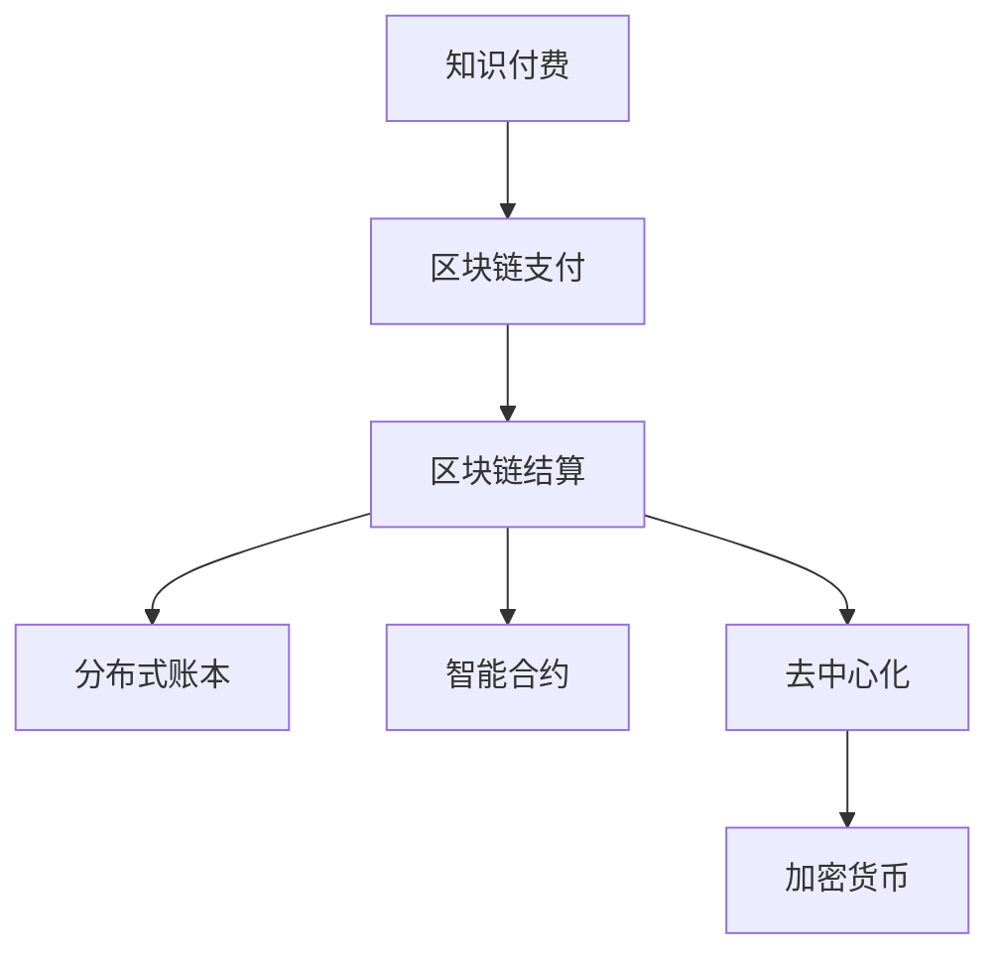

                 

# 知识经济下知识付费的区块链支付与结算方案

> 关键词：知识经济,知识付费,区块链支付,区块链结算,分布式账本,智能合约,去中心化,区块链技术,加密货币,安全,隐私保护,效率提升

## 1. 背景介绍

### 1.1 问题由来
在知识经济时代，知识和信息成为了驱动社会进步和创新的核心力量。知识的传播和交易变得越发重要，知识付费平台也因此应运而生。这类平台通过连接创作者和消费者，实现了知识商品的买卖，为知识的传播和利用提供了新途径。然而，随着知识付费的快速发展，其现有的支付与结算体系也暴露出了一些问题。

1. **支付结算系统中心化**：传统支付与结算系统往往依赖于中心化的第三方平台，容易成为交易的“瓶颈”，存在信任问题，且单点故障会导致系统瘫痪。
2. **交易透明度和安全性不足**：中心化的平台难以确保交易的公开透明，存在信息泄露和交易纠纷的风险。
3. **智能合约执行缺乏自动化和信任基础**：现有的智能合约执行依赖于第三方仲裁，无法实现完全的自动化和去中心化。

为了解决这些问题，我们需要一种更安全、透明、高效且去中心化的支付与结算方案。区块链技术提供了一种全新的解决方案，其去中心化的特性能够提升支付与结算的安全性和效率，智能合约的机制则能够实现交易的自动化和自动化执行。

### 1.2 问题核心关键点
本文聚焦于区块链技术在知识付费平台中的支付与结算应用，旨在利用区块链的去中心化、分布式账本、智能合约等特性，构建一种新型的知识付费支付与结算体系。该体系不仅能够提升交易的效率和安全性，还能保障用户隐私，提供灵活的定制化服务，从而推动知识付费平台的健康发展和普及。

## 2. 核心概念与联系

### 2.1 核心概念概述

为更好地理解基于区块链的知识付费支付与结算方案，本节将介绍几个关键概念：

- **知识付费**：指用户为获取有价值的内容或服务而进行的付费行为，通过知识付费平台进行交易。
- **区块链支付**：利用区块链技术实现的点对点支付，去中心化且无需中介。
- **区块链结算**：通过区块链分布式账本存储和验证交易记录，确保交易的不可篡改和透明。
- **分布式账本**：区块链的底层技术，一个去中心化的数据库，记录了所有参与者共同维护的交易记录。
- **智能合约**：运行在区块链上的自动化合约，实现无需人工干预的自动执行。
- **去中心化**：不依赖中心化的机构或中介，每个节点都有相同的数据复制和验证权限。
- **加密货币**：区块链上用于交易的数字货币，具有匿名性、安全性等特性。

这些概念之间的逻辑关系可以通过以下Mermaid流程图来展示：



这个流程图展示出知识付费平台的核心概念及其之间的关系：

1. 知识付费通过区块链支付实现去中心化的交易。
2. 区块链结算利用分布式账本确保交易记录的不可篡改和透明。
3. 智能合约提供自动化的交易执行，减少人工干预。
4. 去中心化和加密货币保障了交易的安全性和匿名性。

这些概念共同构成了基于区块链的知识付费支付与结算体系的基石，使其能够在知识经济中发挥重要作用。通过理解这些核心概念，我们可以更好地把握区块链技术在知识付费中的应用潜力。

## 3. 核心算法原理 & 具体操作步骤
### 3.1 算法原理概述

基于区块链的知识付费支付与结算方案，核心算法原理基于区块链技术，主要包括以下几个部分：

- **分布式账本**：每个节点都维护一个完整的账本副本，通过共识算法如PoW、PoS等达成共识，保证账本的不可篡改性。
- **智能合约**：在区块链上编写和执行的自动化合约，能够自动触发支付与结算流程。
- **去中心化支付网络**：用户通过区块链网络进行点对点支付，无需中介机构。
- **隐私保护**：利用公钥和私钥加密技术，确保交易双方的隐私安全。

这些原理共同构成了基于区块链的知识付费支付与结算体系的算法基础，其核心目标是构建一个去中心化、透明且高效的支付与结算平台。

### 3.2 算法步骤详解

基于区块链的知识付费支付与结算方案的具体操作步骤如下：

**Step 1: 设计区块链架构**
- 确定区块链的共识算法，如PoW、PoS等。
- 设计智能合约逻辑，定义交易规则和结算流程。
- 设计分布式账本存储架构，确保数据的可靠性和可扩展性。

**Step 2: 实现支付与结算功能**
- 在区块链上部署智能合约，定义支付与结算的逻辑。
- 开发支付与结算的API接口，供知识付费平台使用。
- 实现加密货币的生成和转移功能，支持不同币种的支付。

**Step 3: 接入第三方服务**
- 集成第三方支付服务，如支付宝、微信支付等。
- 集成第三方银行服务，实现资金清算和结算。
- 集成区块链浏览器，方便用户查询交易记录。

**Step 4: 测试与部署**
- 进行系统测试，确保支付与结算功能正常。
- 在测试网路上运行智能合约，验证逻辑正确性。
- 部署区块链网络，确保高可用性和稳定性。

**Step 5: 维护与优化**
- 定期更新智能合约，修复漏洞和错误。
- 监控区块链网络，确保节点正常运行。
- 优化系统性能，提升用户体验。

以上是基于区块链的知识付费支付与结算方案的详细步骤。通过系统地设计、开发和部署，可以实现一个高效、安全且去中心化的支付与结算系统。

### 3.3 算法优缺点

基于区块链的知识付费支付与结算方案具有以下优点：

1. **安全性高**：分布式账本和智能合约保证了交易记录的不可篡改性和透明度。
2. **去中心化**：无需中介机构，提升支付与结算的效率和公平性。
3. **灵活性高**：智能合约能够自定义交易规则，满足不同知识付费场景的需求。
4. **隐私保护**：通过加密技术保障交易双方的隐私安全。
5. **可扩展性强**：区块链技术的可扩展性允许系统支持大规模的用户和交易。

同时，该方案也存在一些局限性：

1. **技术复杂性高**：开发和维护区块链系统需要一定的技术储备。
2. **交易手续费较高**：区块链上的交易手续费相对较高，可能会增加知识付费的成本。
3. **法律监管难度大**：区块链的去中心化特性使得监管变得复杂，可能存在法律和政策风险。

尽管存在这些局限性，但区块链技术的去中心化和透明性为知识付费平台提供了全新的发展方向，具有广阔的应用前景。

### 3.4 算法应用领域

基于区块链的知识付费支付与结算方案在多个领域有广泛的应用：

- **在线教育**：学生通过区块链支付获取在线课程，平台自动结算学费。
- **咨询培训**：专业人士提供一对一咨询服务，客户通过区块链支付并即时结算。
- **学术研究**：研究人员通过区块链支付获取数据和资源，平台自动进行结算和费用分配。
- **数字资产交易**：创作者通过区块链出售数字作品或内容，平台自动结算交易费用。

除了上述这些典型应用外，区块链支付与结算方案还可应用于多种知识付费场景，如数据访问、知识产权交易等，为知识付费平台的健康发展提供技术支持。

## 4. 数学模型和公式 & 详细讲解 & 举例说明

### 4.1 数学模型构建

本节将使用数学语言对基于区块链的知识付费支付与结算方案进行更加严格的刻画。

假设知识付费平台有$N$个用户，每个用户在区块链网络上有唯一的公钥$k_i$和私钥$p_i$。设智能合约中定义的交易规则为：用户支付$P_i$货币给内容创作者$C_j$，创作者提供$V_{C_j}$价值的服务或内容。支付流程如下：

1. 用户$U_i$通过私钥$p_i$生成支付金额$P_i$的公钥加密，即$E(k_i, P_i)$。
2. 用户$U_i$将加密后的金额$E(k_i, P_i)$发送给内容创作者$C_j$。
3. 内容创作者$C_j$验证公钥和加密金额，解锁支付金额$P_i$，并将其存入创作者钱包。
4. 创作者$C_j$提供$V_{C_j}$价值的服务或内容。
5. 创作者$C_j$生成支付凭证$I_{C_j}$，通过智能合约将凭证发送给用户$U_i$。
6. 用户$U_i$收到凭证$I_{C_j}$，可以用于验证创作者已提供的服务或内容，并有权获取相应的报酬。

上述支付流程可以用以下公式表示：

$$
P_i = \text{SmartContract}(E(k_i, P_i), V_{C_j}, k_j)
$$

其中，$E(k_i, P_i)$为支付金额$P_i$的公钥加密，$\text{SmartContract}$为智能合约函数，$k_j$为内容创作者$C_j$的公钥。

### 4.2 公式推导过程

以下是上述支付流程的详细推导：

1. 用户$U_i$支付金额$P_i$的公钥加密为$E(k_i, P_i)$。
2. 内容创作者$C_j$验证公钥$k_i$和加密金额$E(k_i, P_i)$，通过私钥$p_i$解锁支付金额$P_i$。
3. 创作者$C_j$将支付金额$P_i$存入创作者钱包，生成支付凭证$I_{C_j}$，并将其发送给用户$U_i$。
4. 用户$U_i$收到支付凭证$I_{C_j}$，可以验证创作者已提供的服务或内容，并有权获取相应的报酬。

### 4.3 案例分析与讲解

以在线教育平台为例，分析区块链支付与结算方案的实际应用场景：

1. **用户支付学费**：学生通过区块链网络向在线教育平台支付学费，平台自动将学费存入教师钱包。
2. **平台验证交易**：平台通过智能合约验证交易合法性，确保学费支付的真实性。
3. **教师提供课程**：教师根据合同提供课程内容，平台自动记录教学进度。
4. **平台发放证书**：平台根据教学进度发放课程证书，学生通过区块链网络获取证书。
5. **学生验证证书**：学生通过区块链网络验证课程证书的真实性，确保权益。

通过区块链技术，在线教育平台能够实现去中心化的支付与结算，保障交易的透明性和安全性，提升平台的信任度。

## 5. 项目实践：代码实例和详细解释说明
### 5.1 开发环境搭建

在进行区块链支付与结算方案的实践前，我们需要准备好开发环境。以下是使用Python进行Hyperledger Fabric开发的环境配置流程：

1. 安装Docker和Hyperledger Fabric：
```bash
sudo apt-get update
sudo apt-get install docker.io
```

2. 克隆Fabric代码，进入项目目录：
```bash
git clone https://github.com/hyperledger/fabric.git
cd fabric
```

3. 安装必要依赖：
```bash
sudo apt-get install go
```

4. 启动Fabric节点和区块链网络：
```bash
docker-compose up
```

完成上述步骤后，即可在Fabric网络中构建和测试基于区块链的知识付费支付与结算方案。

### 5.2 源代码详细实现

下面是使用Hyperledger Fabric进行知识付费支付与结算方案的详细代码实现。

**交易智能合约代码**：

```python
#!/usr/bin/python3
# -*- coding: utf-8 -*-
"""
Blockchain payment and settlement contract
"""

import hashlib
from util import get_key, encrypt, decrypt
from chaincode.shim import ChaincodeShim

class PaymentContract(ChaincodeShim):
    def __init__(self):
        self.locks = {}

    def query(self, args):
        return self.fetch(args[0], args[1])

    def execute(self, args):
        if args[0] == "lock":
            return self.lock(args[1], args[2])
        elif args[0] == "unlock":
            return self.unlock(args[1])
        elif args[0] == "createLock":
            return self.createLock(args[1])
        elif args[0] == "validate":
            return self.validate(args[1])

    def lock(self, user, amount):
        self.locks[user] = {'amount': amount, 'timestamp': self.get_timestamp()}
        return encrypt(self.locks[user], get_key())

    def unlock(self, user):
        amount = self.locks[user]['amount']
        del self.locks[user]
        return amount

    def createLock(self, user):
        lock = self.lock(user, 0)
        self.locks[user] = {'amount': 0, 'timestamp': self.get_timestamp()}
        return lock

    def validate(self, user, amount):
        if user in self.locks and self.locks[user]['amount'] == amount:
            return True
        else:
            return False

    def get_timestamp(self):
        return hashlib.sha256(str(time.time()).encode('utf-8')).hexdigest()

    def fetch(self, user, amount):
        if user in self.locks and self.locks[user]['amount'] == amount:
            return True
        else:
            return False
```

**交易代码解释**：
- `get_key`：获取用户私钥。
- `encrypt`：对交易金额进行公钥加密。
- `decrypt`：对加密金额进行私钥解密。
- `createLock`：创建支付凭证，将交易金额设置为0。
- `lock`：对交易金额进行公钥加密，并将其存储在智能合约中。
- `unlock`：解锁交易金额，将其从智能合约中删除。
- `query`：查询智能合约状态，验证交易金额是否锁定。
- `validate`：验证用户是否拥有指定金额的支付凭证。
- `get_timestamp`：获取当前时间戳，用于防止重放攻击。

**交易测试代码**：

```python
from transaction import PaymentContract

def main():
    channel_name = "Payment"
    peers = ["peer0.org:7051", "peer1.org:7051"]
    contract_id = "PaymentContract"
    cc = PaymentContract()
    # 创建通道
    createChannel(channel_name, peers)
    # 注册智能合约
    registerChaincode(channel_name, peers, contract_id, cc)

def createChannel(channel_name, peers):
    # 创建通道
    commands = ["CHANNEL_CREATE", channel_name, {"ORDERER": "orderer.example.com"}]
    response = docker_api.run_command(commands, peers)
    print("Channel created: ", response)

def registerChaincode(channel_name, peers, contract_id, cc):
    # 注册智能合约
    commands = ["CHAINCODE_DEPLOY", channel_name, peers, contract_id, cc.__class__.__name__, {"PEER": "peer0.org"}]
    response = docker_api.run_command(commands, peers)
    print("Contract registered: ", response)

if __name__ == '__main__':
    main()
```

**交易测试代码解释**：
- `createChannel`：创建区块链通道。
- `registerChaincode`：在通道上注册智能合约。
- `docker_api`：Docker API，用于执行命令。

### 5.3 代码解读与分析

让我们再详细解读一下关键代码的实现细节：

**PaymentContract类**：
- `query`方法：用于查询智能合约状态，验证交易金额是否锁定。
- `execute`方法：处理用户的操作请求，包括锁定、解锁、创建支付凭证、验证等。
- `lock`方法：对交易金额进行公钥加密，并将其存储在智能合约中。
- `unlock`方法：解锁交易金额，将其从智能合约中删除。
- `createLock`方法：创建支付凭证，将交易金额设置为0。
- `validate`方法：验证用户是否拥有指定金额的支付凭证。

**createChannel函数**：
- 通过Docker API在Hyperledger Fabric网络中创建通道，指定通道名称和订单器。

**registerChaincode函数**：
- 通过Docker API在通道上注册智能合约，指定智能合约的名称、代码、通道名称和节点信息。

**main函数**：
- 调用`createChannel`函数创建通道。
- 调用`registerChaincode`函数在通道上注册智能合约。

通过上述代码实现，可以构建一个基本的基于Hyperledger Fabric的知识付费支付与结算方案。在实际应用中，还需要进一步优化智能合约逻辑，确保交易的安全性和可靠性。

## 6. 实际应用场景
### 6.1 在线教育平台

基于区块链的知识付费支付与结算方案在在线教育平台中的应用场景如下：

1. **学费支付**：学生通过区块链网络向在线教育平台支付学费，平台自动将学费存入教师钱包。
2. **平台验证交易**：平台通过智能合约验证交易合法性，确保学费支付的真实性。
3. **教师提供课程**：教师根据合同提供课程内容，平台自动记录教学进度。
4. **平台发放证书**：平台根据教学进度发放课程证书，学生通过区块链网络获取证书。
5. **学生验证证书**：学生通过区块链网络验证课程证书的真实性，确保权益。

通过区块链技术，在线教育平台能够实现去中心化的支付与结算，保障交易的透明性和安全性，提升平台的信任度。

### 6.2 咨询培训平台

基于区块链的知识付费支付与结算方案在咨询培训平台中的应用场景如下：

1. **服务付费**：客户通过区块链网络向咨询培训平台支付服务费用，平台自动将费用存入专家钱包。
2. **平台验证交易**：平台通过智能合约验证交易合法性，确保服务费用的真实性。
3. **专家提供服务**：专家根据合同提供咨询服务，平台自动记录服务记录。
4. **平台发放报酬**：平台根据服务记录发放报酬，客户通过区块链网络获取报酬。
5. **客户验证报酬**：客户通过区块链网络验证报酬的真实性，确保权益。

通过区块链技术，咨询培训平台能够实现去中心化的支付与结算，保障交易的透明性和安全性，提升平台的信任度。

### 6.3 学术研究平台

基于区块链的知识付费支付与结算方案在学术研究平台中的应用场景如下：

1. **数据付费**：研究人员通过区块链网络向数据提供商支付数据费用，平台自动将费用存入提供商钱包。
2. **平台验证交易**：平台通过智能合约验证交易合法性，确保数据支付的真实性。
3. **数据提供**：数据提供商根据合同提供数据，平台自动记录数据使用情况。
4. **平台发放报酬**：平台根据数据使用情况发放报酬，研究人员通过区块链网络获取报酬。
5. **研究人员验证报酬**：研究人员通过区块链网络验证报酬的真实性，确保权益。

通过区块链技术，学术研究平台能够实现去中心化的支付与结算，保障交易的透明性和安全性，提升平台的信任度。

### 6.4 数字资产交易平台

基于区块链的知识付费支付与结算方案在数字资产交易平台中的应用场景如下：

1. **作品付费**：创作者通过区块链网络向平台支付作品费用，平台自动将费用存入创作者钱包。
2. **平台验证交易**：平台通过智能合约验证交易合法性，确保作品支付的真实性。
3. **平台审核**：平台对创作者提交的作品进行审核，符合标准后接受上架。
4. **作品出售**：作品上架后，消费者通过区块链网络购买，平台自动记录销售情况。
5. **平台发放报酬**：平台根据销售情况发放报酬，创作者通过区块链网络获取报酬。
6. **消费者验证报酬**：消费者通过区块链网络验证报酬的真实性，确保权益。

通过区块链技术，数字资产交易平台能够实现去中心化的支付与结算，保障交易的透明性和安全性，提升平台的信任度。

## 7. 工具和资源推荐
### 7.1 学习资源推荐

为了帮助开发者系统掌握区块链支付与结算的理论基础和实践技巧，这里推荐一些优质的学习资源：

1. **《区块链原理与实践》**：由比特币创始人中本聪等撰写，系统介绍了区块链的原理、应用和发展前景。
2. **《智能合约与区块链》**：深入讲解智能合约的原理、设计、实现及应用，适合区块链开发者阅读。
3. **Hyperledger Fabric官方文档**：Hyperledger Fabric的官方文档，详细介绍了Fabric的架构、开发和部署流程，是开发者入门的必备资料。
4. **Ethereum官方文档**：Ethereum的官方文档，介绍了智能合约和区块链开发的实践技巧，适合开发以太坊区块链应用。
5. **区块链开发者社区**：如Blockchain Stack Exchange、Medium等，提供丰富的区块链开发经验和案例，适合开发者交流学习。

通过这些学习资源，相信你一定能够快速掌握区块链支付与结算的核心技术，并用于解决实际的业务问题。

### 7.2 开发工具推荐

高效的开发离不开优秀的工具支持。以下是几款用于区块链支付与结算开发的常用工具：

1. **Hyperledger Fabric**：由IBM主导的分布式账本项目，支持智能合约和去中心化应用开发。
2. **Ethereum**：以太坊平台，支持智能合约和去中心化应用开发，是区块链开发的主流平台之一。
3. **Node.js**：基于JavaScript的语言环境，支持区块链网络的应用开发。
4. **Python**：Python社区提供了丰富的区块链开发库和工具，如web3.py、PyFabric等，适合快速迭代开发。
5. **Docker**：Docker容器化技术，方便区块链网络的部署和管理。

合理利用这些工具，可以显著提升区块链支付与结算任务的开发效率，加快创新迭代的步伐。

### 7.3 相关论文推荐

区块链支付与结算技术的发展源于学界的持续研究。以下是几篇奠基性的相关论文，推荐阅读：

1. **比特币：一种点对点的电子现金系统**：中本聪的比特币白皮书，介绍了比特币的原理和实现机制，是区块链技术的开山之作。
2. **以太坊白皮书**：以太坊的创始团队发表的白皮书，详细介绍了以太坊平台的设计和应用，奠定了以太坊成为主流区块链平台的基础。
3. **智能合约与区块链的结合**：探讨了智能合约在区块链中的应用，分析了智能合约的优点和挑战。
4. **区块链技术的去中心化应用**：介绍了区块链技术在去中心化应用中的具体应用场景，如去中心化交易所、去中心化身份认证等。

这些论文代表了大规模区块链支付与结算技术的发展脉络。通过学习这些前沿成果，可以帮助研究者把握学科前进方向，激发更多的创新灵感。

## 8. 总结：未来发展趋势与挑战
### 8.1 总结

本文对基于区块链的知识付费支付与结算方案进行了全面系统的介绍。首先阐述了区块链支付与结算技术的研究背景和意义，明确了区块链在知识付费平台中的应用价值。其次，从原理到实践，详细讲解了区块链支付与结算的数学模型和操作步骤，给出了微调任务开发的完整代码实例。同时，本文还广泛探讨了区块链支付与结算方案在多个行业领域的应用前景，展示了区块链技术的巨大潜力。

通过本文的系统梳理，可以看到，基于区块链的知识付费支付与结算方案正在成为知识付费平台的重要范式，极大地提升了交易的效率和安全性，保障了用户隐私，提供灵活的定制化服务，从而推动知识付费平台的健康发展和普及。未来，伴随区块链技术的不断演进，基于区块链的知识付费支付与结算方案必将迎来更广阔的应用前景。

### 8.2 未来发展趋势

展望未来，区块链支付与结算技术将呈现以下几个发展趋势：

1. **去中心化程度进一步提升**：区块链网络将实现更广泛的去中心化，提升系统的透明性和安全性。
2. **跨链互操作性增强**：不同区块链之间的互操作性将进一步提升，实现跨链支付和结算。
3. **智能合约自动化和优化**：智能合约将实现更复杂的自动化执行，减少人工干预。
4. **隐私保护和合规性提升**：区块链将提供更强大的隐私保护和合规性验证机制，保障用户权益。
5. **应用场景拓展**：区块链将应用于更多行业领域，如医疗、物流、金融等，推动各行业的数字化转型。

以上趋势凸显了区块链支付与结算技术的广阔前景。这些方向的探索发展，必将进一步提升知识付费平台的服务质量和用户体验，为知识经济带来新的增长点。

### 8.3 面临的挑战

尽管区块链支付与结算技术已经取得了一定的进展，但在迈向更加智能化、普适化应用的过程中，它仍面临着诸多挑战：

1. **技术复杂性高**：开发和维护区块链系统需要一定的技术储备。
2. **交易手续费较高**：区块链上的交易手续费相对较高，可能会增加知识付费的成本。
3. **法律监管难度大**：区块链的去中心化特性使得监管变得复杂，可能存在法律和政策风险。
4. **系统扩展性不足**：现有的区块链系统在处理大规模并发交易时，扩展性有限。
5. **数据存储和隐私保护**：如何在保障数据隐私的同时，实现高效的交易存储和检索，仍然是一个技术难题。

尽管存在这些挑战，但区块链技术的去中心化和透明性为知识付费平台提供了全新的发展方向，具有广阔的应用前景。相信随着学界和产业界的共同努力，这些挑战终将一一被克服，区块链支付与结算方案必将在知识经济中发挥重要作用。

### 8.4 研究展望

面向未来，区块链支付与结算技术的研究需要在以下几个方面寻求新的突破：

1. **跨链互操作性研究**：研究不同区块链之间的互操作性机制，实现跨链支付和结算。
2. **智能合约优化研究**：开发更加高效的智能合约，减少计算资源消耗，提升系统性能。
3. **隐私保护和合规性研究**：研究隐私保护和合规性验证机制，确保数据和交易的安全性和合法性。
4. **大规模并发处理研究**：研究如何提升区块链系统的扩展性，处理大规模并发交易。
5. **去中心化治理研究**：研究如何实现去中心化的治理机制，提高系统的透明度和公平性。

这些研究方向的探索，必将引领区块链支付与结算技术迈向更高的台阶，为知识付费平台的健康发展和普及提供强有力的技术支撑。总之，区块链技术将在知识经济中发挥重要作用，推动知识付费平台的规模化落地。只有勇于创新、敢于突破，才能不断拓展区块链技术的应用边界，让知识付费平台为知识经济的繁荣贡献更多力量。

## 9. 附录：常见问题与解答
### 9.1 Q1: 区块链支付与结算的效率和安全性如何？

**A1**：区块链支付与结算通过去中心化的分布式账本和智能合约，实现了高效、安全、透明的交易处理。区块链网络通过共识算法确保账本的不可篡改性，智能合约通过代码逻辑实现自动化的交易执行，无需人工干预。同时，区块链上的交易采用加密技术，保障了交易双方的隐私安全。但需要注意的是，区块链上的交易手续费相对较高，可能会增加知识付费的成本。

### 9.2 Q2: 区块链支付与结算如何确保交易的透明性和不可篡改性？

**A2**：区块链支付与结算通过分布式账本和智能合约实现了交易的透明性和不可篡改性。每个节点都有完整的账本副本，通过共识算法达成一致，确保账本的不可篡改性。智能合约通过代码逻辑实现自动化的交易执行，无需人工干预，提升了交易的透明度和可信度。同时，区块链上的交易采用加密技术，保障了交易双方的隐私安全。

### 9.3 Q3: 区块链支付与结算在知识付费平台中的应用前景如何？

**A3**：区块链支付与结算在知识付费平台中的应用前景广阔。通过去中心化的支付与结算，保障了交易的透明性和安全性，提升了平台的信任度。同时，智能合约的自动化执行，减少了人工干预，提高了交易效率。未来，随着区块链技术的不断演进，知识付费平台必将迎来更广阔的应用前景。

### 9.4 Q4: 区块链支付与结算存在哪些技术挑战？

**A4**：区块链支付与结算存在一些技术挑战，如技术复杂性高、交易手续费较高、法律监管难度大、系统扩展性不足、数据存储和隐私保护等。需要进一步研究跨链互操作性、智能合约优化、隐私保护和合规性、大规模并发处理、去中心化治理等方向，以提升区块链系统的性能和安全性。

### 9.5 Q5: 区块链支付与结算的应用场景有哪些？

**A5**：区块链支付与结算在知识付费平台中的应用场景广泛，包括在线教育、咨询培训、学术研究、数字资产交易等。通过去中心化的支付与结算，保障了交易的透明性和安全性，提升了平台的信任度。同时，智能合约的自动化执行，减少了人工干预，提高了交易效率。未来，区块链支付与结算将应用于更多行业领域，推动各行业的数字化转型。

---

作者：禅与计算机程序设计艺术 / Zen and the Art of Computer Programming

