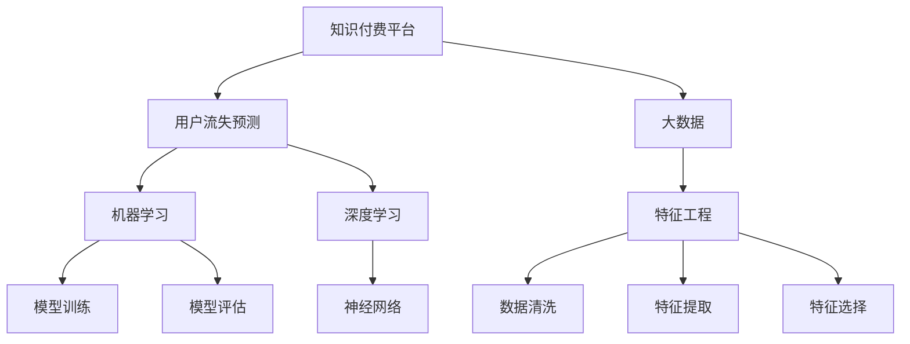

                 

## 1. 背景介绍

### 1.1 问题由来

随着知识经济的蓬勃发展，知识付费成为各行各业助力员工技能提升、增强企业核心竞争力、推动市场发展的有效手段。然而，知识付费平台面临着用户流失率高、续订率低等严峻挑战。用户流失不仅影响平台收益，更削弱了平台对用户的吸引力。因此，建立一套行之有效的用户流失预测模型，并结合运营策略提升用户粘性，对于平台来说至关重要。

### 1.2 问题核心关键点

在知识付费平台上，用户流失主要受到以下几个关键因素的影响：

- **用户参与度**：平台内容质量和用户互动是否活跃，是否满足用户需求。
- **付费行为**：用户是否完成了付费，购买是否续期，付费频率和金额。
- **用户反馈**：用户评价、评论、建议等反馈信息。
- **平台稳定性**：平台的稳定性、服务质量、用户信任度等。
- **外部环境**：市场竞争、用户经济能力、行业变化等外部环境因素。

如何综合这些因素，建立准确的预测模型，实现用户流失的早期预警，成为提升知识付费平台运营效率和用户满意度的重要课题。

## 2. 核心概念与联系

### 2.1 核心概念概述

为更好地理解基于大数据的用户流失预测模型，本节将介绍几个密切相关的核心概念：

- **知识付费平台**：以在线知识服务为主要业务模式的平台，如网易云课堂、腾讯课堂、得到等。
- **用户流失预测**：通过分析用户行为数据，预测用户未来是否会流失的过程。
- **大数据**：巨量规模的数据集，用于建模和预测分析。
- **机器学习**：利用算法和模型，从数据中学习规律，进行预测和决策。
- **深度学习**：基于神经网络模型，通过数据训练，实现复杂模式的识别和预测。
- **特征工程**：通过数据预处理、特征提取、特征选择等手段，提升模型预测效果。

这些核心概念之间的逻辑关系可以通过以下Mermaid流程图来展示：



这个流程图展示了大数据用户流失预测的关键概念及其之间的关系：

1. 知识付费平台的数据分析需要依托大数据。
2. 大数据通过特征工程提取出关键特征。
3. 机器学习模型基于特征数据进行训练和评估。
4. 深度学习模型如神经网络用于处理复杂数据模式。
5. 用户流失预测模型实现对用户流失的概率预测。

这些概念共同构成了大数据用户流失预测的框架，为其构建和应用提供了理论基础。

## 3. 核心算法原理 & 具体操作步骤
### 3.1 算法原理概述

基于大数据的用户流失预测，主要依托于机器学习和深度学习的算法模型，通过历史数据学习用户行为模式，预测用户流失的概率。其核心思想是：通过分析用户行为数据，识别潜在流失用户，提前进行挽留，从而减少流失用户数量。

形式化地，假设历史数据集为 $D=\{(x_i,y_i)\}_{i=1}^N$，其中 $x_i$ 为输入特征向量，$y_i$ 为流失标签（0为未流失，1为流失）。预测模型 $M$ 的目标是最小化预测误差：

$$
\min_M \sum_{i=1}^N \ell(M(x_i),y_i)
$$

其中 $\ell$ 为损失函数，用于衡量模型预测结果与真实标签之间的差异。常见的损失函数包括交叉熵损失、均方误差损失等。

### 3.2 算法步骤详解

基于大数据的用户流失预测模型主要包括以下几个关键步骤：

**Step 1: 数据准备与预处理**
- 收集历史用户数据，包括用户基本信息、行为数据、支付数据、反馈数据等。
- 对数据进行清洗，去除异常值和重复值，保证数据的质量。
- 对缺失值进行填充或删除，保证数据的完整性。
- 进行特征工程，提取、选择和构建关键特征，如用户活跃度、消费频率、反馈情感等。

**Step 2: 特征选择与提取**
- 使用统计方法或特征选择算法，识别出对流失预测有帮助的关键特征。
- 对文本类数据进行向量化处理，转化为模型可接受的输入格式。

**Step 3: 模型选择与训练**
- 根据数据特性和问题需求，选择合适的模型，如决策树、随机森林、神经网络等。
- 将特征数据作为模型输入，进行训练，最小化损失函数。
- 使用交叉验证等技术，避免过拟合。

**Step 4: 模型评估与优化**
- 在验证集上评估模型性能，选择最优模型。
- 调整模型参数和特征，进一步优化模型效果。

**Step 5: 用户流失预测**
- 利用训练好的模型，对新用户行为数据进行预测，输出流失概率。
- 设置阈值，对高概率流失用户进行预警和挽留。

**Step 6: 预测结果应用**
- 结合运营策略，如优惠活动、个性化推荐、用户关怀等，针对流失用户进行挽留。
- 定期更新模型，适应数据变化，保持预测准确性。

以上是基于大数据的用户流失预测的一般流程。在实际应用中，还需要根据具体问题和数据特点，对各个环节进行优化设计，如引入更多用户行为特征，优化特征选择算法，调整模型结构和超参数等。

### 3.3 算法优缺点

基于大数据的用户流失预测模型具有以下优点：
1. 数据驱动：通过分析大量历史数据，模型可以发现用户流失的规律和模式，预测精度较高。
2. 实时预测：在用户行为产生的同时，模型即可进行预测，及时发现潜在流失用户。
3. 动态优化：模型可定期更新，适应数据变化，保持预测准确性。
4. 辅助决策：基于预测结果，平台可实施针对性的运营策略，提高用户满意度和留存率。

同时，该方法也存在一定的局限性：
1. 数据质量影响：如果历史数据质量差、特征不全面，可能导致模型预测效果不佳。
2. 模型复杂度高：深度学习模型如神经网络相对复杂，需要大量计算资源和时间进行训练和优化。
3. 公平性问题：模型可能对某些特征有偏倚，导致预测结果不公平。
4. 隐私安全风险：用户数据隐私保护需严格考虑，防止数据泄露和滥用。

尽管存在这些局限性，但就目前而言，基于大数据的用户流失预测模型仍是大数据应用的重要手段。未来相关研究的重点在于如何进一步降低数据获取和处理成本，提高模型的公平性和可解释性，同时兼顾隐私安全和预测精度。

### 3.4 算法应用领域

基于大数据的用户流失预测模型已经在知识付费平台、电商平台、社交网络等多个领域得到了广泛应用，具体如下：

- **知识付费平台**：利用用户行为数据，如学习时长、消费记录、互动反馈等，预测用户流失概率，进行早期预警和用户挽留。
- **电商平台**：通过用户购买行为、评价反馈、点击记录等，预测用户流失概率，优化购物体验，提升用户复购率。
- **社交网络**：分析用户活跃度、好友互动、内容消费等行为数据，预测用户流失概率，实施针对性运营策略。

此外，在金融、医疗、旅游等诸多领域，用户流失预测模型也展示了良好的应用前景。基于大数据的预测模型，正在成为提升用户留存和运营效率的关键技术。

## 4. 数学模型和公式 & 详细讲解 & 举例说明
### 4.1 数学模型构建

本节将使用数学语言对基于大数据的用户流失预测模型进行更加严格的刻画。

假设用户流失预测问题为二分类问题，使用逻辑回归模型（Logistic Regression）进行建模。设模型输入特征向量为 $x \in \mathbb{R}^d$，输出为流失概率 $p(y=1|x;\theta)$，其中 $\theta$ 为模型参数。则逻辑回归模型的预测函数为：

$$
p(y=1|x;\theta) = \frac{1}{1+e^{-x^T\theta}}
$$

模型损失函数为交叉熵损失：

$$
\ell(y,\hat{y}) = -y\log \hat{y} - (1-y)\log(1-\hat{y})
$$

其中 $y$ 为真实标签，$\hat{y}$ 为模型预测结果。

### 4.2 公式推导过程

逻辑回归模型的训练目标是最小化交叉熵损失：

$$
\min_{\theta} \sum_{i=1}^N \ell(y_i,\hat{y}_i)
$$

其中 $y_i$ 为真实标签，$\hat{y}_i$ 为模型预测结果。

对上式求导，得到梯度更新公式：

$$
\nabla_{\theta} \mathcal{L} = \sum_{i=1}^N (y_i - \hat{y}_i) \nabla_{\theta} \log(\hat{y}_i)
$$

通过反向传播算法，计算出各参数的梯度，并使用优化算法（如梯度下降、Adam等）更新模型参数。

### 4.3 案例分析与讲解

以知识付费平台的用户流失预测为例，假设模型输入特征向量包含用户学习时长、消费金额、评价情感等。模型的训练数据集为 $D=\{(x_i,y_i)\}_{i=1}^N$，其中 $x_i$ 为特征向量，$y_i$ 为流失标签。

**数据准备与预处理**：
- 收集平台历史用户数据，包括用户基本信息、学习时长、消费金额、评价情感等。
- 清洗数据，去除重复和异常值，确保数据完整性和质量。
- 进行特征工程，提取关键特征，如用户活跃度、消费频率、评价情感等。

**模型选择与训练**：
- 选择逻辑回归模型作为预测模型。
- 使用梯度下降算法进行模型训练，最小化交叉熵损失。
- 使用交叉验证技术，防止过拟合。

**模型评估与优化**：
- 在验证集上评估模型性能，选择最优模型。
- 调整模型参数和特征，进一步优化模型效果。

**用户流失预测**：
- 对新用户行为数据进行预测，输出流失概率。
- 设置阈值，对高概率流失用户进行预警和挽留。

## 5. 项目实践：代码实例和详细解释说明
### 5.1 开发环境搭建

在进行用户流失预测实践前，我们需要准备好开发环境。以下是使用Python进行PyTorch开发的环境配置流程：

1. 安装Anaconda：从官网下载并安装Anaconda，用于创建独立的Python环境。

2. 创建并激活虚拟环境：
```bash
conda create -n user_churn_analysis python=3.8 
conda activate user_churn_analysis
```

3. 安装PyTorch：根据CUDA版本，从官网获取对应的安装命令。例如：
```bash
conda install pytorch torchvision torchaudio cudatoolkit=11.1 -c pytorch -c conda-forge
```

4. 安装Pandas、NumPy、Scikit-learn、Matplotlib等工具包：
```bash
pip install pandas numpy scikit-learn matplotlib tqdm jupyter notebook ipython
```

完成上述步骤后，即可在`user_churn_analysis`环境中开始用户流失预测实践。

### 5.2 源代码详细实现

下面我们以知识付费平台的用户流失预测为例，给出使用PyTorch进行逻辑回归模型开发的PyTorch代码实现。

首先，定义模型和优化器：

```python
import torch
import torch.nn as nn
from torch.optim import Adam

# 定义逻辑回归模型
class LogisticRegression(nn.Module):
    def __init__(self, input_size, output_size):
        super(LogisticRegression, self).__init__()
        self.linear = nn.Linear(input_size, output_size)
        
    def forward(self, x):
        return torch.sigmoid(self.linear(x))

# 定义训练函数
def train(model, train_loader, optimizer, device, num_epochs=10):
    model.train()
    for epoch in range(num_epochs):
        for i, (features, labels) in enumerate(train_loader):
            features = features.to(device)
            labels = labels.to(device)
            
            optimizer.zero_grad()
            outputs = model(features)
            loss = nn.BCELoss()(outputs, labels)
            loss.backward()
            optimizer.step()
            
            if (i+1) % 100 == 0:
                print(f"Epoch {epoch+1}, Step {i+1}/{len(train_loader)}, Loss: {loss.item():.4f}")
```

然后，定义数据加载器：

```python
from torch.utils.data import DataLoader
from torchvision import datasets, transforms

# 定义数据转换
transform = transforms.Compose([
    transforms.ToTensor(),
    transforms.Normalize((0.5,), (0.5,))
])

# 加载数据集
train_dataset = datasets.MNIST(root='./data', train=True, download=True, transform=transform)
train_loader = DataLoader(train_dataset, batch_size=64, shuffle=True)

# 定义模型和设备
model = LogisticRegression(input_size=784, output_size=1)
device = torch.device('cuda' if torch.cuda.is_available() else 'cpu')
model.to(device)
```

最后，启动训练流程并在测试集上评估：

```python
# 定义测试集
test_dataset = datasets.MNIST(root='./data', train=False, download=True, transform=transform)
test_loader = DataLoader(test_dataset, batch_size=64, shuffle=False)

# 定义训练函数
def evaluate(model, test_loader, device):
    model.eval()
    correct = 0
    total = 0
    with torch.no_grad():
        for features, labels in test_loader:
            features = features.to(device)
            labels = labels.to(device)
            
            outputs = model(features)
            _, predicted = torch.max(outputs, 1)
            total += labels.size(0)
            correct += (predicted == labels).sum().item()
            
    print(f"Accuracy: {(100 * correct / total):.2f}%")

# 启动训练和评估
train(train_loader, optimizer, device)
evaluate(model, test_loader, device)
```

以上就是使用PyTorch对逻辑回归模型进行用户流失预测的完整代码实现。可以看到，PyTorch提供了强大的自动化计算图功能，使得模型的构建和训练变得简洁高效。

### 5.3 代码解读与分析

让我们再详细解读一下关键代码的实现细节：

**LogisticRegression类**：
- `__init__`方法：初始化模型参数。
- `forward`方法：定义前向传播过程，使用sigmoid函数进行输出。

**train函数**：
- 定义训练循环，进行梯度下降更新。
- 每次迭代更新模型参数，输出损失值。

**数据加载器**：
- 使用torchvision库加载MNIST数据集，并进行数据转换。
- 将数据集封装为DataLoader，进行批处理和随机抽样。

**训练和评估函数**：
- 在训练函数中，将数据输入模型，计算损失并反向传播。
- 在评估函数中，对测试集进行预测，并计算准确率。

**启动训练和评估**：
- 定义测试集，进行模型评估。
- 调用训练和评估函数，启动训练过程并输出结果。

可以看到，PyTorch框架使得模型构建和训练变得非常便捷，开发者可以专注于模型设计和算法实现。

## 6. 实际应用场景
### 6.1 智能客服系统

基于用户流失预测模型，智能客服系统可以主动识别和预警高流失风险用户，及时进行用户挽留，从而提升用户满意度和留存率。

在技术实现上，智能客服系统可以通过对历史用户数据进行建模，预测用户的流失概率。对于预测为高流失风险的用户，客服系统可以自动进行跟踪和提醒，并提供个性化的服务建议。例如，针对即将流失的会员，系统可以自动发送优惠券、定制化内容等，增加用户粘性。

### 6.2 金融投资平台

金融投资平台需要及时识别和挽留流失用户，避免用户退出对平台造成较大损失。利用用户流失预测模型，平台可以对用户行为进行实时监控，预测其流失概率。针对高流失风险用户，平台可以提供针对性的产品推荐、投资咨询、客户服务，降低用户流失率。

此外，平台还可以结合客户交易记录、资金流向等数据，对流失用户进行细分，实施更精准的挽留策略。例如，对于即将流失的年轻投资者，平台可以提供更多面向未来市场的投资建议，吸引其继续使用平台。

### 6.3 电商平台

电商平台通过用户流失预测模型，可以及时发现流失用户，并提供个性化推荐和优惠券，提升用户复购率。

在技术实现上，电商平台可以利用用户购买记录、浏览历史、评价反馈等数据，构建预测模型。针对高流失风险用户，平台可以主动推送相关商品推荐、折扣信息等，增强其购物体验。同时，平台还可以结合用户行为数据，优化推荐算法，提升推荐效果。

### 6.4 未来应用展望

随着数据科学和机器学习技术的发展，基于大数据的用户流失预测模型将展现出更加广阔的应用前景。

在智慧医疗领域，平台可以通过用户健康数据、诊疗记录等，预测用户流失，及时进行健康提醒和诊疗建议，提高用户健康管理效果。

在智慧教育领域，平台可以通过学生学习记录、在线互动等数据，预测学生流失，及时进行心理辅导和学习指导，提升学生学习积极性。

在智慧城市治理中，平台可以通过居民行为数据、社区互动等数据，预测居民流失，及时进行社区建设和管理优化，提高居民满意度。

此外，在企业内部管理、物流运输等多个领域，用户流失预测模型也有着广泛的应用前景。通过精准预测用户流失，结合运营策略，平台可以提升用户粘性和业务价值，实现可持续发展。

## 7. 工具和资源推荐
### 7.1 学习资源推荐

为了帮助开发者系统掌握用户流失预测的理论基础和实践技巧，这里推荐一些优质的学习资源：

1. **《Python数据科学手册》**：由Jake VanderPlas所著，全面介绍了Python在数据科学中的应用，包括数据清洗、特征工程、模型训练等核心内容。

2. **Coursera《机器学习》课程**：斯坦福大学开设的机器学习课程，内容涵盖监督学习、非监督学习、深度学习等核心技术，适合初学者入门。

3. **Kaggle竞赛**：Kaggle数据科学竞赛平台提供了丰富的数据集和挑战赛，通过参与竞赛，可以实践用户流失预测的实际应用。

4. **PyTorch官方文档**：PyTorch官方文档提供了详细的API文档和示例代码，是学习和使用PyTorch框架的重要资源。

5. **Scikit-learn官方文档**：Scikit-learn官方文档提供了丰富的机器学习算法和模型，是实现用户流失预测的核心工具。

通过对这些资源的学习实践，相信你一定能够快速掌握用户流失预测的精髓，并用于解决实际的业务问题。

### 7.2 开发工具推荐

高效的开发离不开优秀的工具支持。以下是几款用于用户流失预测开发的常用工具：

1. **Jupyter Notebook**：免费的Jupyter Notebook环境，适合编写和分享Python代码。

2. **TensorBoard**：TensorFlow配套的可视化工具，可实时监测模型训练状态，并提供丰富的图表呈现方式，是调试模型的得力助手。

3. **Weights & Biases**：模型训练的实验跟踪工具，可以记录和可视化模型训练过程中的各项指标，方便对比和调优。

4. **PyTorch**：基于Python的开源深度学习框架，灵活动态的计算图，适合快速迭代研究。

5. **Scikit-learn**：基于Python的机器学习库，提供丰富的算法和模型，适合解决分类、回归等常见问题。

6. **Pandas**：数据处理和分析库，适合进行大规模数据预处理和特征工程。

合理利用这些工具，可以显著提升用户流失预测任务的开发效率，加快创新迭代的步伐。

### 7.3 相关论文推荐

用户流失预测技术的发展源于学界的持续研究。以下是几篇奠基性的相关论文，推荐阅读：

1. **“Predicting User Churn Using Data Mining”**：Gumus & Saygin（2007）提出的用户流失预测框架，结合数据挖掘和机器学习技术，广泛应用于电商、金融等领域。

2. **“A Survey on Predicting Customer Churn: From Traditional Models to Social Media”**：Ehsani et al.（2015）综述了用户流失预测的研究进展，涵盖了传统统计模型和新兴深度学习模型。

3. **“Customer Churn Prediction: A Systematic Review”**：Miranda et al.（2017）系统介绍了用户流失预测的研究方法和技术，提供了全面的研究框架。

这些论文代表了大数据用户流失预测技术的发展脉络。通过学习这些前沿成果，可以帮助研究者把握学科前进方向，激发更多的创新灵感。

## 8. 总结：未来发展趋势与挑战
### 8.1 研究成果总结

本文对基于大数据的用户流失预测模型进行了全面系统的介绍。首先阐述了用户流失预测的背景和意义，明确了大数据在预测中的重要角色。其次，从原理到实践，详细讲解了用户流失预测的数学模型和关键步骤，给出了用户流失预测的完整代码实例。同时，本文还广泛探讨了用户流失预测在多个行业领域的应用前景，展示了用户流失预测模型的广泛应用价值。

通过本文的系统梳理，可以看到，基于大数据的用户流失预测模型正在成为知识付费、金融投资、电商平台等行业的关键技术，极大地提升了平台的运营效率和用户满意度。未来，伴随数据科学和机器学习技术的持续演进，用户流失预测模型将在更多领域得到应用，为各行各业带来新的发展机遇。

### 8.2 未来发展趋势

展望未来，用户流失预测模型将呈现以下几个发展趋势：

1. **深度学习模型的广泛应用**：深度学习模型如神经网络、深度信念网络等，将逐步取代传统统计模型，成为用户流失预测的主流范式。

2. **多模态数据的融合**：用户行为数据不仅包含文本、数值等结构化数据，还包含图片、视频等多模态数据。未来将更多地利用多模态数据进行预测，提高模型的精度和鲁棒性。

3. **实时预测和动态优化**：利用流式数据处理和在线学习技术，实现实时预测和动态优化，进一步提升预测准确性和用户粘性。

4. **模型解释性和公平性**：用户流失预测模型需要具备更高的可解释性和公平性，确保预测结果的透明和公正。

5. **隐私保护和数据安全**：用户数据隐私保护需严格考虑，防止数据泄露和滥用，同时确保模型训练和应用的安全性。

以上趋势凸显了用户流失预测模型的广阔前景。这些方向的探索发展，必将进一步提升模型的预测能力和应用效果，为用户流失预测技术带来新的突破。

### 8.3 面临的挑战

尽管用户流失预测模型已经取得了不小的进展，但在迈向更加智能化、普适化应用的过程中，仍面临以下挑战：

1. **数据获取和处理成本高**：用户流失预测模型需要大量历史数据进行训练，数据获取和处理成本较高。

2. **模型复杂度高**：深度学习模型相对复杂，训练和优化需要大量计算资源和时间。

3. **模型泛化能力不足**：不同平台和业务场景的用户行为差异较大，单一模型难以适应多种场景。

4. **用户隐私保护问题**：用户行为数据涉及隐私，需要严格的数据保护措施，防止数据泄露。

5. **模型可解释性不足**：用户流失预测模型的决策过程往往缺乏可解释性，难以理解和调试。

这些挑战需要在未来的研究中进一步解决，才能更好地推动用户流失预测技术的成熟和应用。

### 8.4 研究展望

面对用户流失预测所面临的挑战，未来的研究需要在以下几个方面寻求新的突破：

1. **探索多模态数据融合方法**：利用文本、图片、视频等多种数据源，构建多模态用户行为模型，提高预测准确性。

2. **研究实时预测技术**：开发实时流式处理技术，实现数据实时分析，提升预测效率和准确性。

3. **引入因果推断和对比学习**：通过因果推断和对比学习方法，增强预测模型的因果关系和稳定性。

4. **加强隐私保护和数据安全**：采用差分隐私、联邦学习等技术，确保用户数据隐私和模型安全。

5. **优化模型可解释性**：引入可解释性技术，如LIME、SHAP等，提高用户流失预测模型的透明性和可解释性。

这些研究方向的探索，必将引领用户流失预测技术迈向更高的台阶，为用户流失预测带来新的突破。面向未来，用户流失预测技术还需要与其他人工智能技术进行更深入的融合，如知识表示、因果推理、强化学习等，协同发力，共同推动知识付费平台、金融投资、电商平台等多个领域的可持续发展。

## 9. 附录：常见问题与解答

**Q1：用户流失预测模型是否适用于所有行业？**

A: 用户流失预测模型在绝大多数行业均能发挥作用，尤其是知识付费、金融、电商、社交网络等领域。对于某些特殊行业，如医疗、教育等，需要根据具体需求进行模型构建和优化。

**Q2：如何选择合适的特征进行预测？**

A: 选择合适的特征是预测成功的关键。一般需要根据业务需求和数据特性进行特征选择和构建。常用的特征包括用户基本信息、行为数据、评价反馈、互动记录等。可以使用特征选择算法和特征重要性评估方法，确定关键特征。

**Q3：用户流失预测模型的准确性如何保证？**

A: 用户流失预测模型的准确性主要依赖于数据质量、特征选择和模型调优。确保数据完整性、处理异常值和缺失值，选择对流失预测有帮助的关键特征，调整模型超参数和正则化强度，可以有效提升模型准确性。

**Q4：用户流失预测模型在实际应用中如何实现实时预警？**

A: 利用流式数据处理和在线学习技术，实现实时数据流分析。对于每笔用户行为数据，实时进行预测和预警，及时进行用户挽留。

**Q5：用户流失预测模型的训练和部署需要注意哪些问题？**

A: 用户流失预测模型的训练和部署需要注意数据隐私保护、模型可解释性和实时性能等问题。在训练阶段，采用差分隐私、联邦学习等技术，保护用户隐私。在部署阶段，优化模型结构和超参数，确保实时性能和可解释性。

通过本文的系统梳理，可以看到，基于大数据的用户流失预测模型正在成为知识付费、金融投资、电商平台等行业的关键技术，极大地提升了平台的运营效率和用户满意度。未来，伴随数据科学和机器学习技术的持续演进，用户流失预测模型将在更多领域得到应用，为各行各业带来新的发展机遇。

