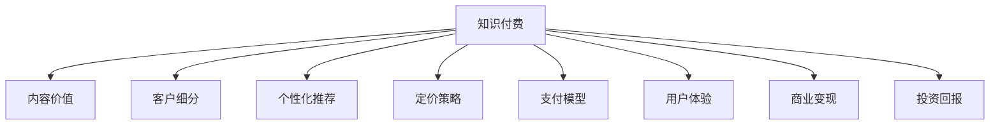

                 

# 知识经济时代下的知识付费 创新商业模式运营

在数字化、网络化、智能化的浪潮下，人类社会的经济形态正发生深刻变革。知识经济时代的来临，为互联网企业带来了全新的机遇与挑战。基于知识付费的商业模式运营，正在迅速崛起，成为驱动信息消费的重要力量。本文将系统性地探讨知识付费的商业模式创新与运营策略，涵盖其原理、策略、实施路径等核心环节，为互联网企业提供有力的参考。

## 1. 背景介绍

### 1.1 问题由来
随着互联网的发展和信息技术的进步，信息过载和认知负荷增加的问题日益凸显。人们渴望获取专业、高效、有价值的信息，但又难以在繁杂的信息海洋中甄别和筛选。这一需求催生了知识付费行业的发展。

知识付费，即用户为获取专业信息、知识、技能等付费订阅或购买服务，以解决信息不对称、认知负荷等问题。近年来，知识付费市场迅速成长，各大互联网企业纷纷布局。知识付费，已不仅仅是简单的内容变现，更是信息社会下的新经济模式。

### 1.2 问题核心关键点
知识付费的商业模式创新与运营，其核心关键点包括：
- 基于内容的价值主张：如何定义和衡量知识付费内容的价值。
- 客户细分与个性化推荐：如何精准识别客户需求，提供个性化服务。
- 定价策略与支付模型：如何设计合理的定价模型，满足不同客户需求。
- 运营体系与用户体验：如何构建高效、便捷、流畅的运营体系，提升用户满意度。
- 商业变现与投资回报：如何实现知识付费商业模式的自我循环，确保可持续发展。

## 2. 核心概念与联系

### 2.1 核心概念概述

为更好地理解知识付费的商业模式创新与运营，本节将介绍几个关键概念：

- **知识付费**：指用户为获取专业信息、知识、技能等付费订阅或购买服务的经济行为。
- **内容价值**：知识付费的核心理念之一，即付费内容应具有明确的知识价值和市场价值。
- **客户细分**：指根据客户需求、特征等进行分类，实现精准营销和服务。
- **个性化推荐**：指基于用户行为、兴趣等数据，智能推荐符合用户需求的内容。
- **定价策略**：指对知识付费产品制定合理的价格，实现盈利和市场竞争。
- **支付模型**：指用户在知识付费平台上进行交易时采用的支付方式。
- **用户体验**：指用户在知识付费平台上的使用体验，直接影响用户黏性和满意度。
- **商业变现**：指知识付费平台通过多种渠道实现收益，支持可持续发展。
- **投资回报**：指知识付费平台的商业模式是否能够实现自负盈亏，具有长期的投资价值。

这些概念之间的逻辑关系可以通过以下Mermaid流程图来展示：



这个流程图展示出知识付费的各个关键组件及其相互关系：

1. 知识付费的核心在于内容的价值主张，即付费内容应具备明确的知识价值和市场价值。
2. 客户细分与个性化推荐，帮助平台精准识别客户需求，提供个性化服务。
3. 定价策略与支付模型，是知识付费平台实现盈利的关键。
4. 用户体验影响用户黏性和满意度，是平台持续发展的基石。
5. 商业变现与投资回报，关乎平台的盈利能力和可持续发展。

## 3. 核心算法原理 & 具体操作步骤
### 3.1 算法原理概述

知识付费的商业模式创新与运营，其核心算法原理主要围绕以下几个方面：

- **内容价值评估**：如何通过机器学习、自然语言处理等技术，对付费内容进行价值评估，确保其具有市场竞争力和用户吸引力。
- **客户画像构建**：如何基于用户行为数据，利用聚类、分类等算法，构建精准的客户画像。
- **个性化推荐算法**：如何设计推荐模型，实现高质量的个性化内容推荐，提升用户满意度和留存率。
- **定价模型优化**：如何通过数据挖掘、算法优化等手段，设计合理的定价策略，满足不同用户需求。
- **运营效率提升**：如何构建高效的运营体系，利用数据驱动运营，提升用户体验和平台收益。

### 3.2 算法步骤详解

基于上述核心算法原理，知识付费的商业模式创新与运营可以分解为以下详细步骤：

**Step 1: 内容价值评估**
- 数据收集：收集付费内容的用户评分、评论、使用时长等数据。
- 特征提取：提取付费内容的关键词、结构、风格等特征。
- 价值计算：利用机器学习算法，如支持向量机、神经网络等，计算内容的价值得分。

**Step 2: 客户画像构建**
- 数据采集：收集用户的行为数据，如浏览历史、购买记录等。
- 数据清洗：去除噪音数据，保留有价值信息。
- 画像生成：利用聚类、分类算法，如K-means、LDA等，生成客户画像。

**Step 3: 个性化推荐算法**
- 模型选择：选择合适的推荐算法，如协同过滤、内容过滤、混合过滤等。
- 特征工程：提取用户画像和内容特征，作为模型输入。
- 模型训练：使用用户行为数据，训练推荐模型，并持续优化。

**Step 4: 定价模型优化**
- 数据挖掘：挖掘用户对不同内容的支付意愿。
- 模型设计：设计多维度的定价模型，如单次购买、订阅模式等。
- 策略调整：根据市场反馈，调整定价策略，优化收益。

**Step 5: 运营效率提升**
- 数据驱动：利用数据监控运营指标，实时调整策略。
- 自动化运营：引入自动化工具，如推荐系统、广告投放等，提升效率。
- 用户体验优化：持续改进产品功能，提升用户满意度。

### 3.3 算法优缺点

知识付费的商业模式创新与运营算法，具有以下优点：
1. 精准定位：通过客户画像和推荐算法，实现精准营销，提升客户转化率。
2. 用户黏性高：个性化推荐和优质内容，提高用户黏性和平台留存率。
3. 盈利能力强：通过合理的定价策略，实现高收益。
4. 数据驱动：运营决策基于数据，更加科学和高效。

同时，也存在一些局限性：
1. 数据隐私问题：大量用户行为数据的收集和使用，涉及隐私保护。
2. 内容同质化：过度依赖推荐算法，可能导致内容同质化，缺乏差异化。
3. 运营成本高：需要持续投入资源进行数据采集、模型训练、系统优化等。
4. 用户依赖度高：过度依赖推荐，可能导致用户缺乏主动探索内容的动力。

### 3.4 算法应用领域

知识付费的商业模式创新与运营算法，在多个领域得到了广泛应用，例如：

- 在线教育：提供各类课程、讲座、习题等知识付费内容，实现个性化学习。
- 健康医疗：提供健康咨询、康复训练、心理辅导等付费服务，解决健康问题。
- 财经金融：提供市场分析、投资策略、理财知识等付费内容，提升用户理财能力。
- 旅游文化：提供景点导览、文化讲解、旅游攻略等付费服务，丰富用户出行体验。
- 职场发展：提供职业规划、技能培训、职场技巧等付费内容，帮助用户职业成长。

## 4. 数学模型和公式 & 详细讲解 & 举例说明

### 4.1 数学模型构建

知识付费的商业模式创新与运营，涉及多方面的数学模型构建，主要包括以下几个方面：

- **内容价值评估模型**：基于用户评分、评论、使用时长等数据，构建内容价值评估模型。
- **客户画像生成模型**：基于用户行为数据，构建客户画像生成模型。
- **个性化推荐模型**：利用协同过滤、内容过滤等算法，构建个性化推荐模型。
- **定价优化模型**：基于用户支付意愿和市场数据，构建定价优化模型。

### 4.2 公式推导过程

以下是知识付费领域几个关键模型的公式推导过程：

**内容价值评估模型**：
$$
V = \sum_{i=1}^n w_i \cdot f_i
$$
其中，$V$ 为内容价值，$w_i$ 为特征权重，$f_i$ 为特征值。

**客户画像生成模型**：
$$
P = \sum_{k=1}^K \alpha_k \cdot x_k
$$
其中，$P$ 为客户画像，$K$ 为特征维度，$\alpha_k$ 为特征权重，$x_k$ 为特征向量。

**个性化推荐模型**：
$$
R = \sum_{i=1}^m w_i \cdot f_i
$$
其中，$R$ 为用户推荐结果，$m$ 为物品数量，$w_i$ 为物品权重，$f_i$ 为物品特征。

**定价优化模型**：
$$
P = C - \sum_{i=1}^n w_i \cdot c_i
$$
其中，$P$ 为定价结果，$C$ 为成本，$w_i$ 为成本权重，$c_i$ 为成本值。

### 4.3 案例分析与讲解

假设某在线教育平台，希望根据用户历史行为数据，推荐适合的课程和课程包。平台收集了用户的学习历史、评价记录、参与讨论等行为数据，并通过以下步骤实现推荐：

**Step 1: 数据收集与处理**
- 收集用户学习历史、评价记录、讨论参与等行为数据。
- 对数据进行清洗，去除噪音数据。

**Step 2: 客户画像生成**
- 使用K-means算法，对用户行为数据进行聚类，生成客户画像。

**Step 3: 个性化推荐**
- 利用协同过滤算法，根据用户画像和课程特征，生成个性化推荐结果。

**Step 4: 定价策略设计**
- 通过数据挖掘，了解用户对不同课程的支付意愿。
- 设计单次购买和订阅模式，优化定价策略。

## 5. 项目实践：代码实例和详细解释说明

### 5.1 开发环境搭建

在进行知识付费项目实践前，我们需要准备好开发环境。以下是使用Python进行知识付费平台开发的环境配置流程：

1. 安装Anaconda：从官网下载并安装Anaconda，用于创建独立的Python环境。

2. 创建并激活虚拟环境：
```bash
conda create -n knowledge-payment-env python=3.8 
conda activate knowledge-payment-env
```

3. 安装PyTorch：基于Python的开源深度学习框架，灵活动态的计算图，适合快速迭代研究。大部分知识付费平台的机器学习模块都有PyTorch版本的实现。

4. 安装Scikit-learn：用于数据预处理、模型训练和评估。

5. 安装Pandas：用于数据读写和处理。

6. 安装Flask：用于搭建Web服务，实现用户交互。

7. 安装Jupyter Notebook：用于数据探索和模型验证。

完成上述步骤后，即可在`knowledge-payment-env`环境中开始项目实践。

### 5.2 源代码详细实现

这里我们以在线教育平台的个性化推荐系统为例，给出使用Python的Flask框架进行知识付费平台开发的代码实现。

首先，定义推荐系统的数据处理函数：

```python
from flask import Flask, request, jsonify
from sklearn.feature_extraction.text import TfidfVectorizer
from sklearn.metrics.pairwise import cosine_similarity
import pandas as pd

app = Flask(__name__)

# 加载数据
data = pd.read_csv('data.csv')
tfidf = TfidfVectorizer()
tfidf_matrix = tfidf.fit_transform(data['content'])

@app.route('/recommend', methods=['POST'])
def recommend():
    # 获取用户ID
    user_id = request.json['user_id']
    
    # 获取用户行为数据
    user_data = data[data['user_id'] == user_id]
    
    # 计算相似度
    similarities = cosine_similarity(user_data['content'], tfidf_matrix)
    
    # 获取推荐结果
    recommendations = []
    for i, similarity in enumerate(similarities):
        if similarity > 0.5:
            recommendations.append(data.index[i])
    
    # 返回推荐结果
    return jsonify(recommendations)
```

然后，定义模型和推荐函数：

```python
from sklearn.decomposition import TruncatedSVD
from sklearn.neighbors import NearestNeighbors

# 构建用户画像
user_data = data[['user_id', 'content', 'label']]
user_embeddings = TruncatedSVD(n_components=100).fit_transform(user_data[['content']])

# 构建物品画像
content_data = data[['content']]
content_embeddings = TruncatedSVD(n_components=100).fit_transform(content_data)

# 推荐系统
k = 10
nn = NearestNeighbors(n_neighbors=k)
nn.fit(content_embeddings)
user_indices = nn.kneighbors(user_embeddings)[1]
recommendations = [data.index[i] for i in user_indices]
```

最后，启动Flask应用并调用推荐系统：

```python
if __name__ == '__main__':
    app.run(host='0.0.0.0', port=5000)
```

这只是一个简单的代码实现，实际项目中还需要考虑更多的细节，如用户数据的安全存储、推荐系统的优化、用户界面的设计等。

### 5.3 代码解读与分析

让我们再详细解读一下关键代码的实现细节：

**推荐系统函数**：
- 获取用户ID，从数据集中提取用户行为数据。
- 计算用户行为数据与内容数据的相似度。
- 根据相似度阈值，筛选推荐结果。
- 返回推荐结果。

**模型定义函数**：
- 构建用户画像和物品画像，将文本数据转换为向量表示。
- 利用协同过滤算法，构建推荐系统，筛选推荐结果。

这些代码展示了如何通过Flask框架和机器学习算法，实现简单的知识付费平台推荐系统。开发者可以将更多精力放在数据处理、模型改进等高层逻辑上，而不必过多关注底层的实现细节。

当然，工业级的系统实现还需考虑更多因素，如系统的可扩展性、用户隐私保护、系统性能优化等。但核心的算法流程基本与此类似。

## 6. 实际应用场景

### 6.1 在线教育平台

在线教育平台的知识付费商业模式，为终身学习提供了新可能。平台通过微课程、公开课、直播课等形式，提供丰富的学习资源，满足不同用户的个性化学习需求。

在技术实现上，平台可以利用用户行为数据，通过机器学习算法，推荐适合的课程和课程包。此外，平台还可以结合LMS（学习管理系统）功能，实现学习进度跟踪、作业提交、考试评估等，提升学习效果。

### 6.2 健康医疗咨询

健康医疗咨询的知识付费模式，为个性化医疗提供新路径。平台通过健康咨询、康复训练、心理辅导等服务，帮助用户解决健康问题，提升生活质量。

在技术实现上，平台可以利用用户健康数据，通过机器学习算法，推荐个性化的健康方案和咨询服务。平台还可以结合AI诊断技术，提供初步的健康评估和疾病预防建议，辅助医生诊断。

### 6.3 财经金融分析

财经金融分析的知识付费模式，为投资者提供新视角。平台通过市场分析、投资策略、理财知识等服务，提升用户理财能力，实现财富增值。

在技术实现上，平台可以利用用户交易数据，通过机器学习算法，推荐适合的投资产品和理财方案。平台还可以结合AI预测技术，提供市场趋势分析和风险预警，帮助用户做出明智的投资决策。

### 6.4 未来应用展望

知识付费的商业模式创新与运营，未来将在更多领域得到应用，为各行各业带来变革性影响。

在智慧医疗领域，基于知识付费的医疗咨询、健康管理、疾病预防等服务，将提升医疗服务的智能化水平，辅助医生诊疗，提高医疗服务质量。

在智能教育领域，知识付费的在线教育、职业培训、技能提升等服务，将推动教育公平，提升教育质量，促进人才成长。

在智慧城市治理中，知识付费的公共服务、社会治理、应急指挥等服务，将提高城市管理的自动化和智能化水平，构建更安全、高效的未来城市。

此外，在企业生产、社会治理、文娱传媒等众多领域，知识付费的知识分享、信息服务、内容创作等服务，将推动行业数字化转型，提升行业竞争力。

## 7. 工具和资源推荐

### 7.1 学习资源推荐

为了帮助开发者系统掌握知识付费的理论基础和实践技巧，这里推荐一些优质的学习资源：

1. 《知识付费商业模式创新》系列博文：由知识付费专家撰写，深入浅出地介绍了知识付费的商业模式创新与运营策略。

2. CS229《机器学习》课程：斯坦福大学开设的机器学习明星课程，涵盖了数据处理、模型训练、算法优化等内容，是理解知识付费算法的关键。

3. 《知识付费平台设计与实现》书籍：全面介绍了知识付费平台的系统架构、功能实现、技术栈选择等内容，是知识付费平台开发的实用指南。

4. Coursera《数据科学导论》课程：由数据科学领域的知名教授主讲，系统介绍了数据驱动的商业模式创新，包括知识付费在内。

5. Kaggle知识付费竞赛：Kaggle平台上定期举办的知识付费竞赛，通过实际案例，帮助开发者提升实践能力。

通过对这些资源的学习实践，相信你一定能够快速掌握知识付费的精髓，并用于解决实际的商业模式创新与运营问题。

### 7.2 开发工具推荐

高效的开发离不开优秀的工具支持。以下是几款用于知识付费平台开发的常用工具：

1. Python：基于Python的开源编程语言，丰富的库和框架支持，灵活高效。

2. PyTorch：基于Python的开源深度学习框架，灵活动态的计算图，适合快速迭代研究。

3. Scikit-learn：用于数据预处理、模型训练和评估的机器学习库。

4. Pandas：用于数据读写和处理的Python库。

5. Flask：用于搭建Web服务的轻量级框架。

6. TensorFlow：由Google主导开发的开源深度学习框架，生产部署方便，适合大规模工程应用。

7. Jupyter Notebook：用于数据探索和模型验证的交互式笔记本。

合理利用这些工具，可以显著提升知识付费平台的开发效率，加快创新迭代的步伐。

### 7.3 相关论文推荐

知识付费的商业模式创新与运营，源于学界的持续研究。以下是几篇奠基性的相关论文，推荐阅读：

1. A Survey on Knowledge-based Service Recommender Systems: Architectures, Approaches, and Applications（知识服务推荐系统综述）：系统回顾了知识服务推荐系统的架构、算法和应用。

2. How to Drive User Engagement in a Knowledge-based Service System（如何提升知识服务系统的用户参与度）：提出了多种策略，提升用户参与度和满意度。

3. Modeling User Preferences in Knowledge-based Service Recommender Systems（知识服务推荐系统的用户偏好建模）：探讨了用户偏好建模的方法和技术。

4. Knowledge-Based Recommender Systems: A Survey（基于知识的推荐系统综述）：全面介绍了基于知识的推荐系统的发展历程和应用案例。

5. Cost-Benefit Analysis of Knowledge-based Service Recommender Systems（知识服务推荐系统的成本效益分析）：研究了知识服务推荐系统的成本和效益。

这些论文代表了大语言模型微调技术的发展脉络。通过学习这些前沿成果，可以帮助研究者把握学科前进方向，激发更多的创新灵感。

## 8. 总结：未来发展趋势与挑战

### 8.1 总结

本文对知识付费的商业模式创新与运营进行了全面系统的介绍。首先阐述了知识付费的核心理念和应用场景，明确了其商业模式创新与运营的关键要素。其次，从原理到实践，详细讲解了知识付费的算法原理和操作步骤，给出了知识付费平台开发的完整代码实例。同时，本文还广泛探讨了知识付费平台在多个行业领域的应用前景，展示了其巨大的市场潜力。此外，本文精选了知识付费相关的学习资源，力求为开发者提供全方位的技术指引。

通过本文的系统梳理，可以看到，知识付费的商业模式创新与运营，不仅是一个技术问题，更是一个复杂的商业和市场问题。其成功与否，取决于多方面的因素。未来，随着技术的不断进步和市场的进一步成熟，知识付费必将在更多领域得到应用，推动社会经济的发展。

### 8.2 未来发展趋势

展望未来，知识付费的商业模式创新与运营将呈现以下几个发展趋势：

1. 个性化推荐精度提升。随着推荐算法的不断优化，个性化推荐的准确性将进一步提升，满足用户更为精准的需求。

2. 多模态推荐系统崛起。未来的推荐系统将综合利用文本、图像、视频等多模态信息，提升推荐效果。

3. 社交网络结合。通过社交网络的引入，推荐系统可以更准确地识别用户需求，提供定制化服务。

4. 人工智能伦理保障。随着人工智能技术的发展，知识付费平台需要更加注重用户隐私保护和伦理道德问题。

5. 全球化市场拓展。知识付费平台将逐渐走向全球，为全球用户提供高质量的知识服务。

6. 数据驱动决策。知识付费平台将更加依赖数据驱动决策，实现高效运营和市场竞争。

以上趋势凸显了知识付费技术的广阔前景。这些方向的探索发展，必将进一步提升知识付费平台的性能和市场竞争力，为信息社会带来更多价值。

### 8.3 面临的挑战

尽管知识付费的商业模式创新与运营已取得初步成果，但在迈向更加智能化、普适化应用的过程中，它仍面临诸多挑战：

1. 数据隐私保护。用户数据隐私保护问题日益突出，平台需要更有效的数据保护措施，确保用户信息安全。

2. 内容质量控制。大量低质量内容可能影响平台信誉，平台需要建立严格的审核机制，提升内容质量。

3. 用户付费意愿。高昂的付费门槛可能降低用户参与度，平台需要找到有效的付费策略，提升用户黏性。

4. 运营成本控制。知识付费平台的运营成本较高，平台需要优化资源配置，降低运营成本。

5. 市场竞争加剧。知识付费市场竞争日益激烈，平台需要不断创新，提升竞争力。

6. 政策法规约束。知识付费平台的运营需遵守相关法律法规，平台需要合规运营，避免法律风险。

### 8.4 研究展望

面对知识付费面临的诸多挑战，未来的研究需要在以下几个方面寻求新的突破：

1. 探索更加智能化的推荐算法。利用深度学习、强化学习等技术，提升推荐系统智能化水平，实现更高质量的推荐。

2. 引入更多用户交互元素。通过社交网络、游戏化设计等手段，提升用户参与度和互动性。

3. 构建更为完善的知识图谱。利用知识图谱技术，提升知识服务系统的准确性和可靠性。

4. 引入更多元化的内容形态。除了文本，还可以引入音频、视频等多模态内容，丰富知识服务系统。

5. 推动知识付费平台国际化。通过本地化运营和国际化战略，拓展全球市场，提供全球化的知识服务。

这些研究方向的探索，必将引领知识付费技术迈向更高的台阶，为构建智能、高效、可靠的知识服务系统提供支持。面向未来，知识付费技术需要与其他人工智能技术进行更深入的融合，如自然语言处理、知识图谱、强化学习等，多路径协同发力，共同推动知识服务系统的进步。只有勇于创新、敢于突破，才能不断拓展知识付费技术的边界，为信息社会带来更多价值。

## 9. 附录：常见问题与解答

**Q1：知识付费的商业模式创新与运营的核心要素有哪些？**

A: 知识付费的商业模式创新与运营，其核心要素包括：
- 内容价值：确保付费内容具有明确的知识价值和市场价值。
- 客户细分：精准识别客户需求，提供个性化服务。
- 定价策略：设计合理的定价模型，满足不同客户需求。
- 个性化推荐：利用机器学习算法，实现高质量的个性化内容推荐。
- 用户体验：构建高效、便捷、流畅的运营体系，提升用户满意度。
- 商业变现：通过多种渠道实现收益，支持可持续发展。

这些要素相互关联，共同构成了知识付费的商业模式基础。

**Q2：知识付费平台的推荐系统如何设计？**

A: 知识付费平台的推荐系统设计主要包括以下几个步骤：
1. 数据收集：收集用户行为数据、内容数据等。
2. 数据处理：对数据进行清洗、特征提取等处理。
3. 模型选择：选择合适的推荐算法，如协同过滤、内容过滤等。
4. 特征工程：提取用户画像和内容特征，作为模型输入。
5. 模型训练：使用用户行为数据，训练推荐模型，并持续优化。
6. 推荐策略：根据用户画像和推荐模型，生成推荐结果。

推荐系统设计的关键在于选择合适的算法、提取有效的特征和持续优化模型。

**Q3：知识付费平台的商业变现方式有哪些？**

A: 知识付费平台的商业变现方式主要包括：
1. 内容付费：用户订阅或购买特定内容或服务。
2. 广告变现：在平台内植入广告，获取广告收入。
3. 知识变现：利用平台知识资源，进行知识商业化。
4. 增值服务：提供增值服务，如VIP会员、专属咨询等。
5. 社交变现：利用社交网络功能，吸引用户参与和互动，实现变现。

不同的变现方式可以根据平台特点和市场需求进行灵活设计。

**Q4：知识付费平台如何构建高效的用户画像？**

A: 知识付费平台构建高效用户画像的主要步骤包括：
1. 数据收集：收集用户行为数据、内容互动数据等。
2. 数据清洗：去除噪音数据，保留有价值信息。
3. 特征提取：提取用户特征，如兴趣、需求、行为等。
4. 聚类分析：利用聚类算法，对用户特征进行分类。
5. 画像生成：将用户特征映射到画像维度，生成用户画像。

用户画像的构建需要多维度的数据和复杂的算法处理，才能实现精准的客户细分。

**Q5：知识付费平台的定价策略如何设计？**

A: 知识付费平台的定价策略设计主要包括以下几个方面：
1. 成本控制：根据平台运营成本，制定合理的定价基础。
2. 市场需求：考虑用户支付意愿和市场需求，设定合理的定价水平。
3. 竞争力分析：比较竞争对手的定价策略，制定具有竞争力的定价方案。
4. 动态调整：根据市场反馈，动态调整定价策略，优化收益。

定价策略的设计需要综合考虑成本、市场需求和竞争因素，实现收益最大化。

---

作者：禅与计算机程序设计艺术 / Zen and the Art of Computer Programming

