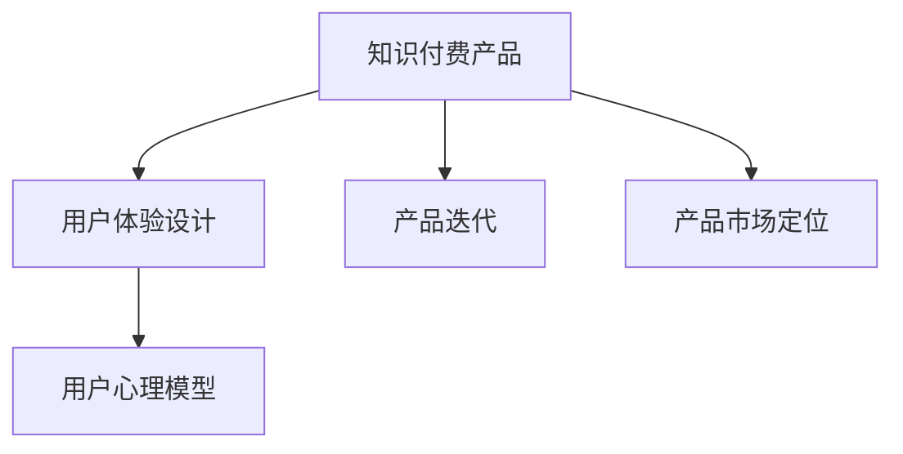

                 

# 知识经济时代下的知识付费创新产品包装设计

## 1. 背景介绍

随着互联网和数字化技术的飞速发展，知识付费成为了知识经济时代下的一种重要商业模式。特别是在信息过载的今天，用户越来越倾向于通过付费获取高质、高效率的信息服务。知识付费产品不仅满足了用户个性化的需求，也推动了知识传播和内容消费的市场化、专业化发展。

然而，在知识付费市场快速增长的同时，也面临诸多挑战。如何设计出更加吸引用户、高质高效、符合用户心理预期的产品，成为了知识付费领域亟待解决的问题。产品包装设计作为知识付费创新的核心环节，不仅影响着用户的初次体验，也关系到用户黏性和市场口碑。因此，深入理解产品包装设计的原理与流程，创新设计出符合用户需求的知识付费产品，具有重要意义。

## 2. 核心概念与联系

### 2.1 核心概念概述

为更好地理解知识付费产品的包装设计，本节将介绍几个核心概念：

- 知识付费产品（Knowledge-based Subscription Product）：即以知识、信息服务为核心的订阅型产品，涵盖在线课程、电子书、专栏文章、咨询服务等。产品主要通过收费机制实现价值变现。

- 用户体验设计（User Experience Design, UXD）：即设计用户与产品交互的界面、交互流程、交互方式等，旨在提升用户满意度和产品使用效率。

- 产品迭代（Product Iteration）：即对知识付费产品进行持续改进和优化的过程，包括产品功能、界面、内容、营销等各方面。

- 用户心理模型（User Mental Model）：即用户对产品的认知、期望、行为模式等心理预期的抽象模型，是设计者理解用户需求的重要依据。

- 产品市场定位（Product Market Positioning）：即确定产品及其服务的目标市场和用户群体，实现产品的精准定位和差异化竞争。

这些核心概念之间的逻辑关系可以通过以下Mermaid流程图来展示：



这个流程图展示出了知识付费产品包装设计的核心概念及其之间的关系：

1. 知识付费产品是包装设计的核心对象。
2. 用户体验设计直接影响产品使用体验，是设计的基础。
3. 产品迭代是设计后的持续改进过程，确保产品与市场需求匹配。
4. 用户心理模型是理解用户需求、设计用户友好产品的关键。
5. 产品市场定位确保产品能够精准击中目标用户，实现差异化竞争。

## 3. 核心算法原理 & 具体操作步骤
### 3.1 算法原理概述

知识付费产品包装设计的核心算法原理基于用户行为学、心理学和设计学，其目标是通过分析用户心理模型，结合产品市场定位，设计出用户满意度高的产品包装。具体而言，设计过程分为以下几个步骤：

1. **用户需求分析**：通过调研、问卷、用户访谈等方式，深入了解目标用户群体的需求、期望和使用习惯。
2. **产品特性设计**：根据用户需求，设计产品核心特性和辅助功能，形成产品设计方案。
3. **用户体验优化**：通过用户测试和反馈，不断优化产品的界面设计、交互流程和用户体验。
4. **市场定位明确**：确定产品的市场定位和竞争策略，明确目标用户群体。
5. **迭代优化发布**：持续收集用户反馈，对产品进行迭代优化，并发布新版本。

### 3.2 算法步骤详解

下面将详细讲解知识付费产品包装设计的具体算法步骤：

**Step 1: 用户需求分析**

1. **调研和问卷设计**：通过问卷调查、用户访谈等方式，收集目标用户群体的基本信息、使用习惯、需求痛点等数据。

2. **数据整理与分析**：将收集到的数据进行整理和分析，提炼出关键需求和问题。

3. **用户画像绘制**：根据数据分析结果，绘制典型用户画像，定义用户心理模型。

**Step 2: 产品特性设计**

1. **核心功能确定**：根据用户需求分析结果，确定产品核心功能和特性，如课程内容、阅读体验、互动方式等。

2. **界面设计**：设计产品界面，包括布局、配色、字体等视觉元素，确保界面美观、易用。

3. **交互流程设计**：设计产品的交互流程，包括注册、登录、学习、浏览等环节，确保流畅、高效。

**Step 3: 用户体验优化**

1. **用户测试与反馈**：通过A/B测试等方式，对产品界面和交互流程进行测试，收集用户反馈。

2. **数据分析与优化**：根据用户测试结果，对产品进行优化和改进，提升用户体验。

**Step 4: 市场定位明确**

1. **竞争分析**：分析同类产品、竞争对手的市场表现和用户反馈，明确市场定位和差异化优势。

2. **目标市场定义**：根据竞争分析结果，定义目标用户群体和市场规模。

3. **定价策略确定**：根据用户心理模型和市场定位，制定合理的定价策略，确保产品具有竞争力。

**Step 5: 迭代优化发布**

1. **版本迭代**：根据用户反馈和市场需求，对产品进行迭代优化，不断提升产品功能和性能。

2. **版本发布**：发布产品新版本，并进行市场推广，收集用户反馈，再次进行迭代优化。

### 3.3 算法优缺点

知识付费产品包装设计的算法具有以下优点：

1. **满足用户需求**：通过深入分析用户需求，设计符合用户心理的产品特性，提高用户满意度。

2. **提升用户体验**：通过持续优化用户体验，提高产品使用效率，降低用户流失率。

3. **增强市场竞争力**：通过明确市场定位和差异化竞争策略，提高产品竞争力，扩大市场份额。

4. **迭代优化**：通过持续迭代优化，保证产品与市场需求的匹配，持续提升用户黏性。

同时，该算法也存在以下局限性：

1. **用户需求多变**：用户需求随时间、环境等因素变化，需要持续进行需求分析。

2. **设计成本高**：产品设计过程需要大量时间和资源投入，可能面临成本压力。

3. **市场竞争激烈**：市场竞争激烈，需要不断创新和优化，才能保持竞争优势。

4. **数据隐私问题**：用户数据隐私保护需重视，防止数据泄露和滥用。

5. **设计技术门槛高**：设计过程中涉及心理学、行为学等多个学科，需要专业知识和技能。

尽管存在这些局限性，但就目前而言，知识付费产品包装设计的算法仍是最主流和有效的方法。未来相关研究的重点在于如何进一步降低设计成本，提高设计效率，同时兼顾用户需求和市场竞争。

### 3.4 算法应用领域

知识付费产品包装设计算法不仅适用于在线课程、电子书等传统知识付费产品，还广泛应用于以下领域：

- **学习平台**：如Coursera、edX、得到等，通过设计优化的学习平台，提升用户学习体验和效果。
- **阅读应用**：如Kindle、多看等，通过优化阅读界面和功能，提高用户阅读体验。
- **咨询服务**：如知乎、分答等，通过设计互动性强的咨询界面，提升用户互动体验。
- **内容创作**：如博客、公众号等，通过优化内容呈现方式，提高用户阅读乐趣和留存率。
- **知识图谱**：如Wolfram Alpha、百度百科等，通过设计知识图谱的展示方式，提升用户信息获取效率。

## 4. 数学模型和公式 & 详细讲解 & 举例说明

### 4.1 数学模型构建

知识付费产品包装设计的数学模型构建主要基于用户行为分析和心理模型构建，旨在通过数据分析，预测用户行为和需求。

记用户为 $U=\{u_1,u_2,...,u_n\}$，每个用户 $u_i$ 的特征向量为 $x_i$，包括年龄、性别、职业、兴趣等。记产品特性为 $F=\{f_1,f_2,...,f_m\}$，每个特性 $f_j$ 的用户满意度为 $s_j$。记用户对产品的总满意度为 $S$，则数学模型可表示为：

$$
S=\sum_{i=1}^{n}\sum_{j=1}^{m}s_jx_{ij}
$$

其中，$x_{ij}$ 表示用户 $u_i$ 对特性 $f_j$ 的评分，$x_{ij}=1$ 表示用户满意，$x_{ij}=0$ 表示用户不满意。

### 4.2 公式推导过程

通过用户行为数据和产品特性数据，可以构建用户满意度的线性模型，其推导过程如下：

1. **用户行为数据收集**：收集用户对不同特性、不同产品的使用数据和评价数据。

2. **数据标准化**：将用户行为数据和产品特性数据进行标准化处理，消除不同属性之间的量纲差异。

3. **模型训练**：使用最小二乘法或其他回归方法，对模型进行训练，得到用户满意度的线性模型。

4. **预测和优化**：根据新特性，预测用户满意度，通过优化模型参数，提升用户满意度。

### 4.3 案例分析与讲解

假设某在线课程平台收集到用户对其课程内容、教师资质、学习平台等特性的评分数据，可以使用线性回归模型对用户满意度进行预测和优化。具体步骤如下：

1. **数据收集**：收集用户对课程内容、教师资质、学习平台等特性的评分数据，生成数据集 $D=\{(x_{ij},y_i)\}_{i=1}^n$，其中 $x_{ij}$ 表示用户 $u_i$ 对特性 $f_j$ 的评分，$y_i$ 表示用户对课程的总体评分。

2. **数据标准化**：对用户行为数据和产品特性数据进行标准化处理，确保数据量纲一致。

3. **模型训练**：使用线性回归模型对用户满意度进行预测，得到模型参数 $\beta$，表示特性对用户满意度的影响权重。

4. **模型预测**：对于新特性 $f_j'$，使用预测模型计算用户满意度的变化 $\Delta S$，从而优化产品特性设计。

## 5. 项目实践：代码实例和详细解释说明
### 5.1 开发环境搭建

在进行知识付费产品包装设计之前，我们需要准备好开发环境。以下是使用Python进行数据分析和模型训练的环境配置流程：

1. 安装Anaconda：从官网下载并安装Anaconda，用于创建独立的Python环境。

2. 创建并激活虚拟环境：
```bash
conda create -n data-env python=3.8 
conda activate data-env
```

3. 安装Pandas、NumPy、Scikit-learn等数据分析库：
```bash
conda install pandas numpy scikit-learn
```

4. 安装TensorFlow或PyTorch等深度学习库：
```bash
conda install tensorflow
# 或
conda install torch
```

5. 安装Matplotlib、Seaborn等可视化工具：
```bash
conda install matplotlib seaborn
```

完成上述步骤后，即可在`data-env`环境中进行数据分析和模型训练。

### 5.2 源代码详细实现

下面我们以线性回归模型为例，给出使用Scikit-learn库对知识付费产品特性进行线性回归分析和优化的PyTorch代码实现。

首先，定义数据集和模型：

```python
from sklearn.datasets import load_boston
from sklearn.linear_model import LinearRegression
import torch
import pandas as pd

# 加载波士顿房价数据集
boston_data = load_boston()
X = pd.DataFrame(boston_data.data, columns=boston_data.feature_names)
y = pd.DataFrame(boston_data.target, columns=['MEDV'])

# 标准化数据
from sklearn.preprocessing import StandardScaler
scaler = StandardScaler()
X = scaler.fit_transform(X)
y = scaler.fit_transform(y).reshape(-1, 1)

# 定义线性回归模型
model = LinearRegression()
```

然后，训练模型并进行预测：

```python
# 模型训练
model.fit(X, y)

# 预测新特性对用户满意度的影响
new_features = [[...]]  # 新特性数据，需标准化
new_features_scaled = scaler.transform(new_features)
predicted_S = model.predict(new_features_scaled)
```

最后，展示预测结果：

```python
print(f"预测用户满意度变化: {predicted_S}")
```

以上就是使用Scikit-learn库对知识付费产品特性进行线性回归分析和优化的PyTorch代码实现。可以看到，通过简单的线性回归模型，即可对新特性对用户满意度的影响进行预测和优化，从而设计出更加符合用户需求的产品特性。

### 5.3 代码解读与分析

让我们再详细解读一下关键代码的实现细节：

**数据加载和标准化**：
- 使用Scikit-learn的`load_boston`函数加载波士顿房价数据集。
- 将特征和标签数据转换为Pandas DataFrame，并进行标准化处理。

**模型定义与训练**：
- 定义线性回归模型。
- 使用`fit`方法对模型进行训练。

**新特性预测**：
- 定义新特性数据，需进行标准化处理。
- 使用`transform`方法将新特性数据标准化，并计算其对用户满意度的预测值。

**结果展示**：
- 通过打印输出，展示新特性对用户满意度的预测值。

以上代码展示了知识付费产品包装设计中线性回归模型的完整实现流程。开发者可以将更多精力放在数据处理、模型改进等高层逻辑上，而不必过多关注底层的实现细节。

当然，工业级的系统实现还需考虑更多因素，如模型的保存和部署、超参数的自动搜索、更灵活的任务适配层等。但核心的包装设计思想基本与此类似。

## 6. 实际应用场景
### 6.1 在线课程平台

在线课程平台是知识付费产品的主要应用场景之一。通过设计优化的课程界面和功能，提升用户体验，可以显著提高用户满意度和课程转化率。

在技术实现上，可以收集用户对课程内容、教师资质、学习平台等特性的评分数据，使用线性回归模型预测用户满意度，并根据预测结果优化课程设计。例如，可以通过数据分析发现用户对某门课程的难度、时长、互动性等特性有较高满意度，进而调整该课程的难度设置和互动设计，提升整体用户体验。

### 6.2 阅读应用

阅读应用如Kindle、多看等，通过设计优化的阅读界面和功能，提高用户阅读体验。

具体而言，可以收集用户对阅读界面、字体、字号、排版等特性的评分数据，使用线性回归模型预测用户满意度，并根据预测结果优化阅读界面设计。例如，可以通过数据分析发现用户对某些字体的阅读体验较好，进而优化阅读应用的字体选择和字号设置，提升用户阅读体验。

### 6.3 咨询服务

咨询服务如知乎、分答等，通过设计优化的咨询界面和功能，提升用户互动体验。

具体而言，可以收集用户对咨询界面、咨询主题、咨询方式等特性的评分数据，使用线性回归模型预测用户满意度，并根据预测结果优化咨询界面设计。例如，可以通过数据分析发现用户对某些咨询方式的满意度较高，进而调整咨询方式的推荐算法，提升用户互动体验。

### 6.4 内容创作

内容创作如博客、公众号等，通过优化内容呈现方式，提高用户阅读乐趣和留存率。

具体而言，可以收集用户对内容标题、内容结构、内容推荐等特性的评分数据，使用线性回归模型预测用户满意度，并根据预测结果优化内容呈现方式。例如，可以通过数据分析发现用户对某些内容结构的阅读体验较好，进而优化内容的结构设计，提升用户阅读乐趣和留存率。

### 6.5 知识图谱

知识图谱如Wolfram Alpha、百度百科等，通过设计优化的知识图谱展示方式，提升用户信息获取效率。

具体而言，可以收集用户对知识图谱展示方式、搜索算法、数据来源等特性的评分数据，使用线性回归模型预测用户满意度，并根据预测结果优化知识图谱展示方式。例如，可以通过数据分析发现用户对某些知识图谱展示方式的满意度较高，进而优化知识图谱的展示方式，提升用户信息获取效率。

## 7. 工具和资源推荐
### 7.1 学习资源推荐

为了帮助开发者系统掌握知识付费产品的包装设计原理，这里推荐一些优质的学习资源：

1. 《UX Design for the Digital Age》系列书籍：由知名设计专家撰写，详细讲解用户体验设计的基本原则和具体方法。

2. 《Interaction Design Foundation》在线课程：提供系统化的用户体验设计课程，涵盖用户体验设计的各个方面。

3. 《User Experience Design for the Greater Good》课程：斯坦福大学提供的应用设计课程，帮助学生掌握用户体验设计的核心技能。

4. 《Design Thinking for Product People》书籍：即《产品设计思维》，介绍了用户体验设计的思维方法和实际案例。

5. 《Designing for the Next Generation of Users》课程：微软提供的用户体验设计课程，结合最新的技术趋势和设计方法。

通过对这些资源的学习实践，相信你一定能够快速掌握知识付费产品的包装设计精髓，并用于解决实际的用户需求。

### 7.2 开发工具推荐

高效的开发离不开优秀的工具支持。以下是几款用于知识付费产品包装设计的常用工具：

1. Adobe XD：一款专业的UI/UX设计工具，支持原型设计和用户测试，便于快速迭代产品设计。

2. Sketch：另一款流行的UI/UX设计工具，支持快速原型设计和团队协作，适合多种设计场景。

3. Figma：一款云端协作设计工具，支持多人实时协作和设计反馈，便于团队共同推进产品设计。

4. InVision Studio：一款基于Sketch的在线原型设计工具，支持自动化测试和用户反馈收集。

5. Axure RP：一款专业的原型设计工具，支持复杂的交互设计，适合高级设计需求。

6. Prototype.com：一款云端原型设计工具，支持实时协作和自动化测试，便于快速迭代设计。

合理利用这些工具，可以显著提升知识付费产品包装设计的开发效率，加快创新迭代的步伐。

### 7.3 相关论文推荐

知识付费产品包装设计的理念和实践源于学界的持续研究。以下是几篇奠基性的相关论文，推荐阅读：

1. "Designing for Emotional Connection: A New Perspective on User Experience"：探讨如何通过设计情感连接，提升用户满意度和产品黏性。

2. "The Need for Organic Information Flow in User-Centered Design"：分析用户在信息流设计中的需求，提出有机信息流的概念。

3. "Empowering Users with Design Knowledge"：讨论如何通过设计知识赋能用户，提升用户自主性和产品体验。

4. "Usability at Scale: Leveraging User Research and Usability Testing for Design Improvement"：介绍如何通过大规模用户研究，提升产品设计的用户满意度。

5. "Designing Interactive Products: Beyond the Surface"：探讨交互设计在知识付费产品中的应用，提升用户互动体验。

这些论文代表了大语言模型微调技术的发展脉络。通过学习这些前沿成果，可以帮助研究者把握学科前进方向，激发更多的创新灵感。

## 8. 总结：未来发展趋势与挑战
### 8.1 总结

本文对知识付费产品的包装设计进行了全面系统的介绍。首先阐述了知识付费产品的包装设计背景和意义，明确了包装设计在提升用户满意度、实现产品市场定位中的独特价值。其次，从原理到实践，详细讲解了知识付费产品的包装设计步骤，给出了包装设计任务开发的完整代码实例。同时，本文还广泛探讨了包装设计方法在在线课程、阅读应用、咨询服务、内容创作、知识图谱等多个领域的应用前景，展示了包装设计范式的巨大潜力。此外，本文精选了包装设计技术的各类学习资源，力求为读者提供全方位的技术指引。

通过本文的系统梳理，可以看到，知识付费产品的包装设计在大语言模型微调技术的引领下，正在成为知识经济时代的重要创新手段。这种创新不仅满足了用户日益增长的个性化需求，也推动了知识传播和内容消费的市场化、专业化发展。未来，伴随大语言模型微调技术的发展，知识付费产品包装设计将不断优化，为构建高效、友好、智能的知识经济生态提供有力支撑。

### 8.2 未来发展趋势

展望未来，知识付费产品包装设计技术将呈现以下几个发展趋势：

1. **个性化设计**：随着数据分析技术的进步，未来产品包装设计将更加个性化、智能化，根据用户行为和偏好，自动调整设计参数，提升用户体验。

2. **多模态设计**：未来的包装设计将不仅仅局限于视觉界面，还会引入语音、触觉等多模态设计，提升产品的交互性和沉浸感。

3. **数据驱动设计**：通过大量用户行为数据的分析，设计者将能够更精准地把握用户需求，优化设计方案，实现数据驱动的设计。

4. **AI辅助设计**：利用AI技术进行自动化设计，如图像生成、文字生成等，大幅提升设计效率和创新能力。

5. **体验式设计**：通过用户测试和迭代优化，不断提升产品的用户体验，提高用户满意度和留存率。

6. **全球化设计**：考虑不同国家和地区的文化差异，进行本地化设计，提升全球用户的使用体验。

以上趋势凸显了知识付费产品包装设计的广阔前景。这些方向的探索发展，必将进一步提升产品的用户体验和市场竞争力，为知识经济时代的用户提供更加智能、高效、有趣的产品服务。

### 8.3 面临的挑战

尽管知识付费产品包装设计技术已经取得了瞩目成就，但在迈向更加智能化、普适化应用的过程中，仍面临诸多挑战：

1. **用户需求多变**：用户需求随时间、环境等因素变化，需要持续进行需求分析，不断迭代优化。

2. **设计成本高**：产品设计过程需要大量时间和资源投入，可能面临成本压力。

3. **市场竞争激烈**：市场竞争激烈，需要不断创新和优化，才能保持竞争优势。

4. **用户数据隐私**：用户数据隐私保护需重视，防止数据泄露和滥用。

5. **技术门槛高**：设计过程中涉及心理学、行为学等多个学科，需要专业知识和技能。

尽管存在这些挑战，但就目前而言，知识付费产品包装设计的算法仍是最主流和有效的方法。未来相关研究的重点在于如何进一步降低设计成本，提高设计效率，同时兼顾用户需求和市场竞争。

### 8.4 研究展望

面对知识付费产品包装设计所面临的种种挑战，未来的研究需要在以下几个方面寻求新的突破：

1. **探索多模态设计**：结合视觉、触觉、听觉等多种模态信息，提升产品的用户体验和互动性。

2. **引入AI辅助设计**：利用AI技术进行自动化设计，提高设计效率和创新能力。

3. **优化数据驱动设计**：通过大数据分析和机器学习，深入理解用户行为和需求，实现数据驱动的设计。

4. **提升设计可解释性**：设计出可解释性强的产品，让用户理解产品决策过程，增强信任感。

5. **加强隐私保护设计**：设计时注重用户隐私保护，确保用户数据安全。

这些研究方向的探索，必将引领知识付费产品包装设计技术迈向更高的台阶，为构建高效、友好、智能的知识经济生态提供有力支撑。面向未来，知识付费产品包装设计技术还需要与其他人工智能技术进行更深入的融合，如自然语言处理、图像识别、语音识别等，协同发力，共同推动知识付费产品的发展。只有勇于创新、敢于突破，才能不断拓展知识付费产品的边界，让智能技术更好地造福知识经济时代。

## 9. 附录：常见问题与解答
**Q1：如何设计知识付费产品的界面？**

A: 知识付费产品的界面设计应遵循以下几个原则：

1. **简洁清晰**：界面简洁清晰，避免过于复杂的设计元素，让用户易于理解和操作。

2. **直观易用**：界面应直观易用，让用户能够快速找到所需功能，减少操作步骤。

3. **视觉美观**：界面设计应注重视觉美观，使用户在使用的过程中得到愉悦的视觉体验。

4. **一致性**：界面设计应保持一致性，避免混乱和冲突。

5. **响应迅速**：界面设计应注重用户体验，确保界面的响应速度和流畅性。

**Q2：如何收集和分析用户反馈？**

A: 收集和分析用户反馈是知识付费产品包装设计的重要环节，可以通过以下几个步骤进行：

1. **用户调研**：通过问卷调查、用户访谈等方式，收集用户对产品的意见和建议。

2. **数据分析**：将收集到的用户反馈进行数据分析，提炼出关键需求和问题。

3. **用户测试**：通过用户测试，验证设计方案的有效性，收集用户行为数据。

4. **迭代优化**：根据用户反馈和测试结果，对产品进行迭代优化，提升用户体验。

**Q3：如何进行数据标准化？**

A: 数据标准化是知识付费产品包装设计的基础，可以通过以下几个步骤进行：

1. **数据预处理**：对原始数据进行清洗、去重、归一化等预处理操作。

2. **特征选择**：选择对用户满意度影响较大的特征进行建模。

3. **标准化处理**：使用标准化方法，如z-score标准化，将数据转化为标准正态分布。

4. **数据可视化**：通过数据可视化工具，如Matplotlib、Seaborn等，展示数据分布和相关性。

**Q4：如何进行设计原型测试？**

A: 设计原型测试是知识付费产品包装设计的关键环节，可以通过以下几个步骤进行：

1. **用户招募**：招募目标用户群体，参与测试。

2. **设计原型**：设计原型界面，并进行交互测试。

3. **测试记录**：记录用户操作行为和反馈意见。

4. **数据分析**：对测试结果进行数据分析，找出设计中的问题。

5. **迭代优化**：根据测试结果，对设计方案进行迭代优化，提升用户体验。

**Q5：如何进行市场竞争分析？**

A: 市场竞争分析是知识付费产品包装设计的重要环节，可以通过以下几个步骤进行：

1. **竞争对手调研**：分析同类产品和竞争对手的市场表现和用户反馈。

2. **用户需求分析**：深入了解用户需求和痛点，找出产品差异化优势。

3. **定价策略制定**：根据用户心理模型和市场定位，制定合理的定价策略。

4. **市场推广策略**：制定有效的市场推广策略，提高产品曝光率和用户转化率。

---

作者：禅与计算机程序设计艺术 / Zen and the Art of Computer Programming

