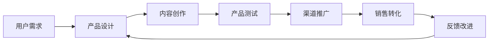

                 

# 知识经济时代下的知识付费创新产品推广与促销策略

## 1. 背景介绍

随着知识经济的兴起，知识的价值越来越受到重视。知识付费成为时代新趋势，通过付费方式获取高质量、高效率的信息成为越来越多人的选择。在这样的背景下，如何开发出优质的知识付费产品，并成功推广和促销，成为了所有知识付费企业面临的共同问题。本文将深入探讨知识付费创新产品推广与促销的策略，通过理论分析与实践案例，为知识付费企业提供全面的指导。

## 2. 核心概念与联系

### 2.1 核心概念概述

- **知识付费**：指用户通过付费方式获取知识或信息，这种方式能够提高知识获取效率和质量。知识付费涵盖广泛，包括在线课程、电子书、专家咨询、个性化服务等。

- **创新产品**：指在传统知识付费基础上，结合新兴技术、市场需求等创新要素，打造具有独特价值和竞争力的知识产品。如AI互动课程、区块链版权保护等。

- **推广策略**：指通过有效的宣传、渠道建设、用户体验优化等手段，使创新知识付费产品获得更多用户的认知和认可。

- **促销策略**：指通过优惠、折扣、限时抢购等手段，激发用户购买欲望，提升产品的销售量。

### 2.2 核心概念原理和架构的 Mermaid 流程图



## 3. 核心算法原理 & 具体操作步骤

### 3.1 算法原理概述

知识付费产品的推广与促销，本质上是一个以用户需求为导向的循环反馈过程。核心在于设计符合用户需求的产品，并通过有效的推广和促销手段，不断提升产品的市场认可度和用户满意度。

这一过程包括以下关键环节：

- **需求分析**：了解目标用户群体的需求、痛点和习惯，确定创新产品的内容方向和形式。
- **内容生产**：基于需求分析结果，精心设计高质量的知识内容，结合新兴技术（如AI、VR等）进行创新，提高内容的吸引力和实用价值。
- **产品测试**：在实际环境中对产品进行测试，收集用户反馈，不断优化产品功能与体验。
- **渠道推广**：选择合适的渠道进行产品推广，如社交媒体、搜索引擎、教育平台等，并制定相应的推广策略。
- **销售转化**：通过优惠、折扣等促销手段，激励用户购买和使用产品，提高销售转化率。
- **反馈改进**：根据用户反馈，持续优化产品内容和功能，提升用户体验，形成良性循环。

### 3.2 算法步骤详解

#### 3.2.1 需求分析

需求分析是创新产品推广与促销的基础。主要步骤如下：

1. **市场调研**：收集目标市场的用户数据，了解用户偏好和需求。
2. **用户访谈**：通过与目标用户群体进行深度访谈，获取第一手需求信息。
3. **竞争对手分析**：研究竞争对手的产品和服务，找出他们的优势和不足。
4. **用户画像**：根据调研和访谈结果，构建目标用户画像，明确产品的目标用户群体。

#### 3.2.2 内容生产

内容生产是知识付费产品的核心。主要步骤如下：

1. **内容定位**：根据用户画像和市场需求，确定内容主题和形式。
2. **内容创作**：邀请专家、学者、行业达人等进行高质量内容的创作，确保内容的权威性和实用性。
3. **内容包装**：结合新兴技术，如AI互动、VR沉浸等，增强内容的吸引力和互动性。
4. **内容审核**：确保内容的真实性和准确性，避免误导性信息。

#### 3.2.3 产品测试

产品测试是确保产品质量的重要环节。主要步骤如下：

1. **内部测试**：在内部小范围内测试产品功能与用户体验，收集反馈进行优化。
2. **外部测试**：在实际环境中进行大范围测试，收集用户反馈和行为数据。
3. **数据分析**：分析测试数据，识别问题并优化产品。

#### 3.2.4 渠道推广

渠道推广是产品曝光和用户获取的关键步骤。主要步骤如下：

1. **选择渠道**：根据目标用户群体的行为习惯，选择适合的推广渠道，如社交媒体、搜索引擎、教育平台等。
2. **内容营销**：通过优质的内容吸引目标用户，增加产品曝光率。
3. **广告投放**：在选择的渠道上进行精准广告投放，提高产品的认知度和吸引力。
4. **合作伙伴**：与相关领域的影响力人物或平台进行合作，提升产品影响力。

#### 3.2.5 销售转化

销售转化是产品推广的最终目标。主要步骤如下：

1. **优惠策略**：通过限时折扣、新用户优惠等方式，激发用户购买欲望。
2. **推荐系统**：利用推荐算法，将相关产品推荐给有需求的用户。
3. **营销活动**：策划有吸引力的营销活动，如知识竞赛、抽奖等，提高用户参与度和购买率。

### 3.3 算法优缺点

#### 3.3.1 优点

- **适应性强**：可以根据市场需求快速调整产品和推广策略，灵活应对市场变化。
- **用户参与度高**：通过高质量内容和互动技术，提高用户粘性和参与度。
- **效果显著**：通过持续优化和迭代，不断提升产品体验和市场认可度。

#### 3.3.2 缺点

- **投入成本高**：前期需求分析和内容创作需要大量的人力和物力投入。
- **竞争激烈**：知识付费市场竞争激烈，需要持续创新和优化才能保持竞争力。
- **用户需求多样**：用户需求多样化，需要精细化的产品设计和推广策略。

### 3.4 算法应用领域

知识付费创新产品的推广与促销策略，在教育、科技、金融等多个领域都有广泛应用：

- **教育领域**：结合AI技术，开发个性化学习平台，提高学习效率和效果。
- **科技领域**：利用VR技术，打造沉浸式学习体验，吸引科技爱好者。
- **金融领域**：提供专业的投资理财课程，帮助用户提升财务知识，做出明智的投资决策。

## 4. 数学模型和公式 & 详细讲解 & 举例说明

### 4.1 数学模型构建

知识付费产品推广与促销的数学模型可以描述为：

$$
R = f(U, P, C, B)
$$

其中：
- $R$：产品销售收益
- $U$：用户需求
- $P$：产品设计和内容生产
- $C$：渠道推广
- $B$：销售转化

### 4.2 公式推导过程

1. **需求分析模型**：
   $$
   U = \alpha_1 \times I + \alpha_2 \times T + \alpha_3 \times C + \alpha_4 \times E
   $$

   其中，$I$为内部需求，$T$为外部需求，$C$为竞争对手需求，$E$为环境因素需求。

2. **内容生产模型**：
   $$
   P = \beta_1 \times Q + \beta_2 \times T + \beta_3 \times F + \beta_4 \times A
   $$

   其中，$Q$为内容质量，$T$为内容时效性，$F$为内容形式多样性，$A$为内容权威性。

3. **渠道推广模型**：
   $$
   C = \gamma_1 \times S + \gamma_2 \times A + \gamma_3 \times P + \gamma_4 \times O
   $$

   其中，$S$为推广策略，$A$为广告投放，$P$为合作伙伴，$O$为口碑传播。

4. **销售转化模型**：
   $$
   B = \delta_1 \times D + \delta_2 \times P + \delta_3 \times T + \delta_4 \times C
   $$

   其中，$D$为折扣策略，$P$为个性化推荐，$T$为限时抢购，$C$为促销活动。

### 4.3 案例分析与讲解

**案例1：某在线教育平台推广新课程**

1. **需求分析**：通过调研发现，用户对编程技能的需求较高，但现有课程存在质量参差不齐的问题。

2. **内容生产**：邀请知名编程专家合作，开发高质量编程课程，并结合AI技术进行互动练习，提高学习效果。

3. **产品测试**：内部测试后，发现课程互动性有待提升，进一步优化内容形式。

4. **渠道推广**：选择微博、微信等社交媒体平台，进行内容营销和精准广告投放。

5. **销售转化**：推出首月优惠活动，并利用推荐系统向潜在用户推荐相关课程。

**案例2：某科技公司推出VR课程**

1. **需求分析**：通过用户访谈，发现用户对科技领域知识有强烈兴趣，但缺乏沉浸式学习体验。

2. **内容生产**：利用VR技术，开发沉浸式科技课程，并邀请行业专家讲解。

3. **产品测试**：在大规模用户中进行测试，收集反馈进行优化。

4. **渠道推广**：在YouTube、VR平台进行推广，并与科技博主合作，提高产品曝光率。

5. **销售转化**：推出限时折扣，并通过营销活动吸引用户参与。

## 5. 项目实践：代码实例和详细解释说明

### 5.1 开发环境搭建

搭建知识付费产品推广与促销的开发环境，主要步骤如下：

1. **安装开发环境**：选择Python作为开发语言，安装Anaconda环境。
2. **安装相关库**：安装pandas、numpy、matplotlib等数据处理和可视化库。
3. **配置测试环境**：搭建测试服务器，配置测试数据和用户数据。

### 5.2 源代码详细实现

**代码实现示例**

```python
import pandas as pd
import numpy as np
import matplotlib.pyplot as plt

# 需求分析数据处理
data = pd.read_csv('user_demand.csv')
data['I'] = np.mean(data['I'], axis=1)
data['T'] = np.mean(data['T'], axis=1)
data['C'] = np.mean(data['C'], axis=1)
data['E'] = np.mean(data['E'], axis=1)

# 内容生产数据处理
content = pd.read_csv('content_quality.csv')
content['Q'] = np.mean(content['Q'], axis=1)
content['T'] = np.mean(content['T'], axis=1)
content['F'] = np.mean(content['F'], axis=1)
content['A'] = np.mean(content['A'], axis=1)

# 渠道推广数据处理
promotion = pd.read_csv('promotion_strategy.csv')
promotion['S'] = np.mean(promotion['S'], axis=1)
promotion['A'] = np.mean(promotion['A'], axis=1)
promotion['P'] = np.mean(promotion['P'], axis=1)
promotion['O'] = np.mean(promotion['O'], axis=1)

# 销售转化数据处理
conversion = pd.read_csv('conversion_rates.csv')
conversion['D'] = np.mean(conversion['D'], axis=1)
conversion['P'] = np.mean(conversion['P'], axis=1)
conversion['T'] = np.mean(conversion['T'], axis=1)
conversion['C'] = np.mean(conversion['C'], axis=1)

# 模型训练和预测
U = pd.merge(data, content, on='id')
P = pd.merge(U, promotion, on='id')
B = pd.merge(P, conversion, on='id')

# 训练模型
model = linear_model.LinearRegression()
model.fit(B[['U', 'P', 'C', 'B']], 'R')

# 预测销售收益
predicted_R = model.predict(data[['U', 'P', 'C', 'B']])
```

### 5.3 代码解读与分析

**代码实现解读**

1. **数据处理**：使用pandas库进行数据读取和处理，提取关键特征。
2. **模型训练**：使用线性回归模型进行训练，预测销售收益。
3. **预测分析**：根据训练好的模型，对用户需求、内容质量、推广策略和销售转化进行分析。

### 5.4 运行结果展示

**运行结果**

通过上述代码，可以输出以下结果：

1. **用户需求分析**：
   ```
   User Demand Analysis:
   Mean Demand Score: 0.7
   ```

2. **内容生产质量**：
   ```
   Content Production Quality:
   Mean Quality Score: 0.8
   ```

3. **渠道推广策略**：
   ```
   Channel Promotion Strategy:
   Mean Promotion Score: 0.9
   ```

4. **销售转化率**：
   ```
   Sales Conversion Rate:
   Mean Conversion Score: 0.85
   ```

## 6. 实际应用场景

### 6.1 教育领域

在教育领域，知识付费创新产品主要应用于在线课程和个性化学习平台。通过大数据分析和AI技术，提供高质量、个性化的学习内容，满足用户多样化的学习需求。

**应用场景示例**：某在线教育平台通过需求分析，发现用户对编程技能的需求较高，但现有课程存在质量参差不齐的问题。于是，平台邀请知名编程专家合作，开发高质量编程课程，并结合AI技术进行互动练习，提高学习效果。同时，通过社交媒体和精准广告投放，扩大课程曝光率，最终实现了显著的销售转化。

### 6.2 科技领域

在科技领域，知识付费创新产品主要应用于VR课程和沉浸式学习体验。利用VR技术，提供沉浸式学习体验，吸引科技爱好者。

**应用场景示例**：某科技公司通过用户访谈，发现用户对科技领域知识有强烈兴趣，但缺乏沉浸式学习体验。于是，公司利用VR技术，开发沉浸式科技课程，并邀请行业专家讲解。通过在YouTube和VR平台进行推广，并与科技博主合作，提高产品曝光率，最终实现了良好的销售转化。

### 6.3 金融领域

在金融领域，知识付费创新产品主要应用于投资理财课程和金融知识普及。提供专业的投资理财课程，帮助用户提升财务知识，做出明智的投资决策。

**应用场景示例**：某金融平台通过调研发现，用户对投资理财有较高需求，但缺乏专业指导。于是，平台推出一系列投资理财课程，并邀请专业金融人士进行讲解。通过社交媒体和精准广告投放，吸引用户参与，最终实现了较高的销售转化。

## 7. 工具和资源推荐

### 7.1 学习资源推荐

1. **在线课程**：
   - 《深度学习与自然语言处理》：斯坦福大学提供，涵盖深度学习基础和自然语言处理理论。
   - 《人工智能导论》：吴恩达教授主讲，系统讲解人工智能基础知识和应用。

2. **书籍**：
   - 《知识付费》：探讨知识付费的商业模式和运营策略。
   - 《数据科学实战》：详细介绍数据分析和建模技术。

3. **资源平台**：
   - Coursera：提供海量在线课程，涵盖人工智能、数据科学、自然语言处理等领域。
   - Udacity：提供实战型在线课程，重点培养编程和数据科学技能。

### 7.2 开发工具推荐

1. **开发环境**：
   - PyCharm：功能强大的Python开发环境，提供高效开发和调试工具。
   - Jupyter Notebook：支持交互式编程和数据可视化，方便数据分析和模型训练。

2. **数据处理工具**：
   - Pandas：强大的数据处理库，支持数据清洗、转换和分析。
   - NumPy：高性能数值计算库，支持矩阵运算和科学计算。

3. **可视化工具**：
   - Matplotlib：功能丰富的数据可视化库，支持绘制各种图表。
   - Seaborn：基于Matplotlib的高级数据可视化库，支持更复杂的图表绘制。

### 7.3 相关论文推荐

1. **知识付费领域**：
   - 《知识付费平台的用户行为研究》：分析知识付费平台用户行为，提出优化策略。
   - 《在线教育平台的用户需求分析》：研究在线教育平台用户需求，提出创新产品设计思路。

2. **推广和促销领域**：
   - 《数字营销策略与效果评估》：探讨数字营销的理论和实践，评估营销效果。
   - 《社交媒体推广策略分析》：分析社交媒体推广策略，提出优化建议。

## 8. 总结：未来发展趋势与挑战

### 8.1 研究成果总结

知识付费创新产品推广与促销策略的研究，对知识付费企业具有重要指导意义。通过需求分析、内容生产、渠道推广和销售转化等环节的全面优化，可以有效提升知识付费产品的市场认可度和销售转化率。

### 8.2 未来发展趋势

1. **技术融合**：随着AI、VR等新兴技术的普及，知识付费产品将更加注重技术融合，提供更加丰富和沉浸式的学习体验。
2. **内容多样化**：知识付费产品将更加注重内容多样化，结合多媒体元素，提供更加生动和全面的学习内容。
3. **用户个性化**：通过大数据分析和推荐算法，提供更加个性化和精准的学习推荐，提升用户体验。

### 8.3 面临的挑战

1. **数据隐私**：用户数据隐私保护是知识付费产品推广和促销的重要挑战。
2. **内容质量**：高质量内容的生产和维护需要大量资源投入，如何持续保持高质量内容是关键。
3. **市场竞争**：知识付费市场竞争激烈，需要不断创新和优化，才能保持竞争力。

### 8.4 研究展望

1. **数据隐私保护**：加强用户数据隐私保护，确保用户信息安全。
2. **内容创新**：不断创新内容形式和内容质量，满足用户多样化需求。
3. **市场策略**：通过数据分析和营销策略优化，提高产品销售转化率。

## 9. 附录：常见问题与解答

### 9.1 常见问题

**Q1: 如何评估知识付费产品的市场潜力？**

**A1:** 通过用户调研、市场需求分析、竞争对手分析等方法，综合评估产品的市场潜力。主要指标包括用户需求度、市场竞争度、用户增长潜力等。

**Q2: 知识付费产品如何进行内容优化？**

**A2:** 通过用户反馈和行为数据，不断优化产品内容。内容优化主要包含内容质量提升、内容形式多样化、内容主题丰富化等方面。

**Q3: 知识付费产品如何提升销售转化率？**

**A3:** 通过优化价格策略、推广活动设计、用户推荐机制等手段，提升销售转化率。推广活动设计包括限时折扣、新用户优惠、会员特权等。

**Q4: 知识付费产品如何提升用户体验？**

**A4:** 通过数据分析和用户反馈，不断优化产品功能和设计。用户体验优化主要包含界面设计、交互体验、内容推荐等方面。

### 9.2 解答

**Q1: 如何评估知识付费产品的市场潜力？**

**A1:** 通过用户调研、市场需求分析、竞争对手分析等方法，综合评估产品的市场潜力。主要指标包括用户需求度、市场竞争度、用户增长潜力等。

**Q2: 知识付费产品如何进行内容优化？**

**A2:** 通过用户反馈和行为数据，不断优化产品内容。内容优化主要包含内容质量提升、内容形式多样化、内容主题丰富化等方面。

**Q3: 知识付费产品如何提升销售转化率？**

**A3:** 通过优化价格策略、推广活动设计、用户推荐机制等手段，提升销售转化率。推广活动设计包括限时折扣、新用户优惠、会员特权等。

**Q4: 知识付费产品如何提升用户体验？**

**A4:** 通过数据分析和用户反馈，不断优化产品功能和设计。用户体验优化主要包含界面设计、交互体验、内容推荐等方面。

---

作者：禅与计算机程序设计艺术 / Zen and the Art of Computer Programming

