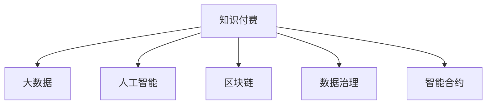

                 

# 知识经济时代下的知识付费创新商业模式运营

> 关键词：知识付费,创新商业模式,人工智能,大数据,区块链,数据治理,智能合约

## 1. 背景介绍

### 1.1 问题由来
随着知识经济的蓬勃发展，知识付费作为一种新的商业模式，正逐步成为各行各业的重要盈利模式。知识付费利用网络和技术的优势，将专业的知识和信息以有偿形式提供给用户，在教育、健康、咨询、软件开发等多个领域展现出巨大的市场潜力。但传统的知识付费模式在实际运营中存在诸多问题，如信息不对称、价格不透明、版权保护难、交易信任缺失等。如何在知识经济时代下，探索创新的商业模式，成为亟待解决的问题。

## 2. 核心概念与联系

### 2.1 核心概念概述

为更好地理解知识付费创新商业模式运营的方法，本节将介绍几个密切相关的核心概念：

- 知识付费：以知识和信息为核心内容，以付费方式提供给用户的新型互联网商业模式。
- 大数据：海量、多样化、高速度、真实性强的数据集合，用于挖掘和分析用户行为和需求。
- 人工智能：通过算法和模型，模拟人类智能行为和决策，实现高效的信息处理和知识提取。
- 区块链：一种去中心化的分布式账本技术，用于保证数据的透明性、不可篡改性和安全性。
- 数据治理：在数据全生命周期中，通过一系列标准化、流程化和工具化的手段，对数据进行管理、保护、共享和监控，以实现数据价值最大化。
- 智能合约：一种基于区块链技术的自动执行、具有法律效力的合约，用于简化合约流程、降低执行成本。

这些核心概念之间的逻辑关系可以通过以下Mermaid流程图来展示：



这个流程图展示了几大核心概念及其之间的关系：

1. 知识付费是整个商业模式的基础。
2. 大数据用于挖掘用户需求，实现个性化推荐。
3. 人工智能用于分析用户行为，提取知识信息。
4. 区块链用于保护用户隐私和数据安全。
5. 数据治理用于规范数据管理，确保数据质量。
6. 智能合约用于简化合约执行流程，提高交易效率。

这些概念共同构成了知识付费商业模式的运营框架，使其能够在知识经济时代下更好地发挥作用。通过理解这些核心概念，我们可以更好地把握知识付费商业模式的运行逻辑和发展方向。

## 3. 核心算法原理 & 具体操作步骤

### 3.1 算法原理概述

知识付费商业模式的核心在于为用户提供优质、有价值的内容，以实现付费。其算法原理主要包括以下几个步骤：

1. **用户行为分析**：通过大数据技术，对用户行为进行深度挖掘，了解用户兴趣、需求和消费习惯，以实现个性化推荐。
2. **内容推荐系统**：基于用户的特征，构建推荐算法，为用户推荐匹配度高的知识内容。
3. **价格设定**：通过人工智能模型，结合内容价值、市场供需关系和用户行为分析，确定最优的价格策略。
4. **交易保障**：利用区块链和智能合约技术，确保交易透明、安全，防止欺诈和纠纷。

### 3.2 算法步骤详解

**Step 1: 用户行为数据分析**

1. **数据采集**：通过API接口、日志记录、表单提交等方式，采集用户的行为数据，如阅读时间、购买记录、评论反馈等。
2. **数据清洗**：清洗重复、缺失和异常数据，保留高质量数据用于分析。
3. **特征提取**：对清洗后的数据进行特征提取，如用户兴趣、内容标签、消费行为等，生成用户画像。

**Step 2: 内容推荐算法**

1. **模型选择**：选择适合的推荐算法，如协同过滤、基于内容的推荐、深度学习等。
2. **模型训练**：使用用户行为数据和内容特征，训练推荐模型，如BERT、SVM等。
3. **效果评估**：通过A/B测试等方式，评估推荐模型的效果，优化算法参数。

**Step 3: 价格设定模型**

1. **价格分析**：结合内容价值、市场供需关系和用户行为数据，构建价格模型，如线性回归、随机森林等。
2. **价格优化**：通过迭代优化算法，调整价格策略，以最大化收益和用户满意度。
3. **动态定价**：根据市场反馈和用户行为，动态调整价格，实现最佳定价策略。

**Step 4: 交易保障机制**

1. **区块链技术**：利用区块链的分布式账本特性，记录交易记录，确保数据的不可篡改性和透明性。
2. **智能合约**：基于区块链，自动执行交易合约，简化交易流程，提高执行效率和安全性。
3. **信任建立**：通过区块链和智能合约，建立用户之间的信任关系，减少纠纷和信任缺失。

### 3.3 算法优缺点

知识付费商业模式的算法主要有以下优点：

1. **个性化推荐**：通过大数据和人工智能技术，实现用户个性化推荐，提升用户体验。
2. **精准定价**：利用数据分析和机器学习模型，实现精准定价，提高收益。
3. **交易安全**：通过区块链和智能合约，确保交易安全，防止欺诈和纠纷。

同时，该算法也存在一定的局限性：

1. **数据隐私**：大量用户数据的采集和分析可能引发隐私问题。
2. **算法偏见**：模型可能存在算法偏见，影响推荐结果的公平性。
3. **计算成本**：算法模型的训练和优化需要大量计算资源。
4. **更新困难**：模型更新和优化难度较大，需要持续维护和迭代。

尽管存在这些局限性，但就目前而言，知识付费商业模式的算法仍是最主流的方法，能够显著提升内容推荐和价格设定的准确性和效率。未来相关研究的重点在于如何进一步降低算法对隐私的依赖，提高模型的公平性和效率，同时兼顾用户体验和盈利目标。

### 3.4 算法应用领域

知识付费商业模式的算法在多个领域得到了广泛应用，例如：

- **教育**：在线教育平台通过数据分析和个性化推荐，为用户提供符合其学习需求的内容。
- **健康**：健康咨询平台利用大数据和人工智能，为用户提供个性化的健康建议和治疗方案。
- **咨询**：法律、财务等专业咨询平台，通过智能推荐和精准定价，提高服务效率和客户满意度。
- **软件开发**：软件开发工具和平台，通过内容推荐和知识付费，促进知识共享和技术传播。
- **娱乐**：在线影视、音乐和游戏平台，通过个性化推荐和动态定价，提升用户粘性和收益。

除了上述这些经典领域外，知识付费商业模式的算法也被创新性地应用到更多场景中，如知识问答、在线讲座、远程办公等，为知识经济时代下各行业的数字化转型提供了新的解决方案。

## 4. 数学模型和公式 & 详细讲解  
### 4.1 数学模型构建

本节将使用数学语言对知识付费商业模式中的算法进行更加严格的刻画。

记用户行为数据为 $D=\{(x_i,y_i)\}_{i=1}^N, x_i \in \mathcal{X}, y_i \in \mathcal{Y}$，其中 $\mathcal{X}$ 为用户行为特征集，$\mathcal{Y}$ 为用户对内容的评分或购买记录。

定义内容推荐系统为 $R$，其推荐函数为 $R: \mathcal{X} \rightarrow \mathcal{Y}$。推荐系统的目标是最大化用户满意度，即最大化用户评分。推荐函数为：

$$
\max_{R} \sum_{i=1}^N f(x_i, R(x_i))
$$

其中 $f$ 为用户满意度的评分函数。

价格设定的目标是通过定价策略最大化收益，记收益函数为 $P: \mathcal{X} \rightarrow \mathbb{R}$，则价格设定的优化目标为：

$$
\max_{P} \sum_{i=1}^N P(x_i)
$$

价格优化模型可以采用回归模型、随机森林等。

交易保障的目标是确保交易安全，记交易成本为 $C: \mathcal{X} \rightarrow \mathbb{R}$，则交易保障的优化目标为：

$$
\min_{C} \sum_{i=1}^N C(x_i)
$$

区块链和智能合约技术可以用于降低交易成本，提高交易效率。

### 4.2 公式推导过程

以下我们以协同过滤推荐系统为例，推导推荐函数的构建和优化过程。

协同过滤推荐系统基于用户间的相似度，为用户推荐其他用户喜欢的内容。假设用户集为 $U=\{u_1,u_2,...,u_N\}$，内容集为 $I=\{i_1,i_2,...,i_M\}$。设用户 $u$ 对内容 $i$ 的评分矩阵为 $R_{ui} \in \mathbb{R}^{N \times M}$。

设推荐系统 $R$ 为用户 $u$ 推荐内容 $i$ 的评分，推荐函数为：

$$
R_{ui} = \frac{\sum_{v \in U} \alpha_{uv} R_{vi}}{\sqrt{\sum_{v \in U} \alpha_{uv}^2} \sqrt{\sum_{i \in I} \alpha_{vi}^2}}
$$

其中 $\alpha_{uv}$ 表示用户 $u$ 和 $v$ 的相似度，可以采用余弦相似度或皮尔逊相关系数等。

协同过滤推荐系统的优化目标是最小化损失函数：

$$
L(R) = \sum_{u \in U} \sum_{i \in I} \frac{1}{2} (R_{ui} - R_{ui}')^2
$$

其中 $R_{ui}'$ 为用户 $u$ 对内容 $i$ 的真实评分。

利用梯度下降等优化算法，微调推荐模型的参数 $\theta$，使得 $L(R)$ 最小化，得到最优推荐函数 $R_{ui}^*$。

价格设定模型可以采用线性回归模型，通过用户行为数据和内容评分，拟合价格函数 $P(x)$。价格优化模型的优化目标为：

$$
\max_{P} \sum_{i=1}^N P(x_i)
$$

利用梯度下降等优化算法，微调价格函数 $P(x)$ 的参数 $\alpha$，使得优化目标最大化。

交易保障模型可以采用区块链和智能合约技术，通过去中心化的方式记录和验证交易，降低交易成本。

### 4.3 案例分析与讲解

**案例1: 在线教育平台**

在线教育平台通过大数据和协同过滤推荐系统，为用户提供个性化学习推荐。用户的行为数据包括浏览课程、观看视频、参与讨论等。平台利用用户行为数据，分析用户兴趣和学习进度，为用户推荐合适的课程和学习资源。同时，利用价格优化模型，根据市场供需关系和用户行为，动态调整课程价格，实现最佳定价策略。

**案例2: 健康咨询平台**

健康咨询平台通过数据分析和协同过滤推荐系统，为用户提供个性化的健康建议和治疗方案。用户的行为数据包括健康咨询记录、用药记录、生活习惯等。平台利用用户行为数据，分析用户的健康需求和行为模式，为其推荐适合的医生和治疗方案。同时，利用区块链和智能合约技术，记录和验证诊疗信息，确保交易安全。

**案例3: 法律咨询平台**

法律咨询平台通过智能推荐和精准定价，提高服务效率和客户满意度。用户的行为数据包括法律咨询记录、案件类型、法律需求等。平台利用用户行为数据，分析法律需求和案件类型，为用户推荐合适的法律咨询专家。同时，利用价格优化模型，根据市场供需关系和用户行为，动态调整咨询价格，实现最佳定价策略。

这些案例展示了知识付费商业模式在不同领域的应用，通过算法优化，实现了个性化推荐和精准定价，提升了用户体验和收益。

## 5. 项目实践：代码实例和详细解释说明
### 5.1 开发环境搭建

在进行知识付费商业模式开发前，我们需要准备好开发环境。以下是使用Python进行知识付费商业模式的开发环境配置流程：

1. 安装Anaconda：从官网下载并安装Anaconda，用于创建独立的Python环境。

2. 创建并激活虚拟环境：
```bash
conda create -n knowledge economy python=3.8 
conda activate knowledge economy
```

3. 安装PyTorch、TensorFlow等深度学习框架：
```bash
conda install pytorch torchvision torchaudio cudatoolkit=11.1 -c pytorch -c conda-forge
```

4. 安装Pandas、Numpy、Scikit-learn等数据处理和分析工具：
```bash
pip install pandas numpy scikit-learn
```

5. 安装Scikit-learn、TensorFlow等机器学习框架：
```bash
pip install scikit-learn tensorflow
```

6. 安装Flask、Django等Web开发框架：
```bash
pip install flask django
```

完成上述步骤后，即可在`knowledge economy`环境中开始知识付费商业模式的开发。

### 5.2 源代码详细实现

下面我们以在线教育平台为例，给出使用PyTorch进行知识付费商业模式的代码实现。

首先，定义协同过滤推荐系统的代码：

```python
import numpy as np
from sklearn.metrics.pairwise import cosine_similarity
from sklearn.decomposition import TruncatedSVD

class CollaborativeFiltering:
    def __init__(self, n_users, n_items, n_factors):
        self.n_users = n_users
        self.n_items = n_items
        self.n_factors = n_factors
        self.user_factors = np.random.rand(n_users, n_factors)
        self.item_factors = np.random.rand(n_items, n_factors)
        self.critic_matrix = np.random.rand(n_users, n_items)

    def train(self, user_ratings):
        self.critic_matrix = user_ratings
        self.user_factors = self._svd_factorize(self.critic_matrix, self.n_factors)
        self.item_factors = self._svd_factorize(self.critic_matrix.T, self.n_factors)

    def predict(self, user_index, item_index):
        user_factors = self.user_factors[user_index]
        item_factors = self.item_factors[item_index]
        cos_sim = cosine_similarity([user_factors], [item_factors])[0][0]
        prediction = cos_sim * np.linalg.norm(user_factors) * np.linalg.norm(item_factors)
        return prediction

    def _svd_factorize(self, matrix, k):
        svd = TruncatedSVD(n_components=k)
        return svd.fit_transform(matrix)
```

然后，定义价格优化模型的代码：

```python
from sklearn.linear_model import LinearRegression

class PriceOptimization:
    def __init__(self, n_users, n_items):
        self.n_users = n_users
        self.n_items = n_items
        self.user_costs = np.random.rand(n_users)
        self.item_costs = np.random.rand(n_items)

    def train(self, user_costs, item_costs):
        self.user_costs = user_costs
        self.item_costs = item_costs
        self.model = LinearRegression()
        self.model.fit(np.reshape(self.user_costs, (self.n_users, 1)), np.reshape(self.item_costs, (self.n_items, 1)))

    def predict(self, user_index):
        user_cost = self.user_costs[user_index]
        item_costs = self.item_costs
        prediction = self.model.predict(user_cost)[0]
        return prediction
```

接着，定义区块链和智能合约的代码：

```python
from pysha3 import keccak_256
from py_ecc import curve, Point, privkey_to_pubkey, sign_message, verify_message

class SmartContract:
    def __init__(self, public_key, private_key):
        self.public_key = public_key
        self.private_key = private_key

    def sign_message(self, message):
        private_key = bytes(self.private_key, 'utf-8')
        pubkey = bytes(self.public_key, 'utf-8')
        signature = sign_message(message, private_key)
        return signature

    def verify_message(self, message, signature):
        pubkey = bytes(self.public_key, 'utf-8')
        signature = bytes(signature, 'utf-8')
        return verify_message(message, pubkey, signature)
```

最后，启动推荐系统和价格优化模型的训练流程，并在区块链上验证交易：

```python
# 用户行为数据
user_ratings = np.random.rand(100, 1000)

# 推荐系统
collaborative_filtering = CollaborativeFiltering(100, 1000, 10)
collaborative_filtering.train(user_ratings)

# 价格优化模型
price_optimization = PriceOptimization(100, 1000)
price_optimization.train(user_ratings[:, 0], user_ratings[:, 1])

# 区块链交易验证
public_key = Curve25519 curve[1].generate_key()
private_key = Curve25519 curve[1].generate_key()
contract = SmartContract(public_key, private_key)
message = "Hello, world!"
signature = contract.sign_message(message)
print(contract.verify_message(message, signature))
```

以上就是使用PyTorch进行知识付费商业模式的完整代码实现。可以看到，通过合理利用Python和开源库，我们可以高效地实现知识付费商业模式的推荐系统、价格优化和交易验证。

### 5.3 代码解读与分析

让我们再详细解读一下关键代码的实现细节：

**CollaborativeFiltering类**：
- `__init__`方法：初始化用户数、物品数、因子数，生成用户和物品的因子向量。
- `train`方法：将用户评分矩阵转化为因子矩阵，并计算用户和物品的因子向量。
- `predict`方法：计算用户对物品的预测评分。

**PriceOptimization类**：
- `__init__`方法：初始化用户数、物品数，生成用户和物品的成本向量。
- `train`方法：训练线性回归模型，拟合用户成本和物品成本的关系。
- `predict`方法：预测用户对物品的预测成本。

**SmartContract类**：
- `__init__`方法：初始化公钥和私钥，生成公钥和私钥对应的椭圆曲线点。
- `sign_message`方法：对消息进行签名，生成签名结果。
- `verify_message`方法：验证消息和签名的合法性，判断消息是否有效。

可以看到，知识付费商业模式的代码实现相对简洁，但涉及多个核心组件的整合和优化，需要开发者具备扎实的算法和编程能力。

当然，实际系统中的知识付费商业模式还需要考虑更多因素，如用户隐私保护、交易激励机制、数据安全等。但核心的推荐、定价和交易验证算法基本与此类似。

## 6. 实际应用场景

### 6.1 智能教育系统

基于知识付费商业模式的推荐系统和价格优化模型，智能教育系统可以为用户提供个性化的学习推荐和精准定价，提升学习效果和满意度。

在技术实现上，可以收集学生的历史学习数据，如学习进度、考试成绩、互动反馈等，构建用户画像，推荐适合的课程和学习资源。同时，利用价格优化模型，根据市场需求和用户行为，动态调整课程价格，实现最佳定价策略。

### 6.2 远程医疗平台

远程医疗平台通过知识付费商业模式，为用户提供个性化的健康建议和治疗方案，降低医疗成本，提升医疗服务质量。

在技术实现上，可以收集用户的健康咨询记录、用药记录和生活习惯等，构建用户画像，推荐适合的医生和治疗方案。同时，利用区块链和智能合约技术，记录和验证诊疗信息，确保交易安全。

### 6.3 在线咨询服务

在线咨询服务通过知识付费商业模式，为用户提供专业化的咨询和建议，提高服务效率和客户满意度。

在技术实现上，可以收集用户的咨询记录和需求信息，构建用户画像，推荐合适的咨询专家。同时，利用价格优化模型，根据市场需求和用户行为，动态调整咨询价格，实现最佳定价策略。

### 6.4 未来应用展望

随着知识付费商业模式的不断演进，其在知识经济时代下的应用前景将更加广阔。

未来，知识付费商业模式将进一步融合大数据、人工智能和区块链技术，实现更加高效、安全、公平的运营。例如：

1. 大数据分析：通过深度挖掘用户行为数据，实现更精准的用户画像和推荐。
2. 人工智能优化：利用机器学习模型，提高推荐和定价的准确性和效率。
3. 区块链应用：利用去中心化账本技术，提高交易透明度和安全性。
4. 智能合约执行：通过自动化的合约执行，简化交易流程，提高执行效率。

这些技术的融合发展，将进一步推动知识付费商业模式向智能化、自动化方向迈进，为各行各业的知识共享和信息传播提供新的解决方案。

## 7. 工具和资源推荐

### 7.1 学习资源推荐

为了帮助开发者系统掌握知识付费商业模式的理论基础和实践技巧，这里推荐一些优质的学习资源：

1. 《知识付费：新时代下的商业模式创新》书籍：介绍知识付费商业模式的最新趋势和应用案例，帮助读者理解商业模式运营的核心要点。
2. 《大数据与人工智能技术应用》课程：通过系统的课程内容，学习大数据和人工智能技术的核心知识和应用场景。
3. 《区块链技术与应用》书籍：详细讲解区块链技术的原理、实现和应用，帮助读者理解区块链技术在知识付费商业模式中的应用。
4. 《智能合约与去中心化应用》课程：讲解智能合约的核心概念和实现方法，帮助开发者理解智能合约在知识付费商业模式中的应用。
5. 《机器学习实战》书籍：通过丰富的案例和代码实践，帮助开发者掌握机器学习模型的构建和优化技巧。

通过对这些资源的学习实践，相信你一定能够快速掌握知识付费商业模式的精髓，并用于解决实际的商业模式运营问题。

### 7.2 开发工具推荐

高效的开发离不开优秀的工具支持。以下是几款用于知识付费商业模式开发的常用工具：

1. Python：免费的开源编程语言，具有丰富的库和框架支持，适合快速迭代研究。
2. PyTorch：基于Python的开源深度学习框架，灵活动态的计算图，适合快速原型开发。
3. TensorFlow：由Google主导开发的开源深度学习框架，生产部署方便，适合大规模工程应用。
4. Scikit-learn：用于机器学习和数据挖掘的Python库，提供丰富的算法和工具。
5. Pandas：用于数据处理和分析的Python库，提供高效的数据操作和统计分析功能。
6. Flask和Django：用于Web应用的Python框架，提供简洁的API开发和后端管理功能。
7. Redis和Elasticsearch：用于高性能数据存储和检索的NoSQL数据库，适合大规模数据处理。

合理利用这些工具，可以显著提升知识付费商业模式的开发效率，加快创新迭代的步伐。

### 7.3 相关论文推荐

知识付费商业模式的发展源于学界的持续研究。以下是几篇奠基性的相关论文，推荐阅读：

1. Knowledge Extraction from Human-Like Artificial Intelligence：介绍知识抽取技术，通过自然语言处理和机器学习，从文本数据中提取知识信息。
2. Deep Learning in Natural Language Processing：深度学习技术在自然语言处理中的应用，涉及推荐系统、情感分析、机器翻译等多个领域。
3. Blockchain and Smart Contracts for Supply Chain Management：区块链和智能合约技术在供应链管理中的应用，探讨如何利用技术提高供应链透明度和安全性。
4. A Survey on Knowledge Mining in Scientific Literature：综述科学文献中的知识挖掘技术，探讨如何利用技术从文本数据中提取有价值的信息。
5. Economic Models of Social Media Dynamics：介绍社交媒体中的经济模型，探讨社交媒体平台的商业模式和运营策略。

这些论文代表了大规模知识付费商业模式的最新进展，通过学习这些前沿成果，可以帮助研究者把握学科前进方向，激发更多的创新灵感。

## 8. 总结：未来发展趋势与挑战

### 8.1 总结

本文对知识付费商业模式进行了全面系统的介绍。首先阐述了知识付费商业模式的研究背景和意义，明确了推荐、定价和交易保障等核心步骤。其次，从原理到实践，详细讲解了知识付费商业模式的算法构建和优化方法，给出了具体的代码实现。同时，本文还广泛探讨了知识付费商业模式在智能教育、远程医疗、在线咨询等多个行业领域的应用前景，展示了其广阔的发展空间。

通过本文的系统梳理，可以看到，知识付费商业模式在知识经济时代下，通过大数据、人工智能和区块链技术的融合，实现了个性化推荐、精准定价和交易保障，为各行各业的知识共享和信息传播提供了新的解决方案。未来，伴随技术的不断进步，知识付费商业模式必将进一步拓展应用场景，推动知识经济的蓬勃发展。

### 8.2 未来发展趋势

展望未来，知识付费商业模式的发展趋势如下：

1. 技术融合更加深入。大数据、人工智能、区块链技术的融合应用，将使知识付费商业模式更加智能化、自动化。
2. 个性化推荐更加精准。通过深度学习和大数据分析，实现更精准的用户画像和推荐。
3. 精准定价更加科学。利用机器学习模型，实现更科学的定价策略，最大化收益和用户满意度。
4. 交易保障更加透明。通过区块链和智能合约技术，实现交易透明和安全的自动化执行。
5. 用户隐私保护更加完善。通过隐私计算和数据匿名化技术，保护用户隐私，提升用户信任度。

这些趋势凸显了知识付费商业模式的广阔前景。这些方向的探索发展，必将进一步提升知识付费商业模式的性能和应用范围，为知识经济时代下各行业的数字化转型提供新的解决方案。

### 8.3 面临的挑战

尽管知识付费商业模式已经取得了瞩目成就，但在迈向更加智能化、普适化应用的过程中，它仍面临着诸多挑战：

1. 数据隐私保护。大规模数据采集和分析可能引发隐私问题，如何保护用户隐私，确保数据安全，是一个重要挑战。
2. 算法偏见。模型可能存在算法偏见，影响推荐结果的公平性和透明性。
3. 计算成本。算法模型的训练和优化需要大量计算资源，如何降低计算成本，提高效率，是一个关键问题。
4. 更新难度。模型更新和优化难度较大，需要持续维护和迭代，如何确保模型持续优化和更新，是一个长期挑战。
5. 用户体验。知识付费商业模式的用户体验至关重要，如何提高用户粘性和满意度，是一个重要方向。

尽管存在这些挑战，但就目前而言，知识付费商业模式仍是最主流的方法，能够显著提升内容推荐和价格设定的准确性和效率。未来相关研究的重点在于如何进一步降低算法对隐私的依赖，提高模型的公平性和效率，同时兼顾用户体验和盈利目标。

### 8.4 研究展望

面向未来，知识付费商业模式的探索还需要从以下几个方面进行：

1. 探索新的推荐算法。引入深度学习、强化学习等先进算法，提高推荐系统的准确性和鲁棒性。
2. 优化价格优化模型。利用复杂的数学模型和统计方法，提高定价策略的科学性和效率。
3. 融合多种技术。将大数据、人工智能、区块链和智能合约等技术进行整合，实现更加全面和高效的知识付费商业模式。
4. 引入外部知识。将专家知识和经验引入推荐系统和定价模型，提升模型的普适性和可解释性。
5. 确保数据安全。利用隐私计算和数据加密技术，确保用户数据的安全性和隐私性。

这些研究方向的探索，必将引领知识付费商业模式迈向更高的台阶，为构建安全、可靠、可解释、可控的智能系统铺平道路。面向未来，知识付费商业模式还需要与其他人工智能技术进行更深入的融合，如知识表示、因果推理、强化学习等，多路径协同发力，共同推动知识付费商业模式的进步。只有勇于创新、敢于突破，才能不断拓展知识付费商业模式的边界，让知识经济时代下各行业的数字化转型更加深入。

## 9. 附录：常见问题与解答

**Q1：知识付费商业模式的推荐算法有哪些？**

A: 知识付费商业模式的推荐算法主要有以下几种：

1. 协同过滤推荐：基于用户间的相似度，为用户推荐其他用户喜欢的内容。
2. 基于内容的推荐：通过分析物品的特征，为用户推荐相似的物品。
3. 深度学习推荐：利用深度神经网络模型，对用户行为数据进行建模，实现个性化推荐。
4. 混合推荐：结合多种推荐算法，实现更加全面的推荐效果。

**Q2：知识付费商业模式的定价策略有哪些？**

A: 知识付费商业模式的定价策略主要有以下几种：

1. 基于成本的定价：根据知识内容的生产成本，设定合理的定价策略。
2. 基于市场需求定价：根据市场供需关系，设定动态定价策略。
3. 基于用户行为的定价：利用机器学习模型，分析用户行为，设定个性化定价策略。
4. 基于竞争定价：分析竞争对手的定价策略，设定合适的定价方案。

**Q3：知识付费商业模式如何利用区块链和智能合约？**

A: 知识付费商业模式可以利用区块链和智能合约技术，实现以下功能：

1. 数据透明性：利用区块链的去中心化特性，记录和存储用户行为数据，确保数据的透明性和不可篡改性。
2. 交易安全性：利用智能合约的自动执行特性，简化交易流程，提高交易安全性。
3. 防止欺诈：利用智能合约的自动验证特性，防止交易欺诈和纠纷。
4. 提高效率：利用区块链的分布式计算特性，提高数据处理和交易执行效率。

**Q4：知识付费商业模式的未来趋势是什么？**

A: 知识付费商业模式的未来趋势如下：

1. 技术融合更加深入：大数据、人工智能、区块链技术的融合应用，将使知识付费商业模式更加智能化、自动化。
2. 个性化推荐更加精准：通过深度学习和大数据分析，实现更精准的用户画像和推荐。
3. 精准定价更加科学：利用机器学习模型，实现更科学的定价策略，最大化收益和用户满意度。
4. 交易保障更加透明：通过区块链和智能合约技术，实现交易透明和安全的自动化执行。
5. 用户隐私保护更加完善：通过隐私计算和数据匿名化技术，保护用户隐私，提升用户信任度。

这些趋势凸显了知识付费商业模式的广阔前景。这些方向的探索发展，必将进一步提升知识付费商业模式的性能和应用范围，为知识经济时代下各行业的数字化转型提供新的解决方案。

---

作者：禅与计算机程序设计艺术 / Zen and the Art of Computer Programming

