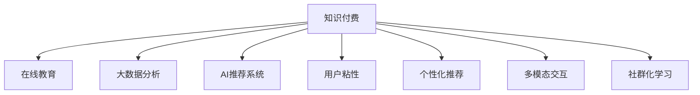

                 

# 知识经济时代下的知识付费创新商业模式运营

> 关键词：知识付费,创新商业模式,在线教育,大数据分析,用户行为,AI推荐系统

## 1. 背景介绍

### 1.1 问题由来
随着信息技术的快速发展，互联网已成为全球最大的知识宝库。越来越多的人开始依赖互联网获取知识，这不仅改变了人们的日常生活和学习方式，也推动了知识付费市场的蓬勃发展。传统的知识付费模式如书籍、讲座、课程等已被在线教育平台所取代，用户可以随时随地获取各类知识。然而，面对日益丰富的知识内容，如何选择适合自己的学习资源、提高学习效率，成为了新的问题。

### 1.2 问题核心关键点
在线教育平台通过大数据分析和AI推荐系统，为用户推荐个性化的学习资源，大大提升了用户的学习体验和效率。但随着知识付费市场竞争加剧，如何创新商业模式、提高用户粘性和忠诚度，成为平台持续发展的关键。

### 1.3 问题研究意义
研究知识付费创新商业模式运营，对于提升在线教育平台的竞争力、激发用户的知识需求、推动知识经济时代的学习转型具有重要意义：

1. 优化用户体验。通过创新商业模式，满足不同用户的多样化需求，提高用户粘性和满意度。
2. 增强平台盈利能力。多样化、个性化的知识付费产品设计，可以拓展收入来源，增强平台的盈利能力。
3. 驱动用户学习。创新的付费模式能够激发用户的学习兴趣，促进知识传播和应用。
4. 促进知识共享。更加科学、高效的知识付费运营，有助于构建公平、开放的知识共享环境。

## 2. 核心概念与联系

### 2.1 核心概念概述

为更好地理解知识付费创新商业模式运营，本节将介绍几个密切相关的核心概念：

- 知识付费(Knowledge Pay-Per-Use)：用户为获取知识内容或服务而支付费用的商业模式。包括在线课程、电子书、咨询、培训等多种形式。
- 在线教育(Online Education)：通过互联网技术提供教育服务，打破时间和空间的限制，实现大规模知识传播和学习。
- 大数据分析(Big Data Analytics)：通过对海量数据进行收集、存储、处理和分析，发现用户行为模式、挖掘数据价值，提升业务决策的精准性。
- AI推荐系统(AI Recommendation System)：利用机器学习算法，分析用户行为和偏好，为用户推荐个性化内容。
- 用户粘性(User Retention)：衡量平台对用户的吸引力，包括平台活跃度、用户留存率等指标。
- 个性化推荐(Personalized Recommendation)：根据用户行为和偏好，为用户提供符合其兴趣的推荐内容，提升用户满意度。
- 多模态交互(Multimodal Interaction)：结合文字、图片、视频等多类信息，提升用户学习体验和互动性。
- 社群化学习(Community Learning)：构建用户互动、交流、分享的学习社区，促进知识共享和交流。

这些核心概念之间的逻辑关系可以通过以下Mermaid流程图来展示：



这个流程图展示了这个商业模式的各个环节，以及它们之间的内在联系：

1. 知识付费为平台提供了收入来源。
2. 在线教育平台是知识付费的主要载体。
3. 大数据分析是提升平台运营效率、优化用户体验的重要手段。
4. AI推荐系统为用户个性化推荐内容，提升用户粘性。
5. 多模态交互丰富了用户学习体验。
6. 社群化学习促进了用户之间的互动和交流。

这些核心概念共同构成了知识付费创新商业模式运营的框架，使其能够更好地满足用户需求，提升平台竞争力。

## 3. 核心算法原理 & 具体操作步骤
### 3.1 算法原理概述

知识付费创新商业模式运营的核心算法原理，是基于大数据分析和AI推荐系统的个性化推荐机制。其主要目标是通过对用户行为数据的深入分析，发现用户偏好，进而为其推荐最符合需求的知识资源。

### 3.2 算法步骤详解

知识付费平台的个性化推荐算法通常包括以下几个关键步骤：

**Step 1: 用户行为数据收集**
- 收集用户行为数据，包括浏览历史、购买记录、评分评价等。
- 通过埋点、日志、API等方式获取数据，建立全面的用户画像。

**Step 2: 数据预处理与特征工程**
- 对原始数据进行清洗、去重、补全，去除异常值和噪声。
- 设计特征工程，提取与用户行为和偏好相关的特征，如学习时长、浏览次数、课程评分等。

**Step 3: 用户行为建模**
- 应用机器学习算法（如协同过滤、基于内容的推荐、深度学习等）建立用户行为模型。
- 通过训练数据集，预测用户对新知识资源的偏好。

**Step 4: 个性化推荐**
- 根据用户行为模型，为用户推荐最相关的知识资源。
- 引入交互式推荐，不断调整和优化推荐结果。

**Step 5: 效果评估与反馈优化**
- 通过A/B测试等方式评估推荐效果，优化算法模型。
- 收集用户反馈，不断改进推荐质量。

### 3.3 算法优缺点

基于大数据分析和AI推荐系统的个性化推荐算法具有以下优点：
1. 提升用户体验。个性化推荐可以大大提高用户的学习效率和满意度。
2. 增强平台盈利能力。个性化推荐系统能够精准匹配用户需求，提高转化率和销售额。
3. 挖掘用户行为数据价值。通过数据驱动决策，提升运营效率。

同时，该算法也存在一定的局限性：
1. 数据隐私问题。用户行为数据隐私保护是推荐系统面临的重大挑战。
2. 数据质量依赖。推荐系统的效果很大程度上依赖于数据质量和数据覆盖度。
3. 算法复杂度高。构建高精度的推荐模型需要耗费大量的计算资源。
4. 模型解释性不足。推荐算法的内部决策过程复杂，难以解释和调试。

尽管存在这些局限性，但就目前而言，基于大数据分析和AI推荐系统的个性化推荐算法仍是知识付费平台的主流技术，具有强大的应用前景。

### 3.4 算法应用领域

个性化推荐算法在知识付费平台中得到了广泛的应用，具体包括：

- 课程推荐：为用户推荐与兴趣相符的课程，提升学习效率。
- 书籍推荐：基于用户阅读历史和评分，推荐优质图书。
- 文章推荐：根据用户浏览和互动行为，推荐相关文章。
- 习题推荐：为学习者推荐匹配程度的习题，巩固知识点。
- 工具推荐：提供各类学习工具和资源的推荐，提升学习体验。

此外，个性化推荐系统还被创新性地应用到更多场景中，如活动推送、会员推荐、营销广告等，为知识付费平台带来了更高的运营效率和用户满意度。

## 4. 数学模型和公式 & 详细讲解 & 举例说明
### 4.1 数学模型构建

本节将使用数学语言对个性化推荐算法进行更加严格的刻画。

记用户行为数据集为 $D=\{(x_i,y_i)\}_{i=1}^N$，其中 $x_i$ 为用户的行为特征向量， $y_i$ 为用户的评分标签。推荐算法可以建模为用户行为 $x$ 与评分标签 $y$ 之间的映射函数 $f$：

$$
f(x) = y
$$

推荐算法旨在找到最优的映射函数 $f$，使得预测评分与真实评分尽可能接近。常用的优化目标是均方误差（MSE）和均方根误差（RMSE）：

$$
\text{MSE}(f) = \frac{1}{N}\sum_{i=1}^N (y_i - f(x_i))^2
$$

$$
\text{RMSE}(f) = \sqrt{\text{MSE}(f)}
$$

### 4.2 公式推导过程

以下我们以协同过滤算法（Collaborative Filtering）为例，推导推荐模型的公式及其优化方法。

协同过滤算法假设用户行为是独立的，通过计算用户和物品之间的相似度，为用户推荐与其相似用户评分高的物品。假设用户行为矩阵为 $U$，物品行为矩阵为 $V$，相似度矩阵为 $S$，协同过滤算法通过最小化预测误差 $E$ 来优化相似度矩阵 $S$：

$$
E = \frac{1}{N}\sum_{i=1}^N\sum_{j=1}^M (U_iV_j - S_{ij})^2
$$

利用梯度下降法，最小化目标函数 $E$，可得相似度矩阵的更新公式：

$$
S_{ij} = U_iV_j - \eta \nabla_{S_{ij}} E
$$

其中 $\eta$ 为学习率。

### 4.3 案例分析与讲解

假设有一个知识付费平台，收集了用户对课程的评分数据。该平台希望通过协同过滤算法为用户推荐个性化课程。

首先，构建用户行为矩阵 $U$ 和物品行为矩阵 $V$。以课程 $C_k$ 为例，将用户 $U_i$ 对课程 $C_k$ 的评分记为 $R_{ik}$。若 $R_{ik}$ 不为零，则表示用户 $U_i$ 对课程 $C_k$ 进行了评分，否则记为0。

假设平台有 $N$ 个用户，$M$ 门课程，则用户行为矩阵 $U$ 和物品行为矩阵 $V$ 可表示为：

$$
U = [U_1 \ U_2 \ \cdots \ U_N] \in \mathbb{R}^{N \times M}, R_{ik} = U_{ik} = 0
$$

$$
V = [V_1 \ V_2 \ \cdots \ V_M] \in \mathbb{R}^{M \times M}, R_{ik} = V_{ik} = 0
$$

通过协同过滤算法，可以构建用户 $U_i$ 与课程 $C_j$ 之间的相似度矩阵 $S$：

$$
S = UV^\top - \eta\nabla_{S}E
$$

其中 $\nabla_{S}E$ 为预测误差梯度，可通过反向传播计算得到。

最终，对于用户 $U_i$，通过相似度矩阵 $S$，为用户推荐与其相似用户评分高的课程 $C_j$。

## 5. 项目实践：代码实例和详细解释说明
### 5.1 开发环境搭建

在进行知识付费平台开发前，我们需要准备好开发环境。以下是使用Python进行PyTorch开发的环境配置流程：

1. 安装Anaconda：从官网下载并安装Anaconda，用于创建独立的Python环境。

2. 创建并激活虚拟环境：
```bash
conda create -n pytorch-env python=3.8 
conda activate pytorch-env
```

3. 安装PyTorch：根据CUDA版本，从官网获取对应的安装命令。例如：
```bash
conda install pytorch torchvision torchaudio cudatoolkit=11.1 -c pytorch -c conda-forge
```

4. 安装TensorFlow：由Google主导开发的开源深度学习框架，生产部署方便，适合大规模工程应用。同样有丰富的预训练语言模型资源。

5. 安装Pandas：用于数据处理和分析，支持大规模数据集的处理。

6. 安装Scikit-learn：用于机器学习模型的训练和评估。

7. 安装Matplotlib：用于数据可视化，辅助算法调优。

完成上述步骤后，即可在`pytorch-env`环境中开始平台开发。

### 5.2 源代码详细实现

这里我们以协同过滤算法为例，给出一个使用PyTorch进行知识付费平台个性化推荐开发的完整代码实现。

首先，定义协同过滤算法中的用户行为矩阵和物品行为矩阵：

```python
import torch
import numpy as np
from sklearn.metrics import mean_squared_error

# 构建用户行为矩阵
N, M = 100, 50
U = torch.rand(N, M)
V = torch.rand(M, M)

# 构建相似度矩阵
S = torch.matmul(U, V.t()) - torch.eye(M) * torch.ones(N, M)
```

然后，定义协同过滤算法的优化目标和预测函数：

```python
def train Collaborative_Filtering(U, V, S):
    N, M = U.size()
    S = S.to(torch.float32)

    # 目标函数
    def loss():
        pred = torch.matmul(U, V.t()) - S
        return torch.pow(pred, 2).mean()

    # 优化器
    optimizer = torch.optim.SGD(S, lr=0.1)

    # 训练过程
    for epoch in range(1000):
        optimizer.zero_grad()
        loss_val = loss()
        loss_val.backward()
        optimizer.step()

    return S

# 训练协同过滤算法
S = train(Collaborative_Filtering(U, V, S))
```

最后，定义推荐函数，并给出推荐结果的可视化展示：

```python
def recommend(user, S, top_k=10):
    user_score = S[user]
    _, indices = user_score.topk(top_k)
    scores = S[indices]
    return indices, scores

# 推荐结果可视化
_, scores = recommend(0, S, top_k=5)
print(scores)
```

以上就是使用PyTorch对知识付费平台个性化推荐进行开发的完整代码实现。可以看到，利用PyTorch强大的GPU计算能力，协同过滤算法的训练和预测过程变得简洁高效。

### 5.3 代码解读与分析

让我们再详细解读一下关键代码的实现细节：

**用户行为矩阵U和物品行为矩阵V的构建**：
- 通过随机生成的方式，构建用户行为矩阵和物品行为矩阵。
- 用户行为矩阵和物品行为矩阵的形状分别为 $[N \times M]$ 和 $[M \times M]$。

**相似度矩阵S的构建**：
- 通过矩阵乘法，计算用户行为矩阵和物品行为矩阵的乘积，得到相似度矩阵。
- 将相似度矩阵S的左半部分置为0，实现对角线矩阵的特性。

**协同过滤算法的优化目标和预测函数**：
- 定义目标函数loss，计算预测误差。
- 使用SGD优化器进行参数更新，迭代训练优化目标函数。
- 训练完成后，得到优化后的相似度矩阵S。

**推荐函数**：
- 对于用户i，通过相似度矩阵S计算与其相似的物品，并根据相似度大小进行降序排序。
- 返回相似度最高的top_k个物品，并给出相应的得分。

**推荐结果可视化**：
- 使用print函数输出推荐结果的得分，并通过可视化手段展示推荐物品。

可以看到，代码实现中，我们通过简单的矩阵计算和梯度下降算法，完成了协同过滤算法的训练和预测过程。在实际应用中，还需要进一步优化算法，提升推荐效果。

## 6. 实际应用场景
### 6.1 知识付费平台个性化推荐系统

基于协同过滤等个性化推荐算法，知识付费平台可以构建个性化推荐系统，为用户推荐最适合的课程、书籍、文章等内容。推荐系统的优化提升了用户体验，增加了用户粘性和满意度。

在技术实现上，平台可以收集用户的浏览历史、评分记录、购买行为等数据，构建用户行为矩阵和物品行为矩阵。通过对数据进行清洗和特征提取，使用协同过滤、矩阵分解等算法，构建用户和物品之间的相似度矩阵。根据相似度矩阵，为用户推荐与其兴趣相符的课程或书籍，提升学习效率。

### 6.2 企业培训内容推荐

知识付费平台的技术解决方案不仅适用于个人学习，也适用于企业培训内容推荐。通过大数据分析和AI推荐系统，企业可以更精准地为用户推荐培训内容，提升员工培训效果。

企业可以收集员工的学习行为数据，如培训视频观看时长、课程评价等。将这些数据构建为员工行为矩阵和培训内容行为矩阵。使用协同过滤、基于内容的推荐等算法，根据员工的学习偏好，推荐最合适的培训内容。同时，根据员工的学习反馈，动态调整推荐模型，实现个性化推荐。

### 6.3 广告定向推荐

个性化推荐系统在广告定向推荐中也有广泛应用。通过大数据分析和AI推荐系统，广告平台可以精准匹配用户兴趣，提升广告点击率和转化率。

广告平台可以收集用户的浏览行为、购买记录、互动数据等，构建用户行为矩阵和广告行为矩阵。使用协同过滤、深度学习等算法，为用户推荐最相关、最吸引的广告内容。同时，根据用户的反馈数据，不断优化推荐模型，提高广告投放效果。

### 6.4 未来应用展望

随着知识付费市场的发展，个性化推荐算法在更多领域得到应用，展现出广阔的应用前景。

在智慧教育领域，个性化推荐算法将推动在线教育资源的优化配置，促进教育的公平与普及。平台可以根据学生的学习情况，动态调整课程推荐，帮助学生更有针对性地学习。

在智慧零售领域，个性化推荐算法可以帮助电商平台提升用户购物体验，提高转化率和用户满意度。平台可以通过用户行为数据，为用户推荐最相关的商品和促销信息，增加用户粘性。

在智能家居领域，个性化推荐算法将提升智能设备的交互体验。平台可以根据用户的行为习惯，推荐最优的智能设备操作方案，提升用户体验。

此外，在医疗、金融、能源等众多领域，个性化推荐算法也将带来变革性影响。通过大数据分析和AI推荐系统，平台能够更加精准地匹配用户需求，提高服务效率和质量。

## 7. 工具和资源推荐
### 7.1 学习资源推荐

为了帮助开发者系统掌握个性化推荐算法的理论基础和实践技巧，这里推荐一些优质的学习资源：

1. 《机器学习实战》：这本书提供了大量实例，介绍了多种机器学习算法及其应用，是学习推荐算法的入门书籍。

2. 《推荐系统实践》：这是一本由实际工作经验的推荐系统专家撰写，涵盖推荐系统开发、调优、优化等全面知识。

3. Coursera《Recommender Systems》课程：由斯坦福大学教授主讲，系统讲解推荐系统的理论和方法。

4. Kaggle竞赛：参加Kaggle推荐系统竞赛，能够锻炼算法应用能力，提升算法设计思维。

5. 《Python推荐系统实践》书籍：由知名推荐系统专家撰写，结合Python代码实现，系统讲解推荐算法和应用。

通过对这些资源的学习实践，相信你一定能够快速掌握个性化推荐算法的精髓，并用于解决实际的推荐问题。

### 7.2 开发工具推荐

高效的开发离不开优秀的工具支持。以下是几款用于推荐系统开发的常用工具：

1. TensorFlow：由Google主导开发的开源深度学习框架，生产部署方便，适合大规模工程应用。

2. PyTorch：基于Python的开源深度学习框架，灵活动态的计算图，适合快速迭代研究。

3. Spark：用于大数据处理和分析的开源平台，支持分布式计算，适合大规模数据集的处理。

4. Jupyter Notebook：交互式编程环境，方便开发和调试推荐系统模型。

5. Weights & Biases：模型训练的实验跟踪工具，可以记录和可视化模型训练过程中的各项指标，方便对比和调优。

6. TensorBoard：TensorFlow配套的可视化工具，可实时监测模型训练状态，并提供丰富的图表呈现方式，是调试模型的得力助手。

合理利用这些工具，可以显著提升推荐系统的开发效率，加快创新迭代的步伐。

### 7.3 相关论文推荐

推荐系统领域的研究取得了丰硕成果，以下是几篇奠基性的相关论文，推荐阅读：

1. "SVD++: A Scalable Model for Recommender Systems"：提出SVD++算法，通过引入梯度下降的改进版本，提升了推荐算法的效率和精度。

2. "A Survey on Recommender Systems: Problem Statement, Methodology and Applications"：由推荐系统专家撰写，全面总结了推荐系统的理论、方法和应用。

3. "Neural Collaborative Filtering"：提出深度神经网络应用于协同过滤算法，提升了推荐算法的表达能力和泛化性能。

4. "Latent Feature Modeling for Recommendation Using Deep Neural Networks"：通过深度神经网络模型进行推荐特征学习，提高了推荐系统的预测能力。

5. "Fast Matrix Factorization Techniques for Large-Scale Recommender Systems"：提出了高效矩阵分解方法，解决了推荐系统在大规模数据集上的高效计算问题。

这些论文代表了大规模推荐系统的最新进展，通过学习这些前沿成果，可以帮助研究者把握学科前进方向，激发更多的创新灵感。

## 8. 总结：未来发展趋势与挑战
### 8.1 总结

本文对知识付费创新商业模式运营中的个性化推荐算法进行了全面系统的介绍。首先阐述了知识付费市场的发展背景和个性化推荐算法的核心思想，明确了个性化推荐在提升用户体验和平台盈利能力方面的重要作用。其次，从原理到实践，详细讲解了个性化推荐算法的数学模型和关键步骤，给出了推荐系统开发的完整代码实例。同时，本文还广泛探讨了个性化推荐算法在知识付费平台、企业培训、广告定向推荐等多个行业领域的应用前景，展示了其广阔的应用空间。此外，本文精选了个性化推荐算法的各类学习资源，力求为读者提供全方位的技术指引。

通过本文的系统梳理，可以看到，个性化推荐算法在知识付费平台中的应用已进入成熟阶段，并不断向更多领域扩展。未来，伴随推荐算法和模型的持续演进，平台能够为用户提供更精准、个性化的推荐服务，推动知识付费市场的健康发展。

### 8.2 未来发展趋势

展望未来，个性化推荐算法将呈现以下几个发展趋势：

1. 算法模型的多样化。除了协同过滤和矩阵分解等传统方法，未来将涌现更多深度学习、知识图谱等高级推荐算法，提升推荐模型的表达能力和泛化性能。

2. 推荐系统的智能化。结合自然语言处理、视觉识别等技术，推荐系统能够更加深入地理解用户需求，提供更加全面、精细的推荐结果。

3. 推荐结果的实时化。通过流式计算和大数据技术，推荐系统能够实时更新推荐结果，满足用户动态变化的需求。

4. 推荐内容的个性化。推荐系统将更加注重用户个性化特征的捕捉，实现多层次、多维度的个性化推荐。

5. 推荐系统的安全性和隐私保护。随着用户数据的不断积累，推荐系统的安全性和隐私保护成为重要议题。未来推荐系统将采用更多数据脱敏、加密等技术手段，保障用户数据的安全性。

6. 推荐系统的融合与协同。未来的推荐系统将与其他AI技术进行更深度的融合，如机器翻译、自动摘要等，实现跨领域的协同推荐。

以上趋势凸显了个性化推荐算法未来的巨大潜力。这些方向的探索发展，必将进一步提升推荐系统的效果和应用范围，为知识付费市场带来新的变革。

### 8.3 面临的挑战

尽管个性化推荐算法在知识付费平台中已经取得了显著成果，但在迈向更加智能化、个性化应用的过程中，它仍面临诸多挑战：

1. 数据隐私和安全。用户行为数据隐私保护是推荐系统面临的重大挑战。如何在数据利用和隐私保护之间找到平衡，是平台必须解决的难题。

2. 算法模型的复杂性。构建高精度的推荐模型需要耗费大量的计算资源，如何提高模型的训练效率和预测能力，仍是重要的研究方向。

3. 推荐结果的透明性。推荐算法的内部决策过程复杂，难以解释和调试。如何提高推荐结果的透明性和可解释性，将是推荐系统发展的重要方向。

4. 跨平台互通性。不同平台之间的数据互通、推荐模型互操作性仍是技术难点。如何实现推荐系统的跨平台协同，提升用户跨平台体验，是未来的研究重点。

5. 推荐算法的公平性。推荐算法可能存在隐性的偏见，导致推荐结果不公平。如何通过算法改进和公平性评估，提升推荐系统的公平性，仍需不断优化。

6. 推荐系统的可持续性。推荐系统需要不断学习和适应用户需求变化，如何实现推荐系统的可持续更新和迭代，是未来的重要课题。

正视推荐系统面临的这些挑战，积极应对并寻求突破，将是个性化推荐系统持续发展的关键。相信随着技术的不断进步和规范的完善，推荐系统将在知识付费市场乃至更广泛领域发挥更大的作用。

### 8.4 未来突破

面对个性化推荐系统所面临的挑战，未来的研究需要在以下几个方面寻求新的突破：

1. 探索无监督和半监督推荐方法。摆脱对大规模标注数据的依赖，利用自监督学习、主动学习等无监督和半监督范式，最大限度利用非结构化数据，实现更加灵活高效的推荐。

2. 开发更加智能和可解释的推荐系统。结合自然语言处理、知识图谱等技术，提升推荐系统的表达能力和可解释性。

3. 引入因果推理和多模态信息。通过引入因果推理和多模态信息，增强推荐系统的稳定性，提升推荐结果的准确性和多样性。

4. 融合多源数据和跨领域知识。结合多源数据和跨领域知识，提升推荐系统的跨领域协同能力和泛化性能。

5. 引入公平性和多样性约束。在推荐算法中引入公平性和多样性约束，提升推荐系统的公平性和包容性。

这些研究方向的探索，必将引领推荐系统走向更高的台阶，为知识付费市场乃至更广泛领域带来新的突破。面向未来，推荐系统需要与其他AI技术进行更深入的融合，如知识表示、因果推理、强化学习等，多路径协同发力，共同推动知识传播和智能交互系统的进步。只有勇于创新、敢于突破，才能不断拓展推荐系统的边界，让智能技术更好地造福人类社会。

## 9. 附录：常见问题与解答

**Q1：如何评估推荐系统的推荐效果？**

A: 推荐系统的评估指标主要包括准确率、召回率、F1值、AUC等。常用指标包括：

- 准确率(accuracy)：推荐正确物品的比例。
- 召回率(recall)：被推荐物品被用户选中的比例。
- F1值(F1-score)：准确率和召回率的调和平均值。
- AUC（Area Under Curve）：ROC曲线下的面积，用于评估推荐系统的排序能力。

在实际应用中，可以通过A/B测试等方式评估推荐效果，优化算法模型。

**Q2：如何优化推荐系统的推荐结果？**

A: 推荐系统的优化方法包括：

1. 特征工程：通过增加、修改、删除特征，提高模型的预测能力。
2. 模型调参：选择合适的模型和优化算法，调整超参数，提升模型效果。
3. 数据清洗：去除噪声和异常值，保证数据质量。
4. 模型融合：将多个模型进行融合，提升推荐效果。
5. 算法改进：引入新的算法模型，如深度学习、知识图谱等，提升推荐效果。

通过不断优化推荐系统，可以提升推荐精度和用户满意度。

**Q3：推荐系统是否适用于所有类型的知识付费产品？**

A: 推荐系统在知识付费平台中得到了广泛应用，但并不适用于所有类型的知识付费产品。例如，对于需要深度学习或专业知识的产品，推荐系统的效果可能不如专家推荐。

**Q4：推荐系统的推荐结果是否会受到数据偏见的影响？**

A: 推荐系统可能会受到数据偏见的影响。如果数据集存在偏见，推荐系统可能会输出有偏见的结果。因此，需要在数据预处理和算法设计中引入公平性约束，提升推荐系统的公平性。

**Q5：推荐系统是否适用于所有类型的用户？**

A: 推荐系统在用户行为数据充分的情况下表现最佳。对于新用户或数据缺失的用户，推荐系统的效果可能不如人工推荐或随机推荐。

综上所述，个性化推荐算法在知识付费平台中的应用已经进入成熟阶段，并不断向更多领域扩展。未来，伴随推荐算法和模型的持续演进，平台能够为用户提供更精准、个性化的推荐服务，推动知识付费市场的健康发展。

---

作者：禅与计算机程序设计艺术 / Zen and the Art of Computer Programming

