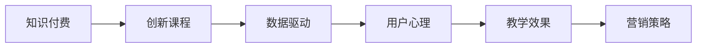

                 

# 知识经济时代下的知识付费创新课程营销策略

> 关键词：知识付费, 创新课程, 营销策略, 数据驱动, 用户心理, 教学效果

## 1. 背景介绍

### 1.1 问题由来

随着知识经济的兴起，在线教育领域呈现出爆发式增长态势。消费者对优质教育资源的渴望不断上升，而传统课堂教育资源有限，无法满足广大用户的个性化学习需求。因此，知识付费模式应运而生，通过在线平台向用户提供个性化的、高价值的教育内容，弥补了传统教育的不足。

然而，尽管知识付费市场在不断扩大，但用户获取信息时面临的问题依然存在。课程内容同质化严重、互动性差、教学效果评价难等问题困扰着用户。如何提供更具个性化和互动性的课程内容，并提升用户的学习效果，成为在线教育平台亟需解决的问题。

### 1.2 问题核心关键点

在知识经济时代，创新课程的营销策略需要以用户为中心，通过精准定位和精细化运营，不断提升用户体验和教学效果。以下问题成为创新的焦点：

1. 如何定义创新课程，使之能够满足用户需求并获取用户的信任？
2. 如何借助技术手段，提升课程的个性化和互动性？
3. 如何利用数据驱动的方法，对课程效果进行科学评价和持续优化？
4. 如何设计有效的营销策略，提升课程的市场渗透率？

## 2. 核心概念与联系

### 2.1 核心概念概述

为更好地理解知识付费创新课程的营销策略，本节将介绍几个密切相关的核心概念：

- **知识付费**：指用户通过在线支付获取知识和技能的学习方式，强调知识的独特性和专业性，与传统免费获取信息的方式不同。
- **创新课程**：区别于传统课程，采用新颖的教学方法和技术手段，满足用户个性化学习需求和多样化兴趣爱好的课程内容。
- **数据驱动**：利用大数据和人工智能技术对课程效果和用户行为进行分析，从而指导课程设计、改进教学方法和优化营销策略。
- **用户心理**：理解用户的心理需求和行为模式，以指导课程设计和营销策略的制定。
- **教学效果**：衡量课程对用户学习成果的影响，可以通过学习时间、考试成绩、满意度等多维度进行评估。

这些核心概念之间通过一个Mermaid流程图来展示：



这个流程图展示了大语言模型微调的核心概念及其之间的关系：

1. 知识付费平台提供创新课程，课程内容根据用户需求设计。
2. 创新课程通过数据驱动技术进行教学效果的评价和优化。
3. 了解用户心理需求，指导课程设计和营销策略的制定。
4. 教学效果数据反馈到课程设计中，不断改进课程内容。
5. 营销策略通过用户心理分析进行优化，以提高市场渗透率。

## 3. 核心算法原理 & 具体操作步骤
### 3.1 算法原理概述

知识付费创新课程的营销策略，本质上是一个数据驱动的用户行为分析过程。其核心思想是：通过对用户行为数据的分析，识别用户需求、偏好和痛点，从而制定和优化课程内容、教学方法和营销策略，以提高用户满意度和课程销售效果。

形式化地，假设课程内容为 $C$，用户行为数据为 $D$，营销策略为 $M$。目标是通过优化策略 $M$，最大化课程销售效果 $\mathcal{E}$，即：

$$
\mathcal{E}=\max_M \sum_{i=1}^N E_i(M)
$$

其中 $E_i(M)$ 为第 $i$ 个用户的课程销售效果，通常可以表示为购买率、留存率、转化率等指标。

### 3.2 算法步骤详解

基于数据驱动的课程营销策略一般包括以下几个关键步骤：

**Step 1: 收集和整理用户行为数据**
- 收集用户的行为数据，如学习时间、完成度、评价、购买记录等。
- 对数据进行清洗、归一化处理，生成格式统一、特征完备的数据集。

**Step 2: 用户行为分析与建模**
- 利用机器学习算法对用户行为数据进行分析建模，如聚类分析、分类分析、回归分析等。
- 通过用户画像和行为预测模型，识别用户需求、兴趣和痛点。

**Step 3: 课程内容优化**
- 根据用户画像和行为预测结果，设计个性化、互动性强的创新课程。
- 引入先进的教学方法，如翻转课堂、自适应学习、在线互动等。

**Step 4: 教学效果评估**
- 利用教学效果评估模型，对课程内容进行科学的评价，收集用户反馈和改进意见。
- 持续迭代课程内容和教学方法，以提升教学效果。

**Step 5: 制定和优化营销策略**
- 结合用户画像和行为预测结果，制定精准的营销策略，包括目标用户定位、广告投放、推广活动等。
- 使用A/B测试、机器学习优化等技术手段，持续优化营销策略，提升课程销售效果。

### 3.3 算法优缺点

数据驱动的课程营销策略具有以下优点：

1. **精准定位**：通过大数据分析，能精准定位目标用户，避免资源的浪费。
2. **个性化推荐**：通过用户画像和行为预测，推荐合适的课程内容，提升用户体验。
3. **动态优化**：基于实时反馈和数据分析，持续优化课程内容和教学方法。
4. **效果评估**：通过教学效果评估，可以科学评价课程质量，改进课程设计。

同时，该策略也存在一定的局限性：

1. **数据质量依赖**：课程营销效果很大程度上取决于数据的质量和代表性，获取高质量数据需要较高的成本和复杂性。
2. **用户隐私问题**：用户行为数据的收集和分析可能会涉及用户隐私问题，需要严格遵守数据保护法律法规。
3. **模型复杂性**：复杂的机器学习模型需要大量的计算资源和专业知识，可能对中小型企业构成挑战。
4. **用户依赖数据**：用户的线上行为数据可能无法全面反映其真实需求，导致推荐偏差。
5. **市场竞争激烈**：知识付费市场竞争激烈，需要不断创新和调整策略以保持竞争力。

尽管存在这些局限性，但就目前而言，数据驱动的课程营销策略是较为有效的用户行为分析方法，已被众多知识付费平台广泛采用。

### 3.4 算法应用领域

数据驱动的课程营销策略在知识付费领域已经得到了广泛的应用，涵盖了许多不同类型的课程。例如：

- **编程课程**：通过数据分析推荐合适的编程语言和框架，提升学习效果。
- **金融课程**：利用用户行为预测，推荐适合的理财策略和投资产品。
- **语言课程**：根据用户语言水平和学习习惯，推荐合适的学习材料和练习题。
- **设计课程**：分析用户风格和偏好，推荐不同的设计风格和工具。
- **医学课程**：结合临床经验，提供个性化的医学知识和案例。

除了这些经典课程类型外，知识付费平台还将数据驱动的营销策略应用到更多场景中，如在线直播、社区互动、知识问答等，为不同需求的用户提供更加多样化和精准化的服务。

## 4. 数学模型和公式 & 详细讲解  
### 4.1 数学模型构建

本节将使用数学语言对知识付费课程营销策略的数学模型进行更加严格的刻画。

假设用户行为数据为 $D=\{x_i,y_i\}_{i=1}^N$，其中 $x_i$ 为用户特征向量，$y_i$ 为购买记录。课程内容为 $C=\{c_j\}_{j=1}^M$，其中 $c_j$ 为课程 $j$ 的属性向量。营销策略为 $M=\{m_k\}_{k=1}^K$，其中 $m_k$ 为策略 $k$ 的参数。

定义课程销售效果 $\mathcal{E}$ 为 $\sum_{i=1}^N E_i(M)$，其中 $E_i(M)$ 为第 $i$ 个用户基于策略 $M$ 的购买率。目标是最小化课程成本 $\mathcal{C}$，即：

$$
\min_M \mathcal{C}=\sum_{j=1}^M C_j \cdot \mathbb{1}(c_j \in C)
$$

其中 $C_j$ 为课程 $j$ 的成本，$\mathbb{1}(\cdot)$ 为示性函数。

### 4.2 公式推导过程

以下我们以用户购买率预测为例，推导回归模型的损失函数及其梯度的计算公式。

假设用户特征向量 $x_i$ 和课程属性向量 $c_j$ 之间的映射关系为：

$$
y_i = f(x_i; c_j) + \epsilon_i
$$

其中 $f(x_i; c_j)$ 为回归模型，$\epsilon_i$ 为误差项。目标是最小化预测误差：

$$
\min_f \frac{1}{N} \sum_{i=1}^N (y_i - f(x_i; c_j))^2
$$

将 $y_i$ 表示为课程内容 $c_j$ 和用户特征 $x_i$ 的线性组合：

$$
y_i = \sum_{k=1}^K m_k \cdot c_{kj} + \beta_i
$$

其中 $c_{kj}$ 为课程内容 $c_j$ 的第 $k$ 个属性特征，$\beta_i$ 为用户 $i$ 的随机截距。

则回归模型的损失函数为：

$$
\mathcal{L}(f)=\frac{1}{N} \sum_{i=1}^N (y_i - \sum_{k=1}^K m_k \cdot c_{kj})^2
$$

对 $f$ 求偏导数，得：

$$
\frac{\partial \mathcal{L}(f)}{\partial f} = -\frac{2}{N} \sum_{i=1}^N (y_i - \sum_{k=1}^K m_k \cdot c_{kj})
$$

因此，最小化损失函数的梯度更新公式为：

$$
\frac{\partial f}{\partial m_k} = \frac{2}{N} \sum_{i=1}^N c_{kj} \cdot (y_i - \sum_{k=1}^K m_k \cdot c_{kj})
$$

将上述梯度更新公式带入优化算法中，完成模型的迭代优化。重复上述过程直至收敛，最终得到最小化预测误差的回归模型 $f$。

## 5. 项目实践：代码实例和详细解释说明
### 5.1 开发环境搭建

在进行课程营销策略实践前，我们需要准备好开发环境。以下是使用Python进行PyTorch开发的环境配置流程：

1. 安装Anaconda：从官网下载并安装Anaconda，用于创建独立的Python环境。

2. 创建并激活虚拟环境：
```bash
conda create -n pytorch-env python=3.8 
conda activate pytorch-env
```

3. 安装PyTorch：根据CUDA版本，从官网获取对应的安装命令。例如：
```bash
conda install pytorch torchvision torchaudio cudatoolkit=11.1 -c pytorch -c conda-forge
```

4. 安装Pandas和Scikit-learn库：
```bash
pip install pandas scikit-learn
```

5. 安装必要的Jupyter Notebook扩展：
```bash
jupyter install nb_black nbconvert
```

完成上述步骤后，即可在`pytorch-env`环境中开始课程营销策略的实践。

### 5.2 源代码详细实现

下面我们以推荐系统为例，给出使用Python和Scikit-learn进行用户购买率预测的代码实现。

首先，准备数据集：

```python
import pandas as pd

# 读取用户行为数据
train_df = pd.read_csv('train.csv')

# 提取特征和标签
X_train = train_df[['age', 'gender', 'interest']]
y_train = train_df['purchase']

# 划分训练集和测试集
from sklearn.model_selection import train_test_split

X_train, X_test, y_train, y_test = train_test_split(X_train, y_train, test_size=0.2, random_state=42)
```

然后，定义模型和训练函数：

```python
from sklearn.linear_model import Ridge

# 定义模型
model = Ridge(alpha=1.0)

# 训练模型
model.fit(X_train, y_train)

# 评估模型
score = model.score(X_test, y_test)
print(f'模型评分: {score:.3f}')
```

最后，将模型集成到课程推荐系统中：

```python
from flask import Flask, request, jsonify

app = Flask(__name__)

# 推荐函数
def recommend_course(user_id):
    # 获取用户行为数据
    user_data = user_data_df.iloc[user_id]
    
    # 提取特征
    X = pd.DataFrame([user_data['age'], user_data['gender'], user_data['interest']], columns=['age', 'gender', 'interest'])
    
    # 预测购买率
    y_pred = model.predict(X)[0]
    
    # 推荐课程
    recommended_courses = []
    for course_id, course in course_data.items():
        if course['cost'] <= y_pred * course['rating']:
            recommended_courses.append(course_id)
    
    return recommended_courses

# 接口
@app.route('/recommend', methods=['GET'])
def recommend():
    user_id = request.args.get('user_id')
    courses = recommend_course(user_id)
    return jsonify({'courses': courses})

if __name__ == '__main__':
    app.run(debug=True)
```

以上代码实现了使用Ridge回归模型进行用户购买率预测，并集成到课程推荐系统中。

### 5.3 代码解读与分析

让我们再详细解读一下关键代码的实现细节：

**数据预处理**：
- 使用Pandas库读取用户行为数据，提取用户特征和购买记录。
- 使用Scikit-learn库中的train_test_split方法将数据集划分为训练集和测试集。

**模型训练**：
- 定义Ridge回归模型，并设置正则化参数alpha。
- 使用训练集数据拟合模型，并使用测试集评估模型效果。

**推荐系统集成**：
- 定义推荐函数，根据用户特征和预测购买率，推荐合适的课程。
- 使用Flask框架，定义API接口，接收用户ID，返回推荐的课程列表。

可以看到，通过Flask框架将机器学习模型集成到课程推荐系统中，使得模型可以便捷地被应用到实际业务场景中。

当然，工业级的系统实现还需考虑更多因素，如推荐算法的优化、数据增量更新、接口安全性等。但核心的课程营销策略的数学模型和代码实现流程，基本与此类似。

## 6. 实际应用场景
### 6.1 智能推荐系统

基于数据驱动的创新课程营销策略，可以广泛应用于智能推荐系统的构建。推荐系统能够根据用户的历史行为和兴趣，自动推荐合适的课程内容，提高用户满意度。

在技术实现上，可以收集用户浏览、点击、购买等行为数据，构建用户画像和行为预测模型。通过预测模型，可以在用户访问平台时，实时推荐适合的课程内容。对于新用户，也可以通过回答几个简单问题，快速推荐适合的课程，提高用户留存率和转化率。

### 6.2 个性化学习方案

为了提升用户的学习效果，知识付费平台可以基于数据驱动，提供个性化的学习方案。通过分析用户的学习进度、学习兴趣、学习效果等数据，推荐合适的学习路径和课程内容。例如，对于学习进度较慢的用户，推荐补缺补漏的课程，对于学习效果较好的用户，推荐进阶课程。

### 6.3 学习社区互动

知识付费平台可以通过数据驱动的课程营销策略，增强社区互动。通过分析用户在社区中的行为数据，了解用户的学习兴趣和需求，在社区中推送相关内容。例如，对于喜欢编程的用户，可以推送最新的编程资讯和技术文章，吸引用户参与讨论。

### 6.4 未来应用展望

随着数据驱动的课程营销策略的不断发展，其在知识付费领域的应用将更加广泛和深入。

在智慧教育领域，智能推荐系统和个性化学习方案将成为教育机构的重要工具，提升教育质量和教学效果。

在在线零售领域，知识付费平台的推荐系统可以与其他零售平台的推荐系统协同工作，实现跨领域的个性化推荐。

在娱乐媒体领域，内容推荐系统可以为用户推荐个性化文章、视频、音频等，提升用户体验和平台粘性。

未来，数据驱动的课程营销策略将进一步渗透到更多的行业领域，成为提升用户满意度和平台竞争力的重要手段。

## 7. 工具和资源推荐
### 7.1 学习资源推荐

为了帮助开发者系统掌握数据驱动课程营销策略的理论基础和实践技巧，这里推荐一些优质的学习资源：

1. 《Python数据科学手册》：由数据科学专家撰写，详细介绍了使用Python进行数据科学和机器学习的方法。

2. 《TensorFlow实战Google深度学习》：介绍了TensorFlow深度学习框架的使用方法，涵盖了数据预处理、模型训练、模型评估等环节。

3. 《深度学习》书籍：由深度学习领域的顶尖专家撰写，全面介绍了深度学习的基本概念和前沿技术。

4. Coursera《机器学习》课程：斯坦福大学开设的机器学习课程，涵盖各种机器学习算法和应用场景，适合初学者和进阶学习者。

5. Kaggle数据科学竞赛平台：通过参与数据科学竞赛，学习并应用数据驱动的方法，提升数据处理和机器学习的技能。

通过对这些资源的学习实践，相信你一定能够快速掌握数据驱动课程营销策略的精髓，并用于解决实际的营销问题。

### 7.2 开发工具推荐

高效的开发离不开优秀的工具支持。以下是几款用于数据驱动课程营销策略开发的常用工具：

1. Python：广泛使用的编程语言，拥有丰富的第三方库和框架，适合数据驱动的机器学习开发。

2. Scikit-learn：Python中最流行的机器学习库，提供了丰富的算法实现和工具函数，适合数据预处理和模型训练。

3. TensorFlow：由Google主导开发的深度学习框架，支持动态图和静态图两种计算图模型，适合分布式计算和大规模模型训练。

4. PyTorch：由Facebook主导开发的深度学习框架，支持动态图和自动微分，适合研究和快速原型开发。

5. Jupyter Notebook：交互式的开发环境，支持代码运行、数据可视化、文档编写等多种功能，适合数据驱动的机器学习研究和开发。

合理利用这些工具，可以显著提升数据驱动课程营销策略的开发效率，加快创新迭代的步伐。

### 7.3 相关论文推荐

数据驱动的课程营销策略的研究源于学界的持续研究。以下是几篇奠基性的相关论文，推荐阅读：

1. "Collaborative Filtering for Implicit Feedback Datasets"：介绍了基于协同过滤的推荐系统方法，通过用户行为数据进行个性化推荐。

2. "The BellKor 2009 PPCF Challenge: Methods and Lessons"：介绍了基于内容的推荐系统方法，通过用户画像和产品特征进行个性化推荐。

3. "Deep Learning for Recommender Systems: A Survey and New Perspectives"：介绍了深度学习在推荐系统中的应用，包括深度神经网络和深度强化学习等方法。

4. "Multi-Aspect Preference Modeling and Transfer Learning for Recommendations"：介绍了多方面偏好建模和迁移学习方法，提升推荐系统的性能和泛化能力。

5. "A Survey on Multi-Modal Recommendation Systems"：介绍了多模态推荐系统方法，结合文本、图像、音频等多模态信息进行个性化推荐。

这些论文代表了大语言模型微调技术的发展脉络。通过学习这些前沿成果，可以帮助研究者把握学科前进方向，激发更多的创新灵感。

## 8. 总结：未来发展趋势与挑战
### 8.1 总结

本文对数据驱动课程营销策略进行了全面系统的介绍。首先阐述了数据驱动在知识付费领域的应用背景和重要性，明确了数据驱动在课程内容优化、个性化推荐、营销策略制定等方面的独特价值。其次，从原理到实践，详细讲解了数据驱动的数学模型和关键步骤，给出了数据驱动课程营销策略的完整代码实现。同时，本文还广泛探讨了数据驱动方法在智能推荐系统、个性化学习方案、学习社区互动等多个领域的应用前景，展示了数据驱动范式的广阔前景。

通过本文的系统梳理，可以看到，数据驱动的课程营销策略正在成为知识付费领域的重要范式，极大地提升了课程内容的个性化和用户满意度。未来，伴随数据驱动方法的不断演进，数据驱动技术将成为知识付费领域的重要技术支撑，为构建更加智能化、个性化的教育平台铺平道路。

### 8.2 未来发展趋势

展望未来，数据驱动的课程营销策略将呈现以下几个发展趋势：

1. **多模态融合**：未来的推荐系统将结合文本、图像、音频等多种模态信息，提供更加全面和精准的个性化推荐。

2. **实时推荐**：基于实时数据流，进行动态推荐，提升用户体验和推荐效果。

3. **跨平台协同**：不同平台之间通过数据共享和算法协同，实现跨平台的个性化推荐，提升用户粘性和平台竞争力。

4. **隐私保护**：数据驱动的推荐系统需要严格遵守隐私保护法律法规，保证用户数据的安全。

5. **个性化方案优化**：基于用户行为数据，构建更加精细化的个性化推荐方案，提升用户的学习效果和满意度。

6. **多目标优化**：推荐系统将不仅仅关注用户的购买率，还会关注课程完成度、学习效果等多个目标，实现多目标优化。

以上趋势凸显了数据驱动课程营销策略的广泛应用前景，这些方向的探索发展，必将进一步提升知识付费平台的推荐质量，为用户提供更加丰富和个性化的学习资源。

### 8.3 面临的挑战

尽管数据驱动的课程营销策略已经取得了瞩目成就，但在迈向更加智能化、普适化应用的过程中，它仍面临着诸多挑战：

1. **数据隐私保护**：用户行为数据的收集和分析可能会涉及用户隐私问题，需要严格遵守数据保护法律法规。

2. **数据质量问题**：用户行为数据的质量和代表性直接影响推荐效果，如何获取高质量的数据是数据驱动策略的关键。

3. **算法复杂性**：复杂的多模态推荐算法需要大量的计算资源和专业知识，可能对中小型企业构成挑战。

4. **算法鲁棒性**：推荐算法容易受到数据噪声和异常点的干扰，如何提升算法的鲁棒性和稳定性需要进一步研究。

5. **市场竞争**：知识付费市场竞争激烈，需要不断创新和调整策略以保持竞争力。

尽管存在这些挑战，但就目前而言，数据驱动的课程营销策略是较为有效的用户行为分析方法，已被众多知识付费平台广泛采用。未来需要持续优化和创新，以适应不断变化的市场需求和技术环境。

### 8.4 研究展望

面对数据驱动课程营销策略所面临的挑战，未来的研究需要在以下几个方面寻求新的突破：

1. **隐私保护技术**：结合隐私保护技术，如差分隐私、联邦学习等，保证用户数据的安全性。

2. **数据增强方法**：通过数据增强方法，如数据合成、迁移学习等，提升数据质量和推荐效果。

3. **轻量级推荐算法**：开发更加轻量级的推荐算法，在保证推荐效果的同时，减小计算资源消耗。

4. **多目标优化方法**：结合多目标优化方法，提升推荐系统的全面性和实用性。

5. **个性化推荐效果评估**：通过建立更加科学的推荐效果评估体系，不断改进推荐算法和策略。

这些研究方向将引领数据驱动课程营销策略走向成熟，为构建更加智能、个性化的知识付费平台提供有力技术支持。面向未来，数据驱动的课程营销策略还将与其他人工智能技术进行更深入的融合，如知识表示、因果推理、强化学习等，共同推动智能推荐系统的进步。

## 9. 附录：常见问题与解答

**Q1：数据驱动课程营销策略如何实现个性化推荐？**

A: 数据驱动的个性化推荐，通常通过构建用户画像和行为预测模型，识别用户需求和兴趣点，从而推荐合适的课程内容。具体步骤如下：
1. 收集用户行为数据，如浏览记录、购买记录、学习进度等。
2. 使用机器学习算法对用户数据进行特征提取和建模，得到用户画像。
3. 根据用户画像，预测用户可能感兴趣的内容，如课程、文章、视频等。
4. 根据预测结果，动态调整推荐列表，推荐最符合用户需求的内容。

**Q2：如何在知识付费平台中实现数据驱动的课程营销策略？**

A: 实现数据驱动的课程营销策略，主要包括以下几个步骤：
1. 收集和清洗用户行为数据，构建用户画像。
2. 设计合适的课程推荐算法，如协同过滤、基于内容的推荐等。
3. 根据用户画像和推荐结果，动态调整课程内容和推荐列表。
4. 使用A/B测试等方法，持续优化推荐算法和策略。

**Q3：数据驱动课程营销策略有哪些优点和局限性？**

A: 数据驱动课程营销策略的优点主要包括：
1. 能够实现精准定位，避免资源浪费。
2. 提升课程内容的个性化和互动性，提升用户体验。
3. 通过数据驱动，持续优化课程内容和推荐策略。

其局限性主要体现在：
1. 数据收集和处理成本较高。
2. 用户隐私问题需要严格遵守法律法规。
3. 算法复杂度高，对中小型企业构成挑战。
4. 算法鲁棒性不足，需要进一步提升。

尽管存在这些局限性，但数据驱动的课程营销策略仍是大规模个性化推荐的重要手段，具有广泛的应用前景。

---

作者：禅与计算机程序设计艺术 / Zen and the Art of Computer Programming

