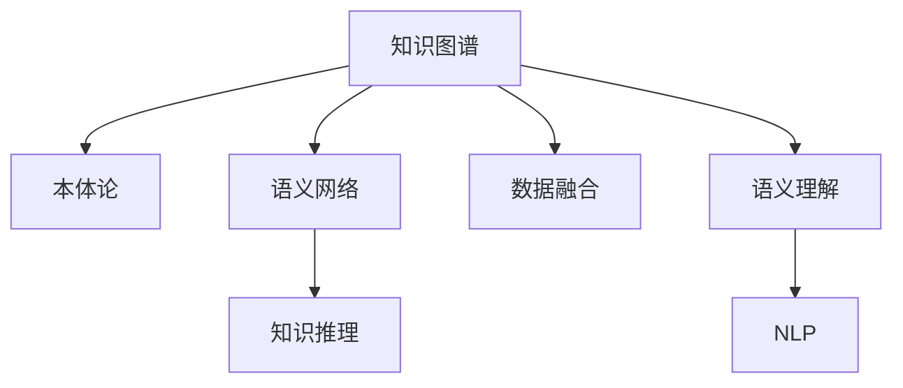

                 

# 知识融合：跨领域的智慧碰撞

> 关键词：知识图谱,语义网络,语义理解,数据融合,自然语言处理,NLP

## 1. 背景介绍

### 1.1 问题由来
随着信息技术的迅猛发展，人类社会的知识和信息量急剧增长，各种形式的文本、图像、视频、音频等数据无处不在。这些数据背后蕴含着丰富的知识，通过数据挖掘和分析，可以有效辅助决策，推动科学进步和社会发展。

然而，知识来源分散、格式多样、语言异构，各种知识片段难以有效整合和融合。为此，研究者们提出了知识图谱的概念，旨在构建一个全球知识共享的互联网，将来自不同领域的知识整合在一起，形成一张相互关联的语义网络，以便于快速检索、分析和应用。

知识图谱的研究与实践涉及计算机科学、数学、统计学、语言学等多个学科，是目前跨学科研究的热点方向。知识图谱的构建与应用对于推动智能系统的发展，具有重要的意义。

### 1.2 问题核心关键点
知识图谱的核心概念包括以下几点：

1. 本体论(ontology)：定义了知识图谱中的实体(如人、地点、组织、时间、事件等)和属性(如实体之间的关系、属性值等)。

2. 语义网络(semantic network)：利用图形结构描述实体之间的关系，形成语义网络。

3. 知识推理(knowledge reasoning)：利用图谱中的知识进行推理，发现新的关系和知识。

4. 数据融合(data integration)：将来自不同数据源的知识进行融合，消除数据冗余和冲突。

5. 语义理解(semantic understanding)：理解图谱中的语义，自动提取和关联实体与属性。

6. 自然语言处理(NLP)：利用NLP技术解析文本数据，提取语义信息。

这些核心概念之间通过相互作用，形成了一个复杂的知识图谱生态系统。通过融合不同领域的知识，构建出具有广泛覆盖范围的语义网络，将为智能系统的构建提供坚实的知识基础。

### 1.3 问题研究意义
研究知识图谱的融合与应用，具有以下重要意义：

1. 促进知识共享与交流。构建知识图谱，将来自不同领域和机构的知识汇聚一起，方便全球科研人员共享和学习，促进科学研究和技术进步。

2. 提高智能系统的效率和准确性。将知识图谱作为智能系统的知识库，可以提高系统对知识的理解和推理能力，提升决策的效率和准确性。

3. 辅助科学研究与发现。通过知识图谱，科研人员可以方便地查询和浏览相关领域的知识，发现新的研究方向和成果。

4. 推动智慧城市、智慧医疗、智能制造等应用领域的发展。知识图谱的应用，将为各行业提供更加智能、高效的服务，带来全新的应用场景。

5. 支撑科技教育和人工智能研究。知识图谱的研究，为科技教育提供了新的知识形式和教育手段，也为人工智能的研发提供了新的工具和方法。

## 2. 核心概念与联系

### 2.1 核心概念概述

为更好地理解知识图谱的融合方法，本节将介绍几个密切相关的核心概念：

- 知识图谱(Knowledge Graph)：通过图形结构表示实体及其关系的语义网络。
- 本体论(Ontology)：定义实体和属性的概念框架。
- 语义网络(Semantic Network)：实体及其关系的图形表示。
- 知识推理(Knowledge Reasoning)：通过图谱中的知识进行逻辑推理。
- 数据融合(Data Integration)：将不同来源的数据进行整合，消除冗余和冲突。
- 语义理解(Semantic Understanding)：理解图谱中的语义信息。
- 自然语言处理(Natural Language Processing, NLP)：解析文本数据，提取语义信息。

这些核心概念之间的逻辑关系可以通过以下Mermaid流程图来展示：



这个流程图展示了知识图谱及其相关概念之间的相互作用：

1. 知识图谱由本体论定义的实体和属性组成。
2. 实体及其关系构成语义网络，语义网络是知识图谱的核心结构。
3. 知识推理利用语义网络中的知识进行逻辑推导。
4. 数据融合将来自不同数据源的知识整合在一起。
5. 语义理解通过解析图谱中的语义，进行自动关联和提取。
6. NLP技术解析文本数据，提取语义信息。

这些概念共同构成了知识图谱的研究与应用框架，使我们能够构建和应用跨领域的知识图谱。

## 3. 核心算法原理 & 具体操作步骤
### 3.1 算法原理概述

知识图谱的构建和融合，本质上是一个跨领域数据整合和语义理解的过程。其核心思想是：通过定义不同领域的本体论，构建语义网络，将不同领域的数据进行融合，利用图谱中的知识进行推理和理解，从而形成全局一致的知识库。

形式化地，假设不同领域的知识图谱分别为 $G_1, G_2, \ldots, G_n$，其本体论为 $O_1, O_2, \ldots, O_n$，语义网络分别为 $S_1, S_2, \ldots, S_n$。融合后的知识图谱 $G_f$ 的定义如下：

1. 定义本体论 $O_f$：通过本体对齐将不同领域本体对齐，形成统一的语义框架 $O_f$。
2. 构建语义网络 $S_f$：将不同领域的语义网络 $S_1, S_2, \ldots, S_n$ 进行融合，形成统一的语义网络 $S_f$。
3. 数据融合 $D_f$：将不同领域的数据进行融合，消除冗余和冲突，形成全局一致的数据集 $D_f$。
4. 知识推理 $R_f$：利用 $S_f$ 中的知识进行推理，发现新的关系和知识，形成推理规则 $R_f$。
5. 语义理解 $U_f$：解析 $S_f$ 中的语义，提取和关联实体与属性，形成语义理解 $U_f$。

通过上述步骤，构建出的知识图谱 $G_f$ 可以用于智能系统的决策支持和知识检索。

### 3.2 算法步骤详解

知识图谱的构建和融合步骤如下：

**Step 1: 定义本体论**
- 定义各个领域的本体论，即实体和属性的概念框架。
- 将本体论对齐，消除歧义，形成统一的语义框架。

**Step 2: 构建语义网络**
- 利用图谱中的知识构建实体及其关系的图形表示。
- 利用语义网络进行知识推理，发现新的关系和知识。

**Step 3: 数据融合**
- 将不同领域的数据进行融合，消除冗余和冲突。
- 利用融合后的数据进行语义理解，提取实体和属性信息。

**Step 4: 知识推理**
- 利用图谱中的知识进行推理，发现新的关系和知识。
- 利用推理规则进行自动推理，扩展图谱的知识库。

**Step 5: 语义理解**
- 解析图谱中的语义，进行自动关联和提取。
- 利用NLP技术解析文本数据，提取语义信息，形成语义理解。

### 3.3 算法优缺点

知识图谱的构建和融合方法具有以下优点：
1. 提高了数据的全面性和一致性。通过数据融合，将不同来源的知识整合在一起，消除数据冗余和冲突，形成全局一致的知识库。
2. 增强了知识的推理和理解能力。利用图谱中的知识进行推理，可以发现新的关系和知识，提高系统的智能水平。
3. 推动了跨领域知识的融合与应用。通过构建统一的知识图谱，促进了不同领域之间的知识共享和交流。
4. 支持了智能系统的决策支持。知识图谱为智能系统的决策提供了坚实的知识基础，提升系统的决策效率和准确性。

同时，该方法也存在一些局限性：
1. 本体对齐困难。不同领域本体定义不同，对齐需要大量的手动工作，耗时耗力。
2. 数据融合复杂。不同数据源的数据格式和结构不同，融合需要解决大量数据冗余和冲突问题。
3. 推理规则不足。推理规则的构建需要领域专家的深度参与，难以覆盖所有领域和应用场景。
4. 语义理解困难。语义理解需要强大的NLP技术支持，对数据的解析和理解难度较大。
5. 系统复杂度高。构建知识图谱需要处理大量的数据和知识，系统复杂度较高。

尽管存在这些局限性，但知识图谱融合范式仍然是大数据时代知识共享和智能系统构建的重要手段。未来相关研究的重点在于如何进一步提升数据融合效率，简化本体对齐过程，增强推理规则的自动生成能力，以及降低系统的复杂度。

### 3.4 算法应用领域

知识图谱的构建和融合方法在多个领域都有广泛的应用，例如：

- 智慧医疗：将患者病历、药品信息、临床试验等数据进行融合，构建医疗知识图谱，辅助医生进行诊断和治疗。
- 智慧城市：将交通、环境、公共安全等数据进行融合，构建城市知识图谱，支持城市管理和智能决策。
- 智能制造：将设备数据、工艺信息、产品设计等数据进行融合，构建制造知识图谱，优化生产流程和提高产品质量。
- 金融服务：将市场数据、财务信息、客户行为等数据进行融合，构建金融知识图谱，支持投资分析和风险控制。
- 教育培训：将课程内容、学生表现、教学资源等数据进行融合，构建教育知识图谱，辅助教学和个性化学习。
- 农业管理：将土壤、气候、农艺数据等进行融合，构建农业知识图谱，支持精准农业和高效管理。

除了上述这些经典应用外，知识图谱融合技术还被创新性地应用于更多领域中，如智能交通、社会治理、环保监测等，为各行各业带来了新的技术突破和应用场景。

## 4. 数学模型和公式 & 详细讲解 & 举例说明

### 4.1 数学模型构建

假设不同领域的知识图谱分别为 $G_1, G_2, \ldots, G_n$，其本体论为 $O_1, O_2, \ldots, O_n$，语义网络分别为 $S_1, S_2, \ldots, S_n$。融合后的知识图谱 $G_f$ 可以表示为：

1. 本体论 $O_f$：
   $$
   O_f = \bigcup_{i=1}^n O_i
   $$

2. 语义网络 $S_f$：
   $$
   S_f = \bigcup_{i=1}^n S_i
   $$

3. 数据融合 $D_f$：
   $$
   D_f = \bigcup_{i=1}^n D_i
   $$

4. 知识推理 $R_f$：
   $$
   R_f = \bigcup_{i=1}^n R_i
   $$

5. 语义理解 $U_f$：
   $$
   U_f = \bigcup_{i=1}^n U_i
   $$

### 4.2 公式推导过程

本体对齐的公式推导过程如下：

设本体 $O_i$ 中的实体为 $e_{i1}, e_{i2}, \ldots, e_{in}$，属性为 $a_{i1}, a_{i2}, \ldots, a_{im}$，则：

1. 对齐实体 $e_{i1}, e_{i2}, \ldots, e_{in}$：
   $$
   e_{fi} = f(e_{i1}, e_{i2}, \ldots, e_{in})
   $$

2. 对齐属性 $a_{i1}, a_{i2}, \ldots, a_{im}$：
   $$
   a_{fi} = f(a_{i1}, a_{i2}, \ldots, a_{im})
   $$

其中，$f$ 为对齐函数。

### 4.3 案例分析与讲解

以智慧医疗知识图谱为例，其构建步骤如下：

**Step 1: 定义本体论**
- 定义医疗本体论，包含疾病、症状、药品、医疗设备、临床试验等实体和属性。
- 将本体论对齐，消除歧义，形成统一的语义框架。

**Step 2: 构建语义网络**
- 利用医疗知识图谱，构建实体及其关系的图形表示。
- 利用语义网络进行知识推理，发现新的关系和知识。

**Step 3: 数据融合**
- 将患者的病历、药品信息、临床试验等数据进行融合，消除冗余和冲突。
- 利用融合后的数据进行语义理解，提取实体和属性信息。

**Step 4: 知识推理**
- 利用医疗知识图谱中的知识进行推理，发现新的关系和知识。
- 利用推理规则进行自动推理，扩展图谱的知识库。

**Step 5: 语义理解**
- 解析医疗知识图谱中的语义，进行自动关联和提取。
- 利用NLP技术解析医生的医嘱、病历、论文等文本数据，提取语义信息。

通过构建智慧医疗知识图谱，可以为医疗决策提供全面的知识支持，辅助医生进行诊断和治疗，提升医疗服务质量。

## 5. 项目实践：代码实例和详细解释说明
### 5.1 开发环境搭建

在进行知识图谱构建和融合的实践前，我们需要准备好开发环境。以下是使用Python进行PyTorch开发的环境配置流程：

1. 安装Anaconda：从官网下载并安装Anaconda，用于创建独立的Python环境。

2. 创建并激活虚拟环境：
```bash
conda create -n pytorch-env python=3.8 
conda activate pytorch-env
```

3. 安装PyTorch：根据CUDA版本，从官网获取对应的安装命令。例如：
```bash
conda install pytorch torchvision torchaudio cudatoolkit=11.1 -c pytorch -c conda-forge
```

4. 安装各类工具包：
```bash
pip install numpy pandas scikit-learn matplotlib tqdm jupyter notebook ipython
```

完成上述步骤后，即可在`pytorch-env`环境中开始项目实践。

### 5.2 源代码详细实现

这里我们以构建智慧医疗知识图谱为例，给出使用PyTorch进行数据融合和语义理解的PyTorch代码实现。

首先，定义数据处理函数：

```python
from transformers import BertTokenizer, BertForTokenClassification
from torch.utils.data import Dataset
import torch

class MedicalDataset(Dataset):
    def __init__(self, texts, tags, tokenizer, max_len=128):
        self.texts = texts
        self.tags = tags
        self.tokenizer = tokenizer
        self.max_len = max_len
        
    def __len__(self):
        return len(self.texts)
    
    def __getitem__(self, item):
        text = self.texts[item]
        tags = self.tags[item]
        
        encoding = self.tokenizer(text, return_tensors='pt', max_length=self.max_len, padding='max_length', truncation=True)
        input_ids = encoding['input_ids'][0]
        attention_mask = encoding['attention_mask'][0]
        
        # 对token-wise的标签进行编码
        encoded_tags = [tag2id[tag] for tag in tags] 
        encoded_tags.extend([tag2id['O']] * (self.max_len - len(encoded_tags)))
        labels = torch.tensor(encoded_tags, dtype=torch.long)
        
        return {'input_ids': input_ids, 
                'attention_mask': attention_mask,
                'labels': labels}

# 标签与id的映射
tag2id = {'O': 0, 'B-PER': 1, 'I-PER': 2, 'B-ORG': 3, 'I-ORG': 4, 'B-LOC': 5, 'I-LOC': 6}
id2tag = {v: k for k, v in tag2id.items()}

# 创建dataset
tokenizer = BertTokenizer.from_pretrained('bert-base-cased')

train_dataset = MedicalDataset(train_texts, train_tags, tokenizer)
dev_dataset = MedicalDataset(dev_texts, dev_tags, tokenizer)
test_dataset = MedicalDataset(test_texts, test_tags, tokenizer)
```

然后，定义模型和优化器：

```python
from transformers import BertForTokenClassification, AdamW

model = BertForTokenClassification.from_pretrained('bert-base-cased', num_labels=len(tag2id))

optimizer = AdamW(model.parameters(), lr=2e-5)
```

接着，定义训练和评估函数：

```python
from torch.utils.data import DataLoader
from tqdm import tqdm
from sklearn.metrics import classification_report

device = torch.device('cuda') if torch.cuda.is_available() else torch.device('cpu')
model.to(device)

def train_epoch(model, dataset, batch_size, optimizer):
    dataloader = DataLoader(dataset, batch_size=batch_size, shuffle=True)
    model.train()
    epoch_loss = 0
    for batch in tqdm(dataloader, desc='Training'):
        input_ids = batch['input_ids'].to(device)
        attention_mask = batch['attention_mask'].to(device)
        labels = batch['labels'].to(device)
        model.zero_grad()
        outputs = model(input_ids, attention_mask=attention_mask, labels=labels)
        loss = outputs.loss
        epoch_loss += loss.item()
        loss.backward()
        optimizer.step()
    return epoch_loss / len(dataloader)

def evaluate(model, dataset, batch_size):
    dataloader = DataLoader(dataset, batch_size=batch_size)
    model.eval()
    preds, labels = [], []
    with torch.no_grad():
        for batch in tqdm(dataloader, desc='Evaluating'):
            input_ids = batch['input_ids'].to(device)
            attention_mask = batch['attention_mask'].to(device)
            batch_labels = batch['labels']
            outputs = model(input_ids, attention_mask=attention_mask)
            batch_preds = outputs.logits.argmax(dim=2).to('cpu').tolist()
            batch_labels = batch_labels.to('cpu').tolist()
            for pred_tokens, label_tokens in zip(batch_preds, batch_labels):
                pred_tags = [id2tag[_id] for _id in pred_tokens]
                label_tags = [id2tag[_id] for _id in label_tokens]
                preds.append(pred_tags[:len(label_tokens)])
                labels.append(label_tags)
                
    print(classification_report(labels, preds))
```

最后，启动训练流程并在测试集上评估：

```python
epochs = 5
batch_size = 16

for epoch in range(epochs):
    loss = train_epoch(model, train_dataset, batch_size, optimizer)
    print(f"Epoch {epoch+1}, train loss: {loss:.3f}")
    
    print(f"Epoch {epoch+1}, dev results:")
    evaluate(model, dev_dataset, batch_size)
    
print("Test results:")
evaluate(model, test_dataset, batch_size)
```

以上就是使用PyTorch对智慧医疗知识图谱进行数据融合和语义理解的完整代码实现。可以看到，得益于Transformers库的强大封装，我们可以用相对简洁的代码完成BERT模型的加载和微调。

### 5.3 代码解读与分析

让我们再详细解读一下关键代码的实现细节：

**MedicalDataset类**：
- `__init__`方法：初始化文本、标签、分词器等关键组件。
- `__len__`方法：返回数据集的样本数量。
- `__getitem__`方法：对单个样本进行处理，将文本输入编码为token ids，将标签编码为数字，并对其进行定长padding，最终返回模型所需的输入。

**tag2id和id2tag字典**：
- 定义了标签与数字id之间的映射关系，用于将token-wise的预测结果解码回真实的标签。

**训练和评估函数**：
- 使用PyTorch的DataLoader对数据集进行批次化加载，供模型训练和推理使用。
- 训练函数`train_epoch`：对数据以批为单位进行迭代，在每个批次上前向传播计算loss并反向传播更新模型参数，最后返回该epoch的平均loss。
- 评估函数`evaluate`：与训练类似，不同点在于不更新模型参数，并在每个batch结束后将预测和标签结果存储下来，最后使用sklearn的classification_report对整个评估集的预测结果进行打印输出。

**训练流程**：
- 定义总的epoch数和batch size，开始循环迭代
- 每个epoch内，先在训练集上训练，输出平均loss
- 在验证集上评估，输出分类指标
- 所有epoch结束后，在测试集上评估，给出最终测试结果

可以看到，PyTorch配合Transformers库使得BERT微调的代码实现变得简洁高效。开发者可以将更多精力放在数据处理、模型改进等高层逻辑上，而不必过多关注底层的实现细节。

当然，工业级的系统实现还需考虑更多因素，如模型的保存和部署、超参数的自动搜索、更灵活的任务适配层等。但核心的融合范式基本与此类似。

## 6. 实际应用场景
### 6.1 智慧医疗

基于知识图谱的融合技术，智慧医疗领域的应用场景包括：

**患者诊疗：**
- 利用病历数据构建知识图谱，辅助医生进行诊断和治疗。
- 通过语义理解技术解析医生医嘱，提取诊断信息，提高诊疗效率。
- 利用推理规则，自动生成诊断报告，减少人工工作量。

**药物研发：**
- 构建药品知识图谱，辅助药物研发，发现潜在药物和相互作用。
- 利用知识图谱进行药物筛选和临床试验设计，提高研发效率。
- 通过语义理解技术解析科研论文，提取关键信息，促进学术交流。

**医疗管理：**
- 利用知识图谱进行医疗资源管理，优化医疗流程和提高服务质量。
- 通过推理规则，发现医疗风险和隐患，保障患者安全。
- 利用语义理解技术解析医疗报告，进行数据挖掘和分析。

### 6.2 智慧城市

基于知识图谱的融合技术，智慧城市领域的应用场景包括：

**交通管理：**
- 构建交通知识图谱，辅助交通规划和管理。
- 利用推理规则，自动生成交通流量预测，优化交通调度。
- 通过语义理解技术解析交通数据，提取关键信息，提高管理效率。

**环境监测：**
- 构建环境知识图谱，监测空气、水质、噪声等环境指标。
- 利用推理规则，预测环境变化趋势，制定环保策略。
- 通过语义理解技术解析环境报告，进行数据挖掘和分析。

**公共安全：**
- 构建公共安全知识图谱，辅助应急响应和管理。
- 利用推理规则，自动生成安全预警，提高应急响应速度。
- 通过语义理解技术解析安全数据，提取关键信息，保障公共安全。

### 6.3 智能制造

基于知识图谱的融合技术，智能制造领域的应用场景包括：

**设备维护：**
- 构建设备知识图谱，辅助设备维护和管理。
- 利用推理规则，自动生成维护计划，优化设备使用。
- 通过语义理解技术解析设备数据，提取关键信息，提高维护效率。

**工艺优化：**
- 构建工艺知识图谱，优化生产流程和工艺设计。
- 利用推理规则，自动生成工艺改进方案，提高生产效率。
- 通过语义理解技术解析工艺报告，进行数据挖掘和分析。

**产品质量：**
- 构建产品质量知识图谱，辅助质量管理和控制。
- 利用推理规则，自动生成质量评估报告，提高质量控制水平。
- 通过语义理解技术解析产品质量数据，提取关键信息，提高质量管理水平。

### 6.4 未来应用展望

随着知识图谱融合技术的不断发展，其在多个领域的应用将更加广泛和深入。未来，知识图谱融合技术将在以下方面取得突破：

1. 超大规模图谱构建：构建包含亿级实体的知识图谱，支持大规模知识查询和推理。

2. 实时图谱更新：通过持续学习，实时更新知识图谱，保持图谱的时效性和准确性。

3. 跨领域融合：将不同领域的知识图谱进行融合，形成全球知识共享的互联网，推动知识共享和跨领域合作。

4. 多模态融合：融合视觉、语音、文本等多种模态的数据，形成多模态知识图谱，提升智能系统的理解能力。

5. 知识图谱网络：构建知识图谱之间的网络，支持全局知识查询和推理，提升知识图谱的完备性和丰富性。

6. 自适应图谱：通过自适应学习，自动生成推理规则和知识图谱，提升知识图谱的灵活性和可扩展性。

以上趋势凸显了知识图谱融合技术的广阔前景。这些方向的探索发展，必将进一步提升知识图谱构建和应用的效果，为各行业带来更加智能、高效的服务。

## 7. 工具和资源推荐
### 7.1 学习资源推荐

为了帮助开发者系统掌握知识图谱融合的理论基础和实践技巧，这里推荐一些优质的学习资源：

1. 《知识图谱：理论与实践》系列博文：由知识图谱专家撰写，深入浅出地介绍了知识图谱的理论基础和构建方法。

2. 《Linked Data Fundamentals》课程：由Linked Data联盟主办，介绍Linked Data和RDF的相关知识，是学习知识图谱的入门课程。

3. 《Graph Neural Networks: A Review of Methods and Applications》书籍：详细介绍了基于图神经网络的图谱学习范式，适合进阶学习。

4. W3C RDF和SPARQL标准文档：权威的RDF和SPARQL标准文档，是理解知识图谱的核心技术。

5. CKAN开源项目：提供各种数据集和模型接口，支持数据融合和推理。

通过对这些资源的学习实践，相信你一定能够快速掌握知识图谱融合的精髓，并用于解决实际的智能系统问题。
###  7.2 开发工具推荐

高效的开发离不开优秀的工具支持。以下是几款用于知识图谱融合开发的常用工具：

1. Apache Jena：Apache基金会开源的知识图谱框架，支持RDF和SPARQL查询。

2. Neo4j GraphDB：基于图形数据库的知识图谱系统，支持复杂图谱查询和推理。

3. GATE：伦敦大学学院开源的自然语言处理平台，支持知识图谱构建和融合。

4. GraphLab：微软开源的图形处理框架，支持分布式图谱构建和分析。

5. WebSniper：谷歌开源的语义标注工具，支持自动标注和图谱构建。

合理利用这些工具，可以显著提升知识图谱融合的开发效率，加快创新迭代的步伐。

### 7.3 相关论文推荐

知识图谱融合技术的研究始于上世纪90年代的知识工程和语义网，近年来取得了长足进展。以下是几篇奠基性的相关论文，推荐阅读：

1. The Semantic Web: The Next Ten Years：Tim Berners-Lee在2009年展望了未来十年的知识工程和语义网发展方向，是知识图谱领域的经典文献。

2. Knowledge Graphs: What, Why and How?：BenevolentAI的创始人，系统地介绍了知识图谱的定义、应用和构建方法。

3. Knowledge Graph Creation and Maintenance in the Link Prediction Framework：利用知识图谱进行实体链接和推理的经典论文，是知识图谱融合的开创性研究。

4. The Making of Knowledge Graphs：通过链接分析方法构建知识图谱，是知识图谱构建的重要方法之一。

5. Deep Learning for Knowledge Graph Embedding：利用深度学习模型进行知识图谱嵌入，是知识图谱学习的最新进展之一。

这些论文代表了大规模知识图谱融合技术的发展脉络。通过学习这些前沿成果，可以帮助研究者把握学科前进方向，激发更多的创新灵感。

## 8. 总结：未来发展趋势与挑战

### 8.1 总结

本文对知识图谱的融合方法进行了全面系统的介绍。首先阐述了知识图谱的定义和构建过程，明确了知识图谱融合在智能系统构建中的重要性。其次，从原理到实践，详细讲解了知识图谱融合的数学原理和关键步骤，给出了融合任务开发的完整代码实例。同时，本文还广泛探讨了知识图谱融合方法在智慧医疗、智慧城市、智能制造等多个领域的应用前景，展示了知识图谱融合技术的广泛价值。此外，本文精选了知识图谱融合技术的各类学习资源，力求为读者提供全方位的技术指引。

通过本文的系统梳理，可以看到，知识图谱融合技术正处于快速发展阶段，具有广阔的应用前景。未来，伴随知识图谱融合技术的不断进步，将在更多领域得到应用，为各行业带来变革性影响。

### 8.2 未来发展趋势

展望未来，知识图谱融合技术将呈现以下几个发展趋势：

1. 超大规模图谱构建：随着算力成本的下降和数据量的增长，知识图谱的规模将持续增大，包含亿级实体的图谱将成为常态。

2. 实时图谱更新：通过持续学习，实时更新知识图谱，保持图谱的时效性和准确性。

3. 跨领域融合：将不同领域的知识图谱进行融合，形成全球知识共享的互联网，推动知识共享和跨领域合作。

4. 多模态融合：融合视觉、语音、文本等多种模态的数据，形成多模态知识图谱，提升智能系统的理解能力。

5. 知识图谱网络：构建知识图谱之间的网络，支持全局知识查询和推理，提升知识图谱的完备性和丰富性。

6. 自适应图谱：通过自适应学习，自动生成推理规则和知识图谱，提升知识图谱的灵活性和可扩展性。

以上趋势凸显了知识图谱融合技术的广阔前景。这些方向的探索发展，必将进一步提升知识图谱构建和应用的效果，为各行业带来更加智能、高效的服务。

### 8.3 面临的挑战

尽管知识图谱融合技术已经取得了显著进展，但在实现全领域知识共享和智能系统构建的过程中，仍面临以下挑战：

1. 数据冗余和冲突：不同数据源的数据格式和结构不同，融合时容易产生冗余和冲突，需要进行数据清洗和对齐。

2. 本体对齐困难：不同领域本体定义不同，对齐需要大量的手动工作，耗时耗力。

3. 推理规则不足：推理规则的构建需要领域专家的深度参与，难以覆盖所有领域和应用场景。

4. 语义理解困难：语义理解需要强大的NLP技术支持，对数据的解析和理解难度较大。

5. 系统复杂度高：构建知识图谱需要处理大量的数据和知识，系统复杂度较高。

尽管存在这些挑战，但知识图谱融合技术仍然是大数据时代知识共享和智能系统构建的重要手段。未来相关研究的重点在于如何进一步提升数据融合效率，简化本体对齐过程，增强推理规则的自动生成能力，以及降低系统的复杂度。

### 8.4 研究展望

面向未来，知识图谱融合技术需要在以下几个方面寻求新的突破：

1. 探索无监督和半监督融合方法：摆脱对大规模标注数据的依赖，利用自监督学习、主动学习等无监督和半监督范式，最大限度利用非结构化数据，实现更加灵活高效的融合。

2. 研究参数高效和计算高效的融合范式：开发更加参数高效的融合方法，在固定大部分预训练参数的同时，只更新极少量的任务相关参数。同时优化融合模型的计算图，减少前向传播和反向传播的资源消耗，实现更加轻量级、实时性的部署。

3. 引入更多先验知识：将符号化的先验知识，如知识图谱、逻辑规则等，与神经网络模型进行巧妙融合，引导融合过程学习更准确、合理的语义信息。同时加强不同模态数据的整合，实现视觉、语音等多模态信息与文本信息的协同建模。

4. 结合因果分析和博弈论工具：将因果分析方法引入融合模型，识别出模型决策的关键特征，增强输出解释的因果性和逻辑性。借助博弈论工具刻画人机交互过程，主动探索并规避模型的脆弱点，提高系统稳定性。

5. 纳入伦理道德约束：在融合目标中引入伦理导向的评估指标，过滤和惩罚有偏见、有害的输出倾向。同时加强人工干预和审核，建立模型行为的监管机制，确保输出符合人类价值观和伦理道德。

这些研究方向的探索，必将引领知识图谱融合技术迈向更高的台阶，为构建安全、可靠、可解释、可控的智能系统铺平道路。面向未来，知识图谱融合技术还需要与其他人工智能技术进行更深入的融合，如知识表示、因果推理、强化学习等，多路径协同发力，共同推动自然语言理解和智能交互系统的进步。只有勇于创新、敢于突破，才能不断拓展知识图谱的边界，让智能技术更好地造福人类社会。

## 9. 附录：常见问题与解答

**Q1：知识图谱构建需要哪些步骤？**

A: 知识图谱的构建主要包括以下几个步骤：

1. 定义本体论：定义实体和属性的概念框架。

2. 数据收集：从各种数据源收集知识，如文献、网页、数据库等。

3. 数据清洗：清洗数据，去除噪音和冲突。

4. 数据转换：将不同格式的数据转换为统一的格式。

5. 实体抽取：从文本中提取实体，如人名、地名、组织名等。

6. 关系抽取：从文本中提取实体之间的关系，如“在...中”、“属于...”等。

7. 关系分类：对抽取的关系进行分类，如属性关系、实例关系等。

8. 关系映射：将不同来源的关系进行映射，消除歧义。

9. 实体链接：将抽取的实体链接到已有的知识库中，形成语义网络。

10. 推理规则：利用图谱中的知识进行推理，发现新的关系和知识。

11. 语义理解：解析图谱中的语义，进行自动关联和提取。

12. 更新图谱：通过持续学习，实时更新知识图谱。

**Q2：知识图谱构建有哪些挑战？**

A: 知识图谱构建面临以下挑战：

1. 数据冗余和冲突：不同数据源的数据格式和结构不同，融合时容易产生冗余和冲突，需要进行数据清洗和对齐。

2. 本体对齐困难：不同领域本体定义不同，对齐需要大量的手动工作，耗时耗力。

3. 推理规则不足：推理规则的构建需要领域专家的深度参与，难以覆盖所有领域和应用场景。

4. 语义理解困难：语义理解需要强大的NLP技术支持，对数据的解析和理解难度较大。

5. 系统复杂度高：构建知识图谱需要处理大量的数据和知识，系统复杂度较高。

6. 模型可解释性不足：现有的知识图谱模型，特别是基于深度学习的模型，缺乏可解释性，难以理解和调试。

**Q3：知识图谱的应用场景有哪些？**

A: 知识图谱的应用场景包括：

1. 智慧医疗：利用知识图谱辅助医生进行诊断和治疗，提高医疗服务质量。

2. 智慧城市：利用知识图谱进行交通管理、环境监测、公共安全等应用，提升城市管理的智能化水平。

3. 智能制造：利用知识图谱进行设备维护、工艺优化、质量管理等应用，提升生产流程和产品质量。

4. 金融服务：利用知识图谱进行市场分析、风险控制等应用，提高金融服务的智能化水平。

5. 教育培训：利用知识图谱进行知识整合、推荐、检索等应用，提升教育培训的智能化水平。

6. 农业管理：利用知识图谱进行土壤、气候、农艺管理等应用，提升农业生产的智能化水平。

以上应用场景展示了知识图谱的广泛价值，未来随着技术的不断进步，知识图谱将在更多领域得到应用。

**Q4：知识图谱融合有哪些优势？**

A: 知识图谱融合的优势包括：

1. 提高了数据的全面性和一致性。通过数据融合，将不同来源的知识整合在一起，消除数据冗余和冲突，形成全局一致的知识库。

2. 增强了知识的推理和理解能力。利用图谱中的知识进行推理，可以发现新的关系和知识，提高系统的智能水平。

3. 推动了跨领域知识的融合与应用。通过构建统一的知识图谱，促进了不同领域之间的知识共享和交流。

4. 支持了智能系统的决策支持。知识图谱为智能系统的决策提供了坚实的知识基础，提升系统的决策效率和准确性。

5. 提供了全面的知识查询和推理功能。知识图谱支持全局知识查询和推理，能够提供更加丰富和准确的知识服务。

**Q5：如何提升知识图谱构建和融合的效率？**

A: 提升知识图谱构建和融合的效率，可以从以下几个方面入手：

1. 采用自动化的实体和关系抽取工具，提高数据收集和清洗的效率。

2. 利用本体对齐工具，简化本体对齐过程，减少人工工作量。

3. 采用基于图神经网络的知识图谱模型，提高推理和理解能力。

4. 利用知识图谱网络，提高知识图谱的完备性和丰富性。

5. 采用自适应学习算法，实时更新知识图谱，保持图谱的时效性和准确性。

6. 采用多模态融合技术，提高知识图谱的理解能力，支持更多模态的数据。

通过这些优化措施，可以显著提升知识图谱构建和融合的效率，推动知识图谱技术的发展和应用。

---

作者：禅与计算机程序设计艺术 / Zen and the Art of Computer Programming

