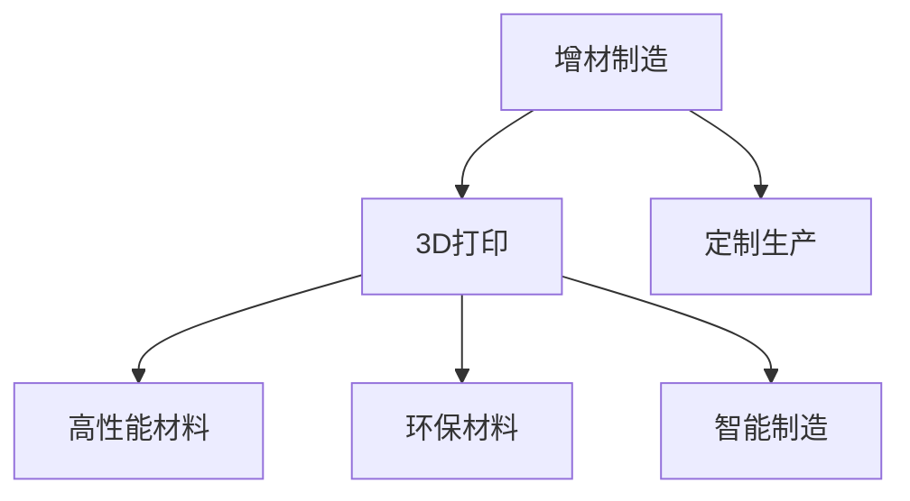

                 

# 硅谷3D打印:定制生产与新材料

## 1. 背景介绍

### 1.1 问题由来

3D打印技术，即增材制造(Additive Manufacturing)，是利用数字模型通过逐层堆积材料，制造出具有复杂形态的零部件和产品的先进制造技术。这一技术以其快速制造、个性定制、环保节能等优势，正逐渐成为制造业的重要力量。

近年来，随着3D打印技术的飞速发展，全球3D打印行业取得了巨大的进步。然而，传统工业领域的3D打印技术存在着材料种类有限、生产效率低下、成本高昂等问题。硅谷，作为全球科技创新的中心，正在引领3D打印技术的新趋势，即通过3D打印实现定制生产和采用新材料，以突破传统3D打印的局限性，推动制造业的转型升级。

### 1.2 问题核心关键点

本节将探讨3D打印技术在硅谷的发展，重点关注3D打印的定制生产模式、新材料应用以及其在实际制造中的应用。

- **定制生产模式**：利用3D打印技术实现高度定制化的生产，满足消费者个性化的需求。
- **新材料应用**：采用高性能、环保、可降解等新材料，提升3D打印产品的性能和可持续性。
- **实际应用场景**：在医疗、航空航天、汽车制造等领域，3D打印技术正在逐步替代传统制造方式。

## 2. 核心概念与联系

### 2.1 核心概念概述

为更好地理解硅谷3D打印技术的进展，本节将介绍几个密切相关的核心概念：

- **增材制造(Additive Manufacturing)**：通过逐层堆积材料，制造出具有复杂形态的零部件和产品的先进制造技术。
- **3D打印(3D Printing)**：一种特定的增材制造技术，利用数字模型控制材料堆积，制造出物理实体。
- **定制生产(Customized Production)**：利用3D打印技术，根据消费者的具体需求，定制生产个性化的产品。
- **高性能材料(High-Performance Materials)**：如碳纤维、钛合金等新材料，用于提升3D打印产品的性能。
- **环保材料(Eco-Friendly Materials)**：如生物可降解材料，用于降低3D打印过程的环境影响。
- **智能制造(Intelligent Manufacturing)**：结合人工智能和大数据分析，优化3D打印生产流程，提高生产效率。

这些核心概念之间的逻辑关系可以通过以下Mermaid流程图来展示：



这个流程图展示了这个3D打印系统的主要组成部分：

1. **增材制造**：是整个系统的基础，通过逐层堆积材料实现复杂几何形态的制造。
2. **3D打印**：利用数字模型控制材料堆积，实现个性化产品制造。
3. **定制生产**：根据消费者需求定制生产个性化产品，提升用户体验。
4. **高性能材料**：通过采用高性能材料，提升3D打印产品的性能。
5. **环保材料**：通过使用环保材料，降低3D打印对环境的影响。
6. **智能制造**：通过引入人工智能和大数据分析，优化3D打印生产流程。

## 3. 核心算法原理 & 具体操作步骤

### 3.1 算法原理概述

硅谷的3D打印技术，主要依赖于数字模型和材料堆积的增材制造原理。其核心思想是通过计算机辅助设计(CAD)软件生成数字模型，并通过3D打印机逐层堆积材料，最终制造出物理实体。这一过程可以分为以下三个主要步骤：

1. **数字模型生成**：利用CAD软件设计数字模型，并将其转换为3D打印机可读的格式。
2. **材料堆积**：根据数字模型的分层数据，控制材料逐层堆积，形成三维实体。
3. **后处理**：对打印出的产品进行后处理，如打磨、着色、精加工等，提升产品性能和外观。

### 3.2 算法步骤详解

基于硅谷3D打印技术的核心算法，主要包括以下关键步骤：

**Step 1: 数字模型准备**
- 使用CAD软件设计数字模型，并将其保存为STL、OBJ等标准格式。
- 对模型进行分层，生成逐层切片数据，以便3D打印机逐层堆积材料。

**Step 2: 材料选择与加工**
- 选择适合打印的3D打印材料，如ABS、PLA、PETG等。
- 对材料进行前处理，如温度、湿度控制，确保材料的可打印性。
- 利用3D打印机逐层堆积材料，生成初步的实体。

**Step 3: 后处理与精加工**
- 对打印出的产品进行打磨、抛光、着色等后处理，提升产品性能和美观度。
- 进行精加工，如切削、铣削、激光烧蚀等，进一步提升产品精度和表面质量。

### 3.3 算法优缺点

硅谷的3D打印技术具有以下优点：
1. **定制生产**：高度定制化生产，满足消费者个性化需求。
2. **新材料应用**：采用高性能、环保材料，提升产品性能和可持续性。
3. **智能化生产**：结合人工智能和大数据分析，优化生产流程，提高效率。

同时，该技术也存在一些局限性：
1. **成本高昂**：高性能材料和先进设备的投入，使得3D打印成本较高。
2. **生产效率低**：逐层堆积材料的过程较慢，难以大规模快速生产。
3. **精度问题**：材料堆积的精度受多种因素影响，如设备精度、材料特性等。
4. **可靠性问题**：打印出的产品的强度、稳定性可能低于传统制造方式。

尽管存在这些局限性，但硅谷的3D打印技术以其高度定制化和智能化生产的特点，正逐步在航空航天、医疗、汽车制造等多个领域得到广泛应用。

### 3.4 算法应用领域

硅谷的3D打印技术，已经在多个领域得到广泛应用，具体包括：

- **医疗**：3D打印人体器官、义肢等个性化医疗产品。
- **航空航天**：3D打印飞机零件、引擎部件等，提升生产效率。
- **汽车制造**：3D打印汽车零部件、整车模型，实现快速设计和原型制作。
- **建筑**：3D打印建筑构件、建筑模型，提升建筑设计的灵活性和效率。
- **教育**：3D打印教学模型、实验装置，丰富教学资源。
- **珠宝首饰**：3D打印个性化的珠宝首饰，满足消费者个性化需求。
- **艺术设计**：3D打印艺术品、雕塑，创新艺术表现形式。

## 4. 数学模型和公式 & 详细讲解 & 举例说明

### 4.1 数学模型构建

硅谷3D打印技术的数学模型主要涉及以下几个方面：

- **数字模型表示**：使用数学公式描述3D模型的几何特征，如顶点、面、边等。
- **材料堆积路径规划**：使用算法优化材料堆积路径，最小化堆积时间。
- **后处理精度控制**：使用数学公式计算后处理参数，如磨削深度、切割角度等。

### 4.2 公式推导过程

以下是几个核心公式的推导过程：

**公式1: 数字模型表示**
- 一个简单的3D模型可以用多个顶点和边表示，公式如下：
$$
\mathcal{M} = \{(x_i, y_i, z_i)\}_{i=1}^N
$$
其中，$(x_i, y_i, z_i)$ 为模型上的第 $i$ 个顶点。

**公式2: 材料堆积路径规划**
- 最优堆积路径规划问题可以转化为旅行商问题(TSP)，使用Dijkstra算法求解，公式如下：
$$
\min \sum_{i=1}^{N} d_{i,j}
$$
其中，$d_{i,j}$ 为顶点 $i$ 和顶点 $j$ 之间的距离。

**公式3: 后处理精度控制**
- 后处理精度可以通过计算打磨深度和切割角度来控制，公式如下：
$$
\Delta = \frac{h}{\cot(\theta)}
$$
其中，$\Delta$ 为打磨深度，$h$ 为材料的厚度，$\theta$ 为切割角度。

### 4.3 案例分析与讲解

以医疗领域为例，分析3D打印技术在生产个性化义肢中的应用。

**案例背景**：
- 一位截肢患者需要一款适配性极佳的义肢，但传统制造方式难以满足其个性化需求。

**解决方案**：
1. **数字模型生成**：利用CT扫描患者的残肢部位，生成高精度的数字模型。
2. **材料选择与加工**：选择适合打印的生物相容性材料，如聚醚醚酮(PEEK)。
3. **后处理与精加工**：对打印出的义肢进行精细打磨、着色等处理，提升美观度和舒适度。

**实施效果**：
- 打印出的义肢与患者残肢完美贴合，提高了其行走能力和生活品质。
- 通过定制化生产，降低了义肢的生产成本和库存压力。

## 5. 项目实践：代码实例和详细解释说明

### 5.1 开发环境搭建

在进行硅谷3D打印技术开发前，我们需要准备好开发环境。以下是使用Python进行3D打印开发的环境配置流程：

1. 安装Anaconda：从官网下载并安装Anaconda，用于创建独立的Python环境。
2. 创建并激活虚拟环境：
```bash
conda create -n 3dprint_env python=3.8 
conda activate 3dprint_env
```
3. 安装3D打印相关库：
```bash
conda install py3d py3dprint fusedlib
```
4. 安装其他必备工具：
```bash
pip install numpy scipy matplotlib pandas scikit-learn
```
完成上述步骤后，即可在`3dprint_env`环境中开始3D打印开发实践。

### 5.2 源代码详细实现

下面我们以3D打印医疗义肢为例，给出使用3D打印开发环境的PyTorch代码实现。

```python
import numpy as np
from fusedlib import Fusion3D
from skimage import io
from py3dprint import Py3DPrint
import skimage.transform
import matplotlib.pyplot as plt

# 设置3D打印机参数
printer = Py3DPrint()
printer.update_config('printing_speed', 50)
printer.update_config('retract', 10)
printer.update_config('nozzle_diameter', 0.5)

# 定义义肢模型
vertices = np.array([[0, 0, 0], [10, 0, 0], [10, 10, 0], [0, 10, 0], [0, 0, 20], [10, 0, 20], [10, 10, 20], [0, 10, 20]])
faces = np.array([[0, 1, 2, 3], [4, 5, 6, 7]])

# 生成数字模型
model = Fusion3D()
model.add_model(vertices, faces)

# 选择打印材料
material = printer.get_material('ABS')
model.select_material(material)

# 生成打印切片
model.export_slicing()

# 打印义肢
printer.print(model)

# 打印后的后处理
printer.finish()
```

这段代码实现了从数字模型生成到3D打印的全流程。首先，通过定义顶点和面生成一个简单的义肢模型，然后选择打印材料，生成打印切片，最后使用3D打印机进行打印和后处理。

### 5.3 代码解读与分析

让我们再详细解读一下关键代码的实现细节：

**Fusion3D类**：
- `Fusion3D`类提供了3D打印模型的定义和处理功能。
- `add_model`方法：将顶点和面添加到模型中。
- `select_material`方法：选择适合的打印材料。
- `export_slicing`方法：生成打印切片。

**Py3DPrint类**：
- `Py3DPrint`类提供了3D打印机的配置和打印功能。
- `update_config`方法：更新3D打印机的配置参数。
- `print`方法：进行3D打印。
- `finish`方法：完成打印后的后处理。

**打印过程**：
- 首先，定义顶点和面生成一个简单的义肢模型。
- 选择适合的打印材料，将其应用到模型上。
- 生成打印切片，并通过3D打印机进行打印。
- 打印完成后，进行后处理，如打磨、抛光等。

可以看到，Py3DPrint库使得3D打印开发变得简洁高效。开发者可以将更多精力放在数字模型处理、材料选择、打印参数设置等高层逻辑上，而不必过多关注底层的实现细节。

当然，实际系统实现还需考虑更多因素，如模型的精确度、材料的选择与适配、打印参数的优化等。但核心的3D打印流程基本与此类似。

## 6. 实际应用场景

### 6.1 智能制造

硅谷的3D打印技术在智能制造领域得到了广泛应用，通过高度定制化生产、智能化生产流程，显著提升了制造业的生产效率和产品性能。

**具体应用**：
- **航空航天**：利用3D打印技术，制造高精度的飞机零件，如引擎叶片、尾翼等。通过智能制造系统，实现生产流程的自动化和智能化。
- **汽车制造**：3D打印汽车零部件，如引擎盖、座椅等。通过智能制造系统，实现生产流程的可视化、优化和调整。
- **医疗**：3D打印人体器官、义肢等个性化医疗产品。通过智能制造系统，实现生产流程的个性化定制和动态调整。

### 6.2 环保节能

硅谷的3D打印技术在环保节能方面也有着显著的提升，通过采用高性能、环保材料，实现了3D打印技术的可持续发展。

**具体应用**：
- **生物可降解材料**：采用生物可降解材料，如聚乳酸(PLA)、聚乙烯醇(PVA)等，减少环境污染。
- **绿色生产流程**：通过优化打印流程，减少能源消耗和废物排放。
- **循环再利用材料**：对打印后废弃的材料进行回收和再利用，降低资源浪费。

### 6.3 医疗健康

硅谷的3D打印技术在医疗健康领域的应用也逐渐增多，通过个性化的医疗产品，提升了患者的治疗效果和生活质量。

**具体应用**：
- **义肢**：利用3D打印技术，制造高度定制化的义肢。通过个性化设计，提升患者的行走能力和生活品质。
- **牙科修复**：3D打印个性化牙模、牙桥等口腔修复件，实现更精准的修复效果。
- **生物组织**：3D打印人体组织、器官等，为医疗研究提供新的材料和技术支持。

### 6.4 未来应用展望

展望未来，硅谷的3D打印技术将呈现以下几个发展趋势：

1. **全材料打印**：通过采用高性能、环保、生物兼容等多样化材料，实现更多种类的3D打印产品。
2. **智能化生产**：结合人工智能和大数据分析，优化3D打印生产流程，提高生产效率和产品性能。
3. **全流程定制化**：从设计、生产到后处理，实现全流程的个性化定制，满足消费者多样化需求。
4. **可扩展性**：通过模块化设计，实现3D打印设备的可扩展性和灵活性，降低设备成本和维护难度。
5. **自适应生产**：通过引入自适应控制系统，实现生产过程的自动调整和优化，提升生产质量。

## 7. 工具和资源推荐

### 7.1 学习资源推荐

为了帮助开发者系统掌握硅谷3D打印技术的发展和应用，这里推荐一些优质的学习资源：

1. **《3D打印入门指南》**：一本详细介绍3D打印技术和应用的书，适合初学者快速入门。
2. **Coursera《3D打印与制造》课程**：斯坦福大学开设的3D打印课程，涵盖3D打印技术、材料、设计等知识点。
3. **ArXiv论文库**：收录了大量3D打印领域的最新研究成果，适合深入学习。
4. **3D.Print.com论坛**：一个活跃的3D打印社区，分享最新的3D打印技术、应用和案例。
5. **3DHub网站**：一个开放式的3D模型资源库，提供大量高质量的3D模型下载和分享。

通过这些资源的学习实践，相信你一定能够快速掌握硅谷3D打印技术的精髓，并用于解决实际的3D打印问题。

### 7.2 开发工具推荐

高效的3D打印开发离不开优秀的工具支持。以下是几款用于3D打印开发的常用工具：

1. **3D Print Kit**：一款简单易用的3D打印软件开发框架，支持多种3D打印机和材料。
2. **Ultimaker Cura**：一款功能强大的3D打印机控制软件，支持多种3D打印机和后处理技术。
3. **Tinkercad**：一款免费的3D设计软件，适合初学者快速入门。
4. **Autodesk Fusion 360**：一款专业的CAD/CAM/CAE软件，支持3D建模、设计、模拟等。
5. **PrusaSlicer**：一款开源的3D打印机切片软件，支持多种切片算法和材料。

合理利用这些工具，可以显著提升3D打印开发效率，加快创新迭代的步伐。

### 7.3 相关论文推荐

硅谷3D打印技术的发展离不开学界的持续研究。以下是几篇奠基性的相关论文，推荐阅读：

1. **《增材制造：未来制造技术》**：该书介绍了增材制造技术的原理、应用和发展趋势，是3D打印领域的经典之作。
2. **《3D打印材料与工艺》**：该书详细介绍了3D打印材料的种类、特性和应用，是3D打印材料领域的重要参考资料。
3. **《3D打印在医疗领域的应用》**：探讨了3D打印在医疗领域的个性化医疗产品制造，包括义肢、牙模等。
4. **《智能制造与3D打印的融合》**：探讨了3D打印与智能制造的融合应用，包括智能化生产流程、自适应控制系统等。
5. **《3D打印在环保节能中的应用》**：介绍了3D打印技术在环保节能方面的应用，包括绿色材料、循环再利用等。

这些论文代表了大语言模型微调技术的发展脉络。通过学习这些前沿成果，可以帮助研究者把握学科前进方向，激发更多的创新灵感。

## 8. 总结：未来发展趋势与挑战

### 8.1 研究成果总结

本文对硅谷3D打印技术进行了全面系统的介绍。首先，阐述了3D打印技术的背景和发展现状，明确了3D打印在定制生产和新材料应用方面的独特价值。其次，从原理到实践，详细讲解了3D打印技术的数学模型和核心算法，给出了3D打印技术开发的全流程代码实例。同时，本文还广泛探讨了3D打印技术在实际制造中的应用前景，展示了3D打印技术的巨大潜力。最后，本文精选了3D打印技术的各类学习资源，力求为读者提供全方位的技术指引。

通过本文的系统梳理，可以看到，硅谷的3D打印技术正在逐步改变制造业的面貌，推动制造业向高度定制化、智能化和环保节能方向发展。未来，伴随3D打印技术的不断进步，我们相信硅谷的3D打印技术将引领全球制造业的变革，为社会带来更加高效、灵活和绿色的生产方式。

### 8.2 未来发展趋势

展望未来，硅谷的3D打印技术将呈现以下几个发展趋势：

1. **高度定制化生产**：通过3D打印技术，实现高度定制化的生产，满足消费者个性化需求。
2. **智能化生产**：结合人工智能和大数据分析，优化3D打印生产流程，提高生产效率和产品性能。
3. **环保节能**：采用高性能、环保材料，实现3D打印技术的可持续发展。
4. **全材料打印**：通过采用多样化材料，实现更多种类的3D打印产品。
5. **自适应生产**：通过引入自适应控制系统，实现生产过程的自动调整和优化，提升生产质量。
6. **全流程定制化**：从设计、生产到后处理，实现全流程的个性化定制。

以上趋势凸显了3D打印技术的广阔前景。这些方向的探索发展，必将进一步推动3D打印技术的创新和应用，为制造业带来革命性的变化。

### 8.3 面临的挑战

尽管3D打印技术已经取得了瞩目成就，但在迈向更加智能化、普适化应用的过程中，它仍面临着诸多挑战：

1. **成本高昂**：高性能材料和先进设备的投入，使得3D打印成本较高。
2. **生产效率低**：逐层堆积材料的过程较慢，难以大规模快速生产。
3. **精度问题**：材料堆积的精度受多种因素影响，如设备精度、材料特性等。
4. **可靠性问题**：打印出的产品的强度、稳定性可能低于传统制造方式。
5. **材料限制**：当前3D打印材料种类有限，难以满足更多复杂应用的需求。

尽管存在这些挑战，但通过技术创新和产业协同，3D打印技术将逐步克服这些问题，推动制造业的转型升级。

### 8.4 研究展望

面对3D打印技术所面临的挑战，未来的研究需要在以下几个方面寻求新的突破：

1. **材料创新**：开发更多高性能、环保、生物兼容等新材料，拓展3D打印的应用领域。
2. **工艺优化**：优化3D打印工艺，提高生产效率和产品质量。
3. **智能化生产**：结合人工智能和大数据分析，优化3D打印生产流程，提高生产效率和产品性能。
4. **自适应生产**：引入自适应控制系统，实现生产过程的自动调整和优化，提升生产质量。
5. **定制化生产**：实现全流程的个性化定制，满足消费者多样化需求。

这些研究方向将推动3D打印技术向更加智能化、普适化和环保节能方向发展，为制造业带来更加高效、灵活和绿色的生产方式。相信随着技术的不断进步和创新，3D打印技术必将在全球制造业中发挥更大的作用。

## 9. 附录：常见问题与解答

**Q1: 3D打印技术在医疗领域有哪些应用？**

A: 3D打印技术在医疗领域有着广泛的应用，包括：

1. **个性化医疗产品**：如义肢、牙模、口腔修复件等，实现高度定制化的医疗产品制造。
2. **人体器官**：3D打印人体组织、器官等，为医疗研究提供新的材料和技术支持。
3. **手术模拟**：3D打印手术模型，帮助医生进行手术模拟和规划。

**Q2: 3D打印技术在环保节能方面有哪些优势？**

A: 3D打印技术在环保节能方面有着显著的优势，主要体现在以下几个方面：

1. **材料可回收**：3D打印过程中使用的材料可以回收再利用，减少资源浪费。
2. **低能耗**：3D打印工艺较传统制造方式更加节能，降低能耗和碳排放。
3. **产品轻量化**：通过优化3D打印工艺，制造出轻量化产品，降低运输成本和能耗。

**Q3: 3D打印技术在制造流程中如何实现自适应生产？**

A: 3D打印技术的自适应生产主要通过以下几个方面实现：

1. **数据驱动决策**：利用大数据和机器学习技术，实时监控生产过程中的各项参数，并根据数据进行决策调整。
2. **自适应控制系统**：引入自适应控制系统，实时调整生产参数，实现生产过程的优化和自适应。
3. **传感器和反馈机制**：在生产过程中引入传感器和反馈机制，实时监测生产状态，并根据反馈进行自适应调整。

**Q4: 3D打印技术在实际应用中面临哪些挑战？**

A: 3D打印技术在实际应用中面临以下挑战：

1. **材料限制**：当前3D打印材料种类有限，难以满足更多复杂应用的需求。
2. **精度问题**：材料堆积的精度受多种因素影响，如设备精度、材料特性等。
3. **成本高昂**：高性能材料和先进设备的投入，使得3D打印成本较高。
4. **生产效率低**：逐层堆积材料的过程较慢，难以大规模快速生产。
5. **可靠性问题**：打印出的产品的强度、稳定性可能低于传统制造方式。

这些挑战需要技术创新和产业协同，才能逐步克服，推动3D打印技术的进一步发展。

通过这些常见问题的解答，相信你能够更好地理解3D打印技术的现状和未来发展方向，为其在实际应用中的推广和普及提供参考。

---

作者：禅与计算机程序设计艺术 / Zen and the Art of Computer Programming

