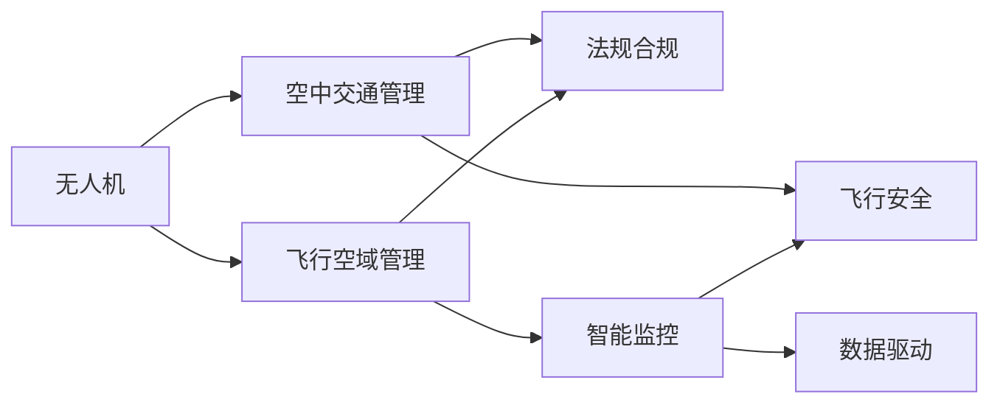

                 

# 硅谷无人机监管:空中交通管理体系

> 关键词：无人机监管,空中交通管理,法规合规,智能监控,飞行安全,数据驱动,技术框架

## 1. 背景介绍

### 1.1 问题由来
随着无人机技术的迅猛发展，其应用场景日益丰富，但也引发了一系列安全、隐私和管理上的问题。尤其是硅谷，作为全球科技创新的前沿，无人机飞行的普及更是带来了严峻的空中交通管理和安全挑战。无人机不仅可能影响飞行安全，还可能涉及个人隐私、商业机密等敏感信息。如何有效监管无人机，保障其安全、有序运行，成为了硅谷乃至全球面临的重要课题。

### 1.2 问题核心关键点
无人机监管的核心问题在于如何在保障飞行安全、保护隐私的同时，实现对无人机的有效管理和高效监控。目前无人机管理的难点主要集中在以下几个方面：

- 无人机类型多样，性能参差不齐，难以统一管理。
- 飞行范围和高度的不确定性，增加了飞行安全风险。
- 数据隐私和安全保护，涉及个人隐私和商业机密。
- 法规制度的不完善，导致无人机操作和管理缺乏统一的法律框架。
- 无人机技术发展迅猛，法规更新速度难以跟上技术进步。

### 1.3 问题研究意义
加强无人机监管，对于保障飞行安全、维护公众利益、促进无人机技术的健康发展具有重要意义：

1. **保障飞行安全**：有效监管无人机，降低低空飞行的安全风险，避免无人机与人员、飞机的碰撞。
2. **保护隐私安全**：防止无人机侵犯个人隐私，保护敏感数据不被非法获取和传播。
3. **推动技术发展**：完善法规制度，鼓励和引导无人机技术在安全、合法的框架下发展。
4. **促进产业升级**：规范无人机运营，促进无人机在农业、物流、警用等领域的应用。
5. **应对技术挑战**：提升监管技术水平，应对无人机技术快速迭代带来的新挑战。

## 2. 核心概念与联系

### 2.1 核心概念概述

为了更好地理解无人机监管，我们首先需要明确以下几个核心概念：

- **无人机(Drones)**：一种通过无线电遥控或自主程序控制的多旋翼或固定翼飞行器，用于观察、监测、测量等任务。
- **飞行空域管理(Airspace Management)**：对无人机在空中的飞行行为进行规范和监管，确保其飞行安全，维护空中交通秩序。
- **空中交通管理(Air Traffic Management, ATM)**：通过技术手段和管理措施，确保空中交通的流畅和高效，防止碰撞和冲突。
- **法规合规(Legal Compliance)**：确保无人机的操作和管理符合相关法律法规，保护公众利益，防止非法行为。
- **智能监控(Intelligent Surveillance)**：利用先进的感知、分析技术，实现对无人机飞行的实时监控和智能识别。
- **飞行安全(Safety)**：保障无人机在飞行过程中不发生碰撞、失控等事故，保护人员和财产安全。
- **数据驱动(Data-Driven)**：基于数据分析和模型预测，实现对无人机飞行状态的精确管理和智能决策。

这些概念之间的联系可以通过以下Mermaid流程图来展示：



这个流程图展示了无人机从飞行到最终监管的整个过程：

1. 无人机在空域内飞行，由飞行空域管理规范其飞行行为。
2. 飞行空域管理与空中交通管理协同工作，确保空中交通秩序。
3. 法规合规确保无人机的操作符合法律法规。
4. 智能监控实时监控无人机的飞行状态。
5. 飞行安全保障无人机不发生碰撞和失控。
6. 数据驱动基于数据和模型预测，优化无人机的飞行管理。

这些概念共同构成了无人机监管的基础框架，使得无人机能够在安全和合法的范围内运行。

## 3. 核心算法原理 & 具体操作步骤
### 3.1 算法原理概述

无人机监管的核心算法原理主要围绕飞行空域管理、空中交通管理、法规合规、智能监控等方面展开，目标是实现无人机的安全、高效、合法飞行。具体来说，无人机监管的算法原理包括以下几个关键部分：

1. **飞行空域管理算法**：对无人机的飞行路径、高度、速度等进行规范，避免飞行冲突。
2. **空中交通管理算法**：通过实时监控和动态调整，确保空中交通的流畅和高效。
3. **法规合规算法**：确保无人机操作符合法律法规，防止非法行为。
4. **智能监控算法**：利用感知和分析技术，实时监控无人机的飞行状态，及时发现异常。

### 3.2 算法步骤详解

无人机监管的具体操作步骤包括以下几个关键步骤：

**Step 1: 数据采集与预处理**
- 收集无人机的实时位置、速度、高度、飞行方向等数据。
- 通过传感器和GPS等设备，获取无人机的飞行状态信息。
- 对采集到的数据进行预处理，包括去噪、滤波、标准化等。

**Step 2: 飞行空域管理**
- 根据无人机类型和性能，确定其适合的飞行空域。
- 对无人机在飞行空域内的行为进行规范，如限制飞行高度、速度等。
- 实时监控无人机的飞行路径，防止进入禁飞区。

**Step 3: 空中交通管理**
- 实时监控空域内的所有无人机，确保无碰撞和冲突。
- 动态调整无人机的飞行路径和高度，优化空域资源利用。
- 在无人机靠近关键区域或设施时，提前发出警告，避免潜在风险。

**Step 4: 法规合规管理**
- 建立无人机操作数据库，记录所有无人机的基本信息和飞行记录。
- 根据法律法规，对无人机操作进行审核和监管，确保合法合规。
- 对违规操作进行记录和处罚，防止非法行为。

**Step 5: 智能监控与数据分析**
- 利用先进的感知技术，如雷达、摄像头等，实时监控无人机的飞行状态。
- 使用数据分析和模型预测，对无人机行为进行智能识别和预测。
- 根据分析结果，及时采取措施，确保飞行安全。

**Step 6: 飞行安全保障**
- 通过仿真模拟和风险评估，识别潜在的飞行风险。
- 在关键区域设置飞行限制和禁飞区。
- 在无人机发生异常时，及时采取紧急措施，确保飞行安全。

**Step 7: 系统集成与评估**
- 将飞行空域管理、空中交通管理、法规合规、智能监控等系统集成，实现统一监管。
- 定期对系统进行评估和优化，确保其有效性和可靠性。
- 根据评估结果，不断改进和升级无人机监管系统。

### 3.3 算法优缺点

无人机监管的算法具有以下优点：
1. **安全高效**：通过实时监控和动态调整，确保无人机的飞行安全，提高空域资源利用效率。
2. **法规合规**：确保无人机操作符合法律法规，防止非法行为。
3. **智能决策**：利用数据分析和模型预测，实现对无人机行为的高效管理和智能决策。
4. **数据驱动**：基于数据和模型，优化飞行管理和智能决策，提升监管效果。

同时，该算法也存在一些局限性：
1. **技术复杂**：需要先进的感知、分析、控制等技术，对技术要求高。
2. **数据隐私**：在采集和处理无人机数据时，需要严格保护数据隐私和用户信息。
3. **法规滞后**：无人机技术发展迅速，法规更新难以跟上技术进步。
4. **系统集成**：需要将多个系统集成，确保其高效协同，系统集成难度较大。
5. **成本较高**：先进技术和设备的投入，增加了监管成本。

尽管存在这些局限性，但无人机监管的算法在保障飞行安全、促进技术发展、规范行业运营方面仍具有重要价值。

### 3.4 算法应用领域

无人机监管的算法可以应用于多个领域，主要包括以下几个方面：

- **航空安全**：确保无人机在飞行过程中不发生碰撞和失控，保障人员和财产安全。
- **城市管理**：利用无人机进行城市监控、警用巡查等任务，提高城市治理效率。
- **农业应用**：通过无人机进行农田监测、农药喷洒等，提升农业生产效率。
- **物流运输**：利用无人机进行货物运输，缩短物流时间和成本。
- **环境监测**：利用无人机进行环境监测、生态调查等，保护自然环境。
- **医疗服务**：利用无人机进行医疗物资运输、医疗巡视等，提高医疗服务水平。

## 4. 数学模型和公式 & 详细讲解  
### 4.1 数学模型构建

无人机监管的数学模型主要涉及以下几个关键部分：

- **飞行空域管理模型**：用于规范无人机的飞行路径、高度和速度等，确保其安全飞行。
- **空中交通管理模型**：用于优化空域资源利用，防止碰撞和冲突。
- **法规合规模型**：用于确保无人机操作符合法律法规，防止非法行为。
- **智能监控模型**：用于实时监控和分析无人机的飞行状态，确保飞行安全。

### 4.2 公式推导过程

以飞行空域管理模型为例，推导其在飞行高度和速度限制中的应用。

假设无人机在飞行空域内的高度和速度分别为 $h$ 和 $v$，空域的最大高度和速度分别为 $H$ 和 $V$，则飞行空域管理模型的约束条件为：

$$
\begin{cases}
h \leq H \\
v \leq V
\end{cases}
$$

在实际应用中，可以使用数值模拟和优化算法，求解最优的飞行高度和速度，确保无人机的安全飞行。具体求解过程可以通过数值计算和优化算法实现。

### 4.3 案例分析与讲解

以城市无人机管理为例，分析其飞行空域管理、空中交通管理、智能监控和法规合规的结合应用。

**飞行空域管理**：城市中建筑物密集，需要限制无人机的飞行高度和速度，确保不进入禁飞区。假设城市中心区域的高度限制为200米，速度限制为40km/h，则飞行空域管理模型可以确保无人机在城市中心的飞行安全。

**空中交通管理**：城市中的交通流量较大，需要实时监控和动态调整无人机的飞行路径，避免碰撞和冲突。假设城市中心区域有多个无人机同时飞行，可以通过实时监控和动态调整，优化无人机的飞行路径，确保飞行安全。

**智能监控**：利用先进的感知技术，如雷达、摄像头等，实时监控无人机的飞行状态。假设无人机飞行过程中，雷达检测到异常，可以及时发出警告，避免无人机进入危险区域。

**法规合规**：城市中的无人机管理需要符合相关法律法规，防止非法行为。假设无人机在城市上空飞行，需要建立无人机操作数据库，记录所有无人机的基本信息和飞行记录，确保合规操作。

## 5. 项目实践：代码实例和详细解释说明
### 5.1 开发环境搭建

在进行无人机监管系统的开发前，我们需要准备好开发环境。以下是使用Python进行OpenDroneID开发的环境配置流程：

1. 安装Anaconda：从官网下载并安装Anaconda，用于创建独立的Python环境。

2. 创建并激活虚拟环境：
```bash
conda create -n open_droneid python=3.8 
conda activate open_droneid
```

3. 安装依赖库：
```bash
pip install opendroneid==0.3.0
```

4. 安装各类工具包：
```bash
pip install numpy pandas scikit-learn matplotlib tqdm jupyter notebook ipython
```

完成上述步骤后，即可在`open_droneid`环境中开始开发。

### 5.2 源代码详细实现

下面是使用Python实现OpenDroneID模块中飞行空域管理功能的代码实现：

```python
from opendroneid import FlightSpace

# 创建FlightSpace实例
flight_space = FlightSpace()

# 添加飞行空域
flight_space.add_flight_space(
    id='001',
    name='City Center',
    max_height=200,  # 最大高度
    max_speed=40    # 最大速度
)

# 查询飞行空域
flight_spaces = flight_space.get_flight_spaces()
for space in flight_spaces:
    print(f"Flight Space ID: {space.id}, Name: {space.name}, Max Height: {space.max_height}, Max Speed: {space.max_speed}")
```

### 5.3 代码解读与分析

上述代码实现了OpenDroneID模块中飞行空域管理的核心功能。具体解读如下：

1. **FlightSpace类**：用于创建和管理飞行空域的类。
2. **add_flight_space方法**：添加新的飞行空域，设置最大高度和最大速度。
3. **get_flight_spaces方法**：查询所有飞行空域，并打印相关信息。

通过这个简单的代码实现，我们可以看到，使用OpenDroneID模块，可以快速实现飞行空域的管理和查询功能，为无人机监管系统的开发提供了基础支持。

## 6. 实际应用场景
### 6.1 智能监控系统

在城市无人机管理中，智能监控系统扮演了重要角色。通过实时监控和数据分析，系统能够及时发现无人机的异常行为，确保飞行安全。

**系统实现**：
1. **数据采集**：通过传感器和摄像头，实时采集无人机的飞行状态和环境数据。
2. **数据分析**：利用机器学习算法，对采集到的数据进行分析和预测，识别出异常行为。
3. **预警机制**：根据分析结果，及时发出警告，采取相应的措施，防止无人机进入危险区域。

**应用场景**：
1. **警用巡查**：利用无人机进行城市巡查，实时监控重要区域，防止非法行为。
2. **事件应急**：在突发事件发生时，快速部署无人机，实时监控和反馈信息，支持应急指挥。
3. **安防监控**：在城市重点区域，设置无人机监控点，确保安全稳定。

### 6.2 法规合规系统

法规合规系统是无人机监管的重要组成部分，确保无人机操作符合法律法规，防止非法行为。

**系统实现**：
1. **操作记录**：建立无人机操作数据库，记录所有无人机的基本信息和飞行记录。
2. **合规审核**：根据法律法规，对无人机操作进行审核和监管，确保合规操作。
3. **违规处罚**：对违规操作进行记录和处罚，防止非法行为。

**应用场景**：
1. **航空安全**：确保无人机在飞行过程中不发生碰撞和失控，保障飞行安全。
2. **城市管理**：确保无人机在城市上空飞行，不进入禁飞区，防止非法行为。
3. **环保监测**：确保无人机在环境保护区域飞行，不侵犯自然环境。

### 6.3 飞行空域管理系统

飞行空域管理系统是无人机监管的基础，规范无人机的飞行路径和高度，确保飞行安全。

**系统实现**：
1. **飞行空域划分**：根据无人机类型和性能，划分合适的飞行空域。
2. **飞行路径规划**：根据飞行空域的规范，规划无人机的飞行路径和高度。
3. **飞行监控**：实时监控无人机的飞行状态，防止飞行冲突。

**应用场景**：
1. **农业应用**：通过无人机进行农田监测、农药喷洒等，确保飞行安全和飞行高度。
2. **物流运输**：利用无人机进行货物运输，确保飞行路径和飞行高度。
3. **警用巡查**：在警用无人机巡查中，规范飞行高度和速度，确保飞行安全。

### 6.4 未来应用展望

随着无人机技术的不断进步，无人机监管系统也将迎来新的发展机遇和挑战。未来无人机监管系统将朝着以下几个方向发展：

1. **智能化升级**：利用人工智能技术，实现更加智能的飞行空域管理和智能监控，提高监管效率和精度。
2. **多模态融合**：结合多种感知技术，实现更加全面和精确的飞行监控和数据分析。
3. **法规更新**：随着无人机技术的快速发展，法规制度也将不断更新，以适应新的技术需求。
4. **技术融合**：将无人机监管系统与城市治理、环境保护等系统进行深度融合，实现更高效的城市管理。
5. **跨区域协作**：建立跨区域无人机监管体系，实现多区域协调和统一监管。
6. **隐私保护**：在无人机数据采集和处理过程中，严格保护数据隐私和用户信息，确保数据安全。

## 7. 工具和资源推荐
### 7.1 学习资源推荐

为了帮助开发者系统掌握无人机监管的理论基础和实践技巧，这里推荐一些优质的学习资源：

1. **《飞行空域管理与无人机监管》系列博文**：由无人机监管专家撰写，深入浅出地介绍了飞行空域管理、空中交通管理、法规合规等核心内容。
2. **OpenDroneID官方文档**：官方文档提供了详细的API接口和示例代码，帮助开发者快速上手无人机监管系统开发。
3. **《无人机监管技术》书籍**：全面介绍了无人机监管的技术框架、应用场景和实际案例，是系统学习无人机监管技术的必备资料。
4. **IEEE和ACM等期刊论文**：最新的无人机监管技术研究论文，涵盖飞行空域管理、空中交通管理、智能监控等多个方面，提供前沿技术方向。

通过对这些资源的学习实践，相信你一定能够快速掌握无人机监管的核心技术和应用方法，为实际项目开发提供有力支持。
###  7.2 开发工具推荐

高效的开发离不开优秀的工具支持。以下是几款用于无人机监管开发的常用工具：

1. **Anaconda**：提供Python环境管理工具，方便创建和管理虚拟环境。
2. **OpenDroneID**：提供无人机飞行监控和管理工具，支持API接口和数据采集。
3. **Python**：基于Python的开源编程语言，灵活高效，广泛用于数据分析和算法实现。
4. **Jupyter Notebook**：提供交互式编程环境，支持Python代码的实时运行和结果展示。
5. **TensorFlow和PyTorch**：流行的深度学习框架，提供强大的数据处理和模型训练功能。
6. **Visual Studio Code**：支持代码编写和调试的轻量级编辑器，提供丰富的插件和扩展。

合理利用这些工具，可以显著提升无人机监管任务的开发效率，加快创新迭代的步伐。

### 7.3 相关论文推荐

无人机监管技术的发展源于学界的持续研究。以下是几篇奠基性的相关论文，推荐阅读：

1. **《城市无人机监管系统设计与实现》**：提出城市无人机监管系统框架，涵盖飞行空域管理、智能监控和法规合规等多个方面。
2. **《无人机飞行安全管理与监控技术研究》**：研究无人机飞行安全管理方法，提出基于飞行空域管理和智能监控的解决方案。
3. **《无人机法规合规与隐私保护技术研究》**：探讨无人机法规合规和隐私保护技术，提出数据加密、访问控制等隐私保护措施。
4. **《智能监控与数据分析在无人机管理中的应用》**：研究智能监控与数据分析方法，应用于无人机飞行行为监控和异常检测。
5. **《无人机飞行空域管理与路径规划算法》**：提出无人机飞行空域管理算法，优化飞行路径和高度，确保飞行安全。

这些论文代表了大无人机监管技术的发展脉络。通过学习这些前沿成果，可以帮助研究者把握学科前进方向，激发更多的创新灵感。

## 8. 总结：未来发展趋势与挑战
### 8.1 总结

本文对无人机监管的核心算法原理和操作步骤进行了全面系统的介绍。首先阐述了无人机监管的背景和意义，明确了飞行空域管理、空中交通管理、法规合规、智能监控等核心概念及其联系。其次，从原理到实践，详细讲解了无人机监管的数学模型和具体算法，给出了飞行空域管理、空中交通管理、智能监控等关键功能的代码实例。同时，本文还探讨了无人机监管在城市管理、物流运输、环境监测等领域的实际应用场景，展示了无人机监管技术的广阔前景。最后，精选了无人机监管技术的学习资源、开发工具和相关论文，力求为开发者提供全方位的技术指引。

通过本文的系统梳理，可以看到，无人机监管技术在保障飞行安全、促进技术发展、规范行业运营方面具有重要价值。未来，伴随着无人机技术的不断进步，无人机监管系统也将迎来新的发展机遇和挑战，需要不断优化和升级，以适应不断变化的技术需求和行业标准。

### 8.2 未来发展趋势

展望未来，无人机监管技术将呈现以下几个发展趋势：

1. **智能化升级**：利用人工智能技术，实现更加智能的飞行空域管理和智能监控，提高监管效率和精度。
2. **多模态融合**：结合多种感知技术，实现更加全面和精确的飞行监控和数据分析。
3. **法规更新**：随着无人机技术的快速发展，法规制度也将不断更新，以适应新的技术需求。
4. **技术融合**：将无人机监管系统与城市治理、环境保护等系统进行深度融合，实现更高效的城市管理。
5. **跨区域协作**：建立跨区域无人机监管体系，实现多区域协调和统一监管。
6. **隐私保护**：在无人机数据采集和处理过程中，严格保护数据隐私和用户信息，确保数据安全。

以上趋势凸显了无人机监管技术的广阔前景。这些方向的探索发展，必将进一步提升无人机监管系统的性能和应用范围，为人类社会带来更加安全、高效、智能的飞行环境。

### 8.3 面临的挑战

尽管无人机监管技术已经取得了显著成果，但在迈向更加智能化、普适化应用的过程中，仍面临诸多挑战：

1. **技术复杂性**：无人机监管系统需要先进的感知、分析、控制等技术，对技术要求高。
2. **数据隐私**：在采集和处理无人机数据时，需要严格保护数据隐私和用户信息。
3. **法规滞后**：无人机技术发展迅速，法规更新难以跟上技术进步。
4. **系统集成**：需要将多个系统集成，确保其高效协同，系统集成难度较大。
5. **成本较高**：先进技术和设备的投入，增加了监管成本。

尽管存在这些挑战，但无人机监管技术在保障飞行安全、促进技术发展、规范行业运营方面仍具有重要价值。

### 8.4 研究展望

面向未来，无人机监管技术需要在以下几个方面寻求新的突破：

1. **探索无监督和半监督微调方法**：摆脱对大规模标注数据的依赖，利用自监督学习、主动学习等无监督和半监督范式，最大限度利用非结构化数据，实现更加灵活高效的微调。
2. **研究参数高效和计算高效的微调范式**：开发更加参数高效的微调方法，在固定大部分预训练参数的同时，只更新极少量的任务相关参数。同时优化微调模型的计算图，减少前向传播和反向传播的资源消耗，实现更加轻量级、实时性的部署。
3. **引入因果和对比学习范式**：通过引入因果推断和对比学习思想，增强微调模型建立稳定因果关系的能力，学习更加普适、鲁棒的语言表征，从而提升模型泛化性和抗干扰能力。
4. **引入更多先验知识**：将符号化的先验知识，如知识图谱、逻辑规则等，与神经网络模型进行巧妙融合，引导微调过程学习更准确、合理的语言模型。同时加强不同模态数据的整合，实现视觉、语音等多模态信息与文本信息的协同建模。
5. **结合因果分析和博弈论工具**：将因果分析方法引入微调模型，识别出模型决策的关键特征，增强输出解释的因果性和逻辑性。借助博弈论工具刻画人机交互过程，主动探索并规避模型的脆弱点，提高系统稳定性。
6. **纳入伦理道德约束**：在模型训练目标中引入伦理导向的评估指标，过滤和惩罚有偏见、有害的输出倾向。同时加强人工干预和审核，建立模型行为的监管机制，确保输出符合人类价值观和伦理道德。

这些研究方向的探索，必将引领无人机监管技术迈向更高的台阶，为构建安全、可靠、可解释、可控的智能系统铺平道路。面向未来，无人机监管技术还需要与其他人工智能技术进行更深入的融合，如知识表示、因果推理、强化学习等，多路径协同发力，共同推动无人机技术的健康发展。

## 9. 附录：常见问题与解答

**Q1：无人机飞行空域管理的核心是什么？**

A: 无人机飞行空域管理的核心是确保无人机的飞行行为符合规范，避免飞行冲突和碰撞。主要措施包括划分飞行空域、限制飞行高度和速度、实时监控飞行路径等。

**Q2：无人机智能监控系统的关键技术有哪些？**

A: 无人机智能监控系统的关键技术包括数据采集、数据分析和智能预警等。数据采集利用传感器和摄像头获取飞行状态和环境数据；数据分析通过机器学习算法，识别异常行为；智能预警根据分析结果，及时发出警告，采取相应措施。

**Q3：无人机法规合规管理的难点是什么？**

A: 无人机法规合规管理的难点在于法规的更新滞后和执行难度大。随着无人机技术的快速迭代，法规更新难以跟上技术发展，执行过程中也面临执行难、监管难的问题。

**Q4：如何提高无人机系统的安全性？**

A: 提高无人机系统的安全性需要从技术和管理两个方面入手。技术上，利用先进的感知、分析和控制技术，确保飞行安全；管理上，建立完善的法规和标准，确保合规操作。

**Q5：无人机飞行空域管理对飞行路径和高度有哪些限制？**

A: 飞行空域管理对无人机的飞行路径和高度有以下限制：
- 飞行路径：必须在规定的空域内飞行，避免进入禁飞区和危险区域。
- 飞行高度：必须低于规定的最大高度，确保不进入高空飞行区。

这些限制措施可以有效保障无人机的飞行安全，避免飞行冲突和碰撞。

通过本文的系统梳理，可以看到，无人机监管技术在保障飞行安全、促进技术发展、规范行业运营方面具有重要价值。未来，伴随着无人机技术的不断进步，无人机监管系统也将迎来新的发展机遇和挑战，需要不断优化和升级，以适应不断变化的技术需求和行业标准。

