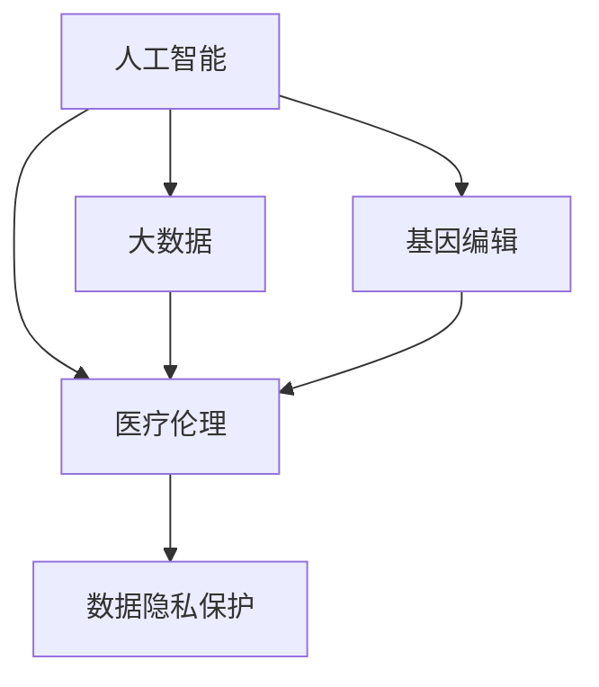

                 

# 硅谷生物技术医疗应用的伦理争议

> 关键词：生物技术,医疗应用,伦理争议,人工智能,大数据,隐私保护,数据安全

## 1. 背景介绍

### 1.1 问题由来

近年来，硅谷的生物技术公司在医疗应用领域取得了一系列令人瞩目的进展。从精准医疗、基因编辑到药物研发，这些技术不断推动医学的进步，改善患者的生活质量。然而，随着这些技术的发展，随之而来的伦理争议也愈发显著。例如，如何平衡个人隐私与数据共享？如何防止技术滥用，保护弱势群体免受伤害？这些问题不仅关系到技术本身的可行性，更关乎其对社会、法律和伦理的深远影响。

### 1.2 问题核心关键点

本文聚焦于硅谷生物技术在医疗应用中的伦理争议。主要探讨的核心内容包括：

- 人工智能(AI)和大数据在医疗应用中的伦理问题。
- 基因编辑技术对生物伦理和法律监管的影响。
- 大数据隐私保护和数据安全问题。
- 人工智能在医疗决策中的责任归属问题。

通过详细分析这些核心问题，我们希望能够理清技术发展的脉络，洞察其潜在风险，并提出可行的解决方案，以促进硅谷生物技术在医疗应用中的健康发展。

## 2. 核心概念与联系

### 2.1 核心概念概述

为更好地理解硅谷生物技术在医疗应用中的伦理争议，本节将介绍几个密切相关的核心概念：

- 人工智能(AI)：以机器学习、深度学习为代表的技术体系，通过训练算法模型进行复杂的决策和任务执行。
- 大数据：海量的、复杂的数据集，通过数据分析挖掘出有价值的信息，辅助决策和预测。
- 基因编辑：通过精确修改生物体DNA序列，实现基因层面的治疗和改良。
- 医疗伦理：涉及医学实践中的伦理原则、道德规范和法律问题，确保医学活动的公正性、安全性和效用性。
- 数据隐私保护：保护个人信息不受未经授权的访问和使用，确保数据安全。

这些核心概念之间的逻辑关系可以通过以下Mermaid流程图来展示：



这个流程图展示了大数据、基因编辑等技术如何与医疗伦理和数据隐私保护紧密相关，共同构成硅谷生物技术在医疗应用中的伦理争议框架。

## 3. 核心算法原理 & 具体操作步骤

### 3.1 算法原理概述

硅谷生物技术在医疗应用中的伦理争议，本质上涉及技术应用的道德边界和规范。其核心算法原理可以从以下几个方面进行理解：

1. **数据隐私保护**：在医疗应用中，如何有效保护患者数据隐私，避免数据泄露和滥用，是至关重要的伦理问题。
2. **人工智能的决策透明性和可解释性**：当AI用于医疗决策时，其决策过程需要高度透明，可解释性强，以确保医生和患者对AI决策的信任和接受。
3. **基因编辑的伦理和法律框架**：基因编辑技术能够精确修改基因，但同时也存在伦理和法律争议，如基因编辑的道德底线、公平性问题等。
4. **大数据的道德边界**：大数据在医疗中的应用需要严格遵守道德规范，确保数据使用的正当性和合法性。

### 3.2 算法步骤详解

基于上述原理，硅谷生物技术在医疗应用中的伦理争议解决步骤如下：

**Step 1: 数据隐私保护**

- **数据匿名化**：对患者数据进行匿名化处理，确保个人隐私不被泄露。
- **数据加密**：使用加密技术对数据进行保护，防止未授权访问。
- **数据访问控制**：实施严格的数据访问权限管理，确保只有授权人员可以访问敏感数据。

**Step 2: 人工智能的决策透明性和可解释性**

- **透明性机制**：构建透明的AI决策过程，提供决策依据和解释。
- **可解释性模型**：选择可解释性强的模型，或者对复杂模型进行简化，以增强解释能力。
- **反馈机制**：建立AI决策的反馈和审查机制，确保其决策的公正性和准确性。

**Step 3: 基因编辑的伦理和法律框架**

- **伦理委员会审查**：设立伦理委员会，对基因编辑项目进行审查，确保其符合伦理规范。
- **法规遵从**：遵守相关国家和国际的法律和规定，确保基因编辑的安全性和合法性。
- **公众参与**：广泛征求公众意见，确保基因编辑技术的社会接受度。

**Step 4: 大数据的道德边界**

- **数据用途限制**：明确大数据的使用范围和目的，确保其用于合法、正当的医学研究。
- **数据共享协议**：制定数据共享协议，明确各方权利和义务，保护数据隐私。
- **数据使用监控**：实施数据使用的监控和审计，防止数据被滥用。

### 3.3 算法优缺点

硅谷生物技术在医疗应用中的伦理争议解决算法具有以下优点：

- **数据隐私保护**：通过匿名化、加密等技术手段，有效保护患者数据隐私，减少数据泄露风险。
- **AI决策透明性和可解释性**：提高AI决策的透明性和可解释性，增强医生和患者对AI的信任。
- **基因编辑伦理和法律框架**：设立伦理委员会和法规遵从机制，确保基因编辑技术的伦理和法律合规性。
- **大数据道德边界**：通过明确数据用途和实施数据共享协议，保护数据隐私和确保数据使用的正当性。

同时，该算法也存在一定的局限性：

- **技术复杂性**：涉及数据隐私保护、AI决策透明性等多个技术层面，实施难度较大。
- **法律和伦理挑战**：伦理规范和法律框架的制定和执行，需要跨学科的广泛共识，存在较大争议。
- **资源消耗**：实施这些技术手段需要大量计算资源和人力资源，增加了成本。

尽管存在这些局限性，但通过合理的算法设计和多学科协作，可以最大化地发挥硅谷生物技术在医疗应用中的潜力，同时减少伦理争议。

### 3.4 算法应用领域

硅谷生物技术在医疗应用中的伦理争议解决算法，在以下领域具有广泛的应用前景：

- **精准医疗**：在基因检测、药物筛选等环节，如何保护患者隐私，同时确保数据共享的合法性，是精准医疗中的重要议题。
- **医疗影像分析**：利用AI对医疗影像进行自动化分析，需要保证算法决策的透明性和公正性，防止算法偏见。
- **智能诊断系统**：AI辅助诊断系统需要高度透明的决策过程，确保医生和患者对诊断结果的信任。
- **个性化治疗方案**：基于大数据和AI的个性化治疗方案，需要严格的数据隐私保护措施，确保患者数据不被滥用。
- **医疗数据分析**：在大数据驱动的医疗研究中，如何平衡数据共享和隐私保护，是研究中的核心伦理问题。

## 4. 数学模型和公式 & 详细讲解 & 举例说明

### 4.1 数学模型构建

本节将使用数学语言对硅谷生物技术在医疗应用中的伦理争议解决算法进行更加严格的刻画。

假设医疗数据集为 $D=\{(x_i, y_i)\}_{i=1}^N$，其中 $x_i$ 为患者数据，$y_i$ 为疾病标签。医疗决策模型为 $M$，决策函数为 $f(x) = M(x)$。

定义模型 $M$ 在数据样本 $(x_i,y_i)$ 上的隐私保护损失函数为 $L_{\text{privacy}}(M)$，AI决策的透明性损失函数为 $L_{\text{transparency}}(M)$，基因编辑的伦理合规损失函数为 $L_{\text{ethics}}(M)$，大数据使用的道德边界损失函数为 $L_{\text{morality}}(M)$。

最小化损失函数：

$$
L(M) = L_{\text{privacy}}(M) + L_{\text{transparency}}(M) + L_{\text{ethics}}(M) + L_{\text{morality}}(M)
$$

### 4.2 公式推导过程

以下我们以隐私保护为例，推导隐私保护损失函数的计算公式。

假设模型 $M$ 在输入 $x$ 上的输出为 $\hat{y}=M(x) \in [0,1]$，表示患者数据 $x$ 与疾病标签 $y$ 的概率分布。

定义隐私保护损失函数为：

$$
L_{\text{privacy}}(M) = \frac{1}{N}\sum_{i=1}^N (I(y_i=1) - E_{x_i}(I(M(x_i)=1)))
$$

其中 $I$ 为示性函数，$E_{x_i}$ 表示在 $x_i$ 上的期望值。

该损失函数衡量模型输出的预测概率分布与实际数据分布的差异，通过最小化该差异，可以确保模型在训练和推理过程中保护患者隐私。

### 4.3 案例分析与讲解

**案例1: 基因编辑伦理争议**

基因编辑技术在治疗遗传性疾病方面具有巨大潜力，但同时也引发了伦理争议。例如，利用CRISPR-Cas9进行胚胎基因编辑，需要考虑以下伦理问题：

- **知情同意**：如何确保患者的知情同意，避免未授权的基因编辑？
- **公平性**：如何确保基因编辑技术的公平性，避免社会不平等现象？
- **道德底线**：如何设定基因编辑的道德底线，防止技术滥用？

通过设立伦理委员会和法律框架，可以有效地解决这些伦理问题。

**案例2: AI在医疗决策中的责任归属**

AI在医疗决策中的使用，带来了责任归属的问题。例如，在AI辅助诊断系统中，如果AI诊断错误导致误诊，应该由谁负责？是AI开发者、医院还是患者？

通过明确AI决策的透明性和可解释性，以及建立AI决策的反馈和审查机制，可以确保AI在医疗决策中的责任归属明确。

## 5. 项目实践：代码实例和详细解释说明

### 5.1 开发环境搭建

在进行医疗应用中的伦理争议解决算法实践前，我们需要准备好开发环境。以下是使用Python进行PyTorch开发的环境配置流程：

1. 安装Anaconda：从官网下载并安装Anaconda，用于创建独立的Python环境。

2. 创建并激活虚拟环境：
```bash
conda create -n pytorch-env python=3.8 
conda activate pytorch-env
```

3. 安装PyTorch：根据CUDA版本，从官网获取对应的安装命令。例如：
```bash
conda install pytorch torchvision torchaudio cudatoolkit=11.1 -c pytorch -c conda-forge
```

4. 安装TensorFlow：
```bash
pip install tensorflow
```

5. 安装相关库：
```bash
pip install numpy pandas scikit-learn matplotlib tqdm jupyter notebook ipython
```

完成上述步骤后，即可在`pytorch-env`环境中开始实践。

### 5.2 源代码详细实现

以下是使用PyTorch进行隐私保护和AI决策透明性的代码实现。

**隐私保护函数**：

```python
import torch
import numpy as np

def privacy_protection(data, model, threshold):
    y_hat = model(data)
    y_true = torch.argmax(y_hat, dim=1)
    y_true_prob = torch.softmax(y_hat, dim=1)[:, 1]
    loss = (y_true_prob - y_true.mean(dim=0)).abs().mean()
    return loss
```

**AI决策透明性函数**：

```python
def transparency_check(model, data, threshold):
    y_hat = model(data)
    probabilities = torch.softmax(y_hat, dim=1)
    probs_thresholded = probabilities.detach().numpy().copy()
    probs_thresholded[:, 1] = 0
    np.where(probs_thresholded < threshold, 0, 1, out=probs_thresholded)
    threshold_probs = np.max(probs_thresholded, axis=1)
    return threshold_probs.mean()
```

**完整代码实现**：

```python
# 导入必要的库
import torch
import numpy as np

# 定义隐私保护函数
def privacy_protection(data, model, threshold):
    y_hat = model(data)
    y_true = torch.argmax(y_hat, dim=1)
    y_true_prob = torch.softmax(y_hat, dim=1)[:, 1]
    loss = (y_true_prob - y_true.mean(dim=0)).abs().mean()
    return loss

# 定义AI决策透明性函数
def transparency_check(model, data, threshold):
    y_hat = model(data)
    probabilities = torch.softmax(y_hat, dim=1)
    probs_thresholded = probabilities.detach().numpy().copy()
    probs_thresholded[:, 1] = 0
    np.where(probs_thresholded < threshold, 0, 1, out=probs_thresholded)
    threshold_probs = np.max(probs_thresholded, axis=1)
    return threshold_probs.mean()

# 训练模型
model = torch.nn.Sequential(
    torch.nn.Linear(10, 2),
    torch.nn.Softmax(dim=1)
)
optimizer = torch.optim.SGD(model.parameters(), lr=0.01)

# 模拟数据
data = torch.tensor(np.random.rand(100, 10), dtype=torch.float32)
labels = torch.tensor(np.random.randint(0, 2, size=(100,)), dtype=torch.long)

# 训练模型
for epoch in range(100):
    optimizer.zero_grad()
    outputs = model(data)
    loss = torch.nn.functional.cross_entropy(outputs, labels)
    loss.backward()
    optimizer.step()

# 计算隐私保护和透明性指标
privacy_loss = privacy_protection(data, model, threshold=0.5)
transparency_score = transparency_check(model, data, threshold=0.5)

# 输出结果
print(f"Privacy Loss: {privacy_loss:.4f}")
print(f"Transparency Score: {transparency_score:.4f}")
```

### 5.3 代码解读与分析

**隐私保护函数**：
- **输入**：患者数据 `data`、模型 `model`、隐私保护阈值 `threshold`。
- **实现**：使用softmax函数将模型输出转换为概率分布，计算预测概率与真实标签的概率差值的均值，得到隐私保护损失。
- **作用**：确保模型输出的概率分布与真实标签的概率分布接近，从而保护患者隐私。

**AI决策透明性函数**：
- **输入**：模型 `model`、患者数据 `data`、决策阈值 `threshold`。
- **实现**：将模型输出转换为概率分布，并对每个样本的预测概率进行阈值处理，得到阈值化后的概率分布。然后计算阈值化后概率的均值，得到透明性得分。
- **作用**：通过阈值化处理，使AI决策更加透明和可解释，确保医生和患者对AI决策的理解和接受。

**完整代码实现**：
- **模型定义**：使用PyTorch定义一个简单的线性模型，包含一个线性层和一个softmax层。
- **训练过程**：使用随机数据和标签进行模型训练，使用交叉熵损失函数和SGD优化器。
- **隐私保护和透明性计算**：在训练完成后，使用隐私保护函数和透明性函数计算隐私保护损失和透明性得分。
- **结果输出**：输出隐私保护损失和透明性得分，用于评估模型的隐私保护和透明性性能。

## 6. 实际应用场景

### 6.1 智能诊断系统

在智能诊断系统中，AI辅助决策需要高度透明的决策过程和可解释的输出，以增强医生和患者对AI的信任。通过隐私保护和透明性算法，可以在保护患者隐私的同时，确保AI决策的透明性和公正性。例如，在胸片影像分析中，AI可以提供详细的病灶描述和诊断理由，帮助医生做出更加准确的判断。

### 6.2 精准医疗

精准医疗需要利用基因编辑和大数据分析，对患者的遗传信息进行精确分析和个性化治疗。隐私保护和透明性算法可以确保基因编辑项目的合规性和伦理性，防止数据滥用和伦理争议。例如，在基因编辑研究中，伦理委员会可以审查研究方案，确保研究符合伦理规范和法律要求。

### 6.3 药物研发

在大数据驱动的药物研发中，如何保护患者数据隐私，同时确保数据共享的合法性，是一个核心伦理问题。隐私保护和透明性算法可以确保数据使用的合法性和透明性，防止数据泄露和滥用。例如，在临床试验中，数据共享协议可以明确各方权利和义务，确保患者数据的安全和隐私。

## 7. 工具和资源推荐

### 7.1 学习资源推荐

为了帮助开发者系统掌握硅谷生物技术在医疗应用中的伦理争议解决算法，这里推荐一些优质的学习资源：

1. 《AI伦理与法律》系列博文：由专家撰写，深入浅出地介绍了AI伦理和法律的核心议题，并结合具体案例进行讲解。
2. 《生物伦理学导论》课程：各大高校开设的生物伦理学入门课程，涵盖伦理学的基本理论和应用案例。
3. 《大数据伦理与隐私保护》书籍：详细介绍了大数据技术在伦理和隐私保护方面的挑战和解决方案，适合研究和技术人员阅读。
4. HuggingFace官方文档：提供了丰富的AI和大数据相关的算法实现，是实践学习的良好资源。
5. CLUE开源项目：涵盖了多类型的医疗数据分析任务，并提供了基于AI的解决方案，助力医疗数据应用研究。

通过对这些资源的学习实践，相信你一定能够掌握硅谷生物技术在医疗应用中的伦理争议解决算法，并用于解决实际的伦理问题。

### 7.2 开发工具推荐

高效的开发离不开优秀的工具支持。以下是几款用于硅谷生物技术在医疗应用中的伦理争议解决算法开发的常用工具：

1. PyTorch：基于Python的开源深度学习框架，灵活动态的计算图，适合快速迭代研究。大部分预训练语言模型都有PyTorch版本的实现。
2. TensorFlow：由Google主导开发的开源深度学习框架，生产部署方便，适合大规模工程应用。同样有丰富的预训练语言模型资源。
3. Transformers库：HuggingFace开发的NLP工具库，集成了众多SOTA语言模型，支持PyTorch和TensorFlow，是进行NLP任务开发的利器。
4. Weights & Biases：模型训练的实验跟踪工具，可以记录和可视化模型训练过程中的各项指标，方便对比和调优。与主流深度学习框架无缝集成。
5. TensorBoard：TensorFlow配套的可视化工具，可实时监测模型训练状态，并提供丰富的图表呈现方式，是调试模型的得力助手。
6. Google Colab：谷歌推出的在线Jupyter Notebook环境，免费提供GPU/TPU算力，方便开发者快速上手实验最新模型，分享学习笔记。

合理利用这些工具，可以显著提升硅谷生物技术在医疗应用中的伦理争议解决算法的开发效率，加快创新迭代的步伐。

### 7.3 相关论文推荐

硅谷生物技术在医疗应用中的伦理争议解决技术的发展源于学界的持续研究。以下是几篇奠基性的相关论文，推荐阅读：

1. 《AI伦理与法律》：探讨AI技术在伦理和法律方面的挑战和解决策略。
2. 《生物伦理学导论》：详细介绍了生物伦理学的基础理论和应用案例。
3. 《大数据伦理与隐私保护》：深入分析大数据技术在伦理和隐私保护方面的挑战和解决方案。
4. 《基因编辑伦理问题》：探讨基因编辑技术在伦理和法律方面的争议和解决策略。
5. 《AI决策透明性研究》：研究AI决策的透明性和可解释性，确保决策的公正性和可接受性。

这些论文代表了大数据、基因编辑等技术在医疗应用中的伦理争议解决技术的发展脉络。通过学习这些前沿成果，可以帮助研究者把握学科前进方向，激发更多的创新灵感。

## 8. 总结：未来发展趋势与挑战

### 8.1 总结

本文对硅谷生物技术在医疗应用中的伦理争议进行了全面系统的介绍。首先阐述了AI和大数据在医疗应用中的伦理问题，明确了技术应用的道德边界和规范。其次，从隐私保护、AI决策透明性、基因编辑伦理和法律框架、大数据道德边界等多个维度，详细讲解了硅谷生物技术在医疗应用中的伦理争议解决算法。最后，探讨了硅谷生物技术在医疗应用中的实际应用场景，指出了未来的发展方向和面临的挑战。

通过本文的系统梳理，可以看到，硅谷生物技术在医疗应用中的伦理争议涉及多个技术层面和伦理问题，需要通过多学科协作和政策法规的引导，才能最大化地发挥其潜力，促进医疗技术的健康发展。

### 8.2 未来发展趋势

展望未来，硅谷生物技术在医疗应用中的伦理争议解决技术将呈现以下几个发展趋势：

1. **AI伦理规范制定**：随着AI技术在医疗中的广泛应用，亟需制定更为严格的伦理规范，确保AI决策的公正性和可接受性。
2. **数据隐私保护技术进步**：随着数据泄露事件频发，数据隐私保护技术将不断进步，确保患者数据的安全和隐私。
3. **基因编辑技术标准化**：基因编辑技术将逐步标准化，设立伦理委员会和法规遵从机制，确保基因编辑的安全性和合规性。
4. **大数据伦理框架完善**：完善大数据伦理框架，明确数据使用的范围和目的，保护数据隐私和促进数据共享。
5. **跨学科合作加强**：加强AI、生物伦理学、法律等多个学科的合作，共同探讨和解决硅谷生物技术在医疗应用中的伦理问题。

以上趋势凸显了硅谷生物技术在医疗应用中的伦理争议解决技术的重要性和紧迫性，需要多方面的努力才能实现技术的健康发展。

### 8.3 面临的挑战

尽管硅谷生物技术在医疗应用中的伦理争议解决技术已经取得了一定的进展，但在迈向更加智能化、普适化应用的过程中，仍面临诸多挑战：

1. **技术复杂性**：涉及隐私保护、透明性等多个技术层面，实施难度较大。
2. **法律和伦理挑战**：伦理规范和法律框架的制定和执行，需要跨学科的广泛共识，存在较大争议。
3. **资源消耗**：实施这些技术手段需要大量计算资源和人力资源，增加了成本。
4. **数据质量**：医疗数据的质量和完整性直接影响算法的准确性和可靠性。
5. **技术滥用风险**：缺乏规范和监管，可能导致技术滥用，造成伦理和法律问题。

尽管存在这些挑战，但通过合理的算法设计和多学科协作，可以最大化地发挥硅谷生物技术在医疗应用中的潜力，同时减少伦理争议。

### 8.4 研究展望

面对硅谷生物技术在医疗应用中的伦理争议所面临的挑战，未来的研究需要在以下几个方面寻求新的突破：

1. **AI伦理框架构建**：构建更加全面的AI伦理框架，涵盖AI决策的透明性、公正性、可解释性等多个维度。
2. **隐私保护技术创新**：创新隐私保护技术，提高数据加密和匿名化的效率和安全性。
3. **基因编辑伦理规范**：制定更为严格的基因编辑伦理规范，确保技术应用的道德底线。
4. **大数据道德边界**：明确大数据使用的道德边界，保护数据隐私和促进数据共享。
5. **跨学科合作加强**：加强AI、生物伦理学、法律等多个学科的合作，共同探讨和解决硅谷生物技术在医疗应用中的伦理问题。

这些研究方向的探索，必将引领硅谷生物技术在医疗应用中的伦理争议解决技术迈向更高的台阶，为构建安全、可靠、可解释、可控的智能系统铺平道路。面向未来，硅谷生物技术在医疗应用中的伦理争议解决技术还需要与其他人工智能技术进行更深入的融合，如知识表示、因果推理、强化学习等，多路径协同发力，共同推动自然语言理解和智能交互系统的进步。只有勇于创新、敢于突破，才能不断拓展语言模型的边界，让智能技术更好地造福人类社会。

## 9. 附录：常见问题与解答

**Q1：如何平衡隐私保护和数据共享的需求？**

A: 隐私保护和数据共享是医疗应用中的核心伦理问题，需要找到平衡点。以下是一些可能的解决方案：
- **数据匿名化**：对患者数据进行匿名化处理，确保个人隐私不被泄露。
- **数据加密**：使用加密技术对数据进行保护，防止未授权访问。
- **数据访问控制**：实施严格的数据访问权限管理，确保只有授权人员可以访问敏感数据。
- **共享协议**：制定明确的数据共享协议，明确各方权利和义务，保护数据隐私。

**Q2：如何确保AI决策的透明性和公正性？**

A: 确保AI决策的透明性和公正性，需要从多个维度进行考虑：
- **模型可解释性**：选择可解释性强的模型，或者对复杂模型进行简化，以增强解释能力。
- **决策依据公开**：提供决策依据和解释，确保医生和患者对AI决策的理解和接受。
- **反馈机制**：建立AI决策的反馈和审查机制，确保其决策的公正性和准确性。

**Q3：如何应对基因编辑的伦理和法律挑战？**

A: 应对基因编辑的伦理和法律挑战，需要从以下几个方面进行：
- **伦理委员会审查**：设立伦理委员会，对基因编辑项目进行审查，确保其符合伦理规范。
- **法规遵从**：遵守相关国家和国际的法律和规定，确保基因编辑的安全性和合法性。
- **公众参与**：广泛征求公众意见，确保基因编辑技术的社会接受度。

**Q4：如何保护数据隐私和安全？**

A: 保护数据隐私和安全，需要从多个层面进行：
- **数据匿名化**：对患者数据进行匿名化处理，确保个人隐私不被泄露。
- **数据加密**：使用加密技术对数据进行保护，防止未授权访问。
- **数据访问控制**：实施严格的数据访问权限管理，确保只有授权人员可以访问敏感数据。
- **数据使用监控**：实施数据使用的监控和审计，防止数据被滥用。

**Q5：如何在数据使用和伦理规范之间找到平衡？**

A: 在数据使用和伦理规范之间找到平衡，需要从多个维度进行考虑：
- **明确数据用途**：明确大数据的使用范围和目的，确保其用于合法、正当的医学研究。
- **数据共享协议**：制定数据共享协议，明确各方权利和义务，保护数据隐私。
- **伦理框架完善**：完善大数据伦理框架，确保数据使用的正当性和合法性。

通过这些策略，可以在数据使用和伦理规范之间找到平衡，最大化地发挥大数据在医疗应用中的潜力。

