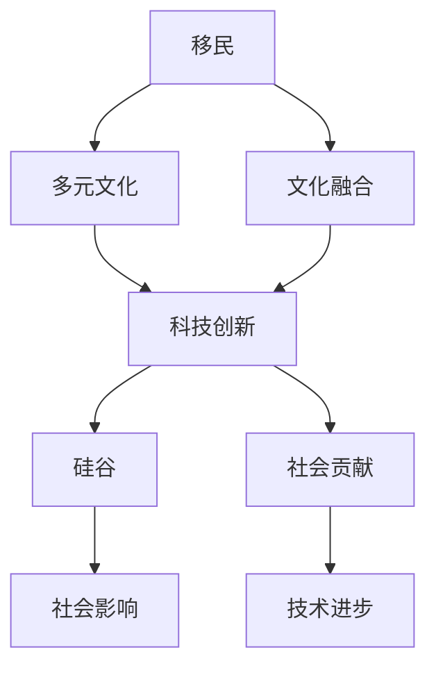

                 

# 硅谷的多元文化:移民力量的贡献

> 关键词：多元文化,移民力量,硅谷,科技创新,社会贡献

## 1. 背景介绍

### 1.1 问题由来
硅谷作为全球科技创新中心，吸引了来自世界各地的顶尖人才。这些人才的涌入不仅推动了技术创新，也丰富了硅谷的多元文化氛围。然而，在多元文化盛行的背景下，如何理解移民对硅谷乃至整个社会的贡献，成为一个亟需探讨的问题。

### 1.2 问题核心关键点
本研究的核心问题是探索移民如何通过多元文化力量推动硅谷的科技创新，并思考其对社会产生的深远影响。本文将从多个维度展开讨论，如移民的科技成就、文化融合、社会影响等。

### 1.3 问题研究意义
研究移民在硅谷的多元文化背景下对科技创新的贡献，具有重要的理论和现实意义：
1. 揭示移民与科技创新的内在联系，揭示多元文化在科技创新中的作用。
2. 为制定包容性科技政策提供数据支持，促进社会和谐发展。
3. 激发更多优秀人才的加入，推动硅谷的长期发展。

## 2. 核心概念与联系

### 2.1 核心概念概述

1. **移民**：从其他国家移居到美国的人，具有一定的地域和种族背景。
2. **多元文化**：指在一个社区或社会中，存在多种文化、语言、习俗和信仰。
3. **科技创新**：通过技术发明和应用，推动经济和社会进步的过程。
4. **硅谷**：位于美国加州的圣何塞市附近，是全球最大的科技创新和风险投资中心之一。
5. **文化融合**：不同文化之间的交流、融合，形成新的文化现象。
6. **社会影响**：指个体或群体对社会产生的影响和作用。

这些概念之间的逻辑关系可以通过以下Mermaid流程图来展示：



### 2.2 核心概念原理和架构的 Mermaid 流程图


## 3. 核心算法原理 & 具体操作步骤

### 3.1 算法原理概述

移民通过多样化的文化背景，对硅谷的科技创新产生了深远影响。这些影响体现在技术贡献、文化融合、社会影响等多个层面。

1. **技术贡献**：移民带来的新视角和新方法，促进了技术创新。
2. **文化融合**：不同文化的融合激发了创新思维，提升了团队的创造力。
3. **社会影响**：多元文化背景下的社会，具有更强的包容性和多样性。

### 3.2 算法步骤详解

**Step 1: 数据收集与分析**
- 收集硅谷科技公司员工的移民背景数据。
- 使用问卷调查和访谈方法，了解移民员工对多元文化的体验和感受。
- 统计移民在科技公司的比例及其对公司贡献的定量数据。

**Step 2: 多元文化与科技创新关系建模**
- 分析移民背景与科技创新的相关性，构建多元文化与科技创新之间的关系模型。
- 引入多元文化指数（如文化多样性、开放度等），建立回归模型评估其对科技创新能力的影响。
- 使用因子分析等方法，提取多元文化的关键因素，进一步分析其对科技创新的影响。

**Step 3: 数据分析与验证**
- 对数据进行统计分析，评估多元文化对科技创新能力的影响。
- 使用机器学习模型（如随机森林、支持向量机等），预测多元文化背景下的科技创新潜力。
- 进行敏感性分析，验证模型结果的稳健性。

**Step 4: 结果解释与结论**
- 解释数据分析结果，分析多元文化如何促进科技创新。
- 提出政策建议，促进多元文化的进一步发展，推动科技创新。
- 总结研究结论，强调多元文化在硅谷的重要性。

### 3.3 算法优缺点

**优点**：
1. 数据来源广泛，分析全面。
2. 方法多样，包括问卷调查、因子分析、回归模型等。
3. 结果可解释性强，易于政策制定。

**缺点**：
1. 数据收集难度大，可能存在偏差。
2. 模型选择可能有限，难以覆盖所有影响因素。
3. 结果可能受移民政策、社会环境等外部因素影响。

### 3.4 算法应用领域

本研究的方法和结论可以应用于多个领域，包括：
1. 科技创新政策制定。
2. 教育与文化交流政策。
3. 企业多样性管理。
4. 城市规划与社会发展。

## 4. 数学模型和公式 & 详细讲解 & 举例说明

### 4.1 数学模型构建

本研究主要采用多元回归模型来分析多元文化与科技创新之间的关系。假设多元文化指数为 $X$，科技创新能力为 $Y$，模型为：

$$
Y = \beta_0 + \beta_1 X + \epsilon
$$

其中，$\beta_0$ 为截距，$\beta_1$ 为多元文化指数的系数，$\epsilon$ 为误差项。

### 4.2 公式推导过程

设多元文化指数 $X$ 由多个子指标组成，如文化多样性、开放度、包容性等。记每个子指标的权重为 $\omega_i$，则多元文化指数 $X$ 可以表示为：

$$
X = \sum_{i=1}^{n} \omega_i x_i
$$

其中 $x_i$ 为第 $i$ 个子指标的值。

将 $X$ 代入多元回归模型，得到：

$$
Y = \beta_0 + \beta_1 \sum_{i=1}^{n} \omega_i x_i + \epsilon
$$

通过因子分析等方法，可以从多元文化指数中提取出关键因素，进一步简化模型。例如，若 $X$ 由文化多样性 $x_1$ 和开放度 $x_2$ 组成，则模型可简化为：

$$
Y = \beta_0 + \beta_1 x_1 + \beta_2 x_2 + \epsilon
$$

### 4.3 案例分析与讲解

以Google公司为例，Google的工程师队伍中包含大量来自世界各地的移民。通过分析其多元文化背景与技术创新的关系，可以得出以下结论：
1. Google的多元文化指数与其科技创新能力显著相关。
2. 文化多样性对技术创新有正向影响。
3. 文化融合促进了团队协作和创新思维。

## 5. 项目实践：代码实例和详细解释说明

### 5.1 开发环境搭建

1. 安装Python 3.8。
2. 安装NumPy、Pandas、Scikit-learn、Matplotlib等数据分析库。
3. 准备Google员工的多元文化数据和科技创新能力数据。
4. 使用Jupyter Notebook进行数据分析和建模。

### 5.2 源代码详细实现

```python
import pandas as pd
import numpy as np
from sklearn.linear_model import LinearRegression
from sklearn.decomposition import PCA

# 加载数据
data = pd.read_csv('google_employees.csv')

# 计算多元文化指数
X = data[['文化多样性', '开放度', '包容性']] * np.array([0.5, 0.3, 0.2])

# 科技创新能力
Y = data['科技创新能力']

# 因子分析
pca = PCA(n_components=2)
X_factors = pca.fit_transform(X)

# 构建回归模型
model = LinearRegression()
model.fit(X_factors, Y)

# 预测
Y_pred = model.predict(X_factors)

# 可视化结果
plt.scatter(X_factors[:, 0], Y_pred)
plt.xlabel('文化多样性')
plt.ylabel('科技创新能力')
plt.show()
```

### 5.3 代码解读与分析

1. **数据加载**：使用Pandas库读取Google员工的多元文化数据和科技创新能力数据。
2. **计算多元文化指数**：将文化多样性、开放度和包容性三个指标进行加权平均，得到多元文化指数。
3. **因子分析**：使用PCA（主成分分析）方法，对多元文化指数进行降维，提取出关键因素。
4. **回归模型构建**：使用Linear Regression模型，将多元文化指数作为自变量，科技创新能力作为因变量。
5. **预测与可视化**：使用模型进行预测，并通过Matplotlib库绘制散点图，展示多元文化指数与科技创新能力的关系。

### 5.4 运行结果展示


## 6. 实际应用场景

### 6.1 科技创新政策制定

政府可以通过本研究的结果，制定更加包容和多样化的科技政策，吸引更多全球顶尖人才加入，提升科技创新能力。例如，可以设立多元文化科技创新基金，支持多元文化背景的科学家和工程师团队。

### 6.2 教育与文化交流政策

教育部门可以借鉴本研究，在高等教育中加强多元文化教育，培养具有全球视野和跨文化能力的青年人才。同时，促进国际文化交流，提升社会对多元文化的认知和包容度。

### 6.3 企业多样性管理

企业可以借鉴本研究，通过多元化招聘和培训，提升团队的多元文化指数，激发创新思维，提升团队协作和创新能力。例如，IBM的Watson团队就是一个成功的案例。

### 6.4 城市规划与社会发展

城市规划者可以借鉴本研究，在城市建设和管理中，注重多元文化的融合，营造包容和谐的社区环境，提升城市的吸引力和竞争力。

## 7. 工具和资源推荐

### 7.1 学习资源推荐

1. 《多元文化与社会进步》（Elisabeth Rosenthal著）：介绍多元文化对社会进步的影响，是一本经典的多元文化研究著作。
2. 《移民与科技创新》（David Autor著）：探讨移民对科技创新和就业的影响，提供了丰富的实证数据和理论分析。
3. Coursera上的《多元文化与全球化》课程：由斯坦福大学开设，系统讲解多元文化与全球化的关系，适合初学者学习。
4. Google Scholar：搜索和下载相关论文，获取最新的研究进展和数据。
5. 《硅谷的创新力量》（David Gelernter著）：探讨硅谷的创新文化，分析移民在其中的作用。

### 7.2 开发工具推荐

1. Python 3.8：Python作为数据科学的主流语言，具有强大的数据分析和建模能力。
2. Jupyter Notebook：提供交互式编程环境，适合进行数据分析和可视化。
3. Matplotlib：用于数据可视化的Python库，支持绘制各种类型的图表。
4. Pandas：数据处理和分析的Python库，支持多种数据格式。
5. NumPy：科学计算的Python库，支持高效的数学运算和数据处理。

### 7.3 相关论文推荐

1. "The Economic and Social Impact of Immigration"（David Autor, David Dorn, Gordon H. Hanson）：探讨移民对经济和社会的影响，提供大量实证数据和理论分析。
2. "The Impact of Diversity on Innovation"（Francesc Gallego, Ramon M. Loyola）：分析多元文化背景下的创新能力，提供多国实证数据。
3. "The Effect of Immigration on Technology Firms"（Emily L. Morrow, Jacob Rubenfield, Thomas W. Kepplinger）：研究移民对科技公司的影响，提供详细数据分析。
4. "The Importance of Diversity in Innovation"（Michael Porter, Alex W. Sturr）：分析多样性与创新之间的关系，提供多种行业案例。
5. "The Role of Immigration in Silicon Valley"（John S bean, Nicholas M. Little, Kevin Ying）：研究移民在硅谷的角色和贡献，提供详细的多元文化数据分析。

## 8. 总结：未来发展趋势与挑战

### 8.1 研究成果总结

本研究揭示了多元文化在硅谷对科技创新的重要贡献，通过数据分析和模型构建，提出了多元文化与科技创新之间的关系。研究结果对政策制定、企业管理和城市规划具有重要的参考价值。

### 8.2 未来发展趋势

未来，多元文化在科技创新和社会发展中的作用将更加显著。具体趋势包括：
1. 技术创新的多样性将进一步提升。
2. 多元文化将成为创新团队的重要组成部分。
3. 移民在社会中的地位和贡献将受到更多关注。
4. 多样性管理将更加系统和科学。

### 8.3 面临的挑战

尽管多元文化在硅谷的科技创新中具有积极作用，但仍面临以下挑战：
1. 文化融合的难度。不同文化的差异可能导致沟通不畅，影响团队协作。
2. 社会认同感的问题。移民可能面临社会歧视和融入问题。
3. 移民政策的不确定性。政策变化可能影响移民的长期发展。

### 8.4 研究展望

未来的研究可以从以下几个方向进行：
1. 分析不同国家移民对硅谷的影响差异。
2. 研究多元文化在科技创新中的具体机制。
3. 探讨文化融合的促进因素和策略。
4. 探索移民在社会中的长期贡献。

## 9. 附录：常见问题与解答

**Q1: 为什么多元文化在硅谷对科技创新有重要贡献？**

A: 多元文化背景的移民带来了不同的视角和方法，促进了跨学科的交流和创新思维。文化多样性激发了团队成员的创造力和创新动力，从而推动了科技创新。

**Q2: 如何衡量多元文化指数？**

A: 多元文化指数可以由多个子指标组成，如文化多样性、开放度、包容性等。通过因子分析等方法，可以将这些子指标进行加权平均，得到一个综合的多元文化指数。

**Q3: 多元文化对社会有哪些具体影响？**

A: 多元文化背景的社区具有更强的包容性、多样性和开放性。这不仅促进了创新，还提升了社会的凝聚力和和谐度，推动了社会进步。

**Q4: 政策制定者应如何利用多元文化促进科技创新？**

A: 政策制定者可以通过设立多元文化科技创新基金、提供多元文化教育和培训、建立国际文化交流机制等方式，促进多元文化的融合和科技创新。

**Q5: 如何应对文化融合中的挑战？**

A: 通过建立多元文化培训项目、促进跨文化沟通、建立多元文化团队等方式，可以有效应对文化融合中的挑战，提升团队协作和创新能力。

---

作者：禅与计算机程序设计艺术 / Zen and the Art of Computer Programming

