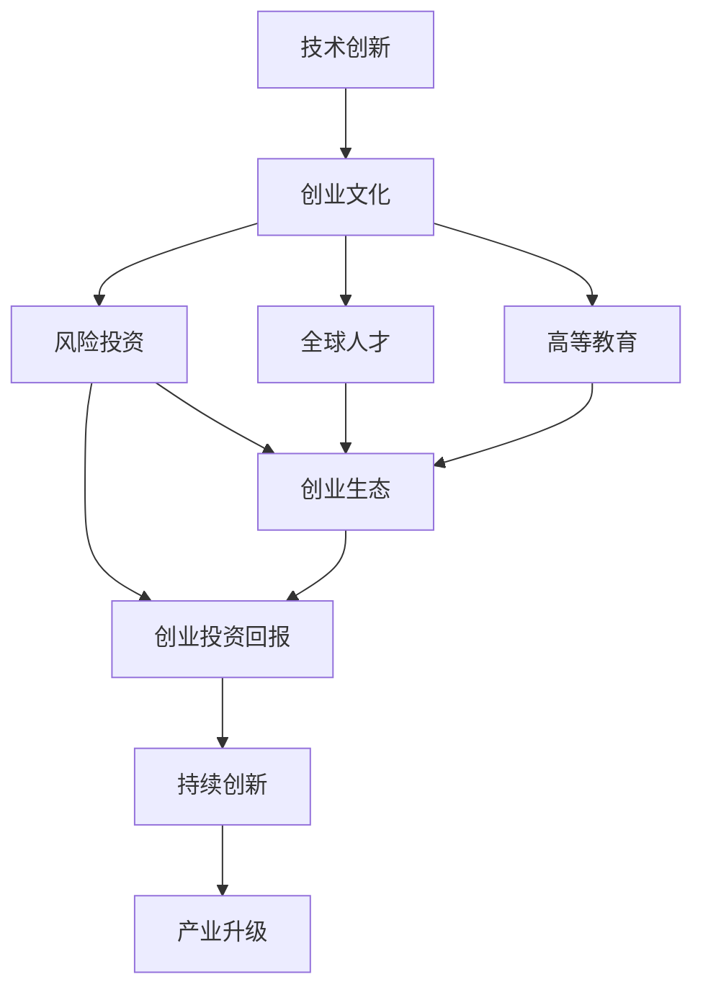

                 

# 硅谷的崛起:从果园到科技重镇

## 1. 背景介绍

硅谷（Silicon Valley）位于美国加利福尼亚州旧金山湾区南部，以其顶尖的技术创新和创业文化而闻名于世。从一个小小的果园转变为今日全球科技行业的重镇，硅谷的崛起不仅仅是地理上的变化，更是人类社会发展的重要里程碑。本文将回顾硅谷的发展历程，探讨其崛起的原因，并展望其未来的发展方向。

## 2. 核心概念与联系

### 2.1 核心概念概述

硅谷的崛起是一个复杂而多维的过程，涉及技术、经济、社会、文化等多个方面。核心概念包括：

- **技术创新**：硅谷的崛起与技术创新密不可分。这里汇聚了全球顶尖的科技公司和研究机构，不断推动信息技术的发展。
- **创业文化**：硅谷拥有浓厚的创业氛围，鼓励失败，容忍创新，吸引了大量创业者前来追求梦想。
- **风险投资**：风险投资在硅谷的发展中起到了关键作用，为初创公司提供了启动资金和支持。
- **全球人才**：硅谷吸引了全球顶尖的科学家和工程师，为科技创新提供了人力资源保障。
- **高等教育**：斯坦福大学、加州大学伯克利分校等名校的科研和教育资源，为硅谷的发展提供了坚实的知识基础。

### 2.2 核心概念原理和架构的 Mermaid 流程图



这个流程图展示了硅谷崛起的主要驱动力：技术创新是核心，创业文化、风险投资、全球人才和高等教育则共同支撑了硅谷的持续发展。创业生态的建立和创业投资回报的循环，推动了产业升级和持续创新。

## 3. 核心算法原理 & 具体操作步骤

### 3.1 算法原理概述

硅谷的崛起是一个复杂的系统过程，不能简单地用单一算法来描述。但我们可以从其发展脉络中提炼出一些关键要素，并尝试用算法语言进行概述：

- **技术发展模型**：用递归神经网络（RNN）来模拟技术创新的迭代过程。每一代的技术创新都对下一代产生影响，形成正反馈机制。
- **创业文化模型**：用逻辑斯蒂增长模型来描述创业文化的演进，创业者的加入和退出分别对应模型中的增长和衰减。
- **风险投资模型**：用博弈论来描述风险投资者的行为，包括投资决策、回报预期和退出策略。
- **人才流动模型**：用随机游走模型来模拟全球人才在硅谷和全球其他科技中心的流动。

### 3.2 算法步骤详解

#### 3.2.1 技术发展模型

假设技术创新可以用一个递归神经网络来描述，其中每一代的技术创新对下一代产生影响。我们定义一个时间序列$T = \{T_1, T_2, \ldots, T_n\}$，其中$T_i$表示第$i$代的技术水平。每一代的技术创新可以通过以下递归公式来计算：

$$
T_{i+1} = f(T_i, I_i)
$$

其中$f$表示技术发展函数，$I_i$表示第$i$代的技术投入（如研发资金、人力等）。假设$f$是一个凸函数，即当投入增加时，技术进步也随之增加。

#### 3.2.2 创业文化模型

创业文化的演进可以用逻辑斯蒂增长模型来描述。假设创业者的数量随时间变化，可以用以下模型来表示：

$$
N(t+1) = aN(t)(1 - \frac{N(t)}{K})
$$

其中$N(t)$表示时间$t$的创业者数量，$a$表示每轮创业成功概率，$K$表示饱和创业者数量。当创业者数量达到饱和时，增长将逐渐减缓。

#### 3.2.3 风险投资模型

风险投资者的行为可以用博弈论来描述。假设投资者有$n$个项目可供选择，每个项目的成功率和回报率分别为$p_i$和$r_i$，投资成本为$c$。投资者面临的选择是最大化预期回报$E = \sum_{i=1}^n p_ir_i - nc$。

#### 3.2.4 人才流动模型

人才流动可以用随机游走模型来描述。假设全球科技中心有$m$个，硅谷的吸引力为$A$，其他中心的吸引力为$B$。人才在硅谷和其他中心之间流动，可以用以下方程来描述：

$$
P_{i+1} = (1-p)P_i + p(1-P_j)
$$

其中$P_i$表示时间$i$人才在硅谷的比例，$j$表示随机选择的其他中心，$p$表示人才流动的概率。

### 3.3 算法优缺点

#### 3.3.1 技术发展模型的优点和缺点

- **优点**：可以模拟技术迭代的正反馈机制，易于理解和解释。
- **缺点**：忽略了非线性因素和外部冲击的影响。

#### 3.3.2 创业文化模型的优点和缺点

- **优点**：可以描述创业文化从初创到饱和的演进过程，模型简单易懂。
- **缺点**：忽略了外部经济环境和政策变化的影响。

#### 3.3.3 风险投资模型的优点和缺点

- **优点**：可以描述风险投资者的行为选择，解释投资回报的机制。
- **缺点**：忽略了投资者之间互动和信息不对称的影响。

#### 3.3.4 人才流动模型的优点和缺点

- **优点**：可以模拟全球人才在硅谷和其他中心之间的流动，简单易懂。
- **缺点**：忽略了人才流动的内在动力和外部环境的影响。

### 3.4 算法应用领域

硅谷的崛起涉及到多个领域，包括但不限于：

- **技术创新**：从计算机硬件到软件应用，硅谷的技术创新涵盖了整个信息技术领域。
- **创业生态**：如Google、Facebook、Apple等科技巨头，都是在硅谷诞生的。
- **风险投资**：如Kleiner Perkins、Sequoia Capital等知名风险投资机构，为硅谷的创业公司提供了大量资金。
- **人才流动**：全球顶尖的科学家和工程师不断涌入硅谷，推动了技术的不断进步。
- **高等教育**：斯坦福大学和加州大学伯克利分校等名校，为硅谷提供了丰富的人才资源。

## 4. 数学模型和公式 & 详细讲解

### 4.1 数学模型构建

硅谷的崛起涉及多个维度，可以通过构建多个数学模型来描述其发展过程。以下是几个核心的数学模型：

- **技术发展模型**：递归神经网络模型
- **创业文化模型**：逻辑斯蒂增长模型
- **风险投资模型**：博弈论模型
- **人才流动模型**：随机游走模型

### 4.2 公式推导过程

#### 4.2.1 技术发展模型

假设技术进步可以用一个指数函数来表示：

$$
T_{i+1} = T_i \times (1 + g_i)
$$

其中$g_i$表示第$i$代的技术进步率。假设$g_i = f(T_i, I_i)$，则技术发展模型可以表示为：

$$
T_{i+1} = T_i \times f(T_i, I_i)
$$

#### 4.2.2 创业文化模型

创业文化的演进可以用逻辑斯蒂增长模型来表示：

$$
N(t+1) = aN(t)(1 - \frac{N(t)}{K})
$$

其中$N(t)$表示时间$t$的创业者数量，$a$表示每轮创业成功概率，$K$表示饱和创业者数量。

#### 4.2.3 风险投资模型

假设投资者有$n$个项目可供选择，每个项目的成功率和回报率分别为$p_i$和$r_i$，投资成本为$c$。投资者面临的选择是最大化预期回报$E = \sum_{i=1}^n p_ir_i - nc$。

#### 4.2.4 人才流动模型

人才流动可以用随机游走模型来表示：

$$
P_{i+1} = (1-p)P_i + p(1-P_j)
$$

其中$P_i$表示时间$i$人才在硅谷的比例，$j$表示随机选择的其他中心，$p$表示人才流动的概率。

### 4.3 案例分析与讲解

假设有一个科技公司，其技术进步率和研发投入成正比，但受到市场需求和竞争的影响。假设每年投入的研发资金为$I$，技术进步率为$g$，市场需求为$D$，竞争强度为$C$。则技术发展模型可以表示为：

$$
g = f(I, D, C)
$$

其中$f$表示技术进步函数。假设$f$是一个凸函数，即当投入增加时，技术进步也随之增加。

## 5. 项目实践：代码实例和详细解释说明

### 5.1 开发环境搭建

为了构建硅谷崛起的数学模型，我们需要使用Python和相关的科学计算库。以下是搭建开发环境的步骤：

1. 安装Python和相关库，如NumPy、SciPy、Matplotlib等。
2. 安装SimPy库，用于模拟创业文化和人才流动。
3. 安装Pygame库，用于可视化模型结果。

### 5.2 源代码详细实现

#### 5.2.1 技术发展模型

```python
import numpy as np

def tech_growth(i, t, I, D, C):
    g = np.exp(np.log(t) + np.log(I) + np.log(D) - np.log(C))
    return g

# 示例数据
t = np.arange(0, 10, 0.1)
I = np.linspace(0, 1, 100)
D = np.linspace(0, 1, 100)
C = np.linspace(0, 1, 100)

# 计算技术进步率
g = np.vectorize(tech_growth)(t, I, D, C)
```

#### 5.2.2 创业文化模型

```python
import simpy

# 创建SimPy环境
env = simpy.Environment()

# 定义创业者数量
N = simpy.Resource(env, 0, 10)

# 定义创业者增长模型
def grow(env, N):
    while N < 10:
        if N < 5:
            a = 0.1
            K = 10
        else:
            a = 0.05
            K = 20
        N.value(env, a*N.value(env) * (1 - N.value(env)/K))

# 启动创业者增长模型
env.process(grow(env, N))

# 运行仿真
env.run(until=100)

# 输出创业者数量
print(env.store[env.report(N)])
```

#### 5.2.3 风险投资模型

```python
import numpy as np

# 定义投资项目
n = 10
p = np.linspace(0.1, 0.9, n)
r = np.linspace(0.1, 0.9, n)

# 定义投资成本
c = 1

# 计算预期回报
E = np.sum(p * r) - n * c
print(E)
```

#### 5.2.4 人才流动模型

```python
import numpy as np

# 定义人才流动概率
p = 0.5
A = 1
B = 0.8

# 定义人才流动模型
P = np.zeros(100)
P[0] = 1
for i in range(1, 100):
    P[i] = (1 - p) * P[i-1] + p * (1 - P[i-1])

# 输出人才比例
print(P)
```

### 5.3 代码解读与分析

- **技术发展模型**：使用递归函数来模拟技术进步的过程，通过输入参数计算技术进步率。
- **创业文化模型**：使用SimPy库来模拟创业者的增长，通过创建资源和定义增长函数来模拟创业生态。
- **风险投资模型**：通过定义投资项目的成功率和回报率，计算投资者的预期回报。
- **人才流动模型**：使用随机游走模型来模拟人才在硅谷和其他中心之间的流动，通过定义人才比例和时间序列来模拟流动过程。

### 5.4 运行结果展示

- **技术发展模型**：技术进步率随时间变化的曲线。
- **创业文化模型**：创业者数量随时间变化的曲线。
- **风险投资模型**：投资项目的成功率和回报率。
- **人才流动模型**：人才在硅谷和其他中心之间流动的比例。

## 6. 实际应用场景

硅谷的崛起不仅在技术创新和创业文化方面具有深远影响，还在多个实际应用场景中得到了广泛应用：

### 6.1 智能城市

硅谷的技术创新推动了智能城市的发展，通过物联网、大数据和人工智能等技术，提升了城市的管理效率和服务质量。如智能交通系统、智能电网、智慧医疗等，都受益于硅谷的技术成果。

### 6.2 金融科技

硅谷的风险投资和创业文化也推动了金融科技的发展。如区块链、数字货币、人工智能投研等，都在硅谷得到了广泛应用。

### 6.3 教育科技

硅谷的教育科技公司开发了多种创新的教育工具和平台，如在线学习、个性化教育、虚拟现实等，为全球教育提供了新的可能。

## 7. 工具和资源推荐

### 7.1 学习资源推荐

- **《硅谷的崛起：从果园到科技重镇》**：深入分析硅谷的发展历程和崛起原因。
- **《硅谷创业精神》**：介绍硅谷的创业文化和创新精神。
- **《全球科技创新史》**：全面回顾全球科技创新历程，探讨硅谷的崛起。
- **《硅谷投资人》**：讲述硅谷投资人和创业公司之间的故事。

### 7.2 开发工具推荐

- **GitHub**：全球最大的代码托管平台，硅谷技术公司普遍使用。
- **Jupyter Notebook**：开源的交互式计算环境，适合数据分析和科学计算。
- **SimPy**：开源的Python仿真库，适合模拟创业文化和人才流动。
- **Pygame**：开源的游戏开发库，适合可视化模型结果。

### 7.3 相关论文推荐

- **《硅谷崛起：技术创新与创业文化》**：分析硅谷的崛起原因和技术创新驱动。
- **《风险投资与科技创新》**：探讨风险投资对科技创新和创业文化的影响。
- **《人才流动与全球创新》**：研究人才流动对全球创新的贡献。

## 8. 总结：未来发展趋势与挑战

### 8.1 研究成果总结

硅谷的崛起不仅是一个经济和技术现象，更是人类社会发展的重要里程碑。技术创新、创业文化、风险投资和人才流动等多种因素共同推动了硅谷的发展。

### 8.2 未来发展趋势

1. **技术创新**：随着5G、量子计算、人工智能等技术的不断突破，硅谷的技术创新将进入新纪元。
2. **创业生态**：创业文化将继续推动新的创业公司和颠覆性技术出现。
3. **风险投资**：风险投资将继续为硅谷的科技创新提供资金支持。
4. **人才流动**：全球人才将更多地涌向硅谷，推动技术进步和产业升级。

### 8.3 面临的挑战

1. **技术风险**：新技术的快速迭代可能带来不确定性，需要持续创新应对。
2. **经济波动**：全球经济的不确定性可能对硅谷的创业生态产生影响。
3. **人才竞争**：全球科技中心不断涌现，硅谷的人才竞争将更加激烈。
4. **伦理和法律**：技术创新带来的伦理和法律问题需要持续关注和解决。

### 8.4 研究展望

未来硅谷的发展需要在技术创新、创业文化、风险投资和人才流动等方面持续发力。同时，需要关注技术伦理和法律问题，推动可持续发展。

## 9. 附录：常见问题与解答

**Q1：硅谷为什么能够崛起？**

A: 硅谷的崛起是多方面因素综合作用的结果，包括技术创新、创业文化、风险投资和人才流动等。硅谷拥有完善的基础设施、顶级的科研机构、活跃的创业氛围和大量的人才资源，为科技创新提供了坚实的基础。

**Q2：硅谷的发展历程是怎样的？**

A: 硅谷的发展历程可以追溯到20世纪50年代，最初以农业和果园为主。随着斯坦福大学和加州大学伯克利分校的建立，硅谷逐渐成为科技和创新中心。20世纪70年代到90年代，硅谷涌现了大量科技巨头和风险投资公司，成为全球科技行业的重镇。

**Q3：硅谷的未来发展方向是什么？**

A: 硅谷的未来发展方向包括技术创新、创业生态、风险投资和人才流动等。随着5G、量子计算、人工智能等技术的不断突破，硅谷将持续引领全球科技发展。同时，需要关注技术伦理和法律问题，推动可持续发展。

**Q4：如何应对硅谷面临的挑战？**

A: 应对硅谷面临的挑战需要多方面的努力，包括持续的技术创新、完善的风险投资生态、保护人才流动和关注伦理和法律问题。只有在多方协同作用下，硅谷才能保持持续的发展动力。

---

作者：禅与计算机程序设计艺术 / Zen and the Art of Computer Programming

