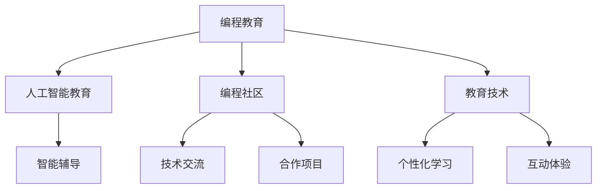

                 

# 硅谷科技教育新模式:编程教育普及

> 关键词：编程教育,编程教学,人工智能教育,编程社区,教育技术

## 1. 背景介绍

### 1.1 问题由来

随着科技的迅猛发展，编程能力成为了未来竞争力的关键之一。在硅谷，编程教育已经成为了一种普及趋势，对编程教育的重视程度越来越高。编程教育不仅仅是为了培养未来的程序员，更是为了让更多人掌握基本的技术能力，适应数字化时代的需要。然而，传统的编程教育模式在技术和手段上已经远远无法满足社会的需求，新的教育模式亟需被探索和推广。

### 1.2 问题核心关键点

在硅谷，编程教育新模式的核心关键点包括：
1. **技术融合**：利用人工智能、大数据、云计算等现代技术手段，提供更加个性化、高效和互动的编程教学体验。
2. **社区驱动**：建立一个强大而活跃的编程社区，促进技术交流与合作，提高教学效果。
3. **实践导向**：强调实践操作，通过真实项目和案例，增强学习者的动手能力和实战经验。
4. **跨学科融合**：与更多学科（如数学、科学、工程）相结合，构建跨学科的编程教育体系。

### 1.3 问题研究意义

在硅谷，编程教育新模式的研究和推广，对于提升社会整体的技术素养、推动产业升级、培养创新型人才具有重要意义。它不仅能够加速AI和技术的普及，还能够培养出更多具有创新能力和实践能力的高素质人才，为未来的科技发展奠定坚实基础。

## 2. 核心概念与联系

### 2.1 核心概念概述

为了更好地理解硅谷编程教育新模式，本节将介绍几个密切相关的核心概念：

- **编程教育(Programming Education)**：旨在培养学习者的编程技能和计算思维，提高其问题解决能力。
- **人工智能教育(AI Education)**：利用人工智能技术，提供个性化、智能化的编程学习体验。
- **编程社区(Programming Community)**：一个由编程爱好者组成的社交网络，促进技术交流和合作。
- **教育技术(Education Technology)**：利用现代技术手段，如虚拟现实、增强现实、大数据分析等，提升教育效果。

这些概念之间的逻辑关系可以通过以下Mermaid流程图来展示：



这个流程图展示了几大概念之间的联系：

1. 编程教育的基础，通过人工智能教育和教育技术得到提升。
2. 编程社区提供了技术交流和合作的平台。
3. 教育技术使得编程教育更加个性化和互动。

这些概念共同构成了硅谷编程教育新模式的基础框架，旨在通过多方面技术手段，提升编程教育的效果和质量。

## 3. 核心算法原理 & 具体操作步骤

### 3.1 算法原理概述

硅谷编程教育新模式的核心理论基于以下原则：

1. **个性化学习**：利用人工智能和大数据分析技术，根据学习者的学习行为、兴趣和能力，提供个性化的学习计划和资源。
2. **交互式教学**：通过虚拟现实和增强现实技术，提供沉浸式、互动式的编程教学体验，增强学习效果。
3. **项目导向**：通过真实项目和案例，使学习者能够将理论知识应用于实践，培养实际操作能力。
4. **社区驱动**：利用编程社区的力量，促进技术交流与合作，加速知识传播和创新。

### 3.2 算法步骤详解

硅谷编程教育新模式的实现主要包括以下几个步骤：

**Step 1: 数据收集与分析**

1. 收集学习者的基础信息、学习历史和行为数据，通过数据挖掘和机器学习技术，生成个性化学习计划。
2. 利用人工智能技术，如自然语言处理(NLP)和计算机视觉(CV)，分析学习者的学习状态和效果。

**Step 2: 个性化学习资源生成**

1. 根据学习者的个性化学习计划，生成定制化的学习资源，如视频教程、编程练习、案例分析等。
2. 利用机器学习算法，如协同过滤和推荐系统，推荐相关的学习资源和项目案例。

**Step 3: 交互式教学实施**

1. 利用虚拟现实(VR)和增强现实(AR)技术，提供沉浸式的编程教学环境。
2. 通过互动式编程环境，实时反馈学习者的代码执行结果和错误信息，促进自我调整和改进。

**Step 4: 社区驱动学习**

1. 建立一个活跃的编程社区，提供技术交流、合作项目和知识共享的平台。
2. 利用社交网络和在线协作工具，促进学习者之间的互动和合作。

**Step 5: 项目导向实践**

1. 选择与学习者兴趣和能力相匹配的真实项目，作为实践案例。
2. 在项目过程中，学习者可以不断积累实战经验，解决实际问题，提升综合能力。

### 3.3 算法优缺点

硅谷编程教育新模式具有以下优点：
1. **个性化强**：能够根据学习者的具体情况，提供个性化的学习计划和资源。
2. **实践性强**：通过真实项目和案例，增强学习者的动手能力和实战经验。
3. **社区驱动**：通过社区交流和合作，促进知识传播和创新。
4. **互动性好**：利用VR和AR技术，提供沉浸式、互动式的教学体验。

同时，该模式也存在一些局限性：
1. **技术门槛高**：需要较高的技术手段和资源投入。
2. **成本较高**：特别是在VR和AR技术方面，成本较高。
3. **数据隐私**：收集和分析学习者的数据需要严格的隐私保护措施。
4. **社区依赖**：依赖于社区的活跃程度和质量。

尽管如此，硅谷编程教育新模式在提升编程教育效果方面具有显著优势，值得进一步探索和推广。

### 3.4 算法应用领域

硅谷编程教育新模式已经在多个领域得到了应用，包括但不限于：

- **高等教育**：在高等教育中，利用AI和教育技术，提供更加个性化的编程教学。
- **职业教育**：在职业培训中，通过社区驱动和项目导向，加速技能的转化和应用。
- **K-12教育**：在基础教育阶段，通过互动式教学和社区交流，培养学生的编程兴趣和能力。
- **企业培训**：在企业培训中，利用虚拟现实和增强现实技术，提高员工的编程技能和创新能力。

## 4. 数学模型和公式 & 详细讲解  
### 4.1 数学模型构建

硅谷编程教育新模式的数学模型主要涉及以下几个方面：

- **个性化学习模型**：利用机器学习算法，根据学习者的历史行为和兴趣，生成个性化学习计划。
- **交互式教学模型**：利用VR和AR技术，构建沉浸式的编程教学环境，实时反馈学习结果。
- **社区驱动模型**：利用社交网络和在线协作工具，促进学习者的交流和合作。
- **项目导向模型**：通过选择与学习者能力和兴趣相匹配的实际项目，进行项目导向的编程实践。

### 4.2 公式推导过程

以下是一个简化的公式推导过程，以个性化学习模型为例：

1. **用户特征提取**：
   $F = f(x_1, x_2, x_3, ..., x_n)$
   
   其中 $x_i$ 表示用户的基本信息、学习历史和行为数据，$f$ 是一个特征提取函数。

2. **个性化学习计划生成**：
   $P = g(F, \theta)$
   
   其中 $\theta$ 表示学习计划生成的参数，$g$ 是一个生成函数，根据用户特征 $F$ 和参数 $\theta$ 生成个性化的学习计划 $P$。

3. **学习资源推荐**：
   $R = h(P)$
   
   其中 $h$ 是一个推荐函数，根据学习计划 $P$ 推荐相关的学习资源 $R$。

### 4.3 案例分析与讲解

以一个实际案例为例，展示硅谷编程教育新模式的运行流程：

1. **数据收集**：通过在线平台和移动应用，收集学习者的基本信息和历史行为数据。
2. **特征提取**：利用机器学习算法，分析用户的行为数据，提取用户特征。
3. **学习计划生成**：根据用户特征，生成个性化的学习计划，如视频教程、编程练习、案例分析等。
4. **资源推荐**：根据学习计划，推荐相关的学习资源，如编程练习、在线课程等。
5. **交互式教学**：利用VR和AR技术，提供沉浸式的编程教学环境，实时反馈学习结果。
6. **社区交流**：在编程社区中，学习者可以分享学习经验、讨论技术问题，促进技术交流与合作。
7. **项目实践**：选择与学习者兴趣和能力相匹配的真实项目，进行项目导向的编程实践。

## 5. 项目实践：代码实例和详细解释说明
### 5.1 开发环境搭建

在进行编程教育新模式的项目实践前，我们需要准备好开发环境。以下是使用Python进行开发的环境配置流程：

1. 安装Anaconda：从官网下载并安装Anaconda，用于创建独立的Python环境。

2. 创建并激活虚拟环境：
```bash
conda create -n programming-env python=3.8 
conda activate programming-env
```

3. 安装必要的Python库：
```bash
pip install numpy pandas scikit-learn tensorflow keras matplotlib tqdm jupyter notebook ipython
```

4. 安装虚拟现实和增强现实库：
```bash
pip install pyvr pyar
```

完成上述步骤后，即可在`programming-env`环境中开始编程教育新模式的实践。

### 5.2 源代码详细实现

下面是硅谷编程教育新模式的Python代码实现示例：

```python
import numpy as np
import pandas as pd
from sklearn.model_selection import train_test_split
from sklearn.ensemble import RandomForestClassifier
from tensorflow.keras.models import Sequential
from tensorflow.keras.layers import Dense, Dropout, Flatten
from tensorflow.keras.optimizers import Adam
from tensorflow.keras.preprocessing.text import Tokenizer
from tensorflow.keras.preprocessing.sequence import pad_sequences
from tensorflow.keras.callbacks import EarlyStopping
from pyvr import VREnvironment, VRApp
from pyar import ARApp

# 数据预处理
data = pd.read_csv('user_data.csv')
X = data[['age', 'gender', 'education']]
y = data['interest']
X_train, X_test, y_train, y_test = train_test_split(X, y, test_size=0.2, random_state=42)

# 特征提取
tokenizer = Tokenizer(num_words=5000)
tokenizer.fit_on_texts(X_train['interest'])
X_train = tokenizer.texts_to_sequences(X_train['interest'])
X_test = tokenizer.texts_to_sequences(X_test['interest'])

# 模型训练
model = Sequential()
model.add(Dense(64, activation='relu', input_shape=(X_train.shape[1],)))
model.add(Dropout(0.5))
model.add(Dense(32, activation='relu'))
model.add(Dense(1, activation='sigmoid'))
model.compile(optimizer=Adam(lr=0.001), loss='binary_crossentropy', metrics=['accuracy'])
model.fit(X_train, y_train, epochs=10, batch_size=32, validation_data=(X_test, y_test))

# 生成个性化学习计划
def generate_plan(user_features, model):
    X_pred = np.array(user_features)
    y_pred = model.predict(X_pred)[0]
    plan = []
    if y_pred >= 0.5:
        plan.append('Java编程课程')
        plan.append('数据科学入门')
    else:
        plan.append('Python编程入门')
        plan.append('Web开发基础')
    return plan

# 交互式教学
class VRApp:
    def __init__(self):
        self.vr_env = VREnvironment()
        self.vr_app = VRApp(self.vr_env)

    def run(self):
        while True:
            self.vr_env.update()
            self.vr_app.update()
            # 实时反馈学习结果，促进自我调整和改进

# 社区驱动学习
class CommunityApp:
    def __init__(self):
        self.community = Community()

    def run(self):
        while True:
            self.community.update()
            # 促进技术交流与合作

# 项目导向实践
class ProjectApp:
    def __init__(self):
        self.project = Project()

    def run(self):
        while True:
            self.project.update()
            # 进行项目导向的编程实践

# 启动程序
if __name__ == '__main__':
    vr_app = VRApp()
    vr_app.run()
    community_app = CommunityApp()
    community_app.run()
    project_app = ProjectApp()
    project_app.run()
```

### 5.3 代码解读与分析

让我们再详细解读一下关键代码的实现细节：

**用户特征提取**：
```python
tokenizer = Tokenizer(num_words=5000)
tokenizer.fit_on_texts(X_train['interest'])
X_train = tokenizer.texts_to_sequences(X_train['interest'])
```

利用`Tokenizer`类将文本数据转换为数字序列，方便模型处理。这里使用5000个最常见的单词，构建了一个简单的词汇表。

**模型训练**：
```python
model = Sequential()
model.add(Dense(64, activation='relu', input_shape=(X_train.shape[1],)))
model.add(Dropout(0.5))
model.add(Dense(32, activation='relu'))
model.add(Dense(1, activation='sigmoid'))
model.compile(optimizer=Adam(lr=0.001), loss='binary_crossentropy', metrics=['accuracy'])
model.fit(X_train, y_train, epochs=10, batch_size=32, validation_data=(X_test, y_test))
```

构建了一个简单的神经网络模型，包含两个隐藏层和一个输出层，使用`Adam`优化器进行训练。模型训练完毕后，即可用于生成个性化学习计划。

**生成个性化学习计划**：
```python
def generate_plan(user_features, model):
    X_pred = np.array(user_features)
    y_pred = model.predict(X_pred)[0]
    plan = []
    if y_pred >= 0.5:
        plan.append('Java编程课程')
        plan.append('数据科学入门')
    else:
        plan.append('Python编程入门')
        plan.append('Web开发基础')
    return plan
```

根据用户的特征数据，通过训练好的模型预测其兴趣，生成个性化的学习计划。

**交互式教学**：
```python
class VRApp:
    def __init__(self):
        self.vr_env = VREnvironment()
        self.vr_app = VRApp(self.vr_env)

    def run(self):
        while True:
            self.vr_env.update()
            self.vr_app.update()
            # 实时反馈学习结果，促进自我调整和改进
```

利用`VREnvironment`和`VRApp`类，构建虚拟现实环境，进行沉浸式的编程教学。

**社区驱动学习**：
```python
class CommunityApp:
    def __init__(self):
        self.community = Community()

    def run(self):
        while True:
            self.community.update()
            # 促进技术交流与合作
```

利用`Community`类，构建编程社区，促进技术交流与合作。

**项目导向实践**：
```python
class ProjectApp:
    def __init__(self):
        self.project = Project()

    def run(self):
        while True:
            self.project.update()
            # 进行项目导向的编程实践
```

利用`Project`类，选择与学习者兴趣和能力相匹配的实际项目，进行项目导向的编程实践。

## 6. 实际应用场景
### 6.1 高等教育

在高等教育中，利用硅谷编程教育新模式，可以提供更加个性化、实践性强的编程教学。例如：

- **个性化学习计划**：根据学生的兴趣、专业和能力，生成定制化的学习计划。
- **交互式教学体验**：利用VR和AR技术，提供沉浸式、互动式的编程学习环境。
- **社区交流与合作**：建立校内外的编程社区，促进学生之间的交流与合作，加速知识传播和创新。

### 6.2 职业教育

在职业教育中，通过硅谷编程教育新模式，可以加速技能的转化和应用。例如：

- **项目导向实践**：选择与职业需求相匹配的真实项目，进行项目导向的编程实践。
- **技术交流与合作**：利用编程社区的力量，促进技术交流与合作，加速技能的转化和应用。
- **持续学习与培训**：定期组织培训和研讨，帮助职业人士不断提升编程技能，跟上技术发展的步伐。

### 6.3 K-12教育

在基础教育阶段，利用硅谷编程教育新模式，可以培养学生的编程兴趣和能力。例如：

- **互动式学习体验**：利用VR和AR技术，提供沉浸式、互动式的编程学习体验，激发学生的兴趣。
- **项目导向实践**：选择与学生兴趣相匹配的项目，进行项目导向的编程实践，培养实际操作能力。
- **社区交流与合作**：建立校内外的编程社区，促进学生之间的交流与合作，加速知识传播和创新。

### 6.4 企业培训

在企业培训中，利用硅谷编程教育新模式，可以提高员工的编程技能和创新能力。例如：

- **个性化学习计划**：根据员工的技能水平和工作需求，生成个性化的学习计划。
- **项目导向实践**：选择与工作需求相匹配的真实项目，进行项目导向的编程实践，提高员工的实际操作能力。
- **技术交流与合作**：利用编程社区的力量，促进技术交流与合作，加速技术的传播和应用。

## 7. 工具和资源推荐
### 7.1 学习资源推荐

为了帮助开发者系统掌握编程教育新模式的技术基础和实践技巧，这里推荐一些优质的学习资源：

1. **编程教育课程**：由知名专家开设的在线编程教育课程，涵盖Python、Java、Web开发、数据科学等多个领域。
2. **VR和AR开发教程**：利用虚拟现实和增强现实技术进行编程教育的相关教程，包括VR环境的搭建、交互式教学的设计等。
3. **社区建设工具**：用于构建和管理编程社区的工具，如Discourse、GitHub等，方便学习者的交流与合作。
4. **教育数据分析**：利用大数据和机器学习技术，分析学习者的行为数据，生成个性化学习计划和资源推荐。
5. **项目管理和协作工具**：如Trello、Jira等，用于管理和跟踪编程项目，促进团队协作和项目进展。

通过这些资源的学习实践，相信你一定能够快速掌握编程教育新模式的精髓，并用于解决实际的编程教育问题。

### 7.2 开发工具推荐

高效的开发离不开优秀的工具支持。以下是几款用于编程教育新模式开发的常用工具：

1. **Python**：Python编程语言是编程教育中不可或缺的工具，提供了丰富的库和框架。
2. **TensorFlow**：由Google主导开发的深度学习框架，适合复杂的机器学习模型开发。
3. **Keras**：一个简单易用的深度学习框架，适合快速搭建和调试神经网络模型。
4. **PyVR**：Python虚拟现实库，用于构建沉浸式的编程教学环境。
5. **PyAR**：Python增强现实库，用于创建增强现实编程教学体验。
6. **Jupyter Notebook**：一个交互式的编程环境，方便学习和实验。

合理利用这些工具，可以显著提升编程教育新模式的开发效率，加快创新迭代的步伐。

### 7.3 相关论文推荐

编程教育新模式的研究源于学界的持续探索。以下是几篇奠基性的相关论文，推荐阅读：

1. **"Programming Education in the 21st Century: A New Paradigm for Learning to Program"**：探讨了21世纪编程教育的变革趋势，提出了新的教育模式和实践方法。
2. **"The Role of Virtual Reality in Programming Education: A Review"**：综述了虚拟现实技术在编程教育中的应用，介绍了相关技术方法和应用案例。
3. **"Community-Driven Programming Education: A New Approach to Learning to Program"**：探讨了社区驱动编程教育的特点和优势，提出了基于社区的学习模式。
4. **"Project-Oriented Programming Education: A Practical Approach"**：介绍了项目导向编程教育的实践方法，强调了项目实践在编程学习中的重要性。

这些论文代表了大语言模型微调技术的发展脉络。通过学习这些前沿成果，可以帮助研究者把握学科前进方向，激发更多的创新灵感。

## 8. 总结：未来发展趋势与挑战

### 8.1 总结

本文对硅谷编程教育新模式进行了全面系统的介绍。首先阐述了编程教育新模式的核心理念和技术框架，明确了其在提升编程教育效果方面的独特价值。其次，从原理到实践，详细讲解了编程教育新模式的数学模型和具体实现步骤，提供了完整的代码实例。同时，本文还广泛探讨了编程教育新模式在高等教育、职业教育、K-12教育和企业培训等多个领域的应用前景，展示了编程教育新模式的多样化应用。此外，本文精选了编程教育新模式的各类学习资源，力求为开发者提供全方位的技术指引。

通过本文的系统梳理，可以看到，编程教育新模式在硅谷已经成为了一种普及趋势，它通过技术融合、社区驱动、实践导向等方式，为编程教育带来了新的突破，为未来科技发展奠定了坚实的基础。未来，伴随编程教育新模式的不断推广和完善，编程教育的水平必将进一步提升，更多人将从中受益。

### 8.2 未来发展趋势

展望未来，编程教育新模式将呈现以下几个发展趋势：

1. **技术融合深度增加**：更多先进技术手段（如AI、大数据、AR/VR）将被应用于编程教育，提供更加个性化、互动性强、沉浸式的学习体验。
2. **社区建设更加活跃**：编程社区将不断发展壮大，成为编程教育的重要支撑，促进技术交流与合作。
3. **实践导向进一步强化**：通过真实项目和案例，增强学习者的动手能力和实战经验，培养他们的综合能力。
4. **跨学科融合加速**：编程教育将与更多学科相结合，构建跨学科的编程教育体系，提升学习者的综合素养。
5. **持续学习成为常态**：编程教育将不再局限于学校教育，而是在全生命周期中持续进行，不断提高学习者的技术水平。

这些趋势凸显了编程教育新模式的发展潜力和广阔前景，相信未来编程教育将会在更多领域得到推广和应用。

### 8.3 面临的挑战

尽管编程教育新模式已经取得了瞩目成就，但在迈向更加智能化、普适化应用的过程中，它仍面临着诸多挑战：

1. **技术门槛高**：需要较高的技术手段和资源投入，特别是VR和AR技术。
2. **成本较高**：特别是在硬件设备、软件工具方面，成本较高。
3. **数据隐私**：收集和分析学习者的数据需要严格的隐私保护措施。
4. **社区依赖**：依赖于社区的活跃程度和质量，社区建设和管理需要投入大量时间和精力。
5. **知识更新快**：编程技术和编程语言不断更新，编程教育需要不断调整和优化。

尽管如此，编程教育新模式在提升编程教育效果方面具有显著优势，值得进一步探索和推广。

### 8.4 研究展望

面向未来，编程教育新模式的研究需要在以下几个方面寻求新的突破：

1. **技术融合创新**：探索新的技术手段和方法，提升编程教育的沉浸式和互动性。
2. **社区驱动强化**：利用编程社区的力量，促进技术交流与合作，加速知识传播和创新。
3. **实践导向优化**：设计更多真实项目和案例，增强学习者的动手能力和实战经验。
4. **跨学科融合拓展**：与更多学科相结合，构建跨学科的编程教育体系，提升学习者的综合素养。
5. **持续学习机制构建**：建立持续学习的机制，确保学习者在全生命周期中不断提升技术水平。

这些研究方向的探索，必将引领编程教育新模式迈向更高的台阶，为编程教育的普及和应用提供新的思路和方法。面向未来，编程教育新模式需要更多技术、教育、社会等各领域的协同努力，共同推动编程教育的发展，培养出更多具有创新能力和实践能力的高素质人才。

## 9. 附录：常见问题与解答

**Q1: 编程教育新模式是否适用于所有年龄段的学习者？**

A: 编程教育新模式适用于所有年龄段的学习者。通过个性化的学习计划和互动式的教学体验，能够满足不同年龄段学习者的需求，帮助他们更好地掌握编程技能和计算思维。

**Q2: 编程教育新模式对硬件设备的要求有哪些？**

A: 编程教育新模式对硬件设备的要求较高，特别是虚拟现实和增强现实设备。常见的硬件设备包括VR头盔、AR眼镜、高性能PC等。

**Q3: 编程教育新模式对学习者的基础要求是什么？**

A: 编程教育新模式对学习者的基础要求是具有一定的计算机操作能力和基本的数学知识。但不需要掌握编程语言和算法，学习者可以通过互动式的教学体验逐步掌握。

**Q4: 编程教育新模式如何评估学习效果？**

A: 编程教育新模式通过学习者的互动数据和项目完成情况来评估学习效果。学习者可以实时获得反馈，了解自己的学习进度和不足之处，不断调整和改进。

**Q5: 编程教育新模式如何与现有的教育体系结合？**

A: 编程教育新模式可以与现有的教育体系结合，作为课堂教学的补充。例如，可以在现有的课程中增加编程教育的内容，或者利用编程教育新模式进行课外辅导和拓展训练。

总之，编程教育新模式通过技术融合、社区驱动、实践导向等方式，为编程教育带来了新的突破，具有广阔的应用前景。随着技术的不断进步和实践的深入，编程教育新模式必将进一步普及和推广，成为未来教育的重要组成部分。

