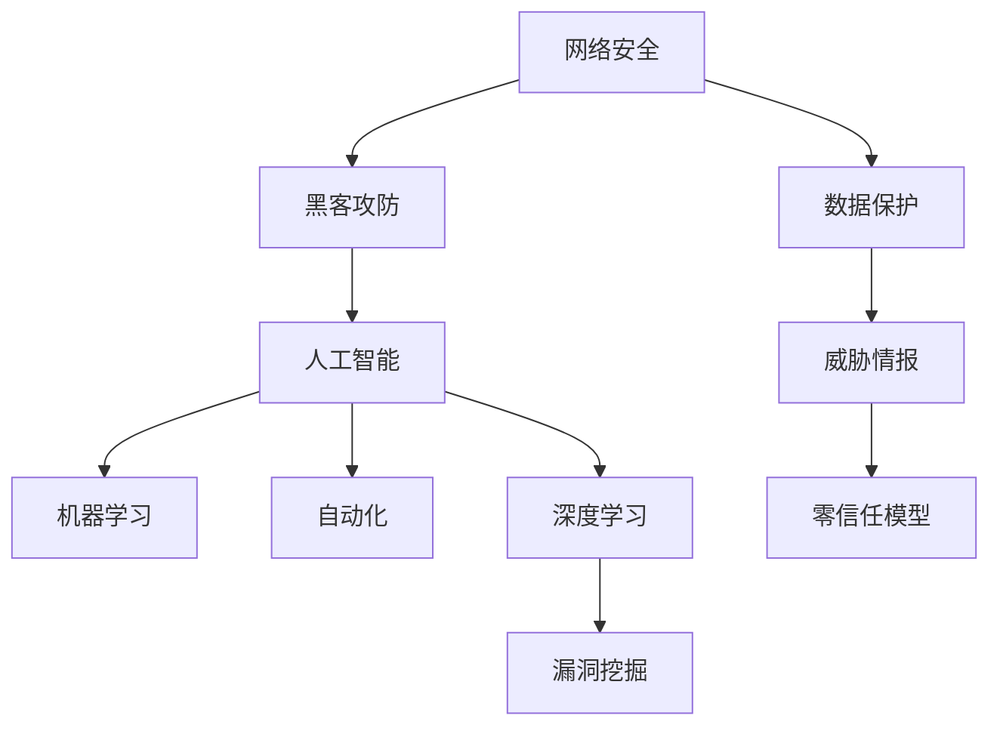

                 

# 硅谷网络安全:黑客攻防与数据保护

> 关键词：网络安全,数据保护,黑客攻防,人工智能,机器学习,自动化,深度学习,漏洞挖掘,威胁情报,零信任模型

## 1. 背景介绍

### 1.1 问题由来
近年来，随着互联网技术的高速发展，网络安全事件愈发频繁，各类企业和机构的网络安全风险也日益严峻。从2006年雅虎500万用户密码泄露事件，到2017年Equifax数据泄露影响1.43亿用户的惨痛教训，网络安全问题已经成为全球关注的焦点。硅谷作为全球科技创新中心，一直以来都是网络黑客和攻击者的重要目标。为应对不断升级的威胁，硅谷各大科技公司纷纷在网络安全领域投入大量资源，不断探索新的技术和方法。

### 1.2 问题核心关键点
网络安全是一个复杂而广泛的领域，涵盖了防御、检测、响应等多个方面。黑客攻击手段层出不穷，从SQL注入、跨站脚本攻击到DDoS攻击、零日漏洞利用，其形式和规模都日渐复杂化。为了有效应对这些挑战，需要综合采用多种技术和方法，包括入侵检测、漏洞管理、威胁情报分析等，构建一个多层防御体系，确保数据的安全性和完整性。

## 2. 核心概念与联系

### 2.1 核心概念概述

为更好地理解硅谷网络安全技术，本节将介绍几个密切相关的核心概念：

- **网络安全**：确保网络和数据不被未授权访问、攻击、篡改和泄露的过程。
- **数据保护**：保护敏感数据不被非法获取、篡改或泄露的措施。
- **黑客攻防**：黑客对系统进行攻击与防御技术之间的较量。
- **人工智能(AI)**：利用机器学习、深度学习等算法，提升网络安全检测和防御能力。
- **机器学习(ML)**：通过数据驱动的方法，使计算机系统具备学习能力和预测能力，用于识别和防范威胁。
- **自动化(AutoML)**：利用自动化技术，自动完成模型训练、调参等过程，提升网络安全检测效率。
- **深度学习(Deep Learning)**：一种机器学习技术，通过多层次的非线性变换，学习数据的高维特征表示，用于异常检测和漏洞挖掘。
- **漏洞挖掘**：通过自动化工具和人工分析，挖掘和修复系统中的安全漏洞，防止攻击者利用。
- **威胁情报**：收集和分析网络威胁数据，预测和防范未来的攻击行为。
- **零信任模型**：假设网络中任何主体都是不可信的，采取严格的认证和授权措施，防止内部和外部的攻击。

这些核心概念之间的逻辑关系可以通过以下Mermaid流程图来展示：



这个流程图展示了大语言模型的核心概念及其之间的关系：

1. 网络安全作为目标，数据保护是实现目标的关键手段。
2. 黑客攻防与数据保护、网络安全相互对抗，是网络安全防御的核心。
3. 人工智能、机器学习和深度学习等技术，用于提升网络安全的检测和防御能力。
4. 自动化技术用于加速模型的训练和调参，提升检测效率。
5. 漏洞挖掘和威胁情报分析，用于提升系统安全性和预测攻击行为。
6. 零信任模型通过严格的认证和授权措施，增强网络安全的可靠性。

这些概念共同构成了硅谷网络安全的框架，使硅谷在应对各类网络威胁时具备了强大的技术储备和实践经验。通过理解这些核心概念，我们可以更好地把握硅谷网络安全的复杂性和先进性。

## 3. 核心算法原理 & 具体操作步骤
### 3.1 算法原理概述

硅谷网络安全技术的核心算法原理主要基于机器学习和深度学习技术。其基本思想是利用历史数据和模型训练，识别网络中的异常行为和潜在威胁，从而实现主动防御和实时检测。

机器学习算法通过分析大量的历史数据，学习正常的网络行为模式，并对新数据进行预测和分类。常用的算法包括：

- **监督学习**：利用标注数据进行模型训练，能够有效地识别和分类网络中的已知威胁。
- **无监督学习**：不需要标注数据，通过聚类和降维等方法，发现数据中的异常模式。
- **强化学习**：通过模拟和奖励机制，使模型在交互中不断优化策略，提升防御能力。

深度学习技术通过多层次的非线性变换，学习数据的复杂特征表示，用于异常检测和漏洞挖掘。其主要算法包括：

- **卷积神经网络(CNN)**：用于图像和文本数据的特征提取。
- **循环神经网络(RNN)**：用于时间序列数据的分析，能够处理序列数据中的复杂依赖关系。
- **生成对抗网络(GAN)**：用于生成攻击样本和伪造数据，模拟攻击行为。

基于这些算法，硅谷各大公司开发了众多网络安全工具和系统，如IDS、IPS、防火墙、入侵检测系统等，以提升网络的安全性和防御能力。

### 3.2 算法步骤详解

以下是硅谷网络安全技术的基本流程：

1. **数据收集与预处理**：收集网络流量、日志、日志等数据，并进行清洗和预处理，去除无用信息和噪声。

2. **特征提取**：利用机器学习和深度学习算法，提取网络数据的特征表示。常用的特征提取方法包括：
   - **特征选择**：选择与威胁检测相关的特征，去除冗余和无关特征。
   - **特征降维**：利用PCA、LDA等方法，将高维数据降到低维空间，简化模型。
   - **特征增强**：通过时间序列分析、统计分析等方法，增强特征表达能力。

3. **模型训练与调参**：利用历史数据训练机器学习或深度学习模型，并使用自动化调参技术优化模型参数。

4. **异常检测与分类**：利用训练好的模型对新数据进行检测和分类，识别异常行为和威胁。

5. **告警与响应**：根据检测结果，及时发出告警并采取相应的防御措施，如封锁IP、禁言账号等。

6. **持续学习与优化**：不断收集新数据，更新模型参数，提升模型的准确率和鲁棒性。

### 3.3 算法优缺点

硅谷网络安全技术的优点包括：

- **精度高**：机器学习和深度学习算法能够对网络数据进行精确的特征提取和分类。
- **自动化**：通过自动化调参技术，可以快速构建和优化模型，提升检测效率。
- **灵活性**：不同算法和模型可以灵活组合，适应不同场景和需求。
- **实时性**：利用高效的计算架构，实现实时异常检测和告警。

同时，这些技术也存在一些局限性：

- **数据依赖**：模型的性能高度依赖于标注数据的质量和数量，标注成本较高。
- **过拟合风险**：模型可能会过拟合历史数据，导致对新数据的泛化能力不足。
- **模型复杂**：深度学习模型参数较多，训练和推理资源消耗较大。
- **误报率高**：由于模型的不确定性和复杂性，可能产生较高的误报率。

### 3.4 算法应用领域

硅谷网络安全技术在多个领域得到了广泛应用，包括但不限于：

- **入侵检测系统(IDS)**：通过检测网络流量中的异常行为，识别入侵和攻击行为。
- **入侵防御系统(IPS)**：在检测到攻击时，自动采取防御措施，阻止攻击行为。
- **防火墙**：根据规则过滤和控制网络流量，防止未授权访问。
- **威胁情报分析**：收集和分析全球范围内的网络威胁数据，预测未来的攻击行为。
- **零信任模型**：假设所有网络行为都是不可信的，采取严格的认证和授权措施，防止内部和外部攻击。
- **漏洞管理**：自动化扫描和修复系统漏洞，增强系统的安全性。

## 4. 数学模型和公式 & 详细讲解 & 举例说明（备注：数学公式请使用latex格式，latex嵌入文中独立段落使用 $$，段落内使用 $)
### 4.1 数学模型构建

在网络安全领域，常用的数学模型包括：

- **逻辑回归模型**：用于分类任务，预测网络流量是否为异常。
- **支持向量机(SVM)**：用于分类和回归任务，能够处理高维数据。
- **随机森林(Random Forest)**：用于分类和回归任务，具有较好的泛化能力和鲁棒性。
- **卷积神经网络(CNN)**：用于图像和文本数据的特征提取。
- **循环神经网络(RNN)**：用于时间序列数据的分析。

### 4.2 公式推导过程

以逻辑回归模型为例，其公式推导如下：

假设网络流量数据的特征向量为 $x$，类别标签为 $y$，模型参数为 $w$ 和 $b$，则逻辑回归模型的预测公式为：

$$
\hat{y} = \sigma(w^Tx + b)
$$

其中 $\sigma(z)$ 为sigmoid函数，将输出映射到 $[0,1]$ 区间。

模型的损失函数为交叉熵损失，公式如下：

$$
\mathcal{L} = -\frac{1}{N}\sum_{i=1}^N [y_i\log\hat{y_i} + (1-y_i)\log(1-\hat{y_i})]
$$

利用梯度下降算法，最小化损失函数，得到模型的参数更新公式：

$$
w \leftarrow w - \frac{\alpha}{N}\sum_{i=1}^N [y_i(\hat{y_i} - y_i)x_i]
$$
$$
b \leftarrow b - \frac{\alpha}{N}\sum_{i=1}^N (\hat{y_i} - y_i)
$$

其中 $\alpha$ 为学习率，$N$ 为样本数。

### 4.3 案例分析与讲解

以DDoS攻击检测为例，我们利用逻辑回归模型进行检测。假设我们收集了1000个正常的网络流量样本 $x_1,...,x_{1000}$，以及100个DDoS攻击样本 $x_{1001},...,x_{1100}$。通过对这些样本进行特征提取和处理，得到特征矩阵 $X$ 和标签向量 $Y$。

接下来，我们使用逻辑回归模型进行训练和预测。首先，构建损失函数 $\mathcal{L}$，并计算梯度：

$$
\frac{\partial \mathcal{L}}{\partial w} = \frac{1}{N}\sum_{i=1}^N [(y_i - \hat{y_i})x_i]
$$
$$
\frac{\partial \mathcal{L}}{\partial b} = \frac{1}{N}\sum_{i=1}^N (\hat{y_i} - y_i)
$$

然后，使用梯度下降算法更新模型参数 $w$ 和 $b$：

$$
w \leftarrow w - \frac{\alpha}{N}\sum_{i=1}^N [(y_i - \hat{y_i})x_i]
$$
$$
b \leftarrow b - \frac{\alpha}{N}\sum_{i=1}^N (\hat{y_i} - y_i)
$$

重复以上步骤，直至模型收敛。最终得到的逻辑回归模型可以用于检测新样本是否为DDoS攻击。

## 5. 项目实践：代码实例和详细解释说明
### 5.1 开发环境搭建

在进行网络安全技术实践前，我们需要准备好开发环境。以下是使用Python进行TensorFlow开发的环境配置流程：

1. 安装Anaconda：从官网下载并安装Anaconda，用于创建独立的Python环境。

2. 创建并激活虚拟环境：
```bash
conda create -n tf-env python=3.8 
conda activate tf-env
```

3. 安装TensorFlow：根据CUDA版本，从官网获取对应的安装命令。例如：
```bash
conda install tensorflow==2.6 -c tf
```

4. 安装Keras：用于构建和训练深度学习模型。
```bash
pip install keras
```

5. 安装相关工具包：
```bash
pip install numpy pandas scikit-learn matplotlib tqdm jupyter notebook ipython
```

完成上述步骤后，即可在`tf-env`环境中开始网络安全技术的开发实践。

### 5.2 源代码详细实现

下面以DDoS攻击检测为例，给出使用TensorFlow构建逻辑回归模型的PyTorch代码实现。

首先，定义DDoS攻击检测的数据处理函数：

```python
import numpy as np
import pandas as pd
from sklearn.model_selection import train_test_split
from sklearn.preprocessing import StandardScaler

def load_data(file_path):
    data = pd.read_csv(file_path)
    x = data.drop('label', axis=1)
    y = data['label']
    x = StandardScaler().fit_transform(x)
    return x, y

def split_train_test(x, y, test_size=0.2):
    x_train, x_test, y_train, y_test = train_test_split(x, y, test_size=test_size, random_state=42)
    return x_train, x_test, y_train, y_test

def preprocess_data(x_train, x_test, y_train, y_test):
    scaler = StandardScaler()
    x_train = scaler.fit_transform(x_train)
    x_test = scaler.transform(x_test)
    return x_train, x_test, y_train, y_test
```

然后，定义模型和优化器：

```python
from tensorflow.keras.models import Sequential
from tensorflow.keras.layers import Dense
from tensorflow.keras.optimizers import Adam

model = Sequential([
    Dense(128, input_shape=(x_train.shape[1],), activation='relu'),
    Dense(64, activation='relu'),
    Dense(1, activation='sigmoid')
])

optimizer = Adam(lr=0.001)
```

接着，定义训练和评估函数：

```python
from tensorflow.keras.metrics import BinaryCrossentropy
from tensorflow.keras.callbacks import EarlyStopping

def train_model(model, x_train, y_train, x_test, y_test, epochs=10, batch_size=64):
    binary_crossentropy = BinaryCrossentropy()
    early_stopping = EarlyStopping(patience=3, restore_best_weights=True)
    
    model.compile(optimizer=optimizer, loss=binary_crossentropy, metrics=['accuracy'])
    model.fit(x_train, y_train, batch_size=batch_size, epochs=epochs, validation_data=(x_test, y_test), callbacks=[early_stopping])
    
    score = model.evaluate(x_test, y_test, verbose=0)
    print('Test loss:', score[0])
    print('Test accuracy:', score[1])

def evaluate_model(model, x_test, y_test, batch_size=64):
    score = model.evaluate(x_test, y_test, verbose=0)
    print('Test loss:', score[0])
    print('Test accuracy:', score[1])
```

最后，启动训练流程并在测试集上评估：

```python
x_train, x_test, y_train, y_test = split_train_test(x_train, y_train)
x_train, x_test, y_train, y_test = preprocess_data(x_train, x_test, y_train, y_test)

train_model(model, x_train, y_train, x_test, y_test)
evaluate_model(model, x_test, y_test)
```

以上就是使用TensorFlow对DDoS攻击检测进行逻辑回归模型微调的PyTorch代码实现。可以看到，TensorFlow的高级API使得模型构建和训练过程变得非常简单。

### 5.3 代码解读与分析

让我们再详细解读一下关键代码的实现细节：

**load_data函数**：
- 定义了数据加载和预处理函数，用于读取数据、提取特征、进行标准化处理。

**split_train_test函数**：
- 定义了数据集分割函数，将数据划分为训练集和测试集。

**preprocess_data函数**：
- 定义了数据预处理函数，对训练集和测试集进行标准化处理，确保模型在不同数据分布上的表现一致。

**train_model函数**：
- 定义了模型训练函数，使用了二分类交叉熵损失函数和Adam优化器，并在训练过程中加入了早期停止机制，防止过拟合。

**evaluate_model函数**：
- 定义了模型评估函数，用于计算模型在测试集上的损失和准确率。

**训练流程**：
- 首先进行数据集分割和预处理，得到训练集和测试集。
- 然后在训练集上训练模型，使用早期停止机制防止过拟合。
- 最后在测试集上评估模型，输出测试结果。

可以看到，TensorFlow使得模型构建和训练过程变得非常简单和高效，极大地方便了开发者进行网络安全技术的研究和应用。

当然，工业级的系统实现还需考虑更多因素，如模型的保存和部署、超参数的自动搜索、模型的解释性和可解释性等。但核心的微调范式基本与此类似。

## 6. 实际应用场景
### 6.1 智能入侵检测系统

智能入侵检测系统是硅谷网络安全技术的核心应用之一。传统的IDS系统主要依赖规则匹配和特征提取，无法有效识别新型和复杂的攻击行为。基于机器学习和深度学习的大规模入侵检测系统，可以通过历史数据和异常检测技术，实时识别和阻止各种类型的入侵行为。

在技术实现上，可以收集网络流量、日志等数据，构建特征向量。使用机器学习或深度学习算法对特征进行训练，得到异常检测模型。将模型部署到入侵检测系统中，实时监控网络流量，检测异常行为并发出告警。

### 6.2 漏洞管理平台

漏洞管理平台利用自动化技术，自动识别系统中的安全漏洞，并及时修复。其核心技术包括：

- **漏洞扫描**：通过自动化扫描工具，检测系统中的已知和未知漏洞。
- **漏洞分析**：利用机器学习算法，分析漏洞的性质和严重程度。
- **漏洞修复**：根据漏洞类型和级别，自动生成修复方案和代码补丁。

硅谷各大公司纷纷开发了漏洞管理平台，帮助IT人员及时发现和修复系统漏洞，降低安全风险。

### 6.3 威胁情报分析平台

威胁情报分析平台通过收集和分析全球范围内的网络威胁数据，预测未来的攻击行为，帮助企业提前准备应对措施。其核心技术包括：

- **数据收集**：通过爬虫、API等方式，收集全球网络威胁数据。
- **数据清洗**：对收集到的数据进行清洗和处理，去除无用信息和噪声。
- **数据分析**：利用机器学习和深度学习算法，对威胁数据进行分析，提取有用信息和特征。
- **预测预警**：根据分析结果，预测未来的攻击行为，及时发出预警。

硅谷的威胁情报分析平台已经成为全球网络安全的重要工具，为各类企业和机构提供了强有力的安全保障。

### 6.4 零信任模型实践

零信任模型假设网络中所有主体都是不可信的，采取严格的认证和授权措施，防止内部和外部攻击。其核心技术包括：

- **多因素认证**：通过生物识别、短信验证码等多种认证方式，增强系统的安全性。
- **动态授权**：根据用户的行为和背景信息，动态调整访问权限，防止内部滥用。
- **应用白名单**：只允许经过验证的应用程序访问系统资源，防止恶意软件入侵。

零信任模型已经成为现代网络安全的重要趋势，硅谷的各大公司纷纷引入零信任架构，提升系统的安全性和可靠性。

## 7. 工具和资源推荐
### 7.1 学习资源推荐

为了帮助开发者系统掌握网络安全技术的理论基础和实践技巧，这里推荐一些优质的学习资源：

1. 《网络安全基础》课程：由斯坦福大学开设的入门级课程，介绍了网络安全的基本概念和技术。
2. 《深度学习与网络安全》书籍：全面介绍了深度学习在网络安全中的应用，包括异常检测、漏洞挖掘等。
3. 《Kaggle网络安全竞赛》：利用公开的网络安全数据集，进行模型训练和评估，提升实战能力。
4. 《谷歌安全编程指南》：Google开发的编程指南，详细介绍了网络安全编码的最佳实践。
5. 《Cybersecurity Essentials》课程：由MIT开设的高级课程，深入探讨网络安全的理论和技术。

通过对这些资源的学习实践，相信你一定能够快速掌握网络安全技术的精髓，并用于解决实际的安全问题。
### 7.2 开发工具推荐

高效的开发离不开优秀的工具支持。以下是几款用于网络安全开发常用的工具：

1. TensorFlow：谷歌开发的深度学习框架，生产部署方便，适合大规模工程应用。
2. PyTorch：Facebook开发的深度学习框架，灵活动态，适合快速迭代研究。
3. Keras：谷歌开发的高级API，可以快速构建和训练深度学习模型。
4. Scikit-learn：Python科学计算库，提供了丰富的机器学习算法和工具。
5. NLTK：自然语言处理工具包，用于文本数据处理和分析。
6. OWASP ZAP：开源的网络安全测试工具，用于扫描和检测Web应用漏洞。
7. Burp Suite：流行的Web应用安全测试工具，用于渗透测试和漏洞分析。
8. Wireshark：流行的网络协议分析工具，用于网络流量分析。
9. ELK Stack：日志管理和分析平台，用于集中管理网络日志和监控告警。

合理利用这些工具，可以显著提升网络安全技术的开发效率，加快创新迭代的步伐。

### 7.3 相关论文推荐

网络安全技术的发展源于学界的持续研究。以下是几篇奠基性的相关论文，推荐阅读：

1. Deep Packet Inspection with Recurrent Neural Networks：提出使用RNN进行网络流量分类，提升了深度包检测的准确性。
2. Detecting and Responding to Advanced Persistent Threats in Cloud Environments：利用机器学习检测APT攻击，并自动化响应措施。
3. Threat Intellixture Analysis：提出一种基于多模态数据融合的威胁情报分析方法，提升了预测预警的准确性。
4. Automated Malware Analysis and Classification：利用机器学习和深度学习技术，自动化分析和分类恶意软件。
5. Cyber Threat Intelligence Analytics：提出一种基于图神经网络的威胁情报分析方法，提升了威胁检测和响应的效果。

这些论文代表了大语言模型微调技术的发展脉络。通过学习这些前沿成果，可以帮助研究者把握学科前进方向，激发更多的创新灵感。

## 8. 总结：未来发展趋势与挑战

### 8.1 总结

本文对硅谷网络安全技术进行了全面系统的介绍。首先阐述了网络安全问题的重要性，以及硅谷在网络安全领域的优势和实践经验。其次，从原理到实践，详细讲解了基于机器学习和深度学习的网络安全技术，给出了网络安全技术的完整代码实例。同时，本文还广泛探讨了网络安全技术在智能入侵检测、漏洞管理、威胁情报分析等多个领域的应用前景，展示了网络安全技术的广阔前景。最后，本文精选了网络安全技术的各类学习资源，力求为读者提供全方位的技术指引。

通过本文的系统梳理，可以看到，基于大语言模型的网络安全技术正在成为硅谷网络安全的重要范式，极大地提升了网络安全检测和防御能力。未来，伴随预训练语言模型和微调方法的持续演进，基于深度学习的网络安全技术必将进一步提升网络安全系统的性能和应用范围，为构建安全、可靠的网络环境提供强有力的技术支持。

### 8.2 未来发展趋势

展望未来，硅谷网络安全技术将呈现以下几个发展趋势：

1. 深度学习技术将广泛应用于异常检测、威胁情报分析等领域，提升网络安全的检测和防御能力。
2. 自动化和智能化技术将进一步发展，自动构建和优化模型，提升网络安全检测效率。
3. 多模态数据融合技术将广泛应用于网络威胁情报分析中，提升预测预警的准确性。
4. 零信任模型将得到更广泛的应用，增强网络安全系统的可靠性和安全性。
5. 区块链技术将应用于网络安全领域，提升身份认证和数据保护的安全性。
6. 数据加密和匿名化技术将得到更广泛的应用，保护用户隐私和数据安全。

以上趋势凸显了硅谷网络安全技术的未来发展方向。这些方向的探索发展，必将进一步提升网络安全系统的性能和应用范围，为构建安全、可靠的网络环境提供强有力的技术支持。

### 8.3 面临的挑战

尽管硅谷网络安全技术已经取得了瞩目成就，但在迈向更加智能化、普适化应用的过程中，它仍面临着诸多挑战：

1. 数据依赖：模型的性能高度依赖于标注数据的质量和数量，标注成本较高。
2. 过拟合风险：模型可能会过拟合历史数据，导致对新数据的泛化能力不足。
3. 模型复杂：深度学习模型参数较多，训练和推理资源消耗较大。
4. 误报率高：由于模型的不确定性和复杂性，可能产生较高的误报率。
5. 自动化不足：许多网络安全任务需要人工干预，自动化程度不够。
6. 技术门槛高：网络安全技术涉及多个领域，技术门槛较高，需要专业知识。

### 8.4 研究展望

面对网络安全技术面临的挑战，未来的研究需要在以下几个方面寻求新的突破：

1. 探索无监督和半监督学习技术，降低对标注数据的依赖。
2. 研究参数高效和计算高效的网络安全模型，提高检测效率。
3. 融合因果和对比学习范式，增强模型稳定性和泛化能力。
4. 引入更多先验知识，提升模型的解释性和可解释性。
5. 结合区块链和加密技术，提升身份认证和数据保护的安全性。
6. 探索基于零信任模型的网络安全架构，增强系统的可靠性和安全性。

这些研究方向的探索，必将引领网络安全技术迈向更高的台阶，为构建安全、可靠的网络环境提供更坚实的技术支撑。面向未来，网络安全技术还需要与其他人工智能技术进行更深入的融合，如知识表示、因果推理、强化学习等，多路径协同发力，共同推动网络安全技术的进步。只有勇于创新、敢于突破，才能不断拓展网络安全的边界，让安全技术更好地保护人类的数字资产和隐私。

## 9. 附录：常见问题与解答

**Q1：网络安全技术是否适用于所有类型的攻击？**

A: 网络安全技术主要适用于常见的已知攻击类型，如SQL注入、XSS攻击等。对于未知和零日攻击，传统的安全技术往往难以有效应对。需要结合威胁情报和机器学习技术，提升对未知攻击的检测和响应能力。

**Q2：网络安全技术是否可以应用于内部攻击？**

A: 网络安全技术主要用于检测和防御外部攻击，对于内部攻击，需要结合零信任模型、多因素认证等技术，增强系统的安全性。内部攻击往往更加隐蔽和复杂，需要综合使用多种技术和手段进行防范。

**Q3：网络安全技术是否可以应用于物联网(IoT)设备？**

A: 网络安全技术可以应用于IoT设备，通过设备管理和数据保护，提升IoT设备的安全性。但由于IoT设备的多样性和复杂性，需要结合设备自身特点，设计适合的安全策略。

**Q4：网络安全技术是否需要高超的技术门槛？**

A: 网络安全技术需要一定的技术门槛，但并不是无法入门。可以通过学习基础知识和实践工具，逐步掌握网络安全技术的基本应用。

**Q5：网络安全技术是否需要大量的人力和资源？**

A: 网络安全技术确实需要投入一定的人力和资源，特别是在初期阶段。但随着技术的成熟和应用推广，未来的网络安全技术将逐渐降低人力成本，提升效率和效果。

总之，网络安全技术需要不断的创新和优化，只有通过不断的实践和探索，才能在应对复杂的网络威胁中发挥重要作用，构建安全、可靠的网络环境。

