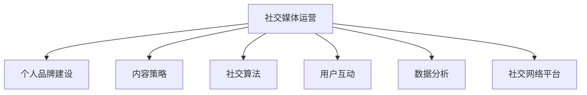

                 

# 社交媒体运营：在各平台建立强大的个人影响力

> 关键词：社交媒体, 个人品牌建设, 内容策略, 社交算法, 用户互动, 数据分析, 社交网络平台, 跨平台管理, 影响力提升, 社交电商, 营销自动化

## 1. 背景介绍

### 1.1 问题由来

社交媒体已成为个人品牌建设和市场营销的重要渠道，通过在各大平台上建立强大的个人影响力，可以大幅提升个人知名度、商业价值和社会影响力。从网红、博主、企业领袖到普通用户，越来越多人意识到在社交媒体上建立自己独特声音和品牌的重要性。然而，如何在众多平台上有效地运营个人账号、提升内容质量和用户互动、合理分配时间和资源，是众多社交媒体运营者面临的挑战。本文将探讨社交媒体运营的核心概念、核心算法、具体操作步骤、实际应用场景以及未来的发展趋势与挑战，为社交媒体运营者提供一套系统化、高效的运营策略。

## 2. 核心概念与联系

### 2.1 核心概念概述

为了更好地理解社交媒体运营，本节将介绍几个关键概念及其相互联系：

- **社交媒体运营**：通过在社交平台上发布内容、与用户互动，提升个人或品牌的知名度、影响力和商业价值的过程。

- **个人品牌建设**：在社交媒体上塑造和维护一个独特且一致的个人形象，建立用户对品牌信任和忠诚度。

- **内容策略**：制定和执行社交媒体上发布内容的计划，包括内容类型、发布频率和时机等。

- **社交算法**：社交平台根据用户行为和偏好，动态调整内容展现的算法，影响内容的曝光度和互动性。

- **用户互动**：通过评论、点赞、分享等方式与用户进行互动，增强用户粘性和社区感。

- **数据分析**：收集和分析社交媒体上的数据，优化运营策略，提升运营效果。

- **社交网络平台**：提供社交媒体服务的平台，包括Facebook、Twitter、Instagram、YouTube、LinkedIn等。

这些概念之间的逻辑关系可以通过以下Mermaid流程图来展示：



这个流程图展示出社交媒体运营的核心概念及其相互联系：

1. 社交媒体运营是一个系统工程，涉及个人品牌建设、内容策略、社交算法、用户互动和数据分析等多个方面。
2. 个人品牌建设是运营的基础，需要通过高质量的内容和持续的用户互动来塑造和维护。
3. 内容策略是运营的核心，决定内容类型和发布时机，直接影响用户互动和曝光度。
4. 社交算法是平台的核心竞争力，决定了内容在用户面前的展示方式，影响运营效果。
5. 用户互动是运营的难点，需要通过个性化互动增强用户粘性，构建社区感。
6. 数据分析是运营的指南针，通过数据反馈优化运营策略，提升运营效果。
7. 社交网络平台是运营的环境，决定了运营的渠道和用户群体。

这些概念共同构成了社交媒体运营的框架，帮助运营者系统地理解和优化其运营策略。

## 3. 核心算法原理 & 具体操作步骤

### 3.1 算法原理概述

社交媒体运营的算法原理主要基于以下几个方面：

- **协同过滤**：利用用户的行为数据（如点赞、评论、分享）进行推荐，找到与当前用户兴趣相似的其他用户或内容。

- **内容推荐算法**：通过分析用户的历史行为和偏好，预测用户可能感兴趣的内容，并进行推荐。

- **用户互动模型**：建立用户互动的模型，通过分析互动数据，预测用户的行为和偏好，进行个性化互动。

- **情感分析**：通过自然语言处理技术，分析用户评论和反馈中的情感倾向，优化内容策略和互动方式。

- **时间序列分析**：通过分析时间序列数据，预测内容的发布时机和用户活跃时段，提升内容曝光度和用户互动率。

### 3.2 算法步骤详解

社交媒体运营的算法步骤主要包括以下几个关键环节：

**Step 1: 数据收集与处理**

- 收集社交媒体平台上的用户行为数据，如点赞、评论、分享、互动时间等。
- 收集内容数据，如文章标题、正文、图片、视频等。
- 清洗和预处理数据，去除噪声和无关信息，构建数据集。

**Step 2: 用户行为分析**

- 利用协同过滤算法，找到与当前用户兴趣相似的其他用户，进行个性化推荐。
- 分析用户历史互动数据，建立用户兴趣和偏好模型，优化内容策略。
- 利用情感分析技术，分析用户评论和反馈中的情感倾向，调整内容策略和互动方式。

**Step 3: 内容推荐与优化**

- 利用内容推荐算法，对用户进行个性化内容推荐，提升用户粘性和互动率。
- 定期评估内容推荐效果，调整算法参数，优化推荐模型。

**Step 4: 用户互动与监控**

- 通过互动模型，预测用户的行为和偏好，进行个性化互动。
- 监控用户互动数据，及时发现异常行为，调整互动策略。

**Step 5: 数据分析与优化**

- 利用时间序列分析，预测内容发布时机和用户活跃时段，优化内容发布策略。
- 定期进行数据分析，评估运营效果，优化运营策略。

**Step 6: 跨平台管理与整合**

- 将数据和分析结果整合到统一的平台，进行跨平台管理和优化。
- 根据不同平台的用户行为和偏好，制定差异化的运营策略。

以上是社交媒体运营的主要算法步骤。在实际应用中，还需要根据具体平台的特点和用户需求，灵活应用上述算法，进行策略调整和优化。

### 3.3 算法优缺点

社交媒体运营算法的主要优点包括：

- **个性化推荐**：通过个性化推荐，提升用户粘性和互动率，增加用户转化率。
- **数据驱动决策**：通过数据分析，优化运营策略，提升运营效果。
- **自动化管理**：利用自动化工具，减少人工操作，提高运营效率。

然而，社交媒体运营算法也存在以下缺点：

- **数据隐私问题**：社交媒体平台的数据隐私问题，可能会引发用户隐私保护和合规问题。
- **算法偏见**：算法可能存在偏见，影响推荐结果的公平性和准确性。
- **动态变化**：社交媒体平台算法不断更新，需要持续调整运营策略。
- **过度依赖数据**：过度依赖数据和算法，可能导致运营策略缺乏灵活性。

尽管存在这些缺点，但总体而言，社交媒体运营算法仍是一种高效、系统化的运营方式，能够帮助运营者提升运营效果，实现跨平台管理。

### 3.4 算法应用领域

社交媒体运营算法广泛应用于以下领域：

- **品牌推广**：通过个性化推荐和互动，提升品牌知名度和用户转化率。
- **用户互动**：通过个性化互动，增强用户粘性和社区感，提升用户活跃度。
- **内容分发**：通过内容推荐算法，提升内容曝光度和用户互动率。
- **广告投放**：利用社交媒体平台的数据分析工具，优化广告投放策略，提升广告效果。
- **客户服务**：通过自动化工具和数据分析，提升客户服务质量和效率。

社交媒体运营算法在各个领域的应用，显著提升了运营效果，助力品牌和业务的增长。

## 4. 数学模型和公式 & 详细讲解 & 举例说明

### 4.1 数学模型构建

社交媒体运营的数学模型主要基于以下几个方面：

- **协同过滤模型**：基于用户行为数据，构建用户-物品的协同矩阵，进行相似度计算，推荐相似用户或物品。

- **内容推荐模型**：利用用户历史行为数据，构建用户-内容的相关矩阵，进行推荐。

- **情感分析模型**：利用自然语言处理技术，分析文本中的情感倾向，构建情感词典或情感分类模型。

- **时间序列模型**：利用时间序列数据，构建ARIMA模型或深度学习模型，预测内容发布时机和用户活跃时段。

### 4.2 公式推导过程

以下是社交媒体运营中几个关键模型的公式推导过程：

**协同过滤模型**

协同过滤模型基于用户-物品的协同矩阵，计算用户-物品的相似度，推荐相似用户或物品。协同矩阵 $C_{n\times m}$ 表示 $n$ 个用户和 $m$ 个物品的评分数据，用户-物品的相似度 $s(u,v)$ 计算公式如下：

$$
s(u,v)=\frac{\sum_{i=1}^n\sum_{j=1}^mC_{ui}\cdot C_{vj}}{\sqrt{\sum_{i=1}^nC_{ui}^2}\sqrt{\sum_{j=1}^mC_{vj}^2}}
$$

根据相似度 $s(u,v)$，推荐相似用户或物品。

**内容推荐模型**

内容推荐模型基于用户历史行为数据，构建用户-内容的协同矩阵 $C_{n\times m}$，推荐内容。假设用户 $u$ 对物品 $i$ 的评分 $C_{ui}$，内容推荐模型 $y_i$ 的预测公式如下：

$$
y_i=\frac{\sum_{j=1}^mC_{uj}\cdot C_{ji}}{\sqrt{\sum_{j=1}^mC_{uj}^2}\sqrt{\sum_{j=1}^mC_{ji}^2}}
$$

**情感分析模型**

情感分析模型基于文本中的情感词汇，计算文本的情感倾向。假设文本 $T$ 包含 $n$ 个情感词汇 $w_1, w_2, ..., w_n$，每个词汇的情感强度 $s_i$，文本情感倾向 $S$ 的计算公式如下：

$$
S=\sum_{i=1}^ns_i
$$

其中 $s_i$ 表示词汇 $w_i$ 的情感强度。

**时间序列模型**

时间序列模型利用时间序列数据，预测内容发布时机和用户活跃时段。假设时间序列数据 $D_t$ 包含 $t$ 个数据点，时间序列模型 $P$ 的预测公式如下：

$$
P=\sum_{t=1}^TD_t
$$

通过时间序列模型，预测内容发布时机和用户活跃时段，优化内容发布策略。

### 4.3 案例分析与讲解

以一个典型的社交媒体运营案例为例，展示如何利用协同过滤和内容推荐模型，提升品牌推广效果。

假设某品牌在Facebook和Twitter上运营账号，收集了用户的行为数据（如点赞、评论、分享）和内容数据（如文章标题、正文、图片、视频等）。利用协同过滤模型，找到与当前用户兴趣相似的其他用户，进行个性化推荐。同时，利用内容推荐模型，对用户进行个性化内容推荐，提升用户粘性和互动率。通过数据分析，评估推荐效果，调整算法参数，优化推荐模型。

## 5. 项目实践：代码实例和详细解释说明

### 5.1 开发环境搭建

在进行社交媒体运营实践前，我们需要准备好开发环境。以下是使用Python进行PyTorch和TensorFlow开发的环境配置流程：

1. 安装Anaconda：从官网下载并安装Anaconda，用于创建独立的Python环境。

2. 创建并激活虚拟环境：
```bash
conda create -n social-media python=3.8 
conda activate social-media
```

3. 安装PyTorch和TensorFlow：
```bash
pip install torch tensorflow
```

4. 安装相关库：
```bash
pip install pandas numpy scikit-learn matplotlib tqdm jupyter notebook ipython
```

完成上述步骤后，即可在`social-media`环境中开始社交媒体运营实践。

### 5.2 源代码详细实现

下面我们以一个简单的社交媒体内容推荐系统为例，给出使用PyTorch和TensorFlow进行开发的Python代码实现。

首先，定义内容推荐模型的输入和输出：

```python
import torch
import tensorflow as tf

# 定义输入数据的维度
input_dim = 100

# 定义输出数据的维度
output_dim = 50

# 定义模型的输入和输出
input_data = tf.keras.layers.Input(shape=(input_dim,))
output_data = tf.keras.layers.Dense(output_dim, activation='sigmoid')(input_data)
```

然后，定义内容推荐模型的损失函数和优化器：

```python
# 定义模型的损失函数
loss_function = tf.keras.losses.BinaryCrossentropy()

# 定义模型的优化器
optimizer = tf.keras.optimizers.Adam()
```

接着，定义模型的训练过程：

```python
# 定义训练过程
@tf.function
def train_step(x, y):
    with tf.GradientTape() as tape:
        # 前向传播计算损失
        predictions = model(x)
        loss = loss_function(y, predictions)

    # 反向传播更新模型参数
    gradients = tape.gradient(loss, model.trainable_variables)
    optimizer.apply_gradients(zip(gradients, model.trainable_variables))

    return loss

# 训练模型
batch_size = 32
epochs = 10
for epoch in range(epochs):
    for batch in train_dataset:
        x, y = batch
        loss = train_step(x, y)
        print(f'Epoch {epoch+1}, loss: {loss:.4f}')
```

最后，使用训练好的模型进行内容推荐：

```python
# 使用训练好的模型进行内容推荐
def predict(x):
    predictions = model(x)
    return predictions

# 对新内容进行推荐
new_content = tf.convert_to_tensor([[0.1, 0.2, 0.3, ..., 0.9]])
predictions = predict(new_content)
print(f'推荐内容：{predictions:.4f}')
```

以上就是使用PyTorch和TensorFlow实现社交媒体内容推荐系统的完整代码实现。可以看到，利用深度学习框架，社交媒体运营中的内容推荐模型开发变得简单高效。

### 5.3 代码解读与分析

让我们再详细解读一下关键代码的实现细节：

**输入和输出定义**：
- `input_data`表示模型的输入数据，维度为`(input_dim,)`。
- `output_data`表示模型的输出数据，维度为`(output_dim,)`，通过一个全连接层（Dense）实现。

**损失函数和优化器**：
- `loss_function`为二分类交叉熵损失函数，用于计算模型预测和真实标签之间的差异。
- `optimizer`为Adam优化器，用于更新模型参数。

**训练过程**：
- `train_step`函数为单步训练函数，首先进行前向传播计算损失，然后进行反向传播更新模型参数。
- 在每个epoch内，遍历整个训练集，计算损失并更新模型参数。

**内容推荐**：
- `predict`函数用于对新内容进行推荐，首先计算模型预测结果，然后返回推荐内容。

**代码运行结果**：
- 训练过程中，每次迭代输出当前epoch的损失。
- 使用训练好的模型对新内容进行推荐，输出预测结果。

通过上述代码，可以看出社交媒体运营中的内容推荐模型开发非常简便，可以利用深度学习框架提供的便捷接口，快速实现模型的训练和推荐。

## 6. 实际应用场景

### 6.1 智能客服系统

基于社交媒体运营算法，智能客服系统可以显著提升客户咨询体验和问题解决效率。通过分析用户历史互动数据，智能客服系统可以理解用户的意图和需求，自动匹配最佳答案，进行快速回复。

在技术实现上，可以收集客户咨询的历史数据，分析用户的常见问题、高频词汇和互动模式，构建用户兴趣模型。利用协同过滤和内容推荐算法，智能客服系统能够对客户咨询进行个性化推荐，提升问题解决效率。

### 6.2 营销自动化

社交媒体运营算法在营销自动化中的应用，可以大幅提升广告投放效果。通过分析用户历史行为和偏好，智能推荐个性化的广告内容，提升广告点击率和转化率。

在实践中，可以利用社交媒体平台提供的数据分析工具，对广告效果进行实时监控和优化。通过不断调整广告策略，优化广告投放效果，提高广告回报率。

### 6.3 社交电商

社交媒体运营算法在社交电商中的应用，可以提升用户购物体验和转化率。通过分析用户历史购物数据，智能推荐用户可能感兴趣的商品，提升用户粘性和购买意愿。

在技术实现上，可以构建用户-商品的相关矩阵，利用协同过滤算法，对用户进行个性化商品推荐。同时，利用时间序列分析，预测用户购物行为，优化商品推荐时机。

### 6.4 未来应用展望

随着社交媒体运营算法的不断发展，其在各领域的应用将更加广泛。以下列出几个可能的应用方向：

- **跨平台管理**：通过将不同平台的用户数据和行为数据整合，进行跨平台管理和优化。
- **内容创作辅助**：利用情感分析和大数据技术，辅助内容创作者进行选题和内容创作，提升内容质量。
- **品牌监测**：通过社交媒体数据分析，实时监测品牌声誉和用户反馈，及时调整品牌策略。
- **用户行为预测**：利用时间序列分析和深度学习模型，预测用户行为和趋势，优化运营策略。
- **智能推荐系统**：在电商、新闻、视频等多个领域，构建智能推荐系统，提升用户满意度和转化率。

## 7. 工具和资源推荐

### 7.1 学习资源推荐

为了帮助开发者系统掌握社交媒体运营的理论基础和实践技巧，这里推荐一些优质的学习资源：

1. 《社交媒体数据分析与挖掘》书籍：介绍社交媒体数据分析的基本方法和应用场景，适合初学者入门。

2. 《自然语言处理与机器学习》课程：斯坦福大学开设的NLP明星课程，涵盖NLP和机器学习的基本概念和前沿技术。

3. 《深度学习在社交媒体中的应用》论文：介绍深度学习在社交媒体推荐、情感分析、用户行为预测等方面的应用。

4. Kaggle竞赛平台：提供大量的社交媒体数据集和竞赛任务，适合动手实践和经验积累。

5. GitHub社交媒体开源项目：涵盖社交媒体数据分析、推荐系统、情感分析等多个领域，提供丰富的代码和数据资源。

通过对这些资源的学习实践，相信你一定能够快速掌握社交媒体运营的理论基础和实践技巧，从而提升运营效果和业务价值。

### 7.2 开发工具推荐

高效的开发离不开优秀的工具支持。以下是几款用于社交媒体运营开发的常用工具：

1. Jupyter Notebook：开源的交互式笔记本环境，适合快速迭代和实验。

2. TensorBoard：TensorFlow配套的可视化工具，可实时监测模型训练状态，并提供丰富的图表呈现方式。

3. Weights & Biases：模型训练的实验跟踪工具，可以记录和可视化模型训练过程中的各项指标，方便对比和调优。

4. PyTorch和TensorFlow：开源深度学习框架，提供便捷的API接口和丰富的模型实现。

5. Google Colab：谷歌推出的在线Jupyter Notebook环境，免费提供GPU/TPU算力，适合实验最新模型。

合理利用这些工具，可以显著提升社交媒体运营的开发效率，加速创新迭代的步伐。

### 7.3 相关论文推荐

社交媒体运营技术的发展源于学界的持续研究。以下是几篇奠基性的相关论文，推荐阅读：

1. "Collaborative Filtering for E-commerce Recommender Systems"：介绍协同过滤算法在电商推荐系统中的应用。

2. "Content-Based and Collaborative-Based Hybrid Recommendation System"：提出基于协同过滤和内容推荐的混合推荐系统。

3. "Sentiment Analysis with Transfer Learning"：介绍利用预训练模型进行情感分析的技术。

4. "Sequence Prediction with Recurrent Neural Networks"：介绍时间序列模型在序列预测中的应用。

5. "Machine Learning for Advertisers: A Guide"：介绍机器学习在广告投放中的应用，涵盖推荐系统、用户行为预测等。

这些论文代表了大语言模型微调技术的发展脉络。通过学习这些前沿成果，可以帮助研究者把握学科前进方向，激发更多的创新灵感。

## 8. 总结：未来发展趋势与挑战

### 8.1 总结

本文对社交媒体运营的核心概念、核心算法、具体操作步骤、实际应用场景以及未来的发展趋势与挑战进行了全面系统的介绍。首先阐述了社交媒体运营的背景和意义，明确了运营者在社交媒体上建立个人影响力、提升商业价值的重要性。其次，从原理到实践，详细讲解了社交媒体运营的数学模型和算法步骤，给出了运营任务开发的完整代码实例。同时，本文还探讨了社交媒体运营在智能客服、营销自动化、社交电商等多个领域的应用前景，展示了运营算法的广泛应用。最后，本文总结了社交媒体运营面临的挑战和未来突破方向，为运营者提供了系统化的指导。

通过本文的系统梳理，可以看到，社交媒体运营算法在各大平台上的广泛应用，显著提升了运营效果和业务价值。未来，随着算法的不断优化和技术的持续进步，社交媒体运营将变得更加智能化、自动化和高效化，助力品牌和业务的持续增长。

### 8.2 未来发展趋势

展望未来，社交媒体运营技术将呈现以下几个发展趋势：

1. **跨平台整合**：通过跨平台整合，提升用户在不同平台上的连贯体验，实现无缝的跨平台管理。
2. **数据融合**：利用多源异构数据进行深度融合，提升用户行为分析的全面性和准确性。
3. **智能化推荐**：通过引入深度学习和强化学习技术，构建更加智能、个性化的推荐系统。
4. **实时监控与优化**：利用实时监控和自动化优化技术，提升广告投放效果和用户体验。
5. **社交电商的崛起**：社交媒体运营在社交电商中的应用将更加广泛，提升用户购物体验和转化率。
6. **情感智能**：通过情感分析和大数据技术，提升社交媒体平台的用户互动和社区感。

以上趋势凸显了社交媒体运营技术的广阔前景。这些方向的探索发展，必将进一步提升社交媒体运营的效果，助力品牌和业务的持续增长。

### 8.3 面临的挑战

尽管社交媒体运营技术已经取得了瞩目成就，但在迈向更加智能化、普适化应用的过程中，它仍面临着诸多挑战：

1. **数据隐私问题**：社交媒体平台的数据隐私问题，可能会引发用户隐私保护和合规问题。
2. **算法偏见**：算法可能存在偏见，影响推荐结果的公平性和准确性。
3. **动态变化**：社交媒体平台算法不断更新，需要持续调整运营策略。
4. **过度依赖数据**：过度依赖数据和算法，可能导致运营策略缺乏灵活性。
5. **用户粘性不足**：社交媒体平台用户活跃度下降，需要持续提升内容质量和互动体验。

尽管存在这些挑战，但总体而言，社交媒体运营算法仍是一种高效、系统化的运营方式，能够帮助运营者提升运营效果，实现跨平台管理。

### 8.4 研究展望

面对社交媒体运营所面临的种种挑战，未来的研究需要在以下几个方面寻求新的突破：

1. **数据隐私保护**：开发隐私保护技术，确保用户数据的安全和合规。
2. **算法公平性**：研究算法公平性问题，提升推荐结果的公平性和透明性。
3. **动态优化**：研究动态优化技术，持续调整运营策略，适应平台算法变化。
4. **用户互动提升**：通过情感分析和互动优化技术，提升用户粘性和社区感。
5. **多模态融合**：融合视觉、语音等多模态数据，提升内容推荐效果。
6. **智能化推荐**：引入深度学习和强化学习技术，构建更加智能、个性化的推荐系统。

这些研究方向将引领社交媒体运营技术迈向更高的台阶，为品牌和业务的持续增长提供更多创新思路和实践工具。

## 9. 附录：常见问题与解答

**Q1：如何选择合适的社交媒体平台？**

A: 选择合适的社交媒体平台需要考虑目标用户群体的特征和行为习惯。例如，Facebook适合大范围品牌推广，Instagram适合视觉类内容展示，Twitter适合即时信息传播。同时，需要评估各平台的用户活跃度和广告投放效果，选择最适合的平台进行运营。

**Q2：如何评估社交媒体运营的效果？**

A: 社交媒体运营效果的评估可以通过以下指标：

1. **用户增长**：新关注者数量、活跃用户数量等。
2. **互动率**：点赞、评论、分享等互动行为的数量和频率。
3. **转化率**：广告点击率、购物转化率等。
4. **用户留存**：用户流失率和复购率等。

利用这些指标，可以全面评估社交媒体运营的效果，及时调整运营策略。

**Q3：如何进行社交媒体内容创作？**

A: 社交媒体内容创作可以从以下几个方面入手：

1. **用户画像分析**：通过分析目标用户群体的特征和偏好，制定内容策略。
2. **内容形式多样化**：利用图片、视频、直播等多样化形式吸引用户关注。
3. **互动性强的内容**：通过互动话题、用户投票等方式增加用户参与度。
4. **时事热点结合**：结合时事热点和热门话题，提升内容的曝光度和互动率。

通过这些方法，可以提升内容质量和用户互动，构建用户粘性和社区感。

**Q4：如何优化社交媒体广告投放效果？**

A: 优化社交媒体广告投放效果可以从以下几个方面入手：

1. **精准定位**：通过用户画像分析，精准定位目标用户群体。
2. **广告内容优化**：利用A/B测试，优化广告标题、图片和文案，提升广告点击率。
3. **动态投放**：利用实时数据和动态优化技术，优化广告投放策略。
4. **多渠道投放**：在多个平台同时投放广告，提升广告覆盖面和效果。

通过这些方法，可以优化广告投放效果，提高广告回报率。

**Q5：如何处理社交媒体平台上的用户反馈？**

A: 处理社交媒体平台上的用户反馈可以从以下几个方面入手：

1. **及时回复**：及时回复用户评论和私信，提升用户体验。
2. **问题分类**：根据用户反馈的类别，进行分类处理，提升问题解决效率。
3. **情感分析**：利用情感分析技术，分析用户情感倾向，调整互动策略。
4. **数据记录与分析**：记录用户反馈数据，定期分析反馈内容，优化互动策略。

通过这些方法，可以提升用户互动体验，增强用户粘性和社区感。

---

作者：禅与计算机程序设计艺术 / Zen and the Art of Computer Programming

