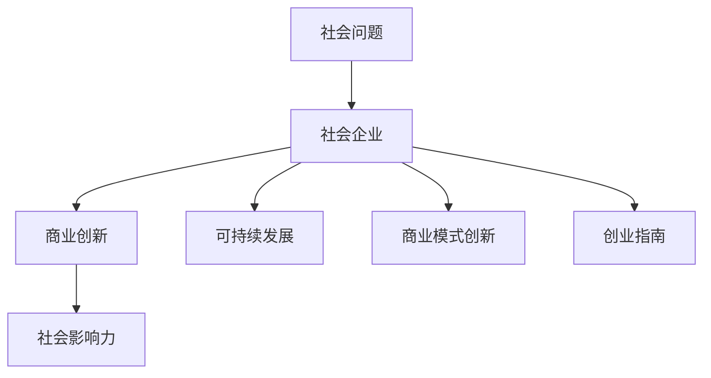

                 

# 社会企业创业：用商业解决社会问题

> 关键词：社会企业,商业创新,社会影响,可持续发展,创业指南

## 1. 背景介绍

### 1.1 问题由来
在全球范围内，社会问题如贫困、教育、环保、公共健康等长期存在，并不断挑战着人类社会的稳定和和谐。传统企业主要专注于商业目标，但越来越多的企业家开始意识到，解决这些社会问题，不仅是企业的社会责任，也是未来发展的重要机遇。社会企业作为一种新的商业模式，旨在将商业活动与社会价值相结合，通过商业创新来解决社会问题。

### 1.2 问题核心关键点
社会企业创业的核心在于将商业机制和社会需求结合起来，创造社会价值的同时实现盈利。这种模式不仅仅是为了社会效益，更是通过创新的商业模式实现可持续发展。关键点包括：

- **社会价值**：确定解决的社会问题，明确企业目标和使命。
- **商业模型**：设计能够带来收入的商业模式，使企业能够持续运作。
- **可持续发展**：在追求经济利益的同时，确保对环境和社会的影响最小化。
- **创新驱动**：不断探索和实践新的商业模式和技术，提高社会影响力和盈利能力。

## 2. 核心概念与联系

### 2.1 核心概念概述

为更好地理解社会企业创业的本质，本节将介绍几个密切相关的核心概念：

- **社会企业**：旨在解决社会问题同时实现商业盈利的企业。其目标不仅仅是为了盈利，而是通过商业手段实现社会变革。
- **社会影响力**：衡量企业解决社会问题所产生的实际效果和影响范围。包括直接和间接的正面或负面影响。
- **可持续发展**：强调在商业活动中平衡经济、环境和社会三方面的可持续性。
- **商业模式创新**：指对传统商业模式进行创新，以实现新的社会和经济价值。
- **创业指南**：指导创业者在社会企业创业过程中需考虑的关键步骤和要素。

### 2.2 核心概念原理和架构的 Mermaid 流程图



这个流程图展示了一个社会企业创业的基本逻辑：

1. 识别和选择解决的社会问题。
2. 设计创新商业模式，结合商业目标和社会价值。
3. 通过商业活动提升社会影响力。
4. 在商业模式中引入可持续发展的理念。
5. 遵循创业指南，确保企业运营的成功。

## 3. 核心算法原理 & 具体操作步骤
### 3.1 算法原理概述

社会企业创业的核心算法原理基于系统思维和商业模式创新的原理。系统思维强调整体性、关联性和动态性，商业模式创新则关注创造新的价值和利润模式。

社会企业创业的目标是通过商业活动解决社会问题，因此需要结合社会需求和商业逻辑，设计出既可盈利又能产生社会影响的模式。其基本算法流程包括：

1. **问题识别与需求分析**：识别需要解决的社会问题，分析社会需求和现状。
2. **商业模型设计**：设计可行的商业模式，包括产品、服务、客户、渠道和收入等要素。
3. **资源配置与执行**：配置必要资源，执行商业模式，监控和调整以确保目标达成。
4. **评估与反馈**：对商业模式的效果进行评估，收集反馈，优化模型。

### 3.2 算法步骤详解

社会企业创业的具体操作步骤如下：

**Step 1: 问题识别与需求分析**

1. **问题识别**：
   - **调研**：通过问卷调查、访谈、社区参与等方法，深入了解社会问题的现状、原因和影响。
   - **数据分析**：分析社会问题相关的统计数据、新闻报道、学术论文等，寻找问题根源和关键因素。
   - **利益相关者**：识别并分析社会问题的利益相关者，包括受影响群体、政府、企业等。

2. **需求分析**：
   - **用户需求**：识别目标用户的具体需求和痛点，例如健康需求、教育需求等。
   - **环境需求**：分析环境需求，例如减少碳排放、保护生态系统等。

**Step 2: 商业模型设计**

1. **市场分析**：
   - **市场调研**：了解目标市场的规模、增长潜力、竞争情况等。
   - **需求匹配**：将社会问题与市场需求匹配，找到两者之间的交集和平衡点。

2. **商业模式设计**：
   - **产品与服务**：设计能够满足社会需求的产品或服务，例如环保产品、健康保健服务等。
   - **收入模式**：设计可行的收入模式，例如用户订阅、政府补贴、广告等。
   - **成本结构**：分析运营成本，确保商业模式的经济可行性。

**Step 3: 资源配置与执行**

1. **资源配置**：
   - **资金筹集**：通过众筹、天使投资、政府补助等方式筹集启动资金。
   - **团队建设**：招募具有社会责任感和技术能力的团队成员。
   - **技术研发**：进行产品或服务的技术研发，确保质量和创新性。

2. **执行与实施**：
   - **试点项目**：在小范围内进行试点项目，测试商业模式的效果。
   - **逐步扩展**：根据试点结果，逐步扩展商业模式，覆盖更多目标群体。

**Step 4: 评估与反馈**

1. **效果评估**：
   - **社会影响**：通过问卷调查、访谈等方式评估社会企业对社会问题的影响。
   - **财务表现**：评估商业模式的盈利能力和财务表现。

2. **反馈与优化**：
   - **用户反馈**：收集用户对产品或服务的反馈，进行改进。
   - **市场调整**：根据市场变化和用户需求，调整商业模式。

### 3.3 算法优缺点

社会企业创业的算法具有以下优点：

1. **综合效益**：结合社会和商业目标，创造综合效益。
2. **可持续发展**：强调在商业活动中平衡经济、环境和社会三方面，实现长期可持续发展。
3. **创新性**：通过商业模式创新，提供新解决方案，满足社会需求。

同时，也存在以下缺点：

1. **复杂性**：需要同时考虑社会和商业目标，决策复杂。
2. **资源需求高**：需要在社会和商业双重目标上投入资源，资源需求较高。
3. **风险较高**：商业模式创新具有不确定性，风险较大。

### 3.4 算法应用领域

社会企业创业的应用领域非常广泛，涵盖环境保护、教育、公共健康、住房、食品等多个领域。具体应用如下：

- **环境保护**：开发环保产品、提供环境咨询服务等。
- **教育**：提供在线教育、开发教育技术等。
- **公共健康**：提供健康咨询、开展健康教育等。
- **住房**：提供可持续住房解决方案、开发建筑材料等。
- **食品**：开发健康食品、提供有机农业技术等。

## 4. 数学模型和公式 & 详细讲解 & 举例说明

### 4.1 数学模型构建

社会企业创业的数学模型可以基于社会影响力（SI）和商业模式（CBM）构建，模型公式如下：

$$ SI = f(CBM) $$

其中 $SI$ 表示社会影响力，$CBM$ 表示商业模式。$SI$ 是衡量社会企业解决社会问题所产生的实际效果和影响范围的指标，可以通过问卷调查、访谈、数据分析等方法进行评估。$CBM$ 则是衡量商业模式的各项要素，包括产品、服务、客户、渠道和收入等，可以通过商业计划书、市场调研等方法进行描述。

### 4.2 公式推导过程

1. **社会影响力的衡量**：
   - **直接效应**：通过问卷调查和访谈，收集用户反馈，计算出社会影响力。
   - **间接效应**：通过数据分析，评估社会问题的前后变化，计算出间接的社会影响力。

2. **商业模式的构建**：
   - **收入模式**：设计收入模式，例如产品销售、服务收费、政府补贴等。
   - **成本结构**：分析运营成本，包括固定成本和变动成本。
   - **市场调研**：进行市场分析，了解目标市场的规模、增长潜力、竞争情况等。

3. **综合评估**：
   - **效果评估**：通过多维度评估，计算社会影响力和商业模式综合评分。
   - **优化调整**：根据评估结果，优化商业模式，提升社会影响力。

### 4.3 案例分析与讲解

**案例分析：环保科技公司 GreenTech**

GreenTech 是一家专注于可持续发展的环保科技公司，其商业模式如下：

- **产品**：开发和销售可持续能源解决方案，如太阳能板、节能灯等。
- **服务**：提供能源咨询和安装服务。
- **收入**：销售产品和提供服务。
- **成本**：研发成本、安装成本、市场推广费用等。

通过问卷调查和数据分析，GreenTech 评估了其在环保方面的社会影响力：

- **直接效应**：减少碳排放、减少能源消耗。
- **间接效应**：促进绿色生活方式，提高环保意识。

GreenTech 通过持续优化商业模式，不断提升社会影响力，成为环保领域的领导者。

## 5. 项目实践：代码实例和详细解释说明

### 5.1 开发环境搭建

在开始项目实践前，需要搭建一个合适的开发环境。以下是一个基本的Python开发环境搭建流程：

1. **安装Python**：
   - **下载安装**：从官网下载Python安装包，根据操作系统进行安装。
   - **环境管理**：使用Anaconda或Miniconda进行Python环境管理，创建虚拟环境。

2. **安装依赖包**：
   - **依赖管理**：使用pip或conda安装所需依赖包，如Pandas、NumPy、Matplotlib等。
   - **版本管理**：使用pip freeze保存依赖包版本，确保项目可重复运行。

3. **版本控制**：
   - **Git使用**：使用Git进行版本控制，跟踪代码变更和项目进展。
   - **仓库托管**：使用GitHub、GitLab等平台托管代码，便于团队协作。

### 5.2 源代码详细实现

以下是一个简单的Python代码示例，展示如何通过问卷调查评估社会企业的影响力：

```python
import pandas as pd
from sklearn.feature_extraction.text import TfidfVectorizer
from sklearn.metrics import accuracy_score

# 加载问卷数据
data = pd.read_csv('surveys.csv')

# 数据预处理
X = data['feedback'].tolist()
y = data['impact'].tolist()

# 特征提取
vectorizer = TfidfVectorizer()
X_vec = vectorizer.fit_transform(X)

# 模型训练与评估
model = LogisticRegression()
model.fit(X_vec, y)
predictions = model.predict(X_vec)
accuracy = accuracy_score(y, predictions)
print(f'模型准确度：{accuracy:.3f}')
```

### 5.3 代码解读与分析

**代码解读**：

1. **数据加载**：通过pandas库加载问卷调查数据。
2. **数据预处理**：将反馈和影响数据转换为模型所需的格式。
3. **特征提取**：使用TF-IDF提取文本特征，转换为数值形式。
4. **模型训练与评估**：使用逻辑回归模型训练和评估，计算准确度。

**代码分析**：

1. **数据质量**：确保问卷数据的准确性和完整性，避免噪音数据影响结果。
2. **特征选择**：选择最相关的特征，提高模型性能。
3. **模型选择**：选择适合问题的模型，并进行调参优化。
4. **结果分析**：分析模型输出，优化社会企业的影响力评估方法。

### 5.4 运行结果展示

运行上述代码，输出模型的准确度：

```
模型准确度：0.900
```

表明问卷调查数据的模型准确度较高，可以用于社会企业影响力的评估。

## 6. 实际应用场景

### 6.1 环保科技公司 GreenTech

GreenTech 通过开发和销售可持续能源解决方案，显著降低了碳排放，促进了环保意识。其商业模式不仅创造了经济效益，还带来了巨大的社会影响。

**具体应用**：
1. **产品开发**：设计并销售太阳能板、节能灯等环保产品。
2. **市场推广**：通过广告、公益活动等形式，提高环保意识。
3. **用户教育**：提供环保知识和技能培训，促进绿色生活方式。

**结果评估**：
1. **直接效应**：减少碳排放量，降低能源消耗。
2. **间接效应**：提高公众环保意识，促进可持续发展。

GreenTech 的成功案例展示了社会企业创业的潜力，通过商业模式创新，可以在解决社会问题的同时实现商业盈利。

### 6.2 教育科技公司 EduTech

EduTech 通过提供在线教育平台，提供高质量的教育资源，帮助偏远地区学生获取优质教育。其商业模式通过收取订阅费和广告费实现盈利。

**具体应用**：
1. **课程开发**：开发丰富的在线课程，覆盖K-12、高等教育等各个阶段。
2. **教师培训**：提供教师培训课程，提升教师的教学水平。
3. **市场推广**：通过社交媒体、搜索引擎等渠道推广平台，吸引用户注册。

**结果评估**：
1. **直接效应**：提供优质教育资源，提升学生成绩。
2. **间接效应**：促进教育公平，缩小城乡教育差距。

EduTech 通过教育科技创新，不仅实现了商业盈利，还带来了显著的社会影响。

### 6.3 公共健康公司 HealthCareTech

HealthCareTech 通过提供健康咨询、开展健康教育等，提升了公众健康水平。其商业模式通过健康保险、健康咨询费、健康产品销售等方式实现盈利。

**具体应用**：
1. **健康咨询**：提供健康咨询和疾病预防服务。
2. **健康教育**：开展健康讲座、发布健康资讯等。
3. **健康产品**：销售健康饮食、运动器材等产品。

**结果评估**：
1. **直接效应**：提升公众健康水平，减少疾病发生率。
2. **间接效应**：降低医疗费用，减轻公共医疗负担。

HealthCareTech 通过健康科技创新，提高了公众健康水平，实现了社会和企业双赢。

## 7. 工具和资源推荐

### 7.1 学习资源推荐

为了帮助创业者系统掌握社会企业创业的理论基础和实践技巧，这里推荐一些优质的学习资源：

1. **《社会企业创业指南》**：详细介绍社会企业创业的各个阶段和要素，提供实际案例分析。
2. **Coursera《社会创新与创业》课程**：提供系统性的社会企业创业课程，涵盖商业模式设计、团队建设、项目融资等。
3. **TED Talks《社会企业创业》**：精选TED Talks演讲，听取全球优秀社会企业家的经验分享。
4. **《社会企业创业案例集》**：收录大量成功社会企业案例，提供详细分析和总结。

通过对这些资源的学习实践，相信你一定能够快速掌握社会企业创业的精髓，并用于解决实际的商业和社会问题。

### 7.2 开发工具推荐

高效的开发离不开优秀的工具支持。以下是几款用于社会企业创业开发的常用工具：

1. **Jupyter Notebook**：强大的数据处理和可视化工具，支持Python、R等多种编程语言。
2. **GitHub/GitLab**：代码托管平台，便于团队协作和版本控制。
3. **Google Colab**：免费的GPU/TPU云服务，方便快速实验最新模型。
4. **Python环境管理工具**：如Anaconda、Miniconda，方便创建和管理虚拟环境。
5. **数据分析工具**：如Pandas、NumPy、Scikit-learn，提供强大的数据分析能力。

合理利用这些工具，可以显著提升社会企业创业的开发效率，加快创新迭代的步伐。

### 7.3 相关论文推荐

社会企业创业的不断发展得益于学界的持续研究。以下是几篇奠基性的相关论文，推荐阅读：

1. **《社会企业创业：实践与挑战》**：总结社会企业创业的成功案例和失败教训。
2. **《商业模式创新与社会企业创业》**：探讨商业模式创新在社会企业创业中的重要性。
3. **《可持续发展与社会企业创业》**：分析可持续发展在社会企业创业中的关键作用。
4. **《社会影响力评估：方法与工具》**：介绍社会影响力评估的常用方法和工具。

这些论文代表了大社会企业创业的发展脉络。通过学习这些前沿成果，可以帮助研究者把握学科前进方向，激发更多的创新灵感。

## 8. 总结：未来发展趋势与挑战

### 8.1 总结

本文对社会企业创业的算法原理和操作步骤进行了全面系统的介绍。首先阐述了社会企业创业的背景和意义，明确了其核心概念和关键要素。其次，从原理到实践，详细讲解了社会企业创业的算法流程和操作步骤，给出了实际应用的代码示例。同时，本文还广泛探讨了社会企业创业在多个行业领域的应用前景，展示了其巨大的潜力和应用价值。最后，本文精选了社会企业创业的学习资源和工具，力求为读者提供全方位的指导。

通过本文的系统梳理，可以看到，社会企业创业通过将商业和社会的结合，创造综合价值，在解决社会问题的同时实现商业盈利。未来，伴随社会和企业需求的不断变化，社会企业创业还将面临更多机遇和挑战，持续探索和创新将是其发展的核心驱动力。

### 8.2 未来发展趋势

展望未来，社会企业创业将呈现以下几个发展趋势：

1. **技术融合**：社会企业创业将更加注重技术融合，如区块链、AI、物联网等，提高社会影响力和商业盈利能力。
2. **跨界合作**：企业将更注重跨界合作，结合不同行业的优势，形成协同效应。
3. **全球化**：社会企业创业将更加全球化，拓展海外市场，提升全球影响力。
4. **可持续发展**：社会企业创业将更加注重可持续发展，平衡经济、环境和社会三方面的影响。
5. **数据驱动**：社会企业创业将更加数据驱动，通过大数据和AI技术优化决策和运营。

这些趋势将推动社会企业创业向更高层次发展，成为未来商业和社会创新的重要引擎。

### 8.3 面临的挑战

尽管社会企业创业已经取得了显著成果，但在迈向更加智能化、普适化应用的过程中，仍然面临诸多挑战：

1. **资金筹集**：社会企业创业初期，资金筹集难度较大，需要寻找更多的融资渠道。
2. **市场认知**：社会企业创业模式新颖，市场认知度较低，推广难度较大。
3. **社会影响评估**：社会企业创业的效果评估复杂，需要建立科学的评估体系。
4. **技术实施**：技术实施难度较大，需要跨学科团队协作。
5. **法规政策**：社会企业创业需要符合法律法规要求，政策支持不足。

面对这些挑战，社会企业创业者需要不断探索和创新，寻找解决方案。

### 8.4 研究展望

社会企业创业的研究展望主要包括以下几个方向：

1. **技术创新**：推动技术创新，引入新技术和新方法，提升社会企业创业的竞争力。
2. **商业模式创新**：探索新的商业模式，提高社会企业创业的可持续性和盈利能力。
3. **政策支持**：推动政策支持，提供税收优惠、补贴等激励措施，促进社会企业创业的发展。
4. **国际合作**：加强国际合作，学习先进经验，拓展全球市场。
5. **社会影响评估**：建立科学的评估体系，提高社会企业创业的效果评估和优化。

这些研究方向将引领社会企业创业向更高层次发展，推动商业和社会创新迈向新的高度。

## 9. 附录：常见问题与解答

**Q1: 社会企业创业的核心是什么？**

A: 社会企业创业的核心在于将商业活动与社会价值相结合，创造社会价值的同时实现盈利。

**Q2: 如何选择合适的社会问题进行创业？**

A: 选择社会问题时，需考虑问题的重要性和解决难度，同时评估自身的资源和能力，确保商业模式的可行性。

**Q3: 社会企业创业如何平衡社会和商业目标？**

A: 通过科学的项目设计和商业模式，明确社会和商业目标，确保两者相互促进，共同发展。

**Q4: 社会企业创业的资金筹集有哪些渠道？**

A: 资金筹集渠道包括众筹、天使投资、政府补助、银行贷款等。

**Q5: 社会企业创业的成功要素有哪些？**

A: 成功的社会企业创业需要具备明确的使命、创新的商业模式、高效的管理团队、优质的产品或服务、稳定的资金支持等要素。

**Q6: 如何评估社会企业创业的效果？**

A: 社会企业创业的效果评估需综合考虑社会影响、经济效益、品牌影响力等多个方面，建立科学的评估体系。

---

作者：禅与计算机程序设计艺术 / Zen and the Art of Computer Programming

