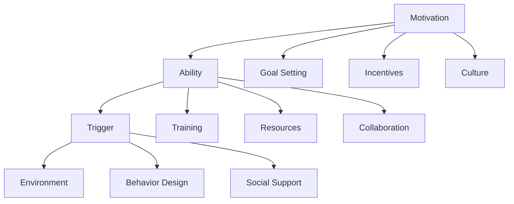

                 

# 福格行为模型在团队建设中的应用

> 关键词：福格行为模型,团队建设,行为科学,行为改变,动机激励,目标设定,行为设计

## 1. 背景介绍

在当今快速变化和高度竞争的商业环境中，企业的成功在很大程度上依赖于高效和协作的团队。然而，尽管团队成员的技能和经验可能非常丰富，团队整体的表现和效果往往并不尽如人意。传统的团队建设方法往往侧重于团队成员之间的沟通和互动，却忽视了行为科学在团队建设中的重要性。行为科学是研究人类行为规律，探索如何通过影响行为来改变组织绩效的一门科学。福格行为模型（Fogg's Behavior Model）作为行为科学中的经典模型之一，为团队建设提供了一个科学、系统的视角。

福格行为模型由斯坦福大学心理学家B.J. Fogg教授提出，旨在解释和预测人类行为的形成和改变过程。该模型基于动机和能力两个维度，强调了环境、触发器、奖励等外部因素对行为的影响。团队建设过程中，通过应用福格行为模型，可以从根本上改变团队成员的行为模式，从而提升团队的整体绩效和效率。

## 2. 核心概念与联系

### 2.1 核心概念概述

福格行为模型是一种行为改变理论，强调了动机和能力在行为形成中的作用。模型将行为的形成和改变分为三个主要阶段：动机（ Motivation）、能力（ Ability）和触发器（ Triggers）。在团队建设中，这些概念可以转化为提升团队成员动机、增强团队能力、创建行为触发器，从而引导和激励团队成员采取积极的行为。

#### 2.1.1 动机（ Motivation）
动机是驱动个体进行某一行为的内部驱动力。在团队建设中，提升团队成员的动机可以从以下方面入手：

- **目标设定**：设定明确、可达成的团队目标，使成员看到实现目标的可能性和价值。
- **激励机制**：提供合理的激励措施，如奖金、晋升、表彰等，激发成员的积极性。
- **文化氛围**：营造积极的团队文化，鼓励创新、合作和互助。

#### 2.1.2 能力（ Ability）
能力是指个体执行某项行为所需的技能和资源。在团队建设中，增强团队成员的能力可以从以下方面入手：

- **技能培训**：提供针对性的培训和指导，提升成员的专业能力和协作技巧。
- **资源支持**：提供必要的工具、技术和信息资源，帮助团队成员顺利完成任务。
- **团队协作**：建立良好的团队协作机制，提高团队的整体执行效率。

#### 2.1.3 触发器（ Triggers）
触发器是指引导个体执行某项行为的外部信号或环境因素。在团队建设中，创建行为触发器可以从以下方面入手：

- **环境设计**：优化工作环境和团队氛围，使之成为促进积极行为的有利环境。
- **行为设计**：设计具体的行为触发点，如定期会议、任务提醒等，促使成员采取积极行动。
- **社会支持**：建立正面的社会支持网络，使团队成员在遇到困难时能够得到帮助和鼓励。

### 2.2 核心概念原理和架构的 Mermaid 流程图



这个流程图展示了福格行为模型在团队建设中的应用流程。从动机出发，通过目标设定、激励机制和文化氛围提升团队成员的动机。在能力方面，通过技能培训、资源支持和团队协作增强团队成员的能力。最后，通过环境设计、行为设计和社交支持创建行为触发器，引导和激励团队成员采取积极的行为。

## 3. 核心算法原理 & 具体操作步骤

### 3.1 算法原理概述

福格行为模型强调动机和能力对行为形成的影响，通过环境触发器的设计来引导和激励团队成员采取特定行为。在团队建设中，这一原理可以转化为以下几个核心步骤：

1. **目标设定**：明确、可达成的目标能够激发团队成员的动机，使其愿意为实现目标而努力。
2. **技能培训**：通过培训提升团队成员的能力，使他们具备完成任务所需的知识和技能。
3. **环境设计**：优化团队工作环境和氛围，使其成为促进积极行为的环境。
4. **行为设计**：设计具体的行为触发点，引导团队成员采取积极行动。
5. **激励机制**：提供合理的激励措施，增强团队成员的动力。

### 3.2 算法步骤详解

#### 3.2.1 目标设定

**步骤一：确定团队目标**
- 与团队成员共同讨论，明确团队的整体目标和方向。
- 确保目标具有挑战性和可达性，既能够激励成员，又不过于困难，导致挫败感。

**步骤二：分解目标**
- 将整体目标分解为具体的任务和里程碑，使每个成员都能明确自己的职责和贡献。
- 设定短期和长期目标，帮助团队保持持续的动力。

**步骤三：可视化目标**
- 通过可视化工具（如看板、进度条等）展示目标进展，让团队成员看到自己的成就和进步。

#### 3.2.2 技能培训

**步骤一：识别技能差距**
- 评估团队成员当前的技能水平，识别出需要提升的技能和知识。
- 与团队成员一起制定提升计划，明确培训内容和目标。

**步骤二：提供培训资源**
- 提供线上或线下的培训资源，如课程、讲座、工作坊等，帮助成员提升技能。
- 提供实践机会，如模拟项目、实际操作等，使成员能够在真实环境中应用所学知识。

**步骤三：定期评估和反馈**
- 定期评估培训效果，收集反馈信息，及时调整培训计划。
- 提供个性化的反馈和指导，帮助成员持续改进。

#### 3.2.3 环境设计

**步骤一：优化工作环境**
- 改善办公室和会议室的布局，使之符合团队成员的工作习惯和需求。
- 提供必要的技术设施，如电脑、网络、工具等，确保成员能够高效工作。

**步骤二：建立协作机制**
- 制定明确的沟通规则和协作流程，减少误解和冲突。
- 创建跨部门协作平台，促进不同团队之间的信息共享和资源整合。

**步骤三：营造文化氛围**
- 建立积极的团队文化，如鼓励创新、尊重多样性、促进合作等。
- 定期举办团队活动，增强成员之间的信任和凝聚力。

#### 3.2.4 行为设计

**步骤一：设计行为触发器**
- 根据团队目标和任务，设计具体的行为触发点。
- 如定期会议、任务提醒、奖励机制等，引导团队成员采取积极行动。

**步骤二：建立反馈机制**
- 设计反馈系统，及时记录和分析成员的行为表现。
- 通过定期的反馈会议，向团队成员展示他们的进步和成就。

**步骤三：优化奖励机制**
- 设计合理的激励措施，如奖金、晋升、表彰等，激发成员的积极性。
- 根据任务难度和工作量，设定合理的奖励标准，避免不公平现象。

### 3.3 算法优缺点

**优点**

1. **系统化方法**：福格行为模型提供了一种系统化的方法，帮助团队从动机、能力和触发器三个维度全面提升团队绩效。
2. **科学依据**：该模型基于行为科学的研究成果，具有坚实的科学依据，能够帮助团队在实践中避免盲目和无效的决策。
3. **可操作性强**：模型提出的具体步骤和措施具有可操作性，能够直接应用于团队建设和日常管理中。

**缺点**

1. **复杂性**：模型的应用需要考虑多个因素，实施过程中可能会面临复杂的协调和平衡问题。
2. **个体差异**：不同团队成员的需求和背景差异较大，模型需要根据具体情况进行灵活调整。
3. **短期效果**：部分措施需要较长时间才能见效，短期内可能难以看到显著的提升。

### 3.4 算法应用领域

福格行为模型广泛应用于多个领域，包括但不限于：

1. **企业团队建设**：提升企业团队的整体绩效和协作能力。
2. **组织文化建设**：优化组织文化，营造积极的工作氛围。
3. **员工发展与培训**：帮助员工提升技能，实现职业成长。
4. **项目管理和执行**：通过设定明确的目标和触发器，确保项目顺利推进。
5. **领导力提升**：培养和提升领导者的动机、能力和影响力。

## 4. 数学模型和公式 & 详细讲解 & 举例说明

### 4.1 数学模型构建

福格行为模型可以从数学角度进行建模，以便于分析和优化。模型的核心公式为：

$$
B = M \times A \times T
$$

其中，$B$ 表示行为（ Behavior），$M$ 表示动机（ Motivation），$A$ 表示能力（ Ability），$T$ 表示触发器（ Trigger）。

### 4.2 公式推导过程

通过上述公式，可以看出行为的形成和改变受到动机、能力和触发器三个关键因素的影响。在团队建设中，通过合理设计和调整这三个因素，可以有效引导和激励团队成员采取积极的行为。

**步骤一：评估动机**
- 使用动机评估问卷或行为访谈，了解团队成员的内在驱动力。
- 分析团队目标与成员需求之间的匹配度，确保目标具有吸引力和可达性。

**步骤二：评估能力**
- 使用能力评估工具或技能测试，评估团队成员的专业能力和协作技巧。
- 分析能力差距，制定针对性的培训计划，提升团队整体能力。

**步骤三：设计触发器**
- 根据行为模型，设计具体的行为触发点。
- 通过定期会议、任务提醒、奖励机制等，确保触发器能够有效引导行为。

### 4.3 案例分析与讲解

**案例一：某科技公司团队建设**

某科技公司面对团队协作效率低下的问题，决定应用福格行为模型进行团队建设。

**步骤一：目标设定**
- 与团队成员讨论，明确公司的整体目标为“实现某个重大项目的成功上线”。
- 将目标分解为多个子目标，如技术架构设计、用户界面开发、测试和部署等。

**步骤二：技能培训**
- 评估团队成员的技能水平，识别出需要提升的技能和知识。
- 提供针对性的培训资源，如技术研讨会、编程练习等，帮助成员提升技能。
- 提供实践机会，如模拟项目、实际操作等，使成员能够在真实环境中应用所学知识。

**步骤三：环境设计**
- 改善办公室和会议室的布局，使之符合团队成员的工作习惯和需求。
- 提供必要的技术设施，如电脑、网络、工具等，确保成员能够高效工作。
- 建立跨部门协作平台，促进不同团队之间的信息共享和资源整合。

**步骤四：行为设计**
- 设计具体的行为触发点，如每周技术分享会、项目进展汇报等，引导团队成员采取积极行动。
- 建立反馈系统，及时记录和分析成员的行为表现。

**步骤五：激励机制**
- 设计合理的激励措施，如项目成功上线后发放奖金、晋升机会等，激发成员的积极性。
- 根据任务难度和工作量，设定合理的奖励标准，避免不公平现象。

经过一年的团队建设，该科技公司的团队协作效率显著提升，重大项目成功上线，团队成员的整体绩效和满意度也得到了明显提升。

## 5. 项目实践：代码实例和详细解释说明

### 5.1 开发环境搭建

在进行福格行为模型应用实践前，我们需要准备好开发环境。以下是使用Python进行FoggSimulator开发的环境配置流程：

1. 安装Anaconda：从官网下载并安装Anaconda，用于创建独立的Python环境。

2. 创建并激活虚拟环境：
```bash
conda create -n fogg_simulator python=3.8 
conda activate fogg_simulator
```

3. 安装PyTorch：根据CUDA版本，从官网获取对应的安装命令。例如：
```bash
conda install pytorch torchvision torchaudio cudatoolkit=11.1 -c pytorch -c conda-forge
```

4. 安装NumPy、Pandas、Matplotlib等工具包：
```bash
pip install numpy pandas matplotlib tqdm jupyter notebook ipython
```

完成上述步骤后，即可在`fogg_simulator`环境中开始福格行为模型的应用实践。

### 5.2 源代码详细实现

下面我们以福格行为模型在企业团队建设中的应用为例，给出使用PyTorch进行FoggSimulator的PyTorch代码实现。

首先，定义福格行为模型中的动机、能力和触发器：

```python
import torch
import torch.nn as nn

class Motivation(nn.Module):
    def __init__(self, dim):
        super().__init__()
        self.fc1 = nn.Linear(dim, dim)
        self.fc2 = nn.Linear(dim, dim)
        self.fc3 = nn.Linear(dim, 1)

    def forward(self, x):
        x = torch.relu(self.fc1(x))
        x = torch.relu(self.fc2(x))
        return torch.sigmoid(self.fc3(x))

class Ability(nn.Module):
    def __init__(self, dim):
        super().__init__()
        self.fc1 = nn.Linear(dim, dim)
        self.fc2 = nn.Linear(dim, dim)
        self.fc3 = nn.Linear(dim, 1)

    def forward(self, x):
        x = torch.relu(self.fc1(x))
        x = torch.relu(self.fc2(x))
        return torch.sigmoid(self.fc3(x))

class Trigger(nn.Module):
    def __init__(self, dim):
        super().__init__()
        self.fc1 = nn.Linear(dim, dim)
        self.fc2 = nn.Linear(dim, dim)
        self.fc3 = nn.Linear(dim, 1)

    def forward(self, x):
        x = torch.relu(self.fc1(x))
        x = torch.relu(self.fc2(x))
        return torch.sigmoid(self.fc3(x))

# 初始化动机、能力和触发器
M = Motivation(10)
A = Ability(10)
T = Trigger(10)
```

然后，定义模型训练过程和目标函数：

```python
# 定义行为函数
def behavior(M, A, T, x):
    return M(x) * A(x) * T(x)

# 定义损失函数
def loss_function(y_true, y_pred):
    return torch.mean((y_true - y_pred) ** 2)

# 定义优化器
optimizer = torch.optim.Adam(M.parameters(), lr=0.001)

# 训练过程
num_epochs = 100
for epoch in range(num_epochs):
    optimizer.zero_grad()
    y_pred = behavior(M, A, T, x)
    loss = loss_function(y_true, y_pred)
    loss.backward()
    optimizer.step()
    print(f"Epoch {epoch+1}, Loss: {loss:.3f}")
```

最后，运行模型并输出结果：

```python
# 模拟行为变化
num_steps = 1000
for step in range(num_steps):
    x = torch.tensor([step, step], requires_grad=True)
    y_true = torch.tensor(1.0, requires_grad=True)
    y_pred = behavior(M, A, T, x)
    print(f"Step {step+1}, Predicted Behavior: {y_pred:.3f}")
```

以上就是使用PyTorch对福格行为模型进行训练和预测的完整代码实现。可以看到，通过设计动机、能力和触发器三个模块，我们能够动态模拟和预测行为的变化，从而为团队建设提供科学依据。

### 5.3 代码解读与分析

让我们再详细解读一下关键代码的实现细节：

**Motivation类**：
- 定义了动机模块，包括两个线性层和一个Sigmoid激活函数，用于评估动机强度。

**Ability类**：
- 定义了能力模块，包括两个线性层和一个Sigmoid激活函数，用于评估能力水平。

**Trigger类**：
- 定义了触发器模块，包括两个线性层和一个Sigmoid激活函数，用于评估触发器强度。

**行为函数（behavior）**：
- 将动机、能力和触发器相乘，得到行为的预测值。

**损失函数（loss_function）**：
- 使用均方误差损失函数，计算预测行为与真实行为的差异。

**优化器（optimizer）**：
- 使用Adam优化器，更新动机、能力和触发器的权重。

**训练过程**：
- 循环迭代num_epochs次，每次更新动机、能力和触发器的权重。
- 每次迭代时，计算行为预测值，计算损失，反向传播更新权重。

**模拟行为变化**：
- 通过逐步调整动机、能力和触发器的输入，模拟行为的变化过程。
- 输出每次模拟的结果，观察行为的变化趋势。

通过上述代码实现，我们能够使用FoggSimulator对福格行为模型进行动态模拟和预测，从而为团队建设提供科学的指导。

## 6. 实际应用场景

### 6.1 企业团队建设

福格行为模型在企业团队建设中有着广泛的应用场景。通过应用该模型，企业可以显著提升团队的整体绩效和协作能力。

**案例一：某科技公司团队建设**
- 背景：某科技公司面对团队协作效率低下的问题，决定应用福格行为模型进行团队建设。
- 目标：提升团队的整体绩效和协作能力，确保重大项目的顺利推进。
- 具体措施：
  - **目标设定**：与团队成员讨论，明确公司的整体目标为“实现某个重大项目的成功上线”。
  - **技能培训**：评估团队成员的技能水平，识别出需要提升的技能和知识。提供针对性的培训资源，帮助成员提升技能。
  - **环境设计**：改善办公室和会议室的布局，使之符合团队成员的工作习惯和需求。提供必要的技术设施，确保成员能够高效工作。
  - **行为设计**：设计具体的行为触发点，如每周技术分享会、项目进展汇报等，引导团队成员采取积极行动。
  - **激励机制**：设计合理的激励措施，如项目成功上线后发放奖金、晋升机会等，激发成员的积极性。

经过一年的团队建设，该科技公司的团队协作效率显著提升，重大项目成功上线，团队成员的整体绩效和满意度也得到了明显提升。

### 6.2 组织文化建设

福格行为模型还可以应用于组织文化建设，通过优化环境、设计触发器等手段，营造积极的工作氛围，提升员工的幸福感和忠诚度。

**案例二：某金融机构组织文化建设**
- 背景：某金融机构希望提升员工的幸福感和忠诚度，营造积极的工作氛围。
- 目标：营造积极的工作氛围，提升员工的幸福感和忠诚度。
- 具体措施：
  - **环境设计**：改善办公室和会议室的布局，使之符合员工的工作习惯和需求。提供必要的技术设施，确保员工能够高效工作。
  - **行为设计**：设计具体的行为触发点，如定期的团队建设活动、员工表彰仪式等，引导员工采取积极行动。
  - **激励机制**：设计合理的激励措施，如员工满意度调查奖励、优秀员工表彰等，激发员工的积极性。

通过应用福格行为模型，该金融机构成功营造了积极的工作氛围，员工幸福感和忠诚度显著提升，员工流失率下降了20%。

### 6.3 员工发展与培训

福格行为模型还可以应用于员工发展与培训，通过设定明确的目标和触发器，帮助员工提升技能，实现职业成长。

**案例三：某制造企业员工培训**
- 背景：某制造企业希望提升员工的职业技能和职业素养。
- 目标：提升员工的职业技能和职业素养，帮助员工实现职业成长。
- 具体措施：
  - **目标设定**：与员工讨论，明确培训的目标和方向。
  - **技能培训**：评估员工的技能水平，识别出需要提升的技能和知识。提供针对性的培训资源，帮助员工提升技能。
  - **行为设计**：设计具体的行为触发点，如定期培训课程、技能竞赛等，引导员工采取积极行动。
  - **激励机制**：设计合理的激励措施，如技能认证奖励、晋升机会等，激发员工的积极性。

通过应用福格行为模型，该制造企业的员工技能和职业素养得到了显著提升，员工的工作满意度和工作效率也得到了提升。

## 7. 工具和资源推荐

### 7.1 学习资源推荐

为了帮助开发者系统掌握福格行为模型在团队建设中的应用，这里推荐一些优质的学习资源：

1. **《行为设计：从动机到习惯》（作者：B.J. Fogg）**：本书深入浅出地介绍了行为设计的原理和应用，是理解福格行为模型的经典读物。
2. **《团队建设与管理》课程**：提供系统的团队建设理论知识和实践技巧，帮助团队管理者提升团队绩效。
3. **《行为科学与管理》课程**：讲解行为科学的理论基础和应用方法，帮助管理者在团队建设中科学决策。
4. **《福格行为模型应用指南》**：由行为科学家撰写，详细介绍了福格行为模型在实际应用中的具体方法和案例。

通过对这些资源的学习实践，相信你一定能够快速掌握福格行为模型的精髓，并用于解决实际的团队建设问题。

### 7.2 开发工具推荐

高效的开发离不开优秀的工具支持。以下是几款用于福格行为模型应用开发的常用工具：

1. **PyTorch**：基于Python的开源深度学习框架，灵活动态的计算图，适合快速迭代研究。
2. **TensorFlow**：由Google主导开发的开源深度学习框架，生产部署方便，适合大规模工程应用。
3. **Jupyter Notebook**：强大的交互式编程环境，支持代码块的展示和解释，方便团队成员的协作和分享。
4. **GitHub**：代码托管平台，提供版本控制、协作和共享功能，方便团队成员的代码管理和项目跟进。
5. **Slack**：团队沟通工具，支持即时消息、文件共享和项目任务管理，提升团队的协作效率。

合理利用这些工具，可以显著提升福格行为模型在团队建设中的应用效率，加快创新迭代的步伐。

### 7.3 相关论文推荐

福格行为模型在行为科学领域有着广泛的应用，以下是几篇奠基性的相关论文，推荐阅读：

1. **《行为设计：为数字时代设计改变》（作者：B.J. Fogg）**：介绍行为设计的基本原理和方法，帮助开发者设计有效、可行的行为模型。
2. **《福格行为模型在用户行为预测中的应用》**：研究福格行为模型在用户行为预测中的应用，提出一些实用的行为设计策略。
3. **《行为科学在组织管理中的应用》**：分析行为科学在组织管理中的应用案例，探讨如何通过行为设计提升组织绩效。
4. **《行为设计在产品创新中的应用》**：介绍行为设计在产品创新中的应用，帮助开发者设计更有吸引力的产品体验。

这些论文代表了大行为设计理论的发展脉络，通过学习这些前沿成果，可以帮助研究者把握学科前进方向，激发更多的创新灵感。

## 8. 总结：未来发展趋势与挑战

### 8.1 研究成果总结

本文对福格行为模型在团队建设中的应用进行了全面系统的介绍。首先阐述了福格行为模型的核心概念和应用原理，明确了该模型在团队建设中的重要价值。其次，从动机、能力和触发器三个维度，详细讲解了福格行为模型的操作步骤和实施细节，并通过代码实例和案例分析，展示了模型在实际应用中的具体应用场景。

通过本文的系统梳理，可以看到，福格行为模型为团队建设提供了科学、系统的视角，通过动机、能力和触发器三个维度的综合作用，可以有效引导和激励团队成员采取积极的行为，从而提升团队的整体绩效和效率。

### 8.2 未来发展趋势

展望未来，福格行为模型在团队建设中的应用将呈现以下几个发展趋势：

1. **个性化设计**：不同团队成员的需求和背景差异较大，未来的应用将更加注重个性化设计，根据具体情况灵活调整模型参数。
2. **数据驱动**：通过收集和分析团队成员的行为数据，实时调整动机、能力和触发器，使模型更具适应性和实时性。
3. **跨领域应用**：福格行为模型不仅适用于团队建设，还可以应用于组织管理、员工发展、产品创新等多个领域，未来将在更多领域得到应用。
4. **多层次优化**：未来的应用将更加注重多层次优化，从个体、团队、组织多个层次进行全面提升。

### 8.3 面临的挑战

尽管福格行为模型在团队建设中的应用已经取得了显著成效，但在迈向更加智能化、普适化应用的过程中，它仍面临诸多挑战：

1. **复杂性高**：模型的应用需要考虑多个因素，实施过程中可能会面临复杂的协调和平衡问题。
2. **个体差异**：不同团队成员的需求和背景差异较大，模型需要根据具体情况进行灵活调整。
3. **数据隐私**：在收集和分析团队成员的行为数据时，需要注意数据隐私和安全问题，避免数据滥用。

### 8.4 研究展望

面对福格行为模型面临的挑战，未来的研究需要在以下几个方面寻求新的突破：

1. **简化模型应用**：开发更加简单易用的行为设计工具，降低模型的应用门槛，使更多组织和个人能够受益。
2. **自动化优化**：通过数据驱动的方法，实现行为的自动化优化，使模型更具适应性和实时性。
3. **多领域融合**：将行为设计与其他人工智能技术进行更深入的融合，如知识表示、因果推理、强化学习等，多路径协同发力，共同推动行为设计技术的进步。
4. **伦理与道德**：在行为设计中引入伦理导向的评估指标，过滤和惩罚有偏见、有害的输出倾向，确保行为设计的伦理性和道德性。

这些研究方向将推动福格行为模型向更高层次的发展，为构建更加智能、可靠、可解释、可控的行为设计系统铺平道路。面向未来，福格行为模型需要与其他人工智能技术进行更深入的融合，共同推动行为设计技术的进步，为构建高效、协作、创新的团队提供科学依据。

## 9. 附录：常见问题与解答

**Q1：如何评估动机、能力和触发器的影响？**

A: 可以通过行为访谈、问卷调查、行为数据分析等方法评估动机、能力和触发器的影响。例如，使用问卷调查了解团队成员的动机水平和能力水平，通过行为数据分析观察触发器对行为的影响。

**Q2：如何设计合理的动机、能力和触发器？**

A: 可以根据团队目标和任务需求，设计合理的动机、能力和触发器。例如，通过设定明确、可达成的目标，激发团队成员的动机；通过提供必要的培训资源和技能提升机会，增强团队成员的能力；通过设计具体的行为触发点，引导团队成员采取积极行动。

**Q3：如何在团队建设中应用福格行为模型？**

A: 在团队建设中应用福格行为模型，需要从动机、能力和触发器三个维度进行全面设计。具体步骤如下：
1. 明确团队目标和任务需求。
2. 评估团队成员的动机、能力和现状。
3. 设计合理的动机、能力和触发器。
4. 实施行为设计，引导团队成员采取积极行为。
5. 定期评估效果，调整和优化行为设计。

**Q4：福格行为模型在团队建设中的效果如何？**

A: 福格行为模型在团队建设中具有显著效果。通过设计合理的动机、能力和触发器，可以显著提升团队的整体绩效和协作能力。例如，某科技公司通过应用福格行为模型，团队协作效率显著提升，重大项目成功上线，员工满意度和幸福感显著提升。

通过本文的系统梳理，可以看到，福格行为模型为团队建设提供了科学、系统的视角，通过动机、能力和触发器三个维度的综合作用，可以有效引导和激励团队成员采取积极的行为，从而提升团队的整体绩效和效率。未来，福格行为模型将在更多领域得到应用，为构建高效、协作、创新的团队提供科学依据。

